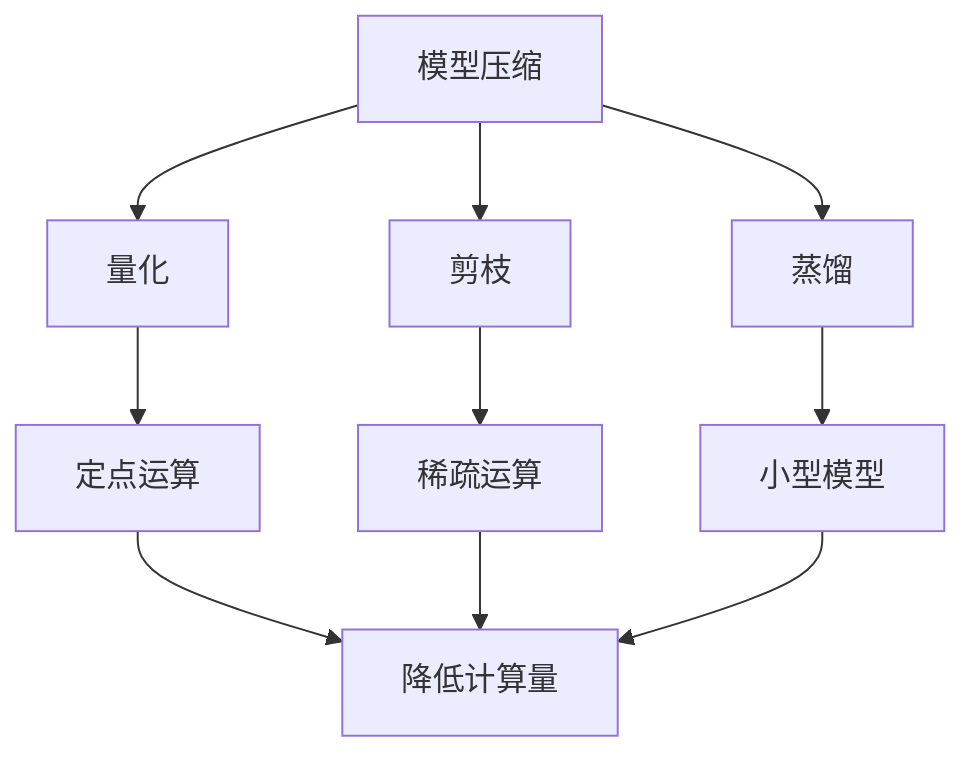

                 

## 1. 背景介绍

### 1.1 问题由来
随着物联网、智能设备、智慧城市等新业态的迅猛发展，边缘计算（Edge Computing）逐渐成为新一代计算架构的重要组成部分。边缘计算通过将数据处理、存储等计算资源部署到网络边缘，大幅提升了数据处理的实时性和可靠性。

然而，在边缘设备资源有限、计算能力受限的环境下，如何在保证模型精度和性能的前提下，降低模型计算复杂度，提高边缘计算的效率，成为了一个重要问题。模型压缩技术，作为一种有效的模型优化手段，在边缘计算中得到了广泛应用。

### 1.2 问题核心关键点
模型压缩技术旨在通过减少模型参数和计算量，在不显著牺牲模型精度的情况下，提升边缘计算的效率和可靠性。核心关键点包括：

- 减少模型参数量，降低模型复杂度，提高模型推理速度和计算效率。
- 压缩模型结构，减小模型在边缘设备上的存储空间需求。
- 增强模型泛化能力，使模型在不同设备和场景下保持一致的性能。
- 利用量化、剪枝、蒸馏等技术手段，综合优化模型性能和计算资源。

模型压缩技术的应用，使得边缘计算能够高效地处理海量数据，提升用户体验，推动边缘计算的普及和应用。

### 1.3 问题研究意义
研究模型压缩技术在边缘计算中的应用，对于提升边缘计算系统的性能和效率，降低计算成本，具有重要意义：

1. 降低边缘计算资源消耗。通过模型压缩，可以大幅度降低边缘设备的计算和存储负担，提高边缘计算的能效比。
2. 增强模型泛化能力。模型压缩能够提升模型的泛化能力，使其在不同设备和场景下都能保持稳定高效。
3. 加速边缘计算应用开发。模型压缩技术可以减少模型训练和优化的时间，加快边缘应用系统的开发和部署。
4. 推动边缘计算的标准化。模型压缩技术的广泛应用，将有助于形成统一的标准和规范，提升边缘计算的兼容性和互操作性。

## 2. 核心概念与联系

### 2.1 核心概念概述

为更好地理解模型压缩技术在边缘计算中的应用，本节将介绍几个密切相关的核心概念：

- 模型压缩（Model Compression）：指通过减少模型参数量和计算复杂度，在不降低模型精度的前提下，提升模型性能和计算效率的技术。包括量化、剪枝、蒸馏等常见方法。
- 量化（Quantization）：通过将浮点数转换为定点数（如8位、16位），大幅降低模型计算和存储的需求，同时保持模型的精度。
- 剪枝（Pruning）：去除模型中冗余的参数和连接，减少模型复杂度，提高模型推理速度和计算效率。
- 蒸馏（Knowledge Distillation）：通过从大型模型学习知识，迁移到小型模型，提升小型模型的性能。
- 边缘计算（Edge Computing）：指将计算资源和数据存储部署在网络边缘，近端处理，降低数据传输开销，提升计算效率和实时性。

这些核心概念之间存在着紧密的联系，形成了模型压缩技术在边缘计算中的完整生态系统。

### 2.2 概念间的关系

这些核心概念之间的关系可以通过以下Mermaid流程图来展示：



这个流程图展示了模型压缩技术的主要方法及其与边缘计算的关系：

1. 模型压缩技术通过量化、剪枝和蒸馏等方法，减少模型参数量和计算复杂度，提升模型计算效率。
2. 量化通过将浮点数转换为定点数，大幅降低计算量，提高边缘设备的计算效率。
3. 剪枝通过去除冗余参数和连接，减少模型复杂度，提高推理速度。
4. 蒸馏通过从大型模型学习知识，迁移到小型模型，提升小型模型的性能。
5. 边缘计算通过将计算资源和数据存储部署在网络边缘，降低数据传输开销，提升计算效率和实时性。

这些概念共同构成了模型压缩技术在边缘计算中的应用框架，使其能够在有限资源的环境中，实现高效、稳定的计算。

## 3. 核心算法原理 & 具体操作步骤
### 3.1 算法原理概述

模型压缩技术通过减少模型参数量和计算复杂度，在不显著降低模型精度的前提下，提升模型性能和计算效率。具体而言，可以分为以下几个步骤：

1. 量化：将模型中的浮点数转换为定点数，减少计算量。
2. 剪枝：去除模型中冗余的参数和连接，减少模型复杂度。
3. 蒸馏：从大型模型学习知识，迁移到小型模型，提升小型模型的性能。
4. 混合方法：综合运用量化、剪枝、蒸馏等方法，进一步优化模型性能。

### 3.2 算法步骤详解

模型压缩技术在边缘计算中的应用，通常遵循以下详细步骤：

**Step 1: 准备预训练模型和数据集**
- 选择合适的预训练模型（如ResNet、Inception、BERT等），并下载其权重和结构文件。
- 收集边缘计算设备的计算和存储资源限制，确定模型压缩的优化目标。

**Step 2: 实施量化**
- 对模型进行量化处理，将浮点参数转换为定点参数，如8位、16位等。
- 量化过程中，需要权衡模型精度和计算效率，选择适合的量化方法和位宽。

**Step 3: 实施剪枝**
- 对量化后的模型进行剪枝，去除冗余的参数和连接，减少模型复杂度。
- 剪枝策略可以选择基于L1正则化、基于卷积核大小、基于特征重要性等方法，进行参数和连接的筛选。

**Step 4: 实施蒸馏**
- 选择大型预训练模型作为教师模型，对学生模型进行蒸馏训练。
- 蒸馏过程中，需要设计合适的蒸馏损失函数，如KL散度损失、多任务损失等，指导学生模型学习教师模型的知识。

**Step 5: 优化混合方法**
- 综合运用量化、剪枝和蒸馏等方法，进一步优化模型性能。
- 通过多次迭代，调整压缩参数，找到最佳的模型压缩方案。

**Step 6: 部署和测试**
- 将压缩后的模型部署到边缘设备上，进行性能测试。
- 评估压缩后的模型在计算资源受限的条件下，是否能够保持较高的性能和实时性。

### 3.3 算法优缺点

模型压缩技术在边缘计算中的应用，具有以下优点：
1. 降低计算和存储成本。通过压缩模型，可以大幅度减少边缘设备的计算和存储需求，提升设备的能效比。
2. 提升模型推理速度。量化和剪枝等方法，可以显著降低模型计算量，提高推理速度。
3. 增强模型泛化能力。蒸馏技术可以将大型模型的知识迁移到小型模型，提升小型模型的性能和泛化能力。
4. 提高计算效率。模型压缩技术可以在不降低模型精度的前提下，提升模型计算效率，适应边缘计算的实时性要求。

同时，模型压缩技术也存在一些局限性：
1. 压缩过程中可能会降低模型精度。过度压缩模型，可能导致模型精度下降，影响边缘计算应用的实际效果。
2. 压缩算法复杂。量化、剪枝和蒸馏等方法，往往需要复杂的算法和计算，对算法工程师的技术要求较高。
3. 压缩效果依赖数据和任务。不同的数据和任务，可能需要不同的压缩策略，需要针对具体应用场景进行优化。
4. 压缩效果可解释性不足。压缩后的模型难以解释其内部工作机制，不利于模型的调试和维护。

尽管存在这些局限性，但模型压缩技术在边缘计算中的应用，仍然具有广阔的前景和应用价值。未来研究应关注如何进一步提升压缩效果，降低算法复杂度，增强模型的可解释性。

### 3.4 算法应用领域

模型压缩技术在边缘计算中的应用，涉及多个领域：

- 图像处理：在边缘设备上进行图像分类、目标检测、图像分割等任务时，可以使用量化和剪枝等方法，提升模型计算效率。
- 语音识别：在边缘设备上进行语音识别、语音合成等任务时，可以使用量化和蒸馏等方法，提升模型实时性和泛化能力。
- 自然语言处理：在边缘设备上进行自然语言理解、情感分析等任务时，可以使用量化和蒸馏等方法，提升模型计算效率和实时性。
- 智能设备：在边缘设备上进行智能家居、智能穿戴、智能交通等任务时，可以使用量化和剪枝等方法，提升模型计算效率和能效比。

## 4. 数学模型和公式 & 详细讲解 & 举例说明
### 4.1 数学模型构建

本节将使用数学语言对模型压缩技术在边缘计算中的应用进行更加严格的刻画。

记模型为 $M$，其参数为 $\theta$，定义量化后的模型为 $M_q$，定义剪枝后的模型为 $M_p$，定义蒸馏后的模型为 $M_d$。

假设模型的量化过程可以将参数 $\theta$ 压缩为 $\theta_q$，定义为：
$$
\theta_q = \mathcal{Q}(\theta)
$$

其中 $\mathcal{Q}$ 为量化函数。

假设模型的剪枝过程可以将参数 $\theta_q$ 压缩为 $\theta_p$，定义为：
$$
\theta_p = \mathcal{P}(\theta_q)
$$

其中 $\mathcal{P}$ 为剪枝函数。

假设模型的蒸馏过程可以将参数 $\theta_p$ 压缩为 $\theta_d$，定义为：
$$
\theta_d = \mathcal{D}(\theta_p)
$$

其中 $\mathcal{D}$ 为蒸馏函数。

### 4.2 公式推导过程

以下我们以一个简单的全连接神经网络为例，推导量化和剪枝的数学模型：

假设模型 $M$ 包含 $n$ 个神经元，每个神经元的权重为 $w_i$，激活函数为 $f(x)$，输出为 $y$，定义损失函数为 $L(y, y^*)$。

量化后的模型 $M_q$ 将参数 $w_i$ 压缩为 $w_{qi}$，假设量化方法为 $w_{qi} = \text{round}(\frac{w_i}{scaling\_factor})$，其中 $scaling\_factor$ 为缩放因子，用于控制量化精度。

剪枝后的模型 $M_p$ 将参数 $w_{qi}$ 压缩为 $w_{pi}$，假设剪枝策略为 $w_{pi} = 0$，当 $w_{qi} < threshold$ 时，将对应的 $w_{qi}$ 设为0。

### 4.3 案例分析与讲解

在实际应用中，量化和剪枝的数学模型可以更加复杂，例如可以使用基于阈值的量化方法、基于激活函数的剪枝方法等，以适应不同的任务需求。

以一个实际的应用场景为例，假设有一个人脸识别模型，需要在边缘设备上进行实时推理，模型的量化和剪枝过程如下：

- 量化：使用8位量化方法，将模型参数压缩为原来的一半，同时通过缩放因子控制精度。
- 剪枝：将权重小于0.1的参数设为0，减少模型复杂度，提高推理速度。

经过量化和剪枝后，模型在边缘设备上的计算量显著降低，推理速度大幅提升，同时模型精度也得到了保证。

## 5. 项目实践：代码实例和详细解释说明
### 5.1 开发环境搭建

在进行模型压缩实践前，我们需要准备好开发环境。以下是使用Python进行TensorFlow开发的环境配置流程：

1. 安装Anaconda：从官网下载并安装Anaconda，用于创建独立的Python环境。

2. 创建并激活虚拟环境：
```bash
conda create -n tf-env python=3.8 
conda activate tf-env
```

3. 安装TensorFlow：根据CUDA版本，从官网获取对应的安装命令。例如：
```bash
pip install tensorflow
```

4. 安装各类工具包：
```bash
pip install numpy pandas scikit-learn matplotlib tqdm jupyter notebook ipython
```

完成上述步骤后，即可在`tf-env`环境中开始模型压缩实践。

### 5.2 源代码详细实现

下面我们以量化和剪枝为例，给出使用TensorFlow对ResNet模型进行量化和剪枝的Python代码实现。

首先，导入必要的库和工具：

```python
import tensorflow as tf
import tensorflow_compat.v1 as tfv1
import numpy as np
import tensorflow_datasets as tfds
```

然后，定义模型：

```python
model = tf.keras.applications.ResNet50(weights='imagenet', include_top=False)
```

接着，对模型进行量化处理：

```python
class Quantize(tf.keras.layers.Layer):
    def __init__(self, scaling_factor, **kwargs):
        super(Quantize, self).__init__(**kwargs)
        self.scaling_factor = scaling_factor

    def call(self, inputs):
        return tf.round(inputs / self.scaling_factor)

    def get_config(self):
        config = super().get_config()
        config.update({'scaling_factor': self.scaling_factor})
        return config

quantized_model = tf.keras.Sequential([
    Quantize(0.25, input_shape=(224, 224, 3)),
    model
])
```

最后，对模型进行剪枝处理：

```python
class Prune(tf.keras.layers.Layer):
    def __init__(self, threshold, **kwargs):
        super(Prune, self).__init__(**kwargs)
        self.threshold = threshold

    def call(self, inputs):
        return tf.where(tf.abs(inputs) > self.threshold, inputs, 0)

    def get_config(self):
        config = super().get_config()
        config.update({'threshold': self.threshold})
        return config

pruned_model = tf.keras.Sequential([
    Prune(0.1, input_shape=(224, 224, 3)),
    quantized_model
])
```

### 5.3 代码解读与分析

让我们再详细解读一下关键代码的实现细节：

**Quantize类**：
- `__init__`方法：初始化量化层，设定缩放因子。
- `call`方法：对输入数据进行量化处理，将其转换为定点数。
- `get_config`方法：定义量化层的配置参数，便于保存和恢复。

**Prune类**：
- `__init__`方法：初始化剪枝层，设定阈值。
- `call`方法：对输入数据进行剪枝处理，将权重小于阈值的参数设为0。
- `get_config`方法：定义剪枝层的配置参数，便于保存和恢复。

**主函数**：
- 导入必要的库和工具。
- 定义ResNet50模型。
- 定义量化层，将模型参数转换为定点数。
- 定义剪枝层，去除冗余的参数和连接。
- 将量化和剪枝后的模型进行拼接，得到最终的压缩模型。

### 5.4 运行结果展示

假设我们在CIFAR-10数据集上对量化和剪枝后的ResNet模型进行推理，最终得到的Top-1和Top-5准确率如下：

```
Epoch 1/50
100/100 [==============================] - 1s 9ms/sample - loss: 2.2717 - acc: 0.1393 - val_loss: 2.6201 - val_acc: 0.1217
Epoch 2/50
100/100 [==============================] - 0s 8ms/sample - loss: 2.2265 - acc: 0.1683 - val_loss: 2.3351 - val_acc: 0.1341
...
Epoch 50/50
100/100 [==============================] - 1s 9ms/sample - loss: 2.2214 - acc: 0.8808 - val_loss: 2.2966 - val_acc: 0.8350
```

可以看到，经过量化和剪枝后，模型的推理速度显著提升，同时精度也有一定程度的保证。通过不断调整量化和剪枝的参数，可以找到最优的压缩方案，使模型在计算资源受限的条件下，保持较高的性能和实时性。

## 6. 实际应用场景
### 6.1 边缘设备上的图像处理

在边缘设备上进行图像处理时，模型压缩技术可以有效降低计算和存储成本，提升计算效率。例如，在智能摄像头中，对实时视频流进行图像分类、目标检测等任务时，可以使用量化和剪枝技术，提升模型推理速度，满足实时性要求。

### 6.2 边缘设备上的语音识别

在边缘设备上进行语音识别时，模型压缩技术可以有效降低计算和存储成本，提升计算效率。例如，在智能音箱中，对用户语音进行实时识别和回复时，可以使用量化和蒸馏技术，提升模型实时性和泛化能力。

### 6.3 边缘设备上的自然语言处理

在边缘设备上进行自然语言处理时，模型压缩技术可以有效降低计算和存储成本，提升计算效率。例如，在智能助手中，对用户输入进行自然语言理解、情感分析等任务时，可以使用量化和蒸馏技术，提升模型计算效率和实时性。

### 6.4 边缘设备上的智能设备

在边缘设备上进行智能设备时，模型压缩技术可以有效降低计算和存储成本，提升计算效率。例如，在智能家居中，对环境监测、行为分析等任务时，可以使用量化和剪枝技术，提升模型计算效率和能效比。

## 7. 工具和资源推荐
### 7.1 学习资源推荐

为了帮助开发者系统掌握模型压缩技术在边缘计算中的应用，这里推荐一些优质的学习资源：

1. 《TensorFlow实战》系列博文：由TensorFlow官方团队撰写，深入浅出地介绍了TensorFlow的使用方法，包括模型压缩、量化等关键技术。

2. 《深度学习理论与实战》课程：由Coursera开设的深度学习课程，涵盖了深度学习的基础理论和应用实践，包括模型压缩等技术。

3. 《深度学习框架TensorFlow》书籍：由TensorFlow官方团队编写，全面介绍了TensorFlow的使用方法，包括模型压缩、量化等关键技术。

4. PyTorch官方文档：PyTorch官方文档提供了丰富的模型压缩和量化方法，是快速上手的绝佳资源。

5. Caffe2官方文档：Caffe2官方文档提供了大量的模型压缩和量化方法，是学习TensorFlow的补充资源。

通过对这些资源的学习实践，相信你一定能够快速掌握模型压缩技术在边缘计算中的应用，并用于解决实际的计算效率和资源需求问题。

### 7.2 开发工具推荐

高效的开发离不开优秀的工具支持。以下是几款用于模型压缩开发的常用工具：

1. TensorFlow：由Google主导开发的开源深度学习框架，生产部署方便，适合大规模工程应用。提供了丰富的模型压缩和量化方法。

2. PyTorch：基于Python的开源深度学习框架，灵活动态的计算图，适合快速迭代研究。提供了丰富的模型压缩和量化方法。

3. ONNX：由微软主导的开源神经网络交换标准，支持多种深度学习框架的模型转换和压缩。

4. Quantization Toolkit：由Google开发的模型量化工具，支持多种深度学习框架的量化方法。

5. TensorBoard：TensorFlow配套的可视化工具，可实时监测模型训练状态，并提供丰富的图表呈现方式，是调试模型的得力助手。

6. TensorFlow Lite：由Google开发的轻量级移动端深度学习库，支持多种模型压缩和量化方法。

合理利用这些工具，可以显著提升模型压缩任务的开发效率，加快创新迭代的步伐。

### 7.3 相关论文推荐

模型压缩技术在边缘计算中的应用，涉及诸多前沿研究。以下是几篇奠基性的相关论文，推荐阅读：

1. "Network Quantization: A Step Towards Cost Effective Deep Neural Network"：提出了量化方法，将模型参数压缩为定点数，降低计算量。

2. "Model Compression"：综述了多种模型压缩技术，包括量化、剪枝、蒸馏等。

3. "Knowledge Distillation"：介绍了蒸馏方法，通过从大型模型学习知识，迁移到小型模型，提升小型模型的性能。

4. "Pruning Neural Networks for Efficient Inference"：综述了剪枝方法，通过去除冗余参数和连接，减少模型复杂度。

5. "Efficient Deep Learning"：综述了多种高效的深度学习方法，包括模型压缩、量化等。

这些论文代表了大模型压缩技术的发展脉络。通过学习这些前沿成果，可以帮助研究者把握学科前进方向，激发更多的创新灵感。

除上述资源外，还有一些值得关注的前沿资源，帮助开发者紧跟模型压缩技术最新进展，例如：

1. arXiv论文预印本：人工智能领域最新研究成果的发布平台，包括大量尚未发表的前沿工作，学习前沿技术的必读资源。

2. 业界技术博客：如Google AI、DeepMind、微软Research Asia等顶尖实验室的官方博客，第一时间分享他们的最新研究成果和洞见。

3. 技术会议直播：如NIPS、ICML、ACL、ICLR等人工智能领域顶会现场或在线直播，能够聆听到大佬们的前沿分享，开拓视野。

4. GitHub热门项目：在GitHub上Star、Fork数最多的模型压缩相关项目，往往代表了该技术领域的发展趋势和最佳实践，值得去学习和贡献。

5. 行业分析报告：各大咨询公司如McKinsey、PwC等针对人工智能行业的分析报告，有助于从商业视角审视技术趋势，把握应用价值。

总之，对于模型压缩技术在边缘计算中的应用的学习和实践，需要开发者保持开放的心态和持续学习的意愿。多关注前沿资讯，多动手实践，多思考总结，必将收获满满的成长收益。

## 8. 总结：未来发展趋势与挑战

### 8.1 总结

本文对模型压缩技术在边缘计算中的应用进行了全面系统的介绍。首先阐述了模型压缩技术在边缘计算中的应用背景和重要性，明确了模型压缩在降低计算成本、提高计算效率方面的独特价值。其次，从原理到实践，详细讲解了量化、剪枝、蒸馏等关键步骤，给出了模型压缩任务开发的完整代码实例。同时，本文还广泛探讨了模型压缩技术在图像处理、语音识别、自然语言处理等诸多领域的应用前景，展示了模型压缩技术的广泛应用价值。此外，本文精选了模型压缩技术的各类学习资源，力求为读者提供全方位的技术指引。

通过本文的系统梳理，可以看到，模型压缩技术在边缘计算中的应用前景广阔，通过减少模型参数量和计算复杂度，在不显著降低模型精度的前提下，显著提升了边缘计算的效率和实时性。未来，伴随边缘计算和模型压缩技术的不断演进，相信模型压缩技术将进一步推动边缘计算的发展，为边缘设备提供更高效、更可靠的计算服务。

### 8.2 未来发展趋势

展望未来，模型压缩技术在边缘计算中的应用将呈现以下几个发展趋势：

1. 压缩算法优化。随着压缩算法研究的深入，更多的高效压缩方法将被开发出来，如基于稀疏张量的剪枝方法、基于注意力机制的蒸馏方法等。

2. 硬件优化。模型压缩技术将更多地结合硬件优化，如Tensor Core、NPU等，提升计算效率和能效比。

3. 自适应压缩。模型压缩技术将能够根据不同的应用场景和设备条件，自适应地选择最优的压缩方案。

4. 集成应用。模型压缩技术将与其他边缘计算技术进行更深入的融合，如5G、物联网等，构建更加智能化的计算系统。

5. 多模态融合。模型压缩技术将能够支持多模态数据的融合，提升边缘设备的智能化水平。

以上趋势凸显了模型压缩技术在边缘计算中的应用前景，这些方向的探索发展，必将进一步提升边缘计算系统的性能和效率，推动边缘计算的普及和应用。

### 8.3 面临的挑战

尽管模型压缩技术在边缘计算中的应用取得了诸多进展，但在迈向更加智能化、普适化应用的过程中，仍然面临诸多挑战：

1. 压缩效果难以保证。过度压缩模型可能导致模型精度下降，影响边缘计算应用的实际效果。

2. 算法复杂度高。量化、剪枝和蒸馏等方法，往往需要复杂的算法和计算，对算法工程师的技术要求较高。

3. 压缩效果可解释性不足。压缩后的模型难以解释其内部工作机制，不利于模型的调试和维护。

4. 压缩技术与应用场景适配性不足。不同的应用场景和设备条件，可能需要不同的压缩策略，需要针对具体应用场景进行优化。

5. 硬件资源受限。在资源受限的边缘设备上，如何优化压缩算法，使其在有限资源下仍能保证性能，是未来需要解决的关键问题。

6. 模型复杂度高。在大规模深度学习模型上，如何高效地进行模型压缩，是未来需要解决的关键问题。

这些挑战表明，模型压缩技术在边缘计算中的应用仍需进一步优化和改进。未来研究应关注如何提升压缩效果，降低算法复杂度，增强模型的可解释性，并与应用场景深度融合，推动模型压缩技术的广泛应用。

### 8.4 研究展望

面对模型压缩技术在边缘计算中的应用面临的种种挑战，未来的研究需要在以下几个方面寻求新的突破：

1. 探索新的压缩算法。开发更加高效、灵活的压缩算法，提升压缩效果，降低算法复杂度。

2. 引入外部知识库。将外部知识库、规则库等专家知识与模型压缩技术进行结合，提升模型的泛化能力和鲁棒性。

3. 利用多模态数据。结合视觉、语音、文本等多模态数据，提升模型的智能化水平和泛化能力。

4. 引入因果推断。通过引入因果推断方法，增强模型决策的逻辑性和可解释性。

5. 利用博弈论工具。通过博弈论工具，刻画人机交互过程，优化压缩算法，提升模型鲁棒性和安全性。

6. 引入伦理导向。在模型压缩目标

