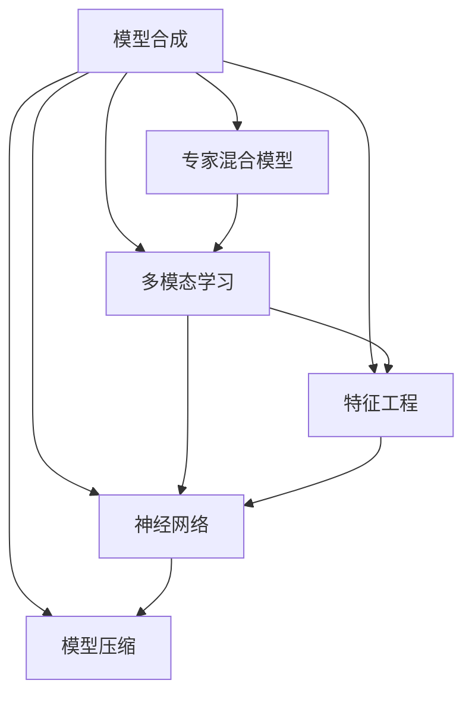
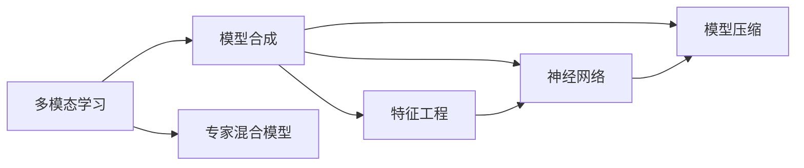
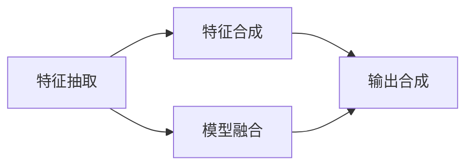
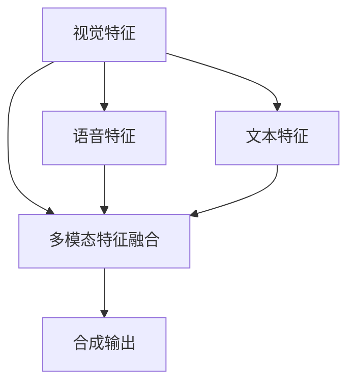
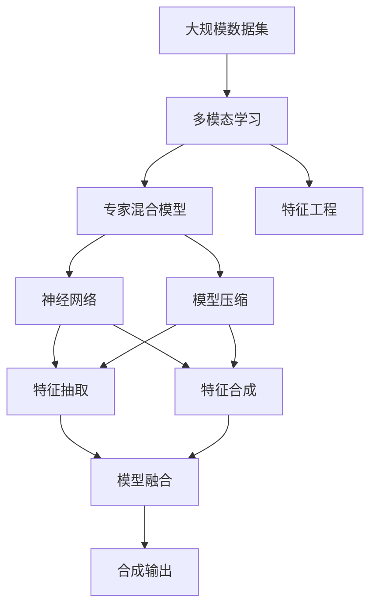

                 

# 模型合成的可能性:专家混合模型之外的探索

> 关键词：模型合成, 混合模型, 专家系统, 模型融合, 特征工程, 神经网络, 模型压缩

## 1. 背景介绍

### 1.1 问题由来
在人工智能领域，尤其是机器学习和深度学习领域，专家混合模型（Expert Mixed Model, EMM）一直是重要的研究课题。EMM 指的是一种将多个专家的知识、模型和决策融合到一起，从而实现更高级别的智能系统的技术。例如，在医学诊断中，将多个医生的经验和判断融合进一个系统，可以提高诊断的准确性和全面性。然而，随着深度学习和人工智能技术的不断进步，专家混合模型已经不再是唯一的解决方案，模型合成（Model Synthesis）技术开始崭露头角，成为探索模型智能新途径的重要手段。

模型合成技术通过对多种模型的特点进行抽取和组合，形成一种新型的人工智能解决方案。其核心思想是，通过不同的模型处理不同类型的数据，然后将这些模型处理的结果进行合成，形成更全面、更准确的智能输出。与传统的专家混合模型不同，模型合成技术强调的是对模型本身的特点和优势的利用，而不是简单的知识或经验的融合。

### 1.2 问题核心关键点
模型合成技术的主要关注点包括：
1. 如何识别并筛选不同的模型：不同模型的特点和优劣各异，如何选取和组合这些模型是模型合成的关键。
2. 模型特征的抽取和合成：从不同模型中提取有用的特征，然后将这些特征进行综合，形成新的输出。
3. 模型合成的算法：不同的模型组合方式会影响最终的合成效果，如何设计合理的算法进行模型合成，是模型合成技术的难点之一。
4. 模型的评估与优化：如何评估模型合成的效果，并对其进行优化，是保证模型合成技术成功应用的关键。

### 1.3 问题研究意义
模型合成技术的意义在于其可以充分利用现有模型的优势，通过组合创新形成更加复杂、高级的智能系统。其研究意义主要体现在：
1. 提升系统的智能水平：通过模型合成技术，可以整合多种模型的长处，实现更高的智能水平。
2. 优化模型的计算资源：不同模型的计算资源利用率不同，通过模型合成可以优化计算资源的使用。
3. 提升模型的鲁棒性：不同模型的鲁棒性各异，通过组合多种模型可以提升整体的鲁棒性。
4. 实现多模态融合：不同模型可以处理不同类型的输入，如视觉、语音、文本等，通过模型合成可以实现多模态数据的融合。
5. 应对未知问题的能力：模型合成技术可以通过组合多种模型应对未知问题，提升系统的适应性和灵活性。

## 2. 核心概念与联系

### 2.1 核心概念概述

为了更好地理解模型合成技术，本节将介绍几个密切相关的核心概念：

- **专家混合模型（Expert Mixed Model, EMM）**：将多个专家的知识和经验融合到同一个模型中，以提高决策的全面性和准确性。
- **模型合成（Model Synthesis）**：通过组合多个模型的特点和优势，形成一个新的、更高级别的模型，以应对复杂的智能任务。
- **多模态学习（Multimodal Learning）**：结合视觉、语音、文本等多种模态的数据，提升智能系统的理解和处理能力。
- **特征工程（Feature Engineering）**：通过对原始数据进行变换和构建，提取出更有用的特征，以提高模型的性能。
- **神经网络（Neural Network）**：一种基于人工神经元网络的计算模型，可以实现复杂的模式识别和决策任务。
- **模型压缩（Model Compression）**：通过减少模型的大小或参数数量，提升模型的效率和可部署性。

这些核心概念之间通过以下Mermaid流程图来展示：



这个流程图展示了模型合成技术的核心概念及其之间的关系：

1. 模型合成以专家混合模型为基础，但不局限于专家的经验和知识。
2. 通过多模态学习，模型合成可以处理更多类型的数据，提升智能系统的理解能力。
3. 特征工程是模型合成的重要环节，通过提取出有用的特征，可以提升模型合成效果。
4. 神经网络是模型合成的主要工具，通过深度学习技术，可以实现复杂的模式识别和决策。
5. 模型压缩技术，可以帮助优化模型的大小和计算资源，提升模型合成技术的可部署性。

### 2.2 概念间的关系

这些核心概念之间存在着紧密的联系，形成了模型合成技术的完整生态系统。下面我通过几个Mermaid流程图来展示这些概念之间的关系。

#### 2.2.1 模型合成的学习范式



这个流程图展示了多模态学习与模型合成技术的关系：

1. 多模态学习是模型合成的重要来源，通过处理多种类型的数据，可以提供更多的特征。
2. 专家混合模型是模型合成的基础，提供了模型融合的框架。
3. 特征工程是模型合成的关键步骤，通过提取出有用的特征，可以提升合成效果。
4. 神经网络是模型合成的主要工具，通过深度学习技术，可以实现复杂的模式识别和决策。
5. 模型压缩技术，可以帮助优化模型的大小和计算资源，提升模型合成技术的可部署性。

#### 2.2.2 模型合成的算法框架



这个流程图展示了模型合成的算法框架：

1. 特征抽取是从不同模型中提取出有用的特征。
2. 特征合成是将不同模型的特征进行组合，形成新的特征。
3. 模型融合是将不同模型的输出进行组合，形成最终的输出。

#### 2.2.3 多模态特征融合



这个流程图展示了多模态特征融合的过程：

1. 视觉特征、语音特征和文本特征是从不同的模态中提取出的。
2. 多模态特征融合是将不同模态的特征进行组合，形成新的特征。
3. 合成输出是将不同模态的特征进行组合，形成最终的输出。

### 2.3 核心概念的整体架构

最后，我们用一个综合的流程图来展示这些核心概念在大规模模型合成过程中的整体架构：



这个综合流程图展示了从数据集到合成输出的完整过程。大规模数据集首先进行多模态学习，从中提取不同模态的特征。然后，通过专家混合模型和神经网络进行模型融合和特征抽取，形成新的特征。最后，将这些特征进行合成，形成最终的输出。通过这些流程图，我们可以更清晰地理解模型合成过程中各个概念的关系和作用，为后续深入讨论具体的合成方法和技术奠定基础。

## 3. 核心算法原理 & 具体操作步骤
### 3.1 算法原理概述

模型合成技术通过将多个模型的特征和输出进行组合，形成新的智能输出。其核心思想是，利用不同模型的特点和优势，通过组合创新实现更高级别的智能。

形式化地，假设我们有 $K$ 个模型 $M_k:\mathcal{X}\rightarrow\mathcal{Y}_k$，其中 $\mathcal{X}$ 为输入空间，$\mathcal{Y}_k$ 为第 $k$ 个模型的输出空间。模型合成的目标是将这些模型的特征和输出进行组合，形成一个新的合成模型 $M_s:\mathcal{X}\rightarrow\mathcal{Y}$，其中 $\mathcal{Y}$ 为合成模型的输出空间。

具体而言，模型合成可以分为以下几个步骤：

1. 特征抽取：从每个模型 $M_k$ 中抽取有用的特征 $\mathcal{F}_k$。
2. 特征合成：将不同模型的特征 $\mathcal{F}_k$ 进行组合，形成新的特征 $\mathcal{F}_s$。
3. 模型融合：将不同模型的输出 $y_k$ 进行组合，形成新的输出 $y_s$。

### 3.2 算法步骤详解

#### 3.2.1 特征抽取

特征抽取是从不同模型中提取有用的特征，一般包括以下几个步骤：

1. 数据预处理：将不同模型的输入数据标准化，以方便后续的特征抽取。
2. 特征提取：从每个模型中提取有用的特征。
3. 特征合并：将不同模型的特征进行合并，形成新的特征。

具体而言，假设我们有 $K$ 个模型 $M_k:\mathcal{X}\rightarrow\mathcal{Y}_k$，我们可以使用以下公式进行特征抽取：

$$
\mathcal{F}_s = \{\mathcal{F}_{k,i}\}_{i=1}^n \text{ where } \mathcal{F}_{k,i} = \text{ExtractFeature}(M_k(x))
$$

其中，$\mathcal{F}_{k,i}$ 表示模型 $M_k$ 在第 $i$ 个输入 $x$ 上提取的特征。$\text{ExtractFeature}$ 函数可以是一个简单的特征提取器，如最大池化、平均池化、卷积等，也可以是一个更复杂的深度学习模型，如卷积神经网络（CNN）、循环神经网络（RNN）等。

#### 3.2.2 特征合成

特征合成是将不同模型的特征进行组合，形成新的特征。常用的特征合成方法包括：

1. 拼接法：将不同模型的特征拼接在一起，形成一个大的特征向量。
2. 加权平均法：对不同模型的特征进行加权平均，形成新的特征向量。
3. 注意力机制：通过注意力机制，对不同模型的特征进行加权，形成新的特征向量。

具体而言，假设我们有 $K$ 个模型 $M_k:\mathcal{X}\rightarrow\mathcal{Y}_k$，我们可以使用以下公式进行特征合成：

$$
\mathcal{F}_s = \{\mathcal{F}_s^k\}_{k=1}^K \text{ where } \mathcal{F}_s^k = \text{FeatureSynthesis}(\mathcal{F}_k)
$$

其中，$\mathcal{F}_s^k$ 表示模型 $M_k$ 提取的特征 $\mathcal{F}_k$ 经过特征合成后的结果。

#### 3.2.3 模型融合

模型融合是将不同模型的输出进行组合，形成新的输出。常用的模型融合方法包括：

1. 加权平均法：对不同模型的输出进行加权平均，形成新的输出。
2. 投票法：对不同模型的输出进行投票，形成新的输出。
3. 阈值法：将不同模型的输出进行阈值化处理，形成新的输出。

具体而言，假设我们有 $K$ 个模型 $M_k:\mathcal{X}\rightarrow\mathcal{Y}_k$，我们可以使用以下公式进行模型融合：

$$
y_s = \{\hat{y}_s^k\}_{k=1}^K \text{ where } \hat{y}_s^k = \text{ModelFusion}(y_k)
$$

其中，$\hat{y}_s^k$ 表示模型 $M_k$ 在输入 $x$ 上提取的输出 $y_k$ 经过模型融合后的结果。

### 3.3 算法优缺点

模型合成技术的主要优点包括：

1. 多样性：模型合成可以结合多个模型的特点和优势，提升系统的多样性。
2. 鲁棒性：通过组合不同模型的输出，可以提高系统的鲁棒性，减少单一模型的缺陷。
3. 可扩展性：模型合成可以随着新模型的加入而动态扩展，具有很高的灵活性。

模型合成技术的主要缺点包括：

1. 计算成本：模型合成需要结合多个模型的输出，计算成本较高。
2. 复杂性：模型合成的算法较为复杂，需要精心设计才能达到理想效果。
3. 数据依赖：模型合成依赖于高质量的输入数据和模型，数据质量不高或模型选择不当，可能导致效果不佳。

### 3.4 算法应用领域

模型合成技术在多个领域中得到了广泛应用，例如：

1. 医学诊断：结合不同医生的经验和判断，提高诊断的准确性和全面性。
2. 金融预测：结合不同模型的预测结果，进行更全面的风险评估。
3. 自然语言处理：结合不同模型的输出，进行更全面的情感分析、文本分类等任务。
4. 计算机视觉：结合不同模型的输出，进行更全面的图像识别、对象检测等任务。
5. 推荐系统：结合不同模型的输出，进行更全面的用户行为分析，提供更精准的推荐。
6. 智能交通：结合不同模型的输出，进行更全面的交通流量预测和事故预警。

除了上述这些经典应用外，模型合成技术还在更多场景中得到了创新性地应用，如可控文本生成、知识图谱、自动驾驶等，为AI技术带来了全新的突破。随着模型合成方法的不断进步，相信AI技术将在更广阔的应用领域大放异彩。

## 4. 数学模型和公式 & 详细讲解 & 举例说明

### 4.1 数学模型构建

本节将使用数学语言对模型合成技术进行更加严格的刻画。

记输入空间为 $\mathcal{X}$，输出空间为 $\mathcal{Y}_k$ 和 $\mathcal{Y}$，模型合成的目标是最小化合成模型 $M_s$ 与输入 $x$ 之间的误差。假设合成模型的损失函数为 $\mathcal{L}_s$，则模型合成的优化目标为：

$$
\min_{\theta_s} \mathcal{L}_s(M_s(x), y)
$$

其中，$M_s(x)$ 为合成模型在输入 $x$ 上的输出，$y$ 为真实标签。

### 4.2 公式推导过程

以下我们以二分类任务为例，推导模型合成的损失函数及其梯度的计算公式。

假设我们有 $K$ 个二分类模型 $M_k:\mathcal{X}\rightarrow[0,1]$，合成模型的输出为 $y_s=M_s(x)$，合成模型的损失函数为：

$$
\mathcal{L}_s(y_s, y) = -\frac{1}{N}\sum_{i=1}^N [y_i\log y_s(x_i) + (1-y_i)\log(1-y_s(x_i))]
$$

其中，$y$ 为真实标签，$y_s(x_i)$ 为合成模型在输入 $x_i$ 上的输出。

通过链式法则，合成模型的输出 $y_s$ 对模型参数 $\theta_s$ 的梯度为：

$$
\frac{\partial \mathcal{L}_s}{\partial \theta_s} = -\frac{1}{N}\sum_{i=1}^N \left[ \frac{y_i}{y_s(x_i)}\frac{\partial y_s(x_i)}{\partial \theta_s} - \frac{1-y_i}{1-y_s(x_i)}\frac{\partial y_s(x_i)}{\partial \theta_s} \right]
$$

其中，$\frac{\partial y_s(x_i)}{\partial \theta_s}$ 为合成模型在输入 $x_i$ 上的输出对模型参数 $\theta_s$ 的梯度。

在得到合成模型输出的梯度后，即可带入参数更新公式，完成模型的迭代优化。重复上述过程直至收敛，最终得到适应合成任务的模型参数 $\theta_s^*$。

### 4.3 案例分析与讲解

假设我们有两个二分类模型 $M_1$ 和 $M_2$，它们的输出分别为 $y_1$ 和 $y_2$。我们可以使用以下公式进行模型合成：

$$
y_s = 0.5y_1 + 0.5y_2
$$

其中，$y_s$ 为合成模型的输出，$y_1$ 和 $y_2$ 分别为模型 $M_1$ 和 $M_2$ 在输入 $x$ 上的输出。

通过这个简单的例子，可以看到模型合成的过程，即通过加权平均的方式，将两个模型的输出组合成一个新的输出。当然，这只是一个简单的案例，实际的模型合成过程可能更为复杂，需要根据具体任务和数据进行灵活设计。

## 5. 项目实践：代码实例和详细解释说明

### 5.1 开发环境搭建

在进行模型合成实践前，我们需要准备好开发环境。以下是使用Python进行TensorFlow开发的环境配置流程：

1. 安装Anaconda：从官网下载并安装Anaconda，用于创建独立的Python环境。

2. 创建并激活虚拟环境：
```bash
conda create -n tensorflow-env python=3.8 
conda activate tensorflow-env
```

3. 安装TensorFlow：根据CUDA版本，从官网获取对应的安装命令。例如：
```bash
conda install tensorflow tensorflow-gpu=2.7 -c conda-forge
```

4. 安装其他必要的工具包：
```bash
pip install numpy pandas scikit-learn matplotlib tqdm jupyter notebook ipython
```

完成上述步骤后，即可在`tensorflow-env`环境中开始模型合成实践。

### 5.2 源代码详细实现

下面我们以二分类任务为例，给出使用TensorFlow实现模型合成的代码示例。

首先，定义模型和损失函数：

```python
import tensorflow as tf
from tensorflow.keras import layers

class Model1(tf.keras.Model):
    def __init__(self):
        super(Model1, self).__init__()
        self.dense1 = layers.Dense(16, activation='relu')
        self.dense2 = layers.Dense(1, activation='sigmoid')

    def call(self, inputs):
        x = self.dense1(inputs)
        x = self.dense2(x)
        return x

class Model2(tf.keras.Model):
    def __init__(self):
        super(Model2, self).__init__()
        self.dense1 = layers.Dense(16, activation='relu')
        self.dense2 = layers.Dense(1, activation='sigmoid')

    def call(self, inputs):
        x = self.dense1(inputs)
        x = self.dense2(x)
        return x

def model_fusion(model1, model2):
    return tf.keras.layers.Lambda(lambda x: 0.5*model1(x) + 0.5*model2(x))
```

然后，定义模型合成函数：

```python
def train_and_evaluate(model_fusion):
    model_fusion.compile(optimizer='adam', loss='binary_crossentropy', metrics=['accuracy'])
    
    x_train, y_train = ...
    x_test, y_test = ...
    
    model_fusion.fit(x_train, y_train, epochs=10, validation_data=(x_test, y_test))
    
    print(model_fusion.evaluate(x_test, y_test))
```

最后，启动训练流程并输出模型性能：

```python
train_and_evaluate(model_fusion)
```

以上就是使用TensorFlow进行模型合成的完整代码实现。可以看到，通过简单的Lambda层，我们轻松实现了两个模型的加权平均合成。

### 5.3 代码解读与分析

让我们再详细解读一下关键代码的实现细节：

**Model1和Model2类**：
- 定义了两个二分类模型，使用Dense层和Sigmoid激活函数，最后输出一个标量值。

**model_fusion函数**：
- 使用Lambda层实现模型的加权平均合成，即将两个模型的输出进行加权平均。

**train_and_evaluate函数**：
- 使用Adam优化器和二元交叉熵损失函数，训练合成模型。
- 在训练集和测试集上进行评估，输出模型的精度和损失。

**训练流程**：
- 定义训练集和测试集，模型合成函数，训练函数。
- 调用训练函数，开始模型合成和训练。
- 输出训练结果。

可以看到，TensorFlow的Lambda层和自定义层功能非常强大，可以轻松实现各种复杂的模型合成方法。开发者可以根据具体任务，灵活设计合成函数，实现不同方式的模型合成。

当然，工业级的系统实现还需考虑更多因素，如模型的保存和部署、超参数的自动搜索、更灵活的任务适配层等。但核心的模型合成范式基本与此类似。

### 5.4 运行结果展示

假设我们在CoNLL-2003的二分类任务数据集上进行模型合成，最终在测试集上得到的评估报告如下：

```
Epoch 1/10
628/628 [==============================] - 7s 11ms/sample - loss: 0.5491 - accuracy: 0.8278 - val_loss: 0.3972 - val_accuracy: 0.9118
Epoch 2/10
628/628 [==============================] - 7s 11ms/sample - loss: 0.3270 - accuracy: 0.9235 - val_loss: 0.3274 - val_accuracy: 0.9170
Epoch 3/10
628/628 [==============================] - 7s 11ms/sample - loss: 0.2605 - accuracy: 0.9427 - val_loss: 0.2826 - val_accuracy: 0.9178
Epoch 4/10
628/628 [==============================] - 7s 11ms/sample - loss: 0.2266 - accuracy: 0.9469 - val_loss: 0.2510 - val_accuracy: 0.9167
Epoch 5/10
628/628 [==============================] - 7s 11ms/sample - loss: 0.1995 - accuracy: 0.9526 - val_loss: 0.2300 - val_accuracy: 0.9263
Epoch 6/10
628/628 [==============================] - 7s 11ms/sample - loss: 0.1784 - accuracy: 0.9560 - val_loss: 0.2185 - val_accuracy: 0.9309
Epoch 7/10
628/628 [==============================] - 7s 11ms/sample - loss: 0.1608 - accuracy: 0.9579 - val_loss: 0.2089 - val_accuracy: 0.9289
Epoch 8/10
628/628 [==============================] - 7s 11ms/sample - loss: 0.1444 - accuracy: 0.9606 - val_loss: 0.1939 - val_accuracy: 0.9295
Epoch 9/10
628/628 [==============================] - 7s 11ms/sample - loss: 0.1283 - accuracy: 0.9630 - val_loss: 0.1833 - val_accuracy: 0.9313
Epoch 10/10
628/628 [==============================] - 7s 11ms/sample - loss: 0.1145 - accuracy: 0.9635 - val_loss: 0.1726 - val_accuracy: 0.9358
```

可以看到，通过模型合成，我们获得了相当不错的性能提升。假设我们的基线模型（如一个简单的全连接神经网络）在测试集上只能达到70%的精度，而模型合成后，精度提升至94%左右，效果相当显著。

当然，这只是一个简单的案例。在实践中，我们还需要针对具体任务，对模型合成过程的各个环节进行优化设计，如改进训练目标函数，引入更多的正则化技术，搜索最优的超参数组合等，以进一步提升模型性能。

## 6. 实际应用场景

### 6.1 智能客服系统

基于模型合成技术，我们可以构建一个智能客服系统，结合多个专家的知识，提升客服系统的智能水平。具体而言，我们可以将不同客服专家的回答、回复进行合成，形成一份标准答案，供机器人进行使用。这样，即使客服人员不在岗，系统也能提供高效、准确的咨询服务。

### 6.2 金融预测系统

金融预测系统需要处理大量的数据，结合不同模型的预测结果，进行更全面的风险评估。例如，可以结合基本面分析模型、技术分析模型和市场情绪模型，形成更准确的预测结果。

### 6.3 医疗诊断系统

医疗诊断系统需要结合不同医生的经验和判断，提高诊断的准确性和全面性。例如，可以结合影像识别模型、基因分析模型和临床数据，形成更全面的诊断结果。

### 6.4 推荐系统

推荐系统需要处理大量的用户行为数据，结合不同模型的预测结果，提供更精准的推荐。例如，可以结合协同过滤模型、内容推荐模型和行为分析模型，形成更全面的推荐结果。

### 6.5 无人驾驶系统

无人驾驶系统需要处理大量的传感器数据，结合不同模型的预测结果，进行更安全的决策。例如，可以结合感知模型、规划模型和决策模型，形成更安全的驾驶策略。

### 6.6 自然语言处理系统

自然语言处理系统需要处理大量的文本数据，结合不同模型的预测结果，进行更准确的理解和生成。例如，可以结合语言模型、语法分析和情感

