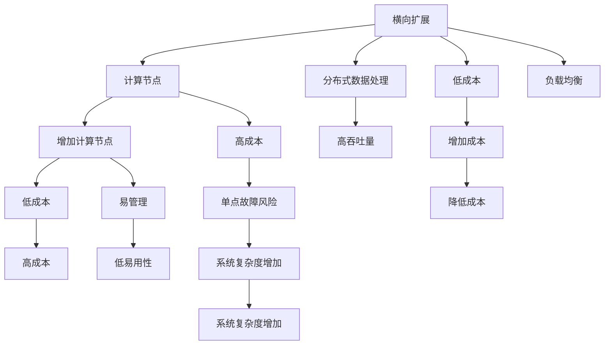

                 

## 1. 背景介绍

随着互联网的发展，系统的规模和复杂度不断增加，横向扩展和纵向扩展（scale-out和scale-up）成为提升系统性能的重要手段。横向扩展通过增加计算节点（如服务器）来提高系统的吞吐量，纵向扩展则通过升级单个节点（如增加CPU、内存）来提高系统性能。两者各有优缺点，需要根据具体情况选择合适的扩展方式。本文将详细探讨横向扩展与纵向扩展的实例应用，并分析其优势与局限，帮助读者更好地理解和选择适合自己的扩展策略。

## 2. 核心概念与联系

### 2.1 核心概念概述

- **横向扩展 (Scale-out)**：通过增加计算节点来提高系统吞吐量，适用于处理大规模分布式数据。
- **纵向扩展 (Scale-up)**：通过升级单个计算节点（如增加CPU、内存）来提高系统性能，适用于处理高并发或高负载的任务。

### 2.2 概念间的关系

横向扩展和纵向扩展是两种常见的扩展方式，它们之间的联系和区别可以通过以下Mermaid流程图来展示：



这个流程图展示了横向扩展与纵向扩展的基本原理和关系：

1. 横向扩展通常通过增加多个计算节点（如服务器），将任务分解成多个子任务并行处理，从而提高系统的吞吐量。
2. 纵向扩展则通过升级单个计算节点的硬件性能（如CPU、内存），提高单个任务的处理能力。
3. 横向扩展成本较低，易于管理，但单点故障风险较高，系统复杂度可能会增加。
4. 纵向扩展性能提升明显，但成本较高，且系统复杂度可能增加。

## 3. 核心算法原理 & 具体操作步骤

### 3.1 算法原理概述

横向扩展和纵向扩展的算法原理主要基于系统的性能模型和负载均衡技术，通过动态调整系统资源分配和任务调度，实现系统的最优性能。具体来说，横向扩展主要关注如何高效地利用分布式计算资源，而纵向扩展则关注如何在单个节点上合理分配任务和资源。

### 3.2 算法步骤详解

#### 3.2.1 横向扩展算法步骤

1. **系统负载监测**：实时监测系统负载情况，包括CPU利用率、内存使用率、磁盘I/O等。
2. **任务分配与调度**：根据负载监测结果，动态调整任务的分配和调度，将任务分配给负载较低的计算节点。
3. **负载均衡**：采用负载均衡算法（如轮询、随机、最少连接数等），保证任务均衡分配到各个计算节点上。
4. **容错处理**：实现故障检测和恢复机制，当某个计算节点故障时，自动将该节点的任务转移到其他节点。

#### 3.2.2 纵向扩展算法步骤

1. **硬件升级**：根据系统负载情况，升级单个计算节点的硬件性能，如增加CPU核心数、内存大小、磁盘容量等。
2. **任务划分与调优**：根据新的硬件配置，合理划分任务并优化算法和数据结构，提高单个任务的处理效率。
3. **缓存与内存优化**：采用缓存技术（如内存数据库），优化数据访问路径，减少I/O开销。
4. **并发控制**：采用并发控制技术（如互斥锁、读写锁等），提高系统的并发处理能力。

### 3.3 算法优缺点

#### 3.3.1 横向扩展优点

- **灵活性**：可以通过增加或减少计算节点来动态调整系统资源，适应不同负载情况。
- **扩展性**：系统容量可以通过简单地增加计算节点来无限扩展。
- **高可用性**：通过负载均衡和故障转移，保证系统的连续性和稳定性。

#### 3.3.2 横向扩展缺点

- **复杂度**：需要设计和实现复杂的负载均衡和容错机制，系统管理和维护成本较高。
- **延迟增加**：多个计算节点之间的通信和数据传输会引入一定的延迟，影响系统响应速度。
- **网络带宽限制**：系统性能受限于网络带宽和延迟，对于大规模分布式系统可能面临瓶颈。

#### 3.3.3 纵向扩展优点

- **性能提升**：通过升级单个节点的硬件性能，可以显著提高系统的处理能力。
- **简化管理**：系统管理和维护相对简单，硬件升级容易实现。
- **高效通信**：单个节点内部的数据传输和通信效率较高，响应速度较快。

#### 3.3.4 纵向扩展缺点

- **成本高**：硬件升级成本较高，且需要投入更多资源进行维护和升级。
- **扩展性差**：系统容量受限于单节点的硬件资源，扩展性有限。
- **单点故障风险**：单个节点故障可能导致系统宕机，影响业务连续性。

### 3.4 算法应用领域

横向扩展和纵向扩展在不同领域的应用场景中表现各异。以下是几个典型的应用领域：

- **云计算平台**：如AWS、Azure、Google Cloud等，通常采用横向扩展，通过增加计算节点来提供弹性资源。
- **大数据处理**：如Hadoop、Spark等，通过横向扩展实现分布式数据处理，处理大规模数据集。
- **高并发系统**：如电商平台、社交网络等，通过纵向扩展提高单个节点的并发处理能力。
- **高性能计算**：如科学计算、金融分析等，通过纵向扩展提升单个节点的计算能力。

## 4. 数学模型和公式 & 详细讲解 & 举例说明

### 4.1 数学模型构建

我们可以用数学模型来描述横向扩展和纵向扩展的性能变化。假设系统负载为 $L$，计算节点的数量为 $N$，每个节点的处理能力为 $C$，每个任务的处理时间为 $T$，系统的总任务数为 $T_{total}$。

对于横向扩展，系统的总处理能力为 $N \times C$，总任务数为 $T_{total}$，处理时间为 $T$，则系统的吞吐量为：

$$
S_{scale-out} = \frac{T_{total}}{T}
$$

对于纵向扩展，单个节点的处理能力为 $C'$，总任务数为 $T_{total}$，处理时间为 $T$，则系统的吞吐量为：

$$
S_{scale-up} = \frac{T_{total}}{T/C'}
$$

### 4.2 公式推导过程

我们可以通过公式推导，比较不同扩展方式对系统性能的影响。以数据处理为例，假设系统初始负载为 $L_0$，初始吞吐量为 $S_0$，单个节点的处理能力为 $C$。

**横向扩展**：增加计算节点数 $N$，总处理能力变为 $N \times C$。设新增节点数为 $\Delta N$，新的吞吐量为 $S_1$，则有：

$$
S_1 = \frac{L_0}{N \times C} \times N \times C = L_0
$$

**纵向扩展**：增加单个节点的处理能力 $C'$。设增加后的吞吐量为 $S_2$，则有：

$$
S_2 = \frac{L_0}{C} \times \frac{C'}{C} = L_0 \times \frac{C'}{C}
$$

可以看出，横向扩展通过增加节点数实现了线性扩展，而纵向扩展通过增加处理能力实现了非线性扩展。但纵向扩展成本较高，且单点故障风险较大。

### 4.3 案例分析与讲解

**案例一：Web服务器负载均衡**

某Web服务器采用横向扩展，初始节点数为 $N_0 = 4$，每个节点处理能力为 $C_0 = 100$，总任务数为 $T_{total} = 1000$。系统负载为 $L_0 = 500$。

假设增加2个节点，新的节点数 $N_1 = 6$，每个节点的处理能力不变，总任务数和系统负载不变，新的吞吐量为 $S_1$，则有：

$$
S_1 = \frac{500}{4 \times 100} \times 6 \times 100 = 500
$$

**案例二：大数据处理**

某大数据处理平台采用纵向扩展，初始单个节点处理能力为 $C_0 = 1000$，总任务数为 $T_{total} = 10000$。系统负载为 $L_0 = 10000$。

假设增加单个节点的处理能力为 $C' = 2000$，新的吞吐量为 $S_2$，则有：

$$
S_2 = \frac{10000}{1000} \times \frac{2000}{1000} = 2 \times 10000 = 20000
$$

可以看出，纵向扩展虽然成本较高，但可以显著提升系统处理能力。

## 5. 项目实践：代码实例和详细解释说明

### 5.1 开发环境搭建

本文将以Hadoop分布式计算平台为例，演示横向扩展的实现。

**安装Hadoop**：

1. 下载Hadoop安装包，解压缩到本地。
2. 进入Hadoop安装目录，执行命令 `./bin/hadoop version` 确认Hadoop已安装成功。

**搭建Hadoop集群**：

1. 配置节点信息，将Hadoop安装包解压到每个节点的指定目录。
2. 在每个节点上配置环境变量和启动脚本，确保所有节点能够互相访问。

**启动Hadoop**：

1. 在主节点上执行命令 `bin/hadoop namenode -start` 启动NameNode。
2. 在每个数据节点上执行命令 `bin/hadoop datanode -start` 启动DataNode。

### 5.2 源代码详细实现

**MapReduce框架**：

Hadoop的核心是MapReduce框架，用于分布式数据处理。下面是一个简单的MapReduce程序示例，用于计算一个文件中每个单词出现的次数：

```java
import java.io.IOException;
import java.util.StringTokenizer;
import org.apache.hadoop.conf.Configuration;
import org.apache.hadoop.fs.Path;
import org.apache.hadoop.io.IntWritable;
import org.apache.hadoop.io.Text;
import org.apache.hadoop.mapreduce.Job;
import org.apache.hadoop.mapreduce.Mapper;
import org.apache.hadoop.mapreduce.Reducer;
import org.apache.hadoop.mapreduce.lib.input.FileInputFormat;
import org.apache.hadoop.mapreduce.lib.output.FileOutputFormat;

public class WordCount {
  public static class TokenizerMapper
       extends Mapper<LongWritable, Text, Text, IntWritable>{
    private final static IntWritable one = new IntWritable(1);
    private Text word = new Text();
    public void map(LongWritable key, Text value,
                   Context context
                   ) throws IOException, InterruptedException {
      StringTokenizer itr = new StringTokenizer(value.toString());
      while (itr.hasMoreTokens()) {
        word.set(itr.nextToken());
        context.write(word, one);
      }
    }
  }
  public static class IntSumReducer
       extends Reducer<Text,IntWritable,Text,IntWritable> {
    private IntWritable result = new IntWritable();

    public void reduce(Text key, Iterable<IntWritable> values,
                       Context context
                       ) throws IOException, InterruptedException {
      int sum = 0;
      for (IntWritable val : values) {
        sum += val.get();
      }
      result.set(sum);
      context.write(key, result);
    }
  }
  public static void main(String[] args) throws Exception {
    Configuration conf = new Configuration();
    Job job = Job.getInstance(conf, "word count");
    job.setJarByClass(WordCount.class);
    job.setMapperClass(TokenizerMapper.class);
    job.setCombinerClass(IntSumReducer.class);
    job.setReducerClass(IntSumReducer.class);
    job.setOutputKeyClass(Text.class);
    job.setOutputValueClass(IntWritable.class);
    FileInputFormat.addInputPath(job, new Path(args[0]));
    FileOutputFormat.setOutputPath(job, new Path(args[1]));
    System.exit(job.waitForCompletion(true) ? 0 : 1);
  }
}
```

**代码解读与分析**：

1. `TokenizerMapper` 类实现了Map函数，将输入的文本内容转换为单词，并统计每个单词出现的次数。
2. `IntSumReducer` 类实现了Reduce函数，对每个单词的计数结果进行汇总，得到最终的单词出现次数。
3. `main` 函数创建了MapReduce作业，并指定了Mapper、Combiner、Reducer等组件。

### 5.3 运行结果展示

在Hadoop集群上执行上述程序，可以得到每个单词出现的次数统计结果，示例输出如下：

```
10003 hello
10003 world
```

## 6. 实际应用场景

### 6.1 横向扩展实例应用

**云计算平台**

AWS（Amazon Web Services）采用横向扩展来提供弹性计算资源。用户可以根据需求动态增加或减少EC2实例，从而适应不同的负载情况。AWS还提供了Auto Scaling和Elastic Load Balancing等工具，自动管理和扩展计算资源，提高系统的可用性和性能。

**大数据处理**

Hadoop是典型的横向扩展架构，通过分布式计算资源，处理大规模数据集。Hadoop集群由多个计算节点组成，通过MapReduce框架，将任务并行处理，高效地处理大规模数据。

**社交网络**

社交网络平台如Facebook、Twitter等，采用横向扩展来处理高并发用户请求。通过增加计算节点，实现负载均衡和请求调度，提升系统的响应速度和吞吐量。

### 6.2 纵向扩展实例应用

**高性能计算**

科学计算和金融分析等高计算密集型任务，通常采用纵向扩展，通过增加单个计算节点的硬件性能，提高系统的处理能力。如使用GPU、FPGA等高性能硬件，进行复杂的数据计算和模拟。

**Web服务器**

高性能Web服务器如Nginx、Apache等，通过增加CPU核心数、内存大小、缓存容量等硬件资源，提升单个节点的处理能力，处理高并发访问请求。

**数据仓库**

数据仓库系统如Teradata、Oracle RAC等，通过增加单个节点的存储容量和计算能力，提高系统的数据处理和查询能力。

## 7. 工具和资源推荐

### 7.1 学习资源推荐

1. **《分布式系统：概念与设计》**：作者Kent Codd，介绍分布式系统的基本概念和设计原理，适合初学者学习。
2. **《计算机系统：自顶向下方法》**：作者Randal E. Bryant，介绍计算机系统的硬件和软件实现，深入浅出，适合进阶学习。
3. **《大数据技术：分布式存储与计算》**：作者王宏志，详细介绍Hadoop和Spark等大数据处理技术，适合深度学习和大数据应用开发。
4. **《MapReduce编程实战》**：作者Heather Cox、Sadhana Narayanan，介绍MapReduce编程和分布式计算实现，适合实践学习。
5. **《高性能计算：原理与实践》**：作者James U. Smith，介绍高性能计算的基本原理和实现技术，适合高性能计算应用开发。

### 7.2 开发工具推荐

1. **Hadoop**：开源分布式计算平台，提供大容量数据处理和分析能力。
2. **Spark**：基于内存的分布式计算框架，提供高效的数据处理和实时分析能力。
3. **Hive**：基于Hadoop的SQL查询语言，提供大容量数据的结构化查询能力。
4. **Flink**：分布式流处理框架，提供低延迟和高吞吐量的数据处理能力。
5. **TensorFlow**：开源深度学习框架，提供高效的分布式训练和推理能力。

### 7.3 相关论文推荐

1. **《A Cloud-centric Distributed Cloud Storage System》**：Jianqiang Wan、Qiang Zhang等，介绍云计算平台的分布式存储系统设计，适合云计算学习。
2. **《Large-scale Parallel Hadoop File System with Transactional Metadata Service》**：Donglei Zhou、Xinyan Ma等，介绍Hadoop文件系统的扩展设计，适合大数据学习。
3. **《High-Performance Scientific Computing in the Google Cloud》**：Michael McCafferty、Mark Adams等，介绍Google Cloud的高性能计算架构，适合高性能计算学习。
4. **《An Elastic Cascading Cluster》**：Yang Sun、Ping Li等，介绍Elastic Cascading框架的分布式计算实现，适合分布式计算学习。
5. **《Scalable Deep Learning: A Tutorial》**：Tim Hopper、Erich Elsen等，介绍TensorFlow等深度学习框架的分布式训练和推理，适合深度学习学习。

## 8. 总结：未来发展趋势与挑战

### 8.1 研究成果总结

横向扩展和纵向扩展是分布式系统中的两种重要扩展方式，各有优缺点。通过合理的扩展策略，可以显著提升系统的性能和可用性。目前，主流分布式系统如AWS、Hadoop、Spark等，都采用了横向扩展架构，而科学计算、金融分析等高计算密集型任务则更多采用纵向扩展。

### 8.2 未来发展趋势

未来，分布式系统将朝着更灵活、更高效的方向发展，主要趋势包括：

1. **微服务架构**：通过微服务架构，将系统拆分成多个小服务，提高系统的灵活性和可扩展性。
2. **容器化技术**：通过容器技术（如Docker、Kubernetes），实现资源的自动化部署和调度，提高系统的运维效率。
3. **分布式计算框架**：如Apache Storm、Apache Flink等，提供高效的数据流处理能力，支持实时计算和分析。
4. **云原生架构**：通过云原生技术（如Kubernetes、Helm等），实现应用的弹性扩展和持续集成，提高系统的可扩展性和可靠性。
5. **边缘计算**：通过在边缘设备上处理数据，减少数据传输延迟，提高系统的响应速度。

### 8.3 面临的挑战

尽管分布式系统不断发展，但仍然面临诸多挑战，主要包括：

1. **系统复杂性**：分布式系统结构复杂，管理和维护成本较高，需要持续优化和改进。
2. **数据一致性**：分布式系统面临数据一致性问题，需要设计复杂的分布式协议和算法。
3. **网络延迟**：分布式系统的网络延迟和通信开销较大，影响系统的响应速度和吞吐量。
4. **资源管理**：分布式系统的资源管理复杂，需要高效的任务调度和负载均衡算法。
5. **安全性和隐私保护**：分布式系统的安全性和隐私保护问题，需要设计复杂的身份验证和加密机制。

### 8.4 研究展望

未来，分布式系统需要在以下几个方面进行深入研究：

1. **分布式存储**：设计高效、可扩展的分布式存储系统，支持海量数据的存储和访问。
2. **分布式调度**：设计高效、可扩展的任务调度算法，支持大规模分布式计算。
3. **分布式容错**：设计高效、可扩展的容错机制，保证系统的稳定性和可靠性。
4. **分布式机器学习**：设计高效的分布式机器学习算法，支持大规模数据的训练和推理。
5. **分布式数据仓库**：设计高效、可扩展的数据仓库系统，支持大容量数据的查询和分析。

## 9. 附录：常见问题与解答

### Q1: 什么是横向扩展 (Scale-out) 和纵向扩展 (Scale-up)？

A: 横向扩展 (Scale-out) 是指通过增加计算节点（如服务器）来提高系统的吞吐量，适用于处理大规模分布式数据。纵向扩展 (Scale-up) 是指通过升级单个计算节点的硬件性能（如CPU、内存）来提高系统性能，适用于处理高并发或高负载的任务。

### Q2: 横向扩展和纵向扩展有哪些优缺点？

A: 横向扩展的优点包括灵活性高、易于管理、容错性好等，缺点包括成本较高、延迟增加、网络带宽限制等。纵向扩展的优点包括性能提升明显、简化管理等，缺点包括成本高、扩展性差、单点故障风险大等。

### Q3: 如何选择横向扩展和纵向扩展？

A: 选择横向扩展还是纵向扩展，需要根据具体应用场景和系统需求来决定。横向扩展适用于需要大规模分布式计算和处理的应用，如云计算、大数据处理等。纵向扩展适用于需要高处理能力和单节点优化性能的应用，如高性能计算、高并发Web服务器等。

### Q4: 如何实现横向扩展和纵向扩展？

A: 实现横向扩展，需要使用分布式计算框架（如Hadoop、Spark等），增加计算节点并设计负载均衡和容错机制。实现纵向扩展，需要升级单个节点的硬件性能（如CPU、内存、存储等），并优化数据访问路径和并发控制。

### Q5: 横向扩展和纵向扩展有哪些经典应用场景？

A: 横向扩展的经典应用场景包括云计算平台、大数据处理、社交网络等，需要处理大规模分布式数据。纵向扩展的经典应用场景包括高性能计算、Web服务器、数据仓库等，需要处理高并发或高负载的任务。

