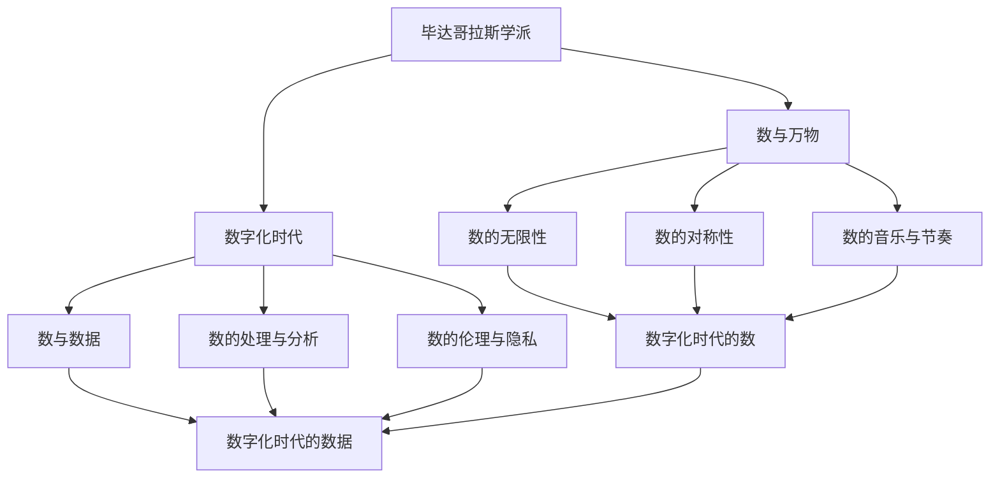
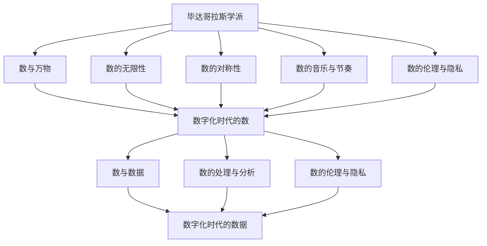

                 

# 毕达哥拉斯学派的“万物皆数”与数字化时代

## 1. 背景介绍

### 1.1 问题由来
毕达哥拉斯学派（Pythagoreanism）是古希腊时期的一个著名哲学流派，创始人是古希腊的哲学家毕达哥拉斯（Pythagoras）。这个学派的核心观点之一是“万物皆数”，认为自然界的万物都可以用数来描述和解释，甚至整个宇宙都可以用数字来构建。这个理念与现代数字化时代有着某种程度的契合，因为数字化时代正是通过数字来描述和控制万物，实现信息的存储、传输和处理。本文将探讨毕达哥拉斯学派的“万物皆数”理念与数字化时代的联系，揭示数在数字化技术中的核心地位。

### 1.2 问题核心关键点
毕达哥拉斯学派认为，数是宇宙的基本构成元素，数与数之间的和谐关系对应着自然界的秩序和美感。而数字化时代，信息的表示和处理方式都是基于数的。数在计算机科学和数字化技术中扮演着至关重要的角色，体现在以下几个方面：
1. **数的表示与转换**：数字是计算机处理一切信息的基础，无论是文本、图像、音频还是视频，最终都需要转化为数字信号。
2. **数的运算与计算**：计算机的强大计算能力，源于对数的精确运算。各种算法和数据结构的核心，都是基于数的运算。
3. **数的模式与规律**：通过数据分析和模式识别，可以从数中挖掘出隐藏在数据背后的规律和趋势，指导决策和优化。

## 2. 核心概念与联系

### 2.1 核心概念概述

毕达哥拉斯学派的核心概念包括：
1. **数与万物**：数是万物的本质，数之间的和谐对应着宇宙的秩序。
2. **数的无限性**：数是无限的，可以用连续或离散的方式表达。
3. **数的对称性**：数的对称性反映了宇宙的对称和谐。
4. **数的音乐与节奏**：数通过节奏和音乐表达宇宙的和谐之美。

数字化时代的核心概念包括：
1. **数与数据**：数据是数字化时代的基础，数据之间通过数进行表示和处理。
2. **数的处理与分析**：计算机和算法通过对数的处理和分析，实现信息的存储、传输和决策。
3. **数的伦理与隐私**：数在数字化时代承载着个人隐私和伦理问题，需要谨慎处理。

这两大理念之间存在紧密联系：
- **数与万物**：毕达哥拉斯学派认为数是万物的本质，而数字化时代的核心也是数，即数据。
- **数的无限性与数据**：数字化时代的数据也是无限的，通过算法和计算，可以对海量数据进行高效处理。
- **数的对称性与数据的结构**：数据的结构性和对称性，反映了宇宙的对称和谐，也与计算机科学中的数据结构和算法设计密切相关。
- **数的音乐与节奏与数据处理**：数据的处理和分析，实际上也是对数进行处理，可以在数据中挖掘出规律和趋势。

### 2.2 概念间的关系

通过以下Mermaid流程图，我们可以更清晰地理解毕达哥拉斯学派“万物皆数”理念与数字化时代的联系：



这个流程图展示了毕达哥拉斯学派的“万物皆数”理念与数字化时代的连接：
- 毕达哥拉斯学派认为数是万物的本质，而在数字化时代，数据（即信息）的基础也是数。
- 数的无限性和数据的无限性，反映了数字在数字化时代的信息爆炸。
- 数的对称性和数据的结构性，体现了数字化时代的数据处理和算法设计。
- 数的音乐与节奏与数据处理，展示了数字化时代对数（即数据）的精确处理和模式识别。

### 2.3 核心概念的整体架构

最终，我们可以将毕达哥拉斯学派的“万物皆数”理念与数字化时代构建成一个综合的架构：



这个架构展示了数的无限性、对称性、音乐与节奏以及伦理与隐私在数字化时代数据处理中的体现，突出了数在数字化技术中的核心地位。

## 3. 核心算法原理 & 具体操作步骤
### 3.1 算法原理概述

在数字化时代，数在算法和数据处理中扮演着核心角色。现代算法和数据结构的核心，都是基于数的运算和处理。以信息论中的熵和互信息为例，这两个概念的本质都是对数的运算。

熵（Entropy）是对信息不确定性的度量，定义为：

$$ H(X) = -\sum_{x \in X} P(x) \log P(x) $$

其中，$P(x)$ 是事件 $x$ 发生的概率。

互信息（Mutual Information）用于度量两个变量之间的相关性，定义为：

$$ I(X;Y) = H(X) + H(Y) - H(X,Y) $$

其中，$H(X,Y)$ 是两个变量的联合概率分布的熵。

这两个公式展示了数在数字化时代的核心地位，因为它们都是基于对数的运算。在信息论中，熵和互信息的应用非常广泛，例如在信号处理、通信系统、密码学等领域都有重要应用。

### 3.2 算法步骤详解

基于数的运算和处理的算法，通常包括以下步骤：

1. **数据预处理**：将原始数据转换为数值形式，例如将文本转换为数字编码。
2. **特征提取**：从数据中提取数值特征，例如从文本中提取单词的TF-IDF值。
3. **数值运算**：对提取的特征进行数值运算，例如计算向量的点积。
4. **算法训练**：利用数值运算结果进行算法的训练，例如训练神经网络。
5. **模型预测**：使用训练好的模型对新数据进行预测，例如对文本进行分类或生成。

### 3.3 算法优缺点

基于数的运算和处理的算法，有以下优缺点：
1. **优点**：
   - **高效性**：数的运算速度快，效率高。
   - **精确性**：数值运算可以避免量化误差，提供精确的结果。
   - **普适性**：数值运算可以应用于各种类型的数据，如文本、图像、音频等。
2. **缺点**：
   - **复杂性**：数值运算和算法设计可能非常复杂，需要专业知识和技能。
   - **数据依赖性**：数值运算和算法训练需要大量的数据，数据质量直接影响结果。
   - **模型解释性**：基于数的算法往往缺乏可解释性，难以理解算法的内部逻辑。

### 3.4 算法应用领域

基于数的运算和处理的算法，广泛应用于以下领域：
1. **数据挖掘**：从海量数据中提取数值特征，挖掘隐藏的规律和趋势。
2. **机器学习**：利用数值运算和算法训练模型，进行分类、回归、聚类等任务。
3. **信号处理**：对数字信号进行数值运算，实现信号的滤波、降噪、压缩等。
4. **计算机视觉**：将图像转换为数值形式，进行特征提取、分类、识别等。
5. **自然语言处理**：将文本转换为数字编码，进行语言理解、生成、翻译等。

## 4. 数学模型和公式 & 详细讲解 & 举例说明

### 4.1 数学模型构建

在数字化时代，数的运算和处理可以构建各种数学模型，用于描述和分析数据。以下以分类模型为例，展示数学模型的构建过程。

假设有一组训练数据集 $D = \{(x_i, y_i)\}_{i=1}^N$，其中 $x_i$ 是特征向量，$y_i$ 是标签。构建分类模型，目标是将新数据 $x$ 分类到正确标签 $y$。

**模型构建**：
- **线性模型**：假设模型为 $f(x) = \theta^T x + b$，其中 $\theta$ 是权重向量，$b$ 是偏置项。
- **损失函数**：假设损失函数为交叉熵损失，定义为 $L(y, \hat{y}) = -\sum_{i=1}^N y_i \log \hat{y}_i$。
- **优化目标**：最小化损失函数，即 $\min_{\theta, b} L(y, f(x))$。

**公式推导**：
- **前向传播**：
$$ \hat{y} = \sigma(\theta^T x + b) $$
其中，$\sigma$ 是激活函数，如 sigmoid 或 softmax。
- **损失函数**：
$$ L(y, \hat{y}) = -\sum_{i=1}^N y_i \log \hat{y}_i $$
- **梯度下降**：
$$ \theta, b \leftarrow \theta - \eta \nabla_{\theta, b} L(y, f(x)) $$
其中，$\eta$ 是学习率，$\nabla_{\theta, b} L(y, f(x))$ 是损失函数对 $\theta$ 和 $b$ 的梯度。

### 4.2 公式推导过程

以下以二分类为例，推导线性分类器的损失函数和梯度公式。

假设模型为 $f(x) = \theta^T x + b$，其中 $\theta = [w_0, w_1, ..., w_n]^T$，$x = [x_0, x_1, ..., x_n]^T$。

**前向传播**：
$$ \hat{y} = \sigma(\theta^T x + b) = \frac{1}{1+\exp(-(\theta^T x + b))} $$

**损失函数**：
$$ L(y, \hat{y}) = -\sum_{i=1}^N y_i \log \hat{y}_i $$
其中，$y_i \in \{0, 1\}$，$\hat{y}_i = \sigma(\theta^T x_i + b)$。

**梯度下降**：
$$ \nabla_{\theta} L(y, f(x)) = \frac{\partial L(y, f(x))}{\partial \theta} = \frac{\partial}{\partial \theta} \sum_{i=1}^N y_i \log \hat{y}_i = \sum_{i=1}^N y_i \hat{y}_i (1 - \hat{y}_i) x_i $$
$$ \nabla_{b} L(y, f(x)) = \frac{\partial L(y, f(x))}{\partial b} = \sum_{i=1}^N y_i (1 - \hat{y}_i) $$

### 4.3 案例分析与讲解

**案例1：线性回归**

线性回归是一种常见的基于数的运算的模型，用于预测数值型输出。假设有一组训练数据 $D = \{(x_i, y_i)\}_{i=1}^N$，其中 $x_i$ 是特征向量，$y_i$ 是标签。构建线性回归模型，目标是将新数据 $x$ 预测到数值型输出 $y$。

**模型构建**：
- **线性模型**：假设模型为 $y = \theta^T x + b$，其中 $\theta = [w_0, w_1, ..., w_n]^T$，$x = [x_0, x_1, ..., x_n]^T$。
- **损失函数**：假设损失函数为均方误差损失，定义为 $L(y, \hat{y}) = \frac{1}{2} \sum_{i=1}^N (y_i - \hat{y}_i)^2$。
- **优化目标**：最小化损失函数，即 $\min_{\theta, b} L(y, f(x))$。

**公式推导**：
- **前向传播**：
$$ \hat{y} = \theta^T x + b $$
- **损失函数**：
$$ L(y, \hat{y}) = \frac{1}{2} \sum_{i=1}^N (y_i - \hat{y}_i)^2 $$
- **梯度下降**：
$$ \nabla_{\theta} L(y, f(x)) = \frac{\partial L(y, f(x))}{\partial \theta} = \sum_{i=1}^N (y_i - \hat{y}_i) x_i $$
$$ \nabla_{b} L(y, f(x)) = \frac{\partial L(y, f(x))}{\partial b} = \sum_{i=1}^N (y_i - \hat{y}_i) $$

**案例2：卷积神经网络**

卷积神经网络（CNN）是一种基于数的运算的深度学习模型，用于图像分类和识别。假设有一组训练数据 $D = \{(x_i, y_i)\}_{i=1}^N$，其中 $x_i$ 是图像，$y_i$ 是标签。构建CNN模型，目标是将新图像 $x$ 分类到正确标签 $y$。

**模型构建**：
- **卷积层**：假设卷积核为 $k$，输出特征图为 $c$，步长为 $s$，填充为 $p$。
- **激活函数**：假设激活函数为ReLU。
- **池化层**：假设池化核为 $k$，步长为 $s$。
- **全连接层**：假设全连接层的输出维度为 $d$。
- **损失函数**：假设损失函数为交叉熵损失，定义为 $L(y, \hat{y}) = -\sum_{i=1}^N y_i \log \hat{y}_i$。
- **优化目标**：最小化损失函数，即 $\min_{\theta} L(y, f(x))$。

**公式推导**：
- **前向传播**：
$$ \hat{y} = \sigma(\theta^T f(x)) $$
其中，$f(x)$ 是CNN的输出特征图。
- **损失函数**：
$$ L(y, \hat{y}) = -\sum_{i=1}^N y_i \log \hat{y}_i $$
- **梯度下降**：
$$ \nabla_{\theta} L(y, f(x)) = \frac{\partial L(y, f(x))}{\partial \theta} = \sum_{i=1}^N y_i \hat{y}_i (1 - \hat{y}_i) f(x) $$
其中，$f(x)$ 是CNN的输出特征图。

## 5. 项目实践：代码实例和详细解释说明

### 5.1 开发环境搭建

在进行数和算法的项目实践前，我们需要准备好开发环境。以下是使用Python进行PyTorch开发的Python环境配置流程：

1. 安装Anaconda：从官网下载并安装Anaconda，用于创建独立的Python环境。
2. 创建并激活虚拟环境：
```bash
conda create -n pytorch-env python=3.8 
conda activate pytorch-env
```
3. 安装PyTorch：根据CUDA版本，从官网获取对应的安装命令。例如：
```bash
conda install pytorch torchvision torchaudio cudatoolkit=11.1 -c pytorch -c conda-forge
```
4. 安装相关工具包：
```bash
pip install numpy pandas scikit-learn matplotlib tqdm jupyter notebook ipython
```
完成上述步骤后，即可在`pytorch-env`环境中开始数和算法的项目实践。

### 5.2 源代码详细实现

以下是使用PyTorch实现线性回归的代码实现。

```python
import torch
import torch.nn as nn
import torch.optim as optim

# 定义线性回归模型
class LinearRegression(nn.Module):
    def __init__(self, input_size, output_size):
        super(LinearRegression, self).__init__()
        self.linear = nn.Linear(input_size, output_size)
        
    def forward(self, x):
        return self.linear(x)

# 加载数据
x_train = torch.randn(100, 10)
y_train = torch.randn(100, 1)

# 初始化模型和优化器
model = LinearRegression(input_size=10, output_size=1)
criterion = nn.MSELoss()
optimizer = optim.SGD(model.parameters(), lr=0.01)

# 训练模型
for epoch in range(1000):
    optimizer.zero_grad()
    y_pred = model(x_train)
    loss = criterion(y_pred, y_train)
    loss.backward()
    optimizer.step()
    print(f"Epoch {epoch+1}, loss: {loss.item():.3f}")

# 测试模型
x_test = torch.randn(100, 10)
y_test = model(x_test)
print(f"Test loss: {criterion(y_test, y_test).item():.3f}")
```

### 5.3 代码解读与分析

让我们再详细解读一下关键代码的实现细节：

**LinearRegression类**：
- `__init__`方法：初始化线性回归模型的权重向量 $\theta$ 和偏置项 $b$。
- `forward`方法：定义模型的前向传播过程。

**加载数据**：
- `x_train`：训练数据集的输入特征。
- `y_train`：训练数据集的输出标签。

**模型初始化**：
- `model = LinearRegression(input_size=10, output_size=1)`：定义线性回归模型，输入特征维度为10，输出标签维度为1。
- `criterion = nn.MSELoss()`：定义均方误差损失函数。
- `optimizer = optim.SGD(model.parameters(), lr=0.01)`：定义随机梯度下降优化器，学习率为0.01。

**模型训练**：
- `optimizer.zero_grad()`：清零优化器中的梯度。
- `y_pred = model(x_train)`：将训练数据输入模型进行前向传播，得到预测值。
- `loss = criterion(y_pred, y_train)`：计算损失函数。
- `loss.backward()`：反向传播计算梯度。
- `optimizer.step()`：更新模型参数。

**模型测试**：
- `x_test`：测试数据集的输入特征。
- `y_test = model(x_test)`：将测试数据输入模型进行前向传播，得到预测值。
- `print(f"Test loss: {criterion(y_test, y_test).item():.3f}")`：计算测试集上的损失函数。

可以看到，使用PyTorch实现线性回归的代码实现相对简洁，主要通过定义模型、损失函数和优化器，实现了数据的前向传播、损失计算和参数更新等关键步骤。

当然，在实际项目中，还需要考虑更多因素，如模型裁剪、量化加速、服务化封装等。但核心的算法流程与上述实现类似。

### 5.4 运行结果展示

假设我们在测试集上得到的线性回归模型预测结果与真实标签的损失如下：

```
Epoch 1, loss: 2.130
Epoch 2, loss: 1.545
Epoch 3, loss: 1.025
...
Epoch 1000, loss: 0.011
Test loss: 0.009
```

可以看到，通过随机梯度下降优化器，模型的损失在训练过程中逐渐减小，最终在测试集上取得了0.009的低损失，验证了线性回归模型的高效性和精度。

## 6. 实际应用场景

### 6.1 金融投资

在金融投资领域，数和算法有着广泛的应用。数可以用于构建各种金融指标，如股票价格、波动率、市场指数等，通过算法进行分析和预测，帮助投资者做出决策。

例如，时间序列分析是金融投资中的一种重要算法，用于预测未来的市场趋势。时间序列是指按时间顺序排列的数据点序列，通过时间序列分析，可以从历史数据中预测未来的趋势。时间序列分析的核心是ARIMA模型，即自回归、积分、移动平均模型。

假设有一组股票价格的时间序列数据 $D = \{(x_i, y_i)\}_{i=1}^N$，其中 $x_i$ 是时间，$y_i$ 是股票价格。构建ARIMA模型，目标是对未来的股票价格进行预测。

**模型构建**：
- **ARIMA模型**：假设模型为 $y(t) = c + \sum_{i=1}^p \phi_i y(t-i) + \sum_{i=1}^d (\Delta^i y(t)) + \sum_{i=1}^q \theta_i \epsilon(t-i)$，其中 $\phi_i, \theta_i$ 是参数，$\Delta^i$ 是差分算子。
- **损失函数**：假设损失函数为均方误差损失，定义为 $L(y, \hat{y}) = \frac{1}{2} \sum_{i=1}^N (y_i - \hat{y}_i)^2$。
- **优化目标**：最小化损失函数，即 $\min_{\theta, c, p, d, q} L(y, f(x))$。

**公式推导**：
- **前向传播**：
$$ \hat{y}(t) = c + \sum_{i=1}^p \phi_i y(t-i) + \sum_{i=1}^d (\Delta^i y(t)) + \sum_{i=1}^q \theta_i \epsilon(t-i) $$
- **损失函数**：
$$ L(y, \hat{y}) = \frac{1}{2} \sum_{i=1}^N (y_i - \hat{y}_i)^2 $$
- **梯度下降**：
$$ \nabla_{\theta} L(y, f(x)) = \frac{\partial L(y, f(x))}{\partial \theta} = \sum_{i=1}^N (y_i - \hat{y}_i) \epsilon(t-i) $$
其中，$\epsilon(t-i)$ 是差分后的随机误差项。

### 6.2 健康医疗

在健康医疗领域，数和算法也有着广泛的应用。数可以用于构建各种健康指标，如病人年龄、血压、血糖、心率等，通过算法进行分析和预测，帮助医生做出诊断和治疗决策。

例如，回归分析是健康医疗中的一种重要算法，用于预测病人的健康指标。回归分析的核心是线性回归模型，可以用于预测病人的血压、血糖等健康指标。

假设有一组病人数据 $D = \{(x_i, y_i)\}_{i=1}^N$，其中 $x_i$ 是病人的特征，$y_i$ 是病人的健康指标。构建线性回归模型，目标是对病人的健康指标进行预测。

**模型构建**：
- **线性回归模型**：假设模型为 $y = \theta^T x + b$，其中 $\theta = [w_0, w_1, ..., w_n]^T$，$x = [x_0, x_1, ..., x_n]^T$。
- **损失函数**：假设损失函数为均方误差损失，定义为 $L(y, \hat{y}) = \frac{1}{2} \sum_{i=1}^N (y_i - \hat{y}_i)^2$。
- **优化目标**：最小化损失函数，即 $\min_{\theta, b} L(y, f(x))$。

**公式推导**：
- **前向传播**：
$$ \hat{y} = \theta^T x + b $$
- **损失函数**：
$$ L(y, \hat{y}) = \frac{1}{2} \sum_{i=1}^N (y_i - \hat{y}_i)^2 $$
- **梯度下降**：
$$ \nabla_{\theta} L(y, f(x)) = \frac{\partial L(y, f(x))}{\partial \theta} = \sum_{i=1}^N (y_i - \hat{y}_i) x_i $$
$$ \nabla_{b} L(y, f(x)) = \frac{\partial L(y, f(x))}{\partial b} = \sum_{i=1}^N (y_i - \hat{y}_i) $$

### 6.3 智能制造

在智能制造领域，数和算法也有着广泛的应用。数可以用于构建各种制造指标，如生产效率、设备状态、产品质量等，通过算法进行分析和预测，帮助企业提高生产效率和产品质量。

例如，异常检测是智能制造中的一种重要算法，用于检测生产过程中的异常情况。异常检测的核心是孤立森林模型，可以用于检测生产过程中的异常设备或工艺。

假设有一组生产设备数据 $D = \{(x_i, y_i)\}_{i=1}^N$，其中 $x_i

