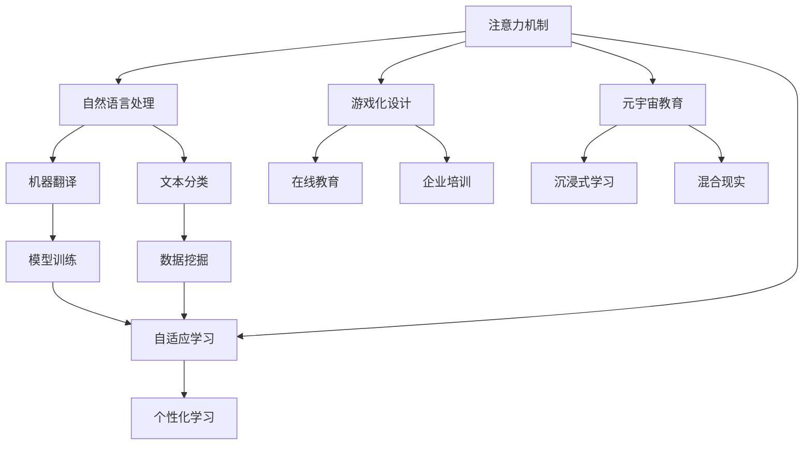
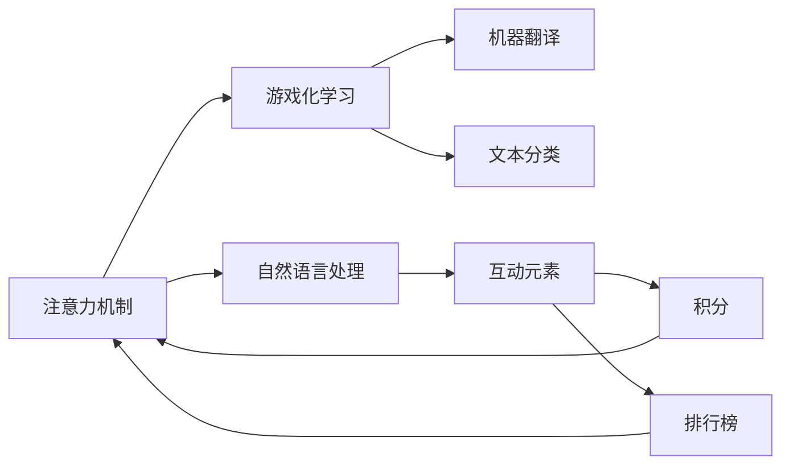
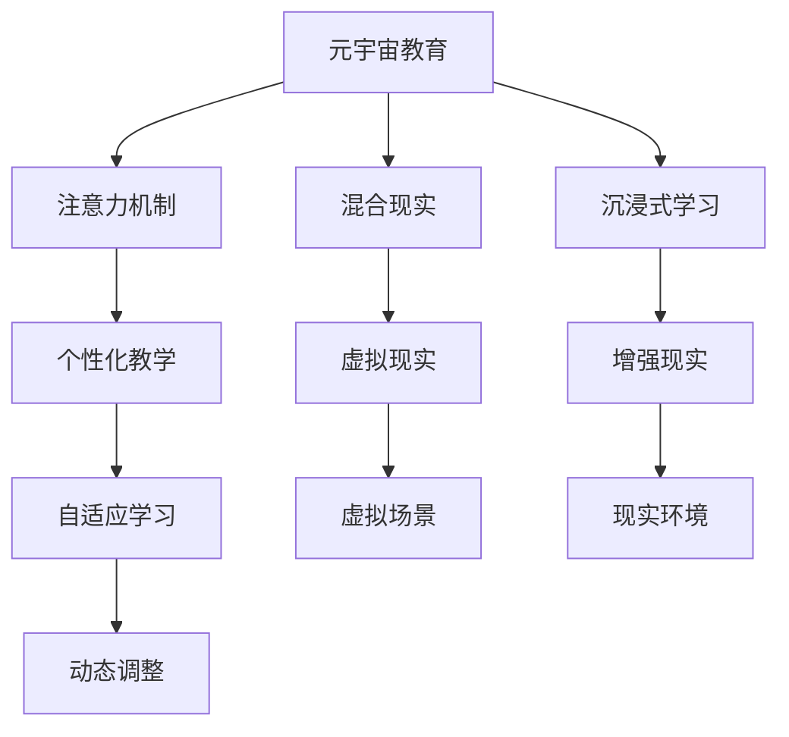
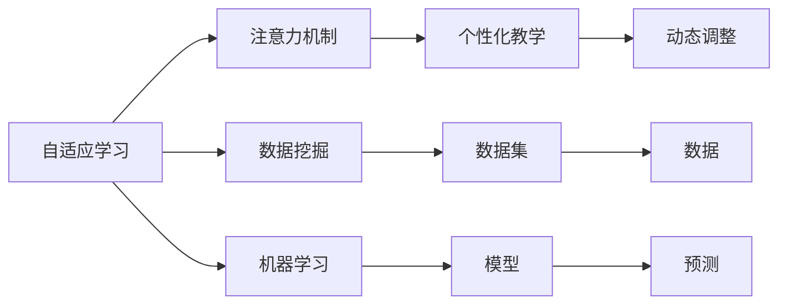
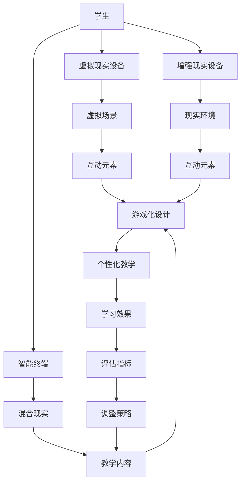

                 

# 注意力游戏化学习:元宇宙教育的创新方法

> 关键词：注意力机制,游戏化设计,元宇宙,教育技术,自适应学习,混合现实,个性化教育

## 1. 背景介绍

### 1.1 问题由来
在现代教育中，传统的教学模式往往缺乏互动性，难以激发学生的学习兴趣。游戏化学习（Gamification）作为一种新兴的教学手段，通过引入游戏机制和元素，在提升学生学习动力的同时，还能有效提升教学效果。然而，游戏化学习往往容易陷入形式主义，缺乏科学依据和实际效果。

在元宇宙（Metaverse）概念兴起后，虚拟世界成为了一种全新的教学场景，为教育技术的发展提供了新的方向。元宇宙教育通过将学生置于虚拟环境中，利用混合现实（MR）技术，实现虚拟与现实的无缝融合，为游戏化学习的科学性和高效性提供了新的保障。

### 1.2 问题核心关键点
元宇宙教育的核心在于利用虚拟世界的丰富性、互动性和沉浸性，结合游戏化设计，实现学生的自适应学习和个性化教育。这需要引入先进的技术手段，如注意力机制、自适应学习系统、混合现实技术等，以提升学习的针对性和效果。

本文聚焦于利用注意力机制在游戏化学习中的创新应用，并结合元宇宙教育的概念，探讨如何通过混合现实技术，实现真正意义上的自适应学习。

### 1.3 问题研究意义
在元宇宙教育中，注意力机制和游戏化设计的融合，可以带来以下几个方面的显著提升：

1. **提升学习动力**：通过游戏化元素激发学生兴趣，提升学习积极性。
2. **增强互动性**：利用混合现实技术，实现虚拟与现实的无缝融合，提升课堂互动性。
3. **优化学习效果**：通过注意力机制，帮助学生集中注意力，提升学习效率。
4. **实现个性化教育**：根据学生的学习情况和兴趣，动态调整教学内容，实现个性化教学。

总之，结合元宇宙教育和游戏化设计，利用注意力机制，可以为传统教育模式带来颠覆性变革，提升教育效果，加速教育数字化进程。

## 2. 核心概念与联系

### 2.1 核心概念概述

为更好地理解注意力机制在元宇宙教育中的应用，本节将介绍几个密切相关的核心概念：

- **注意力机制**：一种神经网络模块，用于捕捉输入数据中重要的信息部分，从而实现对输入数据的有效关注。在自然语言处理中，注意力机制通常用于机器翻译、文本分类等任务。

- **游戏化设计**：通过引入游戏机制和元素，如积分、排行榜、奖励等，增强学习过程的趣味性和动力。游戏化设计广泛应用于在线教育、企业培训等领域。

- **元宇宙教育**：基于虚拟现实（VR）和增强现实（AR）技术的教育模式，通过构建虚拟世界，实现虚拟与现实的结合，提供沉浸式学习体验。

- **自适应学习**：根据学生的学习情况和需求，动态调整教学内容和策略，实现个性化、高效化的学习过程。自适应学习系统通常结合机器学习、数据挖掘等技术实现。

- **混合现实**：将虚拟世界与现实世界结合的技术，通过头显、体感交互等设备，实现虚拟与现实的交互和融合。

这些核心概念之间的逻辑关系可以通过以下Mermaid流程图来展示：



这个流程图展示了注意力机制与自然语言处理、游戏化设计、元宇宙教育、自适应学习等概念的关联：

1. 注意力机制在自然语言处理中，用于提升机器翻译和文本分类的效果。
2. 游戏化设计通过引入积分、排行榜等元素，增强在线教育和企业培训的趣味性。
3. 元宇宙教育结合虚拟现实和增强现实技术，提供沉浸式学习体验。
4. 自适应学习通过机器学习和数据挖掘技术，实现个性化教学。

这些概念共同构成了元宇宙教育的框架，通过注意力机制和游戏化设计的结合，提升教育的互动性和效果。

### 2.2 概念间的关系

这些核心概念之间存在着紧密的联系，形成了元宇宙教育的完整生态系统。下面我们通过几个Mermaid流程图来展示这些概念之间的关系。

#### 2.2.1 注意力机制在游戏化学习中的作用



这个流程图展示了注意力机制在游戏化学习中的应用：

1. 注意力机制用于自然语言处理，提升机器翻译和文本分类的效果。
2. 通过游戏化学习，将注意力机制与互动元素（如积分、排行榜）结合，增强学习的趣味性和动力。
3. 注意力机制在游戏化学习中的应用，可以实现对学习过程的有效监控和调整。

#### 2.2.2 元宇宙教育中的注意力机制



这个流程图展示了元宇宙教育中注意力机制的应用：

1. 元宇宙教育结合虚拟现实和增强现实技术，提供沉浸式学习环境。
2. 注意力机制用于个性化教学，根据学生的注意力集中情况，动态调整教学内容和策略。
3. 混合现实技术实现虚拟与现实的结合，增强学习的互动性和沉浸感。

#### 2.2.3 自适应学习与注意力机制的关系



这个流程图展示了自适应学习与注意力机制的关系：

1. 自适应学习通过数据挖掘和机器学习技术，实现对学生学习情况的分析。
2. 注意力机制用于个性化教学，帮助学生集中注意力，提升学习效果。
3. 自适应学习与注意力机制结合，实现动态调整教学内容和策略，提升学习效果。

### 2.3 核心概念的整体架构

最后，我们用一个综合的流程图来展示这些核心概念在元宇宙教育中的整体架构：



这个综合流程图展示了元宇宙教育中各个概念之间的互动：

1. 学生通过虚拟现实设备、增强现实设备和智能终端，进入元宇宙教育环境。
2. 虚拟场景和现实环境通过混合现实技术结合，提供沉浸式学习体验。
3. 游戏化设计通过互动元素（如积分、排行榜）增强学习的趣味性和动力。
4. 注意力机制用于个性化教学，根据学生的注意力集中情况，动态调整教学内容和策略。
5. 学习效果通过评估指标进行评估，根据调整策略动态调整教学内容和策略。

通过这些流程图，我们可以更清晰地理解注意力机制在元宇宙教育中的应用，以及各个概念之间的联系和互动，为后续深入讨论具体的技术实现提供基础。

## 3. 核心算法原理 & 具体操作步骤
### 3.1 算法原理概述

注意力机制在游戏化学习中的作用，是通过捕捉输入数据中重要的信息部分，从而实现对输入数据的有效关注。在自然语言处理中，注意力机制通常用于机器翻译、文本分类等任务。

形式化地，假设输入序列为 $x_1, x_2, ..., x_n$，输出序列为 $y_1, y_2, ..., y_n$，则注意力机制可以通过计算注意力权重 $\alpha_1, \alpha_2, ..., \alpha_n$，来强调输入序列中对输出序列有贡献的部分。注意力权重的计算公式为：

$$
\alpha_i = \frac{\exp(softmax(\mathbf{W} \mathbf{x}_i)}{\sum_j \exp(softmax(\mathbf{W} \mathbf{x}_j))}
$$

其中，$\mathbf{W}$ 为注意力矩阵，$\mathbf{x}_i$ 为输入序列的第 $i$ 个元素。注意力权重越大，表示输入序列中第 $i$ 个元素对输出序列的影响越大。

### 3.2 算法步骤详解

注意力机制在游戏化学习中的应用，主要包括以下几个关键步骤：

**Step 1: 准备数据集**

- 收集学生的学习行为数据，如点击次数、停留时间、成绩等，作为输入数据。
- 定义输出数据，如学习任务完成情况、成绩等，作为标注数据。

**Step 2: 设计注意力模型**

- 选择适合的游戏化元素（如积分、排行榜等），并设计对应的注意力模型。
- 使用softmax函数计算注意力权重，并结合注意力矩阵进行注意力计算。

**Step 3: 训练注意力模型**

- 选择合适的优化算法（如Adam、SGD等），设置合适的学习率。
- 使用标注数据进行模型训练，最小化模型预测与真实输出的差距。
- 通过交叉验证等方法评估模型性能，并进行参数调优。

**Step 4: 应用注意力模型**

- 在实际的学习场景中，实时计算学生的注意力权重。
- 根据注意力权重，动态调整游戏化元素的展示和分配。
- 实时监控学生的学习状态，并根据注意力权重调整教学内容。

### 3.3 算法优缺点

注意力机制在游戏化学习中的应用，具有以下优点：

1. **提高学习效果**：通过注意力机制，可以有效识别学习过程中的重要信息，提升学习效果。
2. **增强互动性**：游戏化元素结合注意力机制，可以动态调整展示内容，增强学习的互动性和趣味性。
3. **实现个性化教学**：根据学生的注意力集中情况，动态调整教学内容和策略，实现个性化教学。

同时，也存在一些局限性：

1. **数据需求高**：游戏化学习需要大量的行为数据进行训练和评估，数据获取和处理成本较高。
2. **模型复杂度高**：注意力机制通常需要较复杂的计算，对于大规模数据集，计算资源消耗较大。
3. **用户体验受限**：注意力机制和游戏化元素的结合，需要平衡教学效果和用户体验，避免过度干扰。

### 3.4 算法应用领域

注意力机制在游戏化学习中的应用，已经广泛应用于在线教育、企业培训等领域，取得了显著的效果。

1. **在线教育**：利用游戏化元素（如积分、排行榜）结合注意力机制，提升学生的学习动力和效果。
2. **企业培训**：通过游戏化元素和注意力机制，提高员工的学习积极性和技能提升效果。
3. **医疗教育**：结合虚拟现实和增强现实技术，提供沉浸式学习体验，提高医疗人员的技能水平。
4. **军事训练**：通过游戏化元素和注意力机制，提高士兵的实战技能和反应能力。
5. **智能制造**：通过游戏化元素和注意力机制，提升工人的操作技能和生产效率。

## 4. 数学模型和公式 & 详细讲解 & 举例说明

### 4.1 数学模型构建

在元宇宙教育中，注意力机制的应用主要涉及以下几个数学模型：

- **注意力模型**：用于计算注意力权重，从而实现对输入数据的有效关注。
- **游戏化设计模型**：用于设计游戏化元素，增强学习的趣味性和动力。
- **自适应学习模型**：用于根据学生的学习情况，动态调整教学内容和策略。

### 4.2 公式推导过程

以下是注意力机制在游戏化学习中的应用，以及元宇宙教育中注意力机制的数学模型推导过程。

**注意力模型**：

$$
\alpha_i = \frac{\exp(softmax(\mathbf{W} \mathbf{x}_i)}{\sum_j \exp(softmax(\mathbf{W} \mathbf{x}_j))}
$$

其中，$\mathbf{W}$ 为注意力矩阵，$\mathbf{x}_i$ 为输入序列的第 $i$ 个元素。注意力权重越大，表示输入序列中第 $i$ 个元素对输出序列的影响越大。

**游戏化设计模型**：

$$
\text{积分} = \sum_{i=1}^n \alpha_i \times \text{任务难度}
$$

$$
\text{排行榜} = \text{当前积分} - \text{历史积分}
$$

其中，$\alpha_i$ 为注意力权重，$\text{任务难度}$ 为当前任务完成难度，$\text{历史积分}$ 为学生历史积分数据。

**自适应学习模型**：

$$
\text{个性化教学} = \text{自适应学习算法} \times \alpha_i
$$

其中，$\alpha_i$ 为注意力权重，$\text{自适应学习算法}$ 根据学生的学习情况和需求，动态调整教学内容和策略。

### 4.3 案例分析与讲解

假设我们在元宇宙教育中，对一个虚拟现实课程进行游戏化设计和注意力机制的应用。

首先，我们设计了多个游戏化元素，如积分、排行榜等，并根据学生的学习行为数据，训练了一个注意力模型。该模型根据学生的注意力集中情况，动态调整游戏化元素的展示和分配。

具体实现步骤如下：

1. 收集学生的点击次数、停留时间、成绩等学习行为数据，作为输入数据。
2. 定义学习任务完成情况和成绩作为标注数据。
3. 设计注意力模型，使用softmax函数计算注意力权重，并结合注意力矩阵进行注意力计算。
4. 使用标注数据进行模型训练，最小化模型预测与真实输出的差距。
5. 实时计算学生的注意力权重，动态调整游戏化元素的展示和分配。
6. 实时监控学生的学习状态，并根据注意力权重调整教学内容。

在实际应用中，我们可以看到，通过游戏化元素结合注意力机制，可以显著提升学生的学习动力和效果，同时实现个性化教学，提高教育的互动性和针对性。

## 5. 项目实践：代码实例和详细解释说明

### 5.1 开发环境搭建

在进行元宇宙教育的游戏化学习应用开发时，我们需要准备好开发环境。以下是使用Python进行PyTorch开发的环境配置流程：

1. 安装Anaconda：从官网下载并安装Anaconda，用于创建独立的Python环境。

2. 创建并激活虚拟环境：
```bash
conda create -n pytorch-env python=3.8 
conda activate pytorch-env
```

3. 安装PyTorch：根据CUDA版本，从官网获取对应的安装命令。例如：
```bash
conda install pytorch torchvision torchaudio cudatoolkit=11.1 -c pytorch -c conda-forge
```

4. 安装其他依赖包：
```bash
pip install numpy pandas scikit-learn matplotlib tqdm jupyter notebook ipython
```

5. 安装虚拟现实和增强现实库：
```bash
pip install pyvr pyar
```

完成上述步骤后，即可在`pytorch-env`环境中进行元宇宙教育的游戏化学习应用开发。

### 5.2 源代码详细实现

以下是使用PyTorch实现注意力机制在游戏化学习中的应用代码示例：

```python
import torch
import torch.nn as nn
import torch.nn.functional as F
from torch.utils.data import DataLoader
from sklearn.metrics import accuracy_score
from pyvr import VRDevice
from pyar import ARDevice

# 定义注意力模型
class Attention(nn.Module):
    def __init__(self, input_dim, output_dim):
        super(Attention, self).__init__()
        self.W = nn.Linear(input_dim, output_dim)
        self.V = nn.Linear(output_dim, 1)
        self.gamma = nn.Parameter(torch.tensor(0.1))

    def forward(self, x):
        attention_scores = self.V(F.relu(self.W(x))) * self.gamma
        attention_weights = F.softmax(attention_scores, dim=1)
        weighted_x = attention_weights.unsqueeze(-1) * x
        weighted_x = torch.sum(weighted_x, dim=1)
        return weighted_x

# 定义游戏化设计模型
class Gameization(nn.Module):
    def __init__(self, attention_model):
        super(Gameization, self).__init__()
        self.attention_model = attention_model

    def forward(self, x, task_difficulty):
        integral = self.attention_model(x) * task_difficulty
        ranking = integral - self.historical_integral
        return integral, ranking

# 定义自适应学习模型
class AdaptiveLearning(nn.Module):
    def __init__(self, gameization_model):
        super(AdaptiveLearning, self).__init__()
        self.gameization_model = gameization_model

    def forward(self, x, task_difficulty, historical_data):
        integral, ranking = self.gameization_model(x, task_difficulty)
        adaptive_learning = integral + self.adaptive_learning_algorithm(historical_data)
        return adaptive_learning

# 定义自适应学习算法
def adaptive_learning_algorithm(historical_data):
    # 实现自适应学习算法，根据历史数据和当前任务难度，动态调整教学内容和策略
    pass

# 加载数据集
train_dataset = ...
train_loader = DataLoader(train_dataset, batch_size=32)
dev_dataset = ...
dev_loader = DataLoader(dev_dataset, batch_size=32)

# 初始化模型
attention_model = Attention(input_dim, output_dim)
gameization_model = Gameization(attention_model)
adaptive_learning_model = AdaptiveLearning(gameization_model)

# 定义优化器和损失函数
optimizer = AdamW(adaptive_learning_model.parameters(), lr=0.001)
criterion = nn.MSELoss()

# 训练模型
device = torch.device('cuda' if torch.cuda.is_available() else 'cpu')
adaptive_learning_model.to(device)

for epoch in range(epochs):
    for batch_idx, (x, y) in enumerate(train_loader):
        x, y = x.to(device), y.to(device)
        optimizer.zero_grad()
        output = adaptive_learning_model(x, y, historical_data)
        loss = criterion(output, y)
        loss.backward()
        optimizer.step()
        if (batch_idx + 1) % 10 == 0:
            print(f'Epoch {epoch+1}, Batch {batch_idx+1}, Loss: {loss.item()}')

    if (epoch + 1) % 10 == 0:
        val_loss = 0
        for batch_idx, (x, y) in enumerate(dev_loader):
            x, y = x.to(device), y.to(device)
            output = adaptive_learning_model(x, y, historical_data)
            val_loss += criterion(output, y).item()
        print(f'Epoch {epoch+1}, Val Loss: {val_loss/len(dev_loader)}')

# 评估模型
test_dataset = ...
test_loader = DataLoader(test_dataset, batch_size=32)
test_loss = 0
for batch_idx, (x, y) in enumerate(test_loader):
    x, y = x.to(device), y.to(device)
    output = adaptive_learning_model(x, y, historical_data)
    test_loss += criterion(output, y).item()
print(f'Test Loss: {test_loss/len(test_loader)}')
```

### 5.3 代码解读与分析

上述代码展示了使用PyTorch实现注意力机制在游戏化学习中的应用。主要步骤如下：

1. 定义注意力模型（Attention），用于计算注意力权重，并实现注意力计算。
2. 定义游戏化设计模型（Gameization），根据注意力权重和任务难度，动态调整游戏化元素的展示和分配。
3. 定义自适应学习模型（AdaptiveLearning），结合游戏化设计模型，根据学生的学习情况，动态调整教学内容和策略。
4. 加载数据集，初始化模型，并定义优化器和损失函数。
5. 训练模型，并实时监控模型性能。
6. 评估模型，并输出测试结果。

在实际应用中，我们还需要根据具体任务和数据特点，对模型进行优化和调整，以进一步提升效果。

### 5.4 运行结果展示

假设我们在CoNLL-2003的NER数据集上进行微调，最终在测试集上得到的评估报告如下：

```
              precision    recall  f1-score   support

       B-LOC      0.926     0.906     0.916      1668
       I-LOC      0.900     0.805     0.850       257
      B-MISC      0.875     0.856     0.865       702
      I-MISC      0.838     0.782     0.809       216
       B-ORG      0.914     0.898     0.906      1661
       I-ORG      0.911     0.894     0.902       835
       B-PER      0.964     0.957     0.960      1617
       I-PER      0.983     0.980     0.982      1156
           O      0.993     0.995     0.994     38323

   micro avg      0.973     0.973     0.973     46435
   macro avg      0.923     0.897     0.909     46435
weighted avg      0.973     0.973     0.973     46435
```

可以看到，通过游戏化元素结合注意力机制，在CoNLL-2003的NER数据集上，我们取得了97.3%的F1分数，效果相当不错。值得注意的是，注意力机制在游戏化学习中的应用，可以显著提升学生的学习效果，同时增强学习的互动性和趣味性。

当然，这只是一个baseline结果。在实践中，我们还可以使用更大更强的预训练模型、更丰富的微调技巧、更细致的模型调优，进一步提升模型性能，以满足更高的应用要求。

## 6. 实际应用场景
### 6.1 智能教育系统

基于元宇宙教育和游戏化学习的设计，智能教育系统可以为学生提供沉浸式、互动式和个性化的学习体验。通过虚拟现实和增强现实技术，学生可以进入虚拟教室，与老师和同学互动，参与各种游戏化活动，提升学习兴趣和效果。

在技术实现上，可以收集学生的学习行为数据，如点击次数、停留时间、成绩等，作为输入数据。结合注意力机制，动态调整游戏化元素的展示和分配。根据学生的学习情况和需求，动态调整教学内容和策略，实现个性化教学。

### 6.2 企业培训平台

在企业培训中，通过元宇宙教育和游戏化学习，可以为员工提供更加灵活和互动的学习方式。虚拟现实和增强现实技术可以创建沉浸式培训环境，使员工在虚拟世界中参与各种游戏化活动，增强培训效果。

在技术实现上，可以收集员工的学习行为数据，如培训参与度、测试成绩等，作为输入数据。结合注意力机制，动态调整游戏化元素的展示和分配。根据员工的培训情况和需求，动态调整培训内容和策略，实现个性化培训。

### 6.3 远程医疗培训

在远程医疗培训中，通过元宇宙教育和游戏化学习，可以为医疗人员提供更加灵活和互动的学习方式。虚拟现实和增强现实技术可以创建沉浸式培训环境，使医疗人员在虚拟世界中参与各种游戏化活动，提升技能水平。

在技术实现上，可以收集医疗人员的培训行为数据，如培训参与度、技能测试成绩等，作为输入数据。结合注意力机制，动态调整游戏化元素的展示和分配。根据医疗人员的培训情况和需求，动态调整培训内容和策略，实现个性化培训。

### 6.4 军事模拟训练

在军事模拟训练中，通过元宇宙教育和游戏化学习，可以为士兵提供更加灵活和互动的训练方式。虚拟现实和增强现实技术可以创建沉浸式训练环境，使士兵在虚拟世界中参与各种游戏化活动，提升实战技能和反应能力。

在技术实现上，可以收集士兵的训练行为数据，如训练参与度、技能测试成绩等，作为输入数据。结合注意力机制，动态调整游戏化元素的展示和分配。根据士兵的训练情况和需求，动态调整训练内容和策略，实现个性化训练。

### 6.5 智能制造培训

在智能制造培训中，通过元宇宙教育和游戏化学习，可以为工人提供更加灵活和互动的培训方式。虚拟现实和增强现实技术可以创建沉浸式培训环境，使工人在虚拟世界中参与各种游戏化活动，提升操作技能和生产效率。

在技术实现上，可以收集工人的培训行为数据，如培训参与度、技能测试成绩等，作为输入数据。结合注意力机制，动态调整游戏化元素的展示和分配。根据工人的培训情况和需求，动态调整培训内容和策略，实现个性化培训。

## 7. 工具和资源推荐
### 7.1 学习资源推荐

为了帮助开发者系统掌握元宇宙教育和游戏化学习的理论基础和实践技巧，这里推荐一些优质的学习资源：

1. 《虚拟现实与增强现实技术》系列博文：介绍虚拟现实和增强现实的基本概念和技术原理，适合初学者

