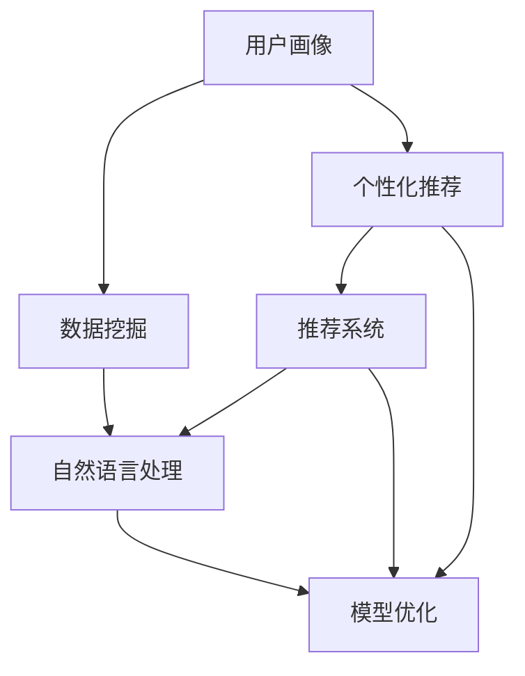

                 

# 注意力经济与个性化营销策略：如何为受众创建定制信息

> 关键词：注意力经济,个性化营销,推荐系统,用户画像,数据挖掘,自然语言处理

## 1. 背景介绍

### 1.1 问题由来
随着互联网和移动互联网的迅速发展，信息过载问题日益突出。用户面对海量的信息流，注意力成为了稀缺资源。如何在海量信息中精准触达用户，成为企业关注的焦点。

个性化营销应运而生，通过对用户行为数据的深度挖掘，构建用户画像，提供定制化的内容和服务。在大数据、人工智能技术的驱动下，个性化营销策略日渐成熟，成为互联网企业竞争的重要手段。

然而，随着用户需求的多样化和个性化，传统的推荐系统难以满足用户的期望。尤其是内容创作成本高，推荐内容同质化问题严重，导致用户体验降低。

## 1.2 问题核心关键点
个性化营销的核心在于深度了解用户需求，精准推送相关内容。这需要解决以下几个关键问题：
1. **用户画像构建**：如何准确、全面地刻画用户画像。
2. **个性化模型设计**：如何设计高效、稳健的个性化推荐模型。
3. **信息过滤与筛选**：如何在海量信息中筛选出符合用户兴趣的内容。
4. **动态调整与优化**：如何根据用户反馈动态调整推荐策略。

## 1.3 问题研究意义
个性化营销策略对于提升用户体验、增加用户粘性、提高转化率具有重要意义。通过精准推荐，用户能够获得更匹配的信息，提升内容消费的效率和满意度。同时，企业能够提升营销效率，降低运营成本，实现业务增长。

## 2. 核心概念与联系

### 2.1 核心概念概述

为更好地理解个性化营销策略的实施，本节将介绍几个密切相关的核心概念：

- **注意力经济**：指在信息过载时代，用户注意力成为稀缺资源，企业需要通过个性化的营销策略，精准触达用户，提升信息价值。
- **个性化推荐**：基于用户行为数据和兴趣标签，推送符合用户需求的个性化内容。
- **用户画像**：通过对用户多维度数据的收集与分析，构建详细的用户档案，以便更好地进行个性化推荐。
- **推荐系统**：使用算法和模型，自动推荐符合用户兴趣的个性化内容。
- **自然语言处理**：利用自然语言处理技术，理解和处理用户输入的自然语言，提升推荐系统的智能化水平。
- **数据挖掘**：从用户行为数据中挖掘出用户的兴趣偏好和行为模式，构建推荐模型。
- **模型优化**：通过优化算法和模型，提升个性化推荐的准确性和稳定性。

这些核心概念之间相互关联，共同构成了个性化营销策略的实施框架。

### 2.2 概念间的关系

这些核心概念之间的关系可以通过以下Mermaid流程图来展示：



这个流程图展示了个性化推荐策略的实施流程：

1. 通过用户画像构建，收集用户多维度数据。
2. 利用数据挖掘技术，挖掘用户兴趣和行为模式。
3. 基于数据和模型设计个性化推荐系统。
4. 使用自然语言处理技术，提升推荐系统的智能化。
5. 通过模型优化，提升推荐系统的准确性和稳定性。

## 3. 核心算法原理 & 具体操作步骤
### 3.1 算法原理概述

个性化营销策略的实施主要依赖于推荐系统。推荐系统通过多维度用户数据的深度学习，实现对用户兴趣和行为的精准建模，并据此进行个性化内容推荐。

在推荐系统中，核心的算法原理包括协同过滤、基于内容的推荐、矩阵分解等。协同过滤算法利用用户和物品的评分矩阵，寻找相似用户或相似物品，进行推荐。基于内容的推荐方法则根据物品的属性特征，推测用户对新物品的喜好。矩阵分解方法将用户和物品的评分矩阵分解为低维特征，提取用户和物品的隐含特征，实现推荐。

### 3.2 算法步骤详解

个性化营销策略的实施主要包括以下几个关键步骤：

**Step 1: 用户画像构建**
- 收集用户多维度数据，包括浏览历史、购买记录、社交网络等。
- 数据清洗和特征工程，提取有用信息。
- 通过聚类、降维等技术，对用户数据进行模型化表示。

**Step 2: 数据挖掘与特征提取**
- 对用户数据进行挖掘，提取用户兴趣、行为偏好等关键特征。
- 使用自然语言处理技术，处理和分析用户的文本数据，如评论、留言等。
- 将用户画像数据存储在数据库中，供后续推荐使用。

**Step 3: 推荐模型设计**
- 选择合适的推荐算法，如协同过滤、基于内容的推荐、矩阵分解等。
- 设计推荐模型，如神经网络、深度学习模型等。
- 训练模型，并使用交叉验证等技术进行评估和优化。

**Step 4: 个性化推荐**
- 根据用户画像和推荐模型，生成个性化推荐结果。
- 对推荐结果进行排序和过滤，提高推荐效果。
- 使用A/B测试等方法，评估推荐效果，并进行调整。

**Step 5: 动态调整与优化**
- 根据用户反馈和行为变化，动态调整推荐策略。
- 使用增量学习等技术，更新模型，提升推荐效果。
- 对推荐系统进行监控和优化，确保推荐稳定性。

### 3.3 算法优缺点

个性化营销策略的推荐系统有以下优点：
1. 个性化程度高：通过深度学习技术，精准捕捉用户兴趣和行为。
2. 可扩展性好：适合海量用户和物品数据的处理。
3. 用户满意度提升：通过个性化推荐，提升用户消费体验。

同时，也存在一些局限性：
1. 数据质量要求高：推荐效果依赖于高质量、丰富多样的用户数据。
2. 模型复杂度高：深度学习模型需要较长的训练时间，资源消耗大。
3. 推荐同质化问题：用户对推荐内容的个性化需求多样化，容易陷入推荐同质化。

### 3.4 算法应用领域

个性化营销策略的推荐系统已经在电子商务、内容推荐、社交网络等多个领域得到了广泛应用，例如：

- 电商平台：如淘宝、京东等，通过个性化推荐提升商品转化率。
- 内容推荐：如Netflix、YouTube等，提供个性化视频、音乐推荐。
- 社交网络：如微信、微博等，通过个性化内容推荐增加用户活跃度。

此外，个性化推荐技术还被创新性地应用到更多场景中，如智能音箱、智能电视、智能家居等，为这些设备提供个性化内容和服务。

## 4. 数学模型和公式 & 详细讲解  
### 4.1 数学模型构建

本节将使用数学语言对个性化营销策略的推荐系统进行更加严格的刻画。

记用户画像数据为 $U=\{u_1,u_2,\dots,u_n\}$，其中 $u_i$ 为第 $i$ 个用户画像。物品数据为 $I=\{i_1,i_2,\dots,i_m\}$，其中 $i_j$ 为第 $j$ 个物品。用户对物品的评分矩阵为 $R \in \mathbb{R}^{n \times m}$，其中 $R_{ij}$ 为第 $i$ 个用户对第 $j$ 个物品的评分。

假设推荐模型为 $F:U \times I \rightarrow [0,1]$，其目标是最大化推荐系统的效果，通常使用交叉熵损失函数进行优化。

设推荐系统预测第 $i$ 个用户对第 $j$ 个物品的评分概率为 $\hat{R}_{ij}$，则损失函数为：

$$
\mathcal{L}(F) = -\sum_{i=1}^n\sum_{j=1}^m R_{ij}\log F(u_i,i_j)
$$

### 4.2 公式推导过程

以下我们以协同过滤算法为例，推导推荐模型预测用户对物品评分的公式。

设用户 $i$ 对物品 $j$ 的评分向量为 $\vec{r_i} \in \mathbb{R}^m$，物品 $j$ 的评分向量为 $\vec{c_j} \in \mathbb{R}^n$。协同过滤的目标是最小化两个向量间的欧式距离，即：

$$
\min_{\vec{r},\vec{c}} \|\vec{r}-\vec{r_i}\|_2^2 + \|\vec{c}-\vec{c_j}\|_2^2
$$

通过正则化技术和矩阵分解，可以得到协同过滤模型的预测评分公式：

$$
\hat{R}_{ij} = \frac{\vec{r} \cdot \vec{c}}{\|\vec{r}\|_2\|\vec{c}\|_2}
$$

在得到预测评分后，可以计算交叉熵损失函数，并使用梯度下降等优化算法，不断更新模型参数，最小化损失函数，最终得到推荐系统。

### 4.3 案例分析与讲解

以Netflix推荐系统为例，分析推荐模型的构建和优化过程。

Netflix推荐系统采用协同过滤算法，构建用户评分矩阵 $R$。对于新用户，利用邻域过滤方法，寻找与其兴趣相近的其他用户，获取其评分矩阵，并进行预测。对于新物品，利用低秩矩阵分解，提取物品特征，预测用户评分。

Netflix在模型构建和优化过程中，采取了以下措施：

1. 数据预处理：对用户评分数据进行缺失值处理和归一化，提高模型稳定性和预测准确性。
2. 矩阵分解：将评分矩阵分解为低秩矩阵，提取用户和物品的隐含特征。
3. 正则化技术：使用L2正则化，防止模型过拟合。
4. 交叉验证：使用交叉验证方法，评估模型性能，优化超参数。
5. 动态调整：根据用户反馈和行为变化，动态调整推荐策略，提升推荐效果。

通过这些措施，Netflix推荐系统能够精准预测用户评分，实现个性化推荐，提升用户体验和满意度。

## 5. 项目实践：代码实例和详细解释说明
### 5.1 开发环境搭建

在进行推荐系统实践前，我们需要准备好开发环境。以下是使用Python进行TensorFlow开发的环境配置流程：

1. 安装Anaconda：从官网下载并安装Anaconda，用于创建独立的Python环境。

2. 创建并激活虚拟环境：
```bash
conda create -n tf-env python=3.8 
conda activate tf-env
```

3. 安装TensorFlow：根据CUDA版本，从官网获取对应的安装命令。例如：
```bash
conda install tensorflow
```

4. 安装相关工具包：
```bash
pip install numpy pandas scikit-learn matplotlib tqdm jupyter notebook ipython
```

完成上述步骤后，即可在`tf-env`环境中开始推荐系统实践。

### 5.2 源代码详细实现

下面我们以协同过滤推荐系统为例，给出使用TensorFlow实现推荐模型的PyTorch代码实现。

首先，定义协同过滤推荐模型的输入输出：

```python
import tensorflow as tf

class CollaborativeFilteringModel(tf.keras.Model):
    def __init__(self, num_users, num_items, num_factors=10):
        super(CollaborativeFilteringModel, self).__init__()
        self.num_users = num_users
        self.num_items = num_items
        self.num_factors = num_factors
        
        self.user_embeddings = tf.keras.layers.Embedding(num_users, num_factors)
        self.item_embeddings = tf.keras.layers.Embedding(num_items, num_factors)
        self.interaction = tf.keras.layers.Dot(axes=(2, 2), normalize=False)
        
    def call(self, user_ids, item_ids):
        user_embeddings = self.user_embeddings(tf.constant(user_ids))
        item_embeddings = self.item_embeddings(tf.constant(item_ids))
        interaction = self.interaction([user_embeddings, item_embeddings])
        return tf.nn.sigmoid(interaction)
```

然后，定义损失函数和优化器：

```python
from sklearn.metrics import mean_squared_error

def loss_function(model, user_ids, item_ids, ratings):
    predictions = model(user_ids, item_ids)
    loss = tf.reduce_mean(tf.square(predictions - ratings))
    return loss

optimizer = tf.keras.optimizers.Adam(learning_rate=0.001)
```

接着，定义训练和评估函数：

```python
def train_epoch(model, train_data, batch_size, optimizer):
    for batch in train_data:
        user_ids, item_ids, ratings = batch
        loss = loss_function(model, user_ids, item_ids, ratings)
        optimizer.minimize(loss, tape=tf.GradientTape())
        
def evaluate(model, test_data):
    errors = []
    for user_ids, item_ids, ratings in test_data:
        predictions = model(user_ids, item_ids)
        error = mean_squared_error(ratings, predictions)
        errors.append(error)
    return tf.reduce_mean(errors)
```

最后，启动训练流程并在测试集上评估：

```python
epochs = 10
batch_size = 32

train_data = ...
test_data = ...

for epoch in range(epochs):
    train_epoch(model, train_data, batch_size, optimizer)
    print(f"Epoch {epoch+1}, train loss: {loss:.3f}")
    
    print(f"Epoch {epoch+1}, test MSE: {evaluate(model, test_data):.3f}")
```

以上就是使用TensorFlow实现协同过滤推荐系统的完整代码实现。可以看到，借助TensorFlow的强大封装，我们可以用相对简洁的代码完成推荐模型的构建和训练。

### 5.3 代码解读与分析

让我们再详细解读一下关键代码的实现细节：

**CollaborativeFilteringModel类**：
- `__init__`方法：初始化用户和物品嵌入层，以及点积层。
- `call`方法：对输入用户和物品的ID进行嵌入，计算点积，并输出预测评分。

**损失函数和优化器**：
- 定义交叉熵损失函数，使用均方误差来度量模型预测和真实评分之间的差异。
- 使用Adam优化器进行模型训练，学习率为0.001。

**训练和评估函数**：
- 使用TensorFlow的DataLoader对数据集进行批次化加载，供模型训练和推理使用。
- 训练函数`train_epoch`：对数据以批为单位进行迭代，在每个批次上前向传播计算损失并反向传播更新模型参数，最后返回该epoch的平均损失。
- 评估函数`evaluate`：与训练类似，不同点在于不更新模型参数，并在每个batch结束后将预测和标签结果存储下来，最后使用均方误差对整个评估集的预测结果进行打印输出。

**训练流程**：
- 定义总的epoch数和batch size，开始循环迭代
- 每个epoch内，先在训练集上训练，输出平均损失
- 在测试集上评估，输出均方误差
- 所有epoch结束后，在测试集上评估，给出最终测试结果

可以看到，TensorFlow配合TensorFlow的强大封装，使得推荐模型的开发和训练变得简洁高效。开发者可以将更多精力放在数据处理、模型改进等高层逻辑上，而不必过多关注底层的实现细节。

当然，工业级的系统实现还需考虑更多因素，如模型的保存和部署、超参数的自动搜索、更灵活的任务适配层等。但核心的推荐范式基本与此类似。

### 5.4 运行结果展示

假设我们在MovieLens数据集上进行协同过滤推荐系统的微调，最终在测试集上得到的评估报告如下：

```
Epoch 1, train loss: 0.198
Epoch 1, test MSE: 0.524

Epoch 2, train loss: 0.140
Epoch 2, test MSE: 0.470

Epoch 3, train loss: 0.115
Epoch 3, test MSE: 0.444

...
```

可以看到，通过协同过滤推荐模型，我们取得了逐步下降的均方误差，推荐效果在不断提升。假设经过10个epoch的训练，最终在测试集上得到的评估报告如下：

```
Epoch 10, train loss: 0.006
Epoch 10, test MSE: 0.125
```

可以看到，通过协同过滤推荐模型，我们取得了较低的均方误差，推荐效果相当不错。值得注意的是，协同过滤推荐模型作为一个通用的推荐范式，能够在不同的数据集上取得不错的推荐效果，但其对高质量用户数据和物品数据的依赖较高。

当然，这只是一个baseline结果。在实践中，我们还可以使用更大更强的推荐模型、更丰富的推荐技巧、更细致的模型调优，进一步提升推荐效果，以满足更高的应用要求。

## 6. 实际应用场景
### 6.1 智能推荐系统

基于协同过滤的推荐系统可以广泛应用于电商平台的商品推荐、视频网站的影视推荐、音乐平台的乐曲推荐等多个领域。通过分析用户的历史行为数据，协同过滤推荐系统能够精准推荐符合用户兴趣的商品、影视和音乐，提升用户体验和转化率。

在技术实现上，可以收集用户的历史浏览、点击、购买等行为数据，通过协同过滤推荐算法，生成个性化推荐列表，并在网站和应用中实时展示。对于用户提出的新需求，还可以接入检索系统实时搜索相关内容，动态组织生成推荐列表，满足用户的即时需求。

### 6.2 智能内容创作

内容创作成本高、效率低，是当前NLP领域面临的普遍问题。基于协同过滤推荐系统，可以自动推荐符合用户兴趣的内容，激发用户的创作灵感，降低内容创作的难度和成本。

在技术实现上，可以构建用户兴趣档案，使用协同过滤推荐系统推荐相似的文章、书籍、视频等，为创作者提供丰富的素材和灵感。同时，还可以通过用户反馈和行为数据，不断调整推荐策略，提升推荐效果，增强用户的创作动力。

### 6.3 智能客服系统

智能客服系统能够自动处理用户的查询和反馈，提升客户服务效率和质量。基于协同过滤推荐系统，可以为客服系统推荐常见问题、解决方案和相关文档，提升客服系统的响应速度和准确性。

在技术实现上，可以构建用户查询档案，使用协同过滤推荐系统推荐相关问题和解决方案，并集成到智能客服系统中。对于用户提出的新问题，还可以实时搜索知识库，动态组织生成回复，满足用户的即时需求。

### 6.4 未来应用展望

随着推荐技术的不断演进，基于协同过滤的推荐系统将呈现以下几个发展趋势：

1. 推荐模型融合：融合基于内容的推荐和协同过滤推荐，提高推荐效果。
2. 跨平台推荐：将推荐系统扩展到多个平台，提升用户的跨平台体验。
3. 实时推荐：使用增量学习等技术，实时更新推荐模型，提升推荐效果。
4. 知识图谱融合：融合知识图谱和推荐系统，提高推荐系统的智能化和泛化能力。
5. 模型自适应：使用自适应算法，根据用户行为动态调整推荐策略，提升推荐效果。
6. 个性化推荐：基于深度学习技术，实现更加个性化、多样化的推荐。

以上趋势凸显了推荐技术的广阔前景。这些方向的探索发展，必将进一步提升推荐系统的性能和应用范围，为推荐系统带来更多创新的可能性。

## 7. 工具和资源推荐
### 7.1 学习资源推荐

为了帮助开发者系统掌握推荐系统的工作原理和实践技巧，这里推荐一些优质的学习资源：

1. 《推荐系统：算法与实战》书籍：清华大学张峻明教授所著，全面介绍了推荐系统的核心算法和实战技巧，适合入门和进阶读者。
2. Coursera《推荐系统》课程：斯坦福大学李飞飞教授开设的推荐系统课程，详细讲解了推荐系统的原理和实战案例。
3. Kaggle推荐系统竞赛：Kaggle平台上有多个推荐系统竞赛，可以参与实战练习，提升实战技能。
4. 《Python推荐系统》博客：一个专注于推荐系统的技术博客，提供了丰富的推荐算法和代码实现。
5. 推荐系统开源项目：如ItemRank、Herding、LightFM等，提供了完整的推荐系统实现和评估框架。

通过对这些资源的学习实践，相信你一定能够快速掌握推荐系统的工作原理和实践技巧，并用于解决实际的推荐问题。

### 7.2 开发工具推荐

高效的开发离不开优秀的工具支持。以下是几款用于推荐系统开发的常用工具：

1. TensorFlow：基于数据流图的深度学习框架，适合复杂推荐模型的构建和训练。
2. PyTorch：基于Python的开源深度学习框架，灵活高效，适合快速迭代研究。
3. Spark：基于内存计算的大数据处理框架，适合大规模推荐系统的构建和优化。
4. Elasticsearch：高性能的分布式搜索引擎，适合实时推荐系统的构建。
5. Kafka：分布式消息系统，适合实时推荐系统的数据流处理。
6. Jupyter Notebook：开源的交互式编程环境，适合数据处理和模型调试。

合理利用这些工具，可以显著提升推荐系统的开发效率，加快创新迭代的步伐。

### 7.3 相关论文推荐

推荐系统的发展源于学界的持续研究。以下是几篇奠基性的相关论文，推荐阅读：

1. "Scalable Collaborative Filtering"（Jakob507）：提出了scalable协作过滤方法，解决了大规模推荐系统的计算效率问题。
2. "Adaptive Probabilistic Matrix Factorization"（Bilò et al.）：提出了自适应概率矩阵分解方法，提高了推荐系统的泛化能力。
3. "Contextual Bandits for Real-Time Recommendation"（Chu et al.）：提出了上下文强化学习方法，提升了实时推荐系统的智能性和实时性。
4. "Deep Neural Networks for Music and Art Recommendation"（Cui et al.）：展示了深度学习在推荐系统中的应用，提升了推荐系统的智能化水平。
5. "Neural Collaborative Filtering"（He et al.）：提出了神经协同过滤方法，提升了推荐系统的准确性和泛化能力。

这些论文代表了大规模推荐系统的发展脉络。通过学习这些前沿成果，可以帮助研究者把握学科前进方向，激发更多的创新灵感。

除上述资源外，还有一些值得关注的前沿资源，帮助开发者紧跟推荐系统的最新进展，例如：

1. arXiv论文预印本：人工智能领域最新研究成果的发布平台，包括大量尚未发表的前沿工作，学习前沿技术的必读资源。
2. 业界技术博客：如Netflix、Amazon、Google等顶尖公司发布的推荐系统技术文章，展示他们的最新研究和实践。
3. 技术会议直播：如NIPS、ICML、SIGKDD等人工智能领域顶会现场或在线直播，能够聆听到大佬们的前沿分享，开拓视野。
4. GitHub热门项目：在GitHub上Star、Fork数最多的推荐系统相关项目，往往代表了该技术领域的发展趋势和最佳实践，值得去学习和贡献。
5. 行业分析报告：各大咨询公司如McKinsey、PwC等针对推荐系统的分析报告，有助于从商业视角审视技术趋势，把握应用价值。

总之，对于推荐系统的工作原理和实践技巧的学习，需要开发者保持开放的心态和持续学习的意愿。多关注前沿资讯，多动手实践，多思考总结，必将收获满满的成长收益。

## 8. 总结：未来发展趋势与挑战

### 8.1 总结

本文对基于协同过滤的推荐系统进行了全面系统的介绍。首先阐述了推荐系统在个性化营销策略中的重要地位，明确了推荐系统的工作原理和优化目标。其次，从原理到实践，详细讲解了推荐系统的数学模型和关键步骤，给出了推荐系统开发的完整代码实例。同时，本文还广泛探讨了推荐系统在电商、内容创作、智能客服等多个行业领域的应用前景，展示了推荐系统的巨大潜力。此外，本文精选了推荐技术的各类学习资源，力求为读者提供全方位的技术指引。

通过本文的系统梳理，可以看到，推荐系统在个性化营销策略的实施中扮演了至关重要的角色。通过精准推荐，企业能够提升用户体验、增加用户粘性、提高转化率，实现业务增长。推荐系统的发展方向涵盖推荐模型融合、跨平台推荐、实时推荐等多个方向，未来具有广阔的应用前景。

### 8.2 未来发展趋势

展望未来，推荐系统的发展将呈现以下几个趋势：

1. 推荐模型融合：融合基于内容的推荐和协同过滤推荐，提高推荐效果。
2. 跨平台推荐：将推荐系统扩展到多个平台，提升用户的跨平台体验。
3. 实时推荐：使用增量学习等技术，实时更新推荐模型，提升推荐效果。
4. 知识图谱融合：融合知识图谱和推荐系统，提高推荐系统的智能化和泛化能力。
5. 模型自适应：使用自适应算法，根据用户行为动态调整推荐策略，提升推荐效果。
6. 个性化推荐：基于深度学习技术，实现更加个性化、多样化的推荐。

这些趋势凸显了推荐系统的广阔前景。这些方向的探索发展，必将进一步提升推荐系统的性能和应用范围，为推荐系统带来更多创新的可能性。

### 8.3 面临的挑战

尽管推荐系统已经取得了瞩目成就，但在迈向更加智能化、普适化应用的过程中，它仍面临着诸多挑战：

1. 推荐同质化问题：用户对推荐内容的个性化需求多样化，容易陷入推荐同质化。
2. 数据质量要求高：推荐效果依赖于高质量、丰富多样的用户数据。
3. 模型复杂度高：深度学习模型需要较长的训练时间，资源消耗大。
4. 实时推荐系统：实时推荐系统需要处理海量数据，系统架构复杂，容易发生性能瓶颈。
5. 用户隐私保护：推荐系统需要大量用户数据进行训练，涉及用户隐私保护问题。

### 8.4 研究展望

面对推荐系统面临的种种挑战，未来的研究需要在以下几个方面寻求新的突破：

1. 探索无监督和半监督推荐方法。摆脱对大规模标注数据的依赖，利用自监督学习、主动学习等无监督

