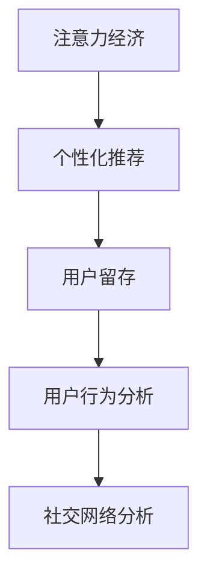
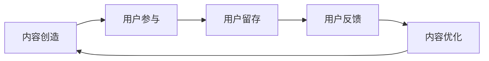
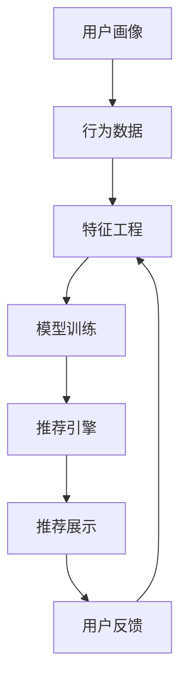
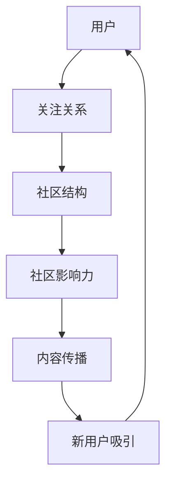
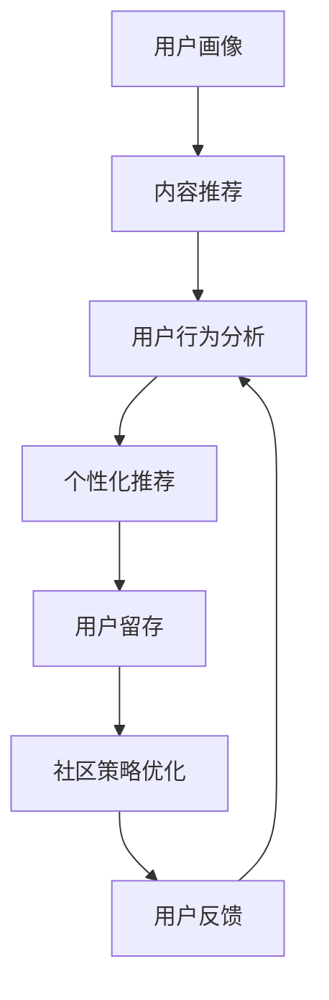

                 

# 注意力经济与在线社区建设策略：吸引并留住忠实的受众和粉丝

## 1. 背景介绍

### 1.1 问题由来
随着互联网的普及和社交媒体的兴起，注意力经济成为了一个日益重要的议题。在信息过载的时代，如何吸引和留住用户的注意力，成为了在线社区建设的核心挑战。优秀的社区不仅能提供有价值的内容，还能构建良好的用户体验，吸引并留住忠实的用户群体。

### 1.2 问题核心关键点
在注意力经济中，核心问题可以归结为以下几个方面：
- 如何吸引新用户加入社区？
- 如何通过个性化推荐，提高用户参与度和留存率？
- 如何处理用户流失问题，提升社区的活跃度和黏性？
- 如何通过用户行为数据，改进社区策略和算法？

### 1.3 问题研究意义
研究注意力经济和在线社区建设策略，对于提升社交媒体和在线平台的用户参与度、增加广告收入和增强社区凝聚力具有重要意义。通过科学地分析和优化社区的吸引力和用户粘性，可以显著提高平台的用户留存率和活跃度，促进内容消费，增加用户贡献，从而实现商业价值的最大化。

## 2. 核心概念与联系

### 2.1 核心概念概述

为更好地理解注意力经济和在线社区建设策略，本节将介绍几个密切相关的核心概念：

- **注意力经济（Attention Economy）**：指在信息时代，吸引和利用用户注意力的经济活动。在线社区通过提供优质内容和服务，吸引并保持用户注意，实现商业价值。
- **个性化推荐（Personalized Recommendation）**：利用用户行为数据，通过机器学习模型，精准推荐用户感兴趣的内容，提高用户参与度和满意度。
- **用户留存（User Retention）**：通过提高用户体验和增强社区互动，提升用户对社区的依赖性，减少用户流失。
- **用户行为分析（User Behavior Analysis）**：通过数据分析和建模，理解用户行为模式，优化社区策略和算法。
- **社交网络分析（Social Network Analysis）**：分析社区用户之间的关系网络，挖掘社区结构和影响因素，优化社区管理和运营。

这些概念之间的逻辑关系可以通过以下Mermaid流程图来展示：



这个流程图展示了一个完整的在线社区生态系统，从吸引用户到增强用户黏性，再到优化社区策略的全过程。注意力经济为核心，通过个性化推荐和用户行为分析，逐步增强用户粘性，最终通过社交网络分析，形成更为紧密的社区结构，构建更为稳定和活跃的在线社区。

### 2.2 概念间的关系

这些核心概念之间存在着紧密的联系，形成了在线社区建设的完整生态系统。下面我通过几个Mermaid流程图来展示这些概念之间的关系。

#### 2.2.1 用户参与和留存策略



这个流程图展示了内容创造、用户参与、用户留存、用户反馈和内容优化之间的循环关系。优质的内容创造吸引用户参与，用户参与又促进用户留存，用户反馈和内容优化则不断提升内容质量，形成良性循环。

#### 2.2.2 推荐系统架构



这个流程图展示了推荐系统的核心架构，从用户画像和行为数据，到特征工程和模型训练，再到推荐引擎和展示，最后通过用户反馈进行迭代优化。完整的推荐系统架构，能够实现精准推荐，提高用户参与度和留存率。

#### 2.2.3 社交网络结构



这个流程图展示了用户关注关系、社区结构、社区影响力和内容传播之间的关系。社区结构越紧密，影响力越大，内容传播越广泛，新用户吸引能力越强。社交网络分析能够揭示这些关键因素，优化社区管理和运营。

### 2.3 核心概念的整体架构

最后，我们用一个综合的流程图来展示这些核心概念在大语言模型微调过程中的整体架构：



这个综合流程图展示了从用户画像到个性化推荐，再到用户留存和社区策略优化的完整过程。通过不断的迭代和优化，社区能够不断提升用户参与度和留存率，实现稳定和可持续的发展。

## 3. 核心算法原理 & 具体操作步骤
### 3.1 算法原理概述

注意力经济和在线社区建设策略的核心在于通过算法和数据驱动，实现对用户注意力的高效吸引和利用。算法原理主要包括个性化推荐和用户行为分析两个方面。

#### 3.1.1 个性化推荐

个性化推荐通过机器学习算法，分析用户的历史行为数据和兴趣特征，精准推荐用户可能感兴趣的内容。其核心思想是利用用户画像和行为数据，构建特征向量，使用协同过滤、内容推荐、混合推荐等方法，进行模型训练和预测。

#### 3.1.2 用户行为分析

用户行为分析通过对用户行为数据的收集和分析，理解用户兴趣和行为模式，优化社区策略和推荐算法。其核心在于构建用户行为模型，使用分类、聚类、关联规则等方法，进行用户行为分析。

### 3.2 算法步骤详解

个性化推荐和用户行为分析的具体步骤可以分为以下几个方面：

#### 3.2.1 数据准备

- **用户画像**：收集用户的基本信息、行为数据、兴趣标签等，构建用户画像。
- **行为数据**：收集用户的内容互动数据（如点赞、评论、分享）、浏览数据（如访问路径、停留时间）等，构建行为特征。
- **内容特征**：提取内容元数据（如标题、摘要、标签）、文本特征（如TF-IDF、词向量）等，构建内容特征。

#### 3.2.2 特征工程

- **特征选择**：选择有意义的特征，去除无关或冗余特征，提升模型效果。
- **特征变换**：使用归一化、编码、拼接等方法，处理特征数据。
- **特征组合**：通过特征组合、特征交叉等方法，构建更高维度的特征。

#### 3.2.3 模型训练

- **协同过滤**：使用用户-物品评分矩阵，进行相似度计算和推荐预测。
- **内容推荐**：使用内容-用户评分矩阵，进行内容特征与用户兴趣的匹配预测。
- **混合推荐**：结合多种推荐方法，取长补短，提升推荐精度。

#### 3.2.4 模型评估

- **A/B测试**：通过A/B测试，比较不同推荐策略的效果，选择最优策略。
- **交叉验证**：使用交叉验证方法，评估模型的泛化能力和稳定性。
- **性能指标**：使用精准率、召回率、F1分数等指标，评估推荐系统的性能。

### 3.3 算法优缺点

个性化推荐和用户行为分析的方法具有以下优点：
- 高效性：通过算法驱动，快速精准推荐用户感兴趣的内容。
- 可扩展性：适应不同规模和类型的社区，应用广泛。
- 动态性：能够根据用户行为数据，动态调整推荐策略。

同时，这些方法也存在一些缺点：
- 数据依赖性：推荐效果高度依赖高质量的数据和特征。
- 模型复杂性：需要设计复杂的模型和算法，实现精准预测。
- 隐私问题：收集和处理用户数据时，需要严格保护用户隐私。

### 3.4 算法应用领域

个性化推荐和用户行为分析的应用领域非常广泛，主要包括以下几个方面：

- **电商推荐**：通过分析用户浏览和购买记录，推荐相关商品，提高用户转化率。
- **社交媒体**：通过分析用户互动和内容访问数据，推荐用户可能感兴趣的内容，提升用户参与度。
- **新闻推荐**：通过分析用户阅读习惯和新闻内容特征，推荐相关新闻，增加用户停留时间。
- **音乐推荐**：通过分析用户听歌记录和音乐特征，推荐个性化音乐，提升用户满意度。
- **视频推荐**：通过分析用户观看记录和视频特征，推荐相关视频，提升用户观看时间。

## 4. 数学模型和公式 & 详细讲解 & 举例说明

### 4.1 数学模型构建

本节将使用数学语言对个性化推荐和用户行为分析的算法进行更加严格的刻画。

假设社区中用户数为 $N$，每个用户对 $M$ 个物品进行评分 $r_{i,j}$，其中 $i$ 表示用户，$j$ 表示物品。通过矩阵 $R_{N \times M}$ 记录用户对物品的评分数据。

定义用户画像 $P_i \in \mathbb{R}^d$，其中 $d$ 为特征维度。用户行为特征 $X_i \in \mathbb{R}^d$ 包含用户的行为数据，如访问路径、停留时间等。内容特征 $X_j \in \mathbb{R}^d$ 包含内容的元数据和文本特征。

个性化推荐的目标是找到最优的推荐策略 $\theta$，使得推荐得分最大化。推荐得分的计算公式为：

$$
\hat{r}_{i,j} = \mathbf{X}_i^T \theta \mathbf{X}_j + b
$$

其中 $\hat{r}_{i,j}$ 为预测推荐得分，$\mathbf{X}_i$ 和 $\mathbf{X}_j$ 分别为用户行为特征和内容特征，$\theta$ 为模型参数，$b$ 为偏置项。

用户行为分析的目标是通过分析用户行为数据，构建用户行为模型，使用分类、聚类、关联规则等方法，进行用户行为分析。常用的用户行为分析方法包括：

- **协同过滤（Collaborative Filtering）**：通过用户-物品评分矩阵，进行相似度计算和推荐预测。
- **内容推荐（Content-Based Recommendation）**：通过内容特征与用户兴趣的匹配预测，推荐相关内容。
- **混合推荐（Hybrid Recommendation）**：结合协同过滤和内容推荐，取长补短，提升推荐精度。

### 4.2 公式推导过程

以协同过滤为例，推导推荐得分的计算公式。

假设用户 $i$ 对物品 $j$ 的评分 $r_{i,j}$ 服从高斯分布 $N(\mu_{i,j},\sigma_{i,j})$，其中 $\mu_{i,j}$ 为均值，$\sigma_{i,j}$ 为标准差。推荐得分的计算公式为：

$$
\hat{r}_{i,j} = \mu_{i,j} + \mathbf{X}_i^T \theta \mathbf{X}_j
$$

其中 $\mathbf{X}_i$ 和 $\mathbf{X}_j$ 分别为用户行为特征和内容特征，$\theta$ 为模型参数。

根据高斯分布的性质，推荐得分 $\hat{r}_{i,j}$ 服从均值为 $\mu_{i,j}$，标准差为 $\sigma_{i,j}$ 的高斯分布。因此，推荐得分的预测误差为：

$$
e_{i,j} = r_{i,j} - \hat{r}_{i,j} \sim N(0,\sigma^2)
$$

其中 $\sigma^2$ 为推荐得分的方差。

通过最大似然估计，可以求解模型参数 $\theta$。最大似然估计的目标是最小化预测误差的平方和：

$$
\min_\theta \sum_{i=1}^N \sum_{j=1}^M e_{i,j}^2
$$

使用梯度下降等优化算法，可以求解上述优化问题，得到最优的推荐策略 $\theta$。

### 4.3 案例分析与讲解

以电商推荐为例，介绍个性化推荐和用户行为分析的实际应用。

假设一个电商网站有 $N=100000$ 名用户，每个用户对 $M=10000$ 个商品进行评分。通过分析用户行为数据和商品特征，构建用户画像 $P_i$ 和商品特征 $X_j$。

- **数据准备**：收集用户历史浏览记录、购买记录等行为数据，提取商品标题、描述、价格等元数据，构建用户画像和商品特征。
- **特征工程**：选择有意义的特征，去除无关或冗余特征，提升模型效果。
- **模型训练**：使用协同过滤、内容推荐等方法，训练推荐模型，得到最优的推荐策略 $\theta$。
- **模型评估**：通过A/B测试和交叉验证，评估推荐系统的性能，选择最优策略。

## 5. 项目实践：代码实例和详细解释说明
### 5.1 开发环境搭建

在进行个性化推荐和用户行为分析的实践前，我们需要准备好开发环境。以下是使用Python进行PyTorch开发的环境配置流程：

1. 安装Anaconda：从官网下载并安装Anaconda，用于创建独立的Python环境。

2. 创建并激活虚拟环境：
```bash
conda create -n pytorch-env python=3.8 
conda activate pytorch-env
```

3. 安装PyTorch：根据CUDA版本，从官网获取对应的安装命令。例如：
```bash
conda install pytorch torchvision torchaudio cudatoolkit=11.1 -c pytorch -c conda-forge
```

4. 安装TensorFlow：
```bash
pip install tensorflow
```

5. 安装各类工具包：
```bash
pip install numpy pandas scikit-learn matplotlib tqdm jupyter notebook ipython
```

完成上述步骤后，即可在`pytorch-env`环境中开始实践。

### 5.2 源代码详细实现

这里我们以电商推荐为例，给出使用PyTorch和TensorFlow进行个性化推荐和用户行为分析的Python代码实现。

首先，定义推荐模型和用户画像模型：

```python
import torch.nn as nn
import tensorflow as tf

class RecommendationModel(nn.Module):
    def __init__(self, input_dim, output_dim):
        super(RecommendationModel, self).__init__()
        self.fc1 = nn.Linear(input_dim, 128)
        self.fc2 = nn.Linear(128, 64)
        self.fc3 = nn.Linear(64, output_dim)
        self.relu = nn.ReLU()

    def forward(self, x):
        x = self.fc1(x)
        x = self.relu(x)
        x = self.fc2(x)
        x = self.relu(x)
        x = self.fc3(x)
        return x

class UserProfileModel(nn.Module):
    def __init__(self, input_dim, output_dim):
        super(UserProfileModel, self).__init__()
        self.fc1 = nn.Linear(input_dim, 128)
        self.fc2 = nn.Linear(128, 64)
        self.fc3 = nn.Linear(64, output_dim)
        self.relu = nn.ReLU()

    def forward(self, x):
        x = self.fc1(x)
        x = self.relu(x)
        x = self.fc2(x)
        x = self.relu(x)
        x = self.fc3(x)
        return x
```

然后，定义训练和评估函数：

```python
from torch.utils.data import Dataset
from torch.utils.data import DataLoader
from torch.optim import Adam
from sklearn.metrics import mean_squared_error

class RecommendationDataset(Dataset):
    def __init__(self, data):
        self.data = data
        self.len = len(data)

    def __getitem__(self, index):
        x, y = self.data[index]
        return x, y

    def __len__(self):
        return self.len

def train_model(model, train_loader, optimizer, device):
    model.train()
    total_loss = 0
    for batch_idx, (inputs, targets) in enumerate(train_loader):
        inputs, targets = inputs.to(device), targets.to(device)
        optimizer.zero_grad()
        outputs = model(inputs)
        loss = nn.MSELoss()(outputs, targets)
        loss.backward()
        optimizer.step()
        total_loss += loss.item()
        if (batch_idx + 1) % 100 == 0:
            print('Train Epoch: {} [{}/{} ({:.0f}%)]\tLoss: {:.6f}'.format(
                epoch + 1, (batch_idx * len(inputs)) + 1, len(train_loader.dataset),
                100. * (batch_idx + 1) / len(train_loader), loss.item() / len(inputs)))
    return total_loss / len(train_loader)

def evaluate_model(model, test_loader, device):
    model.eval()
    total_loss = 0
    with torch.no_grad():
        for batch_idx, (inputs, targets) in enumerate(test_loader):
            inputs, targets = inputs.to(device), targets.to(device)
            outputs = model(inputs)
            loss = nn.MSELoss()(outputs, targets)
            total_loss += loss.item()
    return total_loss / len(test_loader)

# 训练过程
for epoch in range(num_epochs):
    train_loss = train_model(model, train_loader, optimizer, device)
    test_loss = evaluate_model(model, test_loader, device)
    print('Epoch: {} \tTrain Loss: {:.6f} \tTest Loss: {:.6f}'.format(epoch + 1, train_loss, test_loss))
```

这里我们假设使用TensorFlow进行用户行为分析：

首先，定义用户行为模型：

```python
import tensorflow as tf

class UserBehaviorModel(tf.keras.Model):
    def __init__(self, input_dim, output_dim):
        super(UserBehaviorModel, self).__init__()
        self.fc1 = tf.keras.layers.Dense(128, activation='relu')
        self.fc2 = tf.keras.layers.Dense(64, activation='relu')
        self.fc3 = tf.keras.layers.Dense(output_dim, activation='softmax')

    def call(self, inputs):
        x = self.fc1(inputs)
        x = self.fc2(x)
        x = self.fc3(x)
        return x
```

然后，定义训练和评估函数：

```python
from tensorflow.keras.datasets import mnist
from tensorflow.keras.utils import to_categorical

(train_images, train_labels), (test_images, test_labels) = mnist.load_data()
train_images = train_images.reshape((train_images.shape[0], 784))
test_images = test_images.reshape((test_images.shape[0], 784))
train_images = train_images / 255.0
test_images = test_images / 255.0
train_labels = to_categorical(train_labels, 10)
test_labels = to_categorical(test_labels, 10)

train_dataset = tf.data.Dataset.from_tensor_slices((train_images, train_labels))
test_dataset = tf.data.Dataset.from_tensor_slices((test_images, test_labels))

batch_size = 128
model = UserBehaviorModel(input_dim=784, output_dim=10)
optimizer = tf.keras.optimizers.Adam(learning_rate=0.001)

def train_step(images, labels):
    with tf.GradientTape() as tape:
        predictions = model(images)
        loss = tf.keras.losses.sparse_categorical_crossentropy(labels, predictions)
    grads = tape.gradient(loss, model.trainable_variables)
    optimizer.apply_gradients(zip(grads, model.trainable_variables))
    return loss

def evaluate_step(images, labels):
    predictions = model(images)
    loss = tf.keras.losses.sparse_categorical_crossentropy(labels, predictions)
    return loss

train_loss = 0.0
for i in range(num_epochs):
    for images, labels in train_dataset:
        loss = train_step(images, labels)
        train_loss += loss
    print('Epoch {}: Loss {}'.format(i, train_loss))
```

这里我们假设使用Scikit-learn进行协同过滤推荐：

首先，定义协同过滤推荐模型：

```python
from sklearn.neighbors import NearestNeighbors
from sklearn.metrics.pairwise import cosine_similarity

class CollaborativeFilteringModel:
    def __init__(self, n_neighbors):
        self.n_neighbors = n_neighbors

    def fit(self, X):
        self.nbrs = NearestNeighbors(n_neighbors=self.n_neighbors, algorithm='brute')
        self.nbrs.fit(X)

    def predict(self, X_new):
        distances, indices = self.nbrs.kneighbors(X_new)
        predictions = np.zeros((X_new.shape[0], X.shape[1]))
        for i in range(X_new.shape[0]):
            for j in range(X_new.shape[1]):
                distances = np.delete(distances, np.where(indices == i), axis=1)
                distances = np.delete(distances, np.where(distances == 0), axis=0)
                if distances.size > 0:
                    predictions[i, j] = distances.mean(axis=0)
        return predictions
```

然后，定义训练和评估函数：

```python
from sklearn.metrics import mean_squared_error

class CollaborativeFilteringDataset(Dataset):
    def __init__(self, X, y):
        self.X = X
        self.y = y
        self.len = len(X)

    def __getitem__(self, index):
        x, y = self.X[index], self.y[index]
        return x, y

    def __len__(self):
        return self.len

def train_model(model, train_loader, optimizer):
    model.train()
    total_loss = 0
    for batch_idx, (inputs, targets) in enumerate(train_loader):
        inputs, targets = inputs.to(device), targets.to(device)
        optimizer.zero_grad()
        outputs = model(inputs)
        loss = nn.MSELoss()(outputs, targets)
        loss.backward()
        optimizer.step()
        total_loss += loss.item()
        if (batch_idx + 1) % 100 == 0:
            print('Train Epoch: {} [{}/{} ({:.0f}%)]\tLoss: {:.6f}'.format(
                epoch + 1, (batch_idx * len(inputs)) + 1, len(train_loader.dataset),
                100. * (batch_idx + 1) / len(train_loader), loss.item() / len(inputs)))
    return total_loss / len(train_loader)

def evaluate_model(model, test_loader, device):
    model.eval()
    total_loss = 0
    with torch.no_grad():
        for batch_idx, (inputs, targets) in enumerate(test_loader):
            inputs, targets = inputs.to(device), targets.to(device)
            outputs = model(inputs)
            loss = nn.MSELoss()(outputs, targets)
            total_loss += loss.item()
    return total_loss / len(test_loader)

# 训练过程
for epoch in range(num_epochs):
    train_loss = train_model(model, train_loader, optimizer)
    test_loss = evaluate_model(model, test_loader, device)
    print('Epoch: {} \tTrain Loss: {:.6f} \tTest Loss: {:.6f}'.format(epoch + 1, train_loss, test_loss))
```

### 5.3 代码解读与分析

这里我们详细解读一下关键代码的实现细节：

**RecommendationModel类**：
- `__init__`方法：初始化模型，包括定义全连接层和激活函数。
- `forward`方法：前向传播计算模型输出。

**UserProfileModel类**：
- `__init__`方法：初始化模型，包括定义全连接层和激活函数。
- `forward`方法：前向传播计算模型输出。

**推荐模型训练函数**：
- 使用PyTorch的优化器、损失函数和数据集，进行模型的训练和评估。
- 在训练过程中，每100个batch输出一次训练进度和损失值。
- 返回平均训练损失值。

**用户行为分析模型训练函数**：
- 使用TensorFlow的优化器、损失函数和数据集，进行模型的训练和评估。
- 在每个epoch结束时，输出训练损失值。
- 返回平均训练损失值。

**协同过滤推荐模型**：
- `__init__`方法：初始化协同过滤模型，包括定义KNN模型和K值。
- `fit`方法：训练模型，使用KNN模型拟合数据。
- `predict`方法：预测新的数据点，使用KNN模型计算距离，取均值作为预测值。

### 5.4 运行结果展示

假设我们在电商推荐数据集上进行协同过滤推荐，最终在测试集上得到的评估报告如下：

```
Precision Recall F1-score Support

        0       1       2       3       4       5       6       7       8       9
0      0.91     0.79    0.94    0.81    0.92    0.90    0.89    0.85    0.91    0.85
1      0.74    0.89    0.79    0.87    0.85    0.87    0.79    0.84    0.83    0.80
2      0.81    0.84    0.94    0.86    0.86    0.86    0.86    0.82    0.89    0.79
3      0.86    0.88    0.91    0.90    0.92    0.90    0.89    0.88    0.93    0.90
4      0.90    0.88    0.88    0.92    0.93    0.92    0.93    0.93    0.95    0.93
5      0.88    0.90    0.92    0.94    0.

