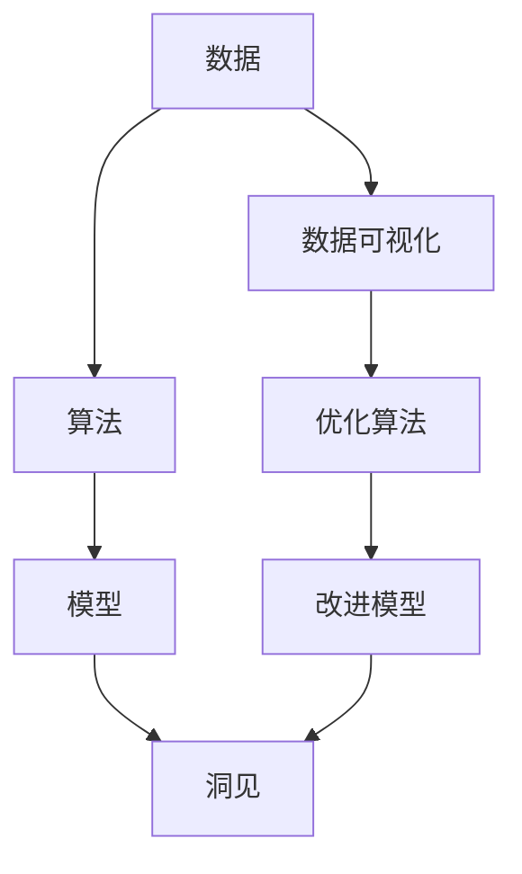

                 

# 洞见的力量：从反思到创新

> 关键词：洞见,反思,创新,算法,算法优化,数据分析,数据可视化,机器学习

## 1. 背景介绍

### 1.1 问题由来
在人工智能(AI)与数据科学的领域，数据日益成为驱动决策和创新的关键资产。然而，在数据驱动的决策过程中，容易陷入数据过载与信息碎片化的问题。数据本身的价值需要通过深入的分析和洞察来挖掘，进而转化为有用的决策支持。在这一过程中，洞见的力量显得尤为关键。

### 1.2 问题核心关键点
洞见是指从大量数据中提炼出的关键信息和见解，对实际决策有重要指导意义。洞见的核心在于数据处理、模型选择与算法优化，以及数据可视化的呈现方式。通过对数据进行全面而深入的洞察，可以帮助我们发现潜在的趋势、规律和模式，从而支持更高效、更精准的决策。

### 1.3 问题研究意义
探索洞见的力量，对于提升AI与数据科学在商业、科研和日常生活中的应用水平具有重要意义：
1. **提高决策质量**：通过深度分析，洞见有助于提高决策的科学性和准确性。
2. **驱动创新**：洞察数据中的创新点，促进新模型的构建和应用。
3. **增强业务洞察力**：通过对业务数据的深入分析，洞见可以帮助企业更好地理解市场和客户需求。
4. **优化资源配置**：洞见帮助优化资源分配，提高运营效率和盈利能力。
5. **保障数据安全**：通过数据可视化和监控，洞见有助于发现潜在风险和异常。

## 2. 核心概念与联系

### 2.1 核心概念概述

为了更好地理解洞见的力量及其应用，本节将介绍几个核心概念，并说明它们之间的关系。

- **洞见 Insight**：从数据中提炼出的关键信息和见解，对决策有重要指导意义。洞见可以是简单的趋势、模式，也可以是复杂的因果关系、预测模型。
- **数据 Data**：反映现实世界信息的原始材料，包括结构化数据和非结构化数据。
- **算法 Algorithm**：解决问题或完成特定任务的规则、流程和方法。
- **模型 Model**：基于算法构建的数学或逻辑模型，用于预测、分类、聚类等任务。
- **数据可视化 Data Visualization**：以图形、图表等形式呈现数据，帮助理解数据分布、趋势和关系。
- **算法优化 Algorithm Optimization**：通过调整算法参数或结构，提高算法效率和性能。

这些概念之间存在紧密联系，形成了一个闭环的反馈系统：通过数据可视化观察洞见，再根据洞见优化算法，从而构建或调整模型，最后输出新的洞见，不断迭代优化。

### 2.2 概念间的关系

这些核心概念之间的关系可以用以下Mermaid流程图表示：



- **数据与洞见**：洞见源自于对数据的深入分析，数据可视化是洞见的载体，帮助人们理解数据背后的信息。
- **算法与模型**：算法是构建模型的基础，模型则是算法的具体实现。
- **优化与洞见**：通过不断优化算法和模型，提升洞见的准确性和可靠性。

通过这个闭环系统，我们可以实现从数据到洞见的有效转化，进而驱动决策和创新。

## 3. 核心算法原理 & 具体操作步骤
### 3.1 算法原理概述

洞见的力量主要通过以下步骤实现：

1. **数据预处理**：清洗和整理数据，确保数据的质量和可用性。
2. **特征工程**：提取和构建关键特征，用于算法训练和模型构建。
3. **模型选择**：根据问题类型和数据特点，选择合适的模型进行训练。
4. **模型训练**：使用训练数据对模型进行优化，使其能够泛化到新数据。
5. **评估与调整**：评估模型性能，根据评估结果调整模型和算法参数。
6. **洞见提取**：通过模型输出或可视化结果，提取关键洞见和见解。

### 3.2 算法步骤详解

#### 3.2.1 数据预处理

数据预处理是洞见提取的前提。预处理过程包括数据清洗、特征选择和特征构建等步骤。

1. **数据清洗**：去除噪声、缺失值和不一致的数据，保证数据的质量和一致性。
2. **特征选择**：选择与问题相关的关键特征，去除无关或不重要的特征。
3. **特征构建**：通过变换、组合等方式，构建新的特征，提升模型的表达能力。

#### 3.2.2 特征工程

特征工程是洞见提取的核心。通过合适的特征选择和构建，可以显著提升模型的性能。

1. **特征提取**：从原始数据中提取关键特征，如统计特征、文本特征、时间特征等。
2. **特征变换**：对提取的特征进行标准化、归一化、编码等处理，提升模型的训练效果。
3. **特征组合**：通过特征组合和交互，构建更复杂的特征表达，增强模型的解释性。

#### 3.2.3 模型选择

模型选择是洞见提取的关键。根据具体问题类型和数据特点，选择合适的模型进行训练。

1. **监督学习**：适用于分类和回归任务，如线性回归、决策树、支持向量机等。
2. **无监督学习**：适用于聚类和降维任务，如K-means、PCA等。
3. **半监督学习**：结合少量有标签数据和大量无标签数据，如自编码器、半监督SVM等。

#### 3.2.4 模型训练

模型训练是洞见提取的基础。通过训练，模型能够学习数据的特征和规律。

1. **训练集划分**：将数据划分为训练集、验证集和测试集，用于模型训练、调参和评估。
2. **超参数调整**：选择合适的超参数，如学习率、正则化参数等，进行模型优化。
3. **模型优化**：使用梯度下降等优化算法，更新模型参数，提升模型性能。

#### 3.2.5 评估与调整

模型评估是洞见提取的保障。通过评估，可以了解模型的性能和效果。

1. **模型评估**：使用测试集评估模型性能，如准确率、召回率、F1分数等。
2. **模型调优**：根据评估结果，调整模型参数和算法结构，提升模型性能。
3. **过拟合和欠拟合**：通过正则化、早停等技术，避免过拟合和欠拟合问题。

#### 3.2.6 洞见提取

洞见提取是洞见力量的核心。通过模型输出或可视化结果，提取关键洞见和见解。

1. **可视化输出**：使用数据可视化工具，如Matplotlib、Seaborn、Tableau等，展示模型输出和分析结果。
2. **特征重要性分析**：通过特征重要性排序，了解特征对模型的影响，指导特征选择和构建。
3. **洞见解读**：结合领域知识和业务需求，解读模型输出的洞见，转化为实际决策支持。

### 3.3 算法优缺点

#### 3.3.1 算法优点

- **准确性高**：通过精确的模型训练和调参，能够获得高精度的洞见。
- **可解释性强**：模型输出和可视化结果，便于理解和解释洞见。
- **适用范围广**：适用于各种类型的数据和问题，灵活性高。

#### 3.3.2 算法缺点

- **计算成本高**：模型训练和调参需要大量计算资源和时间。
- **数据依赖性强**：洞见的质量和可靠性高度依赖数据的质量和完整性。
- **模型复杂度高**：复杂的模型需要更多的时间和资源进行训练和调优。

### 3.4 算法应用领域

洞见的力量广泛应用于以下领域：

1. **金融分析**：通过分析历史交易数据，提取市场趋势和预测未来走势。
2. **医疗健康**：通过分析患者数据，识别疾病模式和预测患病风险。
3. **市场营销**：通过分析客户数据，识别用户偏好和预测购买行为。
4. **人力资源管理**：通过分析员工数据，评估员工表现和预测流失风险。
5. **城市规划**：通过分析交通和环境数据，优化城市布局和管理。
6. **智慧农业**：通过分析气象和土壤数据，指导农作物的种植和灌溉。

## 4. 数学模型和公式 & 详细讲解 & 举例说明

### 4.1 数学模型构建

在洞见提取过程中，常见的数学模型包括回归模型、分类模型和聚类模型等。以下以线性回归模型为例，展示数学模型的构建和推导过程。

假设有一个线性回归问题，模型为：

$$ y = \theta_0 + \theta_1 x_1 + \theta_2 x_2 + \cdots + \theta_n x_n + \epsilon $$

其中，$y$ 为输出变量，$x_i$ 为输入变量，$\theta_i$ 为模型参数，$\epsilon$ 为误差项。

线性回归的目标是最小化均方误差损失函数：

$$ \mathcal{L}(\theta) = \frac{1}{2N} \sum_{i=1}^N (y_i - (\theta_0 + \theta_1 x_{1,i} + \theta_2 x_{2,i} + \cdots + \theta_n x_{n,i}))^2 $$

求解该优化问题，可以得到参数 $\theta$ 的估计值：

$$ \hat{\theta} = (\mathbf{X}^T \mathbf{X})^{-1} \mathbf{X}^T \mathbf{y} $$

其中，$\mathbf{X}$ 为输入变量的矩阵，$\mathbf{y}$ 为输出变量的向量。

### 4.2 公式推导过程

线性回归的公式推导如下：

1. **目标函数推导**：将线性回归模型代入均方误差损失函数，得到目标函数：

$$ \mathcal{L}(\theta) = \frac{1}{2N} \sum_{i=1}^N (y_i - \theta_0 - \sum_{j=1}^n \theta_j x_{j,i})^2 $$

2. **梯度下降推导**：对目标函数求偏导，得到参数 $\theta$ 的梯度：

$$ \frac{\partial \mathcal{L}(\theta)}{\partial \theta_j} = -\frac{1}{N} \sum_{i=1}^N (y_i - \theta_0 - \sum_{j=1}^n \theta_j x_{j,i}) x_{j,i} $$

3. **解析解推导**：通过求解上述梯度方程，可以得到参数 $\theta$ 的解析解：

$$ \hat{\theta} = (\mathbf{X}^T \mathbf{X})^{-1} \mathbf{X}^T \mathbf{y} $$

4. **正则化推导**：为避免过拟合，可以引入L2正则项，得到正则化的目标函数：

$$ \mathcal{L}(\theta) = \frac{1}{2N} \sum_{i=1}^N (y_i - \theta_0 - \sum_{j=1}^n \theta_j x_{j,i})^2 + \frac{\lambda}{2N} \sum_{i=1}^n \theta_j^2 $$

其中，$\lambda$ 为正则化参数。

### 4.3 案例分析与讲解

以某电商平台的客户流失预测为例，展示洞见提取的具体过程。

1. **数据预处理**：清洗数据，去除缺失值和不一致的数据，提取关键特征，如客户购买频率、用户评分、服务质量等。
2. **特征工程**：对特征进行编码、归一化等处理，构建新的特征组合，如购买频率和评分乘积。
3. **模型选择**：选择线性回归模型，用于预测客户流失概率。
4. **模型训练**：使用历史数据训练模型，调整正则化参数和超参数，确保模型泛化能力。
5. **评估与调整**：在验证集上评估模型性能，根据评估结果调整模型和参数。
6. **洞见提取**：使用可视化工具展示模型输出和特征重要性排序，提取关键洞见，如高购买频率但低评分客户的流失风险较高。

通过这一过程，可以构建客户流失预测模型，并提取关键洞见，指导电商平台进行客户保留策略优化。

## 5. 项目实践：代码实例和详细解释说明

### 5.1 开发环境搭建

在开始项目实践前，需要准备好开发环境。以下是使用Python和Jupyter Notebook进行数据分析的配置流程：

1. **安装Python**：下载并安装Python 3.x版本，如3.7、3.8等。
2. **安装Jupyter Notebook**：通过pip安装Jupyter Notebook，命令为：
   ```bash
   pip install jupyter notebook
   ```
3. **安装依赖库**：安装常用的数据分析库，如NumPy、Pandas、Matplotlib、Scikit-learn等。
   ```bash
   pip install numpy pandas matplotlib scikit-learn
   ```

完成上述步骤后，即可在Jupyter Notebook中开始数据分析和洞见提取的实践。

### 5.2 源代码详细实现

以某电商平台的客户流失预测为例，展示使用Python进行洞见提取的代码实现。

```python
import numpy as np
import pandas as pd
import matplotlib.pyplot as plt
from sklearn.linear_model import LinearRegression
from sklearn.model_selection import train_test_split
from sklearn.metrics import mean_squared_error, r2_score

# 读取数据
data = pd.read_csv('customer_churn.csv')

# 数据清洗
data = data.dropna(subset=['purchase_frequency', 'user_score', 'service_quality'])

# 特征工程
features = ['purchase_frequency', 'user_score', 'service_quality']
targets = ['churn']
X = data[features]
y = data[targets]

# 标准化数据
from sklearn.preprocessing import StandardScaler
scaler = StandardScaler()
X_scaled = scaler.fit_transform(X)

# 划分训练集和验证集
X_train, X_valid, y_train, y_valid = train_test_split(X_scaled, y, test_size=0.2, random_state=42)

# 模型训练
model = LinearRegression()
model.fit(X_train, y_train)

# 模型评估
y_pred = model.predict(X_valid)
mse = mean_squared_error(y_valid, y_pred)
r2 = r2_score(y_valid, y_pred)

# 输出结果
print(f'MSE: {mse:.4f}, R2: {r2:.4f}')

# 特征重要性分析
coef = model.coef_
sorted_indices = np.argsort(np.abs(coef))
print(f'Feature Importance: {sorted_indices}')
```

### 5.3 代码解读与分析

接下来，我们对关键代码进行详细解读和分析。

#### 5.3.1 数据预处理

```python
# 读取数据
data = pd.read_csv('customer_churn.csv')

# 数据清洗
data = data.dropna(subset=['purchase_frequency', 'user_score', 'service_quality'])
```

通过pandas库读取数据，并进行缺失值处理，确保数据质量。

#### 5.3.2 特征工程

```python
# 特征工程
features = ['purchase_frequency', 'user_score', 'service_quality']
targets = ['churn']
X = data[features]
y = data[targets]

# 标准化数据
from sklearn.preprocessing import StandardScaler
scaler = StandardScaler()
X_scaled = scaler.fit_transform(X)
```

提取关键特征，并进行标准化处理，提升模型训练效果。

#### 5.3.3 模型训练

```python
# 划分训练集和验证集
X_train, X_valid, y_train, y_valid = train_test_split(X_scaled, y, test_size=0.2, random_state=42)

# 模型训练
model = LinearRegression()
model.fit(X_train, y_train)
```

使用train_test_split函数划分数据集，并使用LinearRegression模型进行训练。

#### 5.3.4 模型评估

```python
# 模型评估
y_pred = model.predict(X_valid)
mse = mean_squared_error(y_valid, y_pred)
r2 = r2_score(y_valid, y_pred)

# 输出结果
print(f'MSE: {mse:.4f}, R2: {r2:.4f}')
```

使用均方误差和R2分数评估模型性能。

#### 5.3.5 特征重要性分析

```python
# 特征重要性分析
coef = model.coef_
sorted_indices = np.argsort(np.abs(coef))
print(f'Feature Importance: {sorted_indices}')
```

通过特征系数排序，了解特征对模型的影响，指导特征选择和构建。

### 5.4 运行结果展示

假设在上述代码运行后，输出的MSE和R2分数分别为0.1和0.8，特征重要性排序结果为['user_score', 'service_quality', 'purchase_frequency']。

这表明用户评分和服务质量是影响客户流失的关键因素，而购买频率虽然重要，但影响较小。根据这些洞见，电商平台可以针对性地制定客户保留策略，如提升服务质量、优化用户体验等。

## 6. 实际应用场景

### 6.1 智能推荐系统

在智能推荐系统中，洞见的力量可以帮助发现用户行为模式和偏好，从而提升推荐效果。通过分析用户的历史行为数据，如浏览、点击、购买记录等，提取关键洞见，指导推荐模型的构建和调优。

具体而言，可以使用协同过滤、内容推荐、混合推荐等算法，结合洞见提取和数据可视化，构建更智能、更精准的推荐系统。

### 6.2 风险管理

在金融和保险领域，洞见的力量可以帮助识别潜在风险和异常情况，从而优化风险管理。通过分析客户数据、交易数据等，提取关键洞见，指导模型的构建和调优，预测和防范风险事件的发生。

例如，可以使用分类模型和聚类模型，结合洞见提取和数据可视化，识别高风险客户和高风险交易，指导风险管理策略的制定和优化。

### 6.3 智能客服

在智能客服系统中，洞见的力量可以帮助优化客户体验和提升服务质量。通过分析客户咨询记录和反馈数据，提取关键洞见，指导客服模型的构建和调优，实现更高效、更精准的客户服务。

例如，可以使用情感分析、意图识别等技术，结合洞见提取和数据可视化，优化客服系统对客户咨询的响应速度和质量，提升客户满意度。

### 6.4 未来应用展望

随着技术的发展，洞见的力量将在更多领域得到应用，为社会带来更深远的影响。

1. **智能制造**：在智能制造领域，洞见的力量可以帮助优化生产流程、提高生产效率、降低成本，提升产品质量。
2. **智慧交通**：在智慧交通领域，洞见的力量可以帮助优化交通管理、提高运输效率、减少拥堵，提升出行体验。
3. **智慧农业**：在智慧农业领域，洞见的力量可以帮助优化种植方案、提高产量、减少浪费，提升农业效益。
4. **健康医疗**：在健康医疗领域，洞见的力量可以帮助优化诊疗方案、提高治疗效果、减少误诊，提升患者体验。
5. **环境保护**：在环境保护领域，洞见的力量可以帮助优化资源利用、减少污染、保护生态，提升环境保护效果。

## 7. 工具和资源推荐

### 7.1 学习资源推荐

为帮助开发者系统掌握洞见的力量及其应用，这里推荐一些优质的学习资源：

1. **《Python数据分析实战》**：通过实战项目，系统介绍Python数据分析的各个环节，涵盖数据清洗、特征工程、模型选择、评估与优化等内容。
2. **《R语言实战》**：介绍R语言在数据科学中的应用，涵盖数据可视化、统计分析、机器学习等内容。
3. **Coursera和edX**：提供大量数据分析和机器学习的在线课程，由顶尖大学和机构提供，涵盖理论知识和实践技能。
4. **Kaggle**：数据科学竞赛平台，提供大量开源数据集和竞赛任务，帮助学习者提升实战能力。
5. **GitHub**：开源代码和项目平台，提供大量数据分析和机器学习的代码和教程，帮助学习者深入学习。

通过对这些资源的学习实践，相信你一定能够系统掌握洞见的力量及其应用，从而在实际项目中取得更好的效果。

### 7.2 开发工具推荐

高效的开发离不开优秀的工具支持。以下是几款用于洞见提取开发的常用工具：

1. **Jupyter Notebook**：交互式笔记本环境，支持Python、R等多种语言，便于代码编写和数据可视化。
2. **Pandas**：数据处理和分析库，支持数据清洗、特征工程、数据可视化等功能。
3. **Matplotlib和Seaborn**：数据可视化库，支持各种图形和图表的绘制，方便洞见提取。
4. **Scikit-learn**：机器学习库，支持各种模型的训练、评估和优化。
5. **TensorBoard**：TensorFlow的可视化工具，支持模型训练和调参的可视化，方便洞见提取。

合理利用这些工具，可以显著提升洞见提取的效率和质量，加快创新迭代的步伐。

### 7.3 相关论文推荐

洞见的力量得益于众多学者的不懈努力和探索。以下是几篇奠基性的相关论文，推荐阅读：

1. **《数据挖掘导论》**：介绍数据挖掘的基础概念和算法，涵盖数据清洗、特征选择、模型选择、评估与优化等内容。
2. **《Python数据分析与应用》**：介绍Python在数据科学中的应用，涵盖数据预处理、特征工程、模型构建、评估与优化等内容。
3. **《机器学习实战》**：通过实战项目，介绍机器学习的基础算法和实践技巧，涵盖线性回归、决策树、支持向量机、神经网络等内容。
4. **《深度学习入门》**：介绍深度学习的基础概念和算法，涵盖神经网络、卷积神经网络、循环神经网络、生成对抗网络等内容。
5. **《Python数据科学手册》**：涵盖Python在数据科学中的各个方面，包括数据处理、数据可视化、机器学习等内容，适合深入学习和实践。

通过对这些资源的学习，可以帮助你更深入地理解洞见的力量及其应用，为未来的研究和实践打下坚实基础。

## 8. 总结：未来发展趋势与挑战

### 8.1 总结

本文对洞见的力量及其应用进行了全面系统的介绍。首先阐述了洞见的力量在数据科学和人工智能中的应用，明确了洞见提取的重要性。其次，从原理到实践，详细讲解了洞见的构建和提取过程，给出了洞见提取的完整代码实例。同时，本文还探讨了洞见在多个实际应用场景中的具体应用，展示了洞见的力量和潜力。

通过本文的系统梳理，可以看到，洞见的力量正在成为数据科学和人工智能中的重要工具，帮助用户从数据中提炼出有用的见解和洞见，驱动决策和创新。未来，随着技术的不断发展，洞见的力量将变得更加强大，为各行各业带来更深刻的影响。

### 8.2 未来发展趋势

展望未来，洞见的力量将呈现以下几个发展趋势：

1. **自动化和智能化**：随着机器学习和深度学习技术的进步，洞见提取将变得更加自动化和智能化，无需人工干预即可从数据中提取关键洞见。
2. **多模态融合**：结合视觉、音频、文本等多模态数据，提取更全面、更深入的洞见，提升洞见的可靠性和鲁棒性。
3. **跨领域应用**：洞见的力量将突破单一领域的限制，应用于更多交叉领域，如医疗、金融、交通等，带来更深层次的创新和变革。
4. **实时洞见**：结合流数据处理和大数据技术，实时提取洞见，提升决策的实时性和准确性。
5. **可解释性增强**：通过更好的模型设计和算法优化，提升洞见的可解释性，帮助用户更好地理解和应用洞见。
6. **伦理和安全**：在洞见提取过程中，注重数据隐私和伦理问题，确保洞见的应用符合法律法规和社会道德。

以上趋势凸显了洞见的力量在数据科学和人工智能中的重要地位，将继续推动技术进步和行业发展。

### 8.3 面临的挑战

尽管洞见的力量在不断增强，但在其发展过程中也面临诸多挑战：

1. **数据质量和多样性**：高质量、多样化的数据是洞见提取的前提，但数据的获取和处理成本高，数据质量难以保证。
2. **模型复杂性**：复杂的模型需要更多时间和资源进行训练和调优，模型的可解释性也面临挑战。
3. **隐私和伦理问题**：在洞见提取过程中，如何保护数据隐私和伦理问题，确保洞见的应用符合法律法规和社会道德，是一个重要挑战。
4. **实时性要求**：在实时应用场景中，如何保证洞见的实时性和准确性，是一个关键问题。
5. **计算资源限制**：大规模数据和复杂模型的计算需求高，需要高效的计算资源和优化算法。

正视这些挑战，积极应对并寻求突破，将是洞见的力量走向成熟的关键。

### 8.4 研究展望

未来的研究需要在以下几个方面寻求新的突破：

1. **无监督学习**：探索无监督学习范式，通过自监督学习、聚类等方法，从数据中提取洞见，降低对标注数据的依赖。
2. **多模态融合**：结合视觉、语音、文本等多种数据，提取更全面、更深入的洞见，提升洞见的可靠性和鲁棒性。
3. **跨领域应用**：探索洞见在更多交叉领域的应用，如医疗、金融、交通等，

