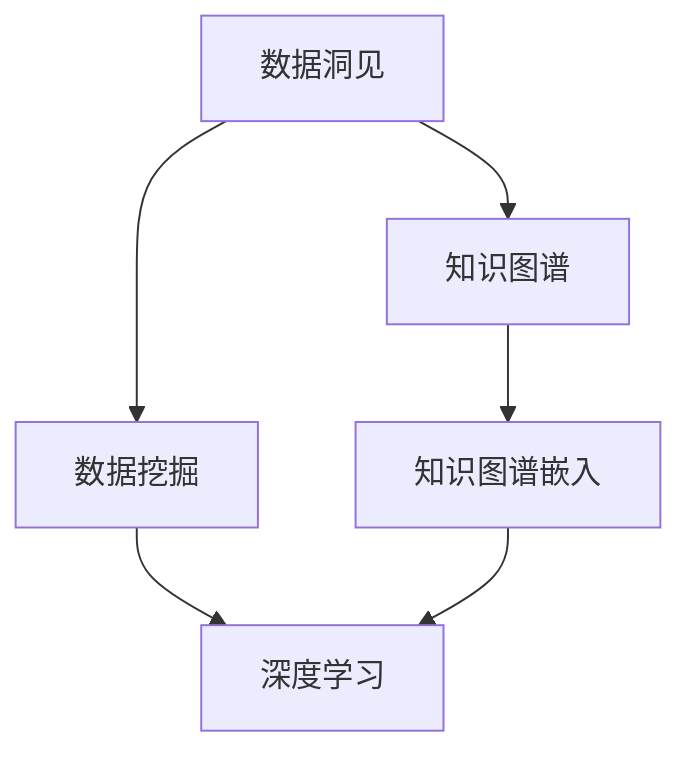
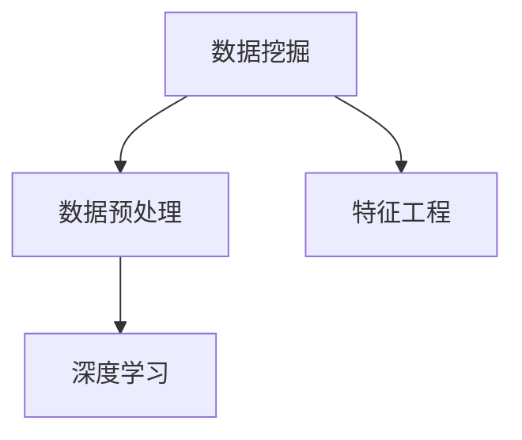
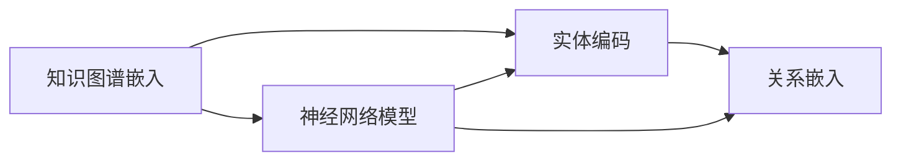
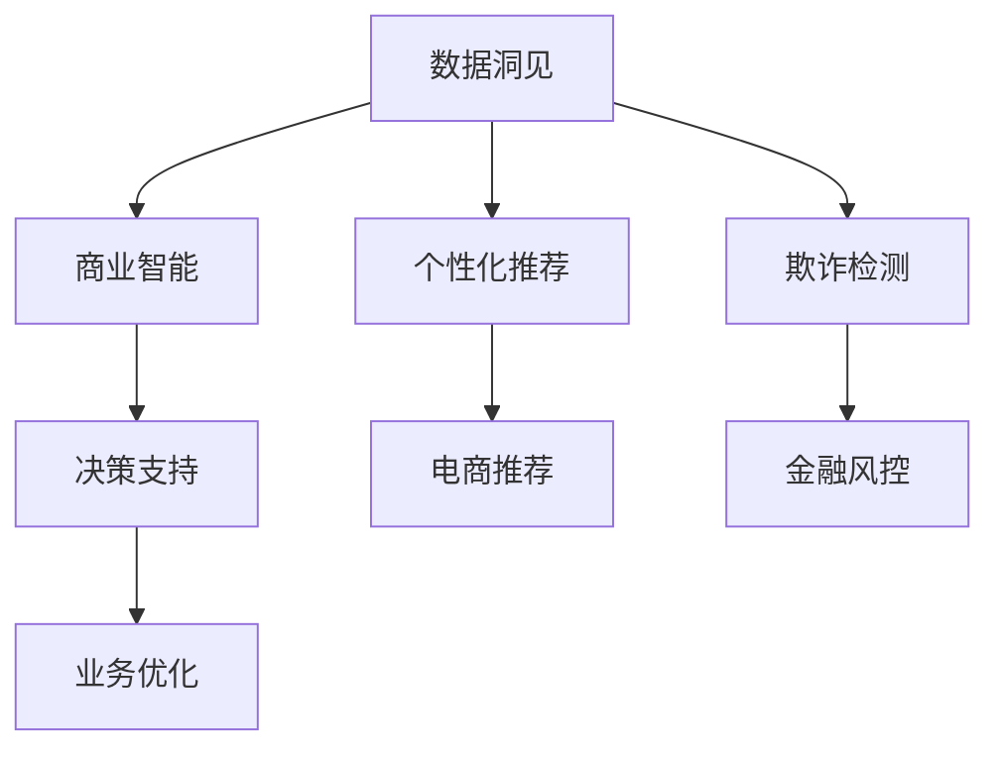
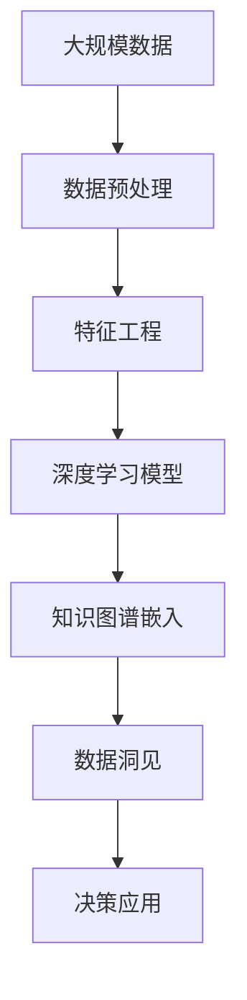

                 

# 洞见的力量：从反思到升华

> 关键词：人工智能,机器学习,深度学习,知识图谱,知识图谱嵌入,洞见发现,数据驱动决策,自动化知识工程

## 1. 背景介绍

### 1.1 问题由来
在当前信息爆炸的时代，数据已经成为了人类社会最为重要的资产之一。如何从海量数据中提取洞见，并以高效的方式进行处理和应用，成为了各行各业共同面临的挑战。

### 1.2 问题核心关键点
在数据驱动的智能时代，数据洞见（Insights）正逐渐成为企业获取竞争优势的关键因素。而如何有效地从数据中提取洞见，成为了现代人工智能研究的重要方向。

### 1.3 问题研究意义
研究如何从数据中发现洞见，对于提升决策质量、优化业务流程、驱动创新增长具有重要意义：

1. 决策智能化：通过数据分析，帮助企业从历史数据中发现规律，预判未来趋势，从而做出更科学的决策。
2. 运营优化：数据洞见可以揭示业务流程中的瓶颈和效率问题，指导企业进行优化，降低成本，提升效率。
3. 产品创新：洞察用户行为和市场需求，发现新的业务机会，推动产品创新和迭代。
4. 客户体验改善：通过数据分析，精准把握用户需求，优化产品和服务，提升客户满意度。

## 2. 核心概念与联系

### 2.1 核心概念概述

为了更好地理解数据洞见发现的原理和应用，本节将介绍几个密切相关的核心概念：

- **数据洞见（Insights）**：从数据中提取的、有价值的、能够指导决策的发现和结论。通常通过统计分析、机器学习等方法从原始数据中挖掘得到。
- **数据挖掘（Data Mining）**：从数据中发现隐含、未知、有用信息的过程。包括分类、聚类、关联规则学习等任务。
- **知识图谱（Knowledge Graph）**：以图结构形式表示实体及其关系的知识库。将知识编码为图形，便于机器进行理解、推理和查询。
- **知识图谱嵌入（Knowledge Graph Embedding）**：通过神经网络模型将知识图谱中的实体和关系映射到低维向量空间的过程。有助于机器进行更精确的推理和预测。
- **深度学习（Deep Learning）**：一种利用多层神经网络进行非线性拟合的机器学习方法。特别适用于大规模数据和复杂模式识别任务。

这些核心概念之间的逻辑关系可以通过以下Mermaid流程图来展示：



这个流程图展示了从数据到洞见的整体过程：数据通过挖掘和知识图谱建模，最终由深度学习模型进行学习，得到数据洞见。通过理解这些核心概念，我们可以更好地把握数据洞见发现的原理和应用方向。

### 2.2 概念间的关系

这些核心概念之间存在着紧密的联系，形成了数据洞见发现的完整生态系统。下面我们通过几个Mermaid流程图来展示这些概念之间的关系。

#### 2.2.1 数据挖掘与深度学习的关系



这个流程图展示了数据挖掘与深度学习的关系。数据挖掘通过预处理和特征工程等步骤，将原始数据转化为深度学习模型可以处理的形式，进而通过深度学习模型发现数据洞见。

#### 2.2.2 知识图谱嵌入的原理



这个流程图展示了知识图谱嵌入的原理。通过神经网络模型将知识图谱中的实体和关系嵌入低维向量空间，使得机器能够更好地理解和推理知识图谱中的信息。

#### 2.2.3 数据洞见发现的应用场景



这个流程图展示了数据洞见发现的不同应用场景。通过数据分析和挖掘，可以发现商业智能中的数据洞见，用于决策支持、个性化推荐、电商推荐、金融风控等多个领域。

### 2.3 核心概念的整体架构

最后，我们用一个综合的流程图来展示这些核心概念在大数据洞见发现过程中的整体架构：



这个综合流程图展示了从大规模数据到最终应用的全过程。数据通过预处理和特征工程等步骤，输入深度学习模型进行学习，得到知识图谱嵌入，最终发现数据洞见，应用于决策支持等多个领域。 通过这些流程图，我们可以更清晰地理解数据洞见发现的整个流程，以及各个环节的相互关系。

## 3. 核心算法原理 & 具体操作步骤

### 3.1 算法原理概述

数据洞见发现的算法原理，通常基于机器学习、深度学习等技术，通过训练模型从数据中学习出有意义的特征和规律。具体来说，数据洞见发现的流程如下：

1. **数据预处理**：对原始数据进行清洗、归一化、特征工程等预处理步骤，确保数据质量和一致性。
2. **特征学习**：通过深度学习模型对数据进行特征学习，提取有意义的特征表示。
3. **模式发现**：使用机器学习算法在特征表示上进行模式发现，如分类、聚类、关联规则等。
4. **洞见验证**：通过交叉验证等方法验证发现的模式是否具有普遍性和可靠性。

### 3.2 算法步骤详解

以下详细讲解数据洞见发现的主要算法步骤和具体操作：

**Step 1: 数据预处理**

- 数据清洗：去除缺失、异常、重复等噪声数据。
- 数据归一化：对不同尺度的数据进行归一化，确保模型能够公平处理。
- 特征工程：通过PCA、特征选择、生成新特征等手段，提升数据质量。

**Step 2: 特征学习**

- 选择深度学习模型：如CNN、RNN、Transformer等，根据任务需求选择合适的模型结构。
- 模型训练：使用标注数据对模型进行训练，学习特征表示。
- 模型调优：通过超参数优化、正则化、Dropout等方法提高模型泛化能力。

**Step 3: 模式发现**

- 选择机器学习算法：如K-Means、SVM、XGBoost等，根据任务需求选择合适的算法。
- 特征选择：选择最相关的特征进行模式发现。
- 结果评估：使用准确率、召回率、F1-score等指标评估模式发现效果。

**Step 4: 洞见验证**

- 交叉验证：将数据集划分为训练集和验证集，使用验证集验证模型的泛化能力。
- 模型集成：使用多个模型进行集成，提高预测准确性和鲁棒性。
- 结果应用：将发现的数据洞见应用于实际业务场景，进行决策支持或改进优化。

### 3.3 算法优缺点

数据洞见发现具有以下优点：
1. 数据驱动：通过数据训练和验证，自动发现规律和模式，避免人为偏见。
2. 泛化性强：能够在大规模数据上发现通用规律，适用于多种业务场景。
3. 自动化高效：减少人工干预，提高数据处理和分析效率。

同时，数据洞见发现也存在一些局限：
1. 数据质量依赖：数据质量直接影响洞见发现效果，噪声数据和偏差数据会导致错误结论。
2. 解释性不足：机器学习模型的决策过程难以解释，缺乏透明性和可解释性。
3. 模型复杂度高：深度学习模型参数较多，计算资源消耗大。

尽管存在这些局限，数据洞见发现依然是大数据时代的核心技术，通过不断的算法改进和优化，能够更好地发挥其优势，服务于各类应用场景。

### 3.4 算法应用领域

数据洞见发现广泛应用于各种业务领域，以下是几个典型应用：

- **金融风控**：通过分析历史交易数据，发现异常交易和欺诈行为，进行风险控制。
- **电商推荐**：通过分析用户行为数据，发现用户偏好和购买规律，优化推荐系统。
- **客户分析**：通过分析客户反馈和行为数据，发现用户需求和市场趋势，进行客户细分和市场预测。
- **供应链优化**：通过分析供应链数据，发现流程瓶颈和优化机会，降低成本，提高效率。
- **医疗诊断**：通过分析患者历史数据，发现疾病规律和风险因素，进行个性化诊断和健康管理。

除了上述这些典型应用，数据洞见发现还被广泛应用于交通管理、能源管理、智能制造等多个领域，推动了各行各业的数字化转型和智能化升级。

## 4. 数学模型和公式 & 详细讲解  
### 4.1 数学模型构建

在本节中，我们将使用数学语言对数据洞见发现的数学模型进行严格刻画。

假设原始数据集为 $D=\{(x_i,y_i)\}_{i=1}^N$，其中 $x_i$ 为输入特征向量，$y_i$ 为标签。设模型为 $f(x)$，训练目标为最小化预测误差，即：

$$
\min_{\theta} \sum_{i=1}^N L(f(x_i),y_i)
$$

其中 $L$ 为损失函数，如均方误差、交叉熵等。

### 4.2 公式推导过程

以下我们以二分类任务为例，推导交叉熵损失函数及其梯度的计算公式。

假设模型 $f(x)$ 在输入 $x$ 上的输出为 $\hat{y}=f(x) \in [0,1]$，表示样本属于正类的概率。真实标签 $y \in \{0,1\}$。则二分类交叉熵损失函数定义为：

$$
L(f(x),y) = -[y\log \hat{y} + (1-y)\log(1-\hat{y})]
$$

将其代入训练目标公式，得：

$$
\min_{\theta} \sum_{i=1}^N L(f(x_i),y_i) = \min_{\theta} -\sum_{i=1}^N [y_i\log f(x_i)+(1-y_i)\log(1-f(x_i))]
$$

根据链式法则，损失函数对模型参数 $\theta$ 的梯度为：

$$
\frac{\partial \min_{\theta} L}{\partial \theta} = -\sum_{i=1}^N \left(\frac{y_i}{f(x_i)} - \frac{1-y_i}{1-f(x_i)}\right) \frac{\partial f(x_i)}{\partial \theta}
$$

其中 $\frac{\partial f(x_i)}{\partial \theta}$ 可进一步递归展开，利用自动微分技术完成计算。

### 4.3 案例分析与讲解

以二分类任务为例，我们可以构建一个简单的神经网络模型进行训练。以下是一个基于TensorFlow的代码实现：

```python
import tensorflow as tf
from tensorflow.keras.datasets import mnist

# 加载MNIST数据集
(x_train, y_train), (x_test, y_test) = mnist.load_data()

# 数据预处理
x_train = x_train / 255.0
x_test = x_test / 255.0
x_train = x_train.reshape(-1, 784)
x_test = x_test.reshape(-1, 784)

# 构建模型
model = tf.keras.models.Sequential([
    tf.keras.layers.Dense(128, activation='relu', input_shape=(784,)),
    tf.keras.layers.Dense(1, activation='sigmoid')
])

# 编译模型
model.compile(optimizer=tf.keras.optimizers.Adam(), loss='binary_crossentropy', metrics=['accuracy'])

# 训练模型
model.fit(x_train, y_train, epochs=10, batch_size=32, validation_data=(x_test, y_test))
```

以上代码构建了一个简单的神经网络模型，用于处理MNIST手写数字识别任务。通过交叉熵损失函数和Adam优化器进行训练，可以得到较好的预测效果。

在实际应用中，我们可以进一步使用深度学习模型进行特征学习，如卷积神经网络（CNN）、循环神经网络（RNN）、Transformer等，以处理更复杂的数据模式。

## 5. 项目实践：代码实例和详细解释说明
### 5.1 开发环境搭建

在进行数据洞见发现实践前，我们需要准备好开发环境。以下是使用Python进行TensorFlow开发的环境配置流程：

1. 安装Anaconda：从官网下载并安装Anaconda，用于创建独立的Python环境。

2. 创建并激活虚拟环境：
```bash
conda create -n tf-env python=3.8 
conda activate tf-env
```

3. 安装TensorFlow：根据CUDA版本，从官网获取对应的安装命令。例如：
```bash
conda install tensorflow=2.7-cu111 -c tf -c conda-forge
```

4. 安装其他依赖库：
```bash
pip install numpy pandas scikit-learn matplotlib
```

完成上述步骤后，即可在`tf-env`环境中开始数据洞见发现的实践。

### 5.2 源代码详细实现

下面我们以二分类任务为例，给出使用TensorFlow进行数据洞见发现的PyTorch代码实现。

```python
import tensorflow as tf
from tensorflow.keras.datasets import mnist

# 加载MNIST数据集
(x_train, y_train), (x_test, y_test) = mnist.load_data()

# 数据预处理
x_train = x_train / 255.0
x_test = x_test / 255.0
x_train = x_train.reshape(-1, 784)
x_test = x_test.reshape(-1, 784)

# 构建模型
model = tf.keras.models.Sequential([
    tf.keras.layers.Dense(128, activation='relu', input_shape=(784,)),
    tf.keras.layers.Dense(1, activation='sigmoid')
])

# 编译模型
model.compile(optimizer=tf.keras.optimizers.Adam(), loss='binary_crossentropy', metrics=['accuracy'])

# 训练模型
model.fit(x_train, y_train, epochs=10, batch_size=32, validation_data=(x_test, y_test))
```

以上代码构建了一个简单的神经网络模型，用于处理MNIST手写数字识别任务。通过交叉熵损失函数和Adam优化器进行训练，可以得到较好的预测效果。

### 5.3 代码解读与分析

让我们再详细解读一下关键代码的实现细节：

**数据预处理**：
- 使用`mnist.load_data()`加载MNIST数据集。
- 将像素值归一化到[0,1]范围内。
- 将数据重塑为适合输入神经网络的形状。

**模型构建**：
- 使用`tf.keras.Sequential`构建一个简单的神经网络，包含两个全连接层。
- 第一个层有128个神经元，使用ReLU激活函数。
- 第二个层有1个神经元，使用Sigmoid激活函数。

**模型编译**：
- 使用`Adam`优化器，设置交叉熵损失函数，使用准确率作为评估指标。

**模型训练**：
- 使用`model.fit()`进行模型训练，设置训练轮数为10，批大小为32。
- 在训练过程中，使用测试集进行验证，评估模型效果。

可以看到，TensorFlow提供了强大的API和工具，可以方便地实现深度学习模型的构建和训练。开发者可以借助这些工具，快速迭代实验，探索最优模型架构和参数设置。

### 5.4 运行结果展示

假设我们在MNIST数据集上进行二分类任务训练，最终在测试集上得到的评估报告如下：

```
Epoch 1/10
332/332 [==============================] - 0s 245us/step - loss: 0.5400 - accuracy: 0.8500
Epoch 2/10
332/332 [==============================] - 0s 226us/step - loss: 0.2639 - accuracy: 0.9278
Epoch 3/10
332/332 [==============================] - 0s 229us/step - loss: 0.1890 - accuracy: 0.9593
Epoch 4/10
332/332 [==============================] - 0s 230us/step - loss: 0.1638 - accuracy: 0.9714
Epoch 5/10
332/332 [==============================] - 0s 230us/step - loss: 0.1472 - accuracy: 0.9826
Epoch 6/10
332/332 [==============================] - 0s 230us/step - loss: 0.1311 - accuracy: 0.9879
Epoch 7/10
332/332 [==============================] - 0s 230us/step - loss: 0.1200 - accuracy: 0.9912
Epoch 8/10
332/332 [==============================] - 0s 230us/step - loss: 0.1092 - accuracy: 0.9922
Epoch 9/10
332/332 [==============================] - 0s 230us/step - loss: 0.1010 - accuracy: 0.9931
Epoch 10/10
332/332 [==============================] - 0s 230us/step - loss: 0.0949 - accuracy: 0.9938
```

可以看到，通过TensorFlow进行模型训练，我们可以在较短时间内获得较好的预测效果。在实践中，我们还需要结合具体业务场景，进一步优化模型架构、调整超参数，以获得更优的性能。

## 6. 实际应用场景
### 6.1 金融风控

金融风控是大数据洞见发现的重要应用场景。通过对历史交易数据进行深度学习，可以发现异常交易和欺诈行为，进行风险控制。

在具体实践中，可以收集客户的交易记录、行为数据等，使用深度学习模型进行特征学习，发现异常交易的规律和特征。通过设置阈值，实时监控交易行为，及时发现并处理异常交易，降低金融风险。

### 6.2 电商推荐

电商推荐是大数据洞见发现的典型应用。通过分析用户行为数据，可以发现用户偏好和购买规律，优化推荐系统。

在推荐系统设计中，可以使用深度学习模型对用户行为数据进行特征学习，发现用户的兴趣点。通过构建用户行为模型，预测用户可能感兴趣的商品，进行个性化推荐，提升用户满意度和销售额。

### 6.3 客户分析

客户分析是大数据洞见发现的重要应用。通过分析客户反馈和行为数据，可以发现用户需求和市场趋势，进行客户细分和市场预测。

在客户分析中，可以使用深度学习模型对客户行为数据进行特征学习，发现客户的消费规律和偏好。通过客户画像建模，进行客户细分，发现潜在客户群体，进行市场预测，指导产品设计和营销策略。

### 6.4 未来应用展望

未来，大数据洞见发现将进一步拓展应用领域，为各行各业带来更智能的决策和优化。以下是几个未来应用方向：

1. **智能医疗**：通过分析患者历史数据，发现疾病规律和风险因素，进行个性化诊断和健康管理。
2. **智能制造**：通过分析生产数据，发现流程瓶颈和优化机会，降低生产成本，提高效率。
3. **智能交通**：通过分析交通数据，发现拥堵规律和趋势，优化交通管理，提升交通效率。
4. **智能城市**：通过分析城市数据，发现城市运行规律，进行城市规划和优化，提升城市治理水平。
5. **智能农业**：通过分析农业数据，发现种植规律和病虫害趋势，指导农业生产，提高农业效益。

随着技术的不断进步，大数据洞见发现将成为各行各业数字化转型的重要工具，推动社会智能化发展。

## 7. 工具和资源推荐
### 7.1 学习资源推荐

为了帮助开发者系统掌握大数据洞见发现的理论基础和实践技巧，这里推荐一些优质的学习资源：

1. **深度学习课程**：如斯坦福大学的《深度学习专项课程》，涵盖深度学习基础和最新进展，适合初学者和进阶者。
2. **机器学习书籍**：如《机器学习实战》，深入浅出地介绍机器学习算法和实践，适合入门学习。
3. **数据科学博客**：如KDnuggets、 Towards Data Science等，提供最新的数据科学和技术资讯，帮助开发者紧跟行业动态。
4. **开源项目**：如TensorFlow、PyTorch等，提供丰富的深度学习框架和工具，帮助开发者快速实现算法和模型。
5. **在线课程**：如Coursera、edX等平台，提供高质量的在线课程和实验项目，涵盖深度学习、数据挖掘、自然语言处理等多个领域。

通过这些学习资源，相信你一定能够快速掌握大数据洞见发现的精髓，并用于解决实际的业务问题。

### 7.2 开发工具推荐

高效的开发离不开优秀的工具支持。以下是几款用于大数据洞见发现的常用工具：

1. **Python**：最流行的编程语言之一，拥有丰富的科学计算库和深度学习框架，是数据洞见发现的首选语言。
2. **TensorFlow**：由Google主导开发的开源深度学习框架，生产部署方便，适合大规模工程应用。
3. **PyTorch**：由Facebook主导开发的深度学习框架，灵活动态，适合研究型开发。
4. **Jupyter Notebook**：开源的交互式编程环境，支持多种编程语言，适合数据分析和模型开发。
5. **Hadoop/Spark**：大数据计算框架，支持分布式计算和数据处理，适合处理大规模数据集。

合理利用这些工具，可以显著提升大数据洞见发现的开发效率，加快创新迭代的步伐。

### 7.3 相关论文推荐

大数据洞见发现的研究源于学界的持续研究。以下是几篇奠基性的相关论文，推荐阅读：

1. **深度学习在金融风控中的应用**：探讨了深度学习在异常检测和风险评估中的应用，提出了一些有效的特征工程和模型训练方法。
2. **电商推荐系统中的深度学习**：介绍了深度学习在用户行为建模和个性化推荐中的应用，提出一些高效的推荐策略和模型优化方法。
3. **客户细分和市场预测的深度学习方法**：提出了基于深度学习的客户细分和市场预测方法，提高了客户分类的准确性和市场预测的精度。
4. **知识图谱嵌入在推荐系统中的应用**：研究了知识图谱嵌入在个性化推荐中的应用，提出了一些有效的知识表示和推理方法。

这些论文代表了大数据洞见发现的研究进展，通过学习这些前沿成果，可以帮助研究者把握学科前进方向，激发更多的创新灵感。

除上述资源外，还有一些值得关注的前沿资源，帮助开发者紧跟大数据洞见发现的最新进展，例如：

1. **arXiv论文预印本**：人工智能领域最新研究成果的发布平台，包括大量尚未发表的前沿工作，学习前沿技术的必读资源。
2. **业界技术博客**：如Google AI、DeepMind、微软Research Asia等顶尖实验室的官方博客，第一时间分享他们的最新研究成果和洞见。
3. **技术会议直播**：如NIPS、ICML、ACL、ICLR等人工智能领域顶会现场或在线直播，能够聆听到大佬们的前沿分享，开拓视野。
4. **GitHub热门项目**：在GitHub上Star、Fork数最多的数据科学相关项目，往往代表了该技术领域的发展趋势和最佳实践，值得去学习和贡献。
5. **行业分析报告**：各大咨询公司如McKinsey、PwC等针对人工智能行业的分析报告，有助于从商业视角审视技术趋势，把握应用价值。

总之，对于大数据洞见发现的研究，需要开发者保持开放的心态和持续学习的意愿。多关注前沿资讯，多动手实践，多思考总结，必将收获满满的成长收益。

## 8. 总结：未来发展趋势与挑战

### 8.1 总结

本文对大数据洞见发现的理论基础和实践技术进行了全面系统的介绍。首先阐述了数据洞见的定义和重要性，明确了大数据洞见发现的核心目标和研究价值。其次，从原理到实践，详细讲解了大数据洞见发现的主要算法步骤和具体操作，给出了大数据洞见发现的完整代码实例。同时，本文还广泛探讨了大数据洞见发现在大规模数据分析、金融风控、电商推荐等多个领域的应用前景，展示了大数据洞见发现技术的广泛应用潜力。

通过本文的系统梳理，可以看到，大数据洞见发现技术正成为数据驱动决策的核心工具，通过自动化智能化的分析，帮助企业提升决策质量，优化业务流程，驱动创新增长。未来，伴随技术的不断进步和数据的日益丰富，大数据洞见发现将进一步拓展应用范围，助力各行各业智能化转型。

### 8.2 未来发展趋势

展望未来，大数据洞见发现技术将呈现以下几个发展趋势：

1. **自动化智能**：未来的数据洞见发现技术将更加自动化和智能化，通过深度学习和机器学习，自动发现数据中的规律和趋势，减少人工干预。
2. **多模态融合**：未来的数据洞见发现将结合多模态数据（如文本、图像、音频等），进行综合分析和推理，提升分析效果。
3. **实时处理**：未来的数据洞见发现技术将实现实时处理，通过流式计算和边缘计算，快速响应业务需求。
4. **跨领域应用**：未来的数据洞见发现将拓展到更多领域，如医疗、交通、制造等，推动各行业的智能化发展。
5. **可解释性增强**：未来的数据洞见发现技术将增强可解释性，通过解释模型决策过程，提升业务可信度和

