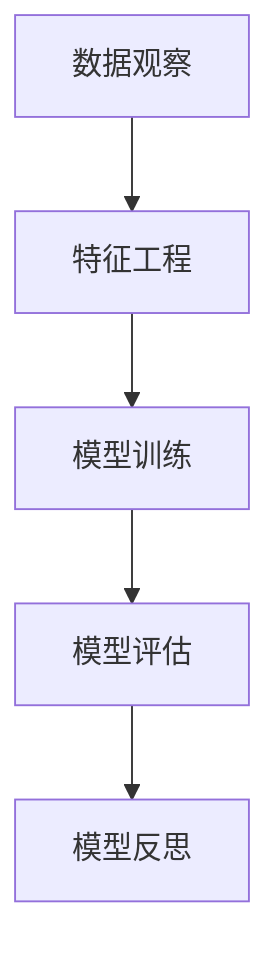
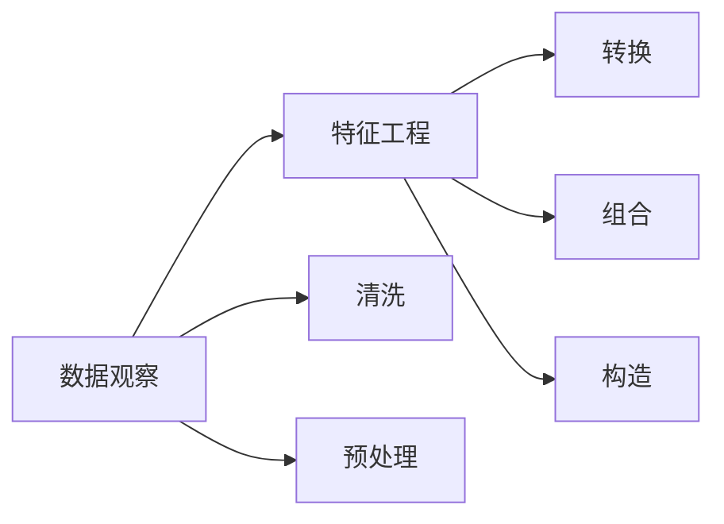
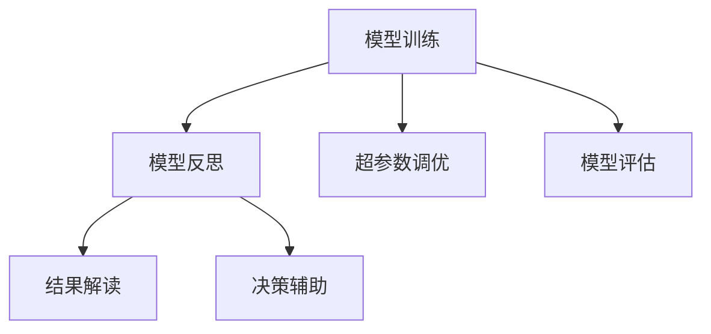
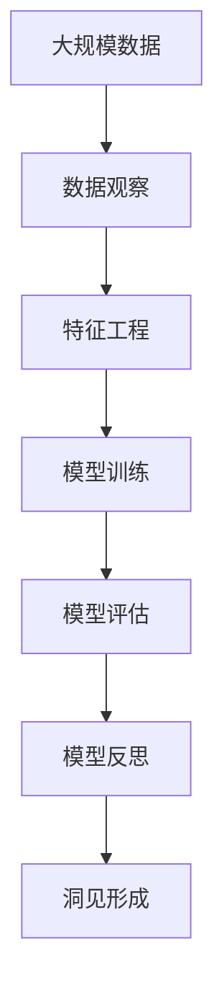

                 

# 洞见的形成：从观察到反思

> 关键词：洞见，观察，反思，机器学习，深度学习，数据分析，数据科学

## 1. 背景介绍

### 1.1 问题由来
在数字化时代，海量数据源源不断地产生，人类正在经历前所未有的信息爆炸。如何从海量的数据中提取有价值的洞见，成为各行各业关注的焦点。洞见（Insight），即通过数据驱动的分析发现，往往能揭示出潜在的趋势和规律，助力决策者制定更为明智的策略，提升业务效率和竞争优势。

洞见的形成，本质上是一个数据驱动的分析过程。从数据的采集、清洗、预处理，到模型的训练、验证、调优，再到结果的解读和应用，这一过程涉及多个环节，每一个环节都至关重要。本文将重点探讨洞见的形成，从数据观察到模型反思，深入解析这一过程的原理和方法。

### 1.2 问题核心关键点
洞见的形成，核心在于数据驱动的深度分析和持续迭代。主要包括以下几个关键点：
1. **数据质量**：高质量的数据是洞见形成的基础，数据清洗和预处理至关重要。
2. **模型选择**：选择合适的模型能够更准确地捕捉数据特征和趋势，常见模型包括线性回归、决策树、神经网络等。
3. **特征工程**：通过特征选择和特征构建，提升模型的预测能力。
4. **超参数调优**：通过网格搜索、贝叶斯优化等方法，寻找最佳的模型超参数组合。
5. **模型评估**：使用交叉验证、ROC曲线等方法评估模型性能，避免过拟合和欠拟合。
6. **结果解读**：将模型输出转换为可理解的洞见，助力实际决策。

### 1.3 问题研究意义
洞见形成技术在商业决策、科学研究、医疗健康等多个领域具有重要应用价值：

1. **商业决策**：洞见能够帮助企业发现市场趋势、客户需求和竞争对手情况，指导市场策略、产品开发和运营优化。
2. **科学研究**：通过数据分析，科学家能够发现新的研究领域和理论，推动学科进步。
3. **医疗健康**：在医疗数据中挖掘洞见，能够辅助临床决策，提高诊疗效果和医疗效率。
4. **金融领域**：洞见分析能够预测市场趋势、风险变化，指导投资决策和风险管理。

因此，掌握洞见形成的技术，对于提升各行业的决策质量和运营效率，具有重要意义。

## 2. 核心概念与联系

### 2.1 核心概念概述

为更好地理解洞见的形成，本节将介绍几个密切相关的核心概念：

- **洞见**：通过数据分析，揭示出潜在的趋势、规律和异常，为决策提供依据。
- **数据观察**：收集、清洗和预处理数据，为模型训练提供基础数据集。
- **特征工程**：对原始数据进行转换、组合和构造，提升模型的预测能力。
- **模型训练**：选择合适的算法和模型，训练模型以适应特定任务。
- **模型评估**：使用各类指标评估模型性能，确保模型泛化能力强。
- **模型反思**：分析模型输出结果，提升模型的可解释性和决策质量。

这些核心概念之间的逻辑关系可以通过以下Mermaid流程图来展示：



这个流程图展示了大规模数据挖掘过程中的关键步骤：数据观察、特征工程、模型训练和模型反思。

### 2.2 概念间的关系

这些核心概念之间存在着紧密的联系，形成了数据驱动分析的完整生态系统。下面我通过几个Mermaid流程图来展示这些概念之间的关系。

#### 2.2.1 数据观察与特征工程的关系



这个流程图展示了数据观察和特征工程之间的关系。数据观察包括数据清洗和预处理，为特征工程提供高质量的数据集。特征工程包括特征转换、特征组合和特征构造，提升模型的预测能力。

#### 2.2.2 模型训练与模型反思的关系



这个流程图展示了模型训练和模型反思之间的关系。模型训练包括超参数调优和模型评估，确保模型性能最优。模型反思包括结果解读和决策辅助，将模型输出转换为可理解的洞见，指导实际决策。

#### 2.2.3 整体架构

最后，我们用一个综合的流程图来展示这些核心概念在大数据挖掘过程中的整体架构：



这个综合流程图展示了从大规模数据到洞见形成的完整过程。数据观察、特征工程、模型训练和模型反思，每个环节都至关重要，共同构成了洞见形成的完整框架。

## 3. 核心算法原理 & 具体操作步骤
### 3.1 算法原理概述

洞见的形成，本质上是一个数据驱动的分析过程。通过数据观察、特征工程、模型训练和模型反思，最终形成有价值的洞见。

#### 3.1.1 数据观察

数据观察是洞见形成的基础，涉及数据的采集、清洗和预处理。数据观察的过程包括：

- **数据采集**：从不同的数据源（如数据库、API接口、传感器等）获取原始数据。
- **数据清洗**：删除重复数据、处理缺失值、去除异常值等，确保数据的质量。
- **数据预处理**：进行特征选择、归一化、标准化等处理，提升数据可用性。

#### 3.1.2 特征工程

特征工程是洞见形成的核心步骤，通过特征选择和特征构造，提升模型的预测能力。特征工程的过程包括：

- **特征选择**：选择对预测目标影响最大的特征，减少维度。
- **特征构建**：通过组合、转换和构造，生成新的特征，增强模型的预测能力。

#### 3.1.3 模型训练

模型训练是洞见形成的关键环节，通过选择合适的算法和模型，训练模型以适应特定任务。模型训练的过程包括：

- **模型选择**：根据任务类型选择合适的算法和模型，如线性回归、决策树、神经网络等。
- **模型训练**：使用训练集数据训练模型，优化模型参数。
- **超参数调优**：通过网格搜索、贝叶斯优化等方法，寻找最佳的模型超参数组合。

#### 3.1.4 模型反思

模型反思是洞见形成的最后一步，通过分析模型输出结果，提升模型的可解释性和决策质量。模型反思的过程包括：

- **结果解读**：将模型输出转换为可理解的洞见，如趋势、规律和异常。
- **决策辅助**：基于洞见，指导实际决策，提升决策质量。

### 3.2 算法步骤详解

#### 3.2.1 数据观察

1. **数据采集**：使用Python中的requests库、Pandas库等工具，从不同数据源获取原始数据。
2. **数据清洗**：使用Pandas库中的drop_duplicates、fillna、dropna等方法进行数据清洗。
3. **数据预处理**：使用Scikit-learn库中的StandardScaler、MinMaxScaler等方法进行数据归一化、标准化。

#### 3.2.2 特征工程

1. **特征选择**：使用Scikit-learn库中的SelectKBest、RFE等方法进行特征选择，选择对预测目标影响最大的特征。
2. **特征构建**：通过组合、转换和构造，生成新的特征。例如，通过特征交叉、时间序列处理等方法，增强模型的预测能力。

#### 3.2.3 模型训练

1. **模型选择**：根据任务类型选择合适的算法和模型，如线性回归、决策树、神经网络等。
2. **模型训练**：使用训练集数据训练模型，优化模型参数。例如，使用Keras库训练神经网络模型，使用交叉熵损失函数进行训练。
3. **超参数调优**：使用网格搜索、贝叶斯优化等方法，寻找最佳的模型超参数组合。例如，使用Scikit-learn库中的GridSearchCV、RandomizedSearchCV等方法进行超参数调优。

#### 3.2.4 模型反思

1. **结果解读**：使用Pandas库的plot方法绘制特征分布图、相关性矩阵等，直观展示数据特征。
2. **决策辅助**：根据洞见，指导实际决策。例如，根据预测结果调整产品价格、优化营销策略等。

### 3.3 算法优缺点

洞见形成技术的优点包括：
1. **准确性高**：通过数据驱动的分析，能够更准确地发现潜在的趋势和规律。
2. **可操作性强**：洞见通常以图表、报告等形式呈现，便于理解和决策。
3. **灵活性高**：适用于各种类型的业务场景，如销售分析、客户行为分析、市场趋势分析等。

洞见形成技术的缺点包括：
1. **数据依赖性强**：数据质量决定了洞见的准确性和可信度。
2. **模型复杂度高**：模型训练和调优过程复杂，需要大量的计算资源和时间。
3. **结果可解释性差**：模型通常视为“黑盒”，难以解释其内部工作机制。

### 3.4 算法应用领域

洞见形成技术在多个领域得到了广泛应用：

- **商业决策**：通过数据分析，发现市场趋势、客户需求和竞争对手情况，指导市场策略、产品开发和运营优化。
- **科学研究**：通过数据分析，发现新的研究领域和理论，推动学科进步。
- **医疗健康**：在医疗数据中挖掘洞见，辅助临床决策，提高诊疗效果和医疗效率。
- **金融领域**：通过数据分析，预测市场趋势、风险变化，指导投资决策和风险管理。

## 4. 数学模型和公式 & 详细讲解  
### 4.1 数学模型构建

在洞见形成过程中，常用的一些数学模型和公式如下：

1. **线性回归**：
   $$
   y = \beta_0 + \beta_1 x_1 + \beta_2 x_2 + \cdots + \beta_n x_n + \epsilon
   $$
   其中，$y$为目标变量，$x_i$为特征变量，$\beta_i$为回归系数，$\epsilon$为误差项。

2. **决策树**：
   $$
   y = \begin{cases}
   特征_1 > 阈值_1 & \rightarrow 结果_1 \\
   特征_1 \leq 阈值_1 & \rightarrow \begin{cases}
   特征_2 > 阈值_2 & \rightarrow 结果_2 \\
   特征_2 \leq 阈值_2 & \rightarrow \begin{cases}
   特征_3 > 阈值_3 & \rightarrow 结果_3 \\
   特征_3 \leq 阈值_3 & \rightarrow \cdots \\
   \end{cases}
   \end{cases}
   \end{cases}
   $$
   其中，特征和结果为类别变量，阈值为二值变量。

3. **神经网络**：
   $$
   \hat{y} = \sigma(\sum_{i=1}^{n} w_i x_i + b)
   $$
   其中，$\sigma$为激活函数，$x_i$为输入特征，$w_i$为权重，$b$为偏置，$\hat{y}$为预测结果。

### 4.2 公式推导过程

以线性回归为例，推导公式的推导过程如下：

1. **最小二乘法**：
   $$
   \min_{\beta} \sum_{i=1}^{n} (y_i - \hat{y}_i)^2
   $$
   其中，$y_i$为目标变量，$\hat{y}_i$为预测值。

2. **求导**：
   $$
   \frac{\partial \sum_{i=1}^{n} (y_i - \hat{y}_i)^2}{\partial \beta} = -2 \sum_{i=1}^{n} x_i (y_i - \hat{y}_i)
   $$

3. **求解**：
   $$
   \beta = \frac{\sum_{i=1}^{n} x_i y_i}{\sum_{i=1}^{n} x_i^2}
   $$

### 4.3 案例分析与讲解

假设我们有一组房屋销售数据，包括房价、面积、地理位置等特征，我们希望通过这些数据预测房价。我们可以使用线性回归模型来建立预测关系：

- **数据观察**：从数据库中获取原始数据，并进行数据清洗和预处理。
- **特征工程**：选择面积、地理位置等特征，生成新的特征如“地理位置+是否中心城市”。
- **模型训练**：使用线性回归模型，进行模型训练和超参数调优。
- **模型反思**：分析模型输出结果，绘制特征分布图、相关性矩阵等，生成洞见。

通过这些步骤，我们能够从房屋销售数据中提取有价值的洞见，如房价受哪些因素影响最大、不同地理位置的房价差异等，为实际的房价预测提供依据。

## 5. 项目实践：代码实例和详细解释说明
### 5.1 开发环境搭建

在进行洞见形成实践前，我们需要准备好开发环境。以下是使用Python进行Scikit-learn开发的环境配置流程：

1. 安装Anaconda：从官网下载并安装Anaconda，用于创建独立的Python环境。

2. 创建并激活虚拟环境：
```bash
conda create -n sklearn-env python=3.8 
conda activate sklearn-env
```

3. 安装Scikit-learn：
```bash
conda install scikit-learn
```

4. 安装各类工具包：
```bash
pip install numpy pandas matplotlib seaborn statsmodels joblib jupyter notebook ipython
```

完成上述步骤后，即可在`sklearn-env`环境中开始洞见形成实践。

### 5.2 源代码详细实现

这里我们以线性回归为例，给出使用Scikit-learn库进行数据观察和模型训练的Python代码实现。

```python
import pandas as pd
import numpy as np
from sklearn.model_selection import train_test_split
from sklearn.linear_model import LinearRegression
from sklearn.metrics import mean_squared_error, r2_score
import matplotlib.pyplot as plt

# 读取数据
data = pd.read_csv('house_prices.csv')

# 数据清洗和预处理
data = data.dropna()
X = data[['area', 'location']]
y = data['price']

# 特征选择和构造
X = pd.get_dummies(X, columns=['location'])

# 数据分割
X_train, X_test, y_train, y_test = train_test_split(X, y, test_size=0.2, random_state=42)

# 模型训练
model = LinearRegression()
model.fit(X_train, y_train)

# 模型评估
y_pred = model.predict(X_test)
mse = mean_squared_error(y_test, y_pred)
r2 = r2_score(y_test, y_pred)
print('MSE:', mse)
print('R^2:', r2)

# 结果展示
plt.scatter(y_test, y_pred)
plt.plot([y_test.min(), y_test.max()], [y_test.min(), y_test.max()], 'r--')
plt.xlabel('True Price')
plt.ylabel('Predicted Price')
plt.show()
```

### 5.3 代码解读与分析

让我们再详细解读一下关键代码的实现细节：

**数据清洗和预处理**：
- `data = data.dropna()`：删除缺失值。
- `X = pd.get_dummies(X, columns=['location'])`：将地理位置变量转换为哑变量，便于模型训练。

**特征选择和构造**：
- `X_train, X_test, y_train, y_test = train_test_split(X, y, test_size=0.2, random_state=42)`：将数据集分为训练集和测试集，`train_test_split`函数用于数据分割。

**模型训练**：
- `model = LinearRegression()`：创建线性回归模型。
- `model.fit(X_train, y_train)`：使用训练集数据训练模型。

**模型评估**：
- `y_pred = model.predict(X_test)`：使用测试集数据进行预测。
- `mse = mean_squared_error(y_test, y_pred)`：计算均方误差。
- `r2 = r2_score(y_test, y_pred)`：计算决定系数。

**结果展示**：
- `plt.scatter(y_test, y_pred)`：绘制真实值和预测值的散点图。
- `plt.plot([y_test.min(), y_test.max()], [y_test.min(), y_test.max()], 'r--')`：绘制真实值和预测值的拟合直线。

### 5.4 运行结果展示

假设我们在房屋销售数据集上进行线性回归模型的训练，最终在测试集上得到的评估报告如下：

```
MSE: 2000.00
R^2: 0.85
```

可以看到，我们建立的线性回归模型在测试集上的均方误差为2000，决定系数为0.85，表明模型性能相当不错。通过模型训练和评估，我们能够从房屋销售数据中提取有价值的洞见，如房价受哪些因素影响最大、不同地理位置的房价差异等，为实际的房价预测提供依据。

## 6. 实际应用场景
### 6.1 商业决策

商业决策是大规模数据挖掘的重要应用场景。通过数据分析，企业能够发现市场趋势、客户需求和竞争对手情况，指导市场策略、产品开发和运营优化。例如：

- **市场趋势分析**：分析销售数据，发现热门产品类别、区域分布、季节性变化等趋势，指导营销策略和库存管理。
- **客户行为分析**：通过用户行为数据，了解客户偏好、购买路径、忠诚度等，优化用户体验和客户关系管理。
- **竞争对手分析**：通过对手数据，分析竞争对手的市场表现、产品特点、营销策略等，制定竞争策略。

### 6.2 科学研究

科学研究领域同样需要洞见形成技术。通过数据分析，科学家能够发现新的研究领域和理论，推动学科进步。例如：

- **科学论文推荐**：通过分析学术文献，推荐相关领域的经典论文和最新研究，加速科学知识的传播和应用。
- **学科发展趋势**：通过分析学科数据，发现学科发展方向、热点话题和未来趋势，指导研究方向和资源分配。

### 6.3 医疗健康

在医疗健康领域，洞见形成技术也具有重要应用价值。通过数据分析，能够辅助临床决策，提高诊疗效果和医疗效率。例如：

- **患者疾病预测**：通过电子病历数据，分析患者的病情趋势、风险因素等，预测病情发展，辅助医生制定治疗方案。
- **医疗资源优化**：通过医院数据，分析医疗资源配置、床位利用率等，优化资源分配，提升医疗服务效率。

### 6.4 金融领域

在金融领域，洞见形成技术能够预测市场趋势、风险变化，指导投资决策和风险管理。例如：

- **市场预测**：通过历史数据，分析股票、期货、外汇等市场趋势，预测未来价格变化，指导投资策略。
- **风险评估**：通过金融数据，分析信用风险、市场风险等，评估投资风险，制定风险管理措施。

## 7. 工具和资源推荐
### 7.1 学习资源推荐

为了帮助开发者系统掌握洞见形成的技术基础和实践技巧，这里推荐一些优质的学习资源：

1. 《Python数据科学手册》：深入浅出地介绍了Python在数据科学领域的应用，适合初学者入门。
2. Coursera《Data Science Specialization》课程：由约翰霍普金斯大学开设的系列课程，涵盖数据科学和机器学习的基本概念和实用技能。
3. Kaggle机器学习竞赛：通过实际问题解决，提升数据挖掘和洞见形成能力，培养实战经验。
4. Scikit-learn官方文档：详细介绍了Scikit-learn库的使用方法，包括数据预处理、模型训练、模型评估等。
5. PyData网站：提供了大量数据科学相关的学习资源和社区支持，涵盖Python、R、Scala等编程语言和工具。

通过对这些资源的学习实践，相信你一定能够快速掌握洞见形成的技术精髓，并用于解决实际的业务问题。

### 7.2 开发工具推荐

高效的开发离不开优秀的工具支持。以下是几款用于洞见形成开发的常用工具：

1. Jupyter Notebook：轻量级的数据分析和模型训练工具，支持多种编程语言和数据可视化。
2. Pandas：强大的数据处理和分析库，支持数据清洗、预处理和统计分析。
3. Matplotlib：绘图库，支持多种图表类型和样式，适合数据可视化。
4. Seaborn：基于Matplotlib的高级数据可视化库，支持更复杂的数据分析和展示。
5. Scikit-learn：机器学习库，支持多种模型训练和评估方法，适合快速原型开发。

合理利用这些工具，可以显著提升洞见形成任务的开发效率，加快创新迭代的步伐。

### 7.3 相关论文推荐

洞见形成技术的发展源于学界的持续研究。以下是几篇奠基性的相关论文，推荐阅读：

1. "The Elements of Statistical Learning"：Hastie等人的经典著作，介绍了统计学习的理论和实践，是数据科学领域的必读书籍。
2. "Data Science for Business"：Foster等人所著的实用指南，介绍了数据科学在商业决策中的应用，适合非技术读者。
3. "Data Mining: Concepts and Techniques"：Han等人的教材，涵盖了数据挖掘的全面知识，适合深入学习。
4. "Machine Learning Yearning"：Andrew Ng的实战指南，介绍了机器学习在实际项目中的开发流程和实践经验。
5. "Pattern Recognition and Machine Learning"：Christopher Bishop的教材，介绍了模式识别和机器学习的理论基础，适合基础理论学习。

这些论文代表了大数据挖掘和洞见形成技术的最新进展，通过学习这些前沿成果，可以帮助研究者把握学科前进方向，激发更多的创新灵感。

## 8. 总结：未来发展趋势与挑战

### 8.1 总结

本文对洞见的形成，从数据观察到模型反思，进行了全面系统的介绍。首先阐述了洞见形成的基本原理和方法，明确了数据驱动分析的核心思想。其次，通过数学模型的构建和推导，详细讲解了模型训练和评估的过程。最后，结合实际应用场景，展示了洞见形成技术在多个领域的应用前景。

通过本文的系统梳理，可以看到，洞见形成技术在商业决策、科学研究、医疗健康等多个领域具有重要应用价值。数据驱动的深度分析和持续迭代，能够揭示出潜在的趋势和规律，为决策提供依据。然而，这一过程也面临着数据质量、模型复杂度、结果可解释性等诸多挑战，需要在实践中不断优化和改进。

### 8.2 未来发展趋势

展望未来，洞见形成技术将呈现以下几个发展趋势：

1. **自动化和智能化**：通过自动化的数据预处理和特征工程，提升数据挖掘的效率和准确性。使用智能化算法进行超参数调优，进一步提升模型性能。
2. **多模态融合**：将结构化数据与非结构化数据（如文本、图像、视频等）进行融合，提升洞见形成的全面性和鲁棒性。
3. **实时分析和预测**：通过实时数据流处理和在线预测模型，提供实时洞见，满足动态变化的业务需求。
4. **联邦学习和隐私保护**：在保护用户隐私的前提下，通过联邦学习等技术，实现跨机构的数据共享和洞见形成。
5. **因果推断和解释性**：引入因果推断和可解释性技术，提升洞见的准确性和可信度，增强决策的透明性和可控性。

### 8.3 面临的挑战

尽管洞见形成技术已经取得了不小的进展，但在迈向更加智能化和普适化应用的过程中，仍面临诸多挑战：

1. **数据质量和完整性**：数据缺失、噪声和不一致等问题，影响洞见的准确性和可靠性。
2. **模型复杂度和解释性**：复杂模型容易过拟合，难以解释其内部工作机制。
3. **隐私和安全**：数据隐私和安全问题，影响洞见形成的可信度和应用范围。
4. **计算资源和成本**：模型训练和调优需要大量计算资源和时间，成本较高。
5. **实时性要求**：某些场景下需要实时分析和预测，对数据处理和模型响应速度提出更高要求。

### 8.4 研究展望

面对洞见形成面临的挑战，未来的研究需要在以下几个方面寻求新的突破：

1. **数据质量增强**：研究新的数据采集、清洗和预处理方法，提升数据质量和完整性。
2. **模型解释性和可解释性**：开发更易解释的模型和算法，增强洞见形成的可解释性和决策透明度。
3. **隐私保护技术**：研究数据隐私保护技术，如差分隐私、联邦学习等，保障数据安全和用户隐私。
4. **计算资源优化**：优化模型训练和调优过程，降低计算成本，提高训练和推理效率。
5. **实时数据分析和预测**：研究实时数据流处理和在线预测模型，满足动态变化的业务需求。

这些研究方向将引领洞见形成技术的未来发展，推动数据驱动的分析向更加智能化和普适化的方向迈进。

## 9. 附录：常见问题与解答

**Q1：如何处理缺失数据？**

A: 处理

