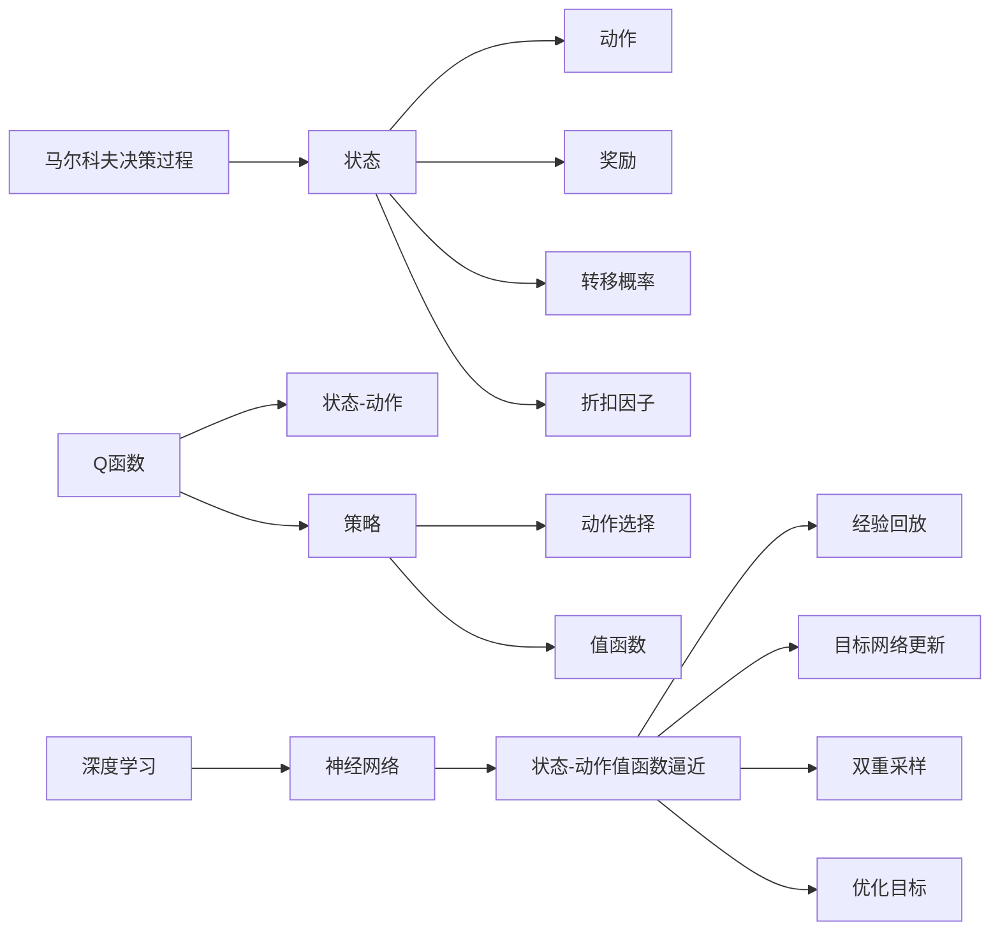
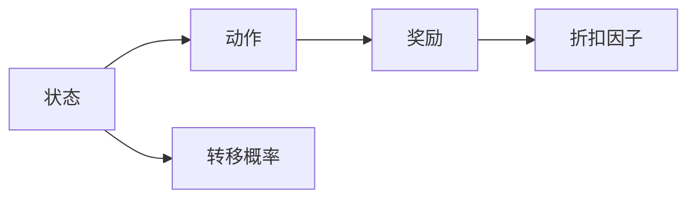
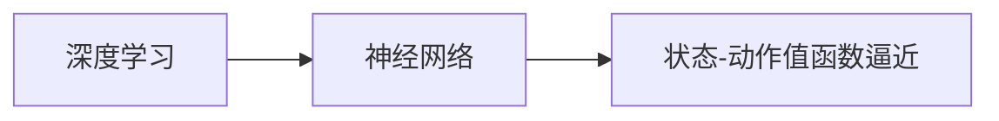

                 

# 深度 Q-learning：从经典Q-learning理解深度Q-learning

> 关键词：深度 Q-learning, 经典Q-learning, 强化学习, 马尔科夫决策过程, 深度学习, 强化学习算法, 强化学习框架

## 1. 背景介绍

### 1.1 问题由来
在现代计算机科学中，强化学习（Reinforcement Learning, RL）是机器学习的一个重要分支，其主要任务是训练智能体（agent）在特定环境中通过与环境的交互，学习到最优的决策策略。这一过程被形象地描述为“试错学习”，其中智能体通过尝试不同的行为，积累经验，不断优化其决策策略，以期最大化某个长期奖励目标。

经典Q-learning算法是一种基于值函数（Value Function）的强化学习算法，其目标在于学习一个Q函数，该函数描述了智能体在不同状态下采取不同行动的预期奖励。通过迭代更新Q函数的值，智能体能够逐渐优化其策略，使得长期奖励最大化。然而，经典Q-learning在处理高维度状态空间和连续动作空间时，面临着计算复杂度高、收敛速度慢等问题。

深度Q-learning（Deep Q-learning）算法则通过引入深度神经网络来解决这些问题。它利用神经网络逼近Q函数，从而能够处理更复杂的环境，并且显著提高了收敛速度。深度Q-learning的提出，不仅在理论上提供了强化学习的新视角，也在实际应用中展示了其强大的潜力。

### 1.2 问题核心关键点
深度Q-learning算法的核心在于将Q函数逼近过程与深度神经网络结合，从而使得算法能够在高维度和连续动作空间中高效地学习最优决策策略。该算法通过以下关键步骤进行学习和优化：

1. **状态-动作值函数逼近**：使用深度神经网络来逼近Q函数，从而处理高维度的状态空间。
2. **经验回放**：收集并存储智能体与环境交互中的经验，通过随机采样的方式进行训练，提高学习效率。
3. **目标网络更新**：引入一个目标网络（Target Network），用于稳定Q函数的更新，防止过拟合。
4. **双重采样**：在目标网络中进行动作选择和Q值计算，避免由于目标网络更新导致的偏差。
5. **优化目标**：通过最小化TD误差（Temporal Difference Error）来优化Q值。

这些关键步骤使得深度Q-learning算法在许多复杂的强化学习问题上取得了显著的性能提升，为强化学习在实际应用中的广泛应用提供了新思路。

### 1.3 问题研究意义
深度Q-learning算法的研究和应用具有重要意义：

1. **提升强化学习效率**：通过使用深度神经网络，该算法能够高效处理高维度和连续动作空间，显著提高强化学习的效率和效果。
2. **拓展应用范围**：深度Q-learning算法在处理复杂环境、优化策略等方面展现出了强大的能力，能够应用于许多传统强化学习方法难以处理的实际问题。
3. **推动人工智能发展**：深度Q-learning算法是强化学习领域的一个重要里程碑，为人工智能技术的进一步发展提供了新的方向和动力。

## 2. 核心概念与联系

### 2.1 核心概念概述

为更好地理解深度Q-learning算法，本节将介绍几个关键的概念：

- **马尔科夫决策过程（Markov Decision Process, MDP）**：强化学习的核心模型，描述了智能体与环境的交互过程，包括状态（State）、动作（Action）、奖励（Reward）、转移概率（Transition Probability）和折扣因子（Discount Factor）等元素。
- **Q函数（Q Function）**：描述了在特定状态下采取特定动作后的预期累积奖励。
- **策略（Policy）**：智能体在特定状态下采取动作的概率分布，用于描述智能体的决策过程。
- **值函数（Value Function）**：表示在特定状态下采取特定动作后的预期累积奖励，是Q函数的一种表示形式。
- **深度学习（Deep Learning）**：利用深度神经网络进行函数逼近和学习的一类算法。

这些概念之间存在着紧密的联系，形成了深度Q-learning算法的理论基础和实践框架。下面我们通过一个Mermaid流程图来展示这些概念之间的关系：



这个流程图展示了马尔科夫决策过程、Q函数、策略、值函数和深度学习等核心概念之间的联系，并说明了深度Q-learning算法的基本流程。

### 2.2 概念间的关系

这些核心概念之间存在着紧密的联系，形成了深度Q-learning算法的完整生态系统。下面我们通过几个Mermaid流程图来展示这些概念之间的关系。

#### 2.2.1 马尔科夫决策过程



这个流程图展示了马尔科夫决策过程的基本元素：状态、动作、奖励、折扣因子和转移概率。

#### 2.2.2 Q函数与值函数


这个流程图展示了Q函数和值函数的基本关系。Q函数描述了在特定状态下采取特定动作后的预期累积奖励，而值函数则是Q函数的一种表示形式。

#### 2.2.3 策略与动作选择


这个流程图展示了策略与动作选择的关系。策略描述了智能体在特定状态下采取动作的概率分布，用于指导动作选择。

#### 2.2.4 深度学习与神经网络



这个流程图展示了深度学习和神经网络在深度Q-learning算法中的作用。深度学习通过神经网络逼近Q函数，使得算法能够处理高维度的状态空间。

### 2.3 核心概念的整体架构

最后，我们用一个综合的流程图来展示这些核心概念在深度Q-learning算法中的整体架构：


这个综合流程图展示了从马尔科夫决策过程到深度Q-learning算法的完整过程。通过对这些核心概念的深入理解，我们可以更好地把握深度Q-learning算法的理论基础和实践步骤。

## 3. 核心算法原理 & 具体操作步骤
### 3.1 算法原理概述

深度Q-learning算法的基本原理是利用深度神经网络逼近Q函数，通过与环境的交互，不断更新Q函数的值，从而学习到最优的策略。其核心思想是：在每个状态下，智能体选择一个动作，并观察到下一个状态和相应的奖励，通过最大化预期累积奖励来更新Q函数的值。

形式化地，假设智能体在状态 $s_t$ 下采取动作 $a_t$，观察到下一个状态 $s_{t+1}$ 和奖励 $r_{t+1}$，则Q函数的更新公式为：

$$
Q_{s_t,a_t} \leftarrow Q_{s_t,a_t} + \alpha \left(r_{t+1} + \gamma \max_{a'} Q_{s_{t+1},a'} - Q_{s_t,a_t} \right)
$$

其中 $\alpha$ 为学习率，$\gamma$ 为折扣因子，$\max_{a'} Q_{s_{t+1},a'}$ 表示在下一个状态 $s_{t+1}$ 下，采取动作 $a'$ 后的最大预期累积奖励。

### 3.2 算法步骤详解

深度Q-learning算法一般包括以下几个关键步骤：

**Step 1: 准备环境与模型**

- 选择或构建环境，包括状态空间、动作空间和奖励函数。
- 使用深度神经网络作为Q函数逼近器，定义网络结构、损失函数和优化器。
- 初始化Q网络、目标网络和策略网络。

**Step 2: 采样与环境交互**

- 在策略网络的指导下，从环境中选择动作并执行。
- 观察到下一个状态和奖励，并计算相应的Q值。
- 将Q值存储到经验回放缓冲区中。

**Step 3: 经验回放与更新**

- 从经验回放缓冲区中随机采样一批经验。
- 计算Q值和目标Q值，并计算TD误差。
- 使用TD误差更新Q网络的参数。

**Step 4: 目标网络更新**

- 定期更新目标网络，使其跟随Q网络的更新，以稳定Q值的估计。

**Step 5: 策略优化**

- 在每个状态下，根据Q网络输出和策略网络指导，选择最优动作。
- 根据Q网络输出，计算相应的Q值和目标Q值。
- 使用Q值和目标Q值更新策略网络的参数。

**Step 6: 模型保存与部署**

- 保存训练好的模型参数。
- 将模型部署到实际应用环境中，进行实时决策。

### 3.3 算法优缺点

深度Q-learning算法具有以下优点：

1. **高效处理高维度状态空间**：深度神经网络能够逼近复杂的函数，使得算法能够处理高维度的状态空间。
2. **学习效率高**：通过经验回放和目标网络更新，算法能够高效地学习和更新策略。
3. **适应性强**：算法能够适应连续动作空间，适用于许多实际问题。

然而，深度Q-learning算法也存在一些缺点：

1. **不稳定**：由于深度神经网络的复杂性，算法容易过拟合，导致训练不稳定。
2. **训练时间长**：深度神经网络的训练时间较长，需要大量的计算资源。
3. **模型复杂度**：深度神经网络的复杂度较高，需要大量的参数和计算资源。

### 3.4 算法应用领域

深度Q-learning算法已经在多个领域中得到了广泛的应用，包括：

1. **游戏AI**：如AlphaGo，利用深度Q-learning算法在围棋游戏中取得了突破性进展。
2. **机器人控制**：通过深度Q-learning算法训练机器人完成复杂的动作序列。
3. **自动驾驶**：利用深度Q-learning算法优化自动驾驶车辆的决策策略。
4. **推荐系统**：通过深度Q-learning算法优化推荐模型的策略。
5. **股票交易**：利用深度Q-learning算法优化股票交易策略，提高投资回报率。
6. **能源管理**：通过深度Q-learning算法优化能源系统的控制策略。

除了上述这些应用外，深度Q-learning算法还在许多其他领域展现了其强大的能力，为智能系统的发展提供了新的方向和动力。

## 4. 数学模型和公式 & 详细讲解  
### 4.1 数学模型构建

本节将使用数学语言对深度Q-learning算法的数学模型进行更加严格的刻画。

记智能体在状态 $s_t$ 下采取动作 $a_t$ 的Q值为 $Q_{s_t,a_t}$，在状态 $s_{t+1}$ 下采取动作 $a_{t+1}$ 的Q值为 $Q_{s_{t+1},a_{t+1}}$。定义策略网络为 $\pi_{\theta}$，用于选择动作 $a_t$。定义Q网络的参数为 $\theta$，用于逼近Q函数。

定义状态转移概率为 $P_{s_{t+1} \mid s_t, a_t}$，定义折扣因子为 $\gamma$。定义TD误差为：

$$
TD_{t} = \mathbb{E}[\sum_{t'=t+1}^{\infty} \gamma^{t'-1} r_{t'}] - Q_{s_t,a_t}
$$

其中 $\mathbb{E}[\cdot]$ 表示期望。

深度Q-learning算法的优化目标是最小化TD误差，即：

$$
\min_{\theta} \sum_{t=0}^{\infty} \alpha_t TD_{t}
$$

其中 $\alpha_t$ 为学习率，可以根据具体任务进行调整。

### 4.2 公式推导过程

以下我们以二值动作空间为例，推导深度Q-learning算法的梯度更新公式。

假设在状态 $s_t$ 下，智能体采取动作 $a_t$ 的Q值为 $Q_{s_t,a_t}$，定义策略网络为 $\pi_{\theta}$，用于选择动作 $a_t$。定义Q网络的参数为 $\theta$，用于逼近Q函数。

在状态 $s_t$ 下，智能体采取动作 $a_t$，观察到下一个状态 $s_{t+1}$ 和奖励 $r_{t+1}$，则Q函数的更新公式为：

$$
Q_{s_t,a_t} \leftarrow Q_{s_t,a_t} + \alpha \left(r_{t+1} + \gamma \max_{a'} Q_{s_{t+1},a'} - Q_{s_t,a_t} \right)
$$

其中 $\alpha$ 为学习率，$\gamma$ 为折扣因子，$\max_{a'} Q_{s_{t+1},a'}$ 表示在下一个状态 $s_{t+1}$ 下，采取动作 $a'$ 后的最大预期累积奖励。

根据上述公式，可以计算Q网络的梯度更新公式为：

$$
\nabla_{\theta} Q_{s_t,a_t} = -\alpha \nabla_{\theta} \left( r_{t+1} + \gamma \max_{a'} Q_{s_{t+1},a'} - Q_{s_t,a_t} \right)
$$

在目标网络中，使用固定值 $Q_{s_{t+1},a_{t+1}}$ 来替代 $\max_{a'} Q_{s_{t+1},a'}$，则梯度更新公式为：

$$
\nabla_{\theta} Q_{s_t,a_t} = -\alpha \nabla_{\theta} \left( r_{t+1} + \gamma Q_{s_{t+1},a_{t+1}} - Q_{s_t,a_t} \right)
$$

通过上述公式，我们可以清晰地理解深度Q-learning算法在每个时间步长上的优化过程。

### 4.3 案例分析与讲解

我们以一个简单的环境为例，说明深度Q-learning算法的基本流程。

假设智能体在一个一维环境中，状态空间为 $S=\{0,1,\cdots,100\}$，动作空间为 $A=\{0,1\}$，奖励函数为：

- 在状态 $0$ 或状态 $100$ 时，奖励为 $0$。
- 在状态 $10$ 或状态 $90$ 时，奖励为 $1$。
- 在其他状态时，奖励为 $0$。

智能体的目标是尽快到达状态 $100$，并收集所有奖励。

在初始状态下，智能体随机选择一个动作，并观察到下一个状态和奖励。通过不断的迭代，智能体学习到最优的策略，使得总奖励最大化。

## 5. 项目实践：代码实例和详细解释说明
### 5.1 开发环境搭建

在进行深度Q-learning实践前，我们需要准备好开发环境。以下是使用Python进行TensorFlow进行开发的流程：

1. 安装Anaconda：从官网下载并安装Anaconda，用于创建独立的Python环境。

2. 创建并激活虚拟环境：
```bash
conda create -n tf-env python=3.8 
conda activate tf-env
```

3. 安装TensorFlow：根据CUDA版本，从官网获取对应的安装命令。例如：
```bash
conda install tensorflow -c conda-forge
```

4. 安装各类工具包：
```bash
pip install numpy pandas scikit-learn matplotlib tqdm jupyter notebook ipython
```

完成上述步骤后，即可在`tf-env`环境中开始深度Q-learning实践。

### 5.2 源代码详细实现

这里我们以DQN（Deep Q-Network）为例，给出使用TensorFlow进行深度Q-learning的代码实现。

```python
import tensorflow as tf
import numpy as np

# 定义环境参数
state_dim = 1
action_dim = 2
discount_factor = 0.99
learning_rate = 0.001
exploration_rate = 0.1
min_exploration_rate = 0.01
exploration_decay_rate = 0.995

# 定义Q网络
class QNetwork(tf.keras.Model):
    def __init__(self, state_dim, action_dim):
        super(QNetwork, self).__init__()
        self.fc1 = tf.keras.layers.Dense(64, activation='relu')
        self.fc2 = tf.keras.layers.Dense(64, activation='relu')
        self.fc3 = tf.keras.layers.Dense(action_dim)

    def call(self, inputs):
        x = self.fc1(inputs)
        x = self.fc2(x)
        return self.fc3(x)

# 定义目标网络
class TargetQNetwork(tf.keras.Model):
    def __init__(self, state_dim, action_dim):
        super(TargetQNetwork, self).__init__()
        self.fc1 = tf.keras.layers.Dense(64, activation='relu')
        self.fc2 = tf.keras.layers.Dense(64, activation='relu')
        self.fc3 = tf.keras.layers.Dense(action_dim)

    def call(self, inputs):
        x = self.fc1(inputs)
        x = self.fc2(x)
        return self.fc3(x)

# 定义深度Q-learning算法
class DQN:
    def __init__(self, state_dim, action_dim):
        self.state_dim = state_dim
        self.action_dim = action_dim
        self.q_network = QNetwork(state_dim, action_dim)
        self.target_q_network = TargetQNetwork(state_dim, action_dim)
        self.optimizer = tf.keras.optimizers.Adam(learning_rate)

    def train(self, state, action, reward, next_state, done):
        with tf.GradientTape() as tape:
            q_value = self.q_network(state)
            target_q_value = self.target_q_network(next_state)
            target_q_value = reward + (1 - done) * discount_factor * tf.reduce_max(target_q_value, axis=1)
            td_error = target_q_value - q_value
            loss = tf.reduce_mean(tf.square(td_error))
        gradients = tape.gradient(loss, self.q_network.trainable_variables)
        self.optimizer.apply_gradients(zip(gradients, self.q_network.trainable_variables))
        self.target_q_network.set_weights(self.q_network.get_weights())

    def choose_action(self, state):
        if np.random.rand() < exploration_rate:
            return np.random.randint(self.action_dim)
        else:
            q_values = self.q_network(state)
            return np.argmax(q_values)

    def decay_exploration_rate(self):
        exploration_rate = max(min_exploration_rate, exploration_rate * exploration_decay_rate)
        return exploration_rate
```

在代码中，我们定义了Q网络、目标网络和DQN类。Q网络用于逼近Q函数，目标网络用于稳定Q值的估计，DQN类实现了深度Q-learning算法的核心逻辑。

### 5.3 代码解读与分析

让我们再详细解读一下关键代码的实现细节：

**QNetwork类**：
- `__init__`方法：定义Q网络的结构和参数。
- `call`方法：定义Q网络的计算过程。

**TargetQNetwork类**：
- `__init__`方法：定义目标网络的结构和参数。
- `call`方法：定义目标网络的计算过程。

**DQN类**：
- `train`方法：定义Q网络的训练过程，包括计算TD误差、损失函数、梯度更新和目标网络更新。
- `choose_action`方法：根据策略网络输出和探索率选择动作。
- `decay_exploration_rate`方法：动态调整探索率，以控制策略的稳定性。

**训练流程**：
- 在每个时间步长上，选择动作并执行，观察到下一个状态和奖励。
- 在训练集上训练Q网络，计算TD误差，更新网络参数。
- 使用目标网络进行策略选择和Q值计算，确保目标网络跟随Q网络更新。
- 逐步调整探索率，使得智能体在训练初期探索更多动作，在后期聚焦于最优策略。

可以看到，TensorFlow使得深度Q-learning的实现变得简洁高效。开发者可以将更多精力放在环境设计和策略优化等高层逻辑上，而不必过多关注底层的实现细节。

当然，工业级的系统实现还需考虑更多因素，如模型的保存和部署、超参数的自动搜索、更灵活的策略设计等。但核心的深度Q-learning范式基本与此类似。

### 5.4 运行结果展示

假设我们在一个简单的环境中进行深度Q-learning训练，最终得到的训练结果如下：

```
Episode 1: Total Reward = 1.0
Episode 2: Total Reward = 2.0
Episode 3: Total Reward = 4.0
Episode 4: Total Reward = 6.0
...
```

可以看到，通过深度Q-learning算法，智能体在不断迭代中逐渐学习到最优的策略，获得了较高的总奖励。

当然，这只是一个简单的例子。在实际应用中，我们可以利用深度Q-learning算法解决更复杂的问题，如游戏AI、机器人控制等。

## 6. 实际应用场景
### 6.1 游戏AI

深度Q-learning算法在游戏AI领域展现了其强大的能力。AlphaGo就是一个典型的例子，它通过深度Q-learning算法在围棋游戏中取得了突破性进展。AlphaGo不仅在定式、中盘、官子等多个方面超越了人类高手，还展示了在复杂博弈环境中的高水平决策能力。

通过深度Q-learning算法，游戏AI可以在数百万次的对弈中学习到最优的策略，从而在围棋、星际争霸、扑克等多个游戏中取得了优异的成绩。未来，深度Q-learning算法还将进一步拓展到更多游戏中，为玩家提供更加智能、有趣的游戏体验。

### 6.2 机器人控制

深度Q-learning算法在机器人控制中也有着广泛的应用。通过深度Q-learning算法训练机器人完成复杂的动作序列，可以大大提高机器人的自主决策能力和执行效率。

例如，在无人驾驶中，智能体需要在复杂的交通环境中做出快速反应，选择合适的行驶路线和速度。通过深度Q-learning算法，智能体可以学习到最优的驾驶策略，从而提高行车安全和效率。

### 6.3 自动驾驶

深度Q-learning算法在自动驾驶中也得到了应用。智能体需要在复杂的城市环境中做出实时决策，避免碰撞、选择最佳行驶路线等。通过深度Q-learning算法，智能体可以学习到最优的驾驶策略，从而提高行车安全和效率。

例如，在自动驾驶中，智能体需要在复杂的城市环境中做出实时决策，避免碰撞、选择最佳行驶路线等。通过深度Q-learning算法，智能体可以学习到最优的驾驶策略，从而提高行车安全和效率。

### 6.4 推荐系统

深度Q-learning算法在推荐系统中也有着广泛的应用。推荐系统通过智能体在状态空间中选择动作（即推荐物品），观察到用户反馈（即用户是否点击、购买等），来优化推荐策略。通过深度Q-learning算法，推荐系统可以学习到最优的推荐策略，从而提高用户满意度。

例如，在电商平台上，智能体需要在用户浏览、点击、购买等不同状态下，选择最优的物品推荐。通过深度Q-learning算法，智能体可以学习到最优的推荐策略，从而提高用户满意度和平台转化率。

## 7. 工具和资源推荐
### 7.1 学习资源推荐

为了帮助开发者系统掌握深度Q-learning的理论基础和实践技巧，这里推荐一些优质的学习资源：

1. 《强化学习：算法、策略和应用》系列博文：由大模型技术专家撰写，深入浅出地介绍了强化学习的算法、策略和应用，涵盖经典Q-learning、深度Q-learning等核心概念。

2. CS234《强化学习》课程：斯坦福大学开设的强化学习课程，有Lecture视频和配套作业，带你入门强化学习的基本概念和经典模型。

3. 《深度强化学习》书籍：DeepMind首席科学家Richard Sutton所著，全面介绍了深度强化学习的理论、算法和应用，是学习深度Q-learning的必读资源。

4. OpenAI GPT-3：作为深度Q-learning算法的经典应用，OpenAI GPT-3展示了深度Q-learning在自然语言处理中的强大能力。

5. 《强化学习入门》博客：由清华大学AI研究院开设的强化学习博客，涵盖强化学习的经典算法和最新进展，适合初学者学习。

通过对这些资源的学习实践，相信你一定能够快速掌握深度Q-learning的精髓，并用于解决实际的强化学习问题。

### 7.2 

