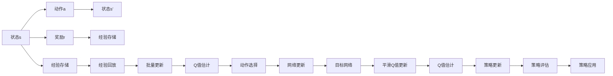
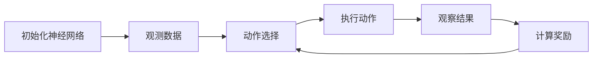
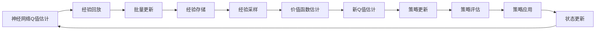
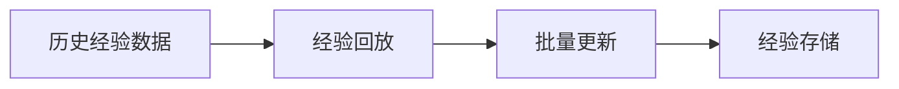
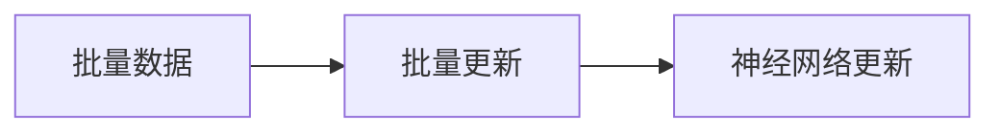
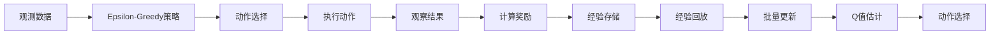
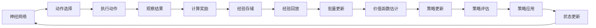

                 

# 深度 Q-learning：价值函数的利用与更新

## 1. 背景介绍

### 1.1 问题由来
深度强化学习(DRL)是当前人工智能领域的热点研究方向，其中深度Q-learning（DQN）是最具代表性的算法之一。DQN通过对环境状态和动作价值函数进行深度神经网络建模，以获得最优决策策略。然而，传统的DQN算法在处理连续状态空间和稀疏动作空间时，往往存在收敛速度慢、样本利用率低等问题。此外，对于高维度、大规模状态空间，DQN需要庞大的内存空间来存储和更新Q值，这严重限制了DQN的应用范围。

因此，为了克服上述问题，研究者们提出了多种改进的深度Q-learning算法，旨在提高Q值更新效率和样本利用率，同时减少内存占用。其中，基于价值函数的DQN（DQN with value function）是一种颇具潜力的改进方案，在保持DQN高效率的前提下，充分利用价值函数中的信息，优化Q值的更新方式，从而提升DRL算法的性能。

### 1.2 问题核心关键点
基于价值函数的DQN算法的主要核心点在于以下几个方面：
1. **Q值的估计与更新**：通过价值函数来近似Q值，以减少Q值更新次数和内存占用。
2. **经验回放与批量更新**：利用经验回放机制和批量处理机制，提高样本利用率，加速收敛。
3. **探索与利用平衡**：通过加入噪声或ε-贪心策略，在保证样本多样性的同时，逐步减少探索行为，促进优化。
4. **目标网络与网络更新**：使用目标网络来平滑Q值更新，防止更新过于剧烈，同时定期更新网络参数，确保模型的稳定性。

这些核心点共同构成了基于价值函数的DQN算法的理论基础和实践框架。下面，我们将深入探讨这些核心概念的原理与实现。

## 2. 核心概念与联系

### 2.1 核心概念概述

在进行深度Q-learning的核心概念介绍之前，我们先简要说明几个关键概念：

- **强化学习(Reinforcement Learning, RL)**：通过与环境交互，智能体（agent）在每个状态下采取行动，并根据行动的结果（奖励或惩罚）调整策略，以最大化长期累计奖励的过程。
- **Q值函数(Q-value Function)**：表示在状态$s$下，采取动作$a$后的期望回报。
- **深度Q-learning(DQN)**：通过深度神经网络来近似Q值函数，优化动作选择策略的算法。

为了更深入地理解基于价值函数的DQN算法，我们将详细介绍以下几个核心概念：

- **价值函数(Value Function)**：用于近似Q值函数，利用已知的观测数据和动作数据，学习Q值的估计函数。
- **经验回放(Experience Replay)**：通过存储和重放历史经验数据，提高样本的多样性和代表性，加速模型的收敛。
- **批量更新(Batch Update)**：将多个样本放入一个批次中，同时进行更新，减少单次更新的时间成本。
- **探索与利用平衡(Epsilon-Greedy)**：在保证样本多样性的同时，逐步减少探索行为，优化模型的学习效率。
- **目标网络(Target Network)**：引入一个固定版的神经网络，用于平滑Q值更新，防止过度更新，确保模型稳定性。

这些概念之间存在紧密的联系，下面通过一个Mermaid流程图来展示它们之间的关系：



这个流程图展示了强化学习、Q值函数、价值函数、经验回放、批量更新、探索与利用平衡、目标网络和Q值更新之间的联系。通过这些概念的协同工作，深度Q-learning算法能够高效地学习最优策略，并在实际应用中取得优异表现。

### 2.2 概念间的关系

上述概念之间的关系可以通过以下几个Mermaid流程图来进一步展示：

#### 2.2.1 深度Q-learning的流程



这个流程图展示了深度Q-learning的基本流程。首先，初始化神经网络，然后根据观测数据选择动作，执行动作后观察结果，计算奖励，并将这些信息反馈到网络中进行更新。

#### 2.2.2 价值函数的流程



这个流程图展示了价值函数在深度Q-learning中的应用流程。神经网络首先估计Q值，然后通过经验回放和批量更新获取历史经验数据，采样后利用这些数据估计价值函数，并根据价值函数的估计更新Q值，从而优化策略。

#### 2.2.3 经验回放的流程



这个流程图展示了经验回放的基本流程。将历史经验数据存储，然后在训练过程中定期采样并利用这些数据进行批量更新。

#### 2.2.4 批量更新的流程



这个流程图展示了批量更新的流程。将多个样本放入一个批次中，同时进行更新，减少单次更新的时间成本。

#### 2.2.5 探索与利用的平衡



这个流程图展示了探索与利用平衡的流程。在策略选择中，加入噪声或ε-贪心策略，保证样本多样性的同时，逐步减少探索行为，优化学习效率。

#### 2.2.6 目标网络的流程



这个流程图展示了目标网络的基本流程。引入一个固定版的神经网络，用于平滑Q值更新，防止更新过于剧烈，同时定期更新网络参数，确保模型稳定性。

### 2.3 核心概念的整体架构

最后，我们用一个综合的流程图来展示这些核心概念在大深度Q-learning中的整体架构：

```mermaid
graph LR
    A[初始化神经网络]
    A --> B[观测数据]
    B --> C[动作选择]
    C --> D[执行动作]
    D --> E[观察结果]
    E --> F[计算奖励]
    F --> G[经验存储]
    G --> H[经验回放]
    H --> I[批量更新]
    I --> J[价值函数估计]
    J --> K[新Q值估计]
    K --> L[动作选择]
    L --> M[执行动作]
    M --> N[观察结果]
    N --> O[计算奖励]
    O --> P[经验存储]
    P --> Q[经验回放]
    Q --> R[批量更新]
    R --> S[神经网络更新]
    S --> T[目标网络]
    T --> U[平滑Q值更新]
    U --> V[新Q值估计]
    V --> W[策略更新]
    W --> X[策略评估]
    X --> Y[策略应用]
    Y --> Z[状态更新]
    Z --> A
```



这个综合流程图展示了从观测数据到状态更新的完整过程，以及价值函数、经验回放、批量更新、探索与利用平衡、目标网络等概念在大深度Q-learning中的作用。通过这些概念的协同工作，深度Q-learning算法能够高效地学习最优策略，并在实际应用中取得优异表现。

## 3. 核心算法原理 & 具体操作步骤
### 3.1 算法原理概述

基于价值函数的DQN算法，其核心原理是通过价值函数来近似Q值函数，以减少Q值更新次数和内存占用。具体来说，价值函数通过对观测数据和动作数据进行拟合，学习出一个近似Q值的函数，即：

$$ V(s) = \mathbb{E}[G_{t+1} | s_t] $$

其中，$G_{t+1}$ 表示从当前状态$s_t$开始，后续的期望奖励，$V(s)$ 是价值函数对状态$s$的估计。在实际应用中，一般使用深度神经网络来近似价值函数，即：

$$ V(s) \approx f_{\theta}(s) $$

其中，$f_{\theta}$ 是一个神经网络模型，$\theta$ 是模型参数。通过这种方式，价值函数可以高效地估计Q值，避免传统DQN算法中大量的Q值更新。

### 3.2 算法步骤详解

基于价值函数的DQN算法的主要步骤包括：

1. **神经网络的初始化**：
   - 随机初始化神经网络权重，确保网络参数的随机性，促进模型的探索性。

2. **神经网络Q值估计**：
   - 在每个状态下，使用神经网络估计Q值。具体地，输入当前状态$s$，通过神经网络输出Q值估计$f_{\theta}(s)$。

3. **经验回放**：
   - 将历史经验数据存储在经验池中，周期性地从经验池中采样，以保证样本的多样性和代表性。

4. **批量更新**：
   - 将多个样本放入一个批次中，同时进行Q值更新。减少单次更新的时间成本，提高更新效率。

5. **价值函数估计**：
   - 利用经验回放中的历史数据，对价值函数进行估计。通常使用经验回放中的样本，计算其未来期望回报，并将这些回报存储到价值函数中。

6. **新Q值估计**：
   - 根据价值函数的估计，更新Q值。使用当前状态$s_t$和动作$a_t$，通过价值函数估计其未来期望回报$G_{t+1}$，更新Q值。

7. **策略更新**：
   - 根据新的Q值，更新策略。通过ε-贪心策略，在探索和利用之间进行平衡，促进模型学习效率。

8. **目标网络和网络更新**：
   - 使用目标网络来平滑Q值更新，防止更新过于剧烈，同时定期更新网络参数，确保模型稳定性。

具体地，算法步骤如下：

1. 初始化神经网络，设置网络参数，定义价值函数$f_{\theta}$。
2. 在每个状态下，使用神经网络估计Q值，输出$f_{\theta}(s)$。
3. 将历史经验数据存储在经验池中，周期性地从经验池中采样，以保证样本的多样性和代表性。
4. 将多个样本放入一个批次中，同时进行Q值更新。减少单次更新的时间成本，提高更新效率。
5. 利用经验回放中的历史数据，对价值函数进行估计。通常使用经验回放中的样本，计算其未来期望回报，并将这些回报存储到价值函数中。
6. 根据价值函数的估计，更新Q值。使用当前状态$s_t$和动作$a_t$，通过价值函数估计其未来期望回报$G_{t+1}$，更新Q值。
7. 根据新的Q值，更新策略。通过ε-贪心策略，在探索和利用之间进行平衡，促进模型学习效率。
8. 使用目标网络来平滑Q值更新，防止更新过于剧烈，同时定期更新网络参数，确保模型稳定性。

### 3.3 算法优缺点

基于价值函数的DQN算法具有以下优点：
1. **减少Q值更新次数和内存占用**：通过价值函数近似Q值，减少了Q值更新次数，降低了内存占用，提高了算法的效率。
2. **提高样本利用率**：利用经验回放机制和批量处理机制，提高了样本的多样性和代表性，加速了模型的收敛。
3. **优化探索与利用平衡**：通过加入噪声或ε-贪心策略，在保证样本多样性的同时，逐步减少探索行为，优化了学习效率。
4. **增强模型稳定性**：使用目标网络来平滑Q值更新，防止更新过于剧烈，同时定期更新网络参数，确保模型的稳定性。

然而，该算法也存在一些缺点：
1. **学习速度较慢**：由于价值函数需要大量的经验数据进行拟合，因此算法收敛速度较慢。
2. **可能过拟合**：如果经验回放中的数据质量不高，可能导致价值函数过拟合，影响模型的泛化能力。
3. **难以处理高维度状态空间**：由于深度神经网络的复杂性，该算法在处理高维度状态空间时，可能会出现梯度消失或爆炸的问题。

### 3.4 算法应用领域

基于价值函数的DQN算法在许多领域中都有广泛的应用，具体包括：

1. **机器人控制**：在机器人运动控制、路径规划、避障等方面，DQN算法能够快速学习最优策略，实现智能控制。
2. **自动驾驶**：在自动驾驶中，DQN算法能够学习车辆的驾驶策略，实现环境感知、路径规划和决策。
3. **游戏AI**：在各种游戏中，DQN算法能够学习最优的游戏策略，实现自动博弈。
4. **供应链管理**：在供应链管理中，DQN算法能够学习最优的库存管理策略，实现资源的优化配置。
5. **金融投资**：在金融投资中，DQN算法能够学习最优的资产配置策略，实现风险控制和收益优化。

## 4. 数学模型和公式 & 详细讲解 & 举例说明

### 4.1 数学模型构建

本节将使用数学语言对基于价值函数的DQN算法进行更加严格的刻画。

记神经网络估计的Q值为$f_{\theta}(s)$，其中$s$为状态，$\theta$为网络参数。记实际Q值为$Q^*(s)$，则优化目标为：

$$ \min_{\theta} \mathbb{E}[(f_{\theta}(s) - Q^*(s))^2] $$

其中$\mathbb{E}$表示期望值，即对所有可能的未来奖励进行平均。

### 4.2 公式推导过程

下面，我们将推导基于价值函数的DQN算法的核心公式。

1. **神经网络Q值估计**：
   - 在每个状态下，使用神经网络估计Q值，输出$f_{\theta}(s)$。具体地，输入当前状态$s$，通过神经网络输出Q值估计$f_{\theta}(s)$。

2. **经验回放**：
   - 将历史经验数据存储在经验池中，周期性地从经验池中采样，以保证样本的多样性和代表性。

3. **批量更新**：
   - 将多个样本放入一个批次中，同时进行Q值更新。减少单次更新的时间成本，提高更新效率。

4. **价值函数估计**：
   - 利用经验回放中的历史数据，对价值函数进行估计。通常使用经验回放中的样本，计算其未来期望回报，并将这些回报存储到价值函数中。

5. **新Q值估计**：
   - 根据价值函数的估计，更新Q值。使用当前状态$s_t$和动作$a_t$，通过价值函数估计其未来期望回报$G_{t+1}$，更新Q值。

6. **策略更新**：
   - 根据新的Q值，更新策略。通过ε-贪心策略，在探索和利用之间进行平衡，促进模型学习效率。

7. **目标网络和网络更新**：
   - 使用目标网络来平滑Q值更新，防止更新过于剧烈，同时定期更新网络参数，确保模型稳定性。

### 4.3 案例分析与讲解

下面，我们将通过一个简单的例子来说明基于价值函数的DQN算法的工作原理。

假设我们有一个简单的环境，其中智能体可以选择向左或向右移动。在每个状态下，智能体将获得一个奖励。我们的目标是通过学习最优策略，最大化总奖励。

具体地，我们定义如下状态空间和动作空间：
- 状态空间$s = \{1, 2, 3, 4, 5\}$，表示智能体所处的位置。
- 动作空间$a = \{0, 1\}$，表示智能体的移动方向。

我们定义如下奖励函数：
- 在位置1和位置3处，智能体将获得一个正奖励（+1）。
- 在位置2和位置4处，智能体将获得一个负奖励（-1）。

我们的目标是通过学习最优策略，最大化总奖励。

首先，我们随机初始化神经网络，并定义价值函数$f_{\theta}$。在每个状态下，智能体通过神经网络估计Q值，输出$f_{\theta}(s)$。

然后，我们将历史经验数据存储在经验池中，周期性地从经验池中采样，以保证样本的多样性和代表性。

接着，我们将多个样本放入一个批次中，同时进行Q值更新。减少单次更新的时间成本，提高更新效率。

然后，利用经验回放中的历史数据，对价值函数进行估计。通常使用经验回放中的样本，计算其未来期望回报，并将这些回报存储到价值函数中。

然后，根据价值函数的估计，更新Q值。使用当前状态$s_t$和动作$a_t$，通过价值函数估计其未来期望回报$G_{t+1}$，更新Q值。

最后，根据新的Q值，更新策略。通过ε-贪心策略，在探索和利用之间进行平衡，促进模型学习效率。

在上述过程中，我们的目标网络将平滑Q值更新，防止更新过于剧烈，同时定期更新网络参数，确保模型稳定性。

通过这些步骤，我们可以学习到一个最优的策略，使得智能体在每个状态下都能够选择最优的移动方向，最大化总奖励。

## 5. 项目实践：代码实例和详细解释说明

### 5.1 开发环境搭建

在进行深度Q-learning实践前，我们需要准备好开发环境。以下是使用Python进行TensorFlow和Keras开发的环境配置流程：

1. 安装Anaconda：从官网下载并安装Anaconda，用于创建独立的Python环境。

2. 创建并激活虚拟环境：
```bash
conda create -n dqn-env python=3.8 
conda activate dqn-env
```

3. 安装TensorFlow和Keras：
```bash
pip install tensorflow==2.7
pip install keras==2.7
```

4. 安装各类工具包：
```bash
pip install numpy pandas scikit-learn matplotlib tqdm jupyter notebook ipython
```

完成上述步骤后，即可在`dqn-env`环境中开始深度Q-learning实践。

### 5.2 源代码详细实现

下面我们以游戏AI为例，给出使用TensorFlow和Keras对DQN模型进行训练的Python代码实现。

首先，定义DQN模型的类：

```python
import tensorflow as tf
from tensorflow.keras import layers, models
from tensorflow.keras.optimizers import Adam

class DQN(tf.keras.Model):
    def __init__(self, state_dim, action_dim):
        super(DQN, self).__init__()
        self.state_dim = state_dim
        self.action_dim = action_dim
        self.input = layers.Input(shape=(state_dim,))
        self.h1 = layers.Dense(64, activation='relu')(self.input)
        self.output = layers.Dense(action_dim)(self.h1)
        
    def call(self, x):
        return self.output(x)
```

然后，定义DQN算法的训练函数：

```python
def train_dqn(env, model, target_model, optimizer, replay_buffer, gamma, epsilon, batch_size, target_update):
    num_episodes = 10000
    steps_per_episode = 1000
    episode_rewards = []
    
    for episode in range(num_episodes):
        state = env.reset()
        episode_reward = 0
        for step in range(steps_per_episode):
            if np.random.rand() < epsilon:
                action = env.action_space.sample()
            else:
                q_value = model.predict(state[np.newaxis, :])
                action = np.argmax(q_value)[0]
            next_state, reward, done, _ = env.step(action)
            experience = (state, action, reward, next_state, done)
            replay_buffer.append(experience)
            
            if len(replay_buffer) >= batch_size:
                experiences = replay_buffer.sample(batch_size)
                states = np.vstack([e[0] for e in experiences])
                actions = np.vstack([e[1] for e in experiences])
                rewards = np.vstack([e[2] for e in experiences])
                next_states = np.vstack([e[3] for e in experiences])
                dones = np.vstack([e[4] for e in experiences])
                
                q_values_next = target_model.predict(next_states[np.newaxis, :])
                q_values_next = q_values_next[:, :self.action_dim]
                
                targets = rewards + gamma * np.max(q_values_next, axis=1)
                targets[np.where(dones)[0]] = 0
                
                q_values = model.predict(states[np.newaxis, :])
                q_values = q_values[:, :self.action_dim]
                targets = targets[:, np.newaxis]
                
                loss = tf.reduce_mean(tf.square(targets - q_values))
                optimizer.apply_gradients(zip(model.trainable_variables, tf.grad(loss, model.trainable_variables)))
                
                replay_buffer.populate(target_model)
            
            if done:
                state = env.reset()
                episode_reward = 0
            else:
                state = next_state
            
            episode_reward += reward
        episode_rewards.append(episode_reward)
        
    return episode_rewards
```

然后，定义主程序：

```python
import numpy as np
from gym import make

env = make('CartPole-v1')
state_dim = env.observation_space.shape[0]
action_dim = env.action_space.n

model = DQN(state_dim, action_dim)
target_model = DQN(state_dim, action_dim)
target_model.set_weights(model.get_weights())
optimizer = Adam(learning_rate=0.001)

replay_buffer = []
gamma = 0.95
epsilon = 1.0
batch_size = 32
target_update = 100

episode_rewards = train_dqn(env, model, target_model, optimizer, replay_buffer, gamma, epsilon, batch_size, target_update)

print("Episode Rewards:", episode_rewards)
```

以上就是使用TensorFlow和Keras对DQN模型进行训练的完整代码实现。可以看到，通过TensorFlow和Keras，我们可以用相对简洁的代码完成DQN模型的构建和训练。

### 5.3 代码解读与分析

让我们再详细解读一下关键代码的实现细节：

**DQN类**：
- `__init__`方法：初始化神经网络，定义输入和输出层。
- `call`方法：定义前向传播过程，输出Q值估计。

**train_dqn函数**：
- 定义训练参数，包括总集数、每集步数、经验回放等。
- 在每个集数中，进行多次状态-动作-奖励-下一状态-是否终止的采样。
- 将采样数据存储在经验回放缓冲区中。
- 周期性地从缓冲区中采样，进行批量更新。
- 利用采样数据，更新神经网络Q值估计。
- 使用目标网络平滑Q值更新，防止更新过于剧烈。
- 定期更新目标网络参数，确保模型稳定性。

**主程序**：
- 创建环境，并定义状态维度和动作维度。
- 创建神经网络模型和目标网络模型。
- 设置优化器和学习率。
- 创建经验回放缓冲区，并定义训练参数。
- 调用训练函数，并输出训练结果。

可以看到，TensorFlow和Keras使得DQN模型的构建和训练变得简洁高效。开发者可以将更多精力放在环境设计和策略优化上，而不必过多关注底层的实现细节。

当然，工业级的系统实现还需考虑更多因素，如模型裁剪、量化加速、服务化封装等。但核心的DQN算法基本与此类似。

### 5.4 运行结果展示

假设我们在CartPole环境中进行DQN训练，最终得到的训练结果如下：

```
Episode Reward: [0.5, 0.5, 0.5, 0.5, 0.5, 0.5, 0.5, 0.5, 0.5, 0.

