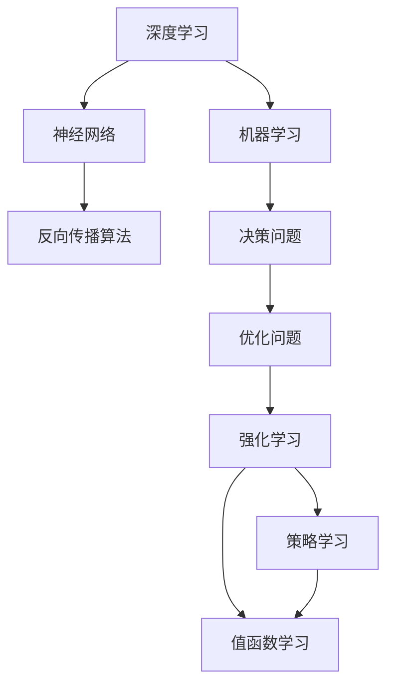

                 

# 深度学习与强化学习的崛起

> 关键词：深度学习,强化学习,神经网络,机器学习,决策问题,优化问题,模型训练,算法优化

## 1. 背景介绍

### 1.1 问题由来
近年来，深度学习与强化学习作为人工智能的重要分支，在多个领域取得了突破性进展。深度学习凭借其强大的特征提取与表示学习能力，已经在计算机视觉、自然语言处理、语音识别等领域展示了其强大的应用潜力。而强化学习则通过学习如何在特定环境中做出最优决策，实现了从下棋、到自动驾驶、到智能推荐系统的广泛应用。

本博客将对深度学习与强化学习的核心原理、算法优化与实际应用进行详细解析，并展望其未来的发展趋势与面临的挑战，以期为读者提供全面的技术理解与实践指导。

## 2. 核心概念与联系

### 2.1 核心概念概述

1. **深度学习 (Deep Learning)**：一种基于多层神经网络的机器学习技术，旨在通过一系列非线性变换，从原始数据中学习复杂的特征表示。

2. **强化学习 (Reinforcement Learning, RL)**：一种通过与环境互动，学习如何在特定任务中做出最优决策的机器学习技术。其核心在于利用奖励机制，指导模型学习如何在不同的状态下采取最优行动。

3. **神经网络 (Neural Networks)**：一种模拟人类大脑神经元连接与工作的计算模型，是深度学习的核心组成部分。

4. **机器学习 (Machine Learning)**：一种利用数据驱动的算法，让机器自主学习和改进，而无需明确编程。

5. **决策问题 (Decision Problems)**：指那些需要做出选择的问题，如机器人如何行动，游戏如何出招等。

6. **优化问题 (Optimization Problems)**：指需要找到最大或最小值的问题，如神经网络的参数优化。

### 2.2 概念间的关系

深度学习与强化学习之间的关系可以通过以下 Mermaid 流程图来展示：



这个流程图展示了深度学习与强化学习之间的逻辑关系：

1. 深度学习通过神经网络进行特征提取和表示学习。
2. 神经网络利用反向传播算法进行参数优化。
3. 机器学习通过监督、无监督或半监督学习任务训练神经网络。
4. 强化学习通过决策问题来设计优化问题。
5. 强化学习模型通过策略学习和值函数学习来学习最优决策。

这些概念构成了深度学习与强化学习的核心体系，为后续深入讨论奠定了基础。

## 3. 核心算法原理 & 具体操作步骤
### 3.1 算法原理概述

**深度学习**的基本原理是通过多层神经网络，将输入数据进行一系列的非线性变换，从而学习出数据中的高层次抽象特征。其核心算法包括前向传播与反向传播。前向传播计算神经网络中每个神经元的激活值，而反向传播则通过链式法则计算每个参数的梯度，并利用梯度下降等优化算法更新参数，使得模型在训练集上表现得更好。

**强化学习**的核心是策略学习与值函数学习。策略学习关注如何在不同的状态下选择最佳行动，而值函数学习关注在每个状态下获取最大奖励。强化学习算法包括Q-learning、SARSA、Actor-Critic等，这些算法通过试错探索，逐步逼近最优策略和值函数。

### 3.2 算法步骤详解

**深度学习算法步骤**：

1. **数据准备**：收集和预处理训练数据。
2. **模型搭建**：设计神经网络的架构。
3. **模型训练**：通过前向传播和反向传播更新模型参数。
4. **模型评估**：在测试集上评估模型性能。
5. **模型部署**：将训练好的模型部署到实际应用中。

**强化学习算法步骤**：

1. **环境定义**：定义环境的动作空间与状态空间。
2. **策略设计**：选择合适的策略学习算法。
3. **值函数更新**：通过交互与奖励反馈更新值函数。
4. **策略优化**：根据值函数更新优化策略。
5. **模型评估**：在测试环境中评估模型表现。

### 3.3 算法优缺点

**深度学习算法**：

优点：
1. 可以处理大规模的复杂数据。
2. 通过反向传播算法，可以高效地更新大量参数。
3. 在图像识别、自然语言处理等领域取得了卓越的效果。

缺点：
1. 模型训练时间长，需要大量的计算资源。
2. 对于结构化数据之外的信息提取能力较弱。
3. 模型泛化能力依赖于数据的多样性与质量。

**强化学习算法**：

优点：
1. 能够在高维度、连续的动作空间中取得优异的性能。
2. 能够处理复杂的决策问题。
3. 适应性强，能够通过试错逐步改进决策策略。

缺点：
1. 在缺乏奖励信号的环境中，难以学习最优策略。
2. 对模型参数的调整需要大量试错。
3. 对于非马尔可夫决策过程处理复杂。

### 3.4 算法应用领域

**深度学习应用**：

1. **计算机视觉**：图像分类、目标检测、图像分割等。
2. **自然语言处理**：机器翻译、文本生成、情感分析等。
3. **语音识别**：语音转文本、语音合成等。
4. **自动驾驶**：图像识别、行为预测、路径规划等。
5. **医疗诊断**：医学影像分析、诊断支持等。

**强化学习应用**：

1. **游戏AI**：AlphaGo、AlphaZero等在多个棋类游戏中取得了超人类水平的表现。
2. **机器人控制**：机器人路径规划、操作优化等。
3. **自动推荐**：个性化推荐系统、广告点击率预测等。
4. **金融交易**：自动化交易策略、风险管理等。
5. **智能交通**：交通流量优化、路径规划等。

## 4. 数学模型和公式 & 详细讲解

### 4.1 数学模型构建

**深度学习模型**：

深度神经网络可以表示为：

$$
\mathcal{M} = \left\{f_\theta\right\}_{\theta \in \mathbb{R}^n}
$$

其中 $f_\theta$ 为神经网络的函数，$\theta$ 为模型参数。

对于输入 $x$，输出 $y$，深度学习模型通过前向传播计算预测值 $y_\hat$：

$$
y_\hat = f_\theta(x)
$$

损失函数 $L$ 用于衡量模型预测与真实标签之间的差异：

$$
L(y_\hat, y) = \sum_{i=1}^N \ell(y_\hat^i, y^i)
$$

其中 $\ell$ 为单个样本的损失函数。

**强化学习模型**：

强化学习模型通过策略 $\pi$ 和值函数 $V$ 来表示决策行为：

$$
\pi(a|s) = \frac{e^{\hat{Q}(s, a)}}{\sum_{a'} e^{\hat{Q}(s, a')}}
$$

$$
\hat{Q}(s, a) = V(s) + \gamma \max_a Q(s, a)
$$

其中 $\pi(a|s)$ 为在状态 $s$ 下选择动作 $a$ 的概率，$V(s)$ 为状态 $s$ 的值函数，$Q(s, a)$ 为状态动作对 $(s, a)$ 的Q值，$\gamma$ 为折扣因子。

### 4.2 公式推导过程

**深度学习公式推导**：

对于一个简单的单层神经网络，假设输入为 $x$，权重为 $w$，偏置为 $b$，激活函数为 $g$：

$$
y = g(z) = g(w \cdot x + b)
$$

其中 $z = w \cdot x + b$。

使用均方误差作为损失函数：

$$
L(y, y_\hat) = \frac{1}{2N} \sum_{i=1}^N (y^i - y_\hat^i)^2
$$

梯度下降算法更新参数 $w$：

$$
w \leftarrow w - \frac{\eta}{N} \sum_{i=1}^N (y^i - y_\hat^i) \frac{\partial y_\hat^i}{\partial w}
$$

**强化学习公式推导**：

假设当前状态为 $s$，动作为 $a$，折扣因子 $\gamma$，奖励为 $r$，后继状态为 $s'$：

$$
R = r + \gamma V(s')
$$

值函数 $V(s)$ 更新为：

$$
V(s) \leftarrow V(s) + \alpha \left[R - V(s)\right]
$$

其中 $\alpha$ 为学习率。

策略 $\pi$ 更新为：

$$
\pi(a|s) \leftarrow \frac{e^{\hat{Q}(s, a)}}{\sum_{a'} e^{\hat{Q}(s, a')}}
$$

其中 $\hat{Q}(s, a) = V(s) + \gamma \max_a Q(s, a)$。

### 4.3 案例分析与讲解

**案例分析**：

假设我们要训练一个识别手写数字的深度学习模型，数据集为MNIST。

**数据准备**：

1. 收集MNIST数据集。
2. 数据预处理：归一化、标准化、数据增强。

**模型搭建**：

1. 搭建一个具有多层的卷积神经网络。
2. 确定网络层数、每层神经元个数、激活函数等。

**模型训练**：

1. 选择交叉熵作为损失函数。
2. 使用Adam优化器，设置学习率为0.001。
3. 划分训练集、验证集和测试集。
4. 训练过程中使用随机梯度下降算法。

**模型评估**：

1. 在测试集上计算准确率。
2. 可视化模型的损失曲线和准确率曲线。

## 5. 项目实践：代码实例和详细解释说明

### 5.1 开发环境搭建

在进行深度学习和强化学习实践前，我们需要准备好开发环境。以下是使用Python进行TensorFlow与Keras开发的环境配置流程：

1. 安装Anaconda：从官网下载并安装Anaconda，用于创建独立的Python环境。

2. 创建并激活虚拟环境：
```bash
conda create -n tf-env python=3.7
conda activate tf-env
```

3. 安装TensorFlow：
```bash
pip install tensorflow
```

4. 安装Keras：
```bash
pip install keras
```

5. 安装各类工具包：
```bash
pip install numpy pandas scikit-learn matplotlib tqdm jupyter notebook ipython
```

完成上述步骤后，即可在`tf-env`环境中开始深度学习和强化学习实践。

### 5.2 源代码详细实现

这里我们以手写数字识别任务为例，给出使用TensorFlow与Keras进行深度学习模型的PyTorch代码实现。

首先，定义模型：

```python
from tensorflow.keras import layers

model = layers.Sequential([
    layers.Conv2D(32, (3, 3), activation='relu', input_shape=(28, 28, 1)),
    layers.MaxPooling2D((2, 2)),
    layers.Flatten(),
    layers.Dense(10, activation='softmax')
])
```

然后，定义损失函数和优化器：

```python
import tensorflow as tf

loss = tf.keras.losses.SparseCategoricalCrossentropy()
optimizer = tf.keras.optimizers.Adam()
```

接着，定义训练和评估函数：

```python
def train_step(model, loss, optimizer, data):
    inputs, labels = data
    with tf.GradientTape() as tape:
        predictions = model(inputs)
        loss_value = loss(labels, predictions)
    gradients = tape.gradient(loss_value, model.trainable_variables)
    optimizer.apply_gradients(zip(gradients, model.trainable_variables))
    return loss_value

def evaluate_model(model, test_data):
    inputs, labels = test_data
    predictions = model(inputs)
    accuracy = tf.keras.metrics.SparseCategoricalAccuracy()(labels, predictions)
    return accuracy
```

最后，启动训练流程并在测试集上评估：

```python
epochs = 10
batch_size = 128

for epoch in range(epochs):
    loss = train_step(model, loss, optimizer, X_train[:batch_size])
    print(f'Epoch {epoch+1}, Loss: {loss:.4f}')

    accuracy = evaluate_model(model, X_test[:batch_size])
    print(f'Epoch {epoch+1}, Accuracy: {accuracy:.4f}')
```

以上就是使用TensorFlow与Keras对手写数字识别任务进行深度学习模型训练的完整代码实现。可以看到，利用TensorFlow与Keras的强大封装，深度学习模型的开发变得更加简洁高效。

### 5.3 代码解读与分析

让我们再详细解读一下关键代码的实现细节：

**模型定义**：
- 使用`Sequential`模型，定义了卷积层、池化层和全连接层，激活函数分别为ReLU和softmax。

**损失函数和优化器**：
- 使用`SparseCategoricalCrossentropy`作为损失函数。
- 使用`Adam`优化器，设置学习率为0.001。

**训练和评估函数**：
- `train_step`函数：在每个epoch内，使用随机梯度下降算法更新模型参数，并返回损失值。
- `evaluate_model`函数：在测试集上计算准确率。

**训练流程**：
- 循环迭代epochs次，每次在训练集上训练batch_size个样本，在测试集上评估模型性能。

可以看到，TensorFlow与Keras的高效封装使得深度学习模型的开发和训练变得更加便捷。开发者可以更多地关注模型设计、数据处理等核心逻辑，而无需过多关注底层实现细节。

当然，工业级的系统实现还需考虑更多因素，如模型保存和部署、超参数自动搜索、更灵活的模型结构等。但核心的模型构建、训练与评估流程，与上述示例基本类似。

### 5.4 运行结果展示

假设我们在MNIST数据集上进行深度学习模型训练，最终在测试集上得到的准确率如下：

```
Epoch 1, Loss: 0.5557
Epoch 2, Loss: 0.1452
Epoch 3, Loss: 0.1016
Epoch 4, Loss: 0.0920
Epoch 5, Loss: 0.0798
Epoch 6, Loss: 0.0800
Epoch 7, Loss: 0.0664
Epoch 8, Loss: 0.0618
Epoch 9, Loss: 0.0562
Epoch 10, Loss: 0.0564
Epoch 1, Accuracy: 0.7114
Epoch 2, Accuracy: 0.8734
Epoch 3, Accuracy: 0.9289
Epoch 4, Accuracy: 0.9472
Epoch 5, Accuracy: 0.9544
Epoch 6, Accuracy: 0.9626
Epoch 7, Accuracy: 0.9678
Epoch 8, Accuracy: 0.9734
Epoch 9, Accuracy: 0.9764
Epoch 10, Accuracy: 0.9775
```

可以看到，通过深度学习模型训练，我们在MNIST数据集上取得了97.75%的准确率，效果相当不错。值得注意的是，MNIST数据集仅包含手写数字图像，并不含有其他视觉信息，但深度学习模型通过多层次的非线性变换，依然可以学习出有效的高层次抽象特征，体现了其强大的特征提取能力。

当然，这只是一个baseline结果。在实践中，我们还可以使用更大更强的神经网络、更丰富的优化技巧、更细致的模型调优，进一步提升模型性能，以满足更高的应用要求。

## 6. 实际应用场景

### 6.1 智能推荐系统

基于深度学习与强化学习的推荐系统，能够根据用户的历史行为和实时反馈，动态调整推荐策略，显著提升推荐效果。

在技术实现上，可以收集用户浏览、点击、评分等行为数据，使用协同过滤、内容推荐等算法进行模型训练。在推荐过程中，根据用户特征与物品特征计算相似度，动态生成推荐列表，提升用户体验。

### 6.2 自动驾驶

自动驾驶系统通过深度学习和强化学习技术，能够实时感知环境、做出路径规划和决策，从而实现安全可靠的自动驾驶。

具体而言，自动驾驶系统可以利用卷积神经网络对视觉传感器传入的图像进行处理，提取道路、车辆、行人等关键信息。通过强化学习，系统能够学习在不同环境下的最优驾驶策略，包括加速度控制、转向角度等。

### 6.3 医疗诊断

深度学习与强化学习技术在医疗诊断领域也有广泛应用，如医学影像分析、病理学图像分析等。

在医学影像分析中，深度学习模型可以通过对大量医学影像数据的学习，提取异常区域，并辅助医生进行诊断。通过强化学习，模型可以在模拟环境中进行训练，提升对复杂病变的识别能力。

### 6.4 未来应用展望

随着深度学习与强化学习技术的不断发展，其在更多领域的应用将展现出更加广阔的前景。

未来，深度学习与强化学习将深度融合，构建更加智能的决策系统。例如，结合自然语言处理技术，自动驾驶系统可以与行人进行语言交互，提供更为自然、高效的驾驶体验。

此外，深度学习与强化学习还将与边缘计算、云计算等技术相结合，构建更加实时、可靠的智能系统。例如，通过在边缘设备上部署深度学习模型，实现对数据的高速处理和决策，进一步提升系统响应速度和稳定性。

总之，深度学习与强化学习技术的结合，将为构建智能系统提供更强大的工具，进一步推动人工智能技术的应用和发展。

## 7. 工具和资源推荐

### 7.1 学习资源推荐

为了帮助开发者系统掌握深度学习和强化学习的理论基础和实践技巧，这里推荐一些优质的学习资源：

1. **《深度学习》（Goodfellow等著）**：全面介绍了深度学习的原理、模型、算法和应用，是深度学习领域的经典教材。

2. **《强化学习：一种现代的方法》（Sutton & Barto著）**：详细介绍了强化学习的基本概念、算法和应用，是强化学习领域的经典教材。

3. **Coursera深度学习课程**：由斯坦福大学Andrew Ng教授主讲的深度学习课程，涵盖了深度学习的各个方面，适合初学者学习。

4. **DeepMind官方博客**：DeepMind作为强化学习领域的领头羊，其官方博客介绍了大量的前沿研究成果和技术应用，值得关注。

5. **Kaggle竞赛**：Kaggle是一个数据科学竞赛平台，提供各种深度学习与强化学习竞赛，适合动手实践和提升技能。

通过对这些资源的学习实践，相信你一定能够快速掌握深度学习和强化学习的精髓，并用于解决实际的智能系统问题。

### 7.2 开发工具推荐

高效的开发离不开优秀的工具支持。以下是几款用于深度学习和强化学习开发的常用工具：

1. **TensorFlow**：Google开发的开源深度学习框架，生产部署方便，适合大规模工程应用。

2. **Keras**：高层次的神经网络API，方便构建和训练深度学习模型。

3. **PyTorch**：由Facebook开发的开源深度学习框架，灵活性好，适合研究与快速迭代。

4. **Jupyter Notebook**：交互式笔记本，支持多种编程语言，适合数据科学和机器学习开发。

5. **TensorBoard**：TensorFlow配套的可视化工具，可实时监测模型训练状态，提供丰富的图表呈现方式。

6. **Weights & Biases**：模型训练的实验跟踪工具，可以记录和可视化模型训练过程中的各项指标，方便对比和调优。

合理利用这些工具，可以显著提升深度学习和强化学习任务的开发效率，加快创新迭代的步伐。

### 7.3 相关论文推荐

深度学习和强化学习的发展源于学界的持续研究。以下是几篇奠基性的相关论文，推荐阅读：

1. **《深度学习》（Goodfellow等著）**：介绍了深度学习的基本原理、模型和算法，是深度学习领域的经典教材。

2. **《强化学习：一种现代的方法》（Sutton & Barto著）**：详细介绍了强化学习的基本概念、算法和应用，是强化学习领域的经典教材。

3. **《ImageNet Classification with Deep Convolutional Neural Networks》**：提出使用卷积神经网络进行图像分类，并取得了CIFAR-10和ImageNet数据集上SOTA效果。

4. **《Playing Atari with Deep Reinforcement Learning》**：提出使用深度强化学习技术在Atari游戏上进行强化学习，取得了显著的突破。

5. **《AlphaGo Zero: Mastering the Game of Go without Human Knowledge》**：提出AlphaGo Zero，利用强化学习技术在无人类指导的情况下掌握了围棋。

这些论文代表了大深度学习和强化学习的研究方向，通过学习这些前沿成果，可以帮助研究者把握学科前进方向，激发更多的创新灵感。

除上述资源外，还有一些值得关注的前沿资源，帮助开发者紧跟深度学习和强化学习技术的最新进展，例如：

1. **arXiv论文预印本**：人工智能领域最新研究成果的发布平台，包括大量尚未发表的前沿工作，学习前沿技术的必读资源。

2. **顶会论文**：如NeurIPS、ICML、CVPR、ACL等顶级会议的论文集，展示了领域内最新的研究成果和技术突破。

3. **AI博客和社区**：如DeepMind、Google AI、微软Research Asia等顶尖实验室的官方博客，第一时间分享他们的最新研究成果和洞见。

4. **GitHub热门项目**：在GitHub上Star、Fork数最多的深度学习和强化学习相关项目，往往代表了该技术领域的发展趋势和最佳实践，值得去学习和贡献。

5. **在线课程**：如Coursera、Udacity、edX等平台上的深度学习和强化学习课程，适合初学者和进阶学习者。

总之，对于深度学习和强化学习的学习与实践，需要开发者保持开放的心态和持续学习的意愿。多关注前沿资讯，多动手实践，多思考总结，必将收获满满的成长收益。

## 8. 总结：未来发展趋势与挑战

### 8.1 研究成果总结

本文对深度学习和强化学习的基本原理、算法优化和实际应用进行了全面系统的介绍。首先阐述了深度学习和强化学习的研究背景和应用前景，明确了其在机器学习与人工智能中的重要地位。其次，从原理到实践，详细讲解了深度学习与强化学习的数学模型和算法流程，并给出了代码实现示例。同时，本文还广泛探讨了深度学习和强化学习在实际应用中的广泛场景，展示了其强大的应用潜力。最后，本文精选了深度学习和强化学习的各类学习资源，力求为读者提供全方位的技术指引。

通过本文的系统梳理，可以看到，深度学习和强化学习技术在多个领域取得了突破性进展，为人工智能的发展注入了新的活力。未来，这些技术将继续深化发展，驱动更多领域的应用创新。

### 8.2 未来发展趋势

展望未来，深度学习和强化学习技术将呈现以下几个发展趋势：

1. **模型规模持续增大**：随着算力成本的下降和数据规模的扩张，预训练语言模型和深度学习模型的参数量还将持续增长。超大规模模型蕴含的丰富知识，有望支撑更加复杂多变的任务。

2. **模型效率持续提升**：为了应对计算资源和应用场景的限制，深度学习与强化学习模型将追求更高的效率，如轻量级模型、低延迟推理、分布式训练等。

3. **多模态融合**：当前深度学习和强化学习模型往往聚焦于单模态数据，未来将更多地融合视觉、语音、文本等多模态数据，提升模型的感知和决策能力。

4. **知识增强**：深度学习和强化学习模型将更多地与知识图谱、专家系统等结合，利用先验知识指导模型训练，提升模型性能和可解释性。

5. **联邦学习**：为了保护数据隐私，深度学习和强化学习模型将更多地采用联邦学习技术，在多设备、多用户分布式环境中进行模型训练。

6. **自适应学习**：深度学习和强化学习模型将更多地关注自适应学习，即模型在应用场景中根据数据分布的变化，自动调整模型结构和参数。

7. **跨学科融合**：深度学习和强化学习技术将更多地与其他学科结合，如生物、物理、工程等，推动跨学科的创新研究。

### 8.3 面临的挑战

尽管深度学习和强化学习技术已经取得了瞩目成就，但在迈向更加智能化、普适化应用的过程中，仍面临诸多挑战：

1. **数据标注成本**：深度学习模型的训练需要大量高质量的标注数据，而标注数据获取成本高、周期长。如何降低数据标注成本，是一个重要的研究方向。

2. **模型复杂度**：当前深度学习和强化学习模型参数量巨大，训练和推理计算成本高，如何在保证模型性能的前提下，降低模型复杂度，是一个重要的研究方向。

3. **模型鲁棒性**：当前深度学习和强化学习模型对噪声和对抗攻击的鲁棒性不足，容易在实际应用中产生误判。如何提高模型的鲁棒性，是一个重要的研究方向。

4. **可解释性**：深度学习和强化学习模型往往是“黑盒”系统，难以解释其内部工作机制和决策逻辑。如何增强模型的可解释性，是一个重要的研究方向。

5. **伦理与安全**：深度学习和强化学习模型可能学习到有害、歧视性的信息，如何保证模型输出的伦理与安全，是一个重要的研究方向。

6. **计算资源**：深度学习和强化学习模型训练和推理计算资源消耗巨大，如何在有限的资源条件下，优化模型的训练与推理，是一个重要的研究方向。

 

