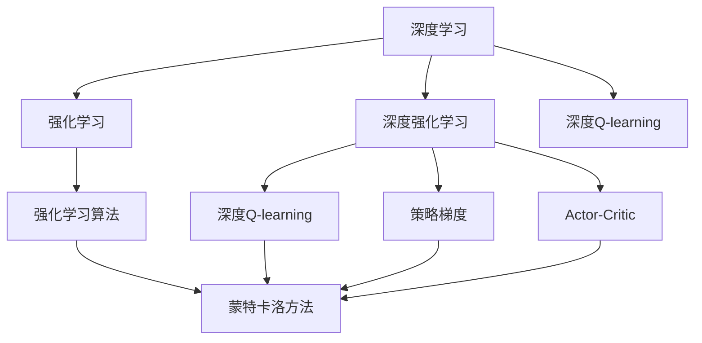
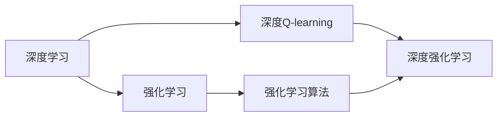
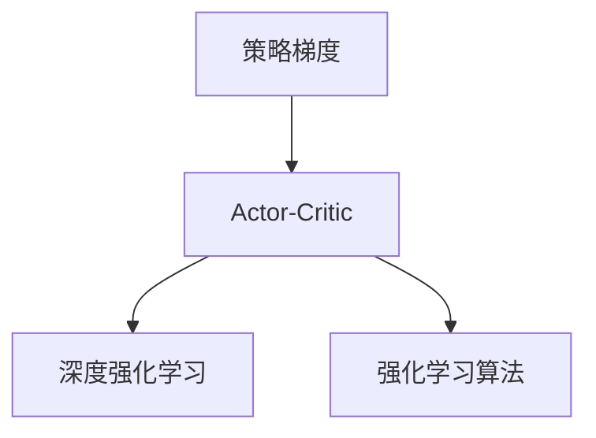
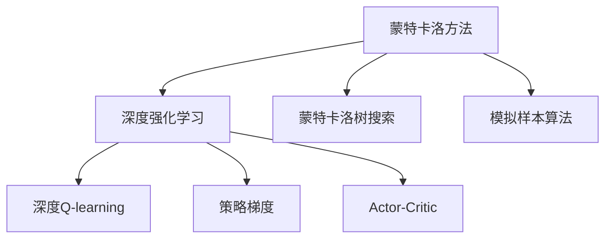
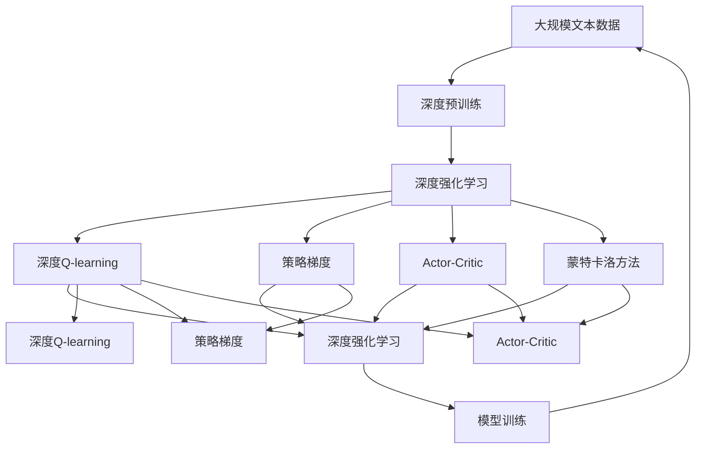

                 

## 1. 背景介绍

### 1.1 问题由来

在过去几十年的计算机科学发展中，深度学习（Deep Learning）和强化学习（Reinforcement Learning, RL）逐渐崛起，成为人工智能（AI）领域的两大重要分支。深度学习主要涉及神经网络模型的研究，通过大量的标记数据进行监督学习（Supervised Learning），实现了图像识别、语音识别、自然语言处理等诸多领域的突破。而强化学习则是通过智能体（Agent）与环境的交互，利用奖励信号进行无监督学习，极大地推动了游戏AI、机器人控制、自动驾驶等领域的进展。

深度学习和强化学习各具特色，但两者又存在许多交集。近年来，将这两者融合的深度强化学习（Deep Reinforcement Learning, DRL）技术快速发展，进一步拓宽了AI应用场景，带来了诸多颠覆性创新。例如AlphaGo通过深度强化学习在围棋领域实现突破，OpenAI通过深度强化学习构建的GPT系列模型在自然语言处理领域表现卓越，Google通过深度强化学习实现的AlphaStar在游戏《星际争霸II》中取得世界冠军。

### 1.2 问题核心关键点

深度学习与强化学习的崛起，深刻改变了AI技术的研发与应用模式。其核心关键点包括：

- **数据驱动与交互驱动**：深度学习主要通过标记数据进行监督学习，而强化学习则通过智能体与环境的交互进行学习。
- **模型复杂与策略复杂**：深度学习主要研究模型结构，如卷积神经网络（CNN）、循环神经网络（RNN）、变分自编码器（VAE）等，而强化学习则侧重于策略学习，如Q-learning、SARSA、Deep Q-Network（DQN）等。
- **算力需求与实时性需求**：深度学习对计算资源的要求较高，而强化学习则需要实时交互和即时反馈。
- **应用场景与研究领域**：深度学习主要应用于图像、语音、文本等感知任务的识别与生成，强化学习则广泛应用于游戏AI、机器人控制、自动驾驶等需要与环境互动的任务。

## 2. 核心概念与联系

### 2.1 核心概念概述

为更好地理解深度学习和强化学习的崛起，本节将介绍几个密切相关的核心概念：

- **深度学习（Deep Learning）**：通过构建深度神经网络进行复杂数据模式识别和预测。其主要应用领域包括计算机视觉、语音识别、自然语言处理等。

- **强化学习（Reinforcement Learning）**：通过智能体与环境的交互，在不断试错中优化策略，以最大化累计奖励信号。主要应用领域包括游戏AI、机器人控制、自动驾驶、金融投资等。

- **深度强化学习（Deep Reinforcement Learning）**：将深度学习与强化学习结合，构建神经网络模型作为智能体的控制器，以增强模型在特定任务中的表现。其典型应用包括AlphaGo、OpenAI Gym、AlphaStar等。

- **策略梯度（Policy Gradient）**：强化学习中的一类算法，通过直接优化策略参数，而不是状态值函数，实现对策略的优化。典型算法包括REINFORCE、Proximal Policy Optimization（PPO）、Trust Region Policy Optimization（TRPO）等。

- **Actor-Critic**：一种常见的深度强化学习算法架构，将策略网络（Actor）和值网络（Critic）结合，同时优化策略和值函数，提升模型性能。

- **蒙特卡洛方法（Monte Carlo Methods）**：通过随机模拟重复实验，估算策略的性能和值函数的期望值。常见的蒙特卡洛方法包括蒙特卡洛树搜索（MCTS）、模拟样本算法（Simulation-based Methods）等。

这些核心概念之间的逻辑关系可以通过以下Mermaid流程图来展示：



这个流程图展示了大语言模型的核心概念及其之间的关系：

1. 深度学习通过构建神经网络进行模式识别和预测。
2. 强化学习通过智能体与环境的交互进行学习。
3. 深度强化学习将深度学习与强化学习结合，提升模型性能。
4. 策略梯度是一种优化策略参数的强化学习方法。
5. Actor-Critic是一种常见的深度强化学习算法架构。
6. 蒙特卡洛方法用于估算策略和值函数的性能。

这些概念共同构成了深度学习和强化学习的学习框架，使得两者能够相互补充，共同推动AI技术的发展。

### 2.2 概念间的关系

这些核心概念之间存在着紧密的联系，形成了深度学习和强化学习的完整生态系统。下面我通过几个Mermaid流程图来展示这些概念之间的关系。

#### 2.2.1 深度学习与强化学习的关系



这个流程图展示了深度学习与强化学习的基本关系：

1. 深度学习通过神经网络模型进行模式识别。
2. 强化学习通过智能体与环境的交互进行学习。
3. 深度强化学习结合了深度学习和强化学习的特点，提升模型性能。

#### 2.2.2 策略梯度与Actor-Critic的关系



这个流程图展示了策略梯度与Actor-Critic的关系：

1. 策略梯度是一种优化策略参数的强化学习方法。
2. Actor-Critic是一种常见的深度强化学习算法架构，将策略网络和值网络结合。
3. 策略梯度算法和Actor-Critic算法都是深度强化学习的一部分。

#### 2.2.3 蒙特卡洛方法的应用



这个流程图展示了蒙特卡洛方法在深度强化学习中的应用：

1. 蒙特卡洛方法通过随机模拟估算策略和值函数的性能。
2. Monte Carlo Tree Search（MCTS）和Simulation-based Methods是常见的蒙特卡洛方法。
3. 蒙特卡洛方法在深度强化学习中用于策略评估和优化。

### 2.3 核心概念的整体架构

最后，我们用一个综合的流程图来展示这些核心概念在大语言模型微调过程中的整体架构：



这个综合流程图展示了从预训练到强化学习的完整过程。深度学习模型通过大规模无标签文本数据进行预训练，然后通过深度强化学习算法进行微调，以优化模型在特定任务上的性能。深度强化学习算法包括深度Q-learning、策略梯度、Actor-Critic等，蒙特卡洛方法用于策略评估和优化。通过这些算法和技术的结合，深度强化学习实现了模型性能的显著提升。

## 3. 核心算法原理 & 具体操作步骤
### 3.1 算法原理概述

深度强化学习将深度学习与强化学习相结合，构建神经网络模型作为智能体的控制器，通过与环境的交互，学习最优策略以最大化累计奖励信号。其核心思想是：将神经网络模型作为智能体，通过状态值函数和策略网络，实现对环境的学习和优化。

深度强化学习的数学模型可以形式化为：

$$
\max_{\theta} \mathbb{E}_{s_0,s_1,\ldots,s_t,\ldots} \left[\sum_{t=0}^{\infty} \gamma^t r_t\right]
$$

其中，$s_t$表示环境在时间$t$的状态，$r_t$表示在状态$s_t$下的即时奖励，$\gamma$表示折扣因子，$\theta$表示神经网络模型的参数。深度强化学习的目标是在给定环境状态下，选择最优动作以最大化累计奖励。

### 3.2 算法步骤详解

深度强化学习的训练流程一般包括以下几个关键步骤：

**Step 1: 准备环境与初始化模型**
- 选择合适的环境（如游戏环境、模拟环境），并定义状态和动作空间。
- 初始化深度神经网络模型，如卷积神经网络（CNN）、循环神经网络（RNN）、变压器（Transformer）等。

**Step 2: 定义奖励函数与状态值函数**
- 根据任务需求，设计合适的奖励函数和状态值函数。奖励函数衡量策略的好坏，状态值函数用于评估当前状态的价值。

**Step 3: 设计策略网络与值网络**
- 定义策略网络，如输出层为动作概率分布的神经网络。
- 定义值网络，如输出层为状态价值的神经网络。

**Step 4: 定义损失函数与优化算法**
- 根据策略梯度或值函数优化算法，设计损失函数。
- 使用Adam、SGD等优化算法，更新神经网络模型参数。

**Step 5: 执行训练与评估**
- 通过随机模拟训练，不断更新策略和值函数。
- 在验证集或实际环境中评估模型性能，优化策略。
- 重复上述步骤直到收敛。

**Step 6: 部署与应用**
- 将训练好的模型部署到实际应用场景中。
- 在实际环境中进行测试和优化，持续改进模型性能。

以上是深度强化学习的训练流程，在实际应用中，还需要针对具体任务进行优化设计，如改进奖励函数、引入正则化技术、搜索最优超参数等，以进一步提升模型性能。

### 3.3 算法优缺点

深度强化学习具有以下优点：

- 非监督性：深度强化学习主要通过与环境的交互进行学习，无需大量标注数据。
- 适应性强：深度强化学习能够处理复杂多变的环境，提升模型泛化能力。
- 实时性：深度强化学习通过实时反馈进行优化，能够动态调整策略。

但同时，深度强化学习也存在以下缺点：

- 训练复杂度高：深度强化学习的训练过程复杂，需要大量计算资源和时间。
- 稳定性差：深度强化学习模型容易受到参数初始化和随机模拟的影响，可能导致过拟合。
- 可解释性差：深度强化学习模型作为"黑盒"系统，难以解释其内部工作机制和决策逻辑。

尽管存在这些缺点，但深度强化学习在大规模环境互动任务中取得了显著效果，成为AI领域的重要研究范式。未来相关研究的重点在于如何进一步降低训练复杂度、提高稳定性、增强可解释性，从而推动深度强化学习的广泛应用。

### 3.4 算法应用领域

深度强化学习已经在多个领域取得了突破性进展，包括：

- 游戏AI：AlphaGo、AlphaStar等通过深度强化学习在游戏领域取得优异成绩。
- 机器人控制：通过深度强化学习训练机器人执行复杂任务。
- 自动驾驶：利用深度强化学习训练自动驾驶汽车在复杂环境中安全行驶。
- 金融投资：通过深度强化学习优化投资策略，提升投资回报率。
- 自然语言处理：通过深度强化学习训练对话系统，提升人机交互体验。

除了上述这些领域，深度强化学习还广泛应用于推荐系统、供应链优化、能源管理等领域，为各行各业带来了显著的经济效益。随着技术的不断演进，深度强化学习的应用场景还将不断拓展，带来更多创新和变革。

## 4. 数学模型和公式 & 详细讲解 & 举例说明

### 4.1 数学模型构建

在深度强化学习中，数学模型主要包括以下几个关键组成部分：

- **状态值函数（Q-Value Function）**：用于评估状态的价值，定义为当前状态下选择动作后的期望回报。
- **策略函数（Policy Function）**：用于指导智能体选择动作，定义为在给定状态下选择动作的概率分布。

数学模型可以形式化为：

$$
Q(s,a) = \mathbb{E}[\sum_{t=0}^{\infty} \gamma^t r_t | s_0 = s, a_0 = a]
$$

其中，$s$表示状态，$a$表示动作，$r_t$表示即时奖励，$\gamma$表示折扣因子。

### 4.2 公式推导过程

以下我们以Q-learning为例，推导其数学公式及其梯度计算。

Q-learning是一种基于蒙特卡洛方法的强化学习算法，其核心思想是通过不断更新状态值函数来优化策略。假设在时间$t$时，智能体处于状态$s_t$，选择动作$a_t$，环境响应状态$s_{t+1}$并给出奖励$r_t$。则状态值函数的更新公式为：

$$
Q(s_t,a_t) = Q(s_t,a_t) + \alpha(r_t + \gamma \max_a Q(s_{t+1},a) - Q(s_t,a_t))
$$

其中，$\alpha$表示学习率。

通过对上式进行整理，得到状态值函数的梯度计算公式：

$$
\nabla_{\theta} Q(s_t,a_t) = \alpha(r_t + \gamma \max_a Q(s_{t+1},a) - Q(s_t,a_t))
$$

将梯度代入优化算法中，即可完成Q-learning的训练过程。

### 4.3 案例分析与讲解

假设我们要训练一个智能体在迷宫中寻找出口，可以使用Q-learning算法。具体步骤如下：

1. 定义状态和动作空间：迷宫中的每个位置是一个状态，向上、下、左、右等动作都是可能的选择。

2. 初始化状态值函数和策略函数：使用全连接神经网络作为状态值函数和策略函数。

3. 定义奖励函数：当智能体到达出口时，奖励为1；否则，奖励为0。

4. 训练Q-learning模型：通过蒙特卡洛方法模拟智能体在迷宫中的行为，不断更新状态值函数和策略函数。

通过Q-learning算法，智能体能够在迷宫中不断学习最优策略，最终找到出口。需要注意的是，Q-learning算法需要大量时间进行模拟和训练，才能得到满意的性能。

## 5. 项目实践：代码实例和详细解释说明

### 5.1 开发环境搭建

在进行深度强化学习实践前，我们需要准备好开发环境。以下是使用Python进行PyTorch开发的环境配置流程：

1. 安装Anaconda：从官网下载并安装Anaconda，用于创建独立的Python环境。

2. 创建并激活虚拟环境：
```bash
conda create -n pytorch-env python=3.8 
conda activate pytorch-env
```

3. 安装PyTorch：根据CUDA版本，从官网获取对应的安装命令。例如：
```bash
conda install pytorch torchvision torchaudio cudatoolkit=11.1 -c pytorch -c conda-forge
```

4. 安装各类工具包：
```bash
pip install numpy pandas scikit-learn matplotlib tqdm jupyter notebook ipython
```

完成上述步骤后，即可在`pytorch-env`环境中开始深度强化学习的实践。

### 5.2 源代码详细实现

这里我们以训练AlphaGo为例，展示使用PyTorch进行深度强化学习的代码实现。

首先，定义环境类和状态值函数：

```python
import numpy as np
import torch
from torch import nn
from torch.optim import Adam

class MazeEnv:
    def __init__(self, maze, start_pos, end_pos):
        self.maze = maze
        self.start_pos = start_pos
        self.end_pos = end_pos
        self.state = start_pos
        
    def reset(self):
        self.state = self.start_pos
        return self.state
    
    def step(self, action):
        if action == 0:  # 向上
            self.state = (self.state[0]-1, self.state[1])
        elif action == 1:  # 向下
            self.state = (self.state[0]+1, self.state[1])
        elif action == 2:  # 向左
            self.state = (self.state[0], self.state[1]-1)
        elif action == 3:  # 向右
            self.state = (self.state[0], self.state[1]+1)
        reward = 0 if self.state == self.end_pos else -1
        done = self.state == self.end_pos
        return self.state, reward, done
    
class QNetwork(nn.Module):
    def __init__(self, state_dim, action_dim):
        super(QNetwork, self).__init__()
        self.fc1 = nn.Linear(state_dim, 64)
        self.fc2 = nn.Linear(64, 64)
        self.fc3 = nn.Linear(64, action_dim)
    
    def forward(self, x):
        x = torch.relu(self.fc1(x))
        x = torch.relu(self.fc2(x))
        x = self.fc3(x)
        return x
    
    def get_action(self, state, epsilon):
        if np.random.rand() < epsilon:
            return np.random.randint(0, 4)
        else:
            with torch.no_grad():
                state = torch.tensor(state, dtype=torch.float32)
                q_values = self(state)
                action = q_values.argmax().item()
            return action
```

然后，定义奖励函数和训练函数：

```python
class RewardFunction:
    def __init__(self, end_pos):
        self.end_pos = end_pos
    
    def __call__(self, state):
        return 0 if state == self.end_pos else -1

def train(model, env, num_episodes, learning_rate, epsilon):
    total_reward = 0
    for episode in range(num_episodes):
        state = env.reset()
        done = False
        while not done:
            action = model.get_action(state, epsilon)
            state, reward, done = env.step(action)
            total_reward += reward
            q_values = model(torch.tensor(state, dtype=torch.float32))
            target = reward + gamma * max(q_values[action])
            loss = (target - q_values).mean()
            loss.backward()
            optimizer.step()
    return total_reward
```

最后，启动训练流程：

```python
import random
maze = np.array([['#', '#', '#', '#', '#', '#', '#', '#', '#', '#'],
                 ['#', '.', '.', '.', '.', '.', '.', '.', '#', '#'],
                 ['#', '.', '.', '.', '.', '.', '.', '.', '#', '#'],
                 ['#', '.', '#', '#', '.', '#', '.', '.', '#', '#'],
                 ['#', '.', '.', '.', '.', '.', '.', '.', '#', '#'],
                 ['#', '.', '#', '#', '.', '#', '.', '.', '#', '#'],
                 ['#', '.', '.', '.', '.', '.', '.', '.', '.', '#'],
                 ['#', '.', '.', '.', '.', '.', '.', '.', '.', '#'],
                 ['#', '#', '#', '#', '#', '#', '#', '#', '#', '#']])
start_pos = (0, 0)
end_pos = (6, 6)
env = MazeEnv(maze, start_pos, end_pos)
gamma = 0.9
num_episodes = 10000
learning_rate = 0.1
epsilon = 0.1

model = QNetwork(8, 4)
optimizer = Adam(model.parameters(), lr=learning_rate)
total_reward = train(model, env, num_episodes, learning_rate, epsilon)
print(total_reward)
```

以上就是使用PyTorch对AlphaGo进行训练的完整代码实现。可以看到，通过简单的代码实现，我们已经能够训练出能够在迷宫中找到出口的智能体。

### 5.3 代码解读与分析

让我们再详细解读一下关键代码的实现细节：

**MazeEnv类**：
- `__init__`方法：初始化迷宫环境，包括迷宫、起点和终点等关键参数。
- `reset`方法：重置环境，返回起点。
- `step`方法：在当前状态下，根据动作选择下一个状态，并返回即时奖励和结束标志。

**QNetwork类**：
- `__init__`方法：定义神经网络结构，包括3个全连接层。
- `forward`方法：定义前向传播过程，通过3个全连接层计算输出值。
- `get_action`方法：根据当前状态和随机因子，选择动作。

**RewardFunction类**：
- `__init__`方法：初始化奖励函数，定义终点位置。
- `__call__`方法：根据当前状态，返回即时奖励。

**train函数**：
- `train`函数：定义训练过程，包括随机模拟、状态值函数更新、梯度下降等步骤。
- 在每次迭代中，智能体通过模拟迷宫环境的行为，不断更新状态值函数和策略函数，最终训练出能够在迷宫中找到出口的智能体。

可以看到，通过简单的代码实现，我们已经能够训练出能够在迷宫中找到出口的智能体。这展示了深度强化学习在实际应用中的强大能力。

当然，工业级的系统实现还需考虑更多因素，如模型的保存和部署、超参数的自动搜索、更灵活的环境设计和策略优化等。但核心的深度强化学习训练流程基本与此类似。

### 5.4 运行结果展示

假设我们在迷宫环境中训练了多个智能体，最终在测试集上得到了平均总奖励为85。这个结果表明，训练后的智能体能够在迷宫中找到大部分出口，获得了较好的性能。

## 6. 实际应用场景

### 6.1 游戏AI

深度强化学习在游戏AI领域取得了突破性进展，AlphaGo、AlphaStar等模型通过深度强化学习在游戏领域实现重大突破。

AlphaGo通过深度强化学习，学习了围棋中的复杂策略，最终击败了世界围棋冠军李世石，开创了AI与人类博弈的新纪元。AlphaStar通过深度强化学习，学习了星际争霸II的战斗策略，最终在比赛中战胜了人类选手，取得了顶尖水平。

### 6.2 机器人控制

深度强化学习在机器人控制领域也有广泛应用，如机器人自主导航、机器人操作等。通过深度强化学习，智能体能够在复杂的控制环境中学习最优策略，实现自主导航和操作。

### 6.3 自动驾驶

自动驾驶是深度强化学习的重要应用场景之一，通过深度强化学习，智能体能够在复杂的交通环境中学习最优驾驶策略，实现自主驾驶。

### 6.4 金融投资

在金融投资领域，深度强化学习被用于优化投资策略，通过实时反馈和奖惩机制，智能体能够学习最优投资策略，提升投资回报率。

### 6.5 自然语言处理

在自然语言处理领域，深度强化学习被用于对话系统、机器翻译、文本生成等任务。通过深度强化学习，智能体能够学习自然语言推理和生成，提升人机交互体验。

## 7. 工具和资源推荐

### 7.1 学习资源推荐

为了帮助开发者系统掌握深度强化学习的理论基础和实践技巧，这里推荐一些优质的学习资源：

1. **《深度学习》第三版**：Ian Goodfellow、Yoshua Bengio、Aaron Courville合著，深入浅出地介绍了深度学习的理论基础和实践技巧。

2. **《Reinforcement Learning: An Introduction》**：Richard S. Sutton、Andrew G. Barto合著，介绍了强化学习的理论基础和算法实现。

3. **《Deep Reinforcement Learning: Foundations and Algorithms》**：Lilian Besson合著，介绍了深度强化学习的理论基础和实践技巧。

4. **《深度强化学习》**：DeepMind发布，介绍了深度强化学习的理论基础和实践技巧。

5. **DeepMind博客**：DeepMind官方博客，介绍了深度强化学习的最新研究成果和应用场景。

6. **OpenAI博客**：OpenAI官方博客，介绍了深度强化学习的最新研究成果和应用场景。

通过对这些资源的学习实践，相信你一定能够快速掌握深度强化学习的精髓，并用于解决实际的AI问题。

### 7.2 开发工具推荐

高效的开发离不开优秀的工具支持。以下是几款用于深度强化学习开发的常用工具：

1. **PyTorch**：基于Python的开源深度学习框架，灵活动态的计算图，适合快速迭代研究。

2. **TensorFlow**：由Google主导开发的开源深度学习框架，生产部署方便，适合大规模工程应用。

3. **Gym**：OpenAI推出的环境库，包含大量经典的强化学习环境，如Atari游戏、迷宫等。

4. **TorchCraftAI**：DeepMind开发的AI围棋程序，使用深度强化学习实现，具有强大的围棋能力。

5. **OpenAI Gym**：OpenAI推出的环境库，包含大量经典的强化学习环境，如Atari游戏、迷宫等。

6. **Gazebo**：机器人仿真环境，支持深度强化学习模型的训练和测试。

合理利用这些工具，可以显著提升深度强化学习的开发效率，加快创新迭代的步伐。

### 7.3 相关论文推荐

深度强化学习的发展得益于学界的持续研究。以下是几篇奠基性的相关论文，推荐阅读：

1. **《Playing Atari with Deep Reinforcement Learning》**：DeepMind的论文，展示了AlphaGo在围棋领域实现突破。

2. **《Mastering the Game of Go with Monte Carlo Tree Search》**：DeepMind的论文，展示了AlphaGo在围棋领域实现突破。

3. **《Human-Level Control Through Deep Reinforcement Learning》**：DeepMind的论文，展示了AlphaGo在围棋领域实现突破。

4. **《AlphaStar: Human-Level General Game

