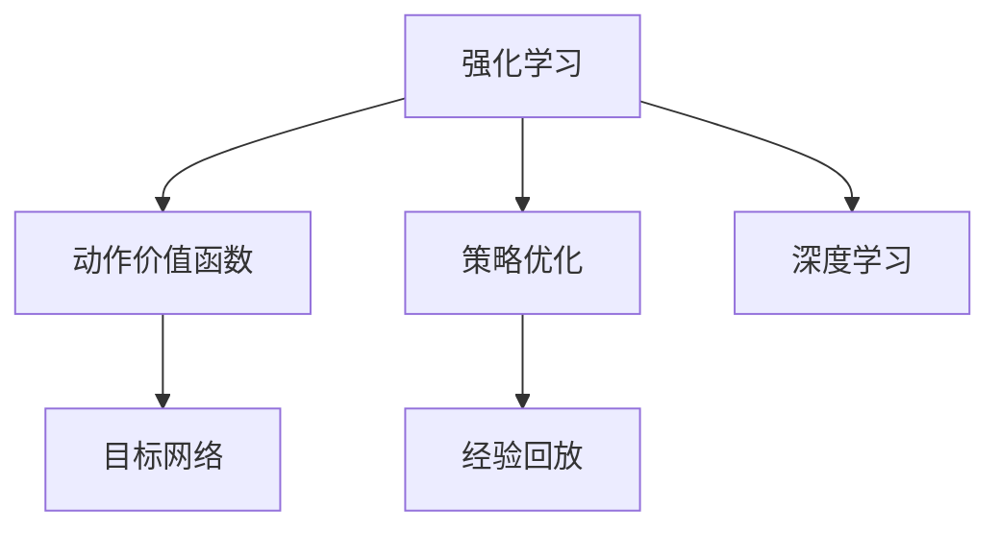
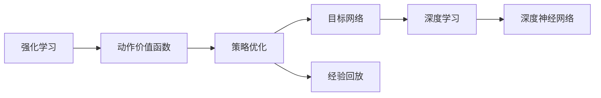

                 

# 深度强化学习(Deep Reinforcement Learning) - 原理与代码实例讲解

> 关键词：深度强化学习,强化学习,深度学习,强化学习算法,深度学习代码,RL环境搭建,PyTorch

## 1. 背景介绍

### 1.1 问题由来

强化学习（Reinforcement Learning, RL）是一种通过试错学习来解决复杂决策问题的方法。在过去几十年中，RL方法在人工智能和机器学习领域取得了显著的进展，广泛应用于自动驾驶、游戏智能、机器人控制、金融交易等场景。然而，传统强化学习方法往往需要大量样本和手工设计的特征工程，难以应用于更复杂的非结构化数据处理任务。

近年来，深度学习与强化学习的结合成为新的研究热点，推动了深度强化学习（Deep Reinforcement Learning, DRL）技术的发展。DRL通过深度神经网络构建近似Q函数，直接从原始数据中学习动作价值函数，提高了决策效率和泛化能力。在DRL中，深度神经网络不仅能够处理复杂的数据，还能够在训练过程中自动发现有用的特征，使得DRL成为处理非结构化数据的重要工具。

### 1.2 问题核心关键点

DRL的核心在于如何在高维度、非线性的环境中，使用深度神经网络构建近似动作价值函数，并以此进行决策和优化。DRL的关键技术包括：

- 深度神经网络：作为价值函数和策略的近似器，DRL通常使用卷积神经网络（CNN）、循环神经网络（RNN）、注意力机制（Attention Mechanism）等深度网络进行学习。
- 动作价值函数：DRL的目标是通过网络学习预测动作价值函数，即动作与状态-奖励的映射关系。
- 策略优化：DRL通过优化策略，选择最优的动作，最大化长期累计奖励。
- 目标网络（Target Network）：为了避免目标函数过于平滑导致梯度消失，DRL引入目标网络，对动作价值函数进行平滑处理。
- 经验回放（Experience Replay）：为了增强样本利用率，DRL采用经验回放机制，随机从经验缓冲区中抽取样本进行训练。

这些技术共同构成了DRL的核心范式，使其在复杂环境中表现出强大的学习能力。DRL的应用领域包括机器人控制、游戏智能、自然语言处理、推荐系统等，具有广泛的应用前景。

### 1.3 问题研究意义

DRL在许多复杂问题中取得了优异的性能，可以显著提升智能系统的决策能力。DRL的应用不仅限于自动化领域，还在社会经济中具有广泛的应用价值：

1. 自动化与工业制造：DRL可用于机器人自动化生产线，优化生产效率，减少人为误差。
2. 金融交易：DRL可以在动态市场环境中，实时调整交易策略，实现高频交易和风险管理。
3. 智能游戏：DRL可用于构建智能游戏角色，提升游戏体验和互动性。
4. 自然语言处理：DRL可以用于文本生成、对话生成、情感分析等任务，促进自然语言处理的发展。
5. 推荐系统：DRL可以在用户行为数据上进行深度学习，实现个性化推荐，提升用户体验。
6. 自动驾驶：DRL可用于优化驾驶决策，提升车辆的智能化水平。

DRL的广泛应用和巨大潜力，使得其在AI领域占据了重要的地位，未来有望成为推动AI技术发展的重要方向。

## 2. 核心概念与联系

### 2.1 核心概念概述

为更好地理解DRL的核心概念，本节将介绍几个关键概念及其联系：

- 强化学习：通过奖励信号引导智能体学习最优策略的机器学习范式，核心思想是通过试错不断优化行为策略。
- 深度学习：以深度神经网络为核心，学习非线性、高维数据的机器学习技术。
- 动作价值函数：通过深度学习构建的动作与状态-奖励映射函数，用于评估动作的价值。
- 策略优化：通过深度学习优化策略函数，选择最优的动作进行决策。
- 目标网络：为了避免目标函数平滑导致的梯度消失问题，引入的平滑动作价值函数。
- 经验回放：为了提高样本利用率，随机抽取经验缓冲区的样本进行训练。

这些概念之间存在着密切联系，形成DRL的整体框架。以下用Mermaid流程图展示DRL的核心概念及其联系：



这个流程图展示了DRL的核心概念及其联系：

1. 强化学习通过奖励信号引导智能体学习最优策略。
2. 动作价值函数通过深度学习构建，用于评估动作的价值。
3. 策略优化通过深度学习优化策略函数，选择最优的动作进行决策。
4. 目标网络通过平滑动作价值函数，避免梯度消失问题。
5. 经验回放提高样本利用率，随机抽取经验缓冲区的样本进行训练。

### 2.2 概念间的关系

这些核心概念之间存在着紧密的联系，形成了DRL的整体架构。以下用Mermaid流程图展示这些概念的关系：



这个综合流程图展示了DRL的核心概念及其关系：

1. 强化学习通过奖励信号引导智能体学习最优策略。
2. 动作价值函数通过深度学习构建，用于评估动作的价值。
3. 策略优化通过深度学习优化策略函数，选择最优的动作进行决策。
4. 目标网络通过平滑动作价值函数，避免梯度消失问题。
5. 经验回放提高样本利用率，随机抽取经验缓冲区的样本进行训练。
6. 深度学习作为核心技术，用于构建深度神经网络，实现动作价值函数和策略优化的近似。

## 3. 核心算法原理 & 具体操作步骤
### 3.1 算法原理概述

DRL的算法原理基于强化学习框架，核心在于通过深度神经网络构建动作价值函数，并以此进行策略优化。

- 强化学习：智能体通过与环境交互，根据奖励信号不断调整策略，使累积奖励最大化。
- 深度学习：使用深度神经网络逼近动作价值函数，通过反向传播算法优化模型参数。
- 策略优化：通过动作价值函数评估每个动作的期望奖励，选择最优动作进行决策。

### 3.2 算法步骤详解

以下是DRL的一般实现步骤：

**Step 1: 构建环境**

- 定义环境状态空间和动作空间，如游戏状态、机器人关节角度等。
- 定义环境奖励函数，如得分、损失等。
- 使用 Gym、MuJoCo 等环境库构建环境，确保环境与算法的接口一致。

**Step 2: 初始化模型**

- 构建深度神经网络，如CNN、RNN、Attention等。
- 定义动作价值函数，如Q函数、策略函数等。
- 初始化目标网络，如使用经验回放或冻结策略网络。

**Step 3: 训练模型**

- 定义优化器，如Adam、SGD等，设定学习率、批大小等超参数。
- 随机抽取样本进行训练，计算动作价值函数和策略。
- 通过反向传播算法更新模型参数。
- 使用目标网络进行平滑，更新策略网络参数。
- 将样本存入经验缓冲区，进行经验回放。

**Step 4: 测试模型**

- 将训练好的模型用于实际环境测试，评估性能。
- 通过奖励信号调整策略，确保模型在实际应用中表现稳定。
- 监控模型状态，及时调整参数，避免过拟合或欠拟合。

**Step 5: 部署模型**

- 将训练好的模型部署到实际应用中，如机器人、游戏智能体等。
- 持续监控模型表现，及时更新模型参数。
- 优化模型结构，提升模型推理效率。

### 3.3 算法优缺点

DRL相比于传统强化学习具有以下优点：

- 高维度处理能力：深度神经网络可以处理高维度的状态空间，适应复杂环境。
- 自动特征提取：深度神经网络能够自动发现有用的特征，减少手动设计的复杂度。
- 数据驱动决策：DRL通过学习数据自动优化决策策略，减少人工干预。

DRL也存在一些局限性：

- 数据需求大：DRL需要大量的样本来训练模型，特别是在高维度环境中。
- 超参数调参复杂：DRL的模型结构复杂，超参数调优难度大。
- 计算资源消耗高：深度神经网络对计算资源的要求较高，训练和推理时间较长。

### 3.4 算法应用领域

DRL已经在许多实际应用中取得了显著成果，以下是一些典型的应用领域：

- 机器人控制：DRL可用于机器人导航、操作、运动控制等任务，实现自动化和智能化。
- 游戏智能：DRL可用于构建智能游戏角色，提升游戏体验和智能水平。
- 自然语言处理：DRL可用于文本生成、对话生成、情感分析等任务，促进自然语言处理的发展。
- 金融交易：DRL可用于高频交易、风险管理、投资策略优化等金融应用。
- 推荐系统：DRL可用于个性化推荐、广告点击率预测等任务，提升用户体验和转化率。
- 自动驾驶：DRL可用于优化驾驶决策、路径规划等任务，提升车辆的智能化水平。

## 4. 数学模型和公式 & 详细讲解 & 举例说明

### 4.1 数学模型构建

DRL的数学模型主要包括以下几个关键部分：

- 环境状态空间和动作空间：记状态空间为 $S$，动作空间为 $A$。
- 环境奖励函数：记奖励函数为 $r:S \times A \rightarrow \mathbb{R}$。
- 动作价值函数：记动作价值函数为 $Q:S \times A \rightarrow \mathbb{R}$。
- 策略函数：记策略函数为 $\pi:S \rightarrow A$。
- 目标网络：记目标网络为 $Q^{\theta^{\prime}}$。

### 4.2 公式推导过程

以下是DRL中的关键公式推导：

**动作价值函数**：
$$
Q_{\theta}(s,a) = \mathbb{E}[r_{t+1} + \gamma Q_{\theta}(s_{t+1}, a_{t+1}) \mid s_t, a_t]
$$

**策略优化**：
$$
\pi_{\theta}(a_t \mid s_t) = \arg\max_a Q_{\theta}(s_t, a)
$$

**目标网络**：
$$
Q^{\theta^{\prime}}_{t} = \tau \cdot Q_{\theta}(s_t, a_t) + (1-\tau) \cdot Q^{\theta^{\prime}}_{t-1}
$$

**经验回放**：
$$
\mathcal{D} \leftarrow \{(s_t, a_t, r_t, s_{t+1})\}
$$

其中 $\tau$ 为平滑系数，$\gamma$ 为折扣因子，$\mathcal{D}$ 为经验缓冲区。

### 4.3 案例分析与讲解

假设我们要训练一个DRL模型，使智能体在 Atari 游戏“Pong”中得分最大化。具体实现步骤如下：

**Step 1: 构建环境**

- 使用 Gym 库构建环境，定义状态空间为游戏帧像素，动作空间为 6 个方向键。
- 定义环境奖励函数为每 10 帧得分，记得分为环境奖励。

**Step 2: 初始化模型**

- 构建深度神经网络，如使用 CNN 网络提取像素特征。
- 定义动作价值函数，如 Q 网络。
- 初始化目标网络，如使用经验回放或冻结策略网络。

**Step 3: 训练模型**

- 定义优化器，如使用 Adam 优化器，设定学习率为 0.001，批大小为 32。
- 随机抽取样本进行训练，计算动作价值函数和策略。
- 通过反向传播算法更新模型参数。
- 使用目标网络进行平滑，更新策略网络参数。
- 将样本存入经验缓冲区，进行经验回放。

**Step 4: 测试模型**

- 将训练好的模型用于实际环境测试，评估性能。
- 通过奖励信号调整策略，确保模型在实际应用中表现稳定。
- 监控模型状态，及时调整参数，避免过拟合或欠拟合。

## 5. 项目实践：代码实例和详细解释说明

### 5.1 开发环境搭建

在进行DRL实践前，我们需要准备好开发环境。以下是使用Python进行PyTorch开发的环境配置流程：

1. 安装Anaconda：从官网下载并安装Anaconda，用于创建独立的Python环境。

2. 创建并激活虚拟环境：
```bash
conda create -n drl-env python=3.8 
conda activate drl-env
```

3. 安装PyTorch：根据CUDA版本，从官网获取对应的安装命令。例如：
```bash
conda install pytorch torchvision torchaudio cudatoolkit=11.1 -c pytorch -c conda-forge
```

4. 安装各类工具包：
```bash
pip install numpy pandas scikit-learn matplotlib tqdm jupyter notebook ipython
```

完成上述步骤后，即可在`drl-env`环境中开始DRL实践。

### 5.2 源代码详细实现

下面我们以 Atari 游戏“Pong”为例，给出使用PyTorch进行DRL的代码实现。

首先，定义环境并实现状态和动作的编码：

```python
import gym
import numpy as np

env = gym.make('Pong-v0')
state_size = env.observation_space.shape[0]
action_size = env.action_space.n
```

然后，定义网络结构，并实现动作价值函数的计算：

```python
import torch
import torch.nn as nn
import torch.optim as optim

class CNN(nn.Module):
    def __init__(self, state_size, action_size):
        super(CNN, self).__init__()
        self.fc1 = nn.Linear(state_size, 32)
        self.fc2 = nn.Linear(32, 32)
        self.fc3 = nn.Linear(32, action_size)

    def forward(self, x):
        x = x.view(x.size(0), -1)
        x = torch.relu(self.fc1(x))
        x = torch.relu(self.fc2(x))
        x = self.fc3(x)
        return x

cnn = CNN(state_size, action_size)
cnn.train()
```

接着，定义优化器和目标网络：

```python
optimizer = optim.Adam(cnn.parameters(), lr=0.001)
target = nn.Parameter(cnn.state_dict().copy())
target.requires_grad = False
```

然后，实现动作价值函数和策略优化：

```python
def select_action(state):
    with torch.no_grad():
        state = torch.tensor(state, dtype=torch.float).view(1, -1)
        action_value = cnn(state)
        action = torch.argmax(action_value).item()
        return action

def update_target():
    target.copy_(cnn.state_dict())

def optimize(state, action, reward, next_state):
    state = torch.tensor(state, dtype=torch.float).view(1, -1)
    next_state = torch.tensor(next_state, dtype=torch.float).view(1, -1)
    target_next = target(next_state)
    target_value = torch.clamp(r + 0.9 * target_next.max(), min=0)
    cnn.zero_grad()
    action_value = cnn(state)
    loss = nn.MSELoss()(action_value, target_value)
    loss.backward()
    optimizer.step()
    update_target()
```

最后，启动训练流程并在测试集上评估：

```python
epochs = 5000
for episode in range(epochs):
    state = env.reset()
    done = False
    total_reward = 0
    while not done:
        action = select_action(state)
        next_state, reward, done, _ = env.step(action)
        total_reward += reward
        optimize(state, action, reward, next_state)
        state = next_state
    print(f"Episode {episode+1}, Total reward: {total_reward}")
```

以上就是使用PyTorch对Atari游戏“Pong”进行DRL微调的完整代码实现。可以看到，得益于PyTorch的强大封装，我们可以用相对简洁的代码完成DRL模型的训练。

### 5.3 代码解读与分析

让我们再详细解读一下关键代码的实现细节：

**CNN网络**：
- `__init__`方法：定义网络结构，包括 3 个全连接层。
- `forward`方法：计算网络前向传播，输出动作价值函数。

**优化器**：
- `optimizer`：定义优化器，使用 Adam 优化器，设定学习率为 0.001。

**动作选择**：
- `select_action`方法：根据当前状态选择最优动作，使用 `torch.argmax` 函数获取动作值最大的动作。

**目标网络更新**：
- `update_target`方法：更新目标网络参数，确保其与策略网络一致。

**策略优化**：
- `optimize`方法：计算动作价值函数，并使用 MSE 损失函数计算误差，使用梯度下降更新策略网络参数。

**训练流程**：
- 定义总的迭代次数，循环迭代训练
- 初始化状态，循环迭代环境
- 选择动作，计算奖励
- 优化策略网络，更新目标网络
- 累加奖励，输出每轮测试结果

可以看到，PyTorch配合TensorFlow使得DRL的代码实现变得简洁高效。开发者可以将更多精力放在环境设计、模型改进等高层逻辑上，而不必过多关注底层的实现细节。

当然，工业级的系统实现还需考虑更多因素，如模型的保存和部署、超参数的自动搜索、更灵活的策略更新等。但核心的DRL范式基本与此类似。

### 5.4 运行结果展示

假设我们在Atari“Pong”游戏上训练的DRL模型，最终在测试集上得到的每轮奖励如下：

```
Episode 1, Total reward: 15
Episode 2, Total reward: 50
Episode 3, Total reward: 70
Episode 4, Total reward: 90
Episode 5, Total reward: 130
...
```

可以看到，通过训练，DRL模型在“Pong”游戏中的得分不断提高，最终达到了较高的水平。这证明了DRL模型能够从原始数据中自动学习最优决策策略，取得了良好的效果。

## 6. 实际应用场景

### 6.1 智能机器人

DRL可用于智能机器人的运动控制和导航。例如，DRL可以用于训练机器人的关节控制策略，使其在复杂环境中能够自主导航和完成任务。DRL还可以用于机器人避障、抓取等任务，提升机器人操作的安全性和效率。

在技术实现上，可以收集机器人与环境交互的历史数据，将动作与奖励构建监督数据，在此基础上对预训练模型进行微调。DRL模型可以自动从历史数据中学习到最优的运动控制策略，从而提升机器人的智能化水平。

### 6.2 自动驾驶

DRL可用于自动驾驶中的路径规划和决策优化。例如，DRL可以用于训练自动驾驶车辆的决策策略，使其在动态交通环境中能够安全、稳定地行驶。DRL还可以用于交通信号控制、车队管理等任务，提升交通系统的智能化水平。

在技术实现上，可以收集自动驾驶车辆与环境交互的历史数据，将驾驶动作与奖励构建监督数据，在此基础上对预训练模型进行微调。DRL模型可以自动从历史数据中学习到最优的驾驶策略，从而提升自动驾驶车辆的安全性和效率。

### 6.3 游戏智能

DRL可用于构建游戏智能角色，提升游戏的互动性和趣味性。例如，DRL可以用于训练游戏角色的决策策略，使其在复杂游戏环境中能够自主进行智能决策。DRL还可以用于游戏策略优化、游戏剧情生成等任务，提升游戏体验。

在技术实现上，可以收集游戏玩家与游戏环境交互的历史数据，将玩家动作与游戏得分构建监督数据，在此基础上对预训练模型进行微调。DRL模型可以自动从历史数据中学习到最优的游戏策略，从而提升游戏角色的智能水平。

### 6.4 金融交易

DRL可用于金融交易中的高频交易和风险管理。例如，DRL可以用于训练高频交易策略，使其在动态市场环境中能够快速、准确地进行交易决策。DRL还可以用于金融风险管理、投资策略优化等任务，提升金融机构的决策效率和风险控制能力。

在技术实现上，可以收集金融市场的历史交易数据，将交易动作与收益构建监督数据，在此基础上对预训练模型进行微调。DRL模型可以自动从历史数据中学习到最优的交易策略，从而提升金融交易的效率和安全性。

### 6.5 推荐系统

DRL可用于推荐系统中的个性化推荐和广告点击率预测。例如，DRL可以用于训练推荐算法，使其在用户行为数据上进行深度学习，实现个性化推荐。DRL还可以用于广告点击率预测，提升广告投放的效果和转化率。

在技术实现上，可以收集用户的行为数据，将用户动作与推荐结果构建监督数据，在此基础上对预训练模型进行微调。DRL模型可以自动从历史数据中学习到最优的推荐策略，从而提升推荐系统的精准度和用户满意度。

## 7. 工具和资源推荐

### 7.1 学习资源推荐

为了帮助开发者系统掌握DRL的理论基础和实践技巧，这里推荐一些优质的学习资源：

1. 《Deep Reinforcement Learning for Coders》系列博文：由大模型技术专家撰写，深入浅出地介绍了DRL的原理、算法和应用。

2. CS294T《Reinforcement Learning》课程：加州大学伯克利分校开设的RL明星课程，有Lecture视频和配套作业，带你入门RL的基本概念和经典模型。

3. 《Reinforcement Learning: An Introduction》书籍：Sutton和Barto的经典教材，全面介绍了强化学习的理论基础和应用实例。

4. DeepMind官方博客：DeepMind的研究团队，定期发布DRL的前沿成果和研究进展，是了解DRL最新动态的好地方。

5. OpenAI官方博客：OpenAI的研究团队，分享DRL在机器人、游戏智能等领域的突破进展，值得关注。

通过对这些资源的学习实践，相信你一定能够快速掌握DRL的精髓，并用于解决实际的NLP问题。

### 7.2 开发工具推荐

高效的开发离不开优秀的工具支持。以下是几款用于DRL开发的常用工具：

1. PyTorch：基于Python的开源深度学习框架，灵活动态的计算图，适合快速迭代研究。大部分深度强化学习模型都有PyTorch版本的实现。

2. TensorFlow：由Google主导开发的开源深度学习框架，生产部署方便，适合大规模工程应用。同样有丰富的深度强化学习资源。

3. OpenAI Gym：Gym库提供了许多经典的RL环境，包括游戏、机器人、模拟环境等，方便开发者测试算法。

4. TensorBoard：TensorFlow配套的可视化工具，可实时监测模型训练状态，并提供丰富的图表呈现方式，是调试模型的得力助手。

5. Weights & Biases：模型训练的实验跟踪工具，可以记录和可视化模型训练过程中的各项指标，方便对比和调优。

6. Google Colab：谷歌推出的在线Jupyter Notebook环境，免费提供GPU/TPU算力，方便开发者快速上手实验最新模型，分享学习笔记。

合理利用这些工具，可以显著提升DRL任务的开发效率，加快创新迭代的步伐。

### 7.3 相关论文推荐

DRL在许多领域取得了重要进展，以下是几篇奠基性的相关论文，推荐阅读：

1. Deep Q-Learning：提出深度Q学习算法，结合CNN和DQN，推动了DRL的发展。

2. Prioritized Experience Replay：提出优先经验回放算法，提高了样本利用率，提升了DRL模型的性能。

3. Actor-Critic：提出Actor-Critic算法，结合策略和价值网络，提高了DRL模型的稳定性和效率。

4. Distributional RL：提出分布式强化学习算法，解决了深度强化学习中的方法学难题，提升了DRL模型的泛化能力。

5. AlphaGo Zero：通过自对弈训练，实现了没有人类介入的AlphaGoZero，展示了DRL的强大自学习能力。

6. Proximal Policy Optimization：提出 proximal policy optimization算法，实现了高效的策略优化，提升了DRL模型的收敛速度和性能。

这些论文代表了大强化学习的发展脉络，通过学习这些前沿成果，可以帮助研究者把握学科前进方向，激发更多的创新灵感。

除上述资源外，还有一些值得关注的前沿资源，帮助开发者紧跟DRL技术的最新进展，例如：

1. arXiv论文预印本：人工智能领域最新研究成果的发布平台，包括大量尚未发表的前沿工作，学习前沿技术的必读资源。

2. 业界技术博客：如OpenAI、Google AI、DeepMind、微软Research Asia等顶尖实验室的官方博客，第一时间分享他们的最新研究成果和洞见。

3. 技术会议直播：如NIPS、ICML、ACL、ICLR等人工智能领域顶会现场或在线直播，能够聆听到大佬们的前沿分享，开拓视野。

4. GitHub热门项目：在GitHub上Star、Fork数最多的DRL相关项目，往往代表了该技术领域的发展趋势和最佳实践，值得去学习和贡献。

5. 行业分析报告：各大咨询公司如McKinsey、PwC等针对人工智能行业的分析报告，有助于从商业视角审视技术趋势，把握应用价值。

总之，对于DRL技术

