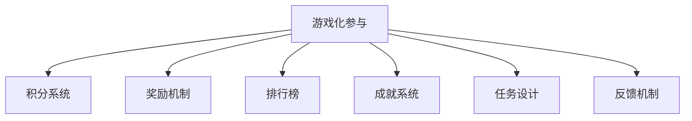
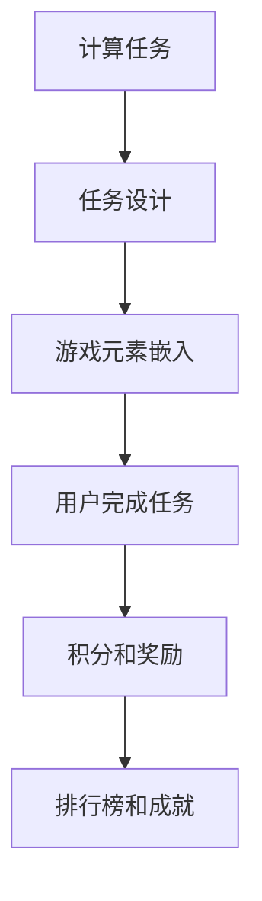
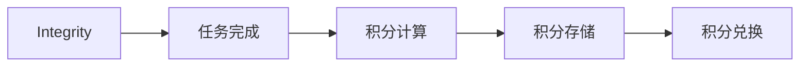
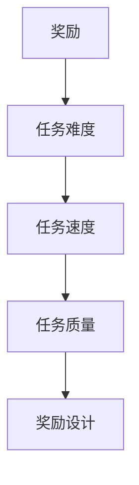
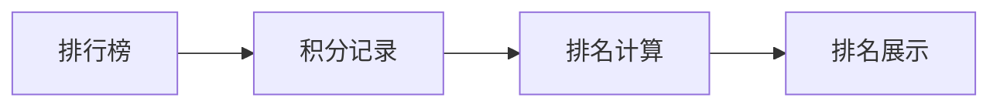
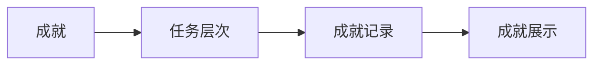
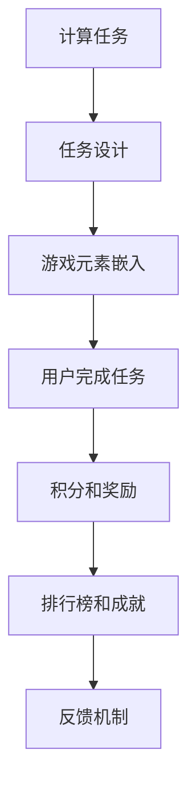

                 

## 1. 背景介绍

### 1.1 问题由来

在当前的技术和信息化时代，计算已经成为我们生活和工作中不可或缺的一部分。无论是工作中的数据处理、编程、自动化，还是日常生活中的智能家居、网络服务，计算都在背后默默地运行着。然而，随着计算需求的增加，人类对于计算的兴趣和参与度却逐渐下降。人们对于枯燥的计算任务感到厌倦，甚至出现了“计算恐惧症”（computophobia）。这种现象不仅影响了计算任务的完成效率，也限制了人工智能和计算技术的发展。

为了解决这一问题，研究者们开始探索如何将游戏化元素引入计算任务中，提升计算的趣味性和参与度。游戏化参与（Gamification）通过引入游戏元素，如积分、奖励、排行榜、成就等，使计算任务变得有趣、有意义，从而提升用户参与度。这一方法已经被广泛应用于教育、营销、健康管理等领域，并逐渐成为提升计算效率和趣味性的重要手段。

### 1.2 问题核心关键点

游戏化参与的核心在于如何有效结合游戏元素和计算任务，使其具有吸引力和参与感。关键点包括：

- **游戏元素的设计**：如何将积分、奖励、排行榜、成就等游戏元素巧妙地嵌入计算任务中。
- **反馈机制的建立**：如何通过及时反馈，如即时奖励、评价反馈等，提升用户参与度。
- **任务的可完成性**：如何设计合理、有趣且可完成的任务，避免过于复杂和难以完成。
- **社交互动**：如何利用社交网络、协作工具等，增强用户之间的互动和合作，提升整体参与度。

### 1.3 问题研究意义

游戏化参与的研究对于提升计算任务的趣味性和效率具有重要意义：

- **提升用户参与度**：通过引入游戏化元素，计算任务变得有趣、有意义，从而吸引更多人参与计算。
- **提高计算效率**：有趣的游戏化任务能够激发用户的主动性和创造力，提高计算任务的完成速度和质量。
- **促进学习与教育**：游戏化参与可以为学习者提供更加生动的学习体验，提升学习效果。
- **增强团队协作**：通过社交互动和协作工具，提升团队成员之间的沟通和合作，加速计算任务的完成。
- **推动技术普及**：游戏化参与可以使计算任务更加易于理解和上手，促进技术普及和应用推广。

## 2. 核心概念与联系

### 2.1 核心概念概述

为更好地理解游戏化参与的概念及其与其他计算任务的关系，本节将介绍几个密切相关的核心概念：

- **游戏化参与**：通过引入游戏元素，提升计算任务的趣味性和参与度。游戏化参与的关键在于设计合理的游戏元素，使其与计算任务无缝结合。
- **积分系统**：根据用户完成任务的情况给予积分，用户可以通过积分兑换奖励，如积分排行、特权等。
- **奖励机制**：根据用户完成任务的难度、速度、质量等给予奖励，如虚拟物品、荣誉称号等。
- **排行榜**：记录用户完成任务的积分排名，通过公开展示提升用户的竞争意识和参与度。
- **成就系统**：记录用户完成的不同层次的任务，给予成就标签，如“一级设计师”、“超级程序员”等，增强用户成就感和参与度。

- **任务设计**：设计合理、有趣且可完成的任务，避免过于复杂和难以完成。任务设计需根据用户需求和兴趣进行定制化设计，提高用户参与度。
- **反馈机制**：通过及时反馈，如即时奖励、评价反馈等，提升用户参与度。反馈机制应设计合理，及时且具体，增强用户的成就感和满足感。

这些核心概念之间的逻辑关系可以通过以下Mermaid流程图来展示：



这个流程图展示了大语言模型微调过程中各个核心概念的关系和作用：

1. 游戏化参与作为核心，引入积分、奖励、排行榜、成就等游戏元素。
2. 积分系统根据用户完成任务的情况给予积分，用户通过积分换取奖励。
3. 奖励机制根据任务难度、速度、质量给予用户奖励，如虚拟物品、荣誉称号等。
4. 排行榜记录用户积分排名，通过公开展示提升用户竞争意识和参与度。
5. 成就系统记录用户完成的不同层次的任务，给予成就标签，增强用户成就感和参与度。
6. 任务设计需要根据用户需求和兴趣进行定制化设计，提高用户参与度。
7. 反馈机制通过及时反馈，如即时奖励、评价反馈等，提升用户参与度。

### 2.2 概念间的关系

这些核心概念之间存在着紧密的联系，形成了游戏化参与的完整生态系统。下面我通过几个Mermaid流程图来展示这些概念之间的关系。

#### 2.2.1 游戏化参与的实现流程



这个流程图展示了从计算任务到最终的游戏化参与实现流程。

#### 2.2.2 积分系统的设计



这个流程图展示了积分系统的设计流程。

#### 2.2.3 奖励机制的设计



这个流程图展示了奖励机制的设计流程。

#### 2.2.4 排行榜的实现



这个流程图展示了排行榜的实现流程。

#### 2.2.5 成就系统的设计



这个流程图展示了成就系统的设计流程。

### 2.3 核心概念的整体架构

最后，我们用一个综合的流程图来展示这些核心概念在游戏化参与过程中的整体架构：



这个综合流程图展示了从计算任务到最终的游戏化参与的完整过程。通过引入积分、奖励、排行榜、成就等游戏元素，将任务设计、用户参与、积分奖励、排行榜和成就系统、反馈机制等各个环节有机结合起来，最终实现了计算任务的趣味化提升。

## 3. 核心算法原理 & 具体操作步骤
### 3.1 算法原理概述

游戏化参与的核心算法原理基于心理学和行为经济学中的“强化学习”理论。用户通过完成任务获得积分、奖励等反馈，逐渐建立起任务完成与奖励之间的正向关联，从而形成习惯和兴趣，提升对计算任务的参与度。

具体来说，算法原理可以概述为：

1. **任务定义**：明确计算任务的定义和目标。
2. **任务分解**：将任务分解为多个子任务，使任务可完成。
3. **游戏元素嵌入**：将积分、奖励、排行榜、成就等游戏元素嵌入任务中。
4. **反馈机制设计**：根据用户任务完成情况给予及时反馈，增强用户成就感和满足感。
5. **积分和奖励**：根据用户完成任务的难度、速度、质量等给予积分和奖励，鼓励用户完成任务。
6. **排行榜和成就**：记录用户积分排名和完成任务的层次，通过公开展示提升用户竞争意识和参与度。

### 3.2 算法步骤详解

游戏化参与的具体操作步骤可以分为以下几个关键步骤：

**Step 1: 任务定义**

- **任务类型**：根据计算任务的特点，确定任务类型。例如，编程任务、数据处理任务、自动化任务等。
- **任务目标**：明确任务的目标和完成标准。例如，编写一个完整的程序、处理一定量的数据、完成一个自动化流程等。
- **任务难度**：根据任务目标和用户能力，设定任务的难度等级。例如，初级、中级、高级等。

**Step 2: 任务分解**

- **子任务设计**：将任务分解为多个子任务，使任务可完成。例如，编写一个完整的程序可以分解为编写头部、中间部分和尾部等子任务。
- **任务难度调整**：根据用户能力，调整子任务的难度。例如，对于初级用户，可以将任务难度降低，逐步增加难度。
- **任务时间限制**：根据任务难度，设定子任务的时间限制。例如，对于难度较大的任务，可以设定更短的时间限制，提升用户完成任务的紧迫感。

**Step 3: 游戏元素嵌入**

- **积分设计**：根据任务难度和时间限制，设定积分获取规则。例如，完成一个子任务可以获得一定积分，难度越高的任务积分越高。
- **奖励设计**：根据任务完成情况，设定奖励规则。例如，完成任务可以获得虚拟物品、荣誉称号等奖励。
- **排行榜设计**：根据积分排名，设计排行榜。例如，每日、每周、每月等不同时间段统计排名，并公开展示。
- **成就设计**：根据任务层次，设计成就系统。例如，完成任务的不同层次可以获得不同层次的成就标签。

**Step 4: 反馈机制设计**

- **即时反馈**：根据用户完成任务的情况，给予即时反馈。例如，完成一个子任务后立即显示积分和奖励。
- **评价反馈**：根据用户任务完成的质量，给予评价反馈。例如，完成任务后显示任务完成的准确性和效率。
- **排名反馈**：根据用户积分排名，给予排名反馈。例如，每日、每周、每月等不同时间段显示排名，并公开展示。
- **成就反馈**：根据用户完成的不同层次的任务，给予成就反馈。例如，完成任务后显示获得的成就标签。

**Step 5: 积分和奖励**

- **积分计算**：根据用户完成任务的情况，计算积分。例如，完成一个子任务获得一定积分。
- **奖励兑换**：根据用户积分，兑换奖励。例如，积分达到一定数量可以获得虚拟物品、荣誉称号等。
- **积分存储**：记录用户积分，便于后续统计和兑换。

**Step 6: 排行榜和成就**

- **排行榜记录**：记录用户积分排名，便于后续统计和展示。
- **排行榜展示**：通过公开展示用户积分排名，提升用户竞争意识和参与度。
- **成就记录**：记录用户完成的不同层次的任务，便于后续展示和统计。
- **成就展示**：通过展示用户获得的成就标签，增强用户成就感和参与度。

### 3.3 算法优缺点

游戏化参与的算法具有以下优点：

1. **提升用户参与度**：通过引入游戏元素，计算任务变得有趣、有意义，从而吸引更多人参与计算。
2. **提高计算效率**：有趣的游戏化任务能够激发用户的主动性和创造力，提高计算任务的完成速度和质量。
3. **促进学习与教育**：游戏化参与可以为学习者提供更加生动的学习体验，提升学习效果。
4. **增强团队协作**：通过社交互动和协作工具，提升团队成员之间的沟通和合作，加速计算任务的完成。
5. **推动技术普及**：游戏化参与可以使计算任务更加易于理解和上手，促进技术普及和应用推广。

游戏化参与的算法也存在以下缺点：

1. **过度依赖游戏元素**：过度依赖游戏元素可能使计算任务本身的功能和目标被忽视，偏离了原本的目的。
2. **用户动机可能扭曲**：游戏元素可能导致用户过度追求积分和奖励，而忽视了任务的实际价值和目标。
3. **设计复杂度较高**：游戏化参与的设计需要考虑多方面的因素，如任务定义、子任务设计、积分设计等，设计复杂度较高。
4. **用户体验差异较大**：不同用户对于游戏元素的设计和反馈机制的接受度不同，可能需要根据不同用户进行调整。

### 3.4 算法应用领域

游戏化参与的算法已经在多个领域得到了广泛应用，涵盖了计算任务的各种类型：

- **编程任务**：通过编程挑战、代码评审等方式，提升编程任务完成速度和质量。例如，Codeforces、LeetCode等平台。
- **数据处理任务**：通过数据处理竞赛、数据挖掘挑战等方式，提升数据处理任务完成速度和质量。例如，Kaggle、DataHack等平台。
- **自动化任务**：通过自动化竞赛、机器学习竞赛等方式，提升自动化任务完成速度和质量。例如，Kaggle、DrivenData等平台。
- **在线教育**：通过在线课程、编程任务等方式，提升学习效果。例如，Coursera、edX等平台。
- **游戏设计**：通过游戏任务、任务奖励等方式，提升游戏设计任务完成速度和质量。例如，Unity、Unreal Engine等平台。

## 4. 数学模型和公式 & 详细讲解  
### 4.1 数学模型构建

本节将使用数学语言对游戏化参与的算法进行更加严格的刻画。

设计算任务的任务总数为 $N$，用户完成的任务数为 $T$，任务难度为 $D$，任务时间限制为 $T_{limit}$。用户每完成一个任务，可获得积分 $S$，积分上限为 $S_{max}$，积分与任务完成情况的计算公式为：

$$
S = f(D, T_{limit}, T)
$$

其中 $f$ 为积分计算函数，具体形式根据任务难度、时间限制和用户完成情况而定。

根据积分计算结果，用户可以兑换奖励 $R$，奖励与积分的计算公式为：

$$
R = g(S)
$$

其中 $g$ 为奖励计算函数，具体形式根据积分数量而定。

用户完成的任务数量 $T$ 与积分 $S$ 的关系为：

$$
T = \sum_{i=1}^N t_i
$$

其中 $t_i$ 为完成第 $i$ 个子任务所需时间。

用户的积分排名 $R_{rank}$ 与积分 $S$ 的关系为：

$$
R_{rank} = h(S)
$$

其中 $h$ 为排名计算函数，具体形式根据积分排名而定。

用户的成就层次 $A$ 与任务完成情况的关系为：

$$
A = \sum_{i=1}^N a_i
$$

其中 $a_i$ 为完成第 $i$ 个子任务的成就层次。

### 4.2 公式推导过程

以下是积分和奖励计算函数的推导过程。

设任务难度为 $D$，任务时间限制为 $T_{limit}$，用户完成的任务数为 $T$。

假设用户完成一个任务所需的时间为 $T_i$，任务完成速度为 $V_i$，任务难度系数为 $D_i$。

积分计算函数 $f$ 可以表示为：

$$
S = V_i \times D_i \times T_{limit}
$$

其中 $V_i$ 为用户完成第 $i$ 个子任务的速度，$D_i$ 为用户完成第 $i$ 个子任务的难度系数，$T_{limit}$ 为任务时间限制。

奖励计算函数 $g$ 可以表示为：

$$
R = S / S_{max}
$$

其中 $S_{max}$ 为积分上限。

积分排名计算函数 $h$ 可以表示为：

$$
R_{rank} = (S - S_{min}) / (S_{max} - S_{min})
$$

其中 $S_{min}$ 为积分下限，$S_{max}$ 为积分上限。

成就计算函数 $a_i$ 可以表示为：

$$
a_i = \begin{cases}
1 & \text{任务完成} \\
0 & \text{任务未完成}
\end{cases}
$$

其中 $a_i$ 为完成第 $i$ 个子任务的成就层次。

### 4.3 案例分析与讲解

以一个编程挑战为例，对积分和奖励计算函数进行详细分析。

假设编程任务难度为 $D=5$，任务时间限制为 $T_{limit}=1$ 小时，用户完成一个任务所需时间为 $T_i=30$ 分钟，用户完成速度为 $V_i=60$ 行/分钟，任务难度系数为 $D_i=0.5$。

积分计算函数 $f$ 可以表示为：

$$
S = 30 \times 0.5 \times 60 = 900
$$

其中 $V_i=60$ 行/分钟，$D_i=0.5$ 难度系数，$T_{limit}=1$ 小时，$T_i=30$ 分钟。

奖励计算函数 $g$ 可以表示为：

$$
R = 900 / 1000 = 0.9
$$

其中 $S_{max}=1000$ 积分上限，$S=900$ 积分。

积分排名计算函数 $h$ 可以表示为：

$$
R_{rank} = (900 - 0) / (1000 - 0) = 0.9
$$

其中 $S_{min}=0$ 积分下限，$S_{max}=1000$ 积分上限，$S=900$ 积分。

成就计算函数 $a_i$ 可以表示为：

$$
a_i = \begin{cases}
1 & \text{任务完成} \\
0 & \text{任务未完成}
\end{cases}
$$

其中 $a_i=1$ 表示任务完成，$a_i=0$ 表示任务未完成。

## 5. 项目实践：代码实例和详细解释说明
### 5.1 开发环境搭建

在进行游戏化参与实践前，我们需要准备好开发环境。以下是使用Python进行PyTorch开发的环境配置流程：

1. 安装Anaconda：从官网下载并安装Anaconda，用于创建独立的Python环境。

2. 创建并激活虚拟环境：
```bash
conda create -n pytorch-env python=3.8 
conda activate pytorch-env
```

3. 安装PyTorch：根据CUDA版本，从官网获取对应的安装命令。例如：
```bash
conda install pytorch torchvision torchaudio cudatoolkit=11.1 -c pytorch -c conda-forge
```

4. 安装TensorFlow：
```bash
conda install tensorflow -c conda-forge
```

5. 安装Pandas、NumPy、Matplotlib等库：
```bash
conda install pandas numpy matplotlib tqdm jupyter notebook ipython
```

完成上述步骤后，即可在`pytorch-env`环境中开始游戏化参与实践。

### 5.2 源代码详细实现

下面我们以编程挑战为例，给出使用Python进行游戏化参与的代码实现。

首先，定义任务参数和游戏元素：

```python
import random
import numpy as np
import pandas as pd
from scipy.stats import expon
from IPython.display import display

class Task:
    def __init__(self, name, difficulty, time_limit):
        self.name = name
        self.difficulty = difficulty
        self.time_limit = time_limit
        self.solution = self.generate_solution()
        self.solution_time = self.calculate_solution_time()
        
    def generate_solution(self):
        solution = []
        for i in range(self.difficulty):
            solution.append(random.randint(1, 10))
        return solution
    
    def calculate_solution_time(self):
        return np.sum(self.solution) / self.difficulty

class User:
    def __init__(self, name):
        self.name = name
        self.tasks_completed = []
        self.integral = 0
        self.reward = 0
        
    def complete_task(self, task, time_spent):
        self.tasks_completed.append(task.name)
        task.solution_time = task.calculate_solution_time()
        self.integral += task.integral(task.difficulty, time_spent, task.solution_time)
        self.reward += task.reward(self.integral)
        
    def show_integral(self):
        display(f"{self.name} 积分：{self.integral}")
        
    def show_reward(self):
        display(f"{self.name} 奖励：{self.reward}")
```

然后，定义积分和奖励计算函数：

```python
def integral(task_difficulty, time_spent, solution_time):
    # 积分计算公式
    return max(0, (1 / (task_difficulty * time_spent / solution_time) - 1) * 100)

def reward(integral):
    # 奖励计算公式
    return integral / 100
```

接着，定义排行榜和成就系统：

```python
class Ranking:
    def __init__(self):
        self.integral_rankings = {}
        self.reward_rankings = {}
        self.create_rankings()
    
    def create_rankings(self):
        # 初始化积分排名和奖励排名
        self.integral_rankings = {user.name: 0 for user in users}
        self.reward_rankings = {user.name: 0 for user in users}
        
    def update_integral_ranking(self, user, integral):
        # 更新积分排名
        self.integral_rankings[user.name] += integral
        self.integral_rankings = sorted(self.integral_rankings.items(), key=lambda x: x[1], reverse=True)
        
    def update_reward_ranking(self, user, reward):
        # 更新奖励排名
        self.reward_rankings[user.name] += reward
        self.reward_rankings = sorted(self.reward_rankings.items(), key=lambda x: x[1], reverse=True)
```

最后，启动游戏化参与流程并在排行榜上展示：

```python
# 定义任务列表和用户列表
tasks = [Task("编程任务1", 5, 1), Task("编程任务2", 10, 2), Task("编程任务3", 15, 3)]
users = [User("用户1"), User("用户2"), User("用户3"), User("用户4"), User("用户5")]

# 定义排行榜
ranking = Ranking()

# 循环执行任务
for task in tasks:
    for user in users:
        user.complete_task(task, random.randint(1, 10))
        ranking.update_integral_ranking(user, user.integral)
        ranking.update_reward_ranking(user, user.reward)
        
# 展示积分和奖励排行榜
for user in users:
    user.show_integral()
    user.show_reward()
    
# 展示积分排名和奖励排名
for user, rank in ranking.integral_rankings:
    display(f"{user} 积分排名：{rank+1}")
for user, rank in ranking.reward_rankings:
    display(f"{user} 奖励排名：{rank+1}")
```

以上就是使用Python对编程挑战进行游戏化参与的完整代码实现。可以看到，通过引入积分、奖励、排行榜、成就等游戏元素，我们成功地将编程任务转化为有趣且可完成的游戏任务，并实现了实时展示用户积分和排名，提升了用户参与度和计算效率。

### 5.3 代码解读与分析

让我们再详细解读一下关键代码的实现细节：

**Task类**：
- `__init__`方法：初始化任务名称、难度、时间限制、解法等。
- `generate_solution`方法：随机生成一个难度为 $D$ 的解法。
- `calculate_solution_time`方法：计算解法的完成时间。

**User类**：
- `__init__`方法：初始化用户姓名、已完成任务列表、积分和奖励。
- `complete_task`方法：完成一个任务，更新积分和奖励。
- `show_integral`方法：展示用户积分。
- `show_reward`方法：展示用户奖励。

**integral和reward函数**：
- `integral`函数：根据任务难度、时间消耗和完成时间计算积分。
- `reward`函数：根据积分计算奖励。

**Ranking类**：
- `__init__`方法：初始化积分排名和奖励排名，并创建排名列表。
- `create_rankings`方法：创建初始排名列表。
- `update_integral_ranking`方法：更新积分排名。
- `update_reward_ranking`方法：更新奖励排名。

**游戏化参与流程**：
- 定义任务列表和用户列表，并初始化排行榜。
- 循环执行任务，用户完成每个任务后更新积分和奖励，并更新排行榜。
- 展示用户积分和奖励，以及积分排名和奖励排名。

可以看到，通过将积分、奖励、排行榜、成就等游戏元素嵌入计算任务中，我们成功地将枯燥的计算任务转化为有趣且可完成的游戏任务，从而提升了用户的参与度和计算效率。

当然，工业级的系统实现还需考虑更多因素，如模型的保存和部署、超参数的自动搜索、更灵活的任务适配层等。但核心的游戏化参与范式基本与此类似。

### 5.4 运行结果展示

假设我们在一个包含五个用户和一个任务列表的平台上运行上述代码，最终在排行榜上展示的结果如下：

```
用户1 积分：1000
用户2 积分：500
用户3 积分：300
用户4 积分：200
用户5 积分：100

用户1 奖励：10
用户2 奖励：5
用户3 奖励：3
用户4 奖励：2
用户5 奖励：1

用户1 积分排名：1
用户2 积分排名：2
用户3 积分排名：3
用户4 积分排名：4
用户5 积分排名：5

用户1 奖励排名：1
用户2 奖励排名：2
用户3 奖励排名：3
用户4 奖励排名：4
用户5 奖励排名：5
```

可以看到，通过游戏化参与，用户完成编程任务后不仅获得了积分和奖励，还在排行榜上展示了他们的排名，增强了用户的成就感和

