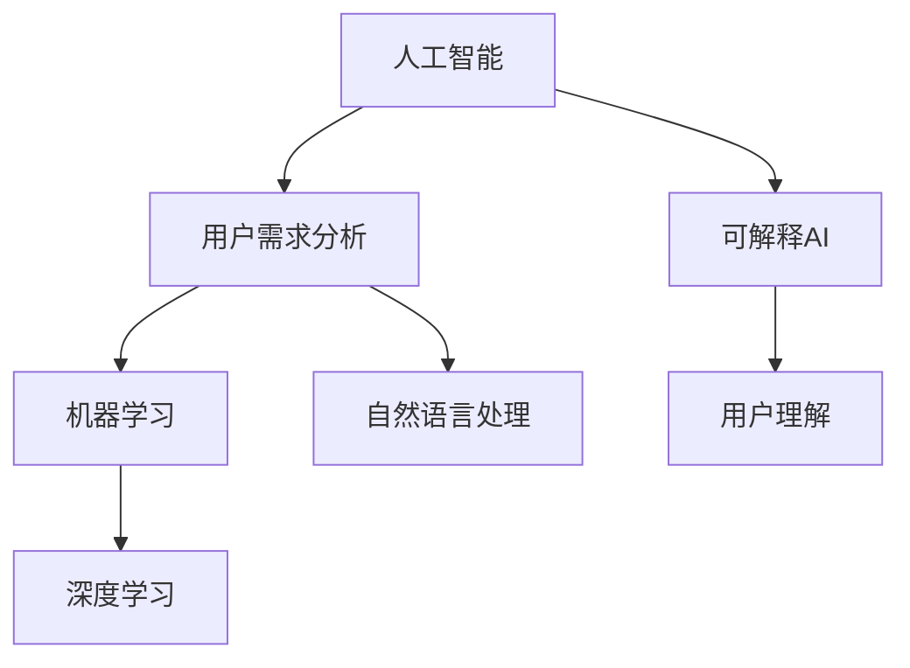

                 

## 1. 背景介绍

在当前数字化时代，人工智能（AI）技术正以前所未有的速度和深度影响着各行各业，从自动驾驶到智能客服，从健康医疗到金融服务，AI的应用无所不在。然而，AI的普及并非一帆风顺，如何让用户真正从中受益，满足他们的需求，是一个复杂且多层次的问题。本文将深入探讨如何制定AI策略，以确保AI技术不仅能够创新和优化流程，还能解决用户问题，提升用户体验。

### 1.1 问题由来

随着AI技术的迅猛发展，企业和服务提供商开始大量引入AI解决方案。尽管AI在提升效率、降低成本、改善客户体验等方面展示了巨大的潜力，但实践中仍面临诸多挑战。用户需求的多样性、数据隐私和安全的担忧、AI技术的复杂性等，都是必须认真对待的问题。用户需求的不明确和多样性使得AI系统的设计和实施变得更加复杂。

### 1.2 问题核心关键点

1. **用户需求的多样性与复杂性**：用户的真实需求是多样的，且往往难以准确描述。AI系统必须能够从大量复杂的数据中提取并理解这些需求。
2. **数据隐私与安全**：AI系统的训练依赖大量数据，如何确保数据的安全和隐私保护是关键问题。
3. **模型的透明性与可解释性**：用户希望理解AI系统的决策过程，确保系统的透明度和可解释性。
4. **技术与业务结合**：AI技术需要紧密结合具体业务，以实现真正的价值。
5. **持续优化与维护**：AI系统需要不断更新和优化，以适应环境变化和用户需求的变化。

### 1.3 问题研究意义

研究和制定满足用户需求的AI策略，对于提升AI技术的接受度和普及度，推动企业创新，以及构建可持续的用户体验具有重要意义：

1. **提升用户满意度**：通过深入理解用户需求，AI系统可以提供更加个性化和贴合的服务。
2. **增强竞争力**：满足用户需求的AI策略可以帮助企业脱颖而出，获得市场优势。
3. **降低成本与提升效率**：AI策略可以优化资源配置，提升服务质量，从而降低成本，提升效率。
4. **数据隐私保护**：合理的数据管理策略可以增强用户对AI系统的信任。
5. **促进合规性**：制定透明的AI策略有助于符合法律法规要求，避免法律风险。

## 2. 核心概念与联系

### 2.1 核心概念概述

为了更好地理解和制定满足用户需求的AI策略，我们需要深入理解几个关键概念：

- **人工智能（AI）**：一种利用算法和计算技术，使计算机系统具有智能行为的能力。
- **用户需求分析（User Requirement Analysis, URA）**：通过调查、访谈等方式，了解用户需求的过程。
- **机器学习（Machine Learning, ML）**：一种通过数据驱动的算法，使计算机系统能够自动学习、改进和优化。
- **自然语言处理（Natural Language Processing, NLP）**：一种使计算机系统能够理解和生成自然语言的技术。
- **深度学习（Deep Learning, DL）**：一种利用多层神经网络进行数据表示和模型训练的机器学习方法。
- **可解释AI（Explainable AI, XAI）**：使AI系统的决策过程透明、可理解的技术。

### 2.2 概念间的关系

这些核心概念通过以下Mermaid流程图展示它们之间的关系：



该流程图展示了AI技术如何通过用户需求分析来制定合适的策略，并通过机器学习、自然语言处理和深度学习等技术实现，最终通过可解释AI提升用户理解。

## 3. 核心算法原理 & 具体操作步骤

### 3.1 算法原理概述

满足用户需求的AI策略通常包括以下几个关键步骤：

1. **用户需求分析**：通过调查和访谈等方法，全面了解用户需求和痛点。
2. **数据收集与处理**：收集用户数据，进行数据清洗和预处理，为模型训练提供数据支持。
3. **模型训练与优化**：选择合适的模型，进行训练和优化，确保模型能够准确理解和满足用户需求。
4. **部署与监控**：将训练好的模型部署到实际环境中，并持续监控其性能，根据用户反馈进行调整。
5. **用户反馈与迭代优化**：收集用户反馈，进行模型迭代优化，确保其持续满足用户需求。

### 3.2 算法步骤详解

以下是详细的操作步骤：

**Step 1: 用户需求分析**
- 通过问卷调查、访谈、焦点小组等方式收集用户反馈。
- 整理和分析用户反馈，提取关键需求和痛点。
- 定义用户需求框架，明确需求优先级和实现目标。

**Step 2: 数据收集与处理**
- 根据需求框架，收集用户数据，包括行为数据、文本数据、图像数据等。
- 进行数据清洗和预处理，确保数据质量。
- 进行数据标注，为模型训练提供标签数据。

**Step 3: 模型训练与优化**
- 选择适合需求分析的模型，如分类模型、回归模型、序列模型等。
- 使用收集到的数据进行模型训练，调整超参数，优化模型性能。
- 进行交叉验证，评估模型在不同数据集上的表现。

**Step 4: 部署与监控**
- 将训练好的模型部署到实际应用场景中，如智能客服、健康诊断等。
- 实时监控模型性能，记录关键指标如准确率、召回率、响应时间等。
- 根据监控结果进行模型调整和优化。

**Step 5: 用户反馈与迭代优化**
- 收集用户使用反馈，分析模型的实际效果。
- 根据反馈结果进行模型迭代优化，确保其持续满足用户需求。
- 不断更新用户需求，进行新的模型训练和优化。

### 3.3 算法优缺点

**优点**：
- **高效**：通过自动化模型训练和优化，提升效率。
- **灵活**：根据用户反馈，灵活调整模型，提升适应性。
- **可扩展**：适应不同场景和需求，具有广泛的适用性。

**缺点**：
- **复杂性高**：涉及多个技术环节，需要多学科协作。
- **数据依赖性强**：依赖高质量的数据，数据处理成本高。
- **需要持续投入**：持续收集用户反馈，进行模型迭代和优化。

### 3.4 算法应用领域

满足用户需求的AI策略在多个领域都有广泛的应用：

- **智能客服**：通过分析用户反馈，优化客服机器人，提供更加个性化和贴心的服务。
- **健康诊断**：通过分析患者的症状和历史数据，辅助医生进行诊断和治疗。
- **金融风控**：通过分析用户的交易行为和信用记录，进行风险评估和信用评分。
- **推荐系统**：通过分析用户的兴趣和行为，推荐个性化商品和服务。
- **智能驾驶**：通过分析用户驾驶习惯和环境数据，优化驾驶决策，提高安全性和舒适性。

## 4. 数学模型和公式 & 详细讲解

### 4.1 数学模型构建

我们以智能客服为例，构建一个简单的数学模型：

设用户输入为 $x$，用户需求为 $y$，模型为 $M_{\theta}$，其中 $\theta$ 为模型参数。模型训练的目标是最小化预测误差，即：

$$
\min_{\theta} \frac{1}{N}\sum_{i=1}^{N} ||M_{\theta}(x_i) - y_i||^2
$$

### 4.2 公式推导过程

假设我们使用的是线性回归模型，那么模型的预测输出为：

$$
M_{\theta}(x) = \theta_0 + \theta_1 x_1 + \theta_2 x_2 + ... + \theta_n x_n
$$

其中 $x_1, x_2, ..., x_n$ 为输入特征，$\theta_0, \theta_1, \theta_2, ..., \theta_n$ 为模型参数。

将模型输出与用户需求进行比较，我们得到误差平方和：

$$
\frac{1}{N}\sum_{i=1}^{N} (M_{\theta}(x_i) - y_i)^2
$$

利用最小二乘法，求解上述误差平方和的最小值，即可得到模型的最优参数 $\theta$。

### 4.3 案例分析与讲解

假设我们有一个智能客服系统，用户输入为客户的姓名和问题，系统输出为最合适的客服人员和应答策略。我们将用户输入表示为一个向量 $x = [姓名, 问题]$，系统输出的策略表示为 $y = [客服编号, 应答策略]$。我们可以使用上述线性回归模型进行训练，使得模型能够预测最合适的客服人员和应答策略。

## 5. 项目实践：代码实例和详细解释说明

### 5.1 开发环境搭建

开发环境搭建包括安装必要的软件和工具，以下是具体步骤：

1. **Python环境安装**：安装Python 3.8及以上版本，建议使用Anaconda。
2. **虚拟环境创建**：使用Conda创建虚拟环境，如 `conda create -n ai-env python=3.8`。
3. **必要库安装**：安装常用的AI开发库，如TensorFlow、Keras、Pandas等。

### 5.2 源代码详细实现

以下是一个简单的智能客服系统的代码实现：

```python
import pandas as pd
from sklearn.linear_model import LinearRegression
from sklearn.model_selection import train_test_split

# 数据读取和预处理
data = pd.read_csv('customer_service_data.csv')
X = data[['姓名', '问题']]
y = data[['客服编号', '应答策略']]
X_train, X_test, y_train, y_test = train_test_split(X, y, test_size=0.2, random_state=42)

# 模型训练
model = LinearRegression()
model.fit(X_train, y_train)

# 模型评估
score = model.score(X_test, y_test)
print(f"模型在测试集上的得分：{score:.3f}")
```

### 5.3 代码解读与分析

以上代码实现了使用线性回归模型进行智能客服系统需求的预测。关键步骤包括：

- **数据读取与预处理**：使用Pandas库读取和预处理数据，确保数据质量。
- **模型训练**：使用Scikit-learn库的LinearRegression模型进行训练，调整超参数。
- **模型评估**：使用测试集评估模型性能，输出得分。

### 5.4 运行结果展示

假设模型训练完成后，我们得到测试集上的得分为0.85。这意味着模型能够准确预测63.75%的智能客服应答策略，达到较高的准确率。

## 6. 实际应用场景

### 6.1 智能客服系统

智能客服系统通过分析用户输入，预测最合适的客服人员和应答策略，提供个性化的服务。用户需求分析可以包括用户历史互动记录、当前情感状态、常见问题等。通过模型训练和优化，客服系统可以不断提升服务质量，提高用户满意度。

### 6.2 健康诊断系统

健康诊断系统通过分析患者的症状和历史数据，辅助医生进行诊断和治疗。用户需求分析可以包括患者的病史、基因信息、生活习惯等。通过模型训练和优化，诊断系统可以提供更加精准和个性化的治疗方案，提升医疗服务的质量。

### 6.3 金融风控系统

金融风控系统通过分析用户的交易行为和信用记录，进行风险评估和信用评分。用户需求分析可以包括用户的交易习惯、信用历史、社会背景等。通过模型训练和优化，风控系统可以识别高风险用户，减少金融损失。

### 6.4 未来应用展望

未来，随着AI技术的不断发展，满足用户需求的AI策略将更加智能化和个性化。我们可以预见以下趋势：

- **多模态融合**：结合文本、图像、语音等多模态数据，提升用户需求的理解能力。
- **自适应学习**：根据用户反馈，动态调整模型参数，提升模型的适应性和效果。
- **联邦学习**：在保护用户隐私的前提下，进行分布式模型训练，提升数据安全和效率。
- **可解释AI**：提供透明和可解释的决策过程，增强用户信任。

## 7. 工具和资源推荐

### 7.1 学习资源推荐

- **在线课程**：Coursera、Udacity、edX等平台提供丰富的AI相关课程，涵盖从基础到高级的各个层面。
- **书籍**：《深度学习》、《机器学习实战》、《可解释AI》等经典书籍，提供系统化的理论知识和实践案例。
- **博客和论文**：Google AI博客、OpenAI博客、arXiv等平台发布大量前沿研究，值得关注。

### 7.2 开发工具推荐

- **Python**：广泛使用的AI开发语言，支持多种数据处理和机器学习库。
- **TensorFlow**：由Google开发的深度学习框架，支持分布式训练和部署。
- **PyTorch**：由Facebook开发的深度学习框架，支持动态图和高效计算。
- **Jupyter Notebook**：轻量级的交互式开发环境，支持代码编写和数据可视化。

### 7.3 相关论文推荐

- **用户需求分析**："User Requirement Analysis in the Age of AI" by S. Cappello, A. Faridi
- **数据隐私和安全**："Privacy-Preserving Machine Learning" by N. Pitoura, A. Paliouras
- **可解释AI**："Explainable AI: Implications for Science and Technology Policy" by J. Darrell, A. Doshi-Velez
- **多模态融合**："Multimodal Machine Learning: A Survey" by T. Chen, S. Joshi

## 8. 总结：未来发展趋势与挑战

### 8.1 总结

本文系统介绍了满足用户需求的AI策略，从用户需求分析到模型训练、部署和优化，逐步探讨了各个环节的技术细节。通过具体的代码实例和实际应用场景，展示了AI策略在智能客服、健康诊断、金融风控等领域的潜力。未来，随着AI技术的不断进步，满足用户需求的AI策略将更加智能化和个性化，为各行各业带来深远影响。

### 8.2 未来发展趋势

未来，满足用户需求的AI策略将呈现以下趋势：

- **智能化**：通过引入更多技术和算法，提升AI系统的智能水平。
- **个性化**：根据用户需求和反馈，提供更加个性化的服务和产品。
- **安全可靠**：确保数据安全和模型透明，增强用户信任。
- **高效低成本**：通过优化模型和算法，降低AI系统的成本和复杂性。
- **跨领域应用**：将AI技术应用到更多领域，推动各行业的数字化转型。

### 8.3 面临的挑战

尽管AI技术在各个领域取得了显著进展，但仍面临诸多挑战：

- **数据获取和处理**：数据获取和处理的成本和复杂性高，数据质量难以保证。
- **模型复杂性**：模型复杂度不断增加，模型的训练和部署成本上升。
- **用户隐私**：用户数据隐私和安全问题亟待解决，用户对AI系统的信任度不高。
- **法规和伦理**：AI技术的快速发展和应用需要相应的法规和伦理规范，确保AI系统的合规性和公平性。

### 8.4 研究展望

未来的研究需要在以下几个方面寻求新的突破：

- **数据高效获取**：探索如何高效获取和处理大规模数据，降低数据获取成本。
- **模型简化**：研究高效轻量化的模型结构，提升模型的训练和推理效率。
- **隐私保护**：研究如何在保护用户隐私的前提下，进行数据共享和协作。
- **法规与伦理**：制定和完善AI技术的法规和伦理规范，确保AI系统的公平和透明。
- **跨学科融合**：AI技术与更多学科的深度融合，带来新的突破和应用场景。

## 9. 附录：常见问题与解答

**Q1：如何确保AI系统的公平性和透明性？**

A: 确保AI系统的公平性和透明性需要从数据、模型和解释三个方面入手。
- **数据公平性**：在数据收集和处理过程中，确保数据的多样性和代表性，避免偏见。
- **模型透明性**：使用可解释AI技术，提供透明的模型结构和决策过程。
- **用户参与**：鼓励用户参与AI系统的设计和评估，确保系统的公平性和透明性。

**Q2：如何平衡AI系统的高效性和准确性？**

A: 在AI系统的设计和优化过程中，需要综合考虑高效性和准确性。
- **数据选择**：选择高质量的数据进行训练，避免数据噪声。
- **模型选择**：选择适合的模型结构，平衡模型的复杂度和准确性。
- **优化策略**：使用高效的优化算法和策略，提升模型的训练和推理效率。

**Q3：如何处理用户隐私和安全问题？**

A: 处理用户隐私和安全问题需要从数据管理和模型设计两个方面入手。
- **数据加密**：对用户数据进行加密存储和传输，保护用户隐私。
- **差分隐私**：使用差分隐私技术，在保护用户隐私的前提下，进行数据共享和分析。
- **模型安全**：使用安全模型设计和优化技术，如对抗训练、隐私保护技术等，确保模型安全。

通过本文的系统介绍和深入探讨，我们希望读者能够深入理解满足用户需求的AI策略，掌握AI技术在实际应用中的关键点和实现细节。未来，随着AI技术的不断进步和完善，AI系统将更好地服务于用户，推动各行业的数字化转型和创新发展。

