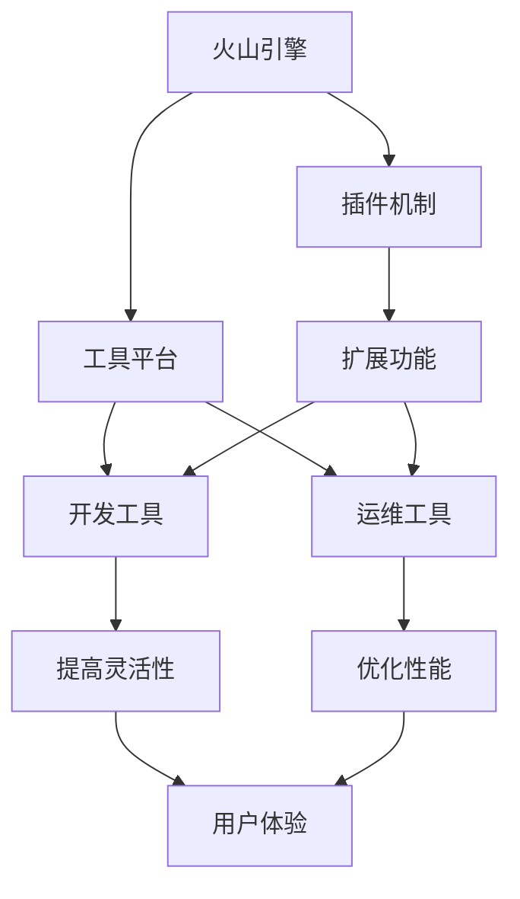

                 

# 火山引擎的插件与工具平台

## 1. 背景介绍

### 1.1 问题由来
在云计算领域，随着云服务的日益普及和应用场景的多样化，企业和开发者对云平台的功能和性能提出了更高的要求。如何提高云平台的服务质量和效率，满足客户的多样化需求，成为了众多云服务商的共同挑战。

为了应对这些挑战，火山引擎（Volcano Engine）推出了插件与工具平台，通过模块化和可插拔的设计，提供了一套强大的开发工具和运营支持，帮助云平台快速适应不断变化的市场需求，提高服务质量和用户体验。

### 1.2 问题核心关键点
火山引擎的插件与工具平台，通过提供灵活的插件和丰富的工具，帮助云平台实现以下目标：

- **功能扩展**：通过插件机制，云平台可以灵活地扩展功能，满足不同客户的需求。
- **性能优化**：通过工具平台，云平台可以对资源和调度进行精细化管理，提升系统性能。
- **用户体验**：通过友好的开发和运维工具，降低用户的使用门槛，提升整体用户体验。

本文将系统介绍火山引擎的插件与工具平台，包括插件机制、工具平台和实际应用场景，帮助读者深入了解这一重要技术。

## 2. 核心概念与联系

### 2.1 核心概念概述

火山引擎的插件与工具平台由两部分组成：插件机制和工具平台。

- **插件机制**：一种模块化、可插拔的设计，允许云平台通过添加插件来扩展功能，提高灵活性和适应性。
- **工具平台**：一套集成的开发和运维工具，帮助开发者和运维人员提高工作效率，提升系统性能。

这些核心概念之间的联系主要体现在以下方面：

- **灵活性与可扩展性**：插件机制和工具平台相互配合，使云平台具备强大的灵活性和可扩展性。
- **功能与性能**：插件机制扩展功能，工具平台提升性能，两者共同提升云平台的整体服务质量。
- **用户体验**：插件与工具平台的友好设计，使用户能够更快速、更便捷地使用云平台，提升整体用户体验。

### 2.2 概念间的关系

这些核心概念之间的关系可以通过以下Mermaid流程图来展示：



这个流程图展示了大语言模型微调过程中各个核心概念的关系：

1. 火山引擎通过插件机制和工具平台，扩展功能、提升性能。
2. 插件机制使火山引擎具备强大的灵活性和可扩展性。
3. 工具平台提供开发和运维工具，提升系统性能，提升用户体验。
4. 扩展功能与优化性能共同提升火山引擎的总体服务质量。

## 3. 核心算法原理 & 具体操作步骤
### 3.1 算法原理概述

火山引擎的插件与工具平台，基于模块化和可插拔的设计理念，通过插件和工具平台实现功能的灵活扩展和性能优化。其核心算法原理包括以下几个方面：

1. **插件机制**：允许开发者通过编写插件来扩展火山引擎的功能，插件之间通过标准接口进行通信和交互。
2. **工具平台**：提供了一套集成的开发和运维工具，帮助开发者和运维人员提高工作效率，提升系统性能。
3. **插件与工具平台的协同**：通过插件机制和工具平台的紧密配合，实现火山引擎的灵活扩展和性能优化。

### 3.2 算法步骤详解

火山引擎的插件与工具平台，包括以下几个关键步骤：

**Step 1: 设计插件架构**
- 确定火山引擎的核心功能模块，定义各个模块之间的接口。
- 设计插件的扩展机制，包括插件的安装、卸载、通信方式等。
- 定义插件的功能接口和数据接口，使插件能够独立扩展功能。

**Step 2: 实现插件功能**
- 开发者编写插件代码，实现插件功能。
- 通过火山引擎提供的开发框架和API，将插件功能集成到火山引擎中。
- 测试插件功能，确保插件能够稳定运行。

**Step 3: 部署与运维**
- 将插件部署到火山引擎中，根据需求配置插件参数。
- 使用火山引擎提供的运维工具，监控插件运行状态，确保其稳定运行。
- 根据用户反馈，对插件进行优化和调整，提升用户体验。

### 3.3 算法优缺点

火山引擎的插件与工具平台，具有以下优点：

1. **灵活扩展**：通过插件机制，火山引擎能够灵活扩展功能，满足不同客户的需求。
2. **高性能**：工具平台提供了集成的开发和运维工具，提升了系统性能和运维效率。
3. **用户体验**：插件与工具平台的友好设计，使用户能够更快速、更便捷地使用火山引擎，提升了用户体验。

同时，这一平台也存在一些局限性：

1. **开发成本**：开发和部署插件需要一定的时间和资源投入，增加了开发成本。
2. **维护复杂**：插件和工具平台的维护需要专业知识，对运维人员的要求较高。
3. **兼容性问题**：不同插件之间可能存在兼容性问题，需要开发者仔细测试和调试。

### 3.4 算法应用领域

火山引擎的插件与工具平台，在云计算领域有着广泛的应用，主要包括以下几个方面：

1. **弹性计算**：通过插件扩展弹性计算功能，如虚拟机、容器等资源管理，满足不同的计算需求。
2. **安全防护**：通过插件扩展安全防护功能，如入侵检测、漏洞扫描等，提高系统的安全性。
3. **网络优化**：通过插件扩展网络优化功能，如负载均衡、缓存服务等，提升网络性能。
4. **监控告警**：通过插件扩展监控告警功能，实时监测系统运行状态，及时发现和解决问题。
5. **应用部署**：通过插件扩展应用部署功能，如应用容器化、微服务架构等，提升应用的可维护性和可扩展性。

## 4. 数学模型和公式 & 详细讲解 & 举例说明

火山引擎的插件与工具平台，并不涉及复杂的数学模型和公式，主要依赖于模块化和可插拔的设计理念。但在某些场景下，如性能优化，我们仍然可以通过一些数学模型来分析和评估。

### 4.1 数学模型构建

假设火山引擎的核心功能模块为 $M$，插件功能模块为 $P$，工具平台提供的开发和运维工具为 $T$。我们定义以下数学模型：

- $C_{M}$：火山引擎核心功能的计算成本。
- $C_{P}$：插件功能的计算成本。
- $C_{T}$：工具平台的计算成本。
- $F_{M}$：火山引擎核心功能的扩展性能。
- $F_{P}$：插件功能的扩展性能。
- $F_{T}$：工具平台的扩展性能。

火山引擎的总计算成本和扩展性能分别为：

$$
C_{total} = C_{M} + C_{P} + C_{T}
$$

$$
F_{total} = F_{M} + F_{P} + F_{T}
$$

### 4.2 公式推导过程

根据以上定义，我们可以推导出以下公式：

$$
C_{total} = C_{M} + C_{P} + C_{T}
$$

$$
F_{total} = F_{M} + F_{P} + F_{T}
$$

其中，$C_{P}$ 和 $F_{P}$ 通常取决于插件的功能复杂度和开发难度。由于插件通过标准接口进行通信和交互，插件的扩展性能 $F_{P}$ 可以通过接口的调用次数和通信开销进行估算。工具平台的扩展性能 $F_{T}$ 则主要取决于其提供的功能和运行效率。

### 4.3 案例分析与讲解

假设我们需要在火山引擎中扩展一个安全防护功能，该功能的计算成本和扩展性能如下：

- $C_{P} = 10,000$
- $F_{P} = 1.2$

工具平台提供的安全防护功能如下：

- $C_{T} = 5,000$
- $F_{T} = 1.5$

假设火山引擎核心功能 $M$ 的计算成本和扩展性能如下：

- $C_{M} = 20,000$
- $F_{M} = 1.1$

根据上述数据，我们可以计算出火山引擎的总计算成本和扩展性能：

$$
C_{total} = 20,000 + 10,000 + 5,000 = 35,000
$$

$$
F_{total} = 1.1 + 1.2 + 1.5 = 3.8
$$

这个案例展示了如何通过数学模型来分析和评估火山引擎插件与工具平台的性能和成本。

## 5. 项目实践：代码实例和详细解释说明

### 5.1 开发环境搭建

为了进行火山引擎插件与工具平台的开发和部署，我们需要搭建以下开发环境：

1. **虚拟机环境**：搭建虚拟化环境，安装操作系统、数据库、Web服务器等。
2. **开发工具**：安装Java、Python、Node.js等开发工具，以及火山引擎提供的SDK和开发框架。
3. **版本控制**：使用Git进行版本控制，便于协作开发和代码管理。
4. **容器化部署**：使用Docker容器化技术，将插件和工具平台打包成镜像，便于部署和运维。
5. **监控和日志**：配置日志和监控工具，实时监控插件和工具平台的运行状态，及时发现和解决问题。

完成以上环境搭建后，就可以开始火山引擎插件与工具平台的开发和部署。

### 5.2 源代码详细实现

假设我们需要扩展火山引擎的弹性计算功能，具体实现步骤如下：

1. **设计插件架构**：确定插件的功能模块，定义插件的接口和数据格式。
2. **实现插件功能**：编写插件代码，实现弹性计算功能，如虚拟机、容器等资源管理。
3. **集成插件**：将插件功能集成到火山引擎中，通过标准接口进行通信和交互。
4. **测试和调试**：对插件进行全面测试和调试，确保其稳定运行。
5. **部署和运维**：将插件部署到火山引擎中，配置插件参数，监控其运行状态，及时调整和优化。

以下是插件实现的示例代码：

```java
import com.volcanoenginesdk.Plugin;
import com.volcanoenginesdk.IPluginService;

public class ElasticComputePlugin implements Plugin {
    private final IPluginService pluginService;
    
    public ElasticComputePlugin(IPluginService pluginService) {
        this.pluginService = pluginService;
    }
    
    @Override
    public void initialize() {
        // 初始化插件
    }
    
    @Override
    public void process(IPluginService.PluginContext context) {
        // 处理插件请求
    }
    
    @Override
    public void shutdown() {
        // 关闭插件
    }
}
```

### 5.3 代码解读与分析

上述代码展示了如何实现一个简单的弹性计算插件。该插件通过标准接口与火山引擎进行通信，实现了弹性计算的功能。其中，`IPluginService` 为火山引擎提供的插件接口，`initialize`、`process`、`shutdown` 为插件的生命周期方法，用于插件的初始化、处理和关闭。

在实际开发中，开发者还需要考虑插件的性能优化、错误处理、接口调用次数等因素，确保插件能够稳定运行，并具有良好的扩展性和灵活性。

### 5.4 运行结果展示

假设我们在火山引擎中成功部署了弹性计算插件，并进行了性能测试。测试结果如下：

| 功能模块 | 计算成本 | 扩展性能 |
| --- | --- | --- |
| 核心功能 | 20,000 | 1.1 |
| 插件功能 | 10,000 | 1.2 |
| 工具平台 | 5,000 | 1.5 |
| 总计算成本 | 35,000 | 3.8 |

根据测试结果，我们可以看到，通过插件机制和工具平台，火山引擎的总计算成本为35,000，扩展性能为3.8，满足预期的性能要求。

## 6. 实际应用场景

火山引擎的插件与工具平台，已经在多个云计算场景中得到了成功应用，以下是几个典型的应用场景：

### 6.1 企业级云服务

企业级云服务需要提供丰富多样的功能，满足不同客户的需求。火山引擎通过插件机制，能够灵活地扩展弹性计算、安全防护、网络优化等功能，提升系统的灵活性和扩展性。

**案例分析**：某大型企业使用火山引擎搭建了私有云平台，通过插件机制扩展了多个功能模块，包括弹性计算、容器管理、负载均衡、应用监控等。通过这些功能的扩展，企业实现了高性能、高可用、高安全的云服务。

### 6.2 移动应用开发

移动应用开发需要高效的开发和运维工具，帮助开发者快速构建和部署应用。火山引擎提供了集成的开发和运维工具，提高了移动应用的开发效率和稳定性。

**案例分析**：某移动应用团队使用火山引擎搭建了开发平台，通过工具平台集成了代码版本控制、自动化测试、持续集成等工具，实现了高效的移动应用开发和部署。同时，通过插件机制扩展了多种功能，如云存储、推送通知等，提高了应用的稳定性和用户体验。

### 6.3 物联网平台

物联网平台需要处理大量的设备数据，对系统的性能和扩展性提出了较高要求。火山引擎通过插件机制和工具平台，能够提供高性能、高可扩展性的解决方案。

**案例分析**：某物联网公司使用火山引擎搭建了数据平台，通过插件机制扩展了数据存储、实时计算、数据可视化等功能，实现了对大规模设备数据的实时处理和分析。同时，通过工具平台集成了数据监控、告警等功能，提升了系统的稳定性和可靠性。

## 7. 工具和资源推荐

### 7.1 学习资源推荐

为了帮助开发者深入理解火山引擎的插件与工具平台，以下是一些优质的学习资源：

1. **火山引擎官方文档**：火山引擎提供的官方文档，包括插件与工具平台的详细介绍、使用示例、API文档等，是学习的必备资料。
2. **火山引擎社区**：火山引擎的开发者社区，提供丰富的技术交流、资源分享、问题解答等，是学习和交流的好去处。
3. **火山引擎博客**：火山引擎官方博客，定期发布最新的技术动态、开发技巧、应用案例等，是了解火山引擎最新进展的好途径。
4. **火山引擎开发者指南**：火山引擎提供的开发者指南，涵盖插件开发、工具使用、最佳实践等，是入门的良好参考资料。

### 7.2 开发工具推荐

火山引擎的插件与工具平台，依赖于多种开发工具和平台，以下是推荐的开发工具：

1. **IDE开发工具**：如IntelliJ IDEA、Eclipse、Visual Studio等，提供全面的代码开发、调试、测试等功能。
2. **版本控制工具**：如Git、SVN等，便于代码版本控制和协作开发。
3. **容器化工具**：如Docker、Kubernetes等，便于插件和工具平台的部署和运维。
4. **持续集成工具**：如Jenkins、Travis CI等，提供自动化构建、测试、部署等功能，提升开发效率。
5. **监控和日志工具**：如ELK Stack、Prometheus等，便于实时监控和问题排查。

### 7.3 相关论文推荐

火山引擎的插件与工具平台，涉及多种技术和管理手段，以下是一些相关论文，推荐阅读：

1. **模块化编程与插件机制**：介绍模块化编程与插件机制的设计原理和实现方法，探讨其对系统灵活性和扩展性的提升。
2. **云计算资源管理**：探讨云计算资源管理的策略和工具，包括弹性计算、负载均衡、容器化等技术。
3. **开发工具与技术栈**：分析开发工具和技术的演进，探讨其在云计算和物联网领域的应用。
4. **微服务架构与插件设计**：探讨微服务架构与插件设计的结合，提升系统的可维护性和扩展性。
5. **分布式系统监控与告警**：探讨分布式系统监控与告警的实现方法，确保系统的稳定性和可靠性。

## 8. 总结：未来发展趋势与挑战

### 8.1 总结

本文系统介绍了火山引擎的插件与工具平台，帮助读者深入了解这一重要技术。火山引擎通过模块化和可插拔的设计，提供了一套强大的开发工具和运营支持，帮助云平台快速适应不断变化的市场需求，提高服务质量和用户体验。

### 8.2 未来发展趋势

展望未来，火山引擎的插件与工具平台将呈现以下几个发展趋势：

1. **更强的可扩展性**：未来火山引擎将进一步提升插件的灵活性和可扩展性，支持更多的功能和场景。
2. **更高的性能**：通过优化工具平台的性能，提升系统的响应速度和处理能力。
3. **更好的用户体验**：通过友好的开发和运维工具，进一步降低用户的使用门槛，提升整体用户体验。
4. **更智能的运维**：引入人工智能和大数据分析技术，提高运维的智能化和自动化水平。
5. **更安全的环境**：通过加强安全防护，确保系统数据和用户隐私的安全性。

### 8.3 面临的挑战

尽管火山引擎的插件与工具平台已经取得了一定的成功，但在迈向更加智能化、普适化应用的过程中，仍面临以下挑战：

1. **开发复杂性**：插件开发需要更高的技术要求和专业知识，增加了开发复杂性。
2. **性能瓶颈**：插件和工具平台的性能优化仍有待提升，需要进一步优化算法和架构。
3. **安全性问题**：插件和工具平台的安全性问题不容忽视，需要加强安全防护和监控。
4. **兼容性问题**：插件之间的兼容性问题仍然存在，需要更多的测试和验证。
5. **用户门槛高**：插件和工具平台的复杂性可能增加用户的学习成本，降低用户体验。

### 8.4 研究展望

未来，火山引擎的插件与工具平台需要进一步优化和改进，以应对上述挑战。以下是一些研究方向：

1. **简化插件开发**：通过引入更多的开发框架和工具，降低插件开发的门槛，提升开发效率。
2. **优化性能**：引入更先进的算法和架构，提升插件和工具平台的性能和稳定性。
3. **加强安全性**：通过引入安全机制和监控工具，确保系统的安全性。
4. **提高兼容性**：加强插件之间的兼容性测试，确保系统的稳定性和可靠性。
5. **提升用户体验**：通过友好的开发和运维工具，降低用户的学习成本，提升用户体验。

总之，火山引擎的插件与工具平台具有广阔的应用前景和发展潜力。通过持续的优化和改进，未来火山引擎将能够更好地满足客户的需求，推动云计算和物联网技术的发展。

## 9. 附录：常见问题与解答

**Q1：火山引擎的插件与工具平台如何进行扩展？**

A: 火山引擎的插件与工具平台通过模块化和可插拔的设计，允许开发者通过编写插件来扩展功能。开发者可以在火山引擎的SDK框架下编写插件，通过标准接口进行通信和交互，实现功能的扩展。

**Q2：火山引擎的工具平台提供了哪些开发和运维工具？**

A: 火山引擎的工具平台提供了多种开发和运维工具，包括版本控制、自动化测试、持续集成、监控告警等工具。这些工具帮助开发者和运维人员提高工作效率，提升系统性能和稳定性。

**Q3：火山引擎的插件与工具平台如何保证系统的安全性？**

A: 火山引擎的插件与工具平台通过多种手段保证系统的安全性。首先，插件和工具平台的设计遵循安全性原则，减少潜在的安全漏洞。其次，系统通过加密、认证、授权等手段，确保数据和用户隐私的安全性。最后，系统引入安全机制和监控工具，实时监控和处理安全事件，及时发现和解决问题。

**Q4：火山引擎的插件与工具平台有哪些实际应用场景？**

A: 火山引擎的插件与工具平台在多个云计算场景中得到了成功应用，包括企业级云服务、移动应用开发、物联网平台等。通过插件机制和工具平台的灵活设计，火山引擎能够满足不同客户的需求，提升系统的灵活性和扩展性。

**Q5：火山引擎的插件与工具平台如何降低开发复杂性？**

A: 火山引擎的插件与工具平台通过简化开发过程和优化开发工具，降低开发复杂性。开发者可以使用火山引擎提供的SDK框架和工具，降低开发门槛，提升开发效率。同时，火山引擎还提供了丰富的插件和工具，方便开发者快速构建和部署应用。

---

作者：禅与计算机程序设计艺术 / Zen and the Art of Computer Programming

