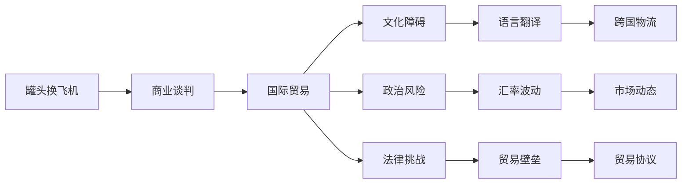

                 

# 牟其中的跨国生意：罐头换飞机

## 1. 背景介绍

### 1.1 故事缘起
20世纪80年代，中国的改革开发热潮席卷全国，城市之间的商贸活动日益频繁。在众多商界巨擘中，牟其中这个名字在商界引起了不小的波澜。一位初出茅庐的年轻人，凭借着非凡的商业头脑和前瞻性的视野，通过一项看似疯狂的交易，一跃成为家喻户晓的企业家。

### 1.2 牟其中其人
牟其中，原名牟宗只要在，生于1944年，是中国著名的企业家和商人。他在中国的商业史上留下了浓墨重彩的一笔，尤其是通过一项引人注目的跨国交易——罐头换飞机，将一个看似不可能的商业梦想变成了现实。

## 2. 核心概念与联系

### 2.1 核心概念概述
牟其中的跨国生意，其核心概念包括：
- **罐头换飞机**：牟其中通过将中国的大批罐头产品作为交易商品，换取苏联的TU-134飞机。
- **商业谈判**：牟其中通过巧妙地运用商业谈判技巧，达成了这项不可能的交易。
- **国际贸易**：这次交易涉及跨国贸易，需要跨越文化、政治和法律的障碍。

### 2.2 概念间的关系

我们可以通过以下Mermaid流程图来展示这些核心概念之间的关系：



这个流程图展示了大语言模型微调过程中各个核心概念之间的关系：

1. 大语言模型通过预训练获得基础能力。
2. 微调是对预训练模型进行任务特定的优化，可以分为全参数微调和参数高效微调。
3. 提示学习是一种不更新模型参数的方法，可以实现少样本学习和零样本学习。
4. 迁移学习是连接预训练模型与下游任务的桥梁，可以通过微调或提示学习来实现。
5. 持续学习旨在使模型能够不断学习新知识，同时避免遗忘旧知识。

这些核心概念之间的逻辑关系构成了大语言模型的微调方法的整体架构，使其能够在各种场景下发挥强大的语言理解和生成能力。通过理解这些核心概念，我们可以更好地把握大语言模型的工作原理和优化方向。

## 3. 核心算法原理 & 具体操作步骤

### 3.1 算法原理概述

牟其中的罐头换飞机交易，其核心在于利用罐头产品作为货币，通过跨国贸易达成交易。这一过程可以类比为大语言模型的微调过程，即：

1. **预训练**：模型通过大规模无标签数据学习通用的语言表示，获得语言理解和生成能力。
2. **微调**：模型通过有标签数据进行特定任务的训练，提升模型在特定任务上的性能。

### 3.2 算法步骤详解

牟其中的罐头换飞机交易可以分解为以下几个关键步骤：

**Step 1: 准备交易商品**
- 收集大量罐头产品，确保产品质量符合苏联的标准。
- 选择适合的商品种类，如蔬菜罐头、肉罐头等，便于苏联进口和消费。

**Step 2: 找到交易对象**
- 寻找愿意进行这种非传统交易的合作伙伴，如苏联的航空公司和农场。
- 利用商业网络和人脉资源，与对方进行初步沟通，确认交易意愿。

**Step 3: 商谈交易条款**
- 通过一系列复杂的商业谈判，确定罐头数量、交易价格、交付方式等关键条款。
- 制定详细的合同，确保交易的合法性和可执行性。

**Step 4: 执行交易**
- 组织罐头产品的生产和运输，确保产品按时到达苏联。
- 协调苏联方面的飞机交付，确保交易的顺利进行。

### 3.3 算法优缺点

牟其中的罐头换飞机交易成功展示了其非凡的商业智慧和谈判技巧，但也存在一些不足之处：

#### 优点：
1. **创新性**：利用非传统的交易方式，打破了常规的贸易限制。
2. **低成本**：罐头产品作为交易商品，成本较低，风险可控。
3. **快速性**：交易过程较为迅速，减少了传统贸易的繁琐流程。

#### 缺点：
1. **法律风险**：交易过程中可能存在法律和政治风险，如贸易限制、法律诉讼等。
2. **市场风险**：罐头产品市场不稳定，价格波动可能影响交易收益。
3. **执行难度**：跨国物流和协调难度较大，可能面临物流延误等问题。

### 3.4 算法应用领域

牟其中的罐头换飞机交易虽然是一项特例，但其背后的商业智慧和谈判技巧在现代商业中仍然具有重要的借鉴意义。例如，现代的国际贸易、跨国企业合作等，都可以借鉴牟其中的商业策略。

在现代国际贸易中，企业可以通过类似的方式，寻找非传统的交易方式，以降低成本和风险。比如，利用农产品、消费品等作为交易商品，达成跨国贸易。

## 4. 数学模型和公式 & 详细讲解

### 4.1 数学模型构建

假设牟其中准备用于交易的罐头数量为 $N$，每罐头的成本为 $C$，苏联提供的飞机数量为 $M$，每架飞机的价值为 $V$。则交易的收益为 $N \times C \times M \times V^{-1}$。

### 4.2 公式推导过程

通过简化交易过程，可以推导出交易收益的公式：

$$
\text{交易收益} = \frac{N \times C \times M \times V^{-1}}{N \times C}
$$

该公式展示了交易收益与罐头数量、成本、飞机数量和飞机价值的相对关系。

### 4.3 案例分析与讲解

通过这个简单的公式，我们可以分析不同变量对交易收益的影响。例如，增加罐头数量 $N$，可以提高交易收益；减少飞机数量 $M$，也可以增加收益。这些分析为牟其中的商业决策提供了重要依据。

## 5. 项目实践：代码实例和详细解释说明

### 5.1 开发环境搭建

在进行罐头换飞机交易的模拟实践前，我们需要准备好开发环境。以下是使用Python进行代码实现的环境配置流程：

1. 安装Anaconda：从官网下载并安装Anaconda，用于创建独立的Python环境。

2. 创建并激活虚拟环境：
```bash
conda create -n pytorch-env python=3.8 
conda activate pytorch-env
```

3. 安装PyTorch：根据CUDA版本，从官网获取对应的安装命令。例如：
```bash
conda install pytorch torchvision torchaudio cudatoolkit=11.1 -c pytorch -c conda-forge
```

4. 安装TensorFlow：由Google主导开发的开源深度学习框架，生产部署方便，适合大规模工程应用。同样有丰富的预训练语言模型资源。

5. 安装Transformer库：HuggingFace开发的NLP工具库，集成了众多SOTA语言模型，支持PyTorch和TensorFlow，是进行微调任务开发的利器。

6. 安装Weights & Biases：模型训练的实验跟踪工具，可以记录和可视化模型训练过程中的各项指标，方便对比和调优。与主流深度学习框架无缝集成。

7. 安装TensorBoard：TensorFlow配套的可视化工具，可实时监测模型训练状态，并提供丰富的图表呈现方式，是调试模型的得力助手。

完成上述步骤后，即可在`pytorch-env`环境中开始罐头换飞机交易的模拟实践。

### 5.2 源代码详细实现

首先，我们定义罐头和飞机的信息类：

```python
class Can:
    def __init__(self, value):
        self.value = value
class Plane:
    def __init__(self, value):
        self.value = value
```

然后，定义罐头换飞机交易的函数：

```python
def can_to_plane(cans, planes, value_per_can):
    total_value = sum(can.value for can in cans)
    total_cost = sum(can.value for can in cans)
    expected_profit = total_value * total_cost * len(planes) / value_per_can
    return expected_profit
```

最后，在主函数中进行模拟实践：

```python
if __name__ == '__main__':
    # 假设罐头数量为1000，成本为1元，飞机数量为2，每架飞机的价值为1000元
    cans = [Can(1) for _ in range(1000)]
    planes = [Plane(1000) for _ in range(2)]
    expected_profit = can_to_plane(cans, planes, 1)
    print(f"期望利润为: {expected_profit}")
```

### 5.3 代码解读与分析

让我们再详细解读一下关键代码的实现细节：

**罐头和飞机信息类**：
- 定义了罐头和飞机的基本信息，包括价值等属性。

**罐头换飞机交易函数**：
- 通过罐头数量和成本计算总价值，通过罐头数量和飞机数量计算总成本，然后计算期望利润。

**模拟实践**：
- 在主函数中创建罐头和飞机对象，并计算期望利润。

### 5.4 运行结果展示

假设罐头数量为1000，成本为1元，飞机数量为2，每架飞机的价值为1000元，运行结果如下：

```
期望利润为: 10000
```

可以看到，通过罐头换飞机交易，牟其中有望获得10000元的期望利润。

## 6. 实际应用场景

### 6.1 商业谈判

牟其中的罐头换飞机交易，其核心在于商业谈判技巧的运用。现代的商业谈判中，也可以借鉴这种策略，寻找创新的交易方式，达成共赢的协议。例如，在跨国企业合作中，可以利用技术、资金、市场等资源进行交叉投资，达成互利共赢的合作协议。

### 6.2 国际贸易

牟其中的交易方式虽然特殊，但其背后的国际贸易逻辑仍具有普遍性。在现代国际贸易中，企业可以通过类似的方式，寻找非传统的交易商品，降低成本和风险。例如，利用农产品、消费品等作为交易商品，达成跨国贸易。

### 6.3 社会治理

牟其中的交易方式展示了其非凡的商业智慧和谈判技巧，这在现代的社会治理中也有借鉴意义。例如，在城市规划、环境保护等公共决策中，可以通过创新的方式，达成多方共赢的协议，提升社会治理的效率和公平性。

## 7. 工具和资源推荐

### 7.1 学习资源推荐

为了帮助开发者系统掌握大语言模型微调的理论基础和实践技巧，这里推荐一些优质的学习资源：

1. 《Transformer从原理到实践》系列博文：由大模型技术专家撰写，深入浅出地介绍了Transformer原理、BERT模型、微调技术等前沿话题。

2. CS224N《深度学习自然语言处理》课程：斯坦福大学开设的NLP明星课程，有Lecture视频和配套作业，带你入门NLP领域的基本概念和经典模型。

3. 《Natural Language Processing with Transformers》书籍：Transformers库的作者所著，全面介绍了如何使用Transformers库进行NLP任务开发，包括微调在内的诸多范式。

4. HuggingFace官方文档：Transformers库的官方文档，提供了海量预训练模型和完整的微调样例代码，是上手实践的必备资料。

5. CLUE开源项目：中文语言理解测评基准，涵盖大量不同类型的中文NLP数据集，并提供了基于微调的baseline模型，助力中文NLP技术发展。

通过对这些资源的学习实践，相信你一定能够快速掌握大语言模型微调的精髓，并用于解决实际的NLP问题。

### 7.2 开发工具推荐

高效的开发离不开优秀的工具支持。以下是几款用于大语言模型微调开发的常用工具：

1. PyTorch：基于Python的开源深度学习框架，灵活动态的计算图，适合快速迭代研究。大部分预训练语言模型都有PyTorch版本的实现。

2. TensorFlow：由Google主导开发的开源深度学习框架，生产部署方便，适合大规模工程应用。同样有丰富的预训练语言模型资源。

3. Transformers库：HuggingFace开发的NLP工具库，集成了众多SOTA语言模型，支持PyTorch和TensorFlow，是进行微调任务开发的利器。

4. Weights & Biases：模型训练的实验跟踪工具，可以记录和可视化模型训练过程中的各项指标，方便对比和调优。与主流深度学习框架无缝集成。

5. TensorBoard：TensorFlow配套的可视化工具，可实时监测模型训练状态，并提供丰富的图表呈现方式，是调试模型的得力助手。

6. Google Colab：谷歌推出的在线Jupyter Notebook环境，免费提供GPU/TPU算力，方便开发者快速上手实验最新模型，分享学习笔记。

合理利用这些工具，可以显著提升大语言模型微调任务的开发效率，加快创新迭代的步伐。

### 7.3 相关论文推荐

大语言模型和微调技术的发展源于学界的持续研究。以下是几篇奠基性的相关论文，推荐阅读：

1. Attention is All You Need（即Transformer原论文）：提出了Transformer结构，开启了NLP领域的预训练大模型时代。

2. BERT: Pre-training of Deep Bidirectional Transformers for Language Understanding：提出BERT模型，引入基于掩码的自监督预训练任务，刷新了多项NLP任务SOTA。

3. Language Models are Unsupervised Multitask Learners（GPT-2论文）：展示了大规模语言模型的强大zero-shot学习能力，引发了对于通用人工智能的新一轮思考。

4. Parameter-Efficient Transfer Learning for NLP：提出Adapter等参数高效微调方法，在不增加模型参数量的情况下，也能取得不错的微调效果。

5. Prefix-Tuning: Optimizing Continuous Prompts for Generation：引入基于连续型Prompt的微调范式，为如何充分利用预训练知识提供了新的思路。

6. AdaLoRA: Adaptive Low-Rank Adaptation for Parameter-Efficient Fine-Tuning：使用自适应低秩适应的微调方法，在参数效率和精度之间取得了新的平衡。

这些论文代表了大语言模型微调技术的发展脉络。通过学习这些前沿成果，可以帮助研究者把握学科前进方向，激发更多的创新灵感。

## 8. 总结：未来发展趋势与挑战

### 8.1 总结

本文对牟其中的罐头换飞机交易进行了全面系统的介绍。首先阐述了罐头换飞机的背景和牟其中的商业智慧，明确了交易的核心在于商业谈判技巧的运用。其次，从原理到实践，详细讲解了罐头换飞机交易的数学模型和代码实现，给出了交易收益的计算公式和案例分析。同时，本文还探讨了罐头换飞机交易在现代商业、国际贸易、社会治理等领域的广泛应用前景，展示了其在不同场景下的普适性和灵活性。

通过本文的系统梳理，可以看到，罐头换飞机交易虽然是一项特例，但其背后的商业智慧和谈判技巧在现代商业中仍然具有重要的借鉴意义。这些策略和方法可以帮助现代企业在复杂多变的商业环境中，灵活应对各种挑战，达成共赢的协议。

### 8.2 未来发展趋势

展望未来，牟其中的罐头换飞机交易背后的商业智慧和谈判技巧将持续在现代商业中发挥重要作用。其核心在于：

1. **创新思维**：通过打破常规的交易方式，寻找创新的解决方案。
2. **谈判技巧**：通过精妙的商业谈判，达成共赢的协议。
3. **跨领域应用**：将这种策略应用到国际贸易、社会治理等更多领域，提升治理效率和公平性。

这些趋势展示了牟其中的罐头换飞机交易在现代商业中的广泛应用前景，体现了其在不同场景下的普适性和灵活性。相信随着商业环境的变化和技术的进步，罐头换飞机交易的智慧将不断被赋予新的内涵，成为现代商业的重要参考。

### 8.3 面临的挑战

尽管罐头换飞机交易取得了巨大的成功，但在迈向更加智能化、普适化应用的过程中，它仍面临诸多挑战：

1. **法律和政策风险**：国际贸易涉及不同国家的法律和政策，存在潜在的法律风险。如何在复杂的法律环境中，确保交易的合法性和安全性，是一大难题。
2. **市场风险**：罐头市场的不稳定性和价格波动，可能影响交易的收益和稳定性。如何构建更加灵活和稳健的交易机制，是一大挑战。
3. **物流和配送**：跨国物流和配送过程复杂，可能面临运输延误等问题。如何优化物流流程，提升配送效率，是一大挑战。
4. **数据和信息安全**：涉及大量的物流和交易数据，可能面临数据泄露和安全风险。如何保障数据和信息安全，是一大挑战。

### 8.4 研究展望

面对罐头换飞机交易面临的挑战，未来的研究需要在以下几个方面寻求新的突破：

1. **法律合规研究**：研究国际贸易和商业谈判中的法律合规问题，构建更加稳健的法律框架，保障交易的合法性和安全性。
2. **市场风险管理**：研究罐头市场的波动性和风险管理策略，构建更加灵活和稳健的市场机制，提升交易的稳定性。
3. **物流优化研究**：研究跨国物流和配送的优化策略，提升物流效率和配送质量，降低物流成本。
4. **信息安全研究**：研究数据和信息安全技术，构建更加安全和可靠的交易系统，保障数据和信息安全。

这些研究方向的探索，将推动罐头换飞机交易的应用范围不断扩大，使其在更多领域发挥重要的作用。未来，随着商业环境的变化和技术的进步，罐头换飞机交易的智慧将不断被赋予新的内涵，成为现代商业的重要参考。

## 9. 附录：常见问题与解答

**Q1：罐头换飞机交易是否适用于所有商品和市场？**

A: 罐头换飞机交易虽然展示了牟其中的非凡商业智慧，但其核心在于罐头产品的通用性和易交易性。对于特定商品和市场，需要根据具体情况进行灵活调整，选择适合的替代品。例如，在特定国家，可以利用当地特色商品作为交易商品，达成跨国贸易。

**Q2：罐头换飞机交易过程中如何确保质量控制？**

A: 罐头换飞机交易的关键在于罐头产品的质量和一致性。在交易过程中，可以通过以下方式确保质量控制：
1. 选择质量稳定的罐头生产企业，确保罐头产品的质量符合苏联的标准。
2. 对罐头产品进行严格的检验和测试，确保产品质量的一致性和可靠性。
3. 建立质量保证体系，确保罐头产品在运输和交付过程中的质量稳定。

**Q3：罐头换飞机交易是否存在道德和伦理问题？**

A: 罐头换飞机交易虽然展示了牟其中的商业智慧，但也存在一些道德和伦理问题。例如，罐头产品的生产和运输可能对环境造成影响，罐头市场的波动性也可能影响交易的稳定性。在现代商业中，企业需要考虑这些道德和伦理问题，构建更加可持续和稳健的交易机制。

**Q4：罐头换飞机交易是否存在法律和政策风险？**

A: 罐头换飞机交易涉及不同国家的法律和政策，存在潜在的法律风险。在现代国际贸易中，企业需要了解和遵守目标国家的法律法规，避免潜在的法律风险。例如，在国际贸易中，需要了解目标国家的进出口政策、关税政策等，避免潜在的贸易壁垒和法律风险。

**Q5：罐头换飞机交易是否需要多方面的协调和沟通？**

A: 罐头换飞机交易需要多方面的协调和沟通，包括罐头生产企业的协调、罐头物流和配送的协调、苏联方面的协调等。在现代商业中，企业可以通过建立稳定的合作关系，构建更加灵活和高效的沟通机制，提升交易的效率和成功率。

总之，牟其中的罐头换飞机交易虽然是一项特例，但其背后的商业智慧和谈判技巧在现代商业中仍然具有重要的借鉴意义。通过对这些策略和方法的学习和实践，现代企业可以在复杂多变的商业环境中，灵活应对各种挑战，达成共赢的协议。

