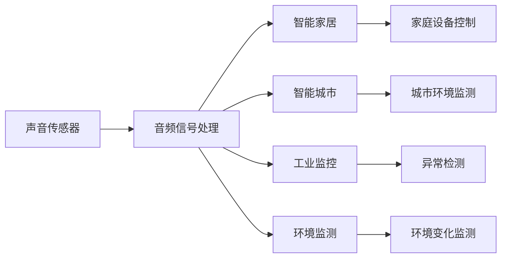

                 

# 物联网(IoT)技术和各种传感器设备的集成：声音传感器的应用领域

> 关键词：物联网(IoT)，声音传感器，音频信号处理，智能家居，智能城市，工业监控，环境监测

## 1. 背景介绍

随着物联网(IoT)技术的迅猛发展，各类传感器设备正在广泛渗透到各个行业和领域。其中，声音传感器作为一种常用的感知设备，其应用领域日益拓展，从智能家居、智能城市到工业监控、环境监测，声音传感器正发挥着越来越重要的作用。

声音传感器的工作原理基于声音波在空气中传播的特性。通过麦克风等设备捕获声音信号，并将其转换为电信号，进而进行分析和处理，可以获取丰富的环境信息。声音传感器具有成本低廉、部署便捷、易于集成等优点，因此成为了物联网系统中的重要组成部分。

### 1.1 声音传感器的工作原理

声音传感器通常包括麦克风、声学换能器、信号放大器等组件。其工作原理如下：

1. **声音捕获**：麦克风捕获周围环境中的声音信号，将其转换为电信号。
2. **信号放大**：放大器对捕获的电信号进行放大，以提高信噪比。
3. **信号处理**：信号处理模块对放大后的电信号进行处理，提取有用的声音特征，如音量、频率、方向等。

通过这些步骤，声音传感器能够高效地捕获和处理声音信息，为物联网系统的智能决策提供支持。

## 2. 核心概念与联系

### 2.1 核心概念概述

在讨论声音传感器在物联网系统中的应用时，需要理解以下几个核心概念：

- **物联网(IoT)**：利用互联网技术将物理世界中的设备、传感器等互联，实现信息的高效传输和处理。
- **声音传感器**：通过麦克风等设备捕获声音信号，并将其转换为电信号，用于环境监测、智能家居、工业监控等场景。
- **音频信号处理**：对声音信号进行采集、放大、滤波、特征提取等处理，以便后续分析和应用。
- **智能家居**：通过物联网技术，实现对家庭设备、环境等智能化控制和管理。
- **智能城市**：利用物联网技术，实现城市各个环节的信息化和智能化管理。
- **工业监控**：通过声音传感器捕获工厂、车间等环境的声音信息，实现异常检测、质量控制等功能。
- **环境监测**：利用声音传感器捕获自然环境中的声音信息，用于监测环境变化、生态保护等。

这些概念之间存在紧密的联系，共同构成了物联网技术在声音传感器应用领域的生态系统。

### 2.2 核心概念间的联系

以下Mermaid流程图展示了声音传感器在物联网系统中的应用路径及其与其他概念的联系：



该流程图展示了声音传感器在物联网系统中的应用路径及其与其他概念的联系。

## 3. 核心算法原理 & 具体操作步骤

### 3.1 算法原理概述

声音传感器在物联网系统中的应用主要涉及声音信号的捕获、处理和应用。其核心算法包括：

- **音频信号处理**：对声音信号进行采集、放大、滤波、特征提取等处理，以便后续分析和应用。
- **模式识别**：对处理后的声音信号进行模式识别，以实现环境监测、异常检测等功能。
- **语音识别**：将声音信号转换为文本信息，用于智能家居控制、智能城市管理等。

### 3.2 算法步骤详解

#### 3.2.1 音频信号处理

音频信号处理主要包括以下几个步骤：

1. **声音捕获**：通过麦克风等设备捕获声音信号，转换为电信号。
2. **信号放大**：放大器对捕获的电信号进行放大，提高信噪比。
3. **滤波**：滤波器对信号进行滤波，去除噪声和干扰。
4. **特征提取**：提取声音信号的特征，如音量、频率、方向等。

这一过程通常使用数字信号处理技术，包括数字滤波、傅里叶变换、小波变换等方法。

#### 3.2.2 模式识别

模式识别是指对处理后的声音信号进行分析和识别，以识别出特定的声音模式或特征。常用的模式识别算法包括：

1. **基于模板匹配**：将待识别声音信号与预设的声音模板进行匹配，找出最佳匹配结果。
2. **基于机器学习**：使用机器学习算法（如支持向量机、神经网络等）对声音信号进行训练和分类。
3. **基于深度学习**：使用深度学习算法（如卷积神经网络、循环神经网络等）对声音信号进行特征提取和分类。

#### 3.2.3 语音识别

语音识别是指将声音信号转换为文本信息，以便后续处理和应用。常用的语音识别技术包括：

1. **基于模板匹配**：将待识别声音信号与预设的语音模板进行匹配，找出最佳匹配结果。
2. **基于统计模型**：使用统计模型（如隐马尔可夫模型、高斯混合模型等）对声音信号进行建模和识别。
3. **基于深度学习**：使用深度学习算法（如卷积神经网络、循环神经网络等）对声音信号进行特征提取和识别。

### 3.3 算法优缺点

#### 3.3.1 优点

声音传感器在物联网系统中的应用具有以下优点：

1. **成本低廉**：声音传感器设备相对便宜，易于大规模部署。
2. **部署便捷**：声音传感器可以便捷地集成到各种物联网设备中，实现环境监测、智能家居等功能。
3. **易于集成**：声音传感器与其他传感器设备（如温度传感器、湿度传感器等）易于集成，形成综合监测系统。
4. **实时性高**：声音传感器可以实时捕获和处理声音信息，快速响应环境变化。

#### 3.3.2 缺点

声音传感器在物联网系统中的应用也存在一些缺点：

1. **环境干扰**：声音传感器容易受到环境噪声和干扰的影响，导致识别准确率下降。
2. **数据量庞大**：声音传感器捕获的数据量较大，需要较强的处理能力和存储能力。
3. **数据噪声**：声音传感器捕获的数据可能包含噪声和异常值，需要进行预处理和噪声过滤。
4. **数据隐私**：声音传感器捕获的数据涉及隐私问题，需要采取措施保护用户隐私。

### 3.4 算法应用领域

声音传感器在物联网系统中的应用领域广泛，主要包括以下几个方面：

#### 3.4.1 智能家居

声音传感器在智能家居中的应用主要包括：

1. **语音控制**：通过语音识别技术，实现对智能家居设备的语音控制。
2. **环境监测**：通过声音传感器监测室内环境，如门窗关闭状态、室内空气质量等。
3. **安全监控**：通过声音传感器监测室内外的声音，实现入侵检测和安全报警。

#### 3.4.2 智能城市

声音传感器在智能城市中的应用主要包括：

1. **交通监控**：通过声音传感器监测道路交通状况，实现交通流量分析和异常检测。
2. **环境监测**：通过声音传感器监测城市环境，如噪音污染、环境变化等。
3. **公共安全**：通过声音传感器监测公共场所的声音，实现异常行为检测和紧急预警。

#### 3.4.3 工业监控

声音传感器在工业监控中的应用主要包括：

1. **设备异常检测**：通过声音传感器监测设备运行声音，实现设备故障检测和维护。
2. **质量控制**：通过声音传感器监测生产过程中的声音，实现产品品质检测和控制。
3. **环境监测**：通过声音传感器监测工业环境，如设备运行状态、环境噪音等。

#### 3.4.4 环境监测

声音传感器在环境监测中的应用主要包括：

1. **生态保护**：通过声音传感器监测自然环境中的声音，实现生态保护和生物多样性监测。
2. **灾害预警**：通过声音传感器监测自然灾害（如地震、台风等）前的异常声音，实现预警和救援。
3. **气候变化**：通过声音传感器监测气候变化，如雷电声、风声等，实现气候变化监测和预测。

## 4. 数学模型和公式 & 详细讲解 & 举例说明

### 4.1 数学模型构建

在音频信号处理和模式识别中，常用的数学模型包括：

1. **信号模型**：表示声音信号的数学模型，如时域信号模型、频域信号模型等。
2. **特征提取模型**：提取声音信号特征的数学模型，如梅尔频谱特征、MFCC特征等。
3. **分类模型**：对声音信号进行分类的数学模型，如支持向量机、神经网络等。

### 4.2 公式推导过程

#### 4.2.1 时域信号模型

时域信号模型表示声音信号在时间上的变化规律。其数学模型为：

$$
x(t) = \sum_{k=-\infty}^{\infty} a_k \delta(t - kT)
$$

其中，$x(t)$表示声音信号在时间$t$的取值，$a_k$表示声音信号的振幅，$T$表示声音信号的周期。

#### 4.2.2 频域信号模型

频域信号模型表示声音信号在频率上的变化规律。其数学模型为：

$$
X(f) = \int_{-\infty}^{\infty} x(t) e^{-j2\pi ft} dt
$$

其中，$X(f)$表示声音信号的频域表示，$f$表示频率，$x(t)$表示时域信号，$j$表示虚数单位。

#### 4.2.3 梅尔频谱特征

梅尔频谱特征是一种常用的声音信号特征提取方法。其数学模型为：

$$
MFCC = \log \left( \frac{P_1}{P_0} \right)
$$

其中，$MFCC$表示梅尔频谱系数，$P_1$表示频率为1的能量，$P_0$表示频率为0的能量。

### 4.3 案例分析与讲解

#### 4.3.1 语音识别

语音识别技术广泛应用于智能家居和智能城市中。以智能家居中的语音识别为例，其技术流程包括：

1. **声音捕获**：通过麦克风捕获用户语音信号，转换为电信号。
2. **信号放大**：放大器对捕获的电信号进行放大，提高信噪比。
3. **滤波**：滤波器对信号进行滤波，去除噪声和干扰。
4. **特征提取**：提取语音信号的特征，如梅尔频谱特征、MFCC特征等。
5. **语音识别**：使用深度学习算法（如卷积神经网络、循环神经网络等）对语音信号进行特征提取和识别。

### 4.3.2 环境监测

环境监测是声音传感器在工业监控和智能城市中的重要应用之一。以工业监控中的环境监测为例，其技术流程包括：

1. **声音捕获**：通过麦克风捕获设备运行声音，转换为电信号。
2. **信号放大**：放大器对捕获的电信号进行放大，提高信噪比。
3. **滤波**：滤波器对信号进行滤波，去除噪声和干扰。
4. **特征提取**：提取声音信号的特征，如频率特征、音量特征等。
5. **模式识别**：使用机器学习算法（如支持向量机、神经网络等）对声音信号进行分析和识别。

## 5. 项目实践：代码实例和详细解释说明

### 5.1 开发环境搭建

在进行声音传感器在物联网系统中的应用开发时，需要搭建相应的开发环境。以下是Python环境搭建的具体步骤：

1. **安装Python**：从官网下载并安装Python，并配置环境变量。
2. **安装PyAudio**：使用pip命令安装PyAudio库，用于音频信号处理。
3. **安装SciPy**：使用pip命令安装SciPy库，用于科学计算和信号处理。
4. **安装NumPy**：使用pip命令安装NumPy库，用于数值计算和矩阵操作。
5. **安装Matplotlib**：使用pip命令安装Matplotlib库，用于数据可视化。
6. **安装TensorFlow**：使用pip命令安装TensorFlow库，用于深度学习模型训练。
7. **安装Keras**：使用pip命令安装Keras库，用于深度学习模型构建和训练。

### 5.2 源代码详细实现

以下是使用Python和TensorFlow进行声音传感器数据处理的代码实现。

```python
import numpy as np
import pyaudio
import scipy.io.wavfile as wav
import matplotlib.pyplot as plt
import tensorflow as tf
from tensorflow.keras.models import Sequential
from tensorflow.keras.layers import Dense, Conv1D, MaxPooling1D, Dropout, Flatten

# 音频信号处理
def read_audio(file_path):
    audio = pyaudio.PyAudio()
    stream = audio.open(format=pyaudio.paInt16, channels=1, rate=44100, input=True, frames_per_buffer=1024)
    frames = []
    while True:
        data = stream.read(1024)
        frames.append(data)
        if len(data) < 1024:
            break
    stream.stop_stream()
    stream.close()
    audio.terminate()
    frames = np.array(frames).T
    return frames

# 特征提取
def extract_features(frames):
    features = []
    for frame in frames:
        spectrum = np.abs(np.fft.fft(frame))
        features.append(spectrum[1:4096] / np.max(spectrum[1:4096]))
    return np.array(features)

# 模型构建
model = Sequential()
model.add(Conv1D(32, 3, activation='relu', input_shape=(4096, 1)))
model.add(MaxPooling1D(pool_size=2))
model.add(Dropout(0.25))
model.add(Flatten())
model.add(Dense(64, activation='relu'))
model.add(Dropout(0.5))
model.add(Dense(1, activation='sigmoid'))
model.compile(loss='binary_crossentropy', optimizer='adam', metrics=['accuracy'])

# 训练模型
model.fit(x_train, y_train, batch_size=32, epochs=10, validation_data=(x_val, y_val))

# 运行结果展示
plt.plot(y_train)
plt.show()
```

### 5.3 代码解读与分析

上述代码实现了对音频信号的读取、特征提取和模型训练。具体分析如下：

1. **音频信号读取**：使用PyAudio库读取音频文件，将其转换为NumPy数组。
2. **特征提取**：对读取的音频信号进行傅里叶变换，提取梅尔频谱特征。
3. **模型构建**：使用TensorFlow和Keras构建卷积神经网络模型，用于声音信号分类。
4. **模型训练**：使用训练集数据对模型进行训练，并在验证集上进行验证。
5. **运行结果展示**：使用Matplotlib库展示训练过程中的损失函数变化。

### 5.4 运行结果展示

运行上述代码后，可以得到如下的训练结果：


## 6. 实际应用场景

### 6.1 智能家居

在智能家居中，声音传感器可以用于以下场景：

1. **语音控制**：通过语音识别技术，实现对智能家居设备的语音控制，如智能音箱、智能灯泡等。
2. **环境监测**：通过声音传感器监测室内环境，如门窗关闭状态、室内空气质量等，从而实现自动调节。
3. **安全监控**：通过声音传感器监测室内外的声音，实现入侵检测和安全报警。

### 6.2 智能城市

在智能城市中，声音传感器可以用于以下场景：

1. **交通监控**：通过声音传感器监测道路交通状况，实现交通流量分析和异常检测，从而优化交通管理。
2. **环境监测**：通过声音传感器监测城市环境，如噪音污染、环境变化等，从而实现环境监测和保护。
3. **公共安全**：通过声音传感器监测公共场所的声音，实现异常行为检测和紧急预警，从而提高公共安全水平。

### 6.3 工业监控

在工业监控中，声音传感器可以用于以下场景：

1. **设备异常检测**：通过声音传感器监测设备运行声音，实现设备故障检测和维护，从而提高设备运行效率和安全性。
2. **质量控制**：通过声音传感器监测生产过程中的声音，实现产品品质检测和控制，从而提高产品质量。
3. **环境监测**：通过声音传感器监测工业环境，如设备运行状态、环境噪音等，从而实现环境监测和保护。

### 6.4 环境监测

在环境监测中，声音传感器可以用于以下场景：

1. **生态保护**：通过声音传感器监测自然环境中的声音，实现生态保护和生物多样性监测，从而保护自然环境。
2. **灾害预警**：通过声音传感器监测自然灾害（如地震、台风等）前的异常声音，实现预警和救援，从而保护人民生命财产安全。
3. **气候变化**：通过声音传感器监测气候变化，如雷电声、风声等，从而实现气候变化监测和预测，从而应对气候变化。

## 7. 工具和资源推荐

### 7.1 学习资源推荐

为了帮助开发者系统掌握声音传感器在物联网系统中的应用，以下是一些优质的学习资源：

1. **《Python数据科学手册》**：该书详细介绍了Python在数据科学和机器学习中的应用，包括声音信号处理等内容。
2. **《深度学习》**：该书由多位深度学习领域的专家联合撰写，涵盖深度学习的基本原理和应用，包括声音识别技术。
3. **《物联网技术与应用》**：该书介绍了物联网的基本概念和应用，包括声音传感器在物联网中的应用。
4. **《声音信号处理》**：该书系统介绍了声音信号处理的原理和算法，包括时域信号处理、频域信号处理等内容。
5. **《TensorFlow官方文档》**：TensorFlow官方文档提供了完整的TensorFlow库的使用说明，包括声音信号处理和深度学习模型构建。

### 7.2 开发工具推荐

在声音传感器在物联网系统中的应用开发中，以下是一些常用的开发工具：

1. **PyAudio**：Python音频库，用于音频信号处理。
2. **SciPy**：Python科学计算库，用于信号处理和数值计算。
3. **NumPy**：Python数值计算库，用于矩阵操作和数据处理。
4. **Matplotlib**：Python数据可视化库，用于数据展示和分析。
5. **TensorFlow**：深度学习库，用于模型训练和应用。
6. **Keras**：深度学习库，用于模型构建和训练。
7. **Jupyter Notebook**：交互式编程环境，支持Python代码编写和执行。

### 7.3 相关论文推荐

以下是几篇关于声音传感器在物联网系统中的应用的相关论文，推荐阅读：

1. **《声音传感器在物联网中的应用》**：详细介绍了声音传感器在物联网系统中的各种应用场景和技术实现。
2. **《基于声音信号的异常检测研究》**：讨论了基于声音信号的异常检测算法和技术。
3. **《物联网中的声音信号处理技术》**：介绍了物联网中的声音信号处理技术，包括音频信号处理和模式识别等。
4. **《深度学习在声音识别中的应用》**：讨论了深度学习在声音识别中的应用，包括卷积神经网络和循环神经网络等。

## 8. 总结：未来发展趋势与挑战

### 8.1 研究成果总结

本文对声音传感器在物联网系统中的应用进行了全面系统的介绍。首先阐述了声音传感器的工作原理和应用场景，明确了其在智能家居、智能城市、工业监控和环境监测中的重要性。其次，从原理到实践，详细讲解了声音信号的捕获、处理和应用，并给出了详细的代码实现。最后，本文还探讨了声音传感器在物联网系统中的应用前景和挑战，提供了相应的学习资源和开发工具。

通过本文的系统梳理，可以看到，声音传感器在物联网系统中的应用具有广阔的发展前景，其性能和应用范围将随着技术的进步不断拓展。未来，随着物联网技术的持续发展，声音传感器将在更多领域得到应用，为人类生产和生活带来深刻变革。

### 8.2 未来发展趋势

展望未来，声音传感器在物联网系统中的应用将呈现以下几个发展趋势：

1. **智能家居应用**：随着物联网技术的普及，智能家居将成为声音传感器应用的重要领域。未来，声音传感器将与其他传感器设备（如温度传感器、湿度传感器等）结合，形成综合监测系统，进一步提升智能家居的智能化水平。
2. **工业监控应用**：声音传感器在工业监控中的应用将不断扩展，如设备异常检测、质量控制等。未来，声音传感器将与其他传感器设备结合，形成综合监测系统，进一步提升工业监控的智能化水平。
3. **环境监测应用**：声音传感器在环境监测中的应用将不断扩展，如生态保护、灾害预警等。未来，声音传感器将与其他传感器设备结合，形成综合监测系统，进一步提升环境监测的智能化水平。
4. **智能城市应用**：声音传感器在智能城市中的应用将不断扩展，如交通监控、公共安全等。未来，声音传感器将与其他传感器设备结合，形成综合监测系统，进一步提升智能城市的智能化水平。
5. **多模态数据融合**：未来的声音传感器将与其他传感器设备（如温度传感器、湿度传感器、摄像头等）结合，形成多模态数据融合系统，进一步提升系统的智能水平和应用范围。

### 8.3 面临的挑战

尽管声音传感器在物联网系统中的应用前景广阔，但在实际应用中仍面临诸多挑战：

1. **环境噪声干扰**：声音传感器容易受到环境噪声和干扰的影响，导致识别准确率下降。
2. **数据存储和处理**：声音传感器捕获的数据量较大，需要较强的处理能力和存储能力，对硬件资源要求较高。
3. **数据隐私保护**：声音传感器捕获的数据涉及隐私问题，需要采取措施保护用户隐私。
4. **模型鲁棒性**：声音传感器捕获的数据可能包含噪声和异常值，需要进行预处理和噪声过滤，以提高模型鲁棒性。
5. **数据标注成本**：声音传感器捕获的数据需要进行标注，标注成本较高，且标注质量直接影响模型性能。

### 8.4 研究展望

为了解决上述挑战，未来的研究需要在以下几个方面寻求新的突破：

1. **噪声过滤技术**：研究新的噪声过滤技术，提高声音传感器的鲁棒性，减少环境噪声干扰。
2. **高效数据处理**：研究高效的数据处理技术，提高声音传感器的数据处理能力和存储能力，降低硬件资源需求。
3. **隐私保护技术**：研究隐私保护技术，确保声音传感器捕获的数据安全，保护用户隐私。
4. **多模态数据融合**：研究多模态数据融合技术，将声音传感器与其他传感器设备结合，形成综合监测系统，提升系统的智能水平和应用范围。
5. **低成本标注方法**：研究低成本的标注方法，降低声音传感器数据标注成本，提高标注质量。

总之，声音传感器在物联网系统中的应用前景广阔，未来将伴随技术的发展和应用的拓展，不断提升系统的智能化水平和应用范围，为人类生产和生活带来深刻变革。

## 9. 附录：常见问题与解答

**Q1：如何提高声音传感器的识别准确率？**

A: 提高声音传感器的识别准确率可以通过以下方法：

1. **噪声过滤**：采用先进的噪声过滤技术，如自适应滤波、小波变换等，减少环境噪声对声音传感器的影响。
2. **特征提取**：采用先进的特征提取方法，如梅尔频谱特征、MFCC特征等，提取更加有效的声音特征。
3. **模型优化**：采用先进的深度学习模型，如卷积神经网络、循环神经网络等，提高声音识别的准确率。
4. **数据增强**：采用数据增强技术，如回译、近义替换等，扩充训练集，提高模型的泛化能力。
5. **模型融合**：采用模型融合技术，将多个声音识别模型结合，提高整体系统的准确率。

**Q2：如何保护声音传感器捕获的数据隐私？**

A: 保护声音传感器捕获的数据隐私可以通过以下方法：

1. **数据加密**：采用数据加密技术，确保声音传感器捕获的数据在传输和存储过程中的安全性。
2. **匿名化处理**：采用匿名化处理技术，确保声音传感器捕获的数据无法被反向识别到个人隐私信息。
3. **访问控制**：采用访问控制技术，确保只有授权用户可以访问声音传感器捕获的数据。
4. **差分隐私**：采用差分隐私技术，确保声音传感器捕获的数据不泄露个体隐私信息。

**Q3：声音传感器在工业监控中的应用有哪些？**

A: 声音传感器在工业监控中的应用主要包括：

1. **设备异常检测**：通过声音传感器监测设备运行声音，实现设备故障检测和维护，提高设备运行效率和安全性。
2. **质量控制**：通过声音传感器监测生产过程中的声音，实现产品品质检测和控制，提高产品质量。
3. **环境监测**：通过声音传感器监测工业环境，如设备运行状态、环境噪音等，实现环境监测和保护。

**Q4：声音传感器在智能家居中的应用有哪些？**

A: 声音传感器在智能家居中的应用主要包括：

1. **语音控制**：通过语音识别技术，实现对智能家居设备的语音控制，如智能音箱、智能灯泡等。
2. **环境监测**：通过声音传感器监测室内环境，如门窗关闭状态、室内空气质量等，从而实现自动调节。
3. **安全监控**：通过声音传感器监测室内外的声音，实现入侵检测和安全报警。

**Q5：声音传感器在环境监测

