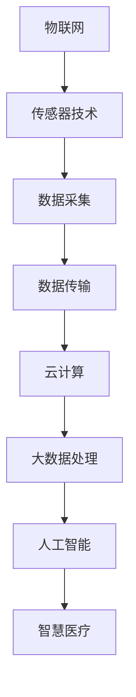

                 

# 物联网(IoT)技术和各种传感器设备的集成：物联网在智慧医疗的应用

## 1. 背景介绍

### 1.1 问题由来
近年来，物联网(IoT)技术的飞速发展在各行各业引起了广泛关注。其通过连接各种设备，实时采集和传输数据，使信息化技术在现实世界中的应用更加深入。尤其是在智慧医疗领域，物联网将监测设备、传感器、移动设备等多样化的数据采集设备整合起来，实现数据的智能化采集和处理，提升医疗服务的质量和效率。

智慧医疗是利用现代信息技术和通信技术，通过数字化、网络化、智能化手段，提供安全、高效、便捷的医疗服务，旨在改善患者治疗效果，降低医疗成本。智慧医疗的实现离不开物联网技术，而物联网技术的发展也推动了智慧医疗的进步。

### 1.2 问题核心关键点
物联网在智慧医疗中的应用核心在于数据采集、传输和分析，涉及多个环节和多种技术，如传感器技术、云计算、大数据处理、人工智能等。数据采集是物联网在智慧医疗中的基础，传感器设备的种类和性能直接影响数据的质量。数据传输和分析则需要云计算和大数据处理的支持，以实现数据的实时处理和存储。人工智能技术则可以在数据处理和分析中提供强大的算法支持，实现疾病的早期预警、个性化治疗等应用。

## 2. 核心概念与联系

### 2.1 核心概念概述

为了更好地理解物联网技术在智慧医疗中的应用，本节将介绍几个密切相关的核心概念：

- **物联网(IoT)**：通过各种感知技术与智能设备实现物理世界与信息世界连接的网络，实现数据采集、传输和处理。
- **传感器技术**：用于感知物理世界各种属性的电子装置，如温度、湿度、压力、气体、声音等。
- **云计算**：基于互联网的计算资源池，提供可伸缩的计算能力，用于数据的存储和处理。
- **大数据处理**：通过分析海量数据，挖掘其背后的规律和趋势，提供数据驱动的决策支持。
- **人工智能**：利用机器学习和深度学习等技术，实现自动化决策和智能服务。
- **智慧医疗**：通过信息化和智能化手段，提供高质量的医疗服务，改善患者治疗效果，降低医疗成本。

这些核心概念之间的逻辑关系可以通过以下Mermaid流程图来展示：



这个流程图展示了大数据技术在物联网中的应用过程：通过传感器技术采集数据，通过数据传输将数据传入云计算平台，大数据处理技术对数据进行分析挖掘，人工智能提供智能决策服务，最终实现智慧医疗。

### 2.2 概念间的关系

这些核心概念之间存在着紧密的联系，形成了物联网技术在智慧医疗中的应用生态系统。

- **传感器技术**：是数据采集的基础，各种类型的传感器根据需求采集物理世界的各类数据。
- **数据传输**：将采集的数据从传感器传输到云计算平台，需要稳定、高效的网络连接。
- **云计算**：提供数据存储、处理和分析的计算资源，支持大规模数据处理。
- **大数据处理**：通过算法挖掘数据背后的规律和趋势，为智慧医疗提供数据支持。
- **人工智能**：利用学习算法对数据进行智能分析，提供自动化决策服务。
- **智慧医疗**：将数据分析和人工智能应用于医疗服务，提升医疗服务质量和效率。

## 3. 核心算法原理 & 具体操作步骤

### 3.1 算法原理概述

物联网在智慧医疗中的应用，主要涉及数据采集、传输和处理三个环节。其中，数据采集是基础，数据传输是关键，数据处理是核心。

#### 3.1.1 数据采集
数据采集通常使用各种传感器设备进行，如温度传感器、压力传感器、气体传感器、声音传感器等。传感器设备通过感知物理世界的各种属性，将数据转换为电信号，并传输到云端进行处理。

#### 3.1.2 数据传输
数据传输是物联网中极为重要的环节，通常使用无线通信技术如Wi-Fi、蓝牙、Zigbee等。数据传输的稳定性、实时性和安全性直接影响智慧医疗的实现效果。

#### 3.1.3 数据处理
数据处理包括数据的存储、分析和挖掘。云计算和大数据处理技术是数据处理的主要手段。通过算法模型对数据进行分析，挖掘出有价值的信息，支持智慧医疗的决策和应用。

### 3.2 算法步骤详解

以下是物联网在智慧医疗中数据采集、传输和处理的具体操作步骤：

#### 3.2.1 数据采集
1. **选择传感器设备**：根据需求选择不同类型的传感器设备，如温度传感器、压力传感器、气体传感器等。
2. **安装传感器设备**：将传感器设备安装到医疗场景中，如病床、病房、手术室等。
3. **数据采集**：传感器设备实时采集物理世界的各种属性数据，如温度、压力、气体浓度等。

#### 3.2.2 数据传输
1. **选择传输协议**：根据需求选择适合的无线通信协议，如Wi-Fi、蓝牙、Zigbee等。
2. **安装传输设备**：将数据传输设备与传感器设备连接，并确保设备之间的稳定连接。
3. **数据传输**：传感器设备采集的数据通过传输设备实时传输到云计算平台，进行后续处理。

#### 3.2.3 数据处理
1. **数据存储**：将采集到的数据存储到云端，提供稳定的数据访问和备份。
2. **数据清洗**：对存储的数据进行清洗，去除噪声和异常值，保证数据质量。
3. **数据分析**：使用大数据处理技术和人工智能算法对数据进行分析和挖掘，提取有价值的信息。
4. **应用落地**：将分析结果应用于医疗服务中，如疾病预警、个性化治疗、远程监控等。

### 3.3 算法优缺点

#### 3.3.1 优点
- **数据实时性**：通过物联网技术实现数据的实时采集和传输，能够及时获取患者的各种生理参数。
- **处理效率高**：大数据处理技术和人工智能算法的高效处理能力，能够快速挖掘数据背后的规律和趋势。
- **服务个性化**：通过对个体数据的分析，提供个性化的医疗服务，提升治疗效果。
- **成本低**：相比于传统医疗服务，物联网技术的应用能够降低医疗成本，提高资源利用率。

#### 3.3.2 缺点
- **数据隐私问题**：物联网设备的广泛部署，可能存在数据泄露和隐私问题，需采取严格的数据保护措施。
- **设备标准化问题**：不同设备之间的标准不统一，可能影响数据传输和处理的一致性和可靠性。
- **技术复杂度高**：物联网技术涉及多种技术，系统设计和实现复杂度较高，需具备较强的技术储备。
- **数据质量问题**：传感器设备存在精度和稳定性问题，可能影响数据质量。

### 3.4 算法应用领域

#### 3.4.1 医院管理
- **患者监护**：通过传感器设备实时监测患者的生理参数，如心率、血压、血氧等，及时发现异常情况，进行紧急处理。
- **病房管理**：通过传感器设备监测病房环境参数，如温度、湿度、噪音等，保持舒适的住院环境。

#### 3.4.2 远程医疗
- **远程诊断**：通过传感器设备采集患者的生理参数，结合大数据分析，远程诊断疾病。
- **健康管理**：通过传感器设备实时监测患者的生活习惯和健康数据，提供个性化的健康管理建议。

#### 3.4.3 手术监控
- **手术监控**：通过传感器设备实时监测手术环境参数，如温度、湿度、空气质量等，保障手术环境的安全。
- **手术辅助**：通过传感器设备监测手术过程中的生理参数，辅助医生进行手术操作。

## 4. 数学模型和公式 & 详细讲解 & 举例说明

### 4.1 数学模型构建

#### 4.1.1 数据采集模型
设传感器设备在时间 $t$ 采集到的数据为 $X_t$，传感器设备采集数据的误差服从高斯分布，即 $X_t \sim \mathcal{N}(\mu, \sigma^2)$。其中，$\mu$ 为数据的期望值，$\sigma^2$ 为数据的方差。

#### 4.1.2 数据传输模型
设数据传输速率与传感器设备的通信协议有关，即 $R = f(C)$，其中 $C$ 为通信协议的类型，$f$ 为通信协议与传输速率的关系函数。

#### 4.1.3 数据处理模型
设数据经过清洗、存储和处理后，输出的信息为 $Y$，则 $Y = g(X, P)$，其中 $P$ 为数据处理过程中的参数，$g$ 为数据处理函数。

### 4.2 公式推导过程

#### 4.2.1 数据采集公式
$$
X_t \sim \mathcal{N}(\mu, \sigma^2)
$$

#### 4.2.2 数据传输公式
$$
R = f(C)
$$

#### 4.2.3 数据处理公式
$$
Y = g(X, P)
$$

### 4.3 案例分析与讲解

#### 4.3.1 医院管理案例
假设某医院在病床上安装了多个温度传感器，用于监测患者的体温。温度传感器采集的数据服从高斯分布，即 $X_t \sim \mathcal{N}(\mu, \sigma^2)$。数据采集间隔为 5 分钟，每小时产生 12 个数据点。

通过数据传输设备，采集的数据实时传输到云端，并存储到数据库中。通过大数据处理技术，对数据进行清洗和分析，得到患者的平均体温 $\mu$ 和方差 $\sigma^2$。医生通过云平台实时查看患者的体温数据，及时发现异常情况，进行紧急处理。

#### 4.3.2 远程医疗案例
某患者通过智能手环采集心率、血氧等生理参数，并将数据实时传输到云端。云平台对数据进行清洗和分析，得到患者的健康数据，并结合大数据分析，进行疾病预警和个性化治疗。医生通过远程监控系统，实时查看患者的健康数据，提供远程诊断和治疗建议。

## 5. 项目实践：代码实例和详细解释说明

### 5.1 开发环境搭建

在进行物联网在智慧医疗中的应用开发前，我们需要准备好开发环境。以下是使用Python进行物联网开发的环境配置流程：

1. **安装Python环境**：下载并安装Python 3.6或以上版本。
2. **安装依赖包**：安装物联网开发所需的依赖包，如MQTT、paho-mqtt、pyserial等。
3. **安装云平台SDK**：安装云平台提供的SDK，以便与云平台进行数据交互。

### 5.2 源代码详细实现

以下是一个基于Python的物联网应用示例代码，用于实现传感器数据的采集和传输：

```python
import paho.mqtt.client as mqtt
import serial

# 传感器设备ID
sensor_id = '温度传感器1'

# MQTT连接参数
mqtt_broker = 'broker.example.com'
mqtt_port = 1883
mqtt_topic = '温度数据'
mqtt_user = 'username'
mqtt_password = 'password'

# 传感器设备串口参数
serial_port = '/dev/ttyUSB0'
serial_baudrate = 9600

# 传感器设备连接
def connect():
    # 连接传感器设备
    ser = serial.Serial(serial_port, serial_baudrate)
    return ser

# 传感器设备数据采集
def read_temperature(ser):
    # 读取温度数据
    data = ser.readline().decode('utf-8')
    return float(data)

# MQTT数据传输
def publish_temperature(temperature, mqtt_client):
    # 发布温度数据到MQTT平台
    mqtt_client.publish(mqtt_topic, str(temperature))
    print(f'已发布温度数据：{temperature}')

# 物联网应用主流程
def main():
    # 连接传感器设备
    ser = connect()

    # MQTT连接
    mqtt_client = mqtt.Client()
    mqtt_client.username_pw_set(mqtt_user, mqtt_password)
    mqtt_client.connect(mqtt_broker, mqtt_port)

    # 数据采集和传输
    while True:
        temperature = read_temperature(ser)
        publish_temperature(temperature, mqtt_client)

if __name__ == '__main__':
    main()
```

### 5.3 代码解读与分析

以上代码展示了物联网在智慧医疗中的应用开发流程，包括传感器数据的采集、传输和处理。

**连接传感器设备**：
- `connect` 函数连接串口，读取传感器设备的温度数据。

**数据采集和传输**：
- `read_temperature` 函数读取传感器设备采集的温度数据，并将其转换为浮点数。
- `publish_temperature` 函数将采集到的温度数据发布到MQTT平台，并打印日志信息。

**主流程**：
- 在主函数中，连接传感器设备，连接MQTT平台，并循环读取温度数据并进行发布。

### 5.4 运行结果展示

运行上述代码，在终端可以看到实时采集的温度数据及其发布信息：

```
已发布温度数据：27.5
已发布温度数据：27.6
已发布温度数据：27.4
...
```

这说明传感器设备成功连接，并开始实时采集和传输温度数据。

## 6. 实际应用场景

### 6.1 医院管理

#### 6.1.1 患者监护
通过传感器设备实时监测患者的生理参数，如心率、血压、血氧等，及时发现异常情况，进行紧急处理。

#### 6.1.2 病房管理
通过传感器设备监测病房环境参数，如温度、湿度、噪音等，保持舒适的住院环境。

### 6.2 远程医疗

#### 6.2.1 远程诊断
通过传感器设备采集患者的生理参数，结合大数据分析，远程诊断疾病。

#### 6.2.2 健康管理
通过传感器设备实时监测患者的生活习惯和健康数据，提供个性化的健康管理建议。

### 6.3 手术监控

#### 6.3.1 手术监控
通过传感器设备实时监测手术环境参数，如温度、湿度、空气质量等，保障手术环境的安全。

#### 6.3.2 手术辅助
通过传感器设备监测手术过程中的生理参数，辅助医生进行手术操作。

## 7. 工具和资源推荐

### 7.1 学习资源推荐

为了帮助开发者系统掌握物联网技术在智慧医疗中的应用，这里推荐一些优质的学习资源：

1. **《物联网基础》课程**：由清华大学开设的在线课程，全面介绍了物联网的基本概念和核心技术。
2. **《智慧医疗技术》课程**：由北京大学开设的在线课程，讲解了智慧医疗的技术应用和实践案例。
3. **《Python IoT编程》书籍**：介绍了Python在物联网开发中的应用，包括传感器数据采集和处理。
4. **HiveMQ官方文档**：MQTT消息队列的标准实现，提供详细的API文档和开发指南。
5. **IoT开发平台教程**：各大物联网开发平台提供的官方教程和示例代码，如AWS IoT、阿里云物联网等。

通过对这些资源的学习实践，相信你一定能够快速掌握物联网技术在智慧医疗中的应用，并用于解决实际的医疗问题。

### 7.2 开发工具推荐

高效的开发离不开优秀的工具支持。以下是几款用于物联网开发常用的工具：

1. **Visual Studio Code**：开源的代码编辑器，支持Python开发，插件丰富，支持智能提示和调试。
2. **PyCharm**：商业化的Python IDE，支持Python和物联网开发，提供丰富的开发工具和调试功能。
3. **Eclipse Paho**：支持MQTT协议的客户端库，提供Java和C语言的SDK，支持MQTT协议的开发和调试。
4. **MQTT Client Tools**：MQTT客户端工具，如MQTT.fx、Paho MQTT Client等，提供图形化的界面和丰富的功能。
5. **Fluent Python**：Python编程指南，介绍了Python在物联网开发中的应用，包含丰富的示例代码和案例分析。

合理利用这些工具，可以显著提升物联网在智慧医疗的应用开发效率，加快创新迭代的步伐。

### 7.3 相关论文推荐

物联网技术在智慧医疗中的应用涉及到传感器技术、数据传输、云计算、大数据处理、人工智能等多个领域，以下是几篇奠基性的相关论文，推荐阅读：

1. **"Smart Hospital: An IoT-based Medical Data Management System"**：介绍了基于物联网的医疗数据管理系统，实现了医疗数据的实时采集和处理。
2. **"An IoT-Based Telemedicine System for Remote Patient Monitoring"**：基于物联网的远程医疗系统，实时监测患者的生理参数，并提供远程诊断和治疗建议。
3. **"An IoT-Enabled Surgical Monitoring System Using Wearable Sensors"**：使用物联网技术实现手术过程中的实时监控，提高了手术的安全性和精确性。
4. **"IoT for Smart Healthcare: A Survey"**：全面综述了物联网在智慧医疗中的应用，包括传感器技术、数据传输和处理等多个方面。
5. **"AI-Driven IoT for Healthcare: Opportunities and Challenges"**：介绍了人工智能与物联网结合在智慧医疗中的应用，探讨了其未来发展方向。

这些论文代表了大数据技术在物联网中的应用发展脉络。通过学习这些前沿成果，可以帮助研究者把握学科前进方向，激发更多的创新灵感。

## 8. 总结：未来发展趋势与挑战

### 8.1 总结

本文对物联网技术在智慧医疗中的应用进行了全面系统的介绍。首先阐述了物联网技术在智慧医疗中的应用背景和意义，明确了物联网技术在数据采集、传输和处理中的重要作用。其次，从原理到实践，详细讲解了物联网在智慧医疗中的数据采集、传输和处理的具体操作步骤，给出了物联网应用的完整代码实例。同时，本文还广泛探讨了物联网技术在智慧医疗中的实际应用场景，展示了物联网技术的巨大潜力。

通过本文的系统梳理，可以看到，物联网技术在智慧医疗中的应用不仅实现了数据采集的自动化、实时化和智能化，还提供了个性化的医疗服务，改善了患者的治疗效果。未来，随着物联网技术的不断进步和智慧医疗应用的深入，其将为医疗服务带来革命性的变革。

### 8.2 未来发展趋势

展望未来，物联网技术在智慧医疗中的应用将呈现以下几个发展趋势：

1. **技术成熟度提升**：物联网技术将更加成熟和稳定，能够支持大规模、高可靠性的医疗数据采集和处理。
2. **数据隐私保护加强**：随着数据隐私保护意识的提高，物联网技术将更加注重数据的安全性和隐私保护，减少数据泄露风险。
3. **系统集成度提高**：通过传感器技术、云计算和大数据处理等技术的融合，物联网系统将实现更加高效、便捷的医疗服务。
4. **智能化水平提升**：人工智能技术的应用将更加广泛，实现疾病的早期预警、个性化治疗等功能，提升医疗服务的智能化水平。
5. **跨领域应用扩展**：物联网技术将在更多领域得到应用，如智慧城市、智慧农业等，推动社会各个方面的智能化转型。

### 8.3 面临的挑战

尽管物联网技术在智慧医疗中的应用已经取得了一定的进展，但在迈向更加智能化、普适化应用的过程中，它仍面临诸多挑战：

1. **技术标准化问题**：不同设备和平台之间的标准化问题，可能导致数据格式不统一、兼容性差，影响系统的集成和应用。
2. **数据隐私和安全问题**：物联网设备的大量部署，可能存在数据泄露和隐私问题，需采取严格的数据保护措施。
3. **技术复杂度高**：物联网技术涉及多种技术，系统设计和实现复杂度较高，需具备较强的技术储备。
4. **数据质量问题**：传感器设备存在精度和稳定性问题，可能影响数据质量，需要进行数据清洗和预处理。

### 8.4 研究展望

未来的研究需要在以下几个方面寻求新的突破：

1. **统一数据标准**：推动行业标准的制定和实施，实现不同设备和平台之间的数据标准化。
2. **加强隐私保护**：研究和探索数据隐私保护技术，如数据加密、匿名化处理等，保障患者隐私。
3. **优化传感器性能**：提高传感器设备的精度和稳定性，提升数据质量。
4. **智能化应用扩展**：进一步拓展人工智能技术在智慧医疗中的应用，实现更加精准的诊断和治疗。
5. **跨领域应用研究**：探索物联网技术在更多领域的应用，推动社会各个方面的智能化转型。

总之，物联网技术在智慧医疗中的应用具有广阔的发展前景。未来的研究需要从技术、标准、隐私、应用等多个方面协同发力，不断提升系统的智能化水平和应用效果，为构建智能化的医疗服务体系铺平道路。

## 9. 附录：常见问题与解答

**Q1: 如何保证物联网设备的数据安全性？**

A: 保证物联网设备的数据安全性需要从多个方面入手，包括数据加密、数据匿名化、访问控制等。具体措施如下：
- **数据加密**：在数据传输和存储过程中，采用加密算法对数据进行加密，防止数据被窃取和篡改。
- **数据匿名化**：对敏感数据进行去标识化处理，如脱敏、匿名化等，保护患者隐私。
- **访问控制**：采用身份验证和权限管理技术，对设备访问进行严格控制，防止未授权访问。

**Q2: 如何保证物联网设备的稳定性？**

A: 保证物联网设备的稳定性需要从设备本身和系统设计两个方面入手。具体措施如下：
- **设备质量控制**：选用高质量的传感器设备和通信设备，并进行严格的测试和验证，确保设备的稳定性和可靠性。
- **系统架构设计**：采用模块化和分布式架构，提高系统的容错性和可扩展性，减少单点故障风险。

**Q3: 如何保证物联网设备的低延迟和高吞吐量？**

A: 保证物联网设备的低延迟和高吞吐量需要从数据传输和处理两个方面入手。具体措施如下：
- **优化数据传输协议**：采用高效的无线通信协议，如5G、Wi-Fi等，提高数据传输速率和稳定性。
- **优化数据处理算法**：采用高效的数据处理算法，如分布式处理、算法优化等，提高数据处理速度和效率。

通过这些措施，可以确保物联网设备的数据传输和处理的高效性和稳定性，提升智慧医疗系统的整体性能。

---

作者：禅与计算机程序设计艺术 / Zen and the Art of Computer Programming

