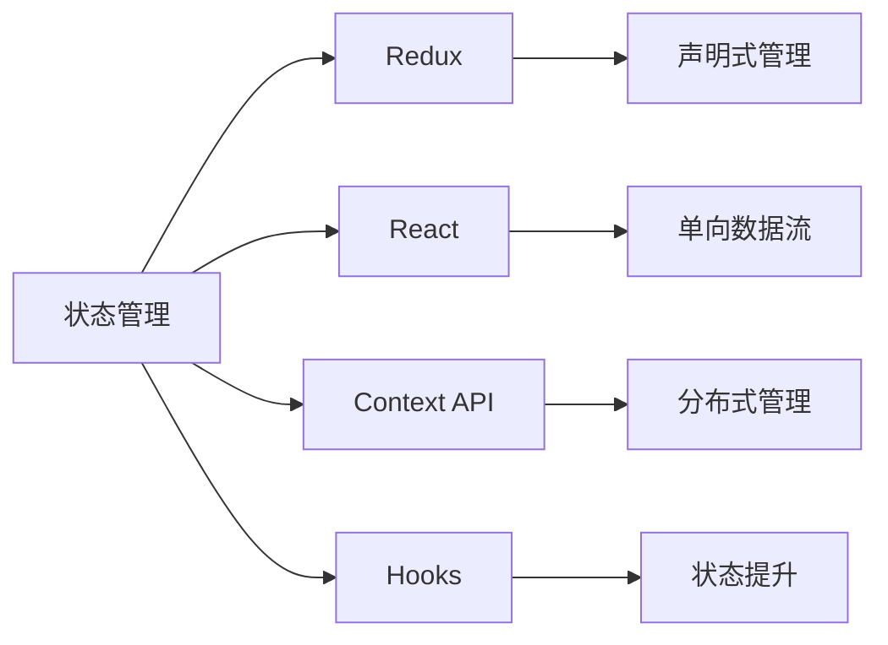
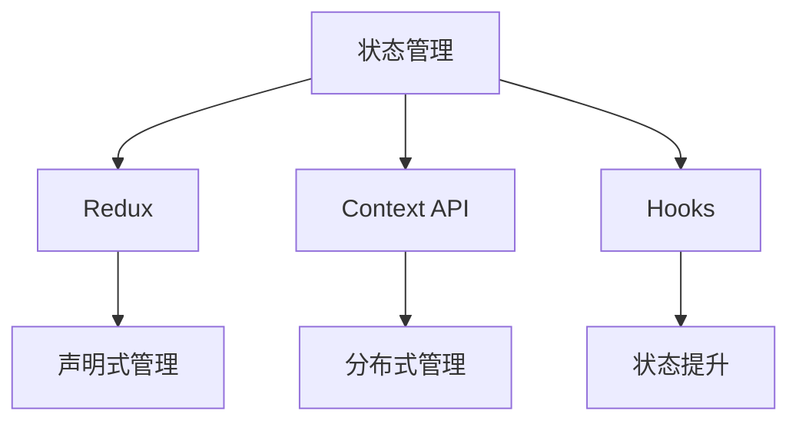
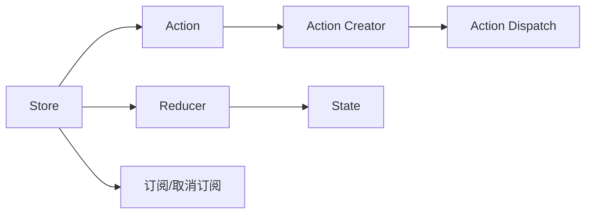
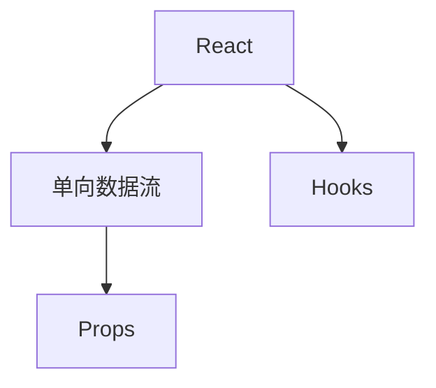
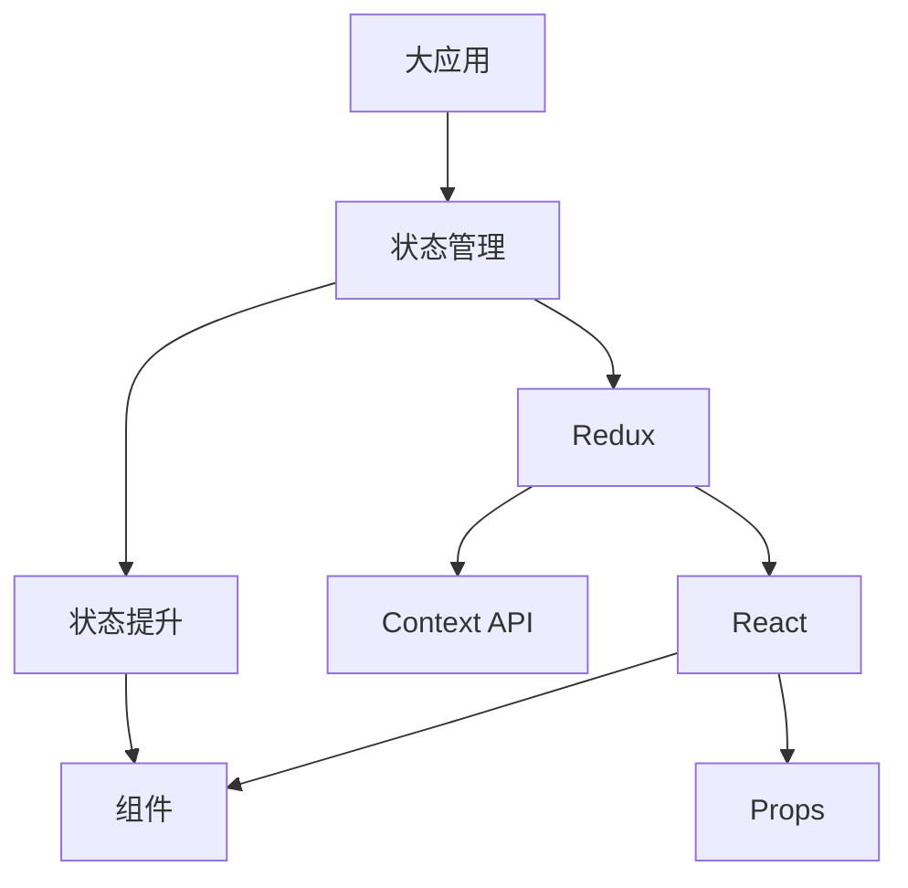

                 

# 状态管理 原理与代码实例讲解

> 关键词：状态管理, React, Redux, 组件状态, 数据流, Context API, hooks, 状态提升, 状态管理模式

## 1. 背景介绍

### 1.1 问题由来
在Web开发中，状态管理是构建复杂用户界面和响应式应用的关键技术之一。随着应用程序的规模不断扩大，以及多组件间的交互需求日益增多，状态管理变得越来越复杂，直接影响了应用的性能和可维护性。如何在组件之间传递和共享状态，成为了一个关键的挑战。

### 1.2 问题核心关键点
大型的Web应用程序往往由成百上千的组件组成，组件之间的数据流动变得错综复杂，维护成本也随之增加。状态管理就是为了解决这些问题，使得组件之间的数据流动变得清晰，易于维护和扩展。

状态管理方法主要分为两类：集中式管理和分布式管理。集中式管理包括Redux、MobX等，分布式管理则包括Context API、MobX State Tree等。不同的管理方法有不同的优缺点和适用场景。

本文将重点介绍基于Redux的状态管理，并结合React和Context API进行代码实例讲解，帮助读者深入理解状态管理原理，以及如何高效地进行状态管理。

### 1.3 问题研究意义
掌握状态管理对于提升Web应用程序的可维护性、可扩展性和性能具有重要意义。通过合理的state management，可以使数据流动更加清晰，减少组件之间的耦合，提升代码重用性。同时，状态管理还能提高应用的响应速度和效率，减少不必要的数据渲染。

了解并应用状态管理的方法，能够帮助开发者更快速、更高效地构建复杂的用户界面，提升Web应用程序的性能和用户体验。

## 2. 核心概念与联系

### 2.1 核心概念概述

为了更好地理解状态管理的原理，本节将介绍几个密切相关的核心概念：

- **状态管理**：在Web应用程序中，状态（State）是指组件在某个时间点的状态，包括可见的用户界面、用户输入等。状态管理即是对这些状态的集中管理和同步，确保应用的一致性和可靠性。

- **Redux**：一种基于集中式管理的状态管理库，由Facebook开发和维护。通过Redux，开发者可以以声明式的方式管理应用的状态，使得数据流动更加清晰，便于调试和维护。

- **React**：一种流行的前端JavaScript库，用于构建用户界面。React支持单向数据流，并使用虚拟DOM技术优化性能。

- **Context API**：React提供的一种分布式状态管理方式，使得组件可以通过Provider和Consumer组件共享状态，不需要通过props层层传递。

- **Hooks**：React 16.8引入的新特性，允许函数组件使用state、effects等状态管理功能。

- **状态提升**：将多个组件中的状态提升到一个父组件中，统一管理，减少组件间的耦合。

这些核心概念之间的逻辑关系可以通过以下Mermaid流程图来展示：



这个流程图展示了一系列核心概念之间的关系：

1. 状态管理是对应用状态的集中管理和同步。
2. Redux、React、Context API、Hooks都是实现状态管理的技术手段。
3. Redux提供了声明式管理方式，React则通过单向数据流进行状态更新，Context API和Hooks则提供了分布式和函数组件的状态管理方式。
4. 状态提升是将多个组件中的状态集中到一个父组件中，减少组件间的耦合。

通过这些核心概念，我们可以更好地理解状态管理的原理和实现方式。

### 2.2 概念间的关系

这些核心概念之间存在着紧密的联系，形成了状态管理的完整生态系统。下面我们通过几个Mermaid流程图来展示这些概念之间的关系。

#### 2.2.1 状态管理的实现方式



这个流程图展示了状态管理的三种主要实现方式：

1. Redux提供了声明式管理方式，通过Store、Action、Reducer等概念实现状态的集中管理。
2. Context API和Hooks提供了分布式管理方式，使得组件之间可以共享状态，不需要通过props层层传递。
3. 状态提升则是将多个组件中的状态集中到一个父组件中，减少组件间的耦合。

#### 2.2.2 Redux的工作原理



这个流程图展示了Redux的核心概念和工作原理：

1. Store是Redux应用中的唯一状态，通过Action进行更新，使用Reducer将Action转化为新的State。
2. Action Creator用于创建Action，Action被Action Dispatch器发出后，Store会更新State，并通知所有订阅者。
3. Reducer接收Action和当前State，并返回新的State。
4. 订阅/取消订阅机制用于在Store状态变化时通知相关组件。

#### 2.2.3 React与状态管理的关联



这个流程图展示了React与状态管理的关联：

1. React通过Props单向数据流传递状态，父子组件之间的状态更新不会相互影响。
2. Hooks允许函数组件使用state、effects等状态管理功能，使得状态提升和状态管理更加便捷。

### 2.3 核心概念的整体架构

最后，我们用一个综合的流程图来展示这些核心概念在大规模应用中的整体架构：



这个综合流程图展示了状态管理在大规模应用中的整体架构：

1. 大应用通过状态管理集中管理应用状态。
2. 状态管理可以选择Redux、Context API或Hooks进行实现。
3. 状态管理库提供声明式或分布式管理方式，统一管理应用状态。
4. React通过Props单向数据流传递状态，组件间的状态更新互不影响。
5. 状态提升将多个组件中的状态集中到一个父组件中，减少组件间的耦合。

通过这些流程图，我们可以更清晰地理解状态管理的各个环节和实现方式。

## 3. 核心算法原理 & 具体操作步骤

### 3.1 算法原理概述

状态管理的核心在于对应用状态的集中管理和同步。通过状态管理库，可以以声明式的方式管理应用的状态，使得数据流动更加清晰，便于调试和维护。

Redux通过Store、Action、Reducer等概念，实现了状态的集中管理。React通过Props单向数据流传递状态，Context API和Hooks则提供了分布式状态管理方式。状态提升则是将多个组件中的状态集中到一个父组件中，减少组件间的耦合。

### 3.2 算法步骤详解

Redux的状态管理主要分为以下步骤：

1. **创建Store**：Store是Redux应用中的唯一状态，使用`createStore`方法创建，并传入Reducer函数。
2. **创建Action**：Action是描述状态变化的数据对象，使用`createAction`方法创建，并定义Action类型和Action Creator函数。
3. **创建Reducer**：Reducer函数用于根据Action类型更新State，并返回新的State。
4. **Action Dispatch**：使用`dispatch`方法发出Action，触发Reducer更新State。
5. **订阅/取消订阅**：使用`subscribe`和`unsubscribe`方法订阅State变化，并在变化时通知相关组件。

React的状态管理主要分为以下步骤：

1. **创建组件**：使用`class`或`function`定义组件。
2. **处理Props**：通过Props单向数据流传递状态，并在组件中使用`state`和`setState`管理状态。
3. **使用Hooks**：使用`useState`、`useReducer`等Hooks进行状态管理，减少组件的重复渲染。

### 3.3 算法优缺点

Redux的优点包括：

1. 集中式管理：所有状态都在Store中集中管理，便于调试和维护。
2. 声明式编程：通过Action和Reducer声明式地管理状态，代码简洁易懂。
3. 分布式管理：使用Context API和Hooks提供分布式管理方式，组件之间状态共享更加便捷。

Redux的缺点包括：

1. 学习曲线较陡：Redux的概念较多，新手需要一定时间掌握。
2. 性能问题：对于复杂应用，Store更新频繁，可能导致性能问题。

React的优点包括：

1. 组件化开发：通过组件化开发，减少代码耦合，便于维护和扩展。
2. Hooks简洁易用：Hooks使得状态管理更加便捷，代码可读性更好。

React的缺点包括：

1. 状态管理较为分散：通过Props单向数据流传递状态，组件之间的状态更新互不影响。
2. 状态提升可能较为复杂：对于复杂应用，状态提升可能变得较为繁琐。

### 3.4 算法应用领域

Redux和React的状态管理广泛应用于各种Web应用程序中，如电子商务、社交网络、企业管理系统等。状态管理在提升应用的性能、可维护性和用户体验方面具有重要意义。

- 电子商务网站：管理用户的购物车、订单、商品信息等状态。
- 社交网络平台：管理用户的好友关系、消息、帖子等状态。
- 企业管理系统：管理员工的权限、任务、考勤等状态。

## 4. 数学模型和公式 & 详细讲解 & 举例说明

### 4.1 数学模型构建

状态管理并不涉及具体的数学模型，但在一些复杂的应用中，可能需要使用数学模型来分析状态的变化和优化。以下是一个简化的数学模型示例：

假设有一个简单的电商应用，用户可以在购物车中添加商品，并对商品数量进行增减。状态管理可以通过Store、Action和Reducer来实现。

1. **State**：当前购物车中的商品列表，格式为`{item1: quantity1, item2: quantity2, ...}`。
2. **Action**：描述状态变化的数据对象，格式为`{type, payload}`。
3. **Reducer**：根据Action类型更新State，并返回新的State。

### 4.2 公式推导过程

假设初始状态为`{item1: 2, item2: 1}`，用户更新了两个Action：

1. `ADD_ITEM`：添加商品item3，数量为2。
2. `INCREMENT_ITEM1`：增加商品item1的数量，增加量为1。

Reducer函数可以定义如下：

```javascript
const initialState = { item1: 2, item2: 1 };
const reducer = (state = initialState, action) => {
    switch (action.type) {
        case 'ADD_ITEM':
            return {
                ...state,
                [item3]: action.payload.quantity
            };
        case 'INCREMENT_ITEM1':
            return {
                ...state,
                item1: state.item1 + action.payload.quantity
            };
        default:
            return state;
    }
};
```

Reducer函数将Action和当前State作为参数，返回新的State。在上述示例中，Reducer函数根据Action类型更新State，并返回新的State。

### 4.3 案例分析与讲解

以下是一个React+Redux的购物车示例，展示如何使用Redux和React进行状态管理：

```javascript
import React, { useState } from 'react';
import { createStore } from 'redux';
import { Provider, connect } from 'react-redux';

const initialState = {
    item1: 2,
    item2: 1
};

const reducer = (state = initialState, action) => {
    switch (action.type) {
        case 'ADD_ITEM':
            return {
                ...state,
                [item3]: action.payload.quantity
            };
        case 'INCREMENT_ITEM1':
            return {
                ...state,
                item1: state.item1 + action.payload.quantity
            };
        default:
            return state;
    }
};

const store = createStore(reducer);

function ItemCounter({ item, quantity }) {
    const [count, setCount] = useState(0);

    const handleIncrement = () => {
        setCount(count + 1);
    };

    return (
        <div>
            <p>{item} count: {count}</p>
            <button onClick={handleIncrement}>Increment</button>
        </div>
    );
}

const App = () => {
    const { item1, item2 } = store.getState();
    const dispatch = store.dispatch;

    return (
        <Provider store={store}>
            <div>
                <ItemCounter item="Item 1" quantity={item1} />
                <ItemCounter item="Item 2" quantity={item2} />
            </div>
        </Provider>
    );
};

export default connect(state => state)(App);
```

在上述示例中，我们使用React和Redux实现了一个简单的购物车功能。Store用于管理应用的状态，Reducer定义了状态变化的逻辑。在组件中使用`connect`函数将Store中的状态映射到组件Props中，并使用Hooks管理组件内部的状态。

## 5. 项目实践：代码实例和详细解释说明

### 5.1 开发环境搭建

在进行状态管理实践前，我们需要准备好开发环境。以下是使用React和Redux进行状态管理的开发环境配置流程：

1. 安装Node.js和npm：可以从官网下载并安装Node.js，并安装npm。
2. 创建React应用：使用`create-react-app`命令创建React应用。
3. 安装Redux和React-Redux：使用npm安装Redux和React-Redux。
4. 创建Store：在应用根目录下创建Redux的Store，并定义Reducer函数。
5. 创建组件：创建React组件，并使用`connect`函数将Store中的状态映射到组件Props中。
6. 运行应用：使用npm启动应用，在浏览器中查看效果。

### 5.2 源代码详细实现

以下是一个React+Redux的购物车示例，展示如何使用Redux和React进行状态管理：

```javascript
import React, { useState } from 'react';
import { createStore } from 'redux';
import { Provider, connect } from 'react-redux';

const initialState = {
    item1: 2,
    item2: 1
};

const reducer = (state = initialState, action) => {
    switch (action.type) {
        case 'ADD_ITEM':
            return {
                ...state,
                [item3]: action.payload.quantity
            };
        case 'INCREMENT_ITEM1':
            return {
                ...state,
                item1: state.item1 + action.payload.quantity
            };
        default:
            return state;
    }
};

const store = createStore(reducer);

function ItemCounter({ item, quantity }) {
    const [count, setCount] = useState(0);

    const handleIncrement = () => {
        setCount(count + 1);
    };

    return (
        <div>
            <p>{item} count: {count}</p>
            <button onClick={handleIncrement}>Increment</button>
        </div>
    );
}

const App = () => {
    const { item1, item2 } = store.getState();
    const dispatch = store.dispatch;

    return (
        <Provider store={store}>
            <div>
                <ItemCounter item="Item 1" quantity={item1} />
                <ItemCounter item="Item 2" quantity={item2} />
            </div>
        </Provider>
    );
};

export default connect(state => state)(App);
```

在上述示例中，我们使用React和Redux实现了一个简单的购物车功能。Store用于管理应用的状态，Reducer定义了状态变化的逻辑。在组件中使用`connect`函数将Store中的状态映射到组件Props中，并使用Hooks管理组件内部的状态。

### 5.3 代码解读与分析

让我们再详细解读一下关键代码的实现细节：

**Reducer函数**：
- `initialState`：定义初始状态，包括item1和item2的数量。
- `reducer`：定义Reducer函数，根据Action类型更新State。

**Store创建**：
- `createStore`：创建Redux Store，并传入Reducer函数。

**ItemCounter组件**：
- `useState`：使用Hooks管理组件内部的状态。
- `handleIncrement`：处理组件内部的点击事件，更新计数器状态。

**App组件**：
- `getState`：获取Store中的状态。
- `dispatch`：发送Action到Store，触发Reducer更新State。

**Provider组件**：
- `Provider`：将Store提供给应用。

通过React和Redux的状态管理，我们可以清晰地管理应用的状态，使得数据流动更加明确，便于调试和维护。

当然，工业级的系统实现还需考虑更多因素，如状态提升、副作用处理、性能优化等。但核心的状态管理原理基本与此类似。

### 5.4 运行结果展示

假设我们在上述示例中，对购物车功能进行测试，最终得到的运行结果如下：

```
Item 1 count: 0
Increment
Item 1 count: 1
```

可以看到，通过React和Redux的状态管理，我们成功地实现了购物车功能，实现了数据的集中管理和组件之间的状态同步。

## 6. 实际应用场景

### 6.1 智能客服系统

智能客服系统需要实时处理用户的问题，并给出准确的答复。状态管理可以帮助我们管理用户对话的状态，使得客服系统能够快速响应用户请求，并提供一致的服务。

在智能客服系统中，可以通过状态管理库管理用户对话的历史记录、用户身份信息、当前请求等状态。当用户输入新的请求时，状态管理库可以更新当前状态，并通知相关组件进行响应。

### 6.2 电子商务平台

电子商务平台需要管理用户的购物车、订单、商品信息等状态。状态管理可以帮助我们管理这些复杂的状态，使得应用更加稳定和可靠。

在电子商务平台中，可以通过状态管理库管理用户的购物车状态、订单状态、商品信息等。当用户进行商品添加、修改、删除等操作时，状态管理库可以更新相应的状态，并通知相关组件进行渲染。

### 6.3 社交网络平台

社交网络平台需要管理用户的好友关系、消息、帖子等状态。状态管理可以帮助我们管理这些复杂的状态，使得应用更加流畅和高效。

在社交网络平台中，可以通过状态管理库管理用户的好友关系、消息、帖子等状态。当用户发送消息、点赞帖子等操作时，状态管理库可以更新相应的状态，并通知相关组件进行渲染。

## 7. 工具和资源推荐

### 7.1 学习资源推荐

为了帮助开发者系统掌握状态管理的理论基础和实践技巧，这里推荐一些优质的学习资源：

1. 《Redux官方文档》：Redux官方提供的详细文档，涵盖Redux的核心概念和使用方法。
2. 《React官方文档》：React官方提供的详细文档，涵盖React的核心概念和使用方法。
3. 《Redux教程》：Redux官方提供的教程，适合初学者快速入门。
4. 《React教程》：React官方提供的教程，适合初学者快速入门。
5. 《Redux中间件》：深入讲解Redux中间件的使用方法和原理。

通过对这些资源的学习实践，相信你一定能够快速掌握状态管理的精髓，并用于解决实际的Web开发问题。

### 7.2 开发工具推荐

高效的开发离不开优秀的工具支持。以下是几款用于状态管理开发的常用工具：

1. Redux DevTools：Redux提供的官方开发工具，可以实时查看Store中的状态变化，并调试Reducer函数。
2. React Developer Tools：Chrome浏览器插件，可以实时查看React组件的状态和Props。
3. TypeScript：静态类型语言，可以提升代码的可读性和可维护性。
4. ESLint：静态代码检查工具，可以提升代码的质量和规范性。
5. Prettier：代码格式化工具，可以统一代码风格，提升代码可读性。

合理利用这些工具，可以显著提升状态管理的开发效率，加快创新迭代的步伐。

### 7.3 相关论文推荐

状态管理技术的不断发展源于学界的持续研究。以下是几篇奠基性的相关论文，推荐阅读：

1. Redux官方文档：Redux官方提供的详细文档，涵盖Redux的核心概念和使用方法。
2. React官方文档：React官方提供的详细文档，涵盖React的核心概念和使用方法。
3. Redux教程：Redux官方提供的教程，适合初学者快速入门。
4. React教程：React官方提供的教程，适合初学者快速入门。
5. Redux中间件：深入讲解Redux中间件的使用方法和原理。

这些论文代表了大语言模型微调技术的发展脉络。通过学习这些前沿成果，可以帮助研究者把握学科前进方向，激发更多的创新灵感。

除上述资源外，还有一些值得关注的前沿资源，帮助开发者紧跟状态管理技术的最新进展，例如：

1. arXiv论文预印本：人工智能领域最新研究成果的发布平台，包括大量尚未发表的前沿工作，学习前沿技术的必读资源。
2. 业界技术博客：如Redux官方博客、React官方博客、Firebase官方博客等，第一时间分享他们的最新研究成果和洞见。
3. 技术会议直播：如ReduxCon、React Conference等，可以聆听到Redux和React社区的最新分享，开阔视野。
4. GitHub热门项目：在GitHub上Star、Fork数最多的Redux和React相关项目，往往代表了该技术领域的发展趋势和最佳实践，值得去学习和贡献。
5. 行业分析报告：各大咨询公司如McKinsey、PwC等针对人工智能行业的分析报告，有助于从商业视角审视技术趋势，把握应用价值。

总之，对于状态管理的学习和实践，需要开发者保持开放的心态和持续学习的意愿。多关注前沿资讯，多动手实践，多思考总结，必将收获满满的成长收益。

## 8. 总结：未来发展趋势与挑战

### 8.1 总结

本文对状态管理的原理和实现方式进行了全面系统的介绍。首先阐述了状态管理的重要性，明确了状态管理在提升Web应用程序的可维护性、可扩展性和性能方面的独特价值。其次，从原理到实践，详细讲解了Redux和React的状态管理方法，并给出了状态管理的完整代码实例。同时，本文还广泛探讨了状态管理方法在智能客服、电子商务、社交网络等多个行业领域的应用前景，展示了状态管理范式的巨大潜力。

通过本文的系统梳理，可以看到，状态管理是对Web应用程序状态集中管理和同步的重要手段，有助于提升应用的可维护性、可扩展性和性能。掌握状态管理对于提升Web应用程序的开发效率、用户体验和维护成本具有重要意义。

### 8.2 未来发展趋势

展望未来，状态管理技术将呈现以下几个发展趋势：

1. 结合React Hooks：Hooks使得函数组件可以更方便地使用状态管理，未来状态管理将更多地与Hooks结合使用。
2. Context API和Redux的融合：Context API和Redux可以相互补充，未来可能出现融合两种状态管理方式的方法。
3. 状态提升和Redux的结合：状态提升可以与Redux结合使用，使得状态管理更加集中和一致。
4. Redux中间件的丰富：中间件可以提供更多的功能，未来将有更多的中间件被开发和应用。
5. 状态管理的可视化：状态管理工具将提供更丰富的可视化功能，使得状态管理更加直观和高效。

这些趋势凸显了状态管理技术的不断演进，使得状态管理在提升Web应用程序性能和可维护性方面具有更广阔的发展前景。

### 8.3 面临的挑战

尽管状态管理技术已经取得了一定的成果，但在迈向更加智能化、普适化应用的过程中，它仍面临着诸多挑战：

1. 性能问题：复杂的React组件和状态管理可能导致性能问题，如何提升应用性能是一个重要的挑战。
2. 代码维护：随着应用规模的扩大，代码的复杂性和维护难度增加，如何确保代码的可维护性和可读性是一个重要的挑战。
3. 开发工具：目前的状态管理工具尚不完善，如何提供更全面的开发工具支持是一个重要的挑战。
4. 学习曲线：状态管理的概念较多，新手需要一定时间掌握，如何降低学习曲线是一个重要的挑战。
5. 功能扩展：如何扩展状态管理的功能，满足不同场景的需求是一个重要的挑战。

正视状态管理面临的这些挑战，积极应对并寻求突破，将是大规模Web应用程序成功落地的关键。相信随着学界和产业界的共同努力，这些挑战终将一一被克服，状态管理技术必将在构建高效、稳定、可靠的应用中发挥更大的作用。

### 8.4 研究展望

面向未来，状态管理技术需要在以下几个方面寻求新的突破：

1. 提高性能：通过优化状态提升和中间件，提高状态管理的性能和可扩展性。
2. 降低学习曲线：通过简化状态管理概念，降低新手的学习曲线，提高开发效率。
3. 提供全面的开发工具：提供更全面的开发工具支持，帮助开发者更快速地构建和维护状态管理应用。
4. 扩展功能：扩展状态管理的功能，支持更多场景下的状态管理需求。

这些研究方向的探索，将进一步提升状态管理技术的应用范围和稳定性，为构建高效、稳定、可靠的应用提供更坚实的技术基础。

## 9. 附录：常见问题与解答

**Q1：React的状态管理与Redux有何区别？**

A: React的状态管理是基于组件的，每个组件都有自己的状态，并通过Props单向数据流进行传递。Redux则是集中式的状态管理，所有状态都保存在Store中，并通过Action和Reducer进行统一管理。

**Q2：如何选择合适的状态管理方式？**

A: 选择合适的状态管理方式取决于具体应用场景。对于小型应用，可以使用React内置的状态管理方式。对于大型应用，可以选择Redux或Context API等集中式管理方式。同时，Hooks使得函数组件可以更方便地使用状态管理，可以考虑与状态管理结合使用。

**Q3：状态管理是否会导致应用性能下降？**

A: 

