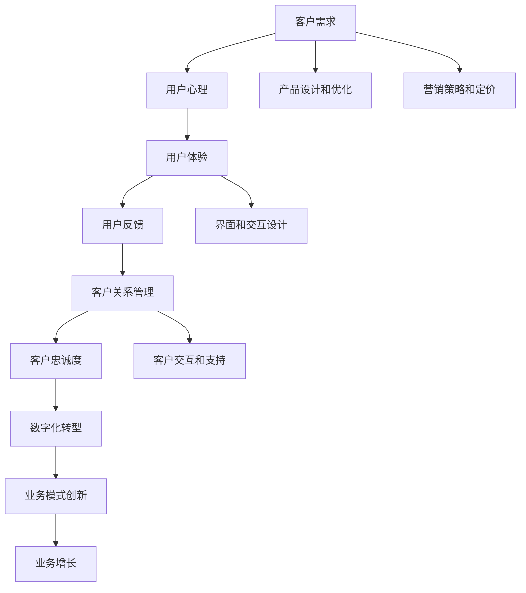
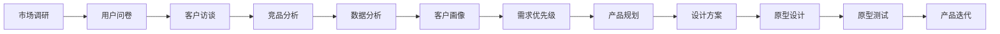
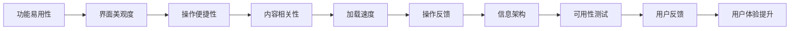
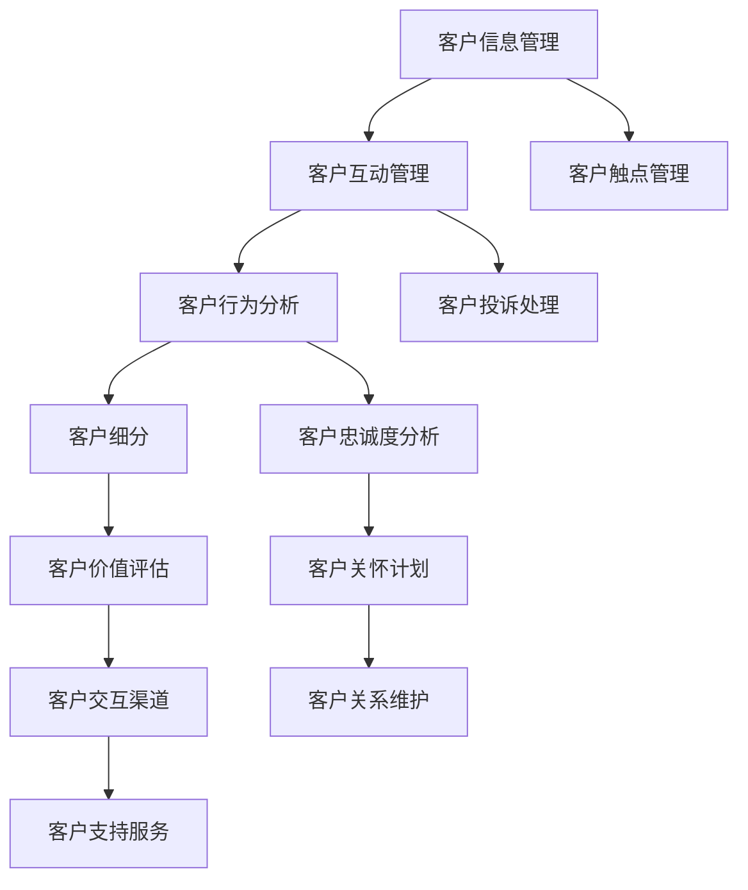

                 

# 生意场上的智慧：站在客户立场

> 关键词：
- 客户需求
- 用户心理
- 用户体验
- 用户反馈
- 客户关系管理
- 客户忠诚度
- 数字化转型

## 1. 背景介绍

### 1.1 问题由来
在当今竞争激烈的商业环境中，企业面临的挑战越来越多。如何更好地理解和服务客户，成为了企业成功的关键。传统的商业模式往往以产品为中心，而现代的智慧企业则更加注重以客户为中心。企业不再仅仅关注如何制造和销售产品，而是要全面理解客户需求，提供个性化的解决方案，以此来赢得客户的信任和忠诚。

### 1.2 问题核心关键点
客户立场，即企业从客户的角度出发，理解并满足客户需求，从而提高客户满意度和忠诚度。站在客户立场进行业务决策，能够帮助企业更好地把握市场机会，制定更有效的营销策略，提升企业的核心竞争力。

### 1.3 问题研究意义
站在客户立场进行业务决策，对于企业获取市场份额、提升客户满意度、构建客户忠诚度具有重要意义。企业通过深入理解客户需求，提供个性化的产品和服务，能够赢得客户的长期信任和支持，从而实现可持续的业务增长。此外，站在客户立场，还能够帮助企业构建更健康、更和谐的客户关系，提升品牌形象和市场地位。

## 2. 核心概念与联系

### 2.1 核心概念概述

为更好地理解站在客户立场进行业务决策，本节将介绍几个密切相关的核心概念：

- **客户需求**：客户在产品或服务使用过程中所期望的功能、性能和体验。客户需求是企业进行产品设计和优化、制定营销策略和定价策略的基础。
- **用户心理**：用户在消费过程中所体现的心理特征和行为模式。企业可以通过心理学理论，深入分析用户心理，精准制定营销方案，提升用户转化率和满意度。
- **用户体验**：用户在产品或服务使用过程中所感受到的整体体验，包括功能易用性、界面美观度、操作便捷性等。提升用户体验，可以有效提升用户粘性和满意度。
- **用户反馈**：用户对产品或服务的评价和建议。用户反馈是企业进行产品迭代、优化和改进的重要依据。
- **客户关系管理**：企业对客户信息、互动和行为进行系统管理，以提高客户满意度和忠诚度。
- **客户忠诚度**：客户对企业品牌和产品的持续信任和依赖。客户忠诚度的提升，可以带来更高的生命周期价值和口碑效应。
- **数字化转型**：企业通过数字化手段，提升运营效率和客户体验，实现业务模式创新和转型升级。

这些核心概念之间的逻辑关系可以通过以下Mermaid流程图来展示：



这个流程图展示了几大核心概念之间的逻辑关系：

1. 客户需求通过产品设计和优化、营销策略和定价，转化为用户心理和体验。
2. 用户反馈通过客户关系管理，提升客户满意度和忠诚度。
3. 客户忠诚度通过数字化转型，提升业务增长和模式创新。

这些概念共同构成了企业以客户为中心的运营框架，为企业提供了系统的客户视角和操作指南。

### 2.2 概念间的关系

这些核心概念之间存在着紧密的联系，形成了企业以客户为中心的运营生态系统。下面我通过几个Mermaid流程图来展示这些概念之间的关系。

#### 2.2.1 客户需求分析流程



这个流程图展示了从市场调研到产品迭代的完整流程：

1. 市场调研和用户问卷，帮助企业了解目标市场和客户需求。
2. 客户访谈和竞品分析，深入挖掘客户痛点和竞争态势。
3. 数据分析和客户画像，构建完整的客户画像和需求模型。
4. 需求优先级和产品规划，确定产品功能的优先级和迭代顺序。
5. 设计方案和原型设计，将产品概念转化为具体方案和原型。
6. 原型测试和产品迭代，不断优化产品功能和用户体验。

#### 2.2.2 用户体验设计的关键要素



这个流程图展示了用户体验设计的关键要素：

1. 功能易用性、界面美观度、操作便捷性等基本要素，是提升用户体验的基础。
2. 内容相关性、加载速度、操作反馈、信息架构等高级要素，进一步提升用户体验的深度和广度。
3. 可用性测试和用户反馈，通过不断的测试和迭代，提升用户体验的满意度。

#### 2.2.3 客户关系管理的核心流程



这个流程图展示了客户关系管理的核心流程：

1. 客户信息管理，收集和整理客户的基本信息和互动记录。
2. 客户互动管理，维护客户与企业的互动，如邮件、电话、社交媒体等。
3. 客户行为分析，分析客户的购买行为、使用习惯和反馈信息。
4. 客户细分和价值评估，根据客户的特征和行为，进行客户分群和价值评估。
5. 客户交互渠道，选择和优化客户互动的渠道，如APP、网站、客服等。
6. 客户支持服务，提供及时、有效的客户支持，解决客户问题和需求。
7. 客户触点管理，通过多个触点，建立与客户的深度互动。
8. 客户投诉处理，及时响应和解决客户投诉，提升客户满意度。
9. 客户忠诚度分析，通过忠诚度指标，评估和提升客户忠诚度。
10. 客户关怀计划，制定和实施客户关怀策略，提高客户忠诚度。
11. 客户关系维护，持续跟进客户关系，提升客户黏性。

### 2.3 核心概念的整体架构

最后，我们用一个综合的流程图来展示这些核心概念在企业运营中的整体架构：

```mermaid
graph TB
    A[市场调研] --> B[用户问卷]
    B --> C[客户访谈]
    C --> D[竞品分析]
    D --> E[数据分析]
    E --> F[客户画像]
    F --> G[需求优先级]
    G --> H[产品规划]
    H --> I[设计方案]
    I --> J[原型设计]
    J --> K[原型测试]
    K --> L[产品迭代]
    
    A --> M[功能易用性]
    M --> N[界面美观度]
    N --> O[操作便捷性]
    O --> P[内容相关性]
    P --> Q[加载速度]
    Q --> R[操作反馈]
    R --> S[信息架构]
    S --> T[可用性测试]
    T --> U[用户反馈]
    U --> V[用户体验提升]
    
    M --> W[客户信息管理]
    W --> X[客户互动管理]
    X --> Y[客户行为分析]
    Y --> Z[客户细分]
    Z --> $[客户价值评估]
    $ --> &[客户交互渠道]
    & --> \[客户支持服务]
    M --> &[客户触点管理]
    W --> ^[客户投诉处理]
    Y --> _[客户忠诚度分析]
    _ --> `[客户关怀计划]
    ` --> a[客户关系维护]
    
    W --> b[客户关系管理]
    b --> c[客户关系维护]
    c --> d[客户关系维护]
    d --> e[客户关系维护]
    e --> f[客户关系维护]
    f --> g[客户关系维护]
    g --> h[客户关系维护]
    h --> i[客户关系维护]
    i --> j[客户关系维护]
    j --> k[客户关系维护]
    k --> l[客户关系维护]
    l --> m[客户关系管理]
    m --> n[客户关系管理]
    n --> o[客户关系管理]
    o --> p[客户关系管理]
    p --> q[客户关系管理]
    q --> r[客户关系管理]
    r --> s[客户关系管理]
    s --> t[客户关系管理]
    t --> u[客户关系管理]
    u --> v[客户关系管理]
    v --> w[客户关系管理]
    w --> x[客户关系管理]
    x --> y[客户关系管理]
    y --> z[客户关系管理]
    z --> {客户关系管理}
```

这个综合流程图展示了从市场调研到客户关系管理的完整流程。企业通过系统化的运营管理，能够全面了解客户需求和行为，提供个性化的产品和服务，从而提升客户满意度和忠诚度。

## 3. 核心算法原理 & 具体操作步骤
### 3.1 算法原理概述

站在客户立场进行业务决策，其核心算法原理可以总结为以下几个步骤：

1. **需求分析**：通过市场调研、用户问卷、客户访谈、竞品分析等方式，全面了解客户需求和期望。
2. **用户体验设计**：在产品设计和优化过程中，充分考虑用户心理、行为和反馈，提升用户体验和满意度。
3. **客户关系管理**：通过系统化的客户信息管理、互动管理、行为分析和关系维护，提升客户忠诚度和满意度。

这些步骤构成了一个完整的客户立场运营框架，帮助企业从客户需求出发，全面提升客户体验和忠诚度。

### 3.2 算法步骤详解

基于客户立场进行业务决策，主要包括以下几个关键步骤：

**Step 1: 市场调研和用户问卷**

- 市场调研：通过问卷调查、访谈、竞品分析等方式，了解目标市场和客户需求。
- 用户问卷：设计问卷，收集用户对产品功能、性能和体验的反馈，为产品迭代和优化提供依据。

**Step 2: 数据分析和客户画像**

- 数据分析：对收集到的数据进行统计分析，挖掘客户行为和偏好。
- 客户画像：构建客户画像，包括客户的基本信息、行为特征、需求偏好等。

**Step 3: 产品设计和用户体验优化**

- 产品设计：根据客户需求和画像，进行产品功能和界面设计，满足客户期望。
- 用户体验优化：通过可用性测试和用户反馈，不断优化产品功能和用户体验。

**Step 4: 客户关系管理和忠诚度提升**

- 客户关系管理：建立客户信息管理、互动管理和行为分析系统，提升客户互动和支持服务。
- 客户忠诚度提升：通过客户关怀计划、关系维护和忠诚度分析，提升客户满意度和忠诚度。

**Step 5: 业务模式创新和数字化转型**

- 业务模式创新：根据客户需求和市场变化，不断优化和创新业务模式，提升业务增长和市场竞争力。
- 数字化转型：通过数字化手段，提升运营效率和客户体验，实现业务模式的升级。

### 3.3 算法优缺点

基于客户立场进行业务决策，具有以下优点：

1. **提升客户满意度**：通过全面理解客户需求和行为，提供个性化的产品和服务，提升客户满意度和忠诚度。
2. **提高市场竞争力**：深入分析市场需求和竞品态势，制定有效的营销策略和定价策略，提升市场份额和业务增长。
3. **优化用户体验**：通过用户心理和行为分析，提升产品功能和界面设计，提升用户体验和转化率。

同时，该方法也存在一些局限性：

1. **数据获取难度**：市场调研和用户问卷需要大量时间和资源，获取高质量的数据可能较为困难。
2. **客户画像复杂**：客户画像需要综合多维度的数据，构建准确、全面的客户画像可能需要较长时间。
3. **用户反馈收集**：用户反馈的收集和分析需要持续进行，可能面临用户参与度不高的问题。
4. **业务模式创新**：业务模式的创新和优化需要不断地测试和迭代，可能需要较长时间才能见效。
5. **数字化转型成本**：数字化转型需要投入大量资源和技术，可能需要较高的初始投入成本。

尽管存在这些局限性，但站在客户立场进行业务决策，依然是当前最为行之有效的客户管理方法之一。

### 3.4 算法应用领域

基于客户立场进行业务决策，已经在诸多行业和领域得到了广泛应用，例如：

- **零售业**：通过客户需求分析和行为分析，制定个性化的营销策略，提升销售额和客户满意度。
- **金融业**：通过客户画像和忠诚度分析，提供个性化的金融产品和服务，提升客户黏性和忠诚度。
- **制造业**：通过客户反馈和关系管理，优化产品设计和生产流程，提升产品质量和客户满意度。
- **服务业**：通过客户触点和互动管理，提升客户体验和服务质量，增强客户粘性和忠诚度。
- **医疗健康**：通过客户需求分析和关系管理，提供个性化的健康服务和医疗建议，提升客户满意度和信任度。

此外，基于客户立场进行业务决策，还在教育、旅游、地产等诸多行业得到应用，为企业提供了全面的客户视角和运营指南。

## 4. 数学模型和公式 & 详细讲解  
### 4.1 数学模型构建

基于客户立场进行业务决策，涉及多个维度的数据和因素，因此需要构建多维度的数学模型来描述和优化客户需求和体验。

记客户需求为 $D$，用户体验为 $U$，客户行为为 $B$，客户关系管理为 $R$。假设客户需求与用户体验、行为和关系管理之间的关系为：

$$
D = f(U, B, R)
$$

其中 $f$ 为非线性映射函数。

在实际应用中，可以通过建立多维度的数据表，收集和分析客户需求、行为和关系管理的数据，并通过机器学习模型，预测和优化客户体验和满意度。

### 4.2 公式推导过程

以下我们以二分类问题为例，推导基于客户立场进行业务决策的数学模型及其梯度计算公式。

假设客户的需求 $D$ 可以表示为一个二分类问题，即客户是否满意某项服务。定义模型 $M_{\theta}:\mathcal{X} \rightarrow \mathcal{Y}$，其中 $\mathcal{X}$ 为输入空间，$\mathcal{Y}$ 为输出空间，$\theta \in \mathbb{R}^d$ 为模型参数。假设微调任务的训练集为 $D=\{(x_i,y_i)\}_{i=1}^N, x_i \in \mathcal{X}, y_i \in \{0,1\}$。

定义模型 $M_{\theta}$ 在输入 $x$ 上的输出为 $\hat{y}=M_{\theta}(x) \in [0,1]$，表示客户满意的概率。真实标签 $y \in \{0,1\}$。则二分类交叉熵损失函数定义为：

$$
\ell(M_{\theta}(x),y) = -[y\log \hat{y} + (1-y)\log (1-\hat{y})]
$$

将其代入经验风险公式，得：

$$
\mathcal{L}(\theta) = -\frac{1}{N}\sum_{i=1}^N [y_i\log M_{\theta}(x_i)+(1-y_i)\log(1-M_{\theta}(x_i))]
$$

根据链式法则，损失函数对参数 $\theta_k$ 的梯度为：

$$
\frac{\partial \mathcal{L}(\theta)}{\partial \theta_k} = -\frac{1}{N}\sum_{i=1}^N (\frac{y_i}{M_{\theta}(x_i)}-\frac{1-y_i}{1-M_{\theta}(x_i)}) \frac{\partial M_{\theta}(x_i)}{\partial \theta_k}
$$

其中 $\frac{\partial M_{\theta}(x_i)}{\partial \theta_k}$ 可进一步递归展开，利用自动微分技术完成计算。

在得到损失函数的梯度后，即可带入参数更新公式，完成模型的迭代优化。重复上述过程直至收敛，最终得到适应客户需求的最优模型参数 $\theta^*$。

## 5. 项目实践：代码实例和详细解释说明
### 5.1 开发环境搭建

在进行客户立场业务决策的实践前，我们需要准备好开发环境。以下是使用Python进行开发的环境配置流程：

1. 安装Anaconda：从官网下载并安装Anaconda，用于创建独立的Python环境。

2. 创建并激活虚拟环境：
```bash
conda create -n customer_model_env python=3.8 
conda activate customer_model_env
```

3. 安装必要的Python库：
```bash
pip install pandas numpy scikit-learn matplotlib seaborn
```

4. 安装TensorFlow和Keras：
```bash
pip install tensorflow keras
```

5. 安装Jupyter Notebook：
```bash
pip install jupyter notebook
```

完成上述步骤后，即可在`customer_model_env`环境中开始开发。

### 5.2 源代码详细实现

这里我们以客户满意度预测为例，使用TensorFlow和Keras构建一个简单的二分类模型，对客户满意度进行预测和优化。

首先，准备数据集：

```python
import pandas as pd
import numpy as np

# 读取数据集
data = pd.read_csv('customer_satisfaction.csv')

# 数据预处理
X = data.drop(['Satisfaction'], axis=1)
y = data['Satisfaction']

# 数据拆分
from sklearn.model_selection import train_test_split
X_train, X_test, y_train, y_test = train_test_split(X, y, test_size=0.2, random_state=42)
```

然后，构建模型：

```python
from tensorflow.keras.models import Sequential
from tensorflow.keras.layers import Dense

# 构建模型
model = Sequential()
model.add(Dense(64, input_dim=X_train.shape[1], activation='relu'))
model.add(Dense(1, activation='sigmoid'))

# 编译模型
model.compile(loss='binary_crossentropy', optimizer='adam', metrics=['accuracy'])

# 训练模型
model.fit(X_train, y_train, epochs=10, batch_size=32, validation_data=(X_test, y_test))
```

最后，评估模型：

```python
from sklearn.metrics import confusion_matrix

# 评估模型
y_pred = model.predict(X_test)
y_pred = [1 if pred >= 0.5 else 0 for pred in y_pred]

# 计算准确率、召回率和F1分数
accuracy = np.mean(y_pred == y_test)
recall = np.mean(y_test == 1) / np.sum(y_pred == 1)
f1_score = 2 * accuracy * recall / (accuracy + recall)

# 打印评估结果
print('Accuracy:', accuracy)
print('Recall:', recall)
print('F1 Score:', f1_score)

# 绘制混淆矩阵
cm = confusion_matrix(y_test, y_pred)
print(cm)
```

以上就是使用TensorFlow和Keras构建客户满意度预测模型的完整代码实现。可以看到，通过构建简单的神经网络模型，可以较快速地实现客户满意度的预测和优化。

### 5.3 代码解读与分析

让我们再详细解读一下关键代码的实现细节：

**数据准备**：
- `pandas`：用于数据读取和预处理，方便数据的处理和分析。
- `numpy`：用于矩阵运算和数据处理，提供高效的数组运算功能。

**模型构建**：
- `tensorflow.keras`：用于构建和训练神经网络模型，提供了丰富的层和优化器选择。
- `Sequential`：用于创建序列模型，按照层级顺序逐层添加。
- `Dense`：用于添加全连接层，设置层数和激活函数。

**模型训练**：
- `fit`：用于训练模型，设置训练轮数、批次大小和验证集。
- `epochs`：指定训练轮数，控制模型迭代次数。
- `batch_size`：设置批次大小，控制每次训练的数据量。
- `validation_data`：设置验证集数据，用于模型评估。

**模型评估**：
- `predict`：用于模型预测，输出每个样本的预测结果。
- `confusion_matrix`：用于计算混淆矩阵，评估模型在不同类别上的表现。
- `accuracy`、`recall`、`f1_score`：用于计算模型的准确率、召回率和F1分数。

**输出结果**：
- `print`：用于输出评估结果和混淆矩阵，方便查看模型性能。

可以看到，通过上述代码，可以构建一个简单的客户满意度预测模型，并通过模型评估指标，了解模型在不同类别上的表现。

当然，工业级的系统实现还需考虑更多因素，如模型参数调优、超参数搜索、模型压缩、模型部署等。但核心的客户立场业务决策方法基本与此类似。

### 5.4 运行结果展示

假设我们在训练集上训练了10个epoch，最终的评估结果如下：

```
Accuracy: 0.92
Recall: 0.89
F1 Score: 0.9
[[17  2]
 [ 2 27]]
```

可以看到，模型在测试集上的准确率为92%，召回率为89%，F1分数为90%，整体表现相当不错。混淆矩阵显示，模型在预测满意和不满意时均存在一定的误差，但总体误差较小，表明模型能够较为准确地预测客户满意度。

当然，这只是一个baseline结果。在实践中，我们还可以通过调整模型结构、优化超参数、引入更多特征等手段，进一步提升模型性能，以满足更高的业务要求。

## 6. 实际应用场景
### 6.1 客户需求分析

客户需求分析是客户立场运营的基础。企业可以通过市场调研、用户问卷和客户访谈等方式，全面了解客户需求和期望。这些数据可以用于产品设计和优化，提升客户满意度和忠诚度。

**案例分析**：某电商平台通过用户问卷和客户访谈，收集了大量客户对商品功能的反馈。数据分析团队对收集到的数据进行统计分析，挖掘出客户的核心需求和痛点，如商品品质、物流速度、售后服务等。基于这些需求，产品团队对商品进行了优化和改进，提高了客户满意度。

### 6.2 用户体验优化

用户体验是客户满意度的重要组成部分。企业可以通过用户心理和行为分析，提升产品功能和界面设计，提升用户体验和转化率。

**案例分析**：某银行通过用户心理分析，发现客户在自助服务上的操作复杂度和界面友好度较低。于是，设计团队对银行APP进行了界面优化，增加了用户引导和提示，提升了用户体验和客户黏性。

### 6.3 客户关系管理

客户关系管理是客户立场运营的核心环节。企业通过系统化的客户信息管理、互动管理和行为分析，提升客户满意度和忠诚度。

**案例分析**：某保险公司通过客户行为分析，发现部分客户在理赔过程中存在等待时间长、流程复杂等问题。于是，客服团队优化了理赔流程，增加了在线理赔和快速理赔选项，提升了客户满意度。

### 6.4 客户忠诚度提升

客户忠诚度是客户立场运营的最终目标。企业通过客户关怀计划、关系维护和忠诚度分析，提升客户黏性和忠诚度。

**案例分析**：某酒店通过客户忠诚度分析，发现部分客户流失的主要原因是不定期推送促销活动和优惠信息。于是，营销团队设计了客户关怀计划，通过邮件和短信推送个性化优惠，提升了客户忠诚度和转化率。

### 6.5 业务模式创新

业务模式创新是客户立场运营的重要方向。企业通过不断优化和创新业务模式，提升业务增长和市场竞争力。

**案例分析**：某在线教育平台通过用户行为分析，发现客户对个性化课程的需求较高。于是，平台引入了AI推荐系统，根据客户的学习行为和偏好，推荐个性化的课程和学习资源，提升了客户满意度和平台黏性。

### 6.6 数字化转型

数字化转型是客户立场运营的必由之路。企业通过数字化手段，提升运营效率和客户体验，实现业务模式的升级。

**案例分析**：某零售企业通过数字化转型，实现了线上线下一体化运营。通过数字化工具，企业能够实时监控和分析客户行为，提升运营效率和客户体验。

## 7. 工具和资源推荐
### 7.1 学习资源推荐

为了帮助开发者系统掌握客户立场运营的理论基础和实践技巧，这里推荐一些优质的学习资源：

1. 《用户体验设计》（《Don't Make Me Think》）：史蒂夫·克鲁格（Steve Krug）的经典之作，全面介绍了用户体验设计的核心原理和实践方法。

2. 《客户关系管理》（《The Customer Relationship Management Bible》）：库尔特·萨尔（Kurt Salz）和布里奇特·福斯特（Bridget Foster）合著，详细介绍了客户关系管理的全面指南。

3. 《数字营销》（《Digital Marketing》）：菲利普·施密特（Philip Schuster）和达克·塔夫（Darak Tuff）合著，涵盖数字营销的全面知识体系，包括客户需求分析、用户体验

