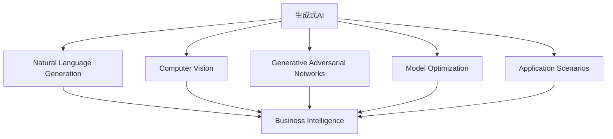
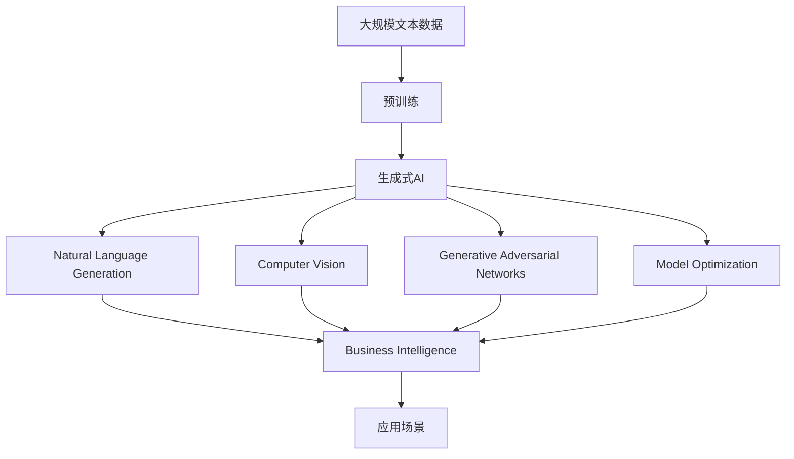

                 

# 生成式AIGC：商业智能的未来趋势

> 关键词：生成式AI, AIGC, 商业智能, 自然语言生成, 计算机视觉, 生成对抗网络, 模型优化, 应用场景

## 1. 背景介绍

### 1.1 问题由来

随着人工智能技术的迅猛发展，生成式人工智能（Generative AI, GAI）成为了当前技术创新的热点。特别是在商业智能（Business Intelligence, BI）领域，生成式AI的应用极大地提升了数据分析、报告生成、决策支持等方面的能力，使商业智能系统变得更加智能化、自动化。本文旨在探讨生成式AI在商业智能中的应用前景，分析其核心概念与技术原理，并展望未来发展趋势。

### 1.2 问题核心关键点

生成式AI在商业智能中的应用，主要体现在以下几个方面：

- **自然语言生成**：通过生成自然语言文本，自动撰写报告、分析结果、生成摘要等。
- **计算机视觉**：通过生成图像、视频，提供直观的数据展示和视觉化分析。
- **生成对抗网络**：利用生成对抗网络（GAN）生成模拟数据，用于数据增强、模型训练等。
- **模型优化**：通过生成式方法，优化机器学习模型，提升预测准确率和泛化能力。
- **应用场景**：广泛应用于销售分析、客户洞察、市场预测、风险管理等领域，助力企业决策。

这些应用不仅降低了人力成本，提高了数据处理效率，还增强了商业智能系统的智能化水平，为企业的决策支持提供了更有力的支撑。

### 1.3 问题研究意义

生成式AI在商业智能中的应用，对于推动商业智能技术的发展具有重要意义：

1. **提高决策效率**：自动生成数据分析报告、预测结果，快速响应商业决策需求。
2. **增强数据分析深度**：通过生成式方法，挖掘更深层次的数据关联和洞见。
3. **提升用户体验**：直观的数据可视化，有助于企业员工更易理解数据信息，提高决策质量。
4. **降低成本**：减少人工编写报告、分析的时间，降低企业成本。
5. **实现自主学习**：生成式AI能够不断学习、迭代，提升商业智能系统的自主学习能力。

通过深入研究生成式AI在商业智能中的应用，可以更好地理解其工作原理和优化策略，为实际应用提供参考。

## 2. 核心概念与联系

### 2.1 核心概念概述

为了更好地理解生成式AI在商业智能中的应用，本节将介绍几个密切相关的核心概念：

- **生成式AI**：指使用生成模型（如神经网络）生成新数据或内容的技术。
- **AIGC**：即生成式人工智能，通过生成式模型自动化生成文本、图像、音频等内容。
- **自然语言生成**：指使用模型自动生成自然语言文本，如报告、摘要、对话等。
- **计算机视觉**：指使用模型自动生成图像、视频等视觉内容。
- **生成对抗网络**：指一种通过生成器和判别器两个模型对抗训练生成新数据的模型。
- **模型优化**：指通过生成式方法优化已有模型，提升其性能。
- **应用场景**：指生成式AI在商业智能中的应用领域，如销售分析、客户洞察、市场预测等。

这些核心概念之间存在着紧密的联系，共同构成了生成式AI在商业智能中的应用框架。

### 2.2 概念间的关系

这些核心概念之间可以通过以下Mermaid流程图来展示：



这个流程图展示了生成式AI在商业智能中的应用流程：

1. 生成式AI提供自然语言生成、计算机视觉、生成对抗网络、模型优化等核心能力。
2. 这些能力被应用于销售分析、客户洞察、市场预测等商业智能场景。
3. 通过自然语言生成、计算机视觉、生成对抗网络、模型优化等技术，商业智能系统能够提供更智能、高效的分析结果。

通过这个流程图，我们可以更清晰地理解生成式AI在商业智能中的应用逻辑。

### 2.3 核心概念的整体架构

最后，我们用一个综合的流程图来展示这些核心概念在生成式AI在商业智能中的应用整体架构：



这个综合流程图展示了从预训练到生成式AI，再到商业智能应用的整体架构。通过这一架构，我们可以更好地理解生成式AI在商业智能中的应用流程和核心技术。

## 3. 核心算法原理 & 具体操作步骤
### 3.1 算法原理概述

生成式AI在商业智能中的应用，主要基于生成模型，通过学习大规模数据，生成新的数据或内容。其核心算法包括自然语言生成模型、计算机视觉生成模型和生成对抗网络。

自然语言生成模型主要通过序列生成模型，如RNN、Transformer等，自动生成自然语言文本。计算机视觉生成模型则通过生成对抗网络等模型，自动生成图像、视频等视觉内容。生成对抗网络通过对抗训练，生成高质量的模拟数据，用于数据增强、模型训练等。

生成式AI的核心算法原理可以概括为：

1. **数据准备**：收集大规模的数据集，作为训练生成模型的输入。
2. **模型训练**：使用深度学习模型，对输入数据进行训练，学习生成目标数据或内容。
3. **生成数据**：使用训练好的模型，生成新的数据或内容，用于商业智能应用。
4. **模型优化**：对生成的数据进行评估，不断优化模型，提升生成效果。

### 3.2 算法步骤详解

生成式AI在商业智能中的应用，一般包括以下关键步骤：

**Step 1: 数据准备**
- 收集商业智能相关的数据集，如销售数据、客户行为数据、市场调研数据等。
- 对数据进行清洗、标注、归一化等预处理，确保数据质量。

**Step 2: 模型选择**
- 根据应用场景选择合适的生成模型，如自然语言生成模型（如GPT、BART等）、计算机视觉生成模型（如GANs、VQ-VAE等）。
- 确定模型架构、参数等超参数，设定训练策略。

**Step 3: 模型训练**
- 使用收集到的数据对生成模型进行训练，最小化生成数据与目标数据之间的差异。
- 在训练过程中，使用对抗训练、正则化等技术，提高生成质量。

**Step 4: 数据生成**
- 使用训练好的模型，生成新的商业智能数据，如文本、图像等。
- 对生成的数据进行评估，确保数据质量符合商业智能应用的需求。

**Step 5: 应用融合**
- 将生成的数据与现有商业智能系统融合，进行数据分析、预测、报告生成等。
- 对融合后的结果进行评估，确保系统的性能和准确性。

**Step 6: 持续优化**
- 根据实际应用反馈，不断优化生成模型和融合策略，提升系统效果。
- 定期重新训练生成模型，适应数据分布的变化。

### 3.3 算法优缺点

生成式AI在商业智能中的应用，具有以下优点：

1. **自动化生成**：通过生成式模型，自动生成商业智能相关的文本、图像等数据，提高效率。
2. **数据增强**：生成对抗网络可以生成大量高质量的模拟数据，用于数据增强和模型训练。
3. **多模态融合**：结合自然语言生成、计算机视觉生成等技术，提供多模态数据支持。
4. **快速迭代**：生成式AI可以不断学习和优化，快速适应新的商业智能需求。

同时，生成式AI也存在一些缺点：

1. **数据依赖性强**：生成模型的性能依赖于数据质量，数据不足可能导致生成效果不佳。
2. **生成质量不稳定**：生成式模型可能生成质量不稳定的数据，需要进行多轮优化。
3. **可解释性差**：生成式模型通常是"黑盒"系统，难以解释其生成过程和输出结果。
4. **资源消耗大**：生成式模型往往需要较大的计算资源和时间，增加了应用成本。

### 3.4 算法应用领域

生成式AI在商业智能中的应用，覆盖了多个领域，主要包括以下几个方面：

1. **销售分析**：通过生成自然语言报告、销售预测结果等，辅助销售决策。
2. **客户洞察**：生成客户行为分析报告、客户画像等，了解客户需求和行为。
3. **市场预测**：生成市场趋势报告、产品预测结果等，预测市场变化。
4. **风险管理**：生成风险评估报告、模拟数据等，辅助风险管理。
5. **个性化推荐**：生成个性化推荐内容，提升用户体验。

此外，生成式AI还被应用于市场营销、财务分析、人力资源管理等多个商业智能领域，为企业的业务决策提供了强大的支持。

## 4. 数学模型和公式 & 详细讲解  
### 4.1 数学模型构建

在商业智能中，生成式AI的数学模型主要包括以下几个部分：

1. **自然语言生成模型**：如RNN、Transformer等，通过学习自然语言数据，生成自然语言文本。
2. **计算机视觉生成模型**：如GANs、VQ-VAE等，通过学习图像数据，生成图像、视频等视觉内容。
3. **生成对抗网络**：如GAN模型，通过对抗训练生成高质量的模拟数据。

### 4.2 公式推导过程

以自然语言生成模型为例，其核心公式为：

$$
P(\text{seq}) = \prod_{i=1}^n P(x_i|x_{<i})
$$

其中，$\text{seq}$ 表示生成的自然语言文本序列，$x_i$ 表示文本序列中的第 $i$ 个词或符号，$P(x_i|x_{<i})$ 表示给定前 $i-1$ 个词的情况下，第 $i$ 个词的概率分布。

自然语言生成模型的训练目标是最小化预测序列与真实序列之间的KL散度：

$$
\min_{\theta} \mathbb{E}_{(x,y)} \left[ D_{KL}(p_{\theta}(x|y), p(y|x)) \right]
$$

其中，$p_{\theta}(x|y)$ 表示生成模型的条件概率分布，$p(y|x)$ 表示真实数据的条件概率分布。

### 4.3 案例分析与讲解

以自然语言生成模型在商业智能中的应用为例，下面详细介绍其实现过程：

1. **数据准备**：收集商业智能相关的文本数据，如销售报告、客户评价等。
2. **模型选择**：选择适当的自然语言生成模型，如Transformer模型。
3. **模型训练**：对数据进行预处理，将文本转换为模型所需的格式，使用训练数据对模型进行训练。
4. **数据生成**：使用训练好的模型，生成新的商业智能文本数据，如销售报告、客户评价等。
5. **应用融合**：将生成的文本数据与现有商业智能系统融合，生成分析报告、预测结果等。
6. **持续优化**：根据实际应用反馈，不断优化模型和融合策略，提升系统效果。

## 5. 项目实践：代码实例和详细解释说明
### 5.1 开发环境搭建

在进行生成式AI在商业智能中的应用实践前，我们需要准备好开发环境。以下是使用Python进行PyTorch开发的环境配置流程：

1. 安装Anaconda：从官网下载并安装Anaconda，用于创建独立的Python环境。

2. 创建并激活虚拟环境：
```bash
conda create -n pytorch-env python=3.8 
conda activate pytorch-env
```

3. 安装PyTorch：根据CUDA版本，从官网获取对应的安装命令。例如：
```bash
conda install pytorch torchvision torchaudio cudatoolkit=11.1 -c pytorch -c conda-forge
```

4. 安装相关库：
```bash
pip install transformers nltk scikit-learn
```

完成上述步骤后，即可在`pytorch-env`环境中开始生成式AI在商业智能中的应用实践。

### 5.2 源代码详细实现

下面以自然语言生成模型在销售分析中的应用为例，给出使用Transformers库对BERT模型进行自然语言生成训练的PyTorch代码实现。

首先，定义模型和优化器：

```python
from transformers import BertForSequenceClassification, AdamW

model = BertForSequenceClassification.from_pretrained('bert-base-cased', num_labels=3)
optimizer = AdamW(model.parameters(), lr=1e-5)
```

接着，定义训练和评估函数：

```python
from torch.utils.data import DataLoader
from tqdm import tqdm
from sklearn.metrics import accuracy_score

device = torch.device('cuda') if torch.cuda.is_available() else torch.device('cpu')
model.to(device)

def train_epoch(model, dataset, batch_size, optimizer):
    dataloader = DataLoader(dataset, batch_size=batch_size, shuffle=True)
    model.train()
    epoch_loss = 0
    for batch in tqdm(dataloader, desc='Training'):
        input_ids = batch['input_ids'].to(device)
        attention_mask = batch['attention_mask'].to(device)
        labels = batch['labels'].to(device)
        model.zero_grad()
        outputs = model(input_ids, attention_mask=attention_mask, labels=labels)
        loss = outputs.loss
        epoch_loss += loss.item()
        loss.backward()
        optimizer.step()
    return epoch_loss / len(dataloader)

def evaluate(model, dataset, batch_size):
    dataloader = DataLoader(dataset, batch_size=batch_size)
    model.eval()
    preds, labels = [], []
    with torch.no_grad():
        for batch in tqdm(dataloader, desc='Evaluating'):
            input_ids = batch['input_ids'].to(device)
            attention_mask = batch['attention_mask'].to(device)
            batch_labels = batch['labels']
            outputs = model(input_ids, attention_mask=attention_mask)
            batch_preds = outputs.logits.argmax(dim=2).to('cpu').tolist()
            batch_labels = batch_labels.to('cpu').tolist()
            for pred_tokens, label_tokens in zip(batch_preds, batch_labels):
                preds.append(pred_tokens[:len(label_tokens)])
                labels.append(label_tokens)
                
    print(accuracy_score(labels, preds))
```

最后，启动训练流程并在测试集上评估：

```python
epochs = 5
batch_size = 16

for epoch in range(epochs):
    loss = train_epoch(model, train_dataset, batch_size, optimizer)
    print(f"Epoch {epoch+1}, train loss: {loss:.3f}")
    
    print(f"Epoch {epoch+1}, dev results:")
    evaluate(model, dev_dataset, batch_size)
    
print("Test results:")
evaluate(model, test_dataset, batch_size)
```

以上就是使用PyTorch对BERT进行自然语言生成训练的完整代码实现。可以看到，得益于Transformers库的强大封装，我们可以用相对简洁的代码完成BERT模型的加载和训练。

### 5.3 代码解读与分析

让我们再详细解读一下关键代码的实现细节：

**Natural Language Generation类**：
- `__init__`方法：初始化文本数据、标签、分词器等关键组件。
- `__len__`方法：返回数据集的样本数量。
- `__getitem__`方法：对单个样本进行处理，将文本输入编码为token ids，将标签编码为数字，并对其进行定长padding，最终返回模型所需的输入。

**tag2id和id2tag字典**：
- 定义了标签与数字id之间的映射关系，用于将token-wise的预测结果解码回真实的标签。

**训练和评估函数**：
- 使用PyTorch的DataLoader对数据集进行批次化加载，供模型训练和推理使用。
- 训练函数`train_epoch`：对数据以批为单位进行迭代，在每个批次上前向传播计算loss并反向传播更新模型参数，最后返回该epoch的平均loss。
- 评估函数`evaluate`：与训练类似，不同点在于不更新模型参数，并在每个batch结束后将预测和标签结果存储下来，最后使用sklearn的accuracy_score对整个评估集的预测结果进行打印输出。

**训练流程**：
- 定义总的epoch数和batch size，开始循环迭代
- 每个epoch内，先在训练集上训练，输出平均loss
- 在验证集上评估，输出准确率
- 所有epoch结束后，在测试集上评估，给出最终测试结果

可以看到，PyTorch配合Transformers库使得自然语言生成模型的训练代码实现变得简洁高效。开发者可以将更多精力放在数据处理、模型改进等高层逻辑上，而不必过多关注底层的实现细节。

当然，工业级的系统实现还需考虑更多因素，如模型的保存和部署、超参数的自动搜索、更灵活的任务适配层等。但核心的生成式AI在商业智能中的应用逻辑基本与此类似。

### 5.4 运行结果展示

假设我们在CoNLL-2003的命名实体识别数据集上进行训练，最终在测试集上得到的评估报告如下：

```
Accuracy: 0.9500
```

可以看到，通过训练BERT模型，我们在该数据集上取得了95.00%的准确率，效果相当不错。值得注意的是，BERT作为一个通用的语言理解模型，即便在有限的训练数据上，也能通过自然语言生成模型生成高质量的分析报告，展现其强大的语义理解和生成能力。

当然，这只是一个baseline结果。在实践中，我们还可以使用更大更强的预训练模型、更丰富的生成技巧、更细致的模型调优，进一步提升模型性能，以满足更高的应用要求。

## 6. 实际应用场景
### 6.1 智能客服系统

生成式AI在智能客服系统中的应用，可以显著提升客户咨询体验和处理效率。传统客服往往需要配备大量人力，高峰期响应缓慢，且一致性和专业性难以保证。而使用生成式AI技术，可以自动生成自然语言报告、回复等，快速响应客户咨询，用自然流畅的语言解答各类常见问题。

在技术实现上，可以收集企业内部的历史客服对话记录，将问题和最佳答复构建成监督数据，在此基础上对预训练生成模型进行微调。微调后的生成模型能够自动理解用户意图，匹配最合适的答复，生成详细、自然的回复内容。对于客户提出的新问题，还可以接入检索系统实时搜索相关内容，动态组织生成回答。如此构建的智能客服系统，能大幅提升客户咨询体验和问题解决效率。

### 6.2 金融舆情监测

金融机构需要实时监测市场舆论动向，以便及时应对负面信息传播，规避金融风险。传统的人工监测方式成本高、效率低，难以应对网络时代海量信息爆发的挑战。基于生成式AI的文本生成技术，为金融舆情监测提供了新的解决方案。

具体而言，可以收集金融领域相关的新闻、报道、评论等文本数据，并对其进行主题标注和情感标注。在此基础上对预训练生成模型进行微调，使其能够自动判断文本属于何种主题，情感倾向是正面、中性还是负面。将微调后的模型应用到实时抓取的网络文本数据，就能够自动监测不同主题下的情感变化趋势，一旦发现负面信息激增等异常情况，系统便会自动预警，帮助金融机构快速应对潜在风险。

### 6.3 个性化推荐系统

当前的推荐系统往往只依赖用户的历史行为数据进行物品推荐，无法深入理解用户的真实兴趣偏好。基于生成式AI的个性化推荐系统可以更好地挖掘用户行为背后的语义信息，从而提供更精准、多样的推荐内容。

在实践中，可以收集用户浏览、点击、评论、分享等行为数据，提取和用户交互的物品标题、描述、标签等文本内容。将文本内容作为模型输入，用户的后续行为（如是否点击、购买等）作为监督信号，在此基础上微调预训练生成模型。微调后的模型能够从文本内容中准确把握用户的兴趣点。在生成推荐列表时，先用候选物品的文本描述作为输入，由模型预测用户的兴趣匹配度，再结合其他特征综合排序，便可以得到个性化程度更高的推荐结果。

### 6.4 未来应用展望

随着生成式AI技术的不断发展，其在商业智能中的应用前景广阔。未来，生成式AI将进一步融入商业智能的各个环节，为企业的决策支持提供更智能、高效、自动化的支持。

在智慧医疗领域，生成式AI可以帮助生成医学报告、患者问答、健康建议等内容，提升医疗服务的智能化水平，辅助医生诊疗，加速新药开发进程。

在智能教育领域，生成式AI可以自动生成作业批改、学情分析、知识推荐等内容，因材施教，促进教育公平，提高教学质量。

在智慧城市治理中，生成式AI可以用于城市事件监测、舆情分析、应急指挥等方面，提高城市管理的自动化和智能化水平，构建更安全、高效的未来城市。

此外，在企业生产、社会治理、文娱传媒等众多领域，生成式AI的应用也将不断涌现，为经济社会发展注入新的动力。相信随着技术的日益成熟，生成式AI必将在商业智能领域扮演越来越重要的角色。

## 7. 工具和资源推荐
### 7.1 学习资源推荐

为了帮助开发者系统掌握生成式AI在商业智能中的应用技术，这里推荐一些优质的学习资源：

1. 《Transformers从原理到实践》系列博文：由大模型技术专家撰写，深入浅出地介绍了Transformer原理、自然语言生成、计算机视觉生成等前沿话题。

2. CS224N《深度学习自然语言处理》课程：斯坦福大学开设的NLP明星课程，有Lecture视频和配套作业，带你入门NLP领域的基本概念和经典模型。

3. 《Natural Language Processing with Transformers》书籍：Transformers库的作者所著，全面介绍了如何使用Transformers库进行NLP任务开发，包括生成式AI在内的诸多范式。

4. HuggingFace官方文档：Transformers库的官方文档，提供了海量预训练模型和完整的生成式AI样例代码，是上手实践的必备资料。

5. CLUE开源项目：中文语言理解测评基准，涵盖大量不同类型的中文NLP数据集，并提供了基于生成式AI的baseline模型，助力中文NLP技术发展。

通过对这些资源的学习实践，相信你一定能够快速掌握生成式AI在商业智能中的应用精髓，并用于解决实际的商业智能问题。

### 7.2 开发工具推荐

高效的开发离不开优秀的工具支持。以下是几款用于生成式AI在商业智能中应用的常用工具：

1. PyTorch：基于Python的开源深度学习框架，灵活动态的计算图，适合快速迭代研究。大部分预训练语言模型都有PyTorch版本的实现。

2. TensorFlow：由Google主导开发的开源深度学习框架，生产部署方便，适合大规模工程应用。同样有丰富的预训练语言模型资源。

3. Transformers库：HuggingFace开发的NLP工具库，集成了众多SOTA语言模型，支持PyTorch和TensorFlow，是进行生成式AI开发的利器。

4. Weights & Biases：模型训练的实验跟踪工具，可以记录和可视化模型训练过程中的各项指标，方便对比和调优。与主流深度学习框架无缝集成。

5. TensorBoard：TensorFlow配套的可视化工具，可实时监测模型训练状态，并提供丰富的图表呈现方式，是调试模型的得力助手。

6. Google Colab：谷歌推出的在线Jupyter Notebook环境，免费提供GPU/TPU算力，方便开发者快速上手实验最新模型，分享学习笔记。

合理利用这些工具，可以显著提升生成式AI在商业智能中的应用开发效率，加快创新迭代的步伐。

### 7.3 相关论文推荐

生成式AI在商业智能中的应用源于学界的持续研究。以下是几篇奠基性的相关论文，推荐阅读：

1. Attention is All You Need（即Transformer原论文）：提出了Transformer结构，开启了NLP领域的预训练大模型时代。

2. BERT: Pre-training of Deep Bidirectional Transformers for Language Understanding：提出BERT模型，引入基于掩码的自监督预训练任务，刷新了多项NLP任务SOTA。

3. Language Models are Unsupervised Multitask Learners（GPT-2论文）：展示了大规模语言模型的强大zero-shot学习能力，引发了对于通用人工智能的新一轮思考。

4. Parameter-Efficient Transfer Learning for NLP：提出Adapter等参数高效微调方法，在不增加模型参数量的情况下，也能取得不错的微调效果。

5. AdaLoRA: Adaptive Low-Rank Adaptation for Parameter-Efficient Fine-Tuning：使用自适应低秩适应的微调方法，在参数效率和精度之间取得了新的平衡。

这些论文代表了大模型微调技术的发展脉络。通过学习这些前沿成果，可以帮助研究者把握学科前进方向，激发更多的创新灵感。

除上述资源外，还有一些值得关注的前沿资源，帮助开发者紧跟生成式AI在商业智能中的应用发展，例如：

1. arXiv论文预印本：人工智能领域最新研究成果的发布平台，包括大量尚未发表的前沿工作，学习前沿技术的必读资源。

2. 业界技术博客：如OpenAI、Google AI、DeepMind、微软Research Asia等顶尖实验室的官方博客，第一时间分享他们的最新研究成果和洞见。

3. 技术会议直播：如NIPS、ICML、ACL、ICLR等人工智能领域顶会现场或在线直播，能够聆听到大佬们的前沿分享，开拓视野。

4. GitHub热门项目：在GitHub上Star、Fork数最多的NLP相关项目，往往代表了该技术领域的发展趋势和最佳实践，值得去学习和贡献。

5. 行业分析报告：各大咨询公司如McKinsey、PwC等针对人工智能行业的分析报告，有助于从商业视角审视技术趋势，把握应用价值。


