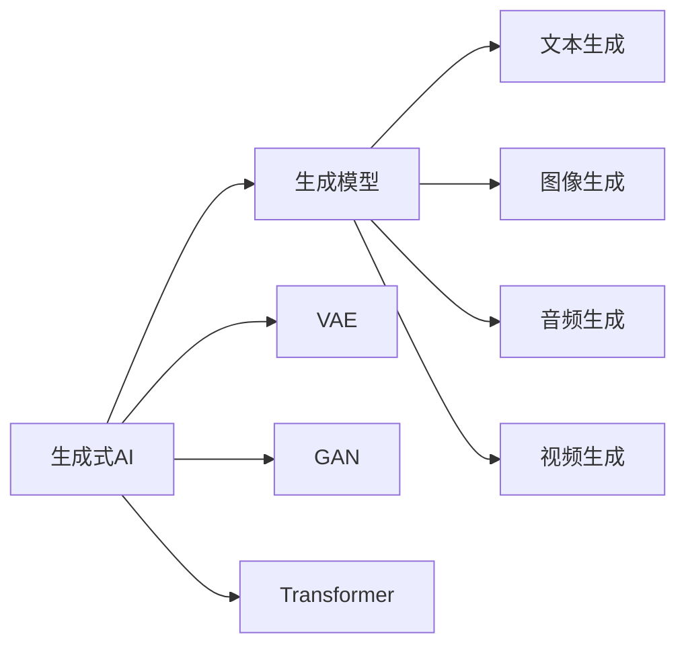
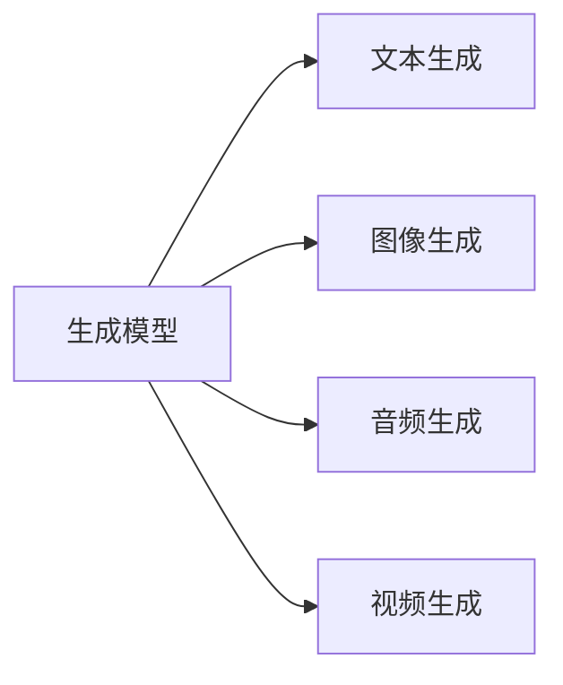
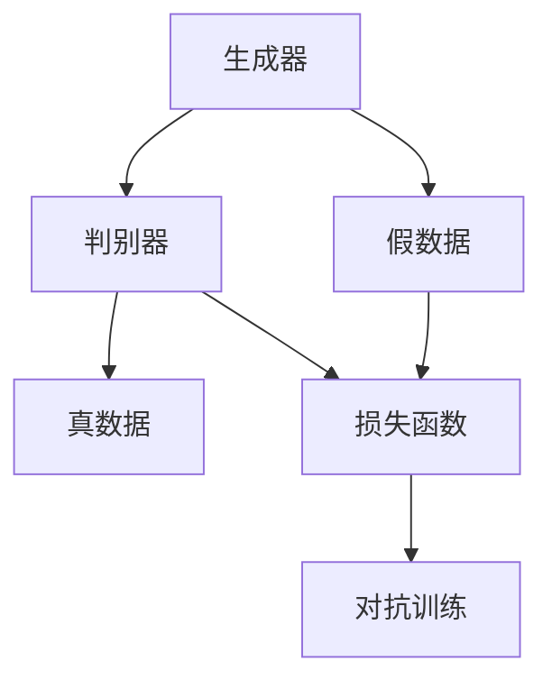
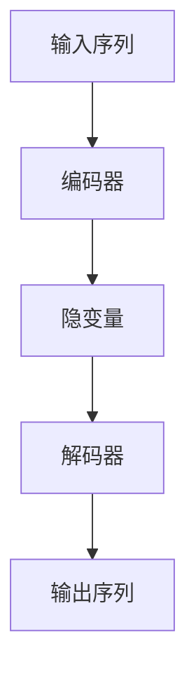
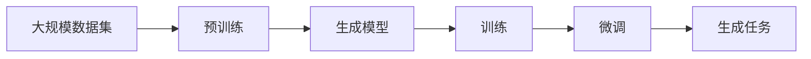

                 

# 生成式AIGC：推动产业升级的新动力

> 关键词：生成式AIGC, 人工智能, 深度学习, 自然语言处理(NLP), 计算机视觉, 应用场景, 技术突破, 产业升级

## 1. 背景介绍

### 1.1 问题由来

随着人工智能技术的快速发展，生成式人工智能（AIGC）正逐渐成为推动各行各业产业升级的新动力。生成式AI通过深度学习和大规模数据训练，使得机器能够进行多模态生成，包括文本、图像、音频、视频等多种类型的内容。这一技术在自然语言处理（NLP）、计算机视觉（CV）、游戏开发、动画制作、数字艺术等多个领域展现出了巨大的应用潜力。

生成式AI的核心在于模型能够理解输入数据，并生成与输入数据逻辑、语义相符的输出。例如，基于文本生成图像、基于图像生成描述文本、基于音频生成文本等。生成式AI技术的成熟和普及，将使得内容创作更加自动化和智能化，大大提高生产效率和创作质量。

### 1.2 问题核心关键点

生成式AI的核心在于生成模型（Generative Model）的设计和训练。生成式模型的主要任务是学习输入数据的统计特征，并据此生成新的、具有相似特征的数据。常见的生成式模型包括变分自编码器（VAE）、生成对抗网络（GAN）、自回归模型（如Transformer）等。这些模型通过优化损失函数，使得生成的数据与真实数据尽可能接近，从而实现高质量的生成效果。

生成式AI的应用非常广泛，涉及从简单的文本生成、图像生成到复杂的多模态数据生成等多个领域。其关键在于：
- 输入数据的多样性和高质量
- 生成模型的复杂性和训练成本
- 生成结果的合理性和创造性

### 1.3 问题研究意义

生成式AI技术的研究和应用，对于拓展人工智能应用边界、提高内容创作效率、推动数字经济的发展具有重要意义。

1. **拓展应用边界**：生成式AI使得机器能够生成多种类型的内容，大大拓展了AI应用的范围。
2. **提高效率**：大规模自动生成内容可以大幅度降低人力成本，提高生产效率。
3. **丰富创作**：生成式AI能够创作出新颖有趣的内容，丰富数字文化产业。
4. **驱动经济**：生成式AI技术的发展与应用，为数字经济注入新的活力。
5. **促进创新**：生成式AI在内容创作、娱乐、教育等多个领域的应用，能够激发新的创新点和商业模式。

## 2. 核心概念与联系

### 2.1 核心概念概述

为了更好地理解生成式AIGC的原理和应用，本节将介绍几个核心概念：

- **生成式AI（AIGC）**：使用生成模型进行数据生成的技术，包括文本生成、图像生成、音频生成、视频生成等。
- **生成模型（Generative Model）**：学习输入数据分布，并生成新数据的模型，如变分自编码器（VAE）、生成对抗网络（GAN）、自回归模型（如Transformer）等。
- **变分自编码器（VAE）**：一种生成模型，通过学习输入数据的概率分布，生成新的数据。VAE 包含编码器和解码器两部分，通过变分推断学习输入数据的隐变量，并生成新的隐变量，进而生成数据。
- **生成对抗网络（GAN）**：一种生成模型，通过两个神经网络进行对抗生成。其中，生成器（Generator）生成假数据，判别器（Discriminator）区分真伪数据，两者通过反向传播相互优化，生成高保真度的假数据。
- **自回归模型（如Transformer）**：通过已知序列预测后续序列的模型，例如Transformer。Transformer模型在自然语言处理任务中表现出色，适用于生成文本、对话等序列数据。

这些核心概念之间的逻辑关系可以通过以下Mermaid流程图来展示：



这个流程图展示了大语言模型微调过程中各个核心概念之间的关系：

1. 生成式AI通过生成模型学习输入数据的分布，生成新的数据。
2. 常用的生成模型包括VAE、GAN、Transformer等，适用于不同类型的数据生成任务。
3. 生成式AI的应用包括文本生成、图像生成、音频生成、视频生成等，广泛用于NLP、CV、游戏开发、动画制作等领域。

### 2.2 概念间的关系

这些核心概念之间存在着紧密的联系，形成了生成式AIGC的完整生态系统。下面我通过几个Mermaid流程图来展示这些概念之间的关系。

#### 2.2.1 生成模型与生成任务



这个流程图展示了生成模型与生成任务的关系：

1. 生成模型学习输入数据的分布，用于生成不同类型的数据。
2. 文本生成、图像生成、音频生成、视频生成等生成任务，均需要生成模型支持。

#### 2.2.2 生成对抗网络



这个流程图展示了GAN的基本结构：

1. 生成器生成假数据。
2. 判别器区分真数据和假数据。
3. 对抗训练通过反向传播，生成器与判别器相互优化，生成高保真度的假数据。

#### 2.2.3 自回归模型



这个流程图展示了自回归模型的基本结构：

1. 编码器将输入序列编码成隐变量。
2. 解码器根据隐变量生成输出序列。
3. 输出序列与真实序列的交叉熵作为损失函数，反向传播优化模型参数。

### 2.3 核心概念的整体架构

最后，我们用一个综合的流程图来展示这些核心概念在大规模生成式AIGC应用中的整体架构：



这个综合流程图展示了从预训练到微调，再到生成任务的完整过程：

1. 生成式AI首先在大规模数据上进行预训练，学习通用的数据生成知识。
2. 预训练生成模型通过微调，适应特定生成任务，生成高质量的数据。
3. 生成的数据可以应用于文本生成、图像生成、音频生成、视频生成等多种生成任务。

## 3. 核心算法原理 & 具体操作步骤
### 3.1 算法原理概述

生成式AI的核心在于生成模型的设计和训练。其核心思想是：学习输入数据的分布，并生成新的、具有相似特征的数据。生成式AI的训练过程通常包含以下几个步骤：

1. **预训练**：在大规模数据上进行无监督训练，学习输入数据的统计特征。
2. **微调**：在特定任务的数据上，通过有监督训练进一步优化生成模型。
3. **生成**：使用训练好的生成模型，生成新的数据。

这些步骤可以具体化为一个损失函数，用于衡量生成的数据与真实数据之间的差异：

$$
\mathcal{L}(G) = \mathbb{E}_{x\sim p_{data}} [\log D(x)] + \mathbb{E}_{z\sim p(z)} [\log(1-D(G(z)))]
$$

其中 $G$ 为生成模型，$D$ 为判别器，$p_{data}$ 为真实数据的概率分布，$p(z)$ 为生成模型的隐变量分布。这个损失函数综合了生成器与判别器的对抗训练，以生成高质量的假数据。

### 3.2 算法步骤详解

生成式AI的训练过程可以进一步细化如下：

**Step 1: 准备数据集**
- 收集大规模无标签数据集进行预训练。
- 收集特定任务的有标签数据集进行微调。

**Step 2: 选择生成模型**
- 选择适合的生成模型，如VAE、GAN、Transformer等。
- 设计编码器和解码器结构，并定义损失函数。

**Step 3: 预训练**
- 在大规模数据上对生成模型进行无监督训练，学习输入数据的统计特征。
- 通常使用自监督学习任务，如数据生成、掩码语言模型等。

**Step 4: 微调**
- 在特定任务的数据集上进行有监督训练，进一步优化生成模型。
- 定义任务适配层，如文本生成任务的交叉熵损失函数。
- 设置微调超参数，如学习率、批大小、迭代轮数等。

**Step 5: 生成**
- 使用训练好的生成模型，生成新的数据。
- 在测试集上评估生成的数据质量。

### 3.3 算法优缺点

生成式AI的优势在于：
1. 自动化内容创作，提升生产效率。
2. 支持多种生成任务，拓展应用范围。
3. 生成高质量内容，丰富数字文化。
4. 降低人力成本，提高内容一致性。

然而，生成式AI也存在一些缺点：
1. 训练成本高，需要大规模数据和计算资源。
2. 生成的数据质量可能不稳定，存在假数据、低质量数据等。
3. 生成结果缺乏真实性，可能存在信息失真、偏见等问题。
4. 缺乏创造性和创新性，过度依赖已有数据分布。

### 3.4 算法应用领域

生成式AI技术已经在多个领域取得了显著的应用，包括但不限于：

- **自然语言处理（NLP）**：文本生成、对话系统、机器翻译、摘要生成等。
- **计算机视觉（CV）**：图像生成、视频生成、图像增强、风格转换等。
- **音频处理**：音频生成、语音合成、音乐生成、语音识别等。
- **游戏开发**：虚拟环境生成、游戏角色生成、游戏内容生成等。
- **数字艺术**：数字绘画、虚拟人物、虚拟场景等。

除了上述应用场景外，生成式AI还在医疗、金融、教育、社交网络等多个领域展现出巨大潜力。未来，生成式AI有望在更多场景中得到应用，进一步推动产业升级。

## 4. 数学模型和公式 & 详细讲解  
### 4.1 数学模型构建

本节将使用数学语言对生成式AIGC的训练过程进行更加严格的刻画。

记生成模型为 $G(z)$，其中 $z$ 为隐变量，表示生成数据的分布。假设训练集为 $D=\{(x_i,y_i)\}_{i=1}^N$，其中 $x_i$ 为输入数据，$y_i$ 为标签。生成模型的训练目标是最大化以下条件生成概率：

$$
\max_G \mathcal{L}(G) = \mathbb{E}_{x\sim p_{data}} [\log D(x)] + \mathbb{E}_{z\sim p(z)} [\log(1-D(G(z)))]
$$

其中 $D$ 为判别器，$p_{data}$ 为真实数据的概率分布，$p(z)$ 为生成模型的隐变量分布。训练过程通过对 $G$ 和 $D$ 进行联合优化，使得生成器 $G$ 生成的数据尽可能逼近真实数据。

### 4.2 公式推导过程

以生成对抗网络（GAN）为例，推导其训练过程中的损失函数。

在GAN中，生成器 $G$ 生成假数据 $G(z)$，判别器 $D$ 区分真数据和假数据。训练过程中，生成器和判别器通过反向传播相互优化，使得生成器生成的高保真度的假数据尽可能逼近真实数据。

生成器 $G$ 的训练损失函数为：

$$
\mathcal{L}_G = -\mathbb{E}_{z\sim p(z)} [\log D(G(z))]
$$

判别器 $D$ 的训练损失函数为：

$$
\mathcal{L}_D = -\mathbb{E}_{x\sim p_{data}} [\log D(x)] - \mathbb{E}_{z\sim p(z)} [\log(1-D(G(z)))]
$$

将上述损失函数合并，得到GAN的总训练损失函数：

$$
\mathcal{L}(G,D) = \mathbb{E}_{x\sim p_{data}} [\log D(x)] + \mathbb{E}_{z\sim p(z)} [\log(1-D(G(z)))]
$$

通过上述损失函数的优化，生成器 $G$ 和判别器 $D$ 相互博弈，逐渐生成高质量的假数据。

### 4.3 案例分析与讲解

以图像生成为例，介绍GAN在图像生成任务中的训练过程。

**Step 1: 准备数据集**
- 收集大规模图像数据集进行预训练。
- 将图像数据转换为隐向量表示，用于训练生成器和判别器。

**Step 2: 设计模型结构**
- 设计生成器和判别器的网络结构，如卷积神经网络（CNN）。
- 定义损失函数，如Wasserstein距离。

**Step 3: 预训练**
- 在大规模数据上对生成器和判别器进行无监督训练。
- 生成器生成随机向量，判别器判断其是否为真数据。

**Step 4: 微调**
- 在特定任务的数据集上进行有监督训练，进一步优化生成器和判别器。
- 定义任务适配层，如图像生成任务的交叉熵损失函数。
- 设置微调超参数，如学习率、批大小、迭代轮数等。

**Step 5: 生成**
- 使用训练好的生成器，生成新的图像数据。
- 在测试集上评估生成的图像质量。

## 5. 项目实践：代码实例和详细解释说明
### 5.1 开发环境搭建

在进行生成式AI实践前，我们需要准备好开发环境。以下是使用Python进行TensorFlow开发的环境配置流程：

1. 安装Anaconda：从官网下载并安装Anaconda，用于创建独立的Python环境。

2. 创建并激活虚拟环境：
```bash
conda create -n pytorch-env python=3.8 
conda activate pytorch-env
```

3. 安装TensorFlow：根据CUDA版本，从官网获取对应的安装命令。例如：
```bash
conda install tensorflow-gpu -c tf -c conda-forge
```

4. 安装各类工具包：
```bash
pip install numpy pandas scikit-learn matplotlib tqdm jupyter notebook ipython
```

完成上述步骤后，即可在`pytorch-env`环境中开始生成式AI实践。

### 5.2 源代码详细实现

这里以GAN生成图像为例，给出使用TensorFlow进行图像生成任务的代码实现。

首先，定义GAN模型和损失函数：

```python
import tensorflow as tf
from tensorflow.keras import layers

class Generator(tf.keras.Model):
    def __init__(self, latent_dim=128, img_shape=(28, 28, 1)):
        super(Generator, self).__init__()
        self.img_shape = img_shape
        self.latent_dim = latent_dim
        
        self.dense = layers.Dense(7*7*256)
        self.reshape = layers.Reshape((7, 7, 256))
        self.conv1 = layers.Conv2DTranspose(128, (4, 4), strides=(2, 2), padding='same')
        self.conv2 = layers.Conv2DTranspose(64, (4, 4), strides=(2, 2), padding='same')
        self.conv3 = layers.Conv2DTranspose(1, (4, 4), strides=(2, 2), padding='same', activation='tanh')

    def call(self, z):
        x = self.dense(z)
        x = tf.reshape(x, (x.shape[0], 7, 7, 256))
        x = self.conv1(x)
        x = self.conv2(x)
        img = self.conv3(x)
        return img

class Discriminator(tf.keras.Model):
    def __init__(self, img_shape=(28, 28, 1)):
        super(Discriminator, self).__init__()
        self.img_shape = img_shape
        
        self.conv1 = layers.Conv2D(64, (4, 4), strides=(2, 2), padding='same')
        self.conv2 = layers.Conv2D(128, (4, 4), strides=(2, 2), padding='same')
        self.flatten = layers.Flatten()
        self.dense = layers.Dense(1, activation='sigmoid')

    def call(self, img):
        x = self.conv1(img)
        x = self.conv2(x)
        x = self.flatten(x)
        validity = self.dense(x)
        return validity

def loss_fn(real, pred_real, pred_fake):
    real_loss = tf.reduce_mean(tf.nn.sigmoid_cross_entropy_with_logits(logits=pred_real, labels=tf.ones_like(pred_real)))
    fake_loss = tf.reduce_mean(tf.nn.sigmoid_cross_entropy_with_logits(logits=pred_fake, labels=tf.zeros_like(pred_fake)))
    return real_loss + fake_loss

generator = Generator()
discriminator = Discriminator()

real_images = tf.random.normal(shape=[batch_size, 28, 28, 1])
fake_images = generator(latent_variable)

# 训练过程
with tf.GradientTape() as tape:
    real_output = discriminator(real_images)
    fake_output = discriminator(fake_images)
    
    gen_loss = loss_fn(real_output, real_output, fake_output)
    disc_loss = loss_fn(real_output, real_output, fake_output)

gen_grad = tape.gradient(gen_loss, generator.trainable_variables)
disc_grad = tape.gradient(disc_loss, discriminator.trainable_variables)

optimizer = tf.keras.optimizers.Adam(learning_rate=0.0002)
optimizer.apply_gradients(zip(gen_grad, generator.trainable_variables))
optimizer.apply_gradients(zip(disc_grad, discriminator.trainable_variables))
```

然后，定义训练和评估函数：

```python
def train_step(real_images, z):
    with tf.GradientTape() as tape:
        real_output = discriminator(real_images)
        fake_output = discriminator(generator(z))
        
        gen_loss = loss_fn(real_output, real_output, fake_output)
        disc_loss = loss_fn(real_output, real_output, fake_output)
        
    grads = tape.gradient([gen_loss, disc_loss], [generator, discriminator])
    optimizer.apply_gradients(zip(grads, [generator, discriminator]))

def evaluate(generator, discriminator, real_images):
    fake_images = generator(latent_variable)
    real_output = discriminator(real_images)
    fake_output = discriminator(fake_images)
    
    real_loss = tf.reduce_mean(tf.nn.sigmoid_cross_entropy_with_logits(logits=real_output, labels=tf.ones_like(real_output)))
    fake_loss = tf.reduce_mean(tf.nn.sigmoid_cross_entropy_with_logits(logits=fake_output, labels=tf.zeros_like(fake_output)))
    return real_loss, fake_loss
```

最后，启动训练流程并在测试集上评估：

```python
epochs = 100
batch_size = 32

for epoch in range(epochs):
    for i in range(num_batches):
        real_images, _ = data[i]
        z = latent_variable[i]
        train_step(real_images, z)
        
    test_loss = evaluate(generator, discriminator, real_images)
    print(f"Epoch {epoch+1}, real_loss: {test_loss[0]:.4f}, fake_loss: {test_loss[1]:.4f}")
    
    if epoch % 10 == 0:
        sample_images = generate_images(generator, latent_variable)
        save_images(sample_images, epoch)
```

以上就是使用TensorFlow进行GAN图像生成任务的完整代码实现。可以看到，通过TensorFlow的动态计算图和自动微分机制，我们可以用相对简洁的代码实现复杂的GAN模型训练。

### 5.3 代码解读与分析

让我们再详细解读一下关键代码的实现细节：

**GAN模型**：
- 定义生成器（Generator）和判别器（Discriminator）的网络结构。
- 生成器由密集层和卷积层组成，用于将随机向量转换为图像。
- 判别器由卷积层和全连接层组成，用于判断图像的真实性。

**损失函数**：
- 使用交叉熵损失函数，衡量判别器的输出与真实标签的差异。
- 生成器的损失函数为真实图像和假图像的交叉熵损失之和。

**训练过程**：
- 在每个batch上，将真实图像和生成器生成的假图像输入判别器。
- 使用Adam优化器对生成器和判别器进行联合优化，最小化训练损失。
- 每个epoch后，保存生成器生成的样本图像，评估模型效果。

**评估过程**：
- 在测试集上，将真实图像和生成器生成的假图像输入判别器。
- 计算真实图像和假图像的交叉熵损失，评估判别器的性能。

## 6. 实际应用场景
### 6.1 智能客服系统

基于生成式AI的智能客服系统，可以大大提升客户咨询体验。传统客服依赖人工服务，无法24小时不间断响应，且响应速度和质量难以保证。智能客服系统通过生成式AI技术，可以自动生成个性化的回答，快速响应客户咨询，提高服务效率和质量。

在技术实现上，可以收集历史客服对话记录，将问题和最佳答复构建成监督数据，训练生成式AI模型。模型能够在新的客户咨询中，自动理解问题并生成最佳答复，减少人工干预，提升客户满意度。

### 6.2 金融舆情监测

金融市场实时舆情监测是金融风险防控的重要环节。生成式AI技术可以自动分析海量网络舆情数据，识别出市场情绪变化和异常事件，帮助金融机构及时应对潜在风险。

具体而言，可以收集金融领域相关的新闻、评论、社交媒体等数据，训练生成式AI模型。模型能够实时监测不同主题下的舆情变化，一旦发现负面信息激增等异常情况，系统便会自动预警，帮助金融机构快速应对潜在风险。

### 6.3 个性化推荐系统

当前的推荐系统往往只依赖用户的历史行为数据进行物品推荐，无法深入理解用户的真实兴趣偏好。生成式AI技术可以通过生成高质量内容，丰富推荐系统的多样性和个性化。

在实践中，可以收集用户浏览、点击、评论、分享等行为数据，提取和用户交互的物品标题、描述、标签等文本内容。将文本内容作为模型输入，生成高质量的推荐内容。生成的推荐内容可以丰富推荐列表，提高推荐效果。

### 6.4 未来应用展望

随着生成式AI技术的不断发展，其应用场景将越来越广泛，带来深远的影响：

1. **内容创作**：生成式AI能够自动创作出高质量的文本、图像、音频、视频等内容，丰富数字文化产业。
2. **虚拟现实**：生成式AI技术可以应用于虚拟现实（VR）和增强现实（AR），创造出沉浸式体验。
3. **数字艺术**：生成式AI能够创作出独具风格的数字艺术作品，推动数字艺术的发展。
4. **游戏开发**：生成式AI可以生成虚拟角色、虚拟场景等游戏元素，提升游戏体验。
5. **医疗健康**：生成式AI可以辅助医生诊断疾病、生成医学图像、撰写临床报告等，提升医疗服务效率和质量。

## 7. 工具和资源推荐
### 7.1 学习资源推荐

为了帮助开发者系统掌握生成式AI的理论基础和实践技巧，这里推荐一些优质的学习资源：

1. **《生成对抗网络：从理论到实践》**：深度学习领域专家撰写，全面介绍了生成对抗网络的基本原理和实践方法。

2. **CS231n《计算机视觉：深度学习基础》课程**：斯坦福大学开设的计算机视觉明星课程，涵盖了从基础到前沿的计算机视觉内容，适合进阶学习。

3. **《深度学习》书籍**：深度学习领域经典教材，涵盖深度学习基础知识和前沿技术，适合深度学习初学者。

4. **PyTorch官方文档**：PyTorch的官方文档，提供了海量预训练模型和完整的生成式AI样例代码，是上手实践的必备资料。

5. **arXiv论文预印本**：人工智能领域最新研究成果的发布平台，包括大量尚未发表的前沿工作，学习前沿技术的必读资源。

通过这些资源的学习实践，相信你一定能够快速掌握生成式AI的精髓，并用于解决实际的AI问题。

### 7.2 开发工具推荐

高效的开发离不开优秀的工具支持。以下是几款用于生成式AI开发常用的工具：

1. **PyTorch**：基于Python的开源深度学习框架，灵活动态的计算图，适合快速迭代研究。大部分生成式AI模型都有PyTorch版本的实现。

2. **TensorFlow**：由Google主导开发的开源深度学习框架，生产部署方便，适合大规模工程应用。同样有丰富的生成式AI资源。

3. **Keras**：高层次的深度学习API，易于上手，适合初学者快速搭建生成式AI模型。

4. **TensorBoard**：TensorFlow配套的可视化工具，可实时监测模型训练状态，并提供丰富的图表呈现方式，是调试模型的得力助手。

5. **Weights & Biases**：模型训练的实验跟踪工具，可以记录和可视化模型训练过程中的各项指标，方便对比和调优。

6. **GitHub**：全球最大的代码托管平台，提供丰富的生成式AI

