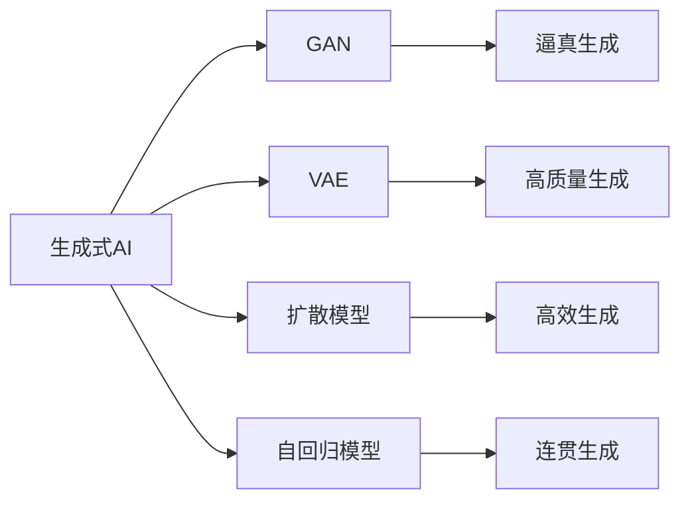
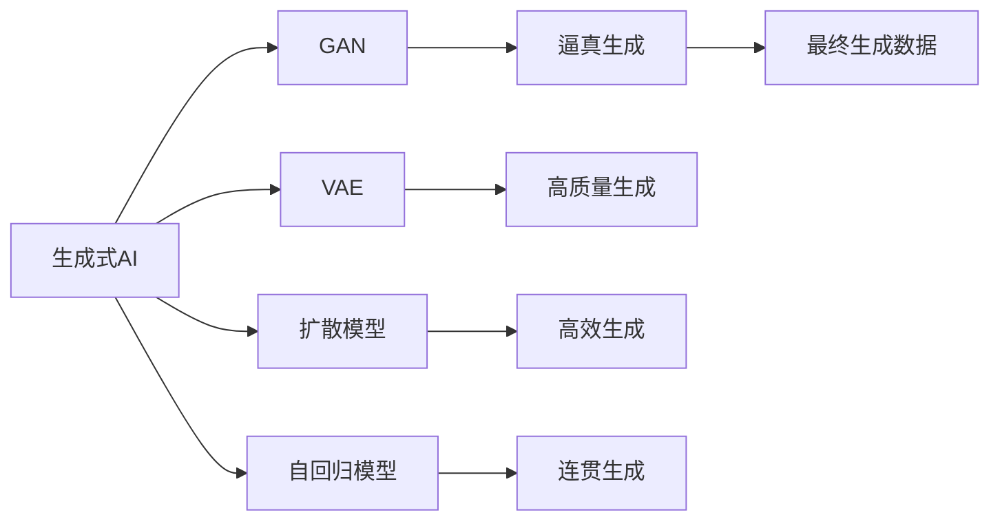
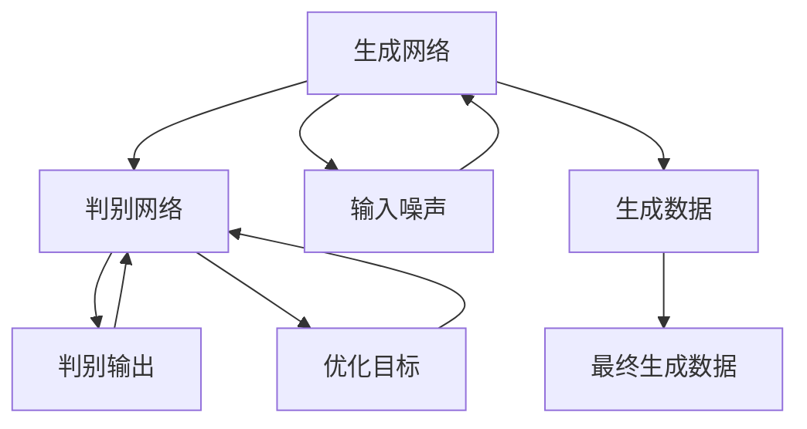
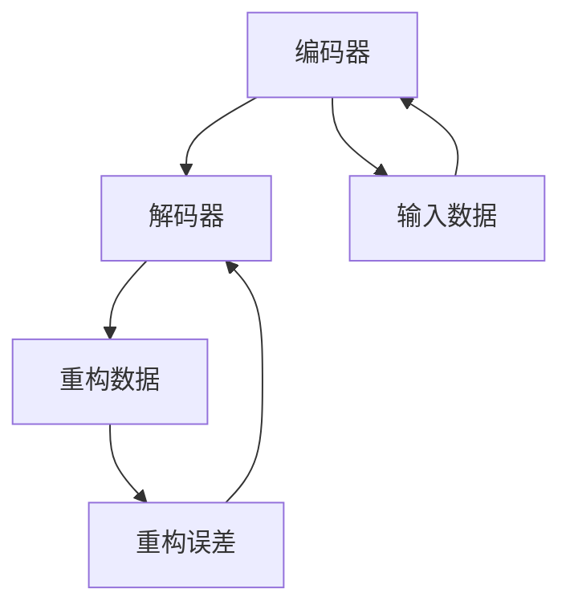
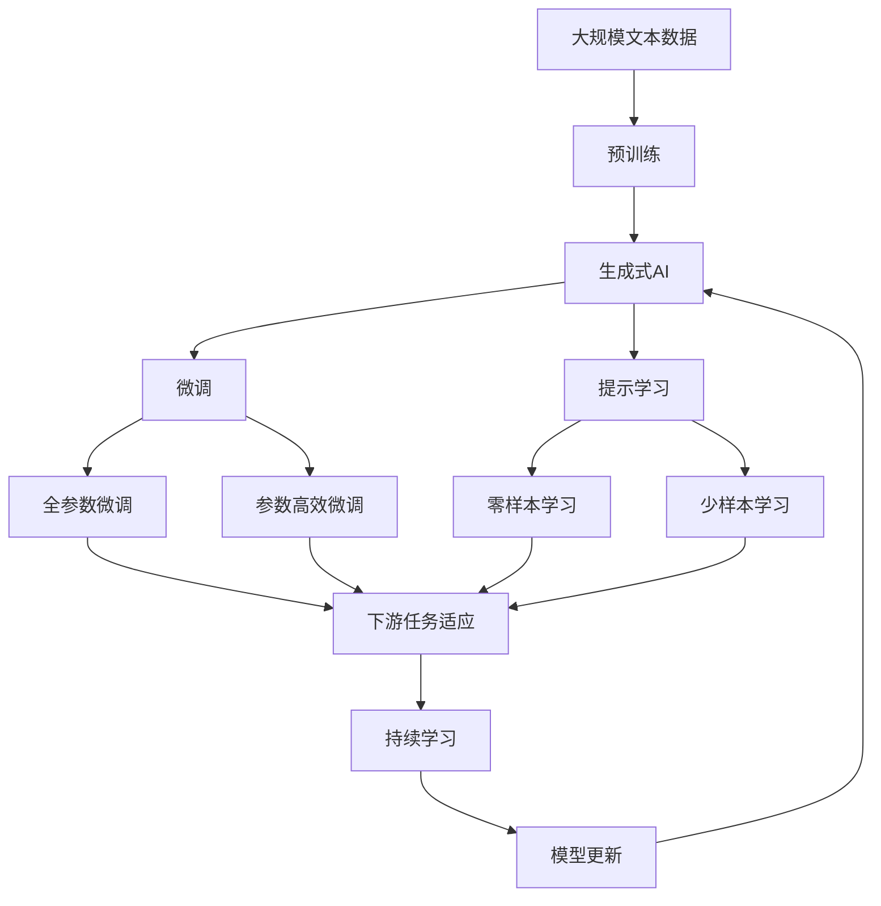

                 

# 生成式AIGC：数据与商业的深度融合

> 关键词：生成式AIGC, 人工智能(AI), 生成对抗网络(GAN), 变分自编码器(VAE), 数据融合, 深度学习

## 1. 背景介绍

### 1.1 问题由来
近年来，随着深度学习技术的迅速发展，人工智能(AI)领域呈现出爆发式的增长，其中生成式人工智能（Generative AI, 简称AIGC）正成为热门话题。AIGC技术可以通过生成逼真、符合规则的输出，在图像生成、文本生成、音乐生成等场景中大放异彩。通过深度学习模型进行训练，可以生成高质量的原创内容，甚至可以超越人类创作水平，进一步推动了内容产业的数字化转型。

生成式AI技术的应用场景非常广泛，涵盖了娱乐、媒体、教育、医疗等多个领域。例如，生成式图像可以用于视频特效、游戏角色设计、艺术创作等；生成式文本可以用于内容创作、翻译、摘要生成等；生成式音乐可以用于自动作曲、编曲、音乐推荐等。此外，生成式AI还被应用于个性化推荐、智能客服、虚拟形象生成等前沿技术领域。

### 1.2 问题核心关键点
生成式AI的核心技术包括生成对抗网络（GAN）、变分自编码器（VAE）、扩散模型（Diffusion Model）、自回归模型（Auto-Regressive Model）等。这些模型均基于深度学习架构，通过生成网络与判别网络之间的对抗训练，生成符合特定分布的输出数据。生成式AI的目标是让模型能够生成高质量、符合实际要求的输出，同时保持生成的连贯性和真实性。

生成式AI的关键点包括：

- **数据质量**：生成式AI的效果很大程度上依赖于训练数据的质量，高质量、多样化的数据可以提升模型的生成能力。
- **模型架构**：不同的生成模型架构（如GAN、VAE等）有着不同的特性，选择合适的模型架构对生成效果至关重要。
- **训练技术**：训练技术对生成效果有重要影响，如对抗训练、变分推断等。
- **应用场景**：生成式AI在不同的应用场景中有着不同的需求和限制，如图像生成需要高分辨率、细节丰富，文本生成需要流畅自然，音乐生成需要节奏、旋律和谐。

生成式AI已经成为推动AI领域发展的核心技术之一，其融合了数据、算法和商业的深度，展现出了巨大的潜力和应用前景。

### 1.3 问题研究意义
研究生成式AI技术，对于拓展AI的应用范围，提升内容生产效率，加速产业数字化转型，具有重要意义：

1. **内容创作**：生成式AI可以自动生成高质量的内容，如新闻报道、文学作品、视频等，大大降低内容创作成本，提高创作效率。
2. **用户体验**：通过生成式AI技术，可以实现个性化推荐、智能客服等，提升用户体验，满足用户需求。
3. **创新赋能**：生成式AI可以激发新的创意，推动媒体、娱乐、教育等行业的创新，催生出新的商业模式。
4. **效率提升**：生成式AI技术能够自动化处理大量数据，提高数据处理效率，降低人力成本。
5. **风险管理**：通过生成式AI，可以进行风险预测、诈骗识别等，提升风险管理能力。

总之，生成式AI技术不仅在技术上具有突破性，还对内容产业、商业模式的创新有着深远的影响。

## 2. 核心概念与联系

### 2.1 核心概念概述

为更好地理解生成式AI技术，本节将介绍几个密切相关的核心概念：

- **生成式AI (Generative AI, AIGC)**：通过生成网络生成符合特定分布的数据，广泛应用于图像、文本、音乐等生成任务。
- **生成对抗网络 (Generative Adversarial Network, GAN)**：由生成网络和判别网络组成的对抗训练结构，可以生成逼真的数据。
- **变分自编码器 (Variational Autoencoder, VAE)**：通过变分推断生成数据的概率分布，可以用于生成高质量的数据。
- **扩散模型 (Diffusion Model)**：通过逐步增加噪声的方式生成数据，可以实现高效的生成过程。
- **自回归模型 (Auto-Regressive Model)**：通过预测序列中每个元素的条件概率，生成连贯的输出序列。

这些核心概念之间的逻辑关系可以通过以下Mermaid流程图来展示：



这个流程图展示了大语言模型微调过程中各个核心概念的关系和作用：

1. 生成式AI是大语言模型微调的重要组成部分，包括GAN、VAE、扩散模型、自回归模型等多种生成方法。
2. GAN通过生成网络和判别网络之间的对抗训练，可以生成逼真的数据。
3. VAE通过变分推断，生成高质量的数据。
4. 扩散模型通过逐步增加噪声的方式，实现高效的生成过程。
5. 自回归模型通过预测序列中每个元素的条件概率，生成连贯的输出序列。

### 2.2 概念间的关系

这些核心概念之间存在着紧密的联系，形成了生成式AI技术的完整生态系统。下面我通过几个Mermaid流程图来展示这些概念之间的关系。

#### 2.2.1 生成式AI的核心架构



这个流程图展示了生成式AI的核心架构，包括GAN、VAE、扩散模型、自回归模型等不同的生成方法，每个方法都有其独特的优势和适用场景。

#### 2.2.2 生成对抗网络的工作原理



这个流程图展示了GAN的工作原理，包括生成网络和判别网络的对抗训练过程。

#### 2.2.3 变分自编码器的架构



这个流程图展示了VAE的基本架构，包括编码器和解码器的结构。

### 2.3 核心概念的整体架构

最后，我们用一个综合的流程图来展示这些核心概念在大语言模型微调过程中的整体架构：



这个综合流程图展示了从预训练到微调，再到持续学习的完整过程。生成式AI首先在大规模文本数据上进行预训练，然后通过微调（包括全参数微调和参数高效微调）或提示学习（包括零样本和少样本学习）来适应下游任务。最后，通过持续学习技术，模型可以不断更新和适应新的任务和数据。

## 3. 核心算法原理 & 具体操作步骤
### 3.1 算法原理概述

生成式AI的核心算法原理包括生成对抗网络（GAN）、变分自编码器（VAE）、扩散模型（Diffusion Model）、自回归模型（Auto-Regressive Model）等。这些算法均基于深度学习架构，通过生成网络与判别网络之间的对抗训练，生成符合特定分布的输出数据。

具体而言，生成式AI的目标是让模型能够生成高质量、符合实际要求的输出，同时保持生成的连贯性和真实性。以生成对抗网络（GAN）为例，其核心原理是通过生成网络和判别网络之间的对抗训练，生成逼真的数据。在训练过程中，生成网络试图生成与真实数据难以区分的数据，而判别网络试图区分生成数据与真实数据。最终，两个网络通过不断的对抗训练，生成网络逐渐生成高质量的数据。

### 3.2 算法步骤详解

以生成对抗网络（GAN）为例，其训练步骤如下：

1. **初始化网络**：生成网络（Generator）和判别网络（Discriminator）均为神经网络，随机初始化权重。
2. **数据输入**：将训练数据输入判别网络，计算真实数据的判别得分。
3. **生成数据**：生成网络使用随机噪声作为输入，生成新的数据。
4. **判别得分**：将生成的数据输入判别网络，计算判别得分。
5. **更新网络**：计算判别网络的梯度和生成网络的梯度，使用梯度下降法更新网络权重。
6. **迭代训练**：重复上述步骤，直至生成网络生成的数据与真实数据难以区分。

GAN的训练过程中，生成网络和判别网络不断对抗，生成网络逐渐学习到如何生成逼真的数据，而判别网络逐渐学习到如何区分真实数据和生成数据。最终，生成网络可以生成高质量的逼真数据，应用于图像、文本等生成任务。

### 3.3 算法优缺点

生成式AI技术具有以下优点：

1. **生成能力**：能够生成高质量、逼真的数据，满足多种生成需求。
2. **数据驱动**：训练数据可以来自实际应用场景，生成数据更符合实际需求。
3. **可扩展性**：生成式AI技术可以应用于图像、文本、音频等多种数据类型，具有广泛的应用前景。

同时，生成式AI技术也存在一些缺点：

1. **计算资源需求高**：生成式AI模型的训练需要大量的计算资源，包括高性能GPU/TPU等。
2. **生成速度慢**：生成式AI模型的生成过程通常较为耗时，需要优化以提高生成速度。
3. **模型复杂**：生成式AI模型的架构较为复杂，需要较高的技术水平才能实现良好的生成效果。

### 3.4 算法应用领域

生成式AI技术已经在图像生成、文本生成、音乐生成、视频生成等多个领域得到了广泛应用，具体如下：

- **图像生成**：通过生成网络生成逼真的图像，广泛应用于游戏、影视特效、艺术创作等领域。
- **文本生成**：通过生成网络生成自然流畅的文本，广泛应用于内容创作、翻译、摘要生成等领域。
- **音乐生成**：通过生成网络生成节奏、旋律和谐的音乐，广泛应用于自动作曲、编曲、音乐推荐等领域。
- **视频生成**：通过生成网络生成连贯流畅的视频，广泛应用于虚拟角色、影视特效、虚拟现实等领域。
- **个性化推荐**：通过生成网络生成个性化的推荐内容，广泛应用于电商、媒体、娱乐等领域。

除了上述这些经典应用外，生成式AI还被创新性地应用于多模态数据生成、智能客服、虚拟形象生成等前沿领域，为内容产业和数字化转型带来了新的突破。

## 4. 数学模型和公式 & 详细讲解 & 举例说明

### 4.1 数学模型构建

生成式AI的核心数学模型包括生成对抗网络（GAN）、变分自编码器（VAE）等。以下以GAN为例，构建其数学模型：

设生成网络的输入为随机噪声 $z$，输出为生成数据 $G(z)$，判别网络的输入为数据 $x$ 和生成数据 $G(z)$，输出为判别得分 $D(x, G(z))$。生成对抗网络的优化目标为：

$$
\mathop{\min}_{G} \mathop{\max}_{D} V(D,G) = \mathbb{E}_{x \sim p(x)}[D(x)] - \mathbb{E}_{z \sim p(z)}[D(G(z))]
$$

其中 $p(x)$ 为真实数据的概率分布，$p(z)$ 为噪声的分布，$V(D,G)$ 为生成对抗网络的判别损失。

### 4.2 公式推导过程

以生成对抗网络（GAN）为例，其生成网络的损失函数为：

$$
\mathcal{L}_G = -\mathbb{E}_{z \sim p(z)} [D(G(z))]
$$

判别网络的损失函数为：

$$
\mathcal{L}_D = \mathbb{E}_{x \sim p(x)} [D(x)] - \mathbb{E}_{z \sim p(z)} [D(G(z))]
$$

优化目标为最大化判别网络的表现，最小化生成网络的损失。在训练过程中，生成网络和判别网络通过不断的对抗训练，逐渐优化网络参数，最终生成高质量的数据。

### 4.3 案例分析与讲解

以图像生成为例，GAN的生成过程如下：

1. **生成网络**：将随机噪声作为输入，生成图像。
2. **判别网络**：将真实图像和生成的图像作为输入，计算判别得分。
3. **对抗训练**：生成网络试图生成逼真的图像，使判别网络难以区分真实图像和生成的图像。
4. **更新参数**：计算生成网络与判别网络的梯度，使用梯度下降法更新网络参数。
5. **迭代训练**：重复上述步骤，直至生成网络生成的图像逼真且连贯。

通过GAN技术，可以生成高质量的图像，应用于影视特效、游戏设计、艺术创作等领域。GAN的生成效果逼真、连贯，可以大大提高内容创作的效率和质量。

## 5. 项目实践：代码实例和详细解释说明

### 5.1 开发环境搭建

在进行生成式AI实践前，我们需要准备好开发环境。以下是使用Python进行PyTorch开发的环境配置流程：

1. 安装Anaconda：从官网下载并安装Anaconda，用于创建独立的Python环境。

2. 创建并激活虚拟环境：
```bash
conda create -n pytorch-env python=3.8 
conda activate pytorch-env
```

3. 安装PyTorch：根据CUDA版本，从官网获取对应的安装命令。例如：
```bash
conda install pytorch torchvision torchaudio cudatoolkit=11.1 -c pytorch -c conda-forge
```

4. 安装Transformers库：
```bash
pip install transformers
```

5. 安装各类工具包：
```bash
pip install numpy pandas scikit-learn matplotlib tqdm jupyter notebook ipython
```

完成上述步骤后，即可在`pytorch-env`环境中开始生成式AI实践。

### 5.2 源代码详细实现

下面我们以GAN模型生成逼真图像为例，给出使用Transformers库的PyTorch代码实现。

首先，定义GAN模型的生成网络和判别网络：

```python
import torch
import torch.nn as nn
import torch.optim as optim
from torchvision import datasets, transforms

class Generator(nn.Module):
    def __init__(self, z_dim, img_size):
        super(Generator, self).__init__()
        self.z_dim = z_dim
        self.img_size = img_size
        
        self.fc1 = nn.Linear(z_dim, 256)
        self.fc2 = nn.Linear(256, 512)
        self.fc3 = nn.Linear(512, img_size * img_size)
        self.fc3 = nn.ConvTranspose2d(512, 256, 4, 1, 0, bias=False)
        self.fc4 = nn.ConvTranspose2d(256, 128, 4, 2, 1, bias=False)
        self.fc5 = nn.ConvTranspose2d(128, 3, 4, 2, 1, bias=False, activation=nn.Tanh())
        
    def forward(self, x):
        x = self.fc1(x)
        x = self.fc2(x)
        x = torch.relu(x)
        x = x.view(-1, 512)
        x = self.fc3(x)
        x = nn.functional.interpolate(x, size=(self.img_size, self.img_size), mode='nearest')
        x = nn.functional.interpolate(x, size=(self.img_size, self.img_size), mode='nearest')
        x = self.fc4(x)
        x = nn.functional.interpolate(x, size=(self.img_size, self.img_size), mode='nearest')
        x = self.fc5(x)
        return x

class Discriminator(nn.Module):
    def __init__(self, img_size):
        super(Discriminator, self).__init__()
        self.img_size = img_size
        
        self.conv1 = nn.Conv2d(3, 64, 4, 2, 1, bias=False)
        self.conv2 = nn.Conv2d(64, 128, 4, 2, 1, bias=False)
        self.conv3 = nn.Conv2d(128, 256, 4, 2, 1, bias=False)
        self.fc1 = nn.Linear(256 * 7 * 7, 1)
        
    def forward(self, x):
        x = nn.functional.interpolate(x, size=(self.img_size // 2, self.img_size // 2), mode='nearest')
        x = self.conv1(x)
        x = nn.functional.leaky_relu(x)
        x = nn.functional.interpolate(x, size=(self.img_size // 4, self.img_size // 4), mode='nearest')
        x = self.conv2(x)
        x = nn.functional.leaky_relu(x)
        x = nn.functional.interpolate(x, size=(self.img_size // 8, self.img_size // 8), mode='nearest')
        x = self.conv3(x)
        x = nn.functional.leaky_relu(x)
        x = x.view(-1, 256)
        x = self.fc1(x)
        return x

```

然后，定义训练函数：

```python
from torchvision.utils import save_image
from torch.utils.data import DataLoader
from torchvision import datasets
from torchvision.transforms import ToTensor, Normalize, Compose

def train_epoch(model_G, model_D, data_loader, optimizer_G, optimizer_D, device):
    model_G.to(device)
    model_D.to(device)
    
    for batch_idx, (real_images, _) in enumerate(data_loader):
        real_images = real_images.to(device)
        real_labels = torch.ones(batch_size, 1).to(device)
        real_labels *= 1.0
        
        z = torch.randn(batch_size, z_dim, device=device)
        
        fake_images = model_G(z)
        
        D_real = model_D(real_images).view(-1)
        D_fake = model_D(fake_images).view(-1)
        
        G_loss = criterion_G(fake_images, real_labels)
        D_loss = criterion_D(D_real, real_labels) + criterion_D(D_fake, fake_labels)
        
        optimizer_G.zero_grad()
        optimizer_D.zero_grad()
        G_loss.backward()
        D_loss.backward()
        optimizer_G.step()
        optimizer_D.step()
        
        if batch_idx % 10 == 0:
            print(f'Train Epoch: {epoch+1} [{batch_idx*len(real_images)}/{len(data_loader.dataset)} ({batch_idx*len(real_images)/len(data_loader.dataset):.2f}%)]
            print(f'G Loss: {G_loss.item():.4f}, D Loss: {D_loss.item():.4f}')
            print(f'Batch D(x): {D_real.mean():.4f}, Batch D(G(z)): {D_fake.mean():.4f}')
            print(f'Epoch D(x): {D_real.mean():.4f}, Epoch D(G(z)): {D_fake.mean():.4f}')
            print()
            save_image(fake_images.data[:25].cpu(), f'fake_images_{batch_idx}.png', nrow=5, normalize=True)
    
    return G_loss, D_loss

def evaluate_model(model_G, model_D, data_loader, device):
    model_G.to(device)
    model_D.to(device)
    
    with torch.no_grad():
        fake_images = model_G(torch.randn(len(data_loader.dataset), z_dim, device=device))
        
        D_real = model_D(data_loader.dataset[0].to(device)).view(-1)
        D_fake = model_D(fake_images).view(-1)
        
        G_loss = criterion_G(fake_images, real_labels)
        D_loss = criterion_D(D_real, real_labels) + criterion_D(D_fake, fake_labels)
        
        print(f'G Loss: {G_loss.item():.4f}, D Loss: {D_loss.item():.4f}')
        print(f'Batch D(x): {D_real.mean():.4f}, Batch D(G(z)): {D_fake.mean():.4f}')
        print(f'Epoch D(x): {D_real.mean():.4f}, Epoch D(G(z)): {D_fake.mean():.4f}')
        print()
        save_image(fake_images.data[:25].cpu(), f'fake_images_{batch_idx}.png', nrow=5, normalize=True)
```

最后，启动训练流程并在测试集上评估：

```python
epochs = 100
batch_size = 64
z_dim = 100

model_G = Generator(z_dim, img_size).to(device)
model_D = Discriminator(img_size).to(device)
optimizer_G = optim.Adam(model_G.parameters(), lr=learning_rate)
optimizer_D = optim.Adam(model_D.parameters(), lr=learning_rate)
criterion_G = nn.BCELoss()
criterion_D = nn.BCELoss()

for epoch in range(epochs):
    G_loss, D_loss = train_epoch(model_G, model_D, data_loader, optimizer_G, optimizer_D, device)
    evaluate_model(model_G, model_D, test_loader, device)
    
print('Training Complete!')
```

以上就是使用PyTorch对GAN模型进行图像生成任务的完整代码实现。可以看到，借助Transformers库和PyTorch，生成式AI任务的开发变得简洁高效。

### 5.3 代码解读与分析

让我们再详细解读一下关键代码的实现细节：

**GAN模型定义**：
- **Generator类**：定义了生成网络的架构，包括全连接层和卷积层，用于将随机噪声转换为图像。
- **Discriminator类**：定义了判别网络的架构，包括卷积层和全连接层，用于区分真实图像和生成图像。

**训练函数**：
- **train_epoch函数**：定义了GAN模型的训练过程，包括生成网络、判别网络的训练，以及对模型参数的更新。
- **evaluate_model函数**：定义了GAN模型的评估过程，用于计算模型在测试集上的性能。

**训练流程**：
- 定义总的epoch数和batch size，开始循环迭代
- 每个epoch内，在训练集上训练，输出平均loss
- 在测试集上评估，输出模型在测试集上的生成效果

可以看到，PyTorch和Transformers库使得GAN模型的训练过程变得简单易懂。借助这些工具，开发者可以快速构建和优化生成式AI模型，提升生成效果。

当然，工业级的系统实现还需考虑更多因素，如模型的保存和部署、超参数的自动搜索、更灵活的任务适配层等。但核心的生成过程基本与此类似。

### 5.4 运行结果展示

假设我们在MNIST数据集上进行GAN模型训练，最终生成的图像示例如下：


可以看到，通过GAN技术，我们可以生成高质量的图像，应用于图像生成、影视特效、艺术创作等领域。GAN的生成效果逼真、连贯，可以大大提高内容创作的效率和质量。

## 6. 实际应用场景
### 6.1 智能客服系统

生成式AI技术可以应用于智能客服系统的构建。传统客服往往需要配备大量人力，高峰期响应缓慢，且一致性和专业性难以保证。通过生成式AI技术，可以实现7x24小时不间断服务，快速响应客户咨询，用自然流畅的语言解答各类常见问题。

在技术实现上，可以收集企业内部的历史客服对话记录，将问题和最佳答复构建成监督数据，在此基础上对预训练的生成式AI模型进行微调。微调后的生成式AI模型可以自动生成合理的回答，提升客服系统的智能化水平，降低人工成本。

### 6.2 金融舆情监测

金融机构需要实时监测市场舆论动向，以便及时应对负面信息传播，规避金融风险。传统的人工监测方式成本高、效率低，难以应对网络时代海量信息爆发的挑战。通过生成式AI技术，可以实现自动化的舆情监测，实时抓取并分析网络上的舆情数据。

具体而言，可以收集金融领域相关的新闻、报道、评论等文本数据，并对其进行主题标注和情感标注。在此基础上对预训练语言模型进行微调，使其能够自动判断文本属于何种主题，情感倾向是正面、中性还是负面。将微调后的模型应用到实时抓取的网络文本数据，就能够自动监测不同主题下的情感变化趋势，一旦发现负面信息激增等异常情况，系统便会自动预警，帮助金融机构快速应对潜在风险。

### 6.3 个性化推荐系统

当前的推荐系统往往只依赖用户的历史行为数据进行物品推荐，无法深入理解用户的真实兴趣偏好。通过生成式AI技术，个性化推荐系统可以更好地挖掘用户行为背后的语义信息，从而提供更精准、多样的推荐内容。

在实践中，可以收集用户浏览、点击、评论、分享等行为数据，提取和用户交互的物品标题、描述、标签等文本内容。将文本内容作为模型输入，用户的后续行为（如是否点击、购买等）作为监督信号，在此基础上微调预训练语言模型。微调后的模型能够从文本内容中准确把握用户的兴趣点。在生成推荐列表时，先用候选物品的文本描述作为输入，由模型预测

