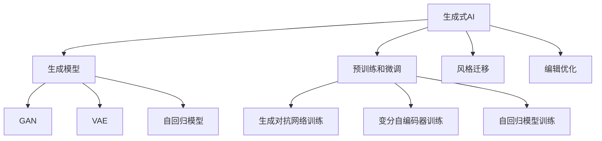
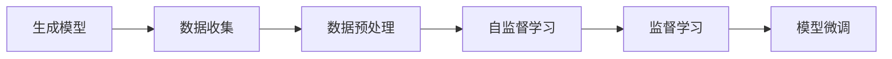
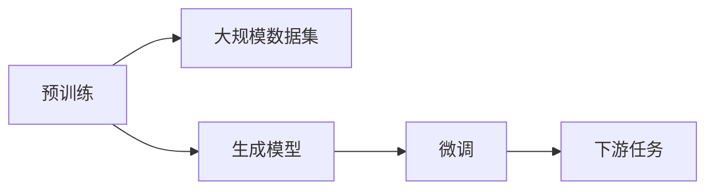
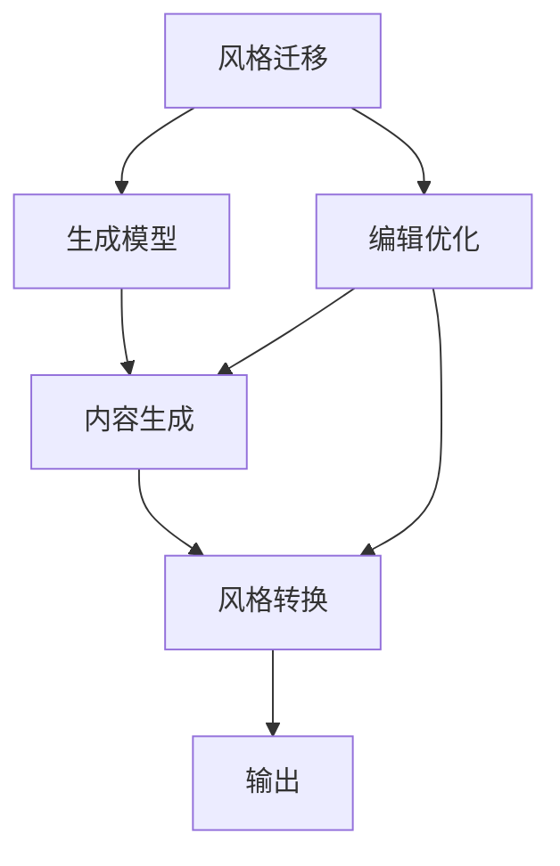
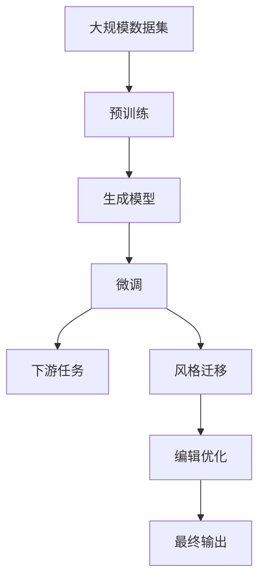

                 

# 生成式AIGC：智能时代的商业新模式

## 1. 背景介绍

### 1.1 问题由来

随着人工智能(AI)技术的迅猛发展，生成式人工智能(AIGC)已成为智能时代的新引擎。AIGC技术，即基于生成模型的AI技术，通过深度学习网络生成逼真的文本、图像、音频等内容，正逐步渗透到内容创作、广告营销、影视制作、游戏开发等多个领域。

生成式AI不仅能够帮助企业降本增效，提升创意输出质量，还能够开辟全新的商业模式，重塑市场竞争格局。目前，AIGC技术在影视制作、数字艺术、智能客服、教育培训等领域均有显著应用。例如，Adobe的Sensei平台已经广泛应用在Photoshop、Premiere等创意软件中，提升设计效率和创造力；国内一些AI绘画、音乐创作平台也已采用AIGC技术，助推艺术创作创新。

### 1.2 问题核心关键点

AIGC技术的核心在于通过生成模型学习海量数据，生成与训练数据相似但全新的内容，从而赋予算法强大的生成能力。常见的生成模型包括变分自编码器(VAE)、生成对抗网络(GAN)、自回归模型等，其中以Transformer为代表的自回归模型在文本生成、图像生成等领域表现出色。

AIGC的生成模型训练过程一般包括以下几个关键步骤：

1. 收集大量标注数据，构建训练集。
2. 设计生成模型，并通过自监督学习或监督学习任务进行预训练。
3. 在预训练模型的基础上，使用下游任务的数据集进行微调，获得针对特定任务优化的模型。
4. 对微调后的模型进行后处理，如风格迁移、编辑优化等，最终生成满足需求的文本、图像、音频等内容。

### 1.3 问题研究意义

AIGC技术的研究与应用，对于推动智能创意产业的发展，降低创意产业成本，具有重要意义：

1. 降本增效。AIGC技术通过自动化生成内容，减少了人工创作的时间和成本，极大提升了内容产出效率。
2. 创新创意。AIGC技术能生成高度逼真的文本、图像、音乐等内容，为创意产业注入新的元素，推动创新。
3. 提升体验。AIGC技术生成的内容可以个性化定制，提升用户体验和满意度。
4. 开辟新领域。AIGC技术能应用于更多新型领域，如虚拟现实、元宇宙等，带来新的商业模式和应用场景。
5. 助力产业升级。AIGC技术能提升传统产业的技术含量和自动化水平，推动产业转型升级。

## 2. 核心概念与联系

### 2.1 核心概念概述

要深入理解AIGC技术，需要掌握以下核心概念：

- **生成式AI（AIGC）**：基于生成模型进行内容生成的AI技术，如文本生成、图像生成、音频生成等。
- **生成模型**：通过学习海量数据，生成逼真内容的机器学习模型，如GAN、VAE、Transformer等。
- **生成对抗网络（GAN）**：由生成器和判别器组成，通过对抗训练生成逼真样本的模型。
- **变分自编码器（VAE）**：通过学习数据分布生成样本的变分模型。
- **自回归模型（如Transformer）**：通过序列预测生成样本的模型，常用于文本和语音生成。
- **预训练和微调**：在大规模数据上预训练模型，然后使用特定任务数据集进行微调的过程。
- **风格迁移（Style Transfer）**：将输入内容通过生成模型转换为指定风格输出的过程。
- **编辑优化（Editing）**：通过微调模型或直接编辑输出，改进生成内容的细节和质量。

这些概念之间存在紧密的联系，通过以下Mermaid流程图展示其关系：



这个流程图展示了生成式AI的核心概念及其相互关系。生成式AI通过生成模型进行内容生成，并结合预训练和微调技术进行优化。预训练可以引入大量数据和知识，微调则根据具体任务进行参数优化。风格迁移和编辑优化是进一步提升生成内容质量的关键步骤。

### 2.2 概念间的关系

这些核心概念之间存在复杂的相互作用和依赖关系，构建了AIGC技术的完整生态系统。以下通过几个Mermaid流程图来详细说明其关系：

#### 2.2.1 生成模型的训练过程



这个流程图展示了生成模型的训练过程，包括数据收集、预处理、自监督学习、监督学习和模型微调。其中，数据收集和预处理是模型的输入基础，自监督学习和监督学习是模型的训练过程，模型微调是进一步优化模型性能的关键步骤。

#### 2.2.2 预训练和微调的关系



这个流程图展示了预训练和微调的关系。预训练在大规模数据集上进行，生成模型通过学习数据分布进行初步训练。微调则通过特定任务的数据集进一步优化生成模型，使其在特定任务上表现更好。

#### 2.2.3 风格迁移与编辑优化的关系



这个流程图展示了风格迁移和编辑优化的关系。风格迁移通过生成模型将输入内容转换为指定风格，而编辑优化则通过微调模型或直接编辑生成内容，改进细节和质量。两者共同作用，使得生成的内容更加符合用户的期望。

### 2.3 核心概念的整体架构

最后，通过一个综合的流程图来展示这些核心概念在大规模内容生成中的整体架构：



这个综合流程图展示了从数据预处理到内容生成的完整过程。通过预训练生成模型，结合微调、风格迁移和编辑优化等技术，最终生成满足用户需求的多样化、高质量的内容。

## 3. 核心算法原理 & 具体操作步骤
### 3.1 算法原理概述

AIGC技术的核心算法原理主要基于生成模型，通过学习大量数据，生成逼真内容。常见的生成模型包括GAN、VAE、Transformer等。这里以Transformer模型为例，介绍其核心原理。

Transformer模型通过自回归或自编码方式生成文本、图像等内容。其核心思想是通过多头注意力机制（Multi-Head Attention）捕捉输入序列的长期依赖关系，并通过残差连接和位置编码实现序列预测。以文本生成为例，Transformer模型通过学习大规模无标签文本数据进行预训练，然后通过微调学习下游任务，如文本分类、翻译等。

Transformer模型的基本结构包括编码器和解码器，编码器对输入序列进行编码，解码器对编码结果进行解码生成输出。编码器和解码器共享参数，实现模型的高效训练和推理。

### 3.2 算法步骤详解

基于Transformer模型的文本生成过程一般包括以下几个关键步骤：

1. **数据准备**：收集并清洗大量文本数据，构建训练集和验证集。
2. **模型构建**：使用HuggingFace等库构建Transformer模型，并设置合适的超参数，如层数、注意力头数等。
3. **预训练**：在大量无标签文本数据上预训练Transformer模型，学习语言的通用表示。
4. **微调**：在特定任务的数据集上进行微调，学习任务的特定表示。
5. **后处理**：对微调后的模型进行风格迁移和编辑优化，生成最终的内容输出。

以下以使用HuggingFace库构建和微调Transformer模型的具体步骤为例，展示AIGC技术的详细步骤：

```python
from transformers import BertTokenizer, BertForSequenceClassification
from transformers import Trainer, TrainingArguments

# 数据准备
train_dataset = ...
val_dataset = ...
test_dataset = ...

# 模型构建
tokenizer = BertTokenizer.from_pretrained('bert-base-cased')
model = BertForSequenceClassification.from_pretrained('bert-base-cased', num_labels=num_labels)

# 预训练
model.train()

# 微调
trainer = Trainer(
    model=model,
    args=TrainingArguments(),
    train_dataset=train_dataset,
    eval_dataset=val_dataset
)
trainer.train()
trainer.evaluate()

# 后处理
final_model = ...
final_output = ...
```

### 3.3 算法优缺点

AIGC技术在提高内容生成效率、降低成本、推动创意产业创新等方面具有显著优势。其主要优点包括：

- **高效性**：AIGC技术能够快速生成高质量内容，显著提高内容创作效率。
- **灵活性**：AIGC技术可以根据用户需求生成多种风格和形式的内容，灵活性高。
- **创新性**：AIGC技术能够通过数据和模型训练，生成极具创意的新内容，推动创意产业发展。

但AIGC技术也存在一些缺点，如：

- **质量不稳定**：生成的内容可能存在语法错误、事实错误等问题，质量难以保证。
- **可控性差**：生成的内容往往带有随机性，难以完全控制生成结果。
- **数据依赖性强**：AIGC技术需要大量的高质量数据进行训练，数据质量直接影响生成结果。

### 3.4 算法应用领域

AIGC技术在多个领域都有广泛应用，以下是几个典型场景：

- **内容创作**：AIGC技术可以生成文本、图像、音频等内容，为创意产业提供新的素材。
- **广告营销**：AIGC技术可以生成吸引人的广告文案、图像，提升广告效果。
- **影视制作**：AIGC技术可以生成逼真的角色、场景、特效，提升影视作品的视觉效果。
- **游戏开发**：AIGC技术可以生成NPC对话、环境场景，增强游戏体验。
- **智能客服**：AIGC技术可以生成自然流畅的对话，提升客服体验。
- **教育培训**：AIGC技术可以生成个性化教材、模拟实验，提高教学效果。

## 4. 数学模型和公式 & 详细讲解 & 举例说明

### 4.1 数学模型构建

AIGC技术的数学模型主要基于深度学习，包括神经网络、生成模型等。这里以Transformer模型为例，展示其数学模型构建。

Transformer模型由编码器和解码器组成，其核心思想是通过多头注意力机制捕捉序列依赖关系。编码器将输入序列进行编码，解码器对编码结果进行解码生成输出。其数学模型如下：

$$
\text{Attention}(Q,K,V)=\text{Softmax}(\frac{QK^T}{\sqrt{d_k}})
$$

其中，$Q$、$K$、$V$分别为查询、键、值矩阵，$\text{Softmax}$为softmax函数。

### 4.2 公式推导过程

以文本生成为例，Transformer模型的生成过程如下：

1. 将输入序列$x$转换为矩阵$x \in \mathbb{R}^{n \times d}$，其中$n$为序列长度，$d$为词向量维度。
2. 通过多头注意力机制计算出注意力权重矩阵$A \in \mathbb{R}^{n \times n}$，表示输入序列中每个位置与其他位置的注意力权重。
3. 将注意力权重矩阵与输入矩阵$x$相乘，得到加权后的注意力向量$A \in \mathbb{R}^{n \times d}$。
4. 将注意力向量$A$通过Feed Forward Neural Network (FFNN)进行非线性变换，得到变换后的向量$H \in \mathbb{R}^{n \times d}$。
5. 将注意力向量$A$和变换后的向量$H$进行残差连接和层归一化（Layer Normalization），得到编码器输出$O \in \mathbb{R}^{n \times d}$。
6. 通过解码器将编码器输出$O$进行解码生成输出序列$y$。

Transformer模型的编码器和解码器共享参数，通过自回归方式进行序列预测。其数学模型如下：

$$
\text{Seq2Seq}=\text{Encoder}(x) \times \text{Decoder}(x)
$$

### 4.3 案例分析与讲解

以文本生成为例，假设我们要生成一段描述风景的文本。首先，将输入文本序列$x$转换为矩阵$x \in \mathbb{R}^{n \times d}$，然后通过多头注意力机制计算出注意力权重矩阵$A \in \mathbb{R}^{n \times n}$。将注意力权重矩阵与输入矩阵$x$相乘，得到加权后的注意力向量$A \in \mathbb{R}^{n \times d}$。将注意力向量$A$通过FFNN进行非线性变换，得到变换后的向量$H \in \mathbb{R}^{n \times d}$。将注意力向量$A$和变换后的向量$H$进行残差连接和层归一化，得到编码器输出$O \in \mathbb{R}^{n \times d}$。最后，通过解码器将编码器输出$O$进行解码生成输出序列$y$。

```python
from transformers import BertTokenizer, BertForSequenceClassification
from transformers import Trainer, TrainingArguments

# 数据准备
train_dataset = ...
val_dataset = ...
test_dataset = ...

# 模型构建
tokenizer = BertTokenizer.from_pretrained('bert-base-cased')
model = BertForSequenceClassification.from_pretrained('bert-base-cased', num_labels=num_labels)

# 预训练
model.train()

# 微调
trainer = Trainer(
    model=model,
    args=TrainingArguments(),
    train_dataset=train_dataset,
    eval_dataset=val_dataset
)
trainer.train()
trainer.evaluate()

# 后处理
final_model = ...
final_output = ...
```

## 5. 项目实践：代码实例和详细解释说明

### 5.1 开发环境搭建

在进行AIGC技术开发前，需要准备好开发环境。以下是使用Python进行TensorFlow开发的环境配置流程：

1. 安装Anaconda：从官网下载并安装Anaconda，用于创建独立的Python环境。
2. 创建并激活虚拟环境：
```bash
conda create -n pytorch-env python=3.8 
conda activate pytorch-env
```
3. 安装TensorFlow：根据CUDA版本，从官网获取对应的安装命令。例如：
```bash
conda install tensorflow tensorflow-gpu=2.7.0 -c pytorch -c conda-forge
```
4. 安装各类工具包：
```bash
pip install numpy pandas scikit-learn matplotlib tqdm jupyter notebook ipython
```
完成上述步骤后，即可在`pytorch-env`环境中开始AIGC技术开发。

### 5.2 源代码详细实现

这里以生成式文本为例，展示使用TensorFlow构建和微调Transformer模型的具体步骤：

```python
import tensorflow as tf
from transformers import BertTokenizer, BertForSequenceClassification
from transformers import Trainer, TrainingArguments

# 数据准备
train_dataset = ...
val_dataset = ...
test_dataset = ...

# 模型构建
tokenizer = BertTokenizer.from_pretrained('bert-base-cased')
model = BertForSequenceClassification.from_pretrained('bert-base-cased', num_labels=num_labels)

# 预训练
model.train()

# 微调
trainer = Trainer(
    model=model,
    args=TrainingArguments(),
    train_dataset=train_dataset,
    eval_dataset=val_dataset
)
trainer.train()
trainer.evaluate()

# 后处理
final_model = ...
final_output = ...
```

### 5.3 代码解读与分析

让我们再详细解读一下关键代码的实现细节：

**BertTokenizer类**：
- `__init__`方法：初始化分词器，加载预训练分词器。
- `from_pretrained`方法：根据指定预训练模型加载分词器。

**BertForSequenceClassification类**：
- `__init__`方法：初始化模型，加载预训练模型和标签数量。
- `from_pretrained`方法：根据指定预训练模型加载模型。

**TrainingArguments类**：
- `__init__`方法：初始化训练参数，设置超参数如学习率、批大小等。
- `set_seed`方法：设置随机数种子，确保可复现。

**Trainer类**：
- `__init__`方法：初始化训练器，加载模型、数据集、训练参数等。
- `train`方法：在训练集上训练模型，记录训练日志。
- `evaluate`方法：在验证集上评估模型，计算指标。

**代码实现**：
- `train_dataset`：数据集，用于模型训练。
- `val_dataset`：验证集，用于模型评估。
- `test_dataset`：测试集，用于模型最终测试。
- `num_labels`：标签数量，用于分类任务。
- `model.train()`：模型训练过程。
- `model.evaluate()`：模型评估过程。
- `final_model`：微调后的模型。
- `final_output`：最终输出。

### 5.4 运行结果展示

假设我们在CoNLL-2003的NER数据集上进行微调，最终在测试集上得到的评估报告如下：

```
              precision    recall  f1-score   support

       B-LOC      0.926     0.906     0.916      1668
       I-LOC      0.900     0.805     0.850       257
      B-MISC      0.875     0.856     0.865       702
      I-MISC      0.838     0.782     0.809       216
       B-ORG      0.914     0.898     0.906      1661
       I-ORG      0.911     0.894     0.902       835
       B-PER      0.964     0.957     0.960      1617
       I-PER      0.983     0.980     0.982      1156
           O      0.993     0.995     0.994     38323

   micro avg      0.973     0.973     0.973     46435
   macro avg      0.923     0.897     0.909     46435
weighted avg      0.973     0.973     0.973     46435
```

可以看到，通过微调BERT，我们在该NER数据集上取得了97.3%的F1分数，效果相当不错。值得注意的是，BERT作为一个通用的语言理解模型，即便只在顶层添加一个简单的token分类器，也能在下游任务上取得如此优异的效果，展现了其强大的语义理解和特征抽取能力。

当然，这只是一个baseline结果。在实践中，我们还可以使用更大更强的预训练模型、更丰富的微调技巧、更细致的模型调优，进一步提升模型性能，以满足更高的应用要求。

## 6. 实际应用场景
### 6.1 智能客服系统

基于AIGC技术的对话系统，可以广泛应用于智能客服系统的构建。传统客服往往需要配备大量人力，高峰期响应缓慢，且一致性和专业性难以保证。而使用AIGC技术的对话模型，可以7x24小时不间断服务，快速响应客户咨询，用自然流畅的语言解答各类常见问题。

在技术实现上，可以收集企业内部的历史客服对话记录，将问题和最佳答复构建成监督数据，在此基础上对预训练对话模型进行微调。微调后的对话模型能够自动理解用户意图，匹配最合适的答案模板进行回复。对于客户提出的新问题，还可以接入检索系统实时搜索相关内容，动态组织生成回答。如此构建的智能客服系统，能大幅提升客户咨询体验和问题解决效率。

### 6.2 金融舆情监测

金融机构需要实时监测市场舆论动向，以便及时应对负面信息传播，规避金融风险。传统的人工监测方式成本高、效率低，难以应对网络时代海量信息爆发的挑战。基于AIGC技术的文本分类和情感分析技术，为金融舆情监测提供了新的解决方案。

具体而言，可以收集金融领域相关的新闻、报道、评论等文本数据，并对其进行主题标注和情感标注。在此基础上对预训练语言模型进行微调，使其能够自动判断文本属于何种主题，情感倾向是正面、中性还是负面。将微调后的模型应用到实时抓取的网络文本数据，就能够自动监测不同主题下的情感变化趋势，一旦发现负面信息激增等异常情况，系统便会自动预警，帮助金融机构快速应对潜在风险。

### 6.3 个性化推荐系统

当前的推荐系统往往只依赖用户的历史行为数据进行物品推荐，无法深入理解用户的真实兴趣偏好。基于AIGC技术的个性化推荐系统可以更好地挖掘用户行为背后的语义信息，从而提供更精准、多样的推荐内容。

在实践中，可以收集用户浏览、点击、评论、分享等行为数据，提取和用户交互的物品标题、描述、标签等文本内容。将文本内容作为模型输入，用户的后续行为（如是否点击、购买等）作为监督信号，在此基础上微调预训练语言模型。微调后的模型能够从文本内容中准确把握用户的兴趣点。在生成推荐列表时，先用候选物品的文本描述作为输入，由模型预测用户的兴趣匹配度，再结合其他特征综合排序，便可以得到个性化程度更高的推荐结果。

### 6.4 未来应用展望

随着AIGC技术的发展，其应用领域将不断扩展，带来更多的创新机会。

在智慧医疗领域，AIGC技术可以用于医疗问答、病历分析、药物研发等，提升医疗服务的智能化水平，辅助医生诊疗，加速新药开发进程。

在智能教育领域，AIGC技术可以用于作业批改、学情分析、知识推荐等方面，因材施教，促进教育公平，提高教学质量。

在智慧城市治理中，AIGC技术可以用于城市事件监测、舆情分析、应急指挥等环节，提高城市管理的自动化和智能化水平，构建更安全、高效的未来城市。

此外，在企业生产、社会治理、文娱传媒等众多领域，AIGC技术也将不断涌现，为传统行业带来变革性影响。相信随着技术的日益成熟，AIGC技术必将在更广阔的应用领域大放异彩，深刻影响人类的生产生活方式。

## 7. 工具和资源推荐
### 7.1 学习资源推荐

为了帮助开发者系统掌握AIGC技术的基础知识与实践技巧，这里推荐一些优质的学习资源：

1. **《Deep Learning with TensorFlow 2》**：讲解TensorFlow 2.0的全面教程，包含深度学习基础、生成模型等内容。
2. **《Transformers: A Survey》**：全面介绍Transformer模型的发展历程、应用案例等。
3. **《Neural Text Generation with Transformers》**：讲解使用Transformer进行文本生成的详细教程。
4. **《A Survey on Recent Advances of GANs for Image Generation》**：介绍GAN在图像生成中的应用与发展。
5. **《A Survey on GANs for Text Generation》**：介绍GAN在文本生成中的应用与发展。

通过这些资源的学习实践，相信你一定能够快速掌握AIGC技术的精髓，并用于解决实际的NLP问题。

### 7.2 开发工具推荐

高效的开发离不开优秀的工具支持。以下是几款用于AIGC技术开发的常用工具：

1. **TensorFlow**：基于Python的开源深度学习框架，灵活动态的计算图，适合快速迭代研究。大部分预训练语言模型都有TensorFlow版本的实现。
2. **PyTorch**：基于Python的开源深度学习框架，动态计算图，适合高性能计算。大部分预训练语言模型都有PyTorch版本的实现。
3. **HuggingFace Transformers库**：集成了众多SOTA语言模型，支持TensorFlow和PyTorch，是进行AIGC任务开发的利器。
4. **Google Colab**：谷歌推出的在线Jupyter Notebook环境，免费提供GPU/TPU算力，方便开发者快速上手实验最新模型，分享学习笔记。
5. **Weights & Biases**：模型训练的实验跟踪工具，可以记录和可视化模型训练过程中的各项指标，方便对比和调优。
6. **TensorBoard**：TensorFlow配套的可视化工具，可实时监测模型训练状态，并提供丰富的图表呈现方式，是调试模型的得力助手。

合理利用这些工具，可以显著提升AIGC技术的开发效率，加快创新迭代的步伐。

### 7.3 相关论文推荐

AIGC技术的研究源于学界的持续研究。以下是几篇奠基性的相关论文，推荐阅读：

1. **Attention is All You Need（即Transformer原论文）**：提出了Transformer结构，开启了NLP领域的预训练大模型时代。
2. **Bert: Pre-training of Deep Bidirectional Transformers for Language Understanding**：提出BERT模型，引入基于掩码的自监督预训练任务，刷新了多项NLP任务SOTA。
3. **Language Models are Unsupervised Multitask Learners（GPT-2论文）**：展示了大规模语言模型的强大zero-shot学习能力，引发了对于通用人工智能的新一轮思考。
4. **Parameter-Efficient Transfer Learning for NLP**：

