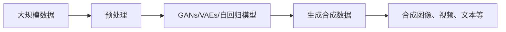

                 

# 生成式AI在中国的商业化前景

> 关键词：生成式AI, 商业化前景, 人工智能, 深度学习, 计算机视觉, 自然语言处理, 图像生成, 文本生成, 中国市场, 技术应用

## 1. 背景介绍

### 1.1 问题由来
随着深度学习技术的飞速发展，生成式AI（Generative AI）成为了人工智能领域的前沿技术。生成式AI通过学习数据分布，能够生成高质量的文本、图像、音频等样本，具有广泛的应用潜力。

在中国，AI技术的商业化进程已进入高速发展期，政府政策的支持和市场需求的驱动，使得生成式AI在商业化前景上呈现出巨大的潜力和机遇。生成式AI技术不仅在提高生产力、优化用户体验方面有着显著效果，而且能够为各行各业带来革命性的变化。

### 1.2 问题核心关键点
生成式AI的商业化前景主要围绕以下几个关键点展开：

1. **技术成熟度**：生成式AI的技术是否成熟稳定，能否满足商业化应用的需求。
2. **市场规模**：市场规模和增长潜力，是否有足够的用户和应用场景支持。
3. **应用场景**：生成式AI在各个行业的应用场景，能否产生实质性效益。
4. **商业模式**：生成式AI的商业化模式，包括SaaS、PaaS、BaaS等，是否具有可扩展性和可持续性。
5. **数据隐私和安全**：数据隐私和安全问题，如何保护用户隐私和数据安全。
6. **法律法规**：生成式AI的法律法规环境，是否有利于商业化发展。

### 1.3 问题研究意义
研究生成式AI在中国的商业化前景，对于推动AI技术的落地应用、加速中国经济数字化转型、提升各行业智能化水平具有重要意义。生成式AI的应用不仅能降低企业成本、提高效率，还能创造出新的商业模式和市场需求，带动相关产业的繁荣发展。

## 2. 核心概念与联系

### 2.1 核心概念概述

生成式AI（Generative AI）是一类能够学习并生成数据的技术。其主要原理是通过构建数据分布，生成符合该分布的新样本。常见的生成式AI技术包括生成对抗网络（GANs）、变分自编码器（VAEs）、自回归模型（如GPT系列）等。

**GANs**：通过两个神经网络（生成器和判别器）相互博弈，生成与训练数据分布相似的合成数据。

**VAEs**：通过学习数据的隐含表示，生成新的数据样本。

**自回归模型**：如GPT、BERT等，通过预测下一时刻的输出，生成序列数据。

这些核心概念通过以下Mermaid流程图展示它们的联系：

```mermaid
graph LR
    A[生成对抗网络 (GANs)] --> B[生成数据]
    A --> C[变分自编码器 (VAEs)]
    B --> D[合成图像、视频]
    B --> E[合成文本]
    C --> F[隐含表示]
    F --> G[生成新数据]
    G --> H[生成文本、图像]
    H --> I[生成自然语言]
```

### 2.2 概念间的关系

这些核心概念之间存在紧密的联系，构成了生成式AI的技术框架：

1. **GANs**：主要用于生成图像、视频等视觉数据，其核心在于生成器和判别器的对抗博弈过程。
2. **VAEs**：主要用于生成连续数据，其核心在于学习数据的隐含表示，生成新的数据样本。
3. **自回归模型**：主要用于生成文本、音频等序列数据，其核心在于预测模型结构的自回归机制。

这些技术互相补充，构成了生成式AI的完整生态系统。

### 2.3 核心概念的整体架构

通过以下综合流程图，展示这些核心概念在大规模数据生成任务中的整体架构：



这个综合流程图展示了从数据预处理到生成数据流的全过程，其中生成对抗网络和变分自编码器分别用于生成视觉数据和连续数据，而自回归模型用于生成序列数据。

## 3. 核心算法原理 & 具体操作步骤

### 3.1 算法原理概述

生成式AI的核心算法原理是基于概率生成模型，通过学习数据的分布，生成符合该分布的新数据。

以GANs为例，其原理是通过生成器和判别器的对抗训练，生成器试图生成逼真的数据样本，而判别器则试图区分生成数据和真实数据。训练过程中，生成器和判别器相互博弈，直至达到纳什均衡，生成器能够生成高质量的合成数据。

### 3.2 算法步骤详解

生成式AI的训练流程主要包括以下步骤：

1. **数据准备**：收集并预处理数据，包括数据清洗、归一化等。
2. **模型搭建**：选择合适的生成式模型（如GANs、VAEs等）并搭建网络结构。
3. **训练优化**：使用训练数据集进行模型训练，通过对抗博弈过程优化模型参数。
4. **生成测试**：使用训练好的模型生成新数据，并进行评估和优化。

以GANs为例，训练过程分为以下步骤：

1. **生成器训练**：生成器接收噪声向量作为输入，生成逼真的图像样本。
2. **判别器训练**：判别器接收图像样本作为输入，输出真实性评分。
3. **对抗训练**：交替训练生成器和判别器，直至生成器生成的图像样本能够以较高概率欺骗判别器。
4. **测试评估**：使用测试集对生成的图像样本进行质量评估，调整模型参数。

### 3.3 算法优缺点

生成式AI的优点包括：

1. **数据生成能力强**：能够生成高质量的图像、视频、文本等数据，满足各种应用需求。
2. **应用广泛**：广泛应用于计算机视觉、自然语言处理、游戏设计等领域。
3. **灵活性高**：可以根据不同应用场景，选择合适的生成式模型和优化策略。

其缺点包括：

1. **训练复杂度高**：生成式AI的训练过程复杂，需要大量的计算资源和时间。
2. **数据依赖性强**：生成式AI的生成效果高度依赖于训练数据的质量和多样性。
3. **性能不稳定**：生成式AI的生成效果可能不稳定，存在过拟合或欠拟合的风险。

### 3.4 算法应用领域

生成式AI在多个领域具有广泛的应用前景：

1. **计算机视觉**：用于生成逼真的图像和视频，如人脸生成、场景模拟等。
2. **自然语言处理**：用于生成文本、对话、摘要等，如文本生成、对话生成、摘要生成等。
3. **游戏设计**：用于生成游戏场景、角色、物品等，提升游戏体验。
4. **广告创意**：用于生成广告素材、海报、文案等，提高广告投放效果。
5. **医学影像**：用于生成医学图像、病理切片等，辅助医学诊断和治疗。

## 4. 数学模型和公式 & 详细讲解 & 举例说明

### 4.1 数学模型构建

以GANs为例，其数学模型构建基于概率生成模型，可以形式化为以下过程：

1. **生成器（Generator）**：
   $$
   G(z) \sim P_G(z) \rightarrow x \sim P_{G_z}(x)
   $$
   其中，$z$为随机噪声向量，$G(z)$表示生成器生成的图像样本。

2. **判别器（Discriminator）**：
   $$
   D(x) \sim P_D(x) \rightarrow \hat{p}(x)
   $$
   其中，$x$为输入图像样本，$\hat{p}(x)$表示判别器对$x$的真实性评分。

3. **联合训练目标**：
   $$
   \min_G \max_D V(G, D) = \mathbb{E}_{x \sim P_{\text{data}}(x)} \log D(x) + \mathbb{E}_{z \sim P_z(z)} \log (1 - D(G(z)))
   $$
   其中，$V(G, D)$表示生成器和判别器的联合损失函数，$P_{\text{data}}(x)$表示真实数据分布，$P_z(z)$表示随机噪声向量分布。

### 4.2 公式推导过程

GANs的训练过程基于梯度下降优化算法，对生成器和判别器交替优化。生成器的优化目标为：

$$
\min_G \mathbb{E}_{x \sim P_{\text{data}}(x)} \log (1 - D(G(z)))
$$

判别器的优化目标为：

$$
\max_D \mathbb{E}_{x \sim P_{\text{data}}(x)} \log D(x) + \mathbb{E}_{z \sim P_z(z)} \log (1 - D(G(z)))
$$

通过交替优化生成器和判别器，生成器逐渐生成逼真的图像样本，判别器逐渐提高区分真实数据和生成数据的能力。

### 4.3 案例分析与讲解

以GANs生成逼真人脸图像为例，分析生成式AI的应用过程：

1. **数据准备**：收集并预处理大量高质量的人脸图像数据，进行归一化、数据增强等处理。
2. **模型搭建**：选择合适的网络结构（如CNN），搭建生成器和判别器。
3. **训练优化**：使用训练数据集对生成器和判别器进行联合训练，交替优化，直至生成器生成的图像样本逼真度达到要求。
4. **生成测试**：使用训练好的生成器模型，生成高质量的人脸图像样本，并进行评估和优化。

## 5. 项目实践：代码实例和详细解释说明

### 5.1 开发环境搭建

1. 安装Anaconda：从官网下载并安装Anaconda，用于创建独立的Python环境。

2. 创建并激活虚拟环境：
```bash
conda create -n pytorch-env python=3.8 
conda activate pytorch-env
```

3. 安装PyTorch：根据CUDA版本，从官网获取对应的安装命令。例如：
```bash
conda install pytorch torchvision torchaudio cudatoolkit=11.1 -c pytorch -c conda-forge
```

4. 安装TensorFlow：
```bash
conda install tensorflow tensorflow-gpu
```

5. 安装Keras：
```bash
conda install keras
```

6. 安装TensorBoard：
```bash
conda install tensorboard
```

完成上述步骤后，即可在`pytorch-env`环境中开始生成式AI的实践。

### 5.2 源代码详细实现

下面以GANs生成人脸图像为例，给出使用PyTorch实现的代码实现。

```python
import torch
from torch import nn
from torch import optim
from torch.utils.data import DataLoader
from torchvision import datasets, transforms

class GAN(nn.Module):
    def __init__(self):
        super(GAN, self).__init__()
        self.gen = nn.Sequential(
            nn.Linear(100, 256),
            nn.LeakyReLU(0.2, inplace=True),
            nn.BatchNorm1d(256),
            nn.Linear(256, 512),
            nn.LeakyReLU(0.2, inplace=True),
            nn.BatchNorm1d(512),
            nn.Linear(512, 784),
            nn.Tanh()
        )
        
    def forward(self, z):
        x = self.gen(z)
        return x

class Discriminator(nn.Module):
    def __init__(self):
        super(Discriminator, self).__init__()
        self.dis = nn.Sequential(
            nn.Linear(784, 512),
            nn.LeakyReLU(0.2, inplace=True),
            nn.Dropout(0.5),
            nn.Linear(512, 256),
            nn.LeakyReLU(0.2, inplace=True),
            nn.Dropout(0.5),
            nn.Linear(256, 1),
            nn.Sigmoid()
        )
        
    def forward(self, x):
        x = x.view(-1, 784)
        x = self.dis(x)
        return x

# 加载数据集
transform = transforms.Compose([
    transforms.ToTensor(),
    transforms.Normalize((0.5, 0.5, 0.5), (0.5, 0.5, 0.5))
])

train_data = datasets.MNIST(root='./data', train=True, download=True, transform=transform)
train_loader = DataLoader(train_data, batch_size=128, shuffle=True)

# 定义模型和优化器
G = GAN()
D = Discriminator()

G_optim = optim.Adam(G.parameters(), lr=0.0002)
D_optim = optim.Adam(D.parameters(), lr=0.0002)

# 训练过程
for epoch in range(100):
    for i, (img, _) in enumerate(train_loader):
        batch_size = img.size(0)
        real_imgs = Variable(img.type(torch.FloatTensor).cuda())
        
        # 生成数据
        z = Variable(torch.randn(batch_size, 100).cuda(), volatile=True)
        fake_imgs = G(z)
        
        # 训练生成器
        G_optim.zero_grad()
        D_real = D(real_imgs)
        D_fake = D(fake_imgs)
        g_loss = criterion(D_fake, True)
        g_loss.backward()
        G_optim.step()
        
        # 训练判别器
        D_optim.zero_grad()
        D_real_loss = criterion(D_real, True)
        D_fake_loss = criterion(D_fake, False)
        d_loss = (D_real_loss + D_fake_loss) / 2
        d_loss.backward()
        D_optim.step()
        
        if (i+1) % 100 == 0:
            print('Epoch [{}/{}], Step [{}/{}], D loss: {:.4f}, G loss: {:.4f}'.format(
                epoch+1, 100, i+1, len(train_loader), d_loss.data[0], g_loss.data[0]))
```

### 5.3 代码解读与分析

让我们再详细解读一下关键代码的实现细节：

**GAN类**：
- `__init__`方法：初始化生成器和判别器的网络结构。
- `forward`方法：前向传播生成逼真的图像样本。

**数据加载**：
- `transform`：数据预处理，将图像数据归一化到[-1, 1]之间。
- `train_data`：加载MNIST数据集，并进行归一化处理。
- `train_loader`：将数据集划分为批处理加载，方便模型训练。

**模型和优化器**：
- `G`和`D`：定义生成器和判别器的模型。
- `G_optim`和`D_optim`：定义生成器和判别器的优化器。

**训练过程**：
- 使用Adam优化器对生成器和判别器交替优化，直至生成高质量的图像样本。

**输出结果**：
- 训练过程中，每100步输出一次生成器和判别器的损失值，以供调整训练参数。

## 6. 实际应用场景

### 6.1 智能媒体制作

生成式AI在智能媒体制作中的应用广泛，包括图像生成、视频编辑、音乐创作等。通过生成式AI，智能媒体制作可以实现自动化、个性化、高效率的生产流程。

1. **图像生成**：自动生成高质量的媒体图片，如人物肖像、风景图片等，提高媒体内容生产效率。
2. **视频编辑**：自动生成逼真的视频素材，如背景特效、角色动作等，提升视频制作质量。
3. **音乐创作**：自动生成符合音乐风格的新曲，激发创意灵感，提升音乐创作效率。

### 6.2 数字艺术设计

生成式AI在数字艺术设计中的应用，能够帮助设计师快速生成创意作品，提高设计效率和质量。

1. **图像生成**：自动生成逼真的图像素材，如角色、背景、道具等，提升设计创意和效果。
2. **视频动画**：自动生成逼真的动画场景和角色动作，提升动画制作效率和质量。
3. **虚拟现实**：自动生成逼真的虚拟环境，提升虚拟现实体验和互动效果。

### 6.3 游戏开发与交互

生成式AI在游戏开发中的应用，能够为游戏提供更加丰富的交互体验，提升游戏趣味性和用户粘性。

1. **角色生成**：自动生成多样化的角色形象，提升游戏世界的丰富度和可玩性。
2. **场景生成**：自动生成逼真的游戏场景，提升游戏的视觉体验和沉浸感。
3. **动态生成**：自动生成动态变化的敌人和物品，提升游戏挑战性和趣味性。

### 6.4 未来应用展望

随着生成式AI技术的不断发展，其应用场景将更加广泛，商业化前景也将更加广阔。未来生成式AI的应用方向可能包括：

1. **生成式艺术创作**：通过生成式AI创作绘画、雕塑等艺术作品，提升艺术创作效率和质量。
2. **个性化推荐系统**：利用生成式AI生成个性化推荐内容，提升用户体验和满意度。
3. **智能家居设计**：通过生成式AI生成智能家居设计方案，提升家居设计效率和创新性。
4. **智能城市规划**：利用生成式AI生成城市规划方案，提升城市管理效率和质量。

## 7. 工具和资源推荐

### 7.1 学习资源推荐

1. **《深度学习》课程**：斯坦福大学开设的深度学习课程，涵盖深度学习基础和前沿技术。
2. **《生成对抗网络》书籍**：详细介绍了GANs的理论和实践，是学习生成式AI的必备资料。
3. **《TensorFlow官方文档》**：TensorFlow的官方文档，提供了丰富的代码示例和操作指南。
4. **《PyTorch官方文档》**：PyTorch的官方文档，提供了详细的API文档和示例代码。
5. **arXiv预印本**：人工智能领域最新研究成果的发布平台，涵盖大量生成式AI的最新论文和进展。

### 7.2 开发工具推荐

1. **TensorFlow**：基于Python的开源深度学习框架，生产部署方便，适合大规模工程应用。
2. **PyTorch**：基于Python的开源深度学习框架，灵活动态的计算图，适合快速迭代研究。
3. **Jupyter Notebook**：交互式笔记本，方便代码调试和实时展示结果。
4. **GitHub**：代码托管平台，方便版本控制和代码协作。

### 7.3 相关论文推荐

1. **《Image-to-Image Translation with Conditional Adversarial Networks》**：提出条件生成对抗网络，用于图像生成和图像转换。
2. **《Generative Adversarial Nets》**：提出GANs，用于生成逼真的图像和视频。
3. **《Unsupervised Text Generation using Deep LSTM-based Models》**：提出LSTM生成模型，用于文本生成。
4. **《Deep Unsupervised Learning using Nonequilibrium Thermodynamics》**：提出VAEs，用于生成连续数据。

## 8. 总结：未来发展趋势与挑战

### 8.1 总结

本文对生成式AI在中国的商业化前景进行了全面系统的介绍。首先阐述了生成式AI的技术成熟度、市场规模、应用场景和商业模式等关键点，明确了生成式AI在商业化应用中的潜在价值。其次，从原理到实践，详细讲解了生成式AI的数学模型、公式推导和案例分析，给出了生成式AI项目实践的代码实现和解释。最后，探讨了生成式AI在未来各个行业的潜在应用和未来发展趋势，并总结了面临的挑战和研究展望。

通过本文的系统梳理，可以看到，生成式AI在中国的商业化前景广阔，技术发展迅速，应用场景多样，具有巨大的商业价值和社会效益。未来，随着生成式AI技术的不断进步，其应用范围和商业化模式将不断拓展，推动人工智能技术的进一步发展。

### 8.2 未来发展趋势

展望未来，生成式AI的发展趋势包括：

1. **技术进步**：生成式AI的算法和技术将不断进步，生成效果将更加逼真和多样化。
2. **应用拓展**：生成式AI的应用将拓展到更多领域，如艺术创作、智能家居、城市规划等。
3. **商业模式**：生成式AI的商业模式将更加多样，如SaaS、PaaS、BaaS等。
4. **法律法规**：生成式AI的法律法规将逐渐完善，保护用户隐私和数据安全。
5. **伦理道德**：生成式AI的伦理道德问题将受到更多关注，确保算法的可解释性和公正性。

### 8.3 面临的挑战

尽管生成式AI的商业化前景广阔，但在迈向更加智能化、普适化应用的过程中，仍面临以下挑战：

1. **数据隐私和安全**：生成式AI的生成效果高度依赖于训练数据的质量和多样性，但同时也可能泄露用户隐私和数据安全问题。
2. **计算资源**：生成式AI的训练和推理过程对计算资源的需求高，如何高效利用计算资源是关键问题。
3. **技术成熟度**：生成式AI的算法和技术仍需不断完善，生成效果和效率有待提升。
4. **伦理道德**：生成式AI的伦理道德问题需要更多关注，避免生成有害内容。

### 8.4 研究展望

未来生成式AI的研究方向包括：

1. **隐私保护**：研究如何保护用户隐私和数据安全，避免生成有害内容。
2. **计算优化**：研究如何高效利用计算资源，提升生成式AI的训练和推理效率。
3. **算法改进**：研究如何改进生成式AI的算法和技术，提升生成效果和效果多样性。
4. **伦理道德**：研究生成式AI的伦理道德问题，确保算法的可解释性和公正性。

这些研究方向将推动生成式AI技术的进一步发展，为其在中国的商业化应用提供有力支持。

## 9. 附录：常见问题与解答

**Q1：生成式AI的训练过程复杂度高，如何优化？**

A: 生成式AI的训练过程复杂度高，可以通过以下方法优化：

1. **数据增强**：通过回译、近义替换等方式扩充训练集，提高数据多样性。
2. **模型简化**：简化网络结构，去除不必要的层和参数，减小计算资源消耗。
3. **硬件加速**：使用GPU/TPU等高性能设备，提高训练速度。
4. **优化器选择**：选择适合生成式AI的优化器，如Adam、SGD等。
5. **超参数调优**：调整学习率、批大小等超参数，优化训练效果。

通过这些方法，可以显著降低生成式AI的训练复杂度，提高训练效率。

**Q2：生成式AI的生成效果不稳定，如何解决？**

A: 生成式AI的生成效果不稳定，可以通过以下方法解决：

1. **数据预处理**：对训练数据进行归一化、数据增强等处理，提高数据质量。
2. **模型优化**：选择适合的生成式模型和优化策略，提升模型效果。
3. **正则化技术**：使用L2正则、Dropout等正则化技术，防止过拟合。
4. **多模型集成**：训练多个生成式模型，取平均输出，提高生成效果稳定性。
5. **评估指标**：使用多样化的评估指标，如Inception Score、FID等，综合评价生成效果。

通过这些方法，可以提升生成式AI的生成效果稳定性，满足实际应用需求。

**Q3：生成式AI在各个行业的应用前景如何？**

A: 生成式AI在各个行业的应用前景广阔，包括但不限于：

1. **智能媒体制作**：自动生成高质量的媒体内容，提升生产效率。
2. **数字艺术设计**：自动生成创意作品，提升设计效率和质量。
3. **游戏开发与交互**：生成多样化的游戏内容，提升游戏趣味性和用户体验。
4. **数字娱乐**：生成逼真的虚拟环境，提升娱乐体验和互动效果。
5. **智能家居设计**：自动生成家居设计方案，提升设计效率和创新性。
6. **智能城市规划**：自动生成城市规划方案，提升城市管理效率和质量。

通过生成式AI，各行业可以大幅提升生产效率和创新性，带来显著的商业价值和社会效益。

**Q4：生成式AI的伦理道德问题如何避免？**

A: 生成式AI的伦理道德问题需要通过以下方法避免：

1. **数据筛选**：对训练数据进行筛选，去除有害、敏感的内容，保护用户隐私。
2. **模型监督**：在生成过程中引入人工监督机制，确保生成内容符合伦理道德要求。
3. **算法透明**：使用可解释的生成算法，提升算法的透明性和可解释性。
4. **用户教育**：对用户进行教育，引导用户正确使用生成式AI技术。
5. **法律法规**：制定生成式AI的法律法规，保护用户权益，规范生成式AI的应用。

通过这些方法，可以避免生成式AI的伦理道德问题，确保其应用符合伦理道德要求。

---

作者：禅与计算机程序设计艺术 / Zen and the Art of Computer Programming

