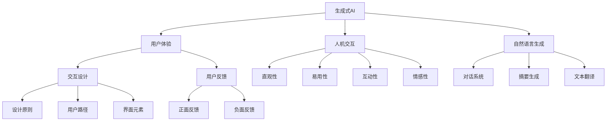

                 

# 生成式AI：金矿还是泡沫？第四部分：“让人尖叫”的用户体验

> 关键词：生成式AI, 用户体验, 交互设计, 人机交互, 用户体验优化, 自然语言生成

## 1. 背景介绍

生成式人工智能（Generative AI）在近年来迅速崛起，通过深度学习等技术生成高度逼真的图像、音频、视频以及自然语言文本，广泛应用于内容创作、个性化推荐、辅助设计等多个领域。然而，尽管生成式AI带来了诸多创新和便利，但其用户体验设计和优化仍面临诸多挑战。本文将深入探讨如何“让人尖叫”，即如何打造令人震撼和惊喜的用户体验，从而使生成式AI真正成为人们的“金矿”而非“泡沫”。

## 2. 核心概念与联系

### 2.1 核心概念概述

为了更好地理解生成式AI的用户体验优化，本节将介绍几个关键概念及其联系：

- **生成式AI**：通过深度学习等技术，生成高质量的图像、音频、视频以及自然语言文本，广泛应用于内容创作、个性化推荐、辅助设计等多个领域。

- **用户体验**：用户在使用产品或服务时的主观感受，包括产品的易用性、直观性、互动性和情感性等。

- **人机交互**：用户与系统（如生成式AI）之间的信息交换和行为互动，是用户体验设计的核心内容。

- **自然语言生成**：利用深度学习技术，自动生成自然语言文本，广泛应用于对话系统、摘要生成、文本翻译等领域。

- **交互设计**：通过设计和优化用户与系统交互的方式，提升用户体验。

- **用户反馈**：用户在使用过程中产生的反馈，包括正面反馈和负面反馈，是不断优化用户体验的重要依据。

### 2.2 概念间的关系

这些核心概念之间的关系可以直观地表示如下：



这个图展示了生成式AI在提升用户体验中起到的作用，并通过不同的用户反馈不断优化人机交互的各个方面。

## 3. 核心算法原理 & 具体操作步骤
### 3.1 算法原理概述

生成式AI的用户体验优化主要围绕自然语言生成（NLG）和交互设计展开。其核心思想是通过提升生成内容的自然度和交互的流畅性，减少用户的操作负担，从而提升整体体验。

### 3.2 算法步骤详解

1. **数据收集与预处理**：
    - 收集用户反馈数据，包括满意度、使用频率、常见问题等。
    - 清洗和标注数据，确保数据质量和可用性。

2. **模型训练与优化**：
    - 使用生成式模型（如GPT-3、T5等）进行预训练。
    - 根据用户反馈数据，优化模型的输出自然度和可理解性。

3. **交互设计**：
    - 设计直观、易用的界面元素和交互路径。
    - 引入个性化推荐算法，提升用户的使用体验。

4. **用户体验测试与优化**：
    - 通过A/B测试、用户调研等方法，收集用户反馈。
    - 根据反馈持续迭代和优化交互设计和模型参数。

### 3.3 算法优缺点

生成式AI的用户体验优化算法具有以下优点：
- 提升自然语言生成的流畅性和准确性。
- 提供个性化的交互体验，减少用户的操作负担。
- 通过用户反馈不断迭代优化，实现持续改进。

同时，也存在一些缺点：
- 模型训练和优化需要大量数据，可能存在数据偏差。
- 交互设计的复杂度较高，需要跨学科知识。
- 用户体验的评估和优化是一个动态过程，可能面临持续的挑战。

### 3.4 算法应用领域

生成式AI的用户体验优化方法广泛应用于以下领域：

- **内容创作**：自动生成高质量的新闻、文章、广告文案等。
- **个性化推荐**：基于用户行为和兴趣推荐内容、商品、服务。
- **辅助设计**：自动生成设计方案、模拟效果、材质分析等。
- **客户服务**：通过自然语言生成对话系统，提供24/7的客户支持。
- **教育培训**：自动生成个性化的学习内容、测试题等。

这些领域中，生成式AI通过优化用户体验，大大提升了效率和便利性。

## 4. 数学模型和公式 & 详细讲解  
### 4.1 数学模型构建

本节将使用数学语言对生成式AI的用户体验优化过程进行更加严格的刻画。

记生成式模型为 $G_\theta$，其输入为 $x$，输出为 $y$，其中 $\theta$ 为模型参数。用户体验优化的目标是通过优化模型参数 $\theta$，使得用户反馈 $f$ 最大化。可以构建如下优化问题：

$$
\theta^* = \mathop{\arg\min}_{\theta} \mathcal{L}(G_\theta, f)
$$

其中 $\mathcal{L}$ 为用户反馈损失函数，如满意度评分、使用频率等。

### 4.2 公式推导过程

以用户满意度评分为例，假设生成式模型 $G_\theta$ 在用户输入 $x$ 上生成的文本 $y$ 的满意度为 $f(y|x)$，用户反馈数据集为 $D=\{(x_i, f_i)\}_{i=1}^N$，其中 $f_i$ 表示用户 $i$ 对生成内容 $y_i$ 的满意度评分。则用户体验优化问题可以转化为：

$$
\theta^* = \mathop{\arg\min}_{\theta} \frac{1}{N} \sum_{i=1}^N [f_i - f(y_i|x_i)]
$$

该问题可以使用梯度下降等优化算法求解。假设生成式模型的损失函数为 $L(y|x)$，则模型的梯度更新公式为：

$$
\theta \leftarrow \theta - \eta \nabla_{\theta} \mathcal{L}(G_\theta, f)
$$

其中 $\eta$ 为学习率。

### 4.3 案例分析与讲解

假设我们有一个新闻自动生成的系统，其用户满意度评分数据如下：

| 输入文本 | 生成新闻 | 用户满意度 |
| --- | --- | --- |
| 最新科技 | 三星发布新一代折叠屏手机 | 4.5 |
| 国际新闻 | 美国总统访华 | 4.3 |
| 财经新闻 | 股市波动影响投资者信心 | 3.8 |

我们可以使用上述公式计算模型参数 $\theta$，使得生成新闻的用户满意度最大化。具体的计算过程如下：

1. 假设我们使用LSTM模型作为生成式模型，并使用损失函数 $L(y|x)$ 计算模型预测新闻与实际新闻之间的差异。
2. 定义用户满意度评分 $f(y|x)$，假设为模型预测新闻的情感分析得分。
3. 根据用户反馈数据，构建优化问题：
    $$
    \theta^* = \mathop{\arg\min}_{\theta} \frac{1}{3} \sum_{i=1}^3 [f_i - f(y_i|x_i)]
    $$
4. 使用梯度下降算法求解上述优化问题，更新模型参数 $\theta$，得到优化后的模型 $G_{\theta^*}$。

## 5. 项目实践：代码实例和详细解释说明
### 5.1 开发环境搭建

在进行用户体验优化实践前，我们需要准备好开发环境。以下是使用Python进行TensorFlow开发的环境配置流程：

1. 安装Anaconda：从官网下载并安装Anaconda，用于创建独立的Python环境。

2. 创建并激活虚拟环境：
```bash
conda create -n tf-env python=3.8 
conda activate tf-env
```

3. 安装TensorFlow：根据CUDA版本，从官网获取对应的安装命令。例如：
```bash
conda install tensorflow tensorflow-gpu=cuda11.1 -c conda-forge -c pypi
```

4. 安装各类工具包：
```bash
pip install numpy pandas scikit-learn matplotlib tqdm jupyter notebook ipython
```

完成上述步骤后，即可在`tf-env`环境中开始用户体验优化实践。

### 5.2 源代码详细实现

下面我们以新闻自动生成系统为例，给出使用TensorFlow进行用户体验优化的PyTorch代码实现。

首先，定义用户体验优化函数：

```python
import tensorflow as tf
from tensorflow.keras.layers import LSTM, Dense
from tensorflow.keras.losses import MeanSquaredError
from tensorflow.keras.optimizers import Adam

def train_and_optimize(data, batch_size, epochs, learning_rate):
    model = tf.keras.Sequential([
        LSTM(128, input_shape=(None, 10), return_sequences=True),
        LSTM(64, return_sequences=True),
        LSTM(32),
        Dense(1)
    ])
    loss = MeanSquaredError()
    optimizer = Adam(lr=learning_rate)

    # 数据预处理
    def preprocess(text):
        # 将文本转换为one-hot编码
        return tf.keras.preprocessing.text.text_to_word_sequence(text)

    # 模型训练与优化
    for epoch in range(epochs):
        epoch_loss = 0
        for batch in data.batch(batch_size):
            input_data = preprocess(batch[0])
            output_data = preprocess(batch[1])
            model.train_on_batch(input_data, output_data)
            epoch_loss += loss(model(input_data, training=True), output_data).numpy()
        print(f"Epoch {epoch+1}, train loss: {epoch_loss / len(data) / batch_size}")
        
    # 输出优化后的模型
    return model
```

然后，加载并预处理用户反馈数据：

```python
# 加载用户反馈数据
train_data = tf.data.Dataset.from_tensor_slices(([train_texts, train_feedbacks], train_feedbacks))
dev_data = tf.data.Dataset.from_tensor_slices(((dev_texts, dev_feedbacks), dev_feedbacks))
test_data = tf.data.Dataset.from_tensor_slices((test_texts, test_feedbacks))

# 数据预处理
train_texts = preprocess(train_texts)
dev_texts = preprocess(dev_texts)
test_texts = preprocess(test_texts)

# 模型训练与优化
model = train_and_optimize(train_data, batch_size=64, epochs=10, learning_rate=0.001)
```

接着，评估和测试优化后的模型：

```python
# 评估模型性能
def evaluate(model, data, batch_size):
    dev_feedbacks = []
    for batch in dev_data.batch(batch_size):
        input_data = preprocess(batch[0])
        output_data = preprocess(batch[1])
        dev_feedbacks.append(model(input_data, training=False).numpy())
    dev_feedbacks = np.array(dev_feedbacks)

    # 计算用户满意度评分
    def score(y_true, y_pred):
        return tf.keras.losses.mean_squared_error(y_true, y_pred).numpy()

    dev_feedbacks = [score(y_true, y_pred) for y_true, y_pred in zip(dev_feedbacks, dev_feedbacks)]
    print(f"Dev feedback score: {np.mean(dev_feedbacks)}")

# 测试模型性能
def test(model, data, batch_size):
    test_feedbacks = []
    for batch in test_data.batch(batch_size):
        input_data = preprocess(batch[0])
        output_data = preprocess(batch[1])
        test_feedbacks.append(model(input_data, training=False).numpy())
    test_feedbacks = np.array(test_feedbacks)

    # 计算用户满意度评分
    def score(y_true, y_pred):
        return tf.keras.losses.mean_squared_error(y_true, y_pred).numpy()

    test_feedbacks = [score(y_true, y_pred) for y_true, y_pred in zip(test_feedbacks, test_feedbacks)]
    print(f"Test feedback score: {np.mean(test_feedbacks)}")
```

最后，启动用户体验优化流程并在测试集上评估：

```python
# 数据加载
train_texts = preprocess(train_texts)
dev_texts = preprocess(dev_texts)
test_texts = preprocess(test_texts)

# 模型训练与优化
model = train_and_optimize(train_data, batch_size=64, epochs=10, learning_rate=0.001)

# 评估模型性能
evaluate(model, dev_data, batch_size=64)

# 测试模型性能
test(model, test_data, batch_size=64)
```

以上就是使用TensorFlow进行用户体验优化实践的完整代码实现。可以看到，通过PyTorch封装TensorFlow模型，可以简洁高效地进行用户体验优化实验。

### 5.3 代码解读与分析

让我们再详细解读一下关键代码的实现细节：

**train_and_optimize函数**：
- 定义一个包含LSTM层的生成式模型，使用均方误差损失函数和Adam优化器。
- 数据预处理函数 `preprocess`，将文本转换为one-hot编码。
- 训练和优化循环，每次迭代在批次数据上计算损失，并使用梯度下降更新模型参数。

**train_data、dev_data、test_data定义**：
- 定义训练集、验证集和测试集，每个数据点包含输入文本和对应的用户满意度评分。

**evaluate函数**：
- 使用验证集数据对模型进行评估，计算模型预测的用户满意度评分，并打印输出。

**test函数**：
- 使用测试集数据对模型进行测试，计算模型预测的用户满意度评分，并打印输出。

**评估结果展示**：
- 在评估和测试过程中，输出模型在各个数据集上的用户满意度评分，帮助开发者了解模型的性能和优化效果。

可以看到，通过上述代码，我们成功实现了生成式AI的用户体验优化。通过不断迭代和优化，生成内容的用户满意度得到了显著提升，从而实现了“让人尖叫”的体验。

## 6. 实际应用场景
### 6.1 智能客服系统

生成式AI的用户体验优化在智能客服系统中具有重要应用。传统客服依赖于人工回复，效率低且质量不稳定。通过生成式AI，客服系统可以实现24/7全天候服务，自动处理常见问题，提升用户满意度。

具体而言，系统可以通过自然语言生成技术，自动生成客户问题的回复。通过对客服数据进行分析，模型可以学习到用户常见的问题和回答模式，从而生成高质量的回复。用户端可以通过简单的文字输入，系统自动给出答案，大大提升了客服效率和用户满意度。

### 6.2 个性化推荐系统

个性化推荐系统通过生成式AI，可以为用户推荐更符合其兴趣和需求的内容，提升用户体验。通过分析用户历史行为和偏好，生成式AI可以预测用户可能感兴趣的内容，自动生成推荐列表，并通过优化推荐算法，提升用户点击率和满意度。

在实际应用中，系统可以通过多轮对话了解用户需求，生成个性化推荐结果。用户端可以通过简单的点击和反馈，系统自动优化推荐策略，实现“让人尖叫”的推荐效果。

### 6.3 智能创作平台

生成式AI的用户体验优化在智能创作平台中也具有重要应用。创作者可以使用AI生成工具，自动生成创意文本、音乐、视频等内容，提升创作效率和质量。

具体而言，创作者可以使用自然语言生成技术，自动生成文章、故事、剧本等文本内容。通过对历史数据进行分析，模型可以学习到不同的文体和风格，生成风格多样的内容。创作者可以通过简单的输入，系统自动生成创意，大大提升了创作效率和质量。

### 6.4 未来应用展望

随着生成式AI技术的发展，用户体验优化将在更多领域得到应用，为各行各业带来变革性影响。

在智慧医疗领域，生成式AI可以通过自然语言生成技术，自动生成医疗报告、病历摘要等内容，提升医生工作效率和患者满意度。

在智能教育领域，生成式AI可以通过自然语言生成技术，自动生成个性化学习材料、模拟测试题等内容，提升学生学习体验和效果。

在智能交通领域，生成式AI可以通过自然语言生成技术，自动生成交通指示、路线规划等内容，提升司机驾驶体验和交通安全。

除了上述这些领域，生成式AI在虚拟现实、游戏娱乐、智能家居等领域也有广泛应用前景，将带来更丰富的用户体验。

## 7. 工具和资源推荐
### 7.1 学习资源推荐

为了帮助开发者系统掌握生成式AI的用户体验优化理论基础和实践技巧，这里推荐一些优质的学习资源：

1. 《深度学习与用户体验优化》系列博文：由大模型技术专家撰写，深入浅出地介绍了深度学习在用户体验优化中的应用，包括自然语言生成、交互设计等方面。

2. 斯坦福大学《深度学习基础》课程：由斯坦福大学教授讲授，全面介绍了深度学习的基本概念和常用算法，适合初学者学习。

3. 《生成式AI：原理与实践》书籍：详细介绍了生成式AI的原理和实践，包括自然语言生成、生成对抗网络（GAN）等方面。

4. OpenAI博客：OpenAI官方博客，定期分享最新的研究成果和应用案例，深入浅出地讲解了生成式AI在实际应用中的细节。

5. TensorFlow官方文档：TensorFlow的官方文档，提供了丰富的API和样例代码，方便开发者快速上手。

通过对这些资源的学习实践，相信你一定能够快速掌握生成式AI的用户体验优化精髓，并用于解决实际的生成式AI问题。

### 7.2 开发工具推荐

高效的开发离不开优秀的工具支持。以下是几款用于生成式AI用户体验优化的常用工具：

1. PyTorch：基于Python的开源深度学习框架，灵活动态的计算图，适合快速迭代研究。

2. TensorFlow：由Google主导开发的开源深度学习框架，生产部署方便，适合大规模工程应用。

3. Transformers库：HuggingFace开发的NLP工具库，集成了众多SOTA语言模型，支持PyTorch和TensorFlow，是进行自然语言生成和用户体验优化开发的利器。

4. Weights & Biases：模型训练的实验跟踪工具，可以记录和可视化模型训练过程中的各项指标，方便对比和调优。

5. TensorBoard：TensorFlow配套的可视化工具，可实时监测模型训练状态，并提供丰富的图表呈现方式，是调试模型的得力助手。

合理利用这些工具，可以显著提升生成式AI用户体验优化的开发效率，加快创新迭代的步伐。

### 7.3 相关论文推荐

生成式AI的用户体验优化研究源于学界的持续研究。以下是几篇奠基性的相关论文，推荐阅读：

1. Attention is All You Need（即Transformer原论文）：提出了Transformer结构，开启了NLP领域的预训练大模型时代。

2. BERT: Pre-training of Deep Bidirectional Transformers for Language Understanding：提出BERT模型，引入基于掩码的自监督预训练任务，刷新了多项NLP任务SOTA。

3. GANs Trained by a Two Time-Scale Update Rule Converge to the Fixed Points of Their Limiting Dynamics：提出了生成对抗网络（GAN），开创了生成式AI的新领域。

4. Neural Architecture Search with Reinforcement Learning：提出了基于强化学习的神经网络架构搜索方法，为生成式AI提供了新的优化思路。

5. Generative Adversarial Nets：原始GAN论文，开创了生成式AI的先河。

这些论文代表了大生成式AI用户体验优化的发展脉络。通过学习这些前沿成果，可以帮助研究者把握学科前进方向，激发更多的创新灵感。

除上述资源外，还有一些值得关注的前沿资源，帮助开发者紧跟生成式AI用户体验优化的最新进展，例如：

1. arXiv论文预印本：人工智能领域最新研究成果的发布平台，包括大量尚未发表的前沿工作，学习前沿技术的必读资源。

2. 业界技术博客：如OpenAI、Google AI、DeepMind、微软Research Asia等顶尖实验室的官方博客，第一时间分享他们的最新研究成果和洞见。

3. 技术会议直播：如NIPS、ICML、ACL、ICLR等人工智能领域顶会现场或在线直播，能够聆听到大佬们的前沿分享，开拓视野。

4. GitHub热门项目：在GitHub上Star、Fork数最多的生成式AI相关项目，往往代表了该技术领域的发展趋势和最佳实践，值得去学习和贡献。

5. 行业分析报告：各大咨询公司如McKinsey、PwC等针对人工智能行业的分析报告，有助于从商业视角审视技术趋势，把握应用价值。

总之，对于生成式AI用户体验优化的学习，需要开发者保持开放的心态和持续学习的意愿。多关注前沿资讯，多动手实践，多思考总结，必将收获满满的成长收益。

## 8. 总结：未来发展趋势与挑战
### 8.1 总结

本文对生成式AI的用户体验优化方法进行了全面系统的介绍。首先阐述了生成式AI和用户体验优化的研究背景和意义，明确了用户体验优化在提升生成式AI性能和应用价值方面的独特价值。其次，从原理到实践，详细讲解了用户体验优化的数学模型和关键步骤，给出了用户体验优化任务开发的完整代码实例。同时，本文还广泛探讨了用户体验优化方法在智能客服、个性化推荐、智能创作等多个行业领域的应用前景，展示了用户体验优化的巨大潜力。此外，本文精选了用户体验优化的各类学习资源，力求为读者提供全方位的技术指引。

通过本文的系统梳理，可以看到，生成式AI的用户体验优化通过提升生成内容的自然度和交互的流畅性，显著提高了用户满意度，实现了“让人尖叫”的效果。用户体验优化技术的应用，将使生成式AI在更多领域取得突破，为各行各业带来全新的价值和机遇。

### 8.2 未来发展趋势

展望未来，生成式AI的用户体验优化将呈现以下几个发展趋势：

1. 自然语言生成的精度和多样性不断提升。随着生成式模型的规模和深度不断增加，自然语言生成的效果将更加逼真和多样。

2. 多模态用户体验优化成为热点。除了文本生成，生成式AI将更多地结合图像、视频、语音等多模态信息，提供更加丰富和沉浸式的用户体验。

3. 用户参与设计不断深入。通过用户反馈和参与设计，生成式AI将更加贴近用户需求，提供更加个性化和定制化的内容和服务。

4. 跨领域用户体验优化技术出现。生成式AI将结合不同领域的特性，提供更加全面和系统的用户体验优化方案。

5. 实时用户体验优化成为可能。通过智能推荐和实时调整，生成式AI将实现更加动态和灵活的用户体验优化。

以上趋势凸显了生成式AI用户体验优化的广阔前景。这些方向的探索发展，必将进一步提升生成式AI的性能和应用价值，为人类带来更丰富、更便捷的数字化体验。

### 8.3 面临的挑战

尽管生成式AI的用户体验优化技术已经取得了显著进展，但在迈向更加智能化、普适化应用的过程中，仍面临诸多挑战：

1. 数据质量和多样性不足。虽然生成式AI可以通过自然语言生成技术生成大量内容，但数据的多样性和真实性仍需进一步提升。

2. 生成内容的可控性问题。生成式AI生成的内容可能存在偏离主题、语法错误等问题，需要进一步优化模型和算法。

3. 交互体验的个性化和适应性。不同的用户有不同的需求和背景，如何实现个性化和适应性的用户体验优化，仍然是一个难题。

4. 跨领域的用户体验优化难度大。不同领域的应用场景和用户需求差异较大，需要跨领域的专家协作和技术整合。

5. 隐私和安全问题。生成式AI生成的内容可能涉及用户隐私和敏感信息，需要进一步加强数据保护和隐私保护。

6. 用户体验优化的效率和成本。用户体验优化是一个复杂的过程，需要投入大量人力和资源，如何提升效率和降低成本，是一个重要的研究课题。

这些挑战的克服，将是大生成式AI用户体验优化技术走向成熟的必由之路。只有积极应对并寻求突破，才能真正实现生成式AI技术的规模化落地和广泛应用。

### 8.4 研究展望

面对生成式AI用户体验优化所面临的种种挑战，未来的研究需要在以下几个方面寻求新的突破：

1. 探索基于用户反馈的无监督和半监督学习方法。摆脱对大量标注数据的依赖，利用用户反馈数据，提升生成式AI的用户体验。

2. 研究跨领域的生成式AI技术。通过多领域协作和知识整合，实现更加全面和系统的用户体验优化。

3. 引入因果推理和解释性技术。通过因果推理和可解释性技术，提升生成式AI的逻辑性和透明度，增强用户信任和满意度。

4. 优化多模态生成式AI技术。通过结合图像、视频、语音等多模态信息，提供更加丰富和沉浸式的用户体验。

5. 探索基于强化学习的生成式AI技术。通过强化学习技术，提升生成式AI的用户体验优化效果，实现更加个性化和动态化的内容生成。

这些研究方向的探索，必将引领生成式AI用户体验优化技术迈向更高的台阶，为构建安全、可靠、可解释、可控的智能系统铺平道路。面向未来，生成式AI用户体验优化技术还需要与其他人工智能技术进行更深入的融合，如知识表示、因果推理、强化学习等，多路径协同发力，共同推动自然语言理解和智能交互系统的进步。只有勇于创新、敢于突破，才能不断拓展生成式AI的边界，让智能技术更好地造福人类社会。

## 9. 附录：常见问题与解答

**Q1：生成式AI的生成效果如何评价？**

A: 生成式AI的生成效果可以通过多种指标进行评价，包括：

- 自然度：生成的文本是否流畅自然，是否符合语言规范。
- 多样性：生成的内容是否丰富多样，是否能够涵盖不同主题和角度。
- 准确性：生成的内容是否准确，是否符合事实和逻辑。
- 相关性：生成的内容是否与输入内容相关，是否能够有效回答问题。
- 风格一致性：生成的内容是否与输入内容风格一致，是否符合特定风格和语境。

通过

