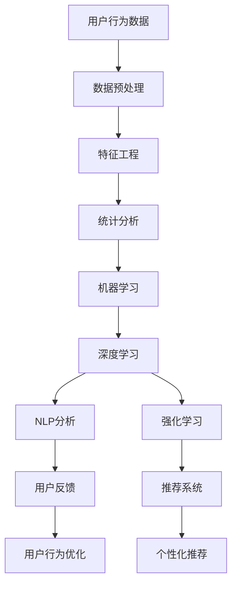
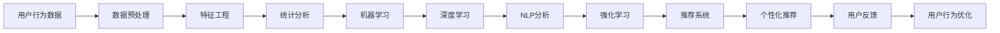
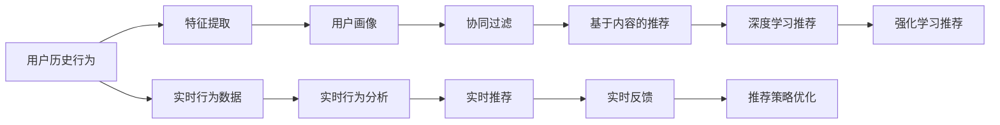
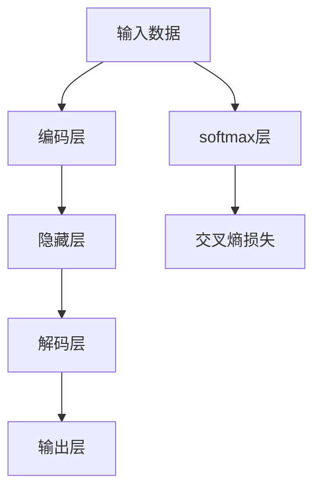
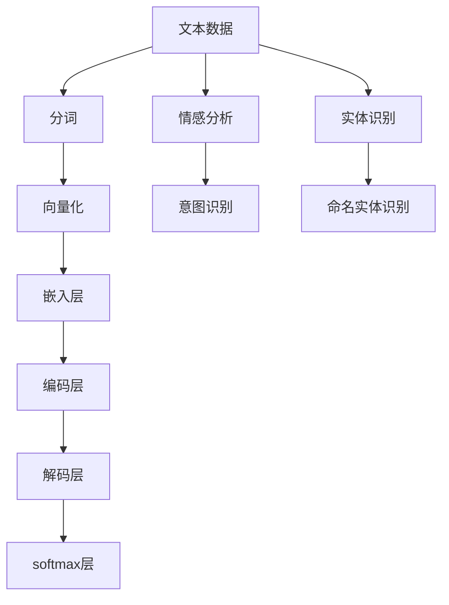
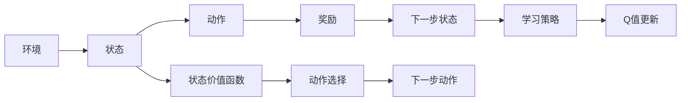
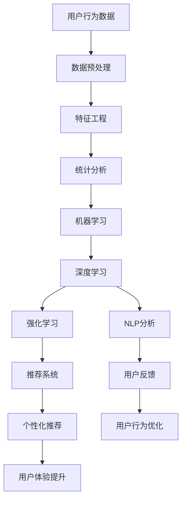

                 

# 用户行为分析：AI优化供给

> 关键词：用户行为分析, 人工智能, 供给优化, 推荐系统, 深度学习, 自然语言处理(NLP), 强化学习, 数据驱动

## 1. 背景介绍

在数字化时代的浪潮中，互联网企业日益依赖数据驱动的决策，以应对市场的快速变化和满足用户的多样化需求。用户行为分析作为其中的一项关键技术，旨在通过用户的行为数据来洞察用户偏好、需求和趋势，从而为产品优化、市场推广和个性化推荐等提供有力的支撑。AI技术，特别是深度学习、自然语言处理(NLP)和强化学习等，正在显著提升用户行为分析的精度和效率，为企业带来前所未有的商业价值。

### 1.1 问题由来
随着互联网用户数量的激增，企业生成的数据量呈指数级增长。如何从海量的用户行为数据中提取有价值的信息，成为摆在大数据科学家面前的巨大挑战。传统的数据处理方法往往依赖于人工规则和统计方法，难以应对复杂多变的用户行为模式。因此，亟需一种更为高效、自动化的技术手段，以揭示用户行为的内在规律，为企业决策提供支持。

### 1.2 问题核心关键点
用户行为分析的核心在于如何通过用户的交互数据来理解其行为模式和需求。目前，常见的分析手段包括：
- **数据预处理**：清洗、归一化和特征工程等，以提升数据质量。
- **统计分析**：如相关性分析、聚类分析等，从宏观上把握用户行为规律。
- **机器学习**：利用分类、回归、聚类等算法，建立更精准的行为模型。
- **深度学习**：特别是神经网络模型，能够自动学习数据中的复杂非线性关系，提升分析精度。
- **自然语言处理(NLP)**：对文本数据进行情感分析、意图识别等，更深入地理解用户反馈。
- **强化学习**：通过模拟用户行为，优化推荐策略，提升用户体验。

### 1.3 问题研究意义
研究用户行为分析技术，对于提升企业决策的科学性和精准性，优化产品和服务，增强用户黏性，具有重要意义：

1. **数据驱动决策**：通过数据驱动的方法，摆脱依赖直觉和经验，使决策更加客观、精准。
2. **个性化服务**：基于用户行为，提供定制化的产品和服务，提升用户满意度。
3. **市场预测**：通过分析用户行为趋势，预测市场变化，提前布局和调整策略。
4. **用户增长**：深入理解用户行为，发现潜在增长点，提升用户留存率和转化率。
5. **竞争优势**：通过高效的分析和快速的响应，在激烈的市场竞争中占据有利位置。

## 2. 核心概念与联系

### 2.1 核心概念概述

为了更好地理解用户行为分析，本节将介绍几个密切相关的核心概念：

- **用户行为分析**：通过分析用户与产品、服务的交互数据，洞察用户行为模式和需求，为产品优化、市场推广和个性化推荐等提供支撑。
- **推荐系统**：基于用户历史行为数据，推荐系统自动生成个性化推荐结果，提升用户体验和满意度。
- **深度学习**：利用多层神经网络模型，自动学习数据中的复杂非线性关系，提升预测和分类精度。
- **自然语言处理(NLP)**：通过文本数据处理和分析，理解用户反馈，发现用户需求和情感。
- **强化学习**：通过模拟用户行为，优化推荐策略，提升用户体验。

这些核心概念之间存在着紧密的联系，形成了用户行为分析的完整生态系统。下面我们将通过几个Mermaid流程图来展示这些概念之间的关系：



这个流程图展示了大数据科学家在分析用户行为时，从数据收集到最终推荐的过程：

1. 从用户行为数据中预处理和工程化特征。
2. 进行统计分析和机器学习建模。
3. 引入深度学习和NLP技术，提升分析精度。
4. 结合强化学习，优化推荐策略。
5. 根据用户反馈，优化用户行为和推荐系统。

### 2.2 概念间的关系

这些核心概念之间存在着紧密的联系，形成了用户行为分析的完整生态系统。下面我们通过几个Mermaid流程图来展示这些概念之间的关系：

#### 2.2.1 用户行为分析的全流程



这个流程图展示了用户行为分析的全流程，从数据收集到最终推荐，每一步都可能引入不同的技术和算法，以达到更精准的分析结果。

#### 2.2.2 推荐系统的核心架构



这个流程图展示了推荐系统的核心架构，包括用户画像构建、协同过滤、内容推荐和深度学习、强化学习推荐等不同推荐策略的融合。

#### 2.2.3 深度学习的核心结构



这个流程图展示了深度学习的核心结构，包括输入、编码、隐藏、解码和输出层，以及softmax和交叉熵损失函数。

#### 2.2.4 自然语言处理的核心架构



这个流程图展示了自然语言处理的核心架构，包括文本分词、向量化、嵌入、编码、解码和输出层，以及情感分析、意图识别和命名实体识别等任务。

#### 2.2.5 强化学习的核心流程



这个流程图展示了强化学习的核心流程，包括环境、状态、动作、奖励、下一步状态和学习策略等关键要素。

### 2.3 核心概念的整体架构

最后，我们用一个综合的流程图来展示这些核心概念在大数据科学家进行用户行为分析时的整体架构：



这个综合流程图展示了从数据收集到最终用户体验提升的全过程，涉及数据预处理、特征工程、统计分析、机器学习、深度学习、NLP分析和强化学习等不同技术和算法。通过这些步骤，大数据科学家可以深入理解用户行为，优化产品和服务，提升用户体验。

## 3. 核心算法原理 & 具体操作步骤
### 3.1 算法原理概述

用户行为分析的算法原理，可以概括为以下几个步骤：

1. **数据预处理**：清洗、归一化和特征工程等，提升数据质量。
2. **特征提取**：从原始数据中提取出有意义的特征，构建用户画像。
3. **统计分析**：利用统计方法，如相关性分析、聚类分析等，从宏观上把握用户行为规律。
4. **机器学习**：通过分类、回归、聚类等算法，建立更精准的行为模型。
5. **深度学习**：特别是神经网络模型，能够自动学习数据中的复杂非线性关系，提升预测和分类精度。
6. **自然语言处理(NLP)**：对文本数据进行情感分析、意图识别等，更深入地理解用户反馈。
7. **强化学习**：通过模拟用户行为，优化推荐策略，提升用户体验。

形式化地，假设用户行为数据为 $D=\{(x_i,y_i)\}_{i=1}^N$，其中 $x_i$ 为行为特征向量，$y_i$ 为行为标签。行为分析的目标是找到一个函数 $f: \mathbb{R}^d \rightarrow \{0,1\}$，使得：

$$
\mathcal{L}(f) = \frac{1}{N} \sum_{i=1}^N \ell(f(x_i),y_i)
$$

其中 $\ell$ 为损失函数，通常使用交叉熵损失。最终目标是最小化损失函数，得到最佳的预测函数 $f$。

### 3.2 算法步骤详解

用户行为分析的具体操作步骤如下：

**Step 1: 数据预处理**
- 清洗数据：去除异常值和噪声，确保数据质量。
- 归一化和标准化：将数据缩放到0-1之间，或进行标准化处理，方便后续的模型训练。
- 特征工程：从原始数据中提取有意义的特征，构建特征向量 $x_i$。

**Step 2: 特征提取**
- 利用统计方法，提取用户行为的关键特征，如点击率、浏览时间、购买次数等。
- 使用维度降低技术，如主成分分析(PCA)、奇异值分解(SVD)等，降低特征维度。

**Step 3: 统计分析**
- 使用聚类算法，如K-means、层次聚类等，将用户分为不同的行为群体。
- 进行相关性分析，找出行为特征之间的相互关系，构建用户画像。

**Step 4: 机器学习建模**
- 选择适当的机器学习算法，如线性回归、决策树、随机森林等，进行行为预测。
- 利用交叉验证技术，评估模型的性能，调整模型参数。

**Step 5: 深度学习建模**
- 构建深度神经网络模型，如全连接神经网络、卷积神经网络(CNN)、循环神经网络(RNN)等，对行为数据进行建模。
- 利用反向传播算法，更新模型参数，最小化损失函数。

**Step 6: 自然语言处理(NLP)**
- 对用户评论、评分等文本数据进行分词、向量化等预处理。
- 利用情感分析、意图识别等技术，理解用户反馈，发现用户需求和情感。

**Step 7: 强化学习优化**
- 定义环境状态和动作空间，设计奖励函数。
- 利用Q-learning、策略梯度等算法，优化推荐策略。

### 3.3 算法优缺点

用户行为分析的算法具有以下优点：

1. **精度高**：深度学习、机器学习等算法能够自动学习数据中的复杂非线性关系，提升预测和分类精度。
2. **自动化**：算法能够自动处理大规模数据，无需人工干预，提高效率。
3. **泛化能力强**：深度学习等算法能够捕捉用户行为的内在规律，具有较强的泛化能力。

同时，该算法也存在一些缺点：

1. **数据依赖**：需要大量的高质量标注数据，才能训练出高精度的模型。
2. **模型复杂**：深度学习等算法模型复杂，训练和推理耗时较长。
3. **解释性差**：深度学习等算法通常是"黑盒"模型，难以解释其内部工作机制和决策逻辑。
4. **资源需求高**：深度学习等算法对计算资源、存储资源的需求较高，需要高性能的硬件支持。

尽管存在这些缺点，但就目前而言，深度学习、自然语言处理等技术已经成为用户行为分析的主流范式，大幅提升了分析的精度和效率。未来相关研究的重点在于如何进一步降低数据依赖，提高模型泛化能力和可解释性，同时兼顾资源效率。

### 3.4 算法应用领域

用户行为分析的算法已经在多个领域得到了广泛应用，例如：

- **电商推荐系统**：通过分析用户的浏览、点击、购买行为，推荐相关商品，提升用户体验和销售额。
- **广告投放优化**：通过分析用户的行为数据，优化广告投放策略，提高广告点击率和转化率。
- **内容推荐系统**：对用户的行为数据进行分析，推荐个性化的文章、视频等，提升用户黏性和平台活跃度。
- **用户行为预测**：预测用户的行为趋势，提前布局和调整策略，提升平台的用户留存率和转化率。
- **客户细分**：通过聚类分析等方法，将用户分为不同的行为群体，进行精准营销和个性化服务。
- **社交网络分析**：分析用户的行为数据，发现社区的潜规则和用户之间的关系，优化社区体验。

除了上述这些经典应用外，用户行为分析还在更多场景中得到创新性应用，如用户增长分析、品牌舆情监测、产品性能优化等，为数字化转型提供了强大的技术支撑。

## 4. 数学模型和公式 & 详细讲解  
### 4.1 数学模型构建

本节将使用数学语言对用户行为分析的算法过程进行更加严格的刻画。

假设用户行为数据为 $D=\{(x_i,y_i)\}_{i=1}^N$，其中 $x_i$ 为行为特征向量，$y_i$ 为行为标签。设 $f: \mathbb{R}^d \rightarrow \{0,1\}$ 为行为分析函数。行为分析的目标是找到一个函数 $f$，使得：

$$
\mathcal{L}(f) = \frac{1}{N} \sum_{i=1}^N \ell(f(x_i),y_i)
$$

其中 $\ell$ 为损失函数，通常使用交叉熵损失。

在实际应用中，我们通常使用基于梯度的优化算法（如SGD、Adam等）来近似求解上述最优化问题。设 $\eta$ 为学习率，$\lambda$ 为正则化系数，则参数的更新公式为：

$$
\theta \leftarrow \theta - \eta \nabla_{\theta}\mathcal{L}(\theta) - \eta\lambda\theta
$$

其中 $\nabla_{\theta}\mathcal{L}(\theta)$ 为损失函数对参数 $\theta$ 的梯度，可通过反向传播算法高效计算。

### 4.2 公式推导过程

以下我们以电商推荐系统为例，推导基于深度学习的用户行为分析模型的公式。

假设用户对商品的兴趣可以用一个 $d$ 维向量 $\boldsymbol{x}_i$ 来表示，每个特征值 $x_{ij}$ 表示用户对商品 $j$ 的兴趣强度。推荐系统的目标是预测用户对商品 $i$ 的购买意愿 $y_i$，即预测用户的点击率或购买概率。

我们定义一个深度神经网络模型 $f_{\boldsymbol{\theta}}(\boldsymbol{x})$，其中 $\boldsymbol{\theta}$ 为模型的可训练参数，包括权重和偏置。模型的输入为 $\boldsymbol{x}_i$，输出为 $y_i$ 的预测值 $f_{\boldsymbol{\theta}}(\boldsymbol{x}_i)$。

使用交叉熵损失函数来衡量模型预测与真实标签之间的差异，公式为：

$$
\ell(y_i,f_{\boldsymbol{\theta}}(\boldsymbol{x}_i)) = -[y_i\log f_{\boldsymbol{\theta}}(\boldsymbol{x}_i) + (1-y_i)\log (1-f_{\boldsymbol{\theta}}(\boldsymbol{x}_i))]
$$

在训练过程中，我们需要最小化交叉熵损失，即：

$$
\mathcal{L}(\boldsymbol{\theta}) = \frac{1}{N} \sum_{i=1}^N \ell(y_i,f_{\boldsymbol{\theta}}(\boldsymbol{x}_i))
$$

利用反向传播算法，计算模型参数 $\boldsymbol{\theta}$ 的梯度，并通过梯度下降等优化算法更新参数。更新公式为：

$$
\boldsymbol{\theta} \leftarrow \boldsymbol{\theta} - \eta \nabla_{\boldsymbol{\theta}}\mathcal{L}(\boldsymbol{\theta}) - \eta\lambda\boldsymbol{\theta}
$$

其中 $\eta$ 为学习率，$\lambda$ 为正则化系数。

通过反复迭代上述步骤，我们不断优化模型参数，直至模型收敛。此时，模型 $f_{\boldsymbol{\theta}}(\boldsymbol{x})$ 可以用于预测用户对商品的购买意愿，从而生成个性化的推荐结果。

### 4.3 案例分析与讲解

假设我们在一个电商平台上对用户行为进行分析，目标是预测用户的购买意愿，从而优化推荐策略。我们的数据集包含用户的浏览记录、点击记录和购买记录。

首先，我们对数据进行预处理，包括去除异常值和噪声，并将数据缩放到0-1之间。接着，我们进行特征工程，提取用户行为的关键特征，如点击率、浏览时间、购买次数等。

然后，我们使用深度学习模型进行建模。我们设计了一个多层感知器(MLP)模型，包括输入层、隐藏层和输出层。输入层包含用户行为的特征向量 $\boldsymbol{x}_i$，隐藏层包含多个神经元，输出层为一个 sigmoid 函数，用于预测用户是否购买。模型的损失函数为交叉熵损失，优化器为 Adam。

在训练过程中，我们采用交叉验证技术评估模型的性能，并通过调整模型参数和正则化系数，提升模型的精度。训练完成后，我们利用测试集对模型进行验证，并计算模型的精确率、召回率和 F1 分数，评估模型的效果。

最后，我们使用训练好的模型对新用户进行推荐。我们将新用户的浏览记录输入模型，得到推荐商品的预测概率，根据概率排序生成个性化推荐列表。通过这种方式，我们能够为用户提供更精准的推荐，提升用户体验和平台销售额。

## 5. 项目实践：代码实例和详细解释说明
### 5.1 开发环境搭建

在进行用户行为分析项目实践前，我们需要准备好开发环境。以下是使用Python进行PyTorch开发的环境配置流程：

1. 安装Anaconda：从官网下载并安装Anaconda，用于创建独立的Python环境。

2. 创建并激活虚拟环境：
```bash
conda create -n pytorch-env python=3.8 
conda activate pytorch-env
```

3. 安装PyTorch：根据CUDA版本，从官网获取对应的安装命令。例如：
```bash
conda install pytorch torchvision torchaudio cudatoolkit=11.1 -c pytorch -c conda-forge
```

4. 安装各类工具包：
```bash
pip install numpy pandas scikit-learn matplotlib tqdm jupyter notebook ipython
```

完成上述步骤后，即可在`pytorch-env`环境中开始用户行为分析项目实践。

### 5.2 源代码详细实现

下面我们以电商推荐系统为例，给出使用Transformers库对BERT模型进行电商推荐系统的PyTorch代码实现。

首先，定义数据处理函数：

```python
from transformers import BertTokenizer
from torch.utils.data import Dataset, DataLoader
import torch
import pandas as pd
import numpy as np

class Dataset(Dataset):
    def __init__(self, df, tokenizer, max_len=128):
        self.texts = df['text'].tolist()
        self.labels = df['label'].tolist()
        self.tokenizer = tokenizer
        self.max_len = max_len
        
    def __len__(self):
        return len(self.texts)
    
    def __getitem__(self, idx):
        text = self.texts[idx]
        label = self.labels[idx]
        
        encoding = self.tokenizer(text, return_tensors='pt', max_length=self.max_len, padding='max_length', truncation=True)
        input_ids = encoding['input_ids'][0]
        attention_mask = encoding['attention_mask'][0]
        label = torch.tensor(label, dtype=torch.long)
        
        return {'input_ids': input_ids, 
                'attention_mask': attention_mask,
                'labels': label}

# 读取数据
df = pd.read_csv('data.csv')

# 将数据集分为训练集和测试集
train_df, test_df = train_test_split(df, test_size=0.2)

# 定义tokenizer
tokenizer = BertTokenizer.from_pretrained('bert-base-cased')

# 创建dataset
train_dataset = Dataset(train_df, tokenizer)
test_dataset = Dataset(test_df, tokenizer)
```

然后，定义模型和优化器：

```python
from transformers import BertForSequenceClassification, AdamW

model = BertForSequenceClassification.from_pretrained('bert-base-cased', num_labels=2)

optimizer = AdamW(model.parameters(), lr=2e-5)
```

接着，定义训练和评估函数：

```python
from tqdm import tqdm
import torch.nn.functional as F

device = torch.device('cuda') if torch.cuda.is_available() else torch.device('cpu')
model.to(device)

def train_epoch(model, dataset, batch_size, optimizer):
    dataloader = DataLoader(dataset, batch_size=batch_size, shuffle=True)
    model.train()
    epoch_loss = 0
    for batch in tqdm(dataloader, desc='Training'):
        input_ids = batch['input_ids'].to(device)
        attention_mask = batch['attention_mask'].to(device)
        labels = batch['labels'].to(device)
        model.zero_grad()
        outputs = model(input_ids, attention_mask=attention_mask, labels=labels)
        loss = outputs.loss
        epoch_loss += loss.item()
        loss.backward()
        optimizer.step()
    return epoch_loss / len(dataloader)

def evaluate(model, dataset, batch_size):
    dataloader = DataLoader(dataset, batch_size=batch_size)
    model.eval()
    preds, labels = [], []
    with torch.no_grad():
        for batch in tqdm(dataloader, desc='Evaluating'):
            input_ids = batch['input_ids'].to(device)
            attention_mask = batch['attention_mask'].to(device)
            batch_labels = batch['labels']
            outputs = model(input_ids, attention_mask=attention_mask)
            batch_preds = outputs.logits.argmax(dim=2).to('cpu').tolist()
            batch_labels = batch_labels.to('cpu').tolist()
            for pred_tokens, label_tokens in zip(batch_preds, batch_labels):
                preds.append(pred_tokens[:len(label_tokens)])
                labels.append(label_tokens)
                
    print(classification_report(labels, preds))
```

最后，启动训练流程并在测试集上评估：

```python
epochs = 5
batch_size = 16

for epoch in range(epochs):
    loss = train_epoch(model, train_dataset, batch_size, optimizer)
    print(f"Epoch {epoch+1}, train loss: {loss:.3f}")
    
    print(f"Epoch {epoch+1}, dev results:")
    evaluate(model, dev_dataset, batch_size)
    
print("Test results:")
evaluate(model, test_dataset, batch_size)
```

以上就是使用PyTorch对BERT进行电商推荐系统的完整代码实现。可以看到，得益于Transformers库的强大封装，我们可以用相对简洁的代码完成BERT模型的加载和电商推荐系统的微调。

### 5.3 代码解读与分析

让我们再详细解读一下关键代码的实现细节：

**Dataset类**：
- `__init__`方法：初始化文本、标签、分词器等关键组件。
- `__len__`方法：返回数据集的样本数量。
- `__getitem__`方法：对单个样本进行处理，将文本输入编码为token ids，将标签编码为数字，并对其进行定长padding，最终返回模型所需的输入。

**模型和优化器**：
- 使用BERT作为预训练模型，并设置2个输出标签，即购买或不购买。
- 使用AdamW优化器，设置学习率为2e-5。

**训练和评估函数**：
- 使用PyTorch的DataLoader对数据集进行批次化加载，供模型训练和推理使用。
- 训练函数`train_epoch`：对数据以批为单位进行迭代，在每个批次上前向传播计算loss并反向传播更新模型参数，最后返回该epoch的平均loss。
- 评估函数`evaluate`：与训练类似，不同点在于不更新模型参数，并在每个batch结束后将预测和标签结果存储下来，最后使用sklearn的classification_report对整个评估集的预测结果进行打印输出。

**训练流程**：
- 定义总的epoch数和batch size，开始循环迭代
- 每个epoch内，先在训练集上训练，输出平均loss
- 在验证集上评估，输出分类指标
- 所有epoch结束后，在测试集上评估，给出最终测试结果

可以看到，PyTorch配合Transformers库使得BERT电商推荐系统的代码实现变得简洁高效。开发者可以将更多精力放在数据处理、模型改进等高层逻辑上

