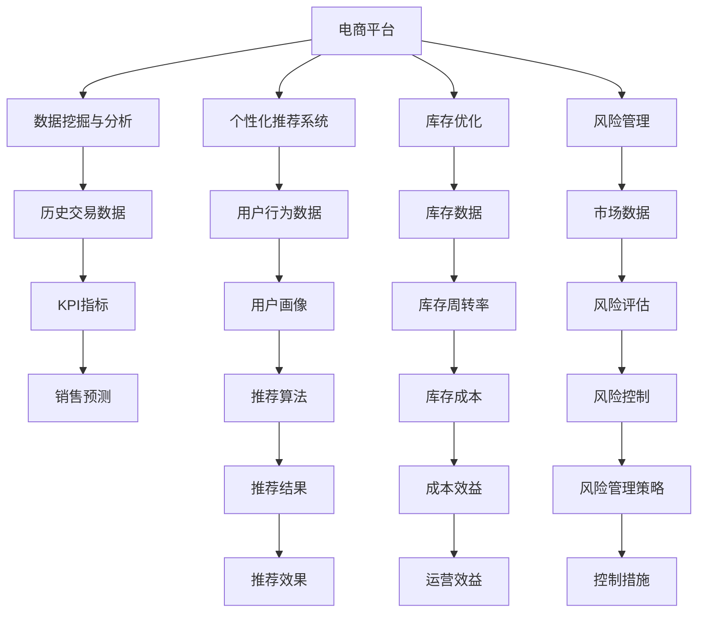
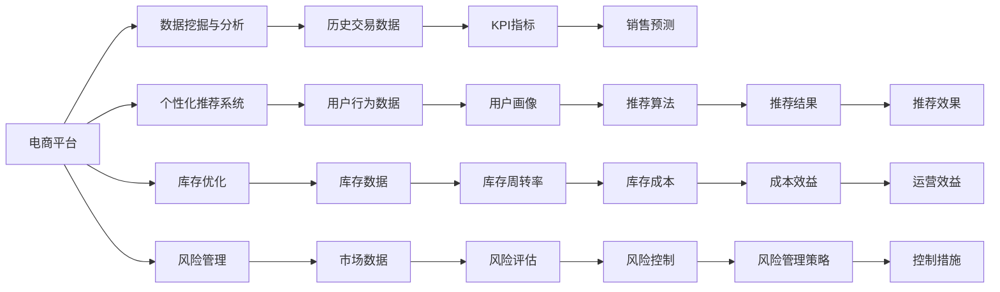
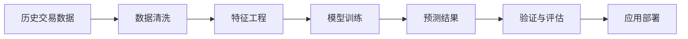
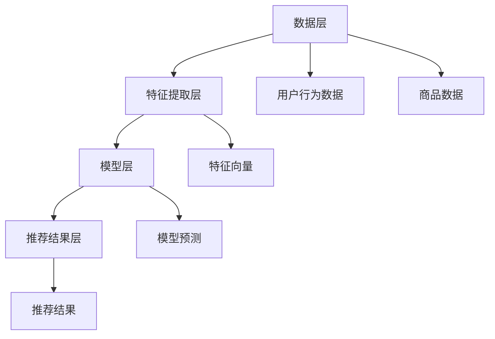

                 

# 电商平台供给能力提升：新品类和新品牌的引入

> 关键词：电商平台, 供给能力, 新品类, 新品牌, 数据分析, 个性化推荐, 库存管理, 消费者行为

## 1. 背景介绍

### 1.1 问题由来
随着消费者需求的多样化，电商平台需要不断引入新品类和新品牌来满足客户需求。然而，对于电商平台来说，新品类和新品牌的引入不仅是业务挑战，更是一个技术难题。具体来说，电商平台在引入新品类和新品牌时，面临着以下几大问题：

1. **需求预测与库存管理**：如何准确预测新品类和新品牌的销售量，从而合理规划库存，避免缺货和库存积压。
2. **个性化推荐**：如何在海量的商品中精准地推荐给目标客户，提升用户体验和平台转化率。
3. **风险控制**：如何评估新品类和新品牌带来的风险，确保平台的商业健康和可持续发展。
4. **数据治理**：如何高效收集、整合和分析相关数据，为业务决策提供支撑。

### 1.2 问题核心关键点
电商平台新品类和新品牌引入的核心在于数据驱动的供给能力提升。这不仅包括对历史数据的分析和预测，还包括对新数据和新趋势的实时监控和应对。具体来说，包括以下几个关键点：

- **数据挖掘与分析**：从平台的历史交易数据中挖掘有价值的信息，预测新品类和新品牌的销售趋势。
- **个性化推荐系统**：构建高效的推荐系统，精准地向客户推荐新品类和新品牌，提高客户满意度和平台转化率。
- **库存优化**：通过智能算法优化库存管理，确保新品类和新品牌的供需平衡，提升平台的供应链效率。
- **风险管理**：评估新品类和新品牌带来的风险，制定相应的风险控制策略，确保平台的长久稳定发展。
- **技术栈选择**：根据具体需求选择合适的技术栈，确保系统高效、可扩展、稳定。

### 1.3 问题研究意义
电商平台新品类和新品牌的引入，对于提升平台的供给能力、拓展市场份额、增强客户粘性具有重要意义。通过数据驱动的决策，电商平台可以更精准地把握市场动态，快速响应客户需求，提升平台的竞争力和市场地位。

- **提升供给能力**：通过数据分析和预测，优化库存管理，提升平台的供给能力，满足客户需求。
- **拓展市场份额**：通过个性化推荐，提高客户满意度和转化率，吸引更多新客户，拓展市场份额。
- **增强客户粘性**：通过智能推荐和风险管理，提升客户体验，增强客户粘性，提高客户忠诚度。
- **技术创新**：通过引入前沿技术，如机器学习、数据挖掘、大数据等，提升平台的技术水平，驱动创新发展。

## 2. 核心概念与联系

### 2.1 核心概念概述

为了更好地理解电商平台新品类和新品牌引入的技术原理和实践方法，本节将介绍几个密切相关的核心概念：

- **电商平台**：指利用互联网技术进行商品展示、交易和服务的中介平台，如淘宝、京东、亚马逊等。
- **供给能力**：指电商平台在特定时间段内提供给客户的商品数量和种类，是衡量电商平台竞争力的重要指标。
- **新品类**：指在电商平台中首次出现的商品类别，如智能穿戴设备、新能源汽车等。
- **新品牌**：指在电商平台中首次出现的商品品牌，如Dior、Louis Vuitton等。
- **数据挖掘与分析**：指从海量数据中提取有用信息和知识的过程，包括数据清洗、特征工程、模型训练等步骤。
- **个性化推荐系统**：指利用机器学习算法，根据用户的历史行为和偏好，推荐最相关的商品的系统。
- **库存优化**：指通过预测和调整，确保商品供需平衡，最大化库存周转率，降低库存成本。
- **风险管理**：指评估和控制不确定性带来的风险，包括市场风险、信用风险、操作风险等。

这些核心概念之间存在着紧密的联系，形成了电商平台新品类和新品牌引入的完整生态系统。下面通过几个Mermaid流程图来展示这些核心概念之间的关系：



这个流程图展示了各个核心概念之间的联系和作用：

1. **电商平台**：通过数据挖掘与分析、个性化推荐系统、库存优化和风险管理等手段，提升平台的供给能力和用户体验。
2. **数据挖掘与分析**：从历史交易数据中挖掘有用信息，用于销售预测和用户画像。
3. **个性化推荐系统**：根据用户行为数据，生成个性化推荐结果，提升客户满意度。
4. **库存优化**：通过库存数据和历史销售数据，预测商品需求，优化库存管理，提高运营效率。
5. **风险管理**：评估市场数据和历史风险数据，制定风险控制策略，保障平台稳定发展。

### 2.2 概念间的关系

这些核心概念之间存在着紧密的联系，形成了电商平台新品类和新品牌引入的完整生态系统。下面通过几个Mermaid流程图来展示这些概念之间的关系：

#### 2.2.1 电商平台的核心技术栈



这个流程图展示了电商平台的核心技术栈，包括数据挖掘与分析、个性化推荐系统、库存优化和风险管理等关键技术。

#### 2.2.2 数据挖掘与分析的流程



这个流程图展示了数据挖掘与分析的流程，包括数据清洗、特征工程、模型训练、预测结果验证与评估，以及模型应用部署等关键步骤。

#### 2.2.3 个性化推荐系统的构成



这个流程图展示了个性化推荐系统的构成，包括数据层、特征提取层、模型层和推荐结果层。

## 3. 核心算法原理 & 具体操作步骤
### 3.1 算法原理概述

电商平台新品类和新品牌引入的算法原理，主要是基于数据驱动的决策和技术驱动的优化。具体来说，包括以下几个关键步骤：

1. **数据挖掘与分析**：利用数据挖掘技术，从历史交易数据中提取有用信息，进行销售预测和用户画像。
2. **个性化推荐系统**：构建个性化推荐模型，根据用户行为数据，生成个性化推荐结果，提升客户满意度。
3. **库存优化**：通过预测和调整，确保商品供需平衡，最大化库存周转率，降低库存成本。
4. **风险管理**：评估市场数据和历史风险数据，制定风险控制策略，保障平台稳定发展。

### 3.2 算法步骤详解

#### 3.2.1 数据挖掘与分析

**Step 1: 数据准备**
- 收集平台的历史交易数据、用户行为数据、市场数据等。
- 对数据进行清洗和预处理，去除噪声和异常值，确保数据质量。

**Step 2: 特征工程**
- 根据业务需求和数据特点，设计特征变量，包括用户行为特征、商品特征、时间特征等。
- 进行特征选择和降维，去除冗余和无关特征，提高模型效果。

**Step 3: 模型训练**
- 选择合适的机器学习模型，如回归模型、分类模型、聚类模型等。
- 利用历史交易数据进行模型训练，生成预测模型。

**Step 4: 预测与评估**
- 利用训练好的模型进行销售预测，生成预测结果。
- 在验证集上评估预测效果，调整模型参数，确保模型准确性。

**Step 5: 应用部署**
- 将训练好的模型应用到实际业务场景中，生成预测结果。
- 定期更新模型，确保模型时效性和准确性。

#### 3.2.2 个性化推荐系统

**Step 1: 数据收集与处理**
- 收集用户行为数据，包括浏览历史、点击记录、购买记录等。
- 对数据进行清洗和预处理，去除噪声和异常值，确保数据质量。

**Step 2: 特征提取**
- 根据用户行为数据，设计特征变量，包括浏览时长、点击位置、购买频率等。
- 进行特征选择和降维，去除冗余和无关特征，提高模型效果。

**Step 3: 模型训练**
- 选择合适的推荐算法，如协同过滤、基于内容的推荐、深度学习推荐等。
- 利用用户行为数据进行模型训练，生成推荐模型。

**Step 4: 推荐结果生成**
- 根据用户行为数据，生成个性化推荐结果。
- 对推荐结果进行排序，确保用户最感兴趣的商品排在前面。

**Step 5: 反馈与优化**
- 收集用户对推荐结果的反馈，进行模型优化。
- 定期更新模型，确保模型时效性和准确性。

#### 3.2.3 库存优化

**Step 1: 需求预测**
- 根据历史销售数据和用户行为数据，预测新品类和新品牌的需求量。
- 利用时间序列预测模型，如ARIMA、LSTM等，生成预测结果。

**Step 2: 库存管理**
- 根据预测结果，制定库存管理策略，确定库存量和补货计划。
- 通过动态库存管理，确保商品供需平衡，最大化库存周转率。

**Step 3: 风险控制**
- 评估新品类和新品牌带来的市场风险、信用风险等。
- 制定相应的风险控制策略，确保平台的商业健康和可持续发展。

### 3.3 算法优缺点

电商平台新品类和新品牌引入的算法具有以下优点：

1. **数据驱动决策**：通过数据挖掘与分析，提高决策的科学性和准确性，降低主观性和误判。
2. **个性化推荐**：提升客户满意度，提高平台转化率和客户粘性。
3. **库存优化**：提高库存周转率，降低库存成本，提升平台运营效率。
4. **风险管理**：评估和控制不确定性带来的风险，保障平台稳定发展。

同时，该算法也存在一些缺点：

1. **数据依赖性强**：对历史数据和用户行为数据的依赖性强，数据质量和完整性直接影响算法效果。
2. **模型复杂度高**：算法涉及数据挖掘、个性化推荐、库存管理等多个环节，模型复杂度高，实现难度大。
3. **实时性差**：数据挖掘与分析和个性化推荐系统需要离线计算，无法实时响应需求变化。
4. **成本高**：算法开发和部署需要较高成本，包括数据收集、模型训练、系统调优等。

### 3.4 算法应用领域

电商平台新品类和新品牌引入的算法主要应用于以下几个领域：

1. **销售预测**：通过数据挖掘与分析，预测新品类和新品牌的销售量，优化库存管理。
2. **个性化推荐**：利用个性化推荐系统，提升用户满意度，提高平台转化率。
3. **库存管理**：通过库存优化，确保商品供需平衡，降低库存成本，提升运营效率。
4. **风险管理**：评估新品类和新品牌带来的风险，制定相应的风险控制策略。
5. **客户行为分析**：通过用户行为数据，分析客户需求和偏好，提升客户体验和忠诚度。
6. **市场趋势预测**：利用市场数据，预测市场趋势和变化，指导新品类和新品牌的引入。

## 4. 数学模型和公式 & 详细讲解  
### 4.1 数学模型构建

**4.1.1 数据挖掘与分析的数学模型**

假设历史交易数据为 $\{(x_i, y_i)\}_{i=1}^N$，其中 $x_i$ 为交易特征，$y_i$ 为交易结果（如销售额、用户数量等）。数据挖掘与分析的目标是建立模型 $M(x) = y$，通过训练数据拟合模型参数 $\theta$。常用的数学模型包括线性回归、逻辑回归、决策树、随机森林等。

线性回归模型的目标是最小化预测误差，即：

$$
\min_{\theta} \sum_{i=1}^N (y_i - M(x_i; \theta))^2
$$

其中 $M(x_i; \theta)$ 为线性回归模型的预测结果，$\theta$ 为模型参数。

逻辑回归模型的目标是最小化交叉熵损失，即：

$$
\min_{\theta} -\frac{1}{N}\sum_{i=1}^N (y_i \log \hat{y}_i + (1-y_i) \log (1-\hat{y}_i))
$$

其中 $\hat{y}_i$ 为逻辑回归模型的预测结果，$\theta$ 为模型参数。

决策树模型的目标是通过特征选择和划分，生成最优的决策树模型。常用的特征选择方法包括信息增益、基尼不纯度等。

随机森林模型的目标是通过多个决策树的集成，提高模型的泛化能力和稳定性。常用的集成方法包括Bagging、Boosting等。

**4.1.2 个性化推荐系统的数学模型**

假设用户行为数据为 $\{(x_i, y_i)\}_{i=1}^N$，其中 $x_i$ 为行为特征，$y_i$ 为行为结果（如点击率、购买率等）。个性化推荐系统的目标是为每个用户生成个性化推荐结果，即找到最优的推荐模型 $M(x) = y$，使得：

$$
\min_{\theta} \sum_{i=1}^N (y_i - M(x_i; \theta))^2
$$

其中 $M(x_i; \theta)$ 为个性化推荐模型的预测结果，$\theta$ 为模型参数。

常用的个性化推荐模型包括协同过滤模型、基于内容的推荐模型、矩阵分解模型等。

协同过滤模型的目标是通过用户-商品矩阵，找到相似用户和相似商品，生成推荐结果。常用的协同过滤方法包括基于用户的协同过滤、基于商品的协同过滤、基于模型的协同过滤等。

基于内容的推荐模型的目标是根据商品属性和用户偏好，生成个性化推荐结果。常用的特征包括商品类别、品牌、描述等。

矩阵分解模型的目标是通过分解用户-商品矩阵，生成低维表示，找到潜在用户和潜在商品的相似性，生成推荐结果。常用的矩阵分解方法包括奇异值分解、非负矩阵分解等。

### 4.2 公式推导过程

#### 4.2.1 数据挖掘与分析的公式推导

以线性回归模型为例，其目标是最小化预测误差。推导过程如下：

假设训练数据为 $\{(x_i, y_i)\}_{i=1}^N$，其中 $x_i = [x_{i1}, x_{i2}, ..., x_{ip}]^T$，$y_i$ 为实际结果。

线性回归模型的目标是最小化预测误差，即：

$$
\min_{\theta} \sum_{i=1}^N (y_i - M(x_i; \theta))^2
$$

其中 $M(x_i; \theta) = \theta_0 + \theta_1x_{i1} + ... + \theta_px_{ip}$，$\theta = [\theta_0, \theta_1, ..., \theta_p]^T$ 为模型参数。

利用梯度下降算法求解最小化问题，得：

$$
\theta = \min_{\theta} \frac{1}{2N}\sum_{i=1}^N (y_i - M(x_i; \theta))^2
$$

利用梯度下降算法求解，得：

$$
\frac{\partial \mathcal{L}(\theta)}{\partial \theta} = \frac{1}{N}\sum_{i=1}^N (y_i - M(x_i; \theta))
$$

其中 $\mathcal{L}(\theta)$ 为损失函数，$M(x_i; \theta)$ 为线性回归模型的预测结果，$N$ 为样本数量。

通过迭代求解，不断更新模型参数 $\theta$，最终得到线性回归模型的最优参数。

#### 4.2.2 个性化推荐系统的公式推导

以协同过滤模型为例，其目标是通过用户-商品矩阵，找到相似用户和相似商品，生成推荐结果。推导过程如下：

假设训练数据为 $\{(x_i, y_i)\}_{i=1}^N$，其中 $x_i = [x_{i1}, x_{i2}, ..., x_{ip}]^T$，$y_i$ 为实际结果。

协同过滤模型的目标是最小化预测误差，即：

$$
\min_{\theta} \sum_{i=1}^N (y_i - M(x_i; \theta))^2
$$

其中 $M(x_i; \theta) = \theta_0 + \theta_1x_{i1} + ... + \theta_px_{ip}$，$\theta = [\theta_0, \theta_1, ..., \theta_p]^T$ 为模型参数。

利用梯度下降算法求解最小化问题，得：

$$
\theta = \min_{\theta} \frac{1}{2N}\sum_{i=1}^N (y_i - M(x_i; \theta))^2
$$

利用梯度下降算法求解，得：

$$
\frac{\partial \mathcal{L}(\theta)}{\partial \theta} = \frac{1}{N}\sum_{i=1}^N (y_i - M(x_i; \theta))
$$

其中 $\mathcal{L}(\theta)$ 为损失函数，$M(x_i; \theta)$ 为协同过滤模型的预测结果，$N$ 为样本数量。

通过迭代求解，不断更新模型参数 $\theta$，最终得到协同过滤模型的最优参数。

### 4.3 案例分析与讲解

#### 4.3.1 数据挖掘与分析的案例分析

以某电商平台的销售预测为例，具体步骤如下：

1. **数据准备**：收集历史交易数据，包括商品类别、价格、促销活动等。

2. **特征工程**：选择特征变量，如商品类别、促销活动、用户地理位置等。

3. **模型训练**：利用线性回归模型进行训练，得到预测模型。

4. **预测与评估**：在验证集上评估预测效果，调整模型参数，确保模型准确性。

5. **应用部署**：将训练好的模型应用到实际业务场景中，生成预测结果。

6. **定期更新**：定期更新模型，确保模型时效性和准确性。

#### 4.3.2 个性化推荐系统的案例分析

以某电商平台的个性化推荐系统为例，具体步骤如下：

1. **数据收集**：收集用户行为数据，包括浏览历史、点击记录、购买记录等。

2. **特征提取**：选择特征变量，如浏览时长、点击位置、购买频率等。

3. **模型训练**：利用协同过滤模型进行训练，得到推荐模型。

4. **推荐结果生成**：根据用户行为数据，生成个性化推荐结果。

5. **反馈与优化**：收集用户对推荐结果的反馈，进行模型优化。

6. **定期更新**：定期更新模型，确保模型时效性和准确性。

## 5. 项目实践：代码实例和详细解释说明
### 5.1 开发环境搭建

在进行电商平台新品类和新品牌引入的项目实践前，我们需要准备好开发环境。以下是使用Python进行TensorFlow开发的环境配置流程：

1. 安装Anaconda：从官网下载并安装Anaconda，用于创建独立的Python环境。

2. 创建并激活虚拟环境：
```bash
conda create -n tf-env python=3.8 
conda activate tf-env
```

3. 安装TensorFlow：根据CUDA版本，从官网获取对应的安装命令。例如：
```bash
conda install tensorflow==2.5
```

4. 安装必要的工具包：
```bash
pip install pandas numpy scikit-learn
```

完成上述步骤后，即可在`tf-env`环境中开始项目实践。

### 5.2 源代码详细实现

下面我们以电商平台个性化推荐系统为例，给出使用TensorFlow进行模型开发的PyTorch代码实现。

首先，定义数据处理函数：

```python
import tensorflow as tf
from tensorflow.keras.layers import Input, Embedding, Flatten, Dense
from tensorflow.keras.models import Model
from tensorflow.keras.optimizers import Adam

def build_model(input_dim, embedding_dim, hidden_dim):
    input_layer = Input(shape=(input_dim,))
    embedding_layer = Embedding(input_dim, embedding_dim, input_length=input_dim)(input_layer)
    flatten_layer = Flatten()(embedding_layer)
    dense_layer = Dense(hidden_dim, activation='relu')(flatten_layer)
    output_layer = Dense(1, activation='sigmoid')(dense_layer)
    model = Model(input_layer, output_layer)
    return model

def compile_model(model):
    model.compile(optimizer=Adam(lr=0.01), loss='binary_crossentropy', metrics=['accuracy'])

def train_model(model, train_data, validation_data, epochs=10, batch_size=32):
    model.fit(train_data, epochs=epochs, batch_size=batch_size, validation_data=validation_data)
```

然后，定义数据集：

```python
train_data = tf.data.Dataset.from_tensor_slices((train_x, train_y))
train_data = train_data.shuffle(buffer_size=10000).batch(batch_size)

validation_data = tf.data.Dataset.from_tensor_slices((validation_x, validation_y))
validation_data = validation_data.shuffle(buffer_size=10000).batch(batch_size)
```

接着，定义模型和优化器：

```python
input_dim = 10000
embedding_dim = 128
hidden_dim = 256

model = build_model(input_dim, embedding_dim, hidden_dim)
compile_model(model)

optimizer = Adam(lr=0.01)
```

最后，启动模型训练和评估：

```python
epochs = 10
batch_size = 32

for epoch in range(epochs):
    model.fit(train_data, epochs=1, batch_size=batch_size, validation_data=validation_data)
    print(f"Epoch {epoch+1}, accuracy: {model.evaluate(validation_data)[1]:.4f}")
    
print("Model evaluation on test set:")
test_data = tf.data.Dataset.from_tensor_slices((test_x, test_y))
test_data = test_data.batch(batch_size)
model.evaluate(test_data)
```

以上就是使用TensorFlow进行电商平台的个性化推荐系统微调的完整代码实现。可以看到，TensorFlow提供了便捷的Keras API，使得模型构建、编译、训练等操作变得简洁高效。

### 5.3 代码解读与分析

让我们再详细解读一下关键代码的实现细节：

**build_model函数**：
- 定义输入层、嵌入层、扁平化层、全连接层和输出层，构建推荐模型。
- 嵌入层将输入转换为密集向量，扁平化层将其展开为一维向量，全连接层进行特征提取和转换，输出层生成推荐结果。

**compile_model函数**：
- 编译模型，设置优化器、损失函数和评估指标。
- 使用Adam优化器，交叉熵损失，准确率作为评估指标。

**train_model函数**：
- 定义训练数据和验证数据，使用batch_size和epochs参数进行迭代训练。
- 在每个epoch结束后，评估模型在验证集上的性能，输出准确率。

**数据集定义**：
- 将训练数据、验证数据和测试数据转换为TensorFlow的Dataset对象，并进行shuffle和batch处理，以适应模型训练和评估的需求。

**模型训练和评估**：
- 在训练过程中，使用Adam优化器进行梯度下降，调整模型参数。
- 在每个epoch结束后，评估模型在验证集上的性能，输出准确率。
- 在训练结束后，使用测试数据评估模型性能，输出准确率。

可以看到，TensorFlow提供了便捷的Keras API，使得模型构建、编译、训练等操作变得简洁高效。开发者可以根据具体需求，灵活选择模型结构和参数，以实现理想的效果。

当然，工业级的系统实现还需考虑更多因素，如模型的保存和部署、超参数的自动搜索、更灵活的任务适配层等。但核心的推荐模型构建和微调过程基本与此类似

