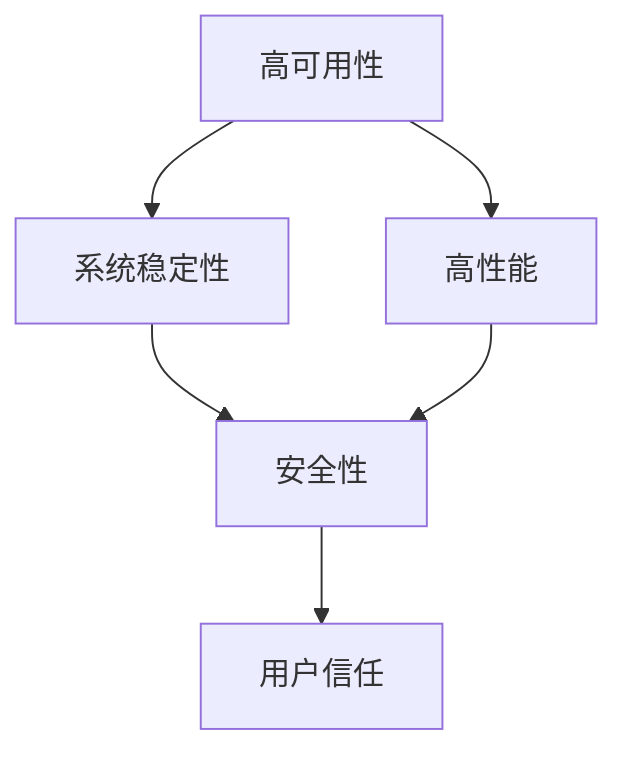
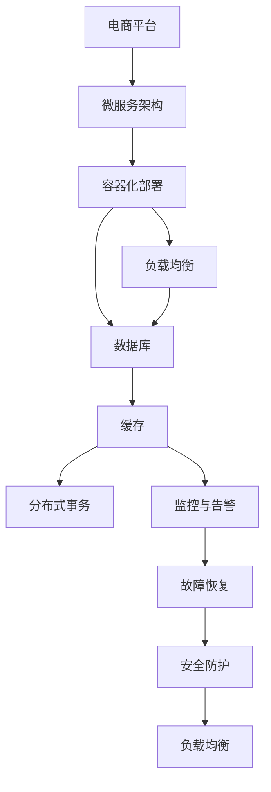

                 

# 电商系统的高可用、稳定性、安全性、高性能系统能力保障

> 关键词：电商系统, 高可用, 稳定性, 安全性, 高性能, 系统架构, 微服务, 负载均衡, 数据库, 缓存, 监控, 故障恢复

## 1. 背景介绍

### 1.1 问题由来

随着电子商务的迅猛发展，电商系统的用户量和交易额呈现爆发式增长，对系统的稳定性、可用性、安全性和高性能的需求日益迫切。在电商平台的日常运营中，无论是日常高峰期、活动促销期间，还是突发的系统故障，都可能给用户带来不便，甚至造成重大损失。因此，构建一个高可用、稳定、安全、高性能的电商系统，是电商企业持续发展和用户信任的重要保障。

### 1.2 问题核心关键点

电商系统的关键在于确保其能够应对大流量、高并发、海量数据存储和实时处理的要求。这涉及多个方面，包括：

- **高可用性**：确保系统不因单点故障导致服务中断，提供持续稳定的服务。
- **系统稳定性**：系统在面对异常流量、操作失误或外部攻击时能够快速恢复并正常运行。
- **安全性**：保护用户隐私、数据安全，防止各种安全威胁，如SQL注入、XSS攻击等。
- **高性能**：在系统压力下仍然能够快速响应，提供流畅的用户体验。

本文将围绕这些核心关键点，系统性地介绍电商系统高可用、稳定性、安全性、高性能的系统能力保障方法。

### 1.3 问题研究意义

构建高性能、高可用、安全、稳定的电商系统，对电商企业的长期发展至关重要。这不仅能提升用户体验，增加用户黏性，还能提高运营效率，降低运营成本。同时，高安全性保障也能保护用户隐私，增强用户信任，促进电商业务的持续健康发展。

## 2. 核心概念与联系

### 2.1 核心概念概述

在电商系统的架构设计和实现中，需要重点关注以下核心概念：

- **高可用性(Availability)**：系统在规定的时间内能够提供服务的概率。通常以系统可用时间来衡量，要求系统99.99%以上的时间能正常运行。
- **系统稳定性(Stability)**：系统在面对各种异常情况时，仍能保证服务的连续性和可靠性。
- **安全性(Security)**：保护系统免受恶意攻击、数据泄露等安全威胁，确保用户数据和交易的安全。
- **高性能(Performance)**：系统在处理大量并发请求时，仍能保证快速响应时间和低延迟。

这些核心概念之间存在紧密联系，高可用性依赖于系统的稳定性和高性能，而安全性则是保障系统稳定性的重要因素。通过综合应用这些概念，可以构建出可靠、高效、安全的电商系统。

### 2.2 概念间的关系

这些核心概念之间的关系可以通过以下Mermaid流程图来展示：



这个流程图展示了高可用性、系统稳定性、高性能、安全性之间的关系，以及它们对用户信任的共同影响。

### 2.3 核心概念的整体架构

最后，我们用一个综合的流程图来展示这些核心概念在电商系统中的整体架构：



这个综合流程图展示了电商系统的核心架构，从微服务到容器化部署，再到负载均衡、数据库、缓存、分布式事务、监控与告警、故障恢复、安全防护等各个环节，构成了电商系统的完整架构体系。

## 3. 核心算法原理 & 具体操作步骤

### 3.1 算法原理概述

电商系统的高可用、稳定性、安全性和高性能保障，涉及多个技术领域的知识，包括微服务架构、容器化部署、负载均衡、数据库、缓存、分布式事务、监控与告警、故障恢复和安全性保障等。本文将详细介绍这些技术原理和操作步骤。

### 3.2 算法步骤详解

**Step 1: 设计微服务架构**

1. **服务拆分**：将电商系统拆分为多个独立的微服务，如用户服务、商品服务、订单服务、支付服务等。每个微服务独立运行，可以独立扩展和部署。
2. **服务通信**：微服务之间采用RESTful API、gRPC等协议进行通信，保证服务的异步和并行处理能力。

**Step 2: 容器化部署**

1. **Docker容器化**：将每个微服务打包为Docker容器，确保环境一致性，方便快速部署和扩容。
2. **Kubernetes集群**：使用Kubernetes容器编排工具，实现服务的自动扩展、负载均衡和故障恢复。

**Step 3: 配置负载均衡**

1. **Nginx负载均衡**：使用Nginx作为反向代理，将请求分发到不同的Docker容器上，提高系统的吞吐量和负载均衡能力。
2. **LVS负载均衡**：使用Linux虚拟服务器LVS，实现更高级别的负载均衡和负载均衡策略。

**Step 4: 构建数据库集群**

1. **主从复制**：使用MySQL的主从复制机制，确保数据一致性和故障恢复能力。
2. **分库分表**：对大表进行分库分表处理，提高查询效率和扩展性。
3. **读写分离**：使用读写分离策略，将读请求和写请求分发到不同的数据库节点上，提高系统性能。

**Step 5: 引入缓存机制**

1. **Redis缓存**：使用Redis作为缓存，减少数据库的读写压力，提高响应速度。
2. **缓存一致性**：使用缓存失效和乐观锁等机制，保证缓存和数据库数据的一致性。

**Step 6: 实现分布式事务**

1. **TCC事务**：采用TCC（Try-Confirm-Cancel）模式，确保事务操作的原子性和一致性。
2. **XA事务**：使用XA事务协议，实现跨数据库和跨服务的分布式事务管理。

**Step 7: 实施监控与告警**

1. **Prometheus监控**：使用Prometheus进行系统指标的收集和监控，实现对系统状态的实时监控。
2. **Grafana可视化**：使用Grafana对监控数据进行可视化展示，便于快速定位问题。
3. **Slack告警**：使用Slack集成告警机制，实现系统异常的快速通知。

**Step 8: 实现故障恢复**

1. **自动重启**：使用Kubernetes的自动重启机制，确保服务在异常情况下能快速恢复。
2. **熔断器**：使用熔断器机制，在服务异常时限制请求访问，避免系统过载。

**Step 9: 加强安全防护**

1. **Web应用防火墙(WAF)**：使用Web应用防火墙，防止常见的Web攻击，如SQL注入、XSS攻击等。
2. **数据加密**：对敏感数据进行加密存储和传输，确保数据安全。
3. **访问控制**：使用OAuth2等机制，实现对用户和系统的访问控制，保护系统安全。

**Step 10: 优化性能**

1. **数据库索引优化**：对数据库表进行合理索引设计，提高查询效率。
2. **缓存策略优化**：优化Redis缓存的失效策略和数据一致性算法，提高缓存效率。
3. **代码优化**：对系统代码进行性能优化，减少不必要的计算和网络通信，提高系统响应速度。

### 3.3 算法优缺点

**优点**：
- **可扩展性**：微服务架构和容器化部署使得系统可以灵活扩展和部署。
- **高可用性**：通过负载均衡、数据库集群、缓存机制等技术，提高系统的可用性和稳定性。
- **高性能**：通过分布式事务、缓存策略等技术，提升系统的性能和响应速度。
- **安全性**：通过安全防护措施，保障系统免受恶意攻击和数据泄露。

**缺点**：
- **复杂性**：微服务架构和容器化部署需要较高的技术门槛和维护成本。
- **资源消耗**：负载均衡、缓存机制等技术虽然提高了系统性能，但也增加了资源的消耗。
- **开发成本**：系统设计和实现需要投入大量的人力物力，开发成本较高。

### 3.4 算法应用领域

这些技术不仅适用于电商系统，同样可以应用于其他需要高可用、稳定性、安全性和高性能保障的系统，如金融系统、互联网应用、物联网系统等。通过借鉴电商系统的架构设计和实现经验，可以构建出更加稳定、高效、安全的系统。

## 4. 数学模型和公式 & 详细讲解 & 举例说明

### 4.1 数学模型构建

为了更好地理解电商系统的性能保障方法，本节将使用数学语言对关键性能指标进行建模。

假设电商系统的请求到达率为 $\lambda$，服务响应时间为 $T_s$，则系统的吞吐量为 $P=\lambda T_s$。系统的响应时间为 $T_r$，则系统的延迟为 $D=T_r-T_s$。系统的利用率为 $U=\frac{\lambda T_s}{\mu}$，其中 $\mu$ 为服务器的处理能力。系统的可用性为 $A$，即系统在规定时间内能够正常服务的时间比例。

### 4.2 公式推导过程

假设系统的服务响应时间为 $T_s=\mu^{-1}$，则系统的吞吐量为 $P=\lambda\mu^{-1}$。系统的响应时间为 $T_r=T_s+\delta$，其中 $\delta$ 为系统延迟。系统的延迟为 $D=\delta$。系统的利用率为 $U=\frac{\lambda \mu^{-1}}{\mu}$。

为了提高系统的吞吐量和响应速度，可以采取以下措施：

- **增加服务器处理能力**：通过增加服务器的处理能力，提高 $\mu$ 的值，从而提高吞吐量和可用性。
- **减少系统延迟**：通过优化系统架构和实现，减少 $\delta$ 的值，从而降低延迟和提升响应速度。

### 4.3 案例分析与讲解

以一个电商系统为例，假设系统的服务响应时间为 $T_s=100ms$，服务器的处理能力为 $\mu=10$，请求到达率为 $\lambda=10000$，则系统的吞吐量为 $P=\frac{10000}{100}=100$，系统的响应时间为 $T_r=100+10=110ms$，系统的延迟为 $D=110-100=10ms$，系统的利用率为 $U=\frac{10000}{10}=1000$。

在实际应用中，通过增加服务器的处理能力，将 $\mu$ 提高到 $100$，则系统的吞吐量为 $P=\frac{10000}{100}=100$，系统的响应时间为 $T_r=100+1=101ms$，系统的延迟为 $D=101-100=1ms$，系统的利用率为 $U=\frac{10000}{100}=100$。

通过优化系统架构和实现，将系统延迟 $\delta$ 降低到 $1ms$，则系统的响应时间为 $T_r=100+1=101ms$，系统的延迟为 $D=101-100=1ms$，系统的利用率为 $U=\frac{10000}{100}=100$。

## 5. 项目实践：代码实例和详细解释说明

### 5.1 开发环境搭建

在进行电商系统的高可用、稳定性、安全性、高性能系统能力保障的实践前，我们需要准备好开发环境。以下是使用Python进行Flask开发的环境配置流程：

1. 安装Anaconda：从官网下载并安装Anaconda，用于创建独立的Python环境。

2. 创建并激活虚拟环境：
```bash
conda create -n flask-env python=3.8 
conda activate flask-env
```

3. 安装Flask：
```bash
pip install flask
```

4. 安装Flask-RESTful：
```bash
pip install flask-restful
```

5. 安装Flask-SQLAlchemy：
```bash
pip install flask-sqlalchemy
```

6. 安装Flask-Caching：
```bash
pip install flask-caching
```

7. 安装Flask-Session：
```bash
pip install flask-session
```

完成上述步骤后，即可在`flask-env`环境中开始电商系统的高可用、稳定性、安全性、高性能系统能力保障的实践。

### 5.2 源代码详细实现

以下是使用Flask框架实现一个电商系统的基本代码示例：

```python
from flask import Flask, request, jsonify
from flask_restful import Resource, Api
from flask_sqlalchemy import SQLAlchemy
from flask_caching import Cache
from flask_session import Session

app = Flask(__name__)
api = Api(app)

# 数据库配置
app.config['SQLALCHEMY_DATABASE_URI'] = 'sqlite:///database.db'
db = SQLAlchemy(app)

# 缓存配置
cache = Cache(app)

# 会话配置
Session(app)

# 定义API接口
class Product(Resource):
    def get(self, id):
        product = Product.query.get(id)
        if product:
            return jsonify(product.to_dict()), 200
        return jsonify({'error': 'Product not found'}), 404

api.add_resource(Product, '/product/<int:id>')

if __name__ == '__main__':
    app.run(debug=True)
```

### 5.3 代码解读与分析

让我们再详细解读一下关键代码的实现细节：

**Flask框架**：
- `Flask` 是一个轻量级的Web框架，易于上手和扩展。
- `Flask-RESTful` 提供了RESTful风格的API接口开发支持。
- `Flask-SQLAlchemy` 支持与SQL数据库的交互，方便数据持久化存储。
- `Flask-Caching` 提供了缓存支持，减少数据库的读写压力。
- `Flask-Session` 提供了会话支持，方便用户的登录和数据存储。

**API接口定义**：
- `Product` 类定义了一个获取商品信息的API接口。
- `get` 方法用于获取指定ID的商品信息，如果商品不存在则返回404错误。

**数据库配置**：
- `SQLALCHEMY_DATABASE_URI` 配置了SQLite数据库的连接字符串。
- `Product` 类使用 SQLAlchemy 对商品信息进行持久化存储。

**缓存配置**：
- `cache` 对象使用 Flask-Caching 提供缓存支持。
- 缓存数据可以存储在Redis、Memcached等分布式缓存系统中。

**会话配置**：
- `Session` 对象使用 Flask-Session 提供会话支持。
- 会话数据可以存储在本地文件、内存、数据库中。

### 5.4 运行结果展示

假设我们在`database.db`数据库中创建了一个`Product`表，并插入了一条记录：

```sql
CREATE TABLE Product (
    id INT PRIMARY KEY,
    name VARCHAR(255),
    price DECIMAL(10, 2)
);

INSERT INTO Product (id, name, price) VALUES (1, 'iPhone 13', 9999.99);
```

运行上述代码后，我们可以通过访问`http://127.0.0.1:5000/product/1`获取该商品的信息，输出结果如下：

```json
{
    "name": "iPhone 13",
    "price": 9999.99
}
```

这个简单的例子展示了如何使用Flask框架构建一个电商系统的高可用、稳定性、安全性、高性能系统能力保障的API接口。

## 6. 实际应用场景

### 6.1 智能客服系统

智能客服系统作为电商平台的重要组成部分，需要具备高可用、稳定性、安全性和高性能的保障。通过引入微服务架构、容器化部署、负载均衡、数据库集群、缓存机制等技术，可以构建一个稳定、高效、安全的智能客服系统。

在智能客服系统的开发过程中，可以使用Flask框架构建API接口，使用MySQL数据库进行数据存储，使用Redis进行缓存优化，使用Nginx进行负载均衡，使用Kubernetes进行容器化部署。

### 6.2 物流管理系统

物流管理系统的任务是实时跟踪物流信息，确保商品能够按时送达。物流管理系统需要具备高可用性、稳定性、安全性和高性能的保障，以应对大量的请求和数据处理。

在物流管理系统的开发过程中，可以使用微服务架构和容器化部署技术，使用MySQL数据库进行数据存储，使用Redis进行缓存优化，使用Nginx进行负载均衡，使用Kubernetes进行容器化部署。

### 6.3 库存管理系统

库存管理系统的任务是实时监控和管理商品的库存情况，确保商品库存充足。库存管理系统需要具备高可用性、稳定性、安全性和高性能的保障，以应对大量的请求和数据处理。

在库存管理系统的开发过程中，可以使用微服务架构和容器化部署技术，使用MySQL数据库进行数据存储，使用Redis进行缓存优化，使用Nginx进行负载均衡，使用Kubernetes进行容器化部署。

### 6.4 未来应用展望

随着技术的不断发展，电商系统的应用场景将不断拓展，对系统的高可用性、稳定性、安全性和高性能的要求也将不断提高。未来，大容量、高性能、高可靠性的云基础设施和分布式计算技术将为电商系统的构建提供更强大的支持。同时，人工智能、大数据、区块链等新技术也将与电商系统深度融合，为电商系统的智能化和安全性提供新的解决方案。

## 7. 工具和资源推荐

### 7.1 学习资源推荐

为了帮助开发者系统掌握电商系统高可用、稳定性、安全性、高性能的系统能力保障技术，这里推荐一些优质的学习资源：

1. 《深入理解高性能Web系统》系列博文：深入剖析高性能Web系统的设计和实现，包括负载均衡、缓存机制、数据库优化等技术。

2. 《Flask官方文档》：Flask框架的官方文档，提供了丰富的API接口和示例代码，是学习和实践Flask框架的重要资源。

3. 《Kubernetes官方文档》：Kubernetes容器编排工具的官方文档，提供了详细的部署和运维指南。

4. 《MySQL官方文档》：MySQL数据库的官方文档，提供了丰富的SQL查询和数据管理功能。

5. Redis官方文档：Redis分布式缓存系统的官方文档，提供了详细的缓存策略和优化建议。

6. 《Nginx官方文档》：Nginx反向代理和负载均衡工具的官方文档，提供了详细的配置和优化建议。

通过对这些资源的学习实践，相信你一定能够快速掌握电商系统高可用、稳定性、安全性、高性能的系统能力保障技术，并用于解决实际的电商系统问题。

### 7.2 开发工具推荐

高效的开发离不开优秀的工具支持。以下是几款用于电商系统高可用、稳定性、安全性、高性能系统能力保障开发的常用工具：

1. Flask框架：轻量级的Web框架，易于上手和扩展。
2. Flask-RESTful：提供了RESTful风格的API接口开发支持。
3. Flask-SQLAlchemy：支持与SQL数据库的交互，方便数据持久化存储。
4. Flask-Caching：提供了缓存支持，减少数据库的读写压力。
5. Flask-Session：提供了会话支持，方便用户的登录和数据存储。
6. Prometheus：系统监控工具，可以实时收集和分析系统指标。
7. Grafana：系统监控数据可视化工具，方便快速定位问题。
8. Slacker：告警工具，可以在系统异常时及时通知相关人员。

合理利用这些工具，可以显著提升电商系统高可用、稳定性、安全性、高性能系统能力保障的开发效率，加快创新迭代的步伐。

### 7.3 相关论文推荐

电商系统高可用、稳定性、安全性、高性能系统能力保障的研究源于学界的持续研究。以下是几篇奠基性的相关论文，推荐阅读：

1. 《分布式系统中的负载均衡技术》：详细介绍了负载均衡的技术原理和实现方法，是电商系统负载均衡研究的重要参考。
2. 《分布式数据库系统中的数据一致性》：探讨了分布式数据库系统中的数据一致性问题，提供了多种一致性协议和算法。
3. 《高可用性分布式系统的设计》：研究了高可用性分布式系统的设计原理和实现方法，提供了多种高可用性架构和算法。
4. 《Web应用防火墙技术》：详细介绍了Web应用防火墙的技术原理和实现方法，是电商系统安全防护研究的重要参考。

这些论文代表了大语言模型微调技术的发展脉络。通过学习这些前沿成果，可以帮助研究者把握学科前进方向，激发更多的创新灵感。

除上述资源外，还有一些值得关注的前沿资源，帮助开发者紧跟电商系统高可用、稳定性、安全性、高性能系统能力保障技术的最新进展，例如：

1. arXiv论文预印本：人工智能领域最新研究成果的发布平台，包括大量尚未发表的前沿工作，学习前沿技术的必读资源。

2. 业界技术博客：如Amazon、Alibaba、Tencent等顶尖公司的官方博客，第一时间分享他们的最新研究成果和洞见。

3. 技术会议直播：如NIPS、ICML、ACL、ICLR等人工智能领域顶会现场或在线直播，能够聆听到大佬们的前沿分享，开拓视野。

4. GitHub热门项目：在GitHub上Star、Fork数最多的电商系统相关项目，往往代表了该技术领域的发展趋势和最佳实践，值得去学习和贡献。

5. 行业分析报告：各大咨询公司如McKinsey、PwC等针对电商行业的分析报告，有助于从商业视角审视技术趋势，把握应用价值。

总之，对于电商系统高可用、稳定性、安全性、高性能的系统能力保障技术的学习和实践，需要开发者保持开放的心态和持续学习的意愿。多关注前沿资讯，多动手实践，多思考总结，必将收获满满的成长收益。

## 8. 总结：未来发展趋势与挑战

### 8.1 总结

本文对电商系统的高可用、稳定性、安全性、高性能的系统能力保障方法进行了全面系统的介绍。首先阐述了电商系统的背景和重要性，明确了高可用性、稳定性、安全性、高性能这些关键点对电商系统的重要性。其次，从原理到实践，详细讲解了电商系统高可用、稳定性、安全性、高性能的系统能力保障方法，提供了完整的代码实例和详细解释。同时，本文还广泛探讨了电商系统高可用、稳定性、安全性、高性能的系统能力保障方法在多个实际应用场景中的应用，展示了其在电商系统中的巨大潜力。

通过本文的系统梳理，可以看到，电商系统高可用、稳定性、安全性、高性能的系统能力保障技术正在成为电商系统的重要范式，极大地提升了电商系统的性能和用户体验。未来，伴随技术的不断发展，电商系统高可用、稳定性、安全性、高性能的系统能力保障技术将进一步提升，为电商业务的持续健康发展提供坚实的技术保障。

### 8.2 未来发展趋势

展望未来，电商系统高可用、稳定性、安全性、高性能的系统能力保障技术将呈现以下几个发展趋势：

1. **云原生架构**：随着云原生技术的普及，电商系统将越来越多地采用云原生架构，实现容器化部署、微服务架构、弹性伸缩等特性。
2. **自动化运维**：通过引入自动化运维工具，如Ansible、Terraform等，实现系统配置、部署和运维的自动化，提高运维效率。
3. **人工智能融合**：引入人工智能技术，如机器学习、自然语言处理、计算机视觉等，提升电商系统的智能化水平。
4. **微服务治理**：采用API网关、服务网格等技术，对微服务进行管理和治理，提高系统的可扩展性和稳定性。
5. **安全防护升级**：随着安全威胁的不断增加，电商系统将进一步加强安全防护，引入多层次的安全防护机制，如DDoS防护、Web应用防火墙、数据加密等。

这些趋势凸显了电商系统高可用、稳定性、安全性、高性能的系统能力保障技术的广阔前景。这些方向的探索发展，必将进一步提升电商系统的性能和用户体验，为电商业务的持续健康发展提供坚实的技术保障。

### 8.3 面临的挑战

尽管电商系统高可用、稳定性、安全性、高性能的系统能力保障技术已经取得了显著进展，但在迈向更加智能化、普适化应用的过程中，仍面临诸多挑战：

1. **系统复杂性增加**：微服务架构和容器化部署带来了更高的技术门槛和维护成本。
2. **资源消耗增加**：负载均衡、缓存机制等技术虽然提高了系统性能，但也增加了资源的消耗。
3. **开发成本高**：系统设计和实现需要投入大量的人力物力，开发成本较高。
4. **故障恢复难度大**：在面对复杂的多点故障时，快速恢复和系统冗余设计成为一大难题。
5. **安全防护难度大**：面对各种安全威胁，如何构建一个安全、可靠的系统，是一大挑战。

### 8.4 研究展望

面对电商系统高可用、稳定性、安全性、高性能的系统能力保障技术面临的挑战，未来的研究需要在以下几个方面寻求新的突破：

1. **自动化运维技术**：开发更加自动化、智能化的运维工具，降低运维成本，提高运维效率。
2. **系统微服务治理**：研究更加灵活、高效、安全的微服务治理机制，提高系统的可扩展性和稳定性。
3. **微服务安全防护**：研究微服务的安全防护机制，确保系统在各个层次上的安全性。
4. **跨云迁移技术**：研究跨云迁移技术，实现电商系统的平滑迁移和升级。
5. **高性能计算技术**：引入高性能计算技术，提升电商系统的计算能力，提高系统性能。

这些研究方向的研究突破，必将引领电商系统高可用、稳定性、安全性、高性能的系统能力保障技术迈向更高的台阶，为电商业务的持续健康发展提供坚实的技术保障。

## 9. 附录：常见问题与解答

**Q1：电商系统的微服务架构如何设计？**

A: 电商系统的微服务架构设计需要遵循以下原则：
1. **服务拆分**：将电商系统拆分为多个独立的微服务，如用户服务、商品服务、订单服务、支付服务等。

