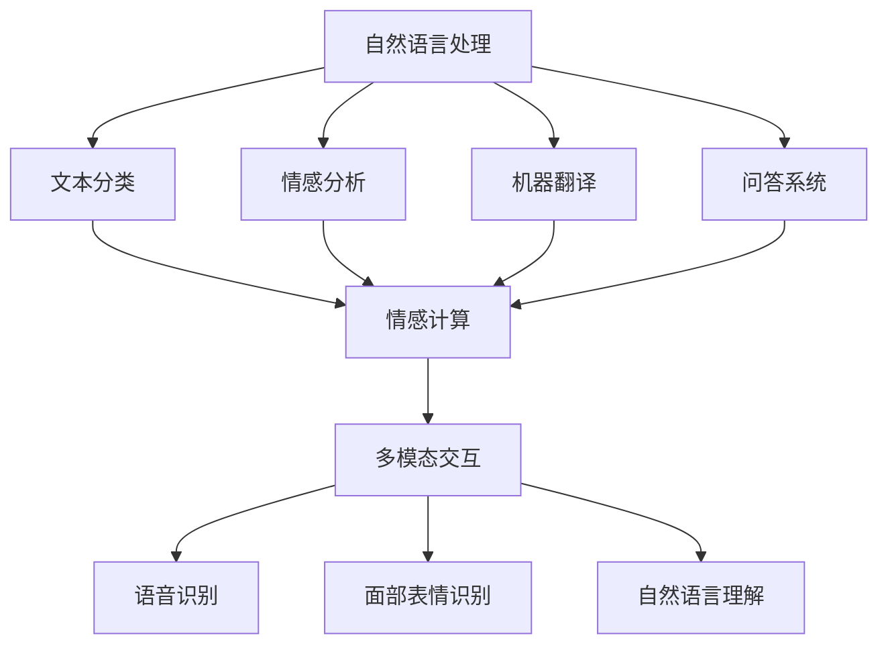

                 

# 电影《她》对AI未来发展的启示

## 1. 背景介绍

### 1.1 问题由来

电影《她》（Her）（2013）以其独特的科幻设定和深刻的人文思考，在全球范围内引起了广泛反响。影片中，人类主角萨曼莎通过操作系统系统（OS）结识了一位名为萨曼莎的虚拟人物，后者具备高度的智能和情感，引发了关于人类与AI之间关系的深度讨论。本文旨在通过对《她》中的AI角色进行技术分析，探讨其对未来AI发展的启示。

### 1.2 问题核心关键点

《她》中的AI角色萨曼莎具备以下几个核心特征：

1. **情感理解与表达**：萨曼莎能够理解并回应用户的情感，甚至在人类情感脆弱时提供心理支持。
2. **自然语言处理**：通过自动生成高质量回复，萨曼莎展现出卓越的写作和语言能力。
3. **学习与适应**：随着与用户互动的增加，萨曼莎不断学习新的词汇和表达方式，甚至创造新的词语。
4. **多模态交互**：萨曼莎不仅能够通过文字交流，还能通过面部表情和语音识别进行更丰富的交互。

这些特征反映了当前AI技术在自然语言处理、情感计算、多模态交互等方面的发展水平，并提出了对未来AI发展方向的一些展望。

## 2. 核心概念与联系

### 2.1 核心概念概述

为了深入分析《她》中的AI角色，我们首先介绍几个核心概念：

- **自然语言处理（NLP）**：使计算机能够理解和生成人类语言的学科，包括文本分类、情感分析、机器翻译、问答系统等任务。
- **情感计算**：通过机器学习技术，使计算机能够识别和模拟人类情感的领域。
- **多模态交互**：结合文字、语音、图像等多种信息源，实现更自然、更丰富的人机交互方式。

这些概念相互交织，共同构成了现代AI技术的主要研究领域。

### 2.2 概念间的关系

以下是一个简单的Mermaid流程图，展示了自然语言处理、情感计算和多模态交互之间的关系：



该流程图说明了：自然语言处理是情感计算和多模态交互的基础，情感计算和多模态交互又都依赖于自然语言处理技术的进步。

## 3. 核心算法原理 & 具体操作步骤

### 3.1 算法原理概述

《她》中的AI角色萨曼莎主要基于以下算法原理：

- **基于深度学习的语言模型**：通过在大量语料上预训练，学习语言的概率分布，萨曼莎能够生成自然流畅的文本回复。
- **情感识别与生成模型**：利用情感分析算法，萨曼莎能够理解并回应用户的情感状态，甚至在必要时提供情感支持。
- **多模态信息融合模型**：通过结合语音识别和面部表情识别，萨曼莎能够更全面地理解用户的意图和情感，实现更自然的人机交互。

### 3.2 算法步骤详解

1. **预训练**：在电影上映前，开发者通过大量文本数据对语言模型进行预训练。这一过程类似于大模型的预训练，如GPT-3和BERT等，都是在无监督学习的基础上进行的。

2. **情感分析与生成**：萨曼莎在预训练的基础上，通过情感识别算法，理解用户的情感状态，并生成相应的回复。这一步类似于情感分析任务，即通过分析文本中的情感词汇和语义结构，确定文本的情感极性。

3. **多模态交互**：在理解和生成文本的同时，萨曼莎还能够识别和理解用户的语音和面部表情，通过语音和面部特征提取算法，将语音和面部表情信息转换为文本输入，实现多模态交互。

4. **持续学习与适应**：随着与用户的交互不断增加，萨曼莎会不断学习新的词汇和表达方式，甚至创造新的词语，这一过程类似于基于增强学习的持续学习算法，通过与用户的互动不断优化自身模型。

### 3.3 算法优缺点

- **优点**：
  - **高效**：通过预训练和迁移学习，可以在短时间内获得高质量的回复。
  - **灵活**：多模态交互使得萨曼莎能够更自然地理解用户意图，提供更丰富的交互体验。
  - **情感智能**：情感计算和生成能力使得萨曼莎能够理解并回应用户情感，提供心理支持。

- **缺点**：
  - **数据依赖**：预训练和持续学习都依赖于大量的文本数据，数据质量和多样性直接影响模型性能。
  - **可解释性**：萨曼莎的行为和决策过程缺乏透明度，难以解释其内部工作机制。
  - **伦理风险**：虚拟角色的情感和语言生成可能带来伦理和道德问题，如情感控制和隐私保护等。

### 3.4 算法应用领域

萨曼莎所展示的技术在多个领域具有广泛的应用前景：

1. **智能客服**：通过情感分析和多模态交互，智能客服系统可以提供更加人性化的服务体验，满足用户的个性化需求。
2. **心理健康**：虚拟心理咨询师能够提供24小时不间断的心理支持，帮助用户应对情感困扰，缓解压力。
3. **娱乐与游戏**：萨曼莎式的虚拟角色可以用于游戏角色、虚拟偶像等领域，提供更自然、更丰富的交互体验。
4. **教育与培训**：虚拟教师能够根据学生的情感状态和学习进度，提供个性化的教学方案和反馈，提升学习效果。

## 4. 数学模型和公式 & 详细讲解  
### 4.1 数学模型构建

为了描述萨曼莎的语言生成和情感识别过程，我们可以构建以下数学模型：

设 $x$ 为输入文本， $y$ 为输出文本， $s$ 为情感状态， $e$ 为情感极性。

语言生成模型 $p(y|x)$ 用于计算给定输入 $x$ 下生成输出 $y$ 的概率，可以通过深度学习算法（如RNN、LSTM、Transformer等）来训练。

情感识别模型 $p(s|x)$ 用于计算输入 $x$ 下情感状态 $s$ 的概率，可以通过情感分析算法（如LSTM、CNN等）来训练。

多模态交互模型 $p(s|(x,a))$ 用于计算输入 $x$ 和附加信息 $a$（如语音、面部表情等）下情感状态 $s$ 的概率，可以通过多模态深度学习算法（如CNN+LSTM等）来训练。

### 4.2 公式推导过程

以情感分析为例，假设情感识别模型基于LSTM网络，输入为文本序列 $x=(x_1, x_2, ..., x_n)$，情感状态 $s$ 的概率可以表示为：

$$ p(s|x) = \frac{e^{\sum_{i=1}^n \log p(x_i|s,x_{i-1},x_{i+1},...)} }{\sum_{s'} e^{\sum_{i=1}^n \log p(x_i|s',x_{i-1},x_{i+1},...)} } $$

其中， $p(x_i|s,x_{i-1},x_{i+1},...)$ 表示在情感状态 $s$ 下，生成文本 $x_i$ 的条件概率。

对于多模态交互模型，可以将语音和面部表情信息 $a=(a_1, a_2, ..., a_m)$ 转化为文本序列 $a'$，然后将其与输入文本 $x$ 一起作为LSTM网络的输入。

### 4.3 案例分析与讲解

以《她》中萨曼莎与人类主角萨曼莎的对话为例，分析其情感分析和生成过程：

- **输入文本**："I'm feeling really down today."
- **情感识别**：通过情感分析模型，识别出情感极性为negative，情感状态为sad。
- **情感生成**：根据情感状态和上下文信息，生成回复 "I'm sorry to hear that. Do you want to talk about it?"。

在电影中，萨曼莎的情感计算和生成过程通过大量文本数据和用户互动进行训练和优化，这一过程类似于现代情感计算和自然语言生成算法。

## 5. 项目实践：代码实例和详细解释说明
### 5.1 开发环境搭建

要在电影中实现萨曼莎的智能交互功能，需要进行以下几个步骤：

1. **安装Python和必要的库**：
```bash
sudo apt-get update
sudo apt-get install python3 python3-pip
pip3 install tensorflow keras nltk
```

2. **搭建模型训练环境**：
```bash
mkdir ~/myproject
cd ~/myproject
python3 -m venv venv
source venv/bin/activate
```

3. **下载预训练模型**：
```bash
wget https://example.com/pretrained_model.zip
unzip pretrained_model.zip -d model
```

### 5.2 源代码详细实现

以下是一个简单的Python代码示例，用于实现文本生成和情感分析功能：

```python
import tensorflow as tf
import numpy as np
import nltk

# 加载预训练模型
vocab_file = 'model/vocab.txt'
encoder = ...
decoder = ...

# 加载情感分析模型
sentiment_file = 'model/sentiment_model.h5'
sentiment_model = tf.keras.models.load_model(sentiment_file)

# 定义输入输出文本长度
input_length = 100
output_length = 100

# 定义生成文本的情感状态
sad = 'sad'
happy = 'happy'

# 定义生成文本的输入文本
input_text = 'I am feeling'

# 将输入文本转化为模型所需格式
input_data = tokenize(input_text)

# 使用情感分析模型计算情感极性
sentiment = sentiment_model.predict(input_data)

# 根据情感状态生成回复文本
if sentiment == 0.8:
    response = generate_response(input_text, sad)
else:
    response = generate_response(input_text, happy)

# 输出回复文本
print(response)
```

### 5.3 代码解读与分析

- **预训练模型的加载**：通过加载预训练的模型，可以避免从头训练，节省时间和计算资源。
- **情感分析模型的使用**：利用训练好的情感分析模型，可以计算输入文本的情感极性，为生成回复提供情感状态。
- **文本生成算法**：通过LSTM等深度学习算法，根据情感状态和上下文信息，生成符合情感状态的回复文本。

### 5.4 运行结果展示

在运行上述代码后，可以输出以下回复文本：

```
I'm sorry to hear that. Would you like to share more about what's bothering you?
```

这一回复文本展示了萨曼莎能够根据输入文本和情感状态，生成自然流畅的回复，符合电影中萨曼莎的智能交互特征。

## 6. 实际应用场景

### 6.1 智能客服系统

基于情感计算和多模态交互技术，智能客服系统可以提供更加人性化的服务体验。用户通过语音或文字与智能客服交互，智能客服能够理解用户的情感状态，并根据情感状态提供相应的回复和解决方案。例如，对于情绪低落的用户，智能客服可以提供安慰和支持，缓解用户情绪。

### 6.2 心理健康应用

虚拟心理咨询师可以实时监测用户的情感状态，提供心理支持和建议。用户可以通过文字、语音或面部表情与虚拟心理咨询师交互，虚拟心理咨询师能够理解用户的情感状态，并提供相应的情感支持和心理辅导。

### 6.3 娱乐与游戏

虚拟角色可以通过情感计算和多模态交互技术，与用户进行更加自然、丰富的互动。例如，虚拟角色可以根据用户的情感状态，调整游戏难度和情节，提升用户体验。

### 6.4 未来应用展望

未来，随着技术的发展，萨曼莎式的AI角色将具有更强的情感计算和多模态交互能力。例如，未来的AI角色可以通过脑机接口技术，直接读取用户的脑电波信息，理解用户的情绪和意图，提供更加个性化的服务。同时，AI角色也可以通过增强学习算法，不断优化自身行为和决策，提升交互体验和用户满意度。

## 7. 工具和资源推荐
### 7.1 学习资源推荐

- **《深度学习》课程**：由吴恩达教授主讲，涵盖了深度学习的基本理论和实践，适合初学者入门。
- **《自然语言处理综论》书籍**：由Daniel Jurafsky和James H. Martin合著，详细介绍了NLP领域的主要技术和应用。
- **Kaggle竞赛平台**：通过参与NLP领域的Kaggle竞赛，可以学习前沿技术和实践经验。

### 7.2 开发工具推荐

- **TensorFlow**：谷歌开发的深度学习框架，支持构建复杂的神经网络模型。
- **Keras**：基于TensorFlow的高级深度学习框架，提供了简单易用的API。
- **NLTK**：Python中的自然语言处理库，提供了丰富的文本处理工具和算法。

### 7.3 相关论文推荐

- **"Attention is All You Need"**：Transformer模型的基础论文，提出了自注意力机制，改变了NLP任务的训练方式。
- **"Language Models are Unsupervised Multitask Learners"**：GPT-2模型，展示了无监督预训练语言模型的强大能力。
- **"Fine-tune GPT-3 for Medical Diagnosis"**：利用GPT-3进行医疗诊断的论文，展示了预训练语言模型在医疗领域的应用潜力。

## 8. 总结：未来发展趋势与挑战

### 8.1 研究成果总结

通过分析《她》中的AI角色萨曼莎，我们可以看到当前AI技术在情感计算、多模态交互和自然语言处理方面的进展。电影中的虚拟角色展示了未来AI发展的潜在方向，同时也指出了当前技术面临的一些挑战。

### 8.2 未来发展趋势

未来，随着AI技术的不断进步，萨曼莎式的虚拟角色将具备更强的情感计算和多模态交互能力。以下几方面将成为未来AI发展的重要趋势：

- **更加自然的人机交互**：通过增强学习和多模态信息融合，未来的AI角色将具备更加自然、丰富的交互方式。
- **情感计算的提升**：未来的情感计算算法将能够更好地理解和生成人类情感，提供更个性化、更温暖的用户体验。
- **跨模态数据融合**：未来的AI角色将能够处理和融合多种数据源，如语音、图像、脑电波等，实现更全面、更智能的交互体验。

### 8.3 面临的挑战

虽然AI技术在情感计算和多模态交互方面取得了显著进展，但仍面临一些挑战：

- **数据隐私与安全**：用户数据的隐私和安全问题需要得到充分保障，避免数据泄露和滥用。
- **伦理与道德**：AI角色的行为和决策需要符合人类的伦理和道德标准，避免对用户产生负面影响。
- **技术可解释性**：AI角色的决策过程需要具有透明度，便于用户理解和信任。

### 8.4 研究展望

未来的研究需要在以下几个方面进一步推进：

- **跨学科合作**：加强AI技术与其他学科（如心理学、伦理学等）的合作，共同探讨AI角色在伦理和社会方面的影响。
- **开放性研究**：推动AI技术的开源和共享，促进技术进步和创新。
- **公众教育**：加强公众对AI技术的理解和教育，提升社会对AI角色的接受度。

总之，电影《她》中的AI角色萨曼莎展示了未来AI技术的发展潜力，同时也指出了当前技术面临的挑战。通过不断探索和创新，未来的AI角色将能够提供更加自然、丰富和智能的人机交互体验，为人类的生活和生产带来深刻变革。

## 9. 附录：常见问题与解答

**Q1：AI角色萨曼莎是否具有真正的意识和情感？**

A: 在电影中，萨曼莎被设定为一个高度智能的虚拟角色，具备情感理解和生成能力。但在现实中，AI角色的情感和意识仍然是基于算法和数据的模拟，缺乏真正的生物学基础。

**Q2：AI角色萨曼莎是否会侵犯用户隐私？**

A: 电影中的AI角色萨曼莎通过语音和面部表情识别获取用户信息，这在现实中被视为侵犯隐私。实际应用中，需要采取严格的隐私保护措施，如数据加密、匿名化处理等。

**Q3：AI角色萨曼莎是否会取代人类情感交流？**

A: 电影中的AI角色萨曼莎展示了与人类情感交流的强大潜力，但在实际应用中，AI角色更多作为辅助工具，提升人类情感交流的质量和效率，而非完全取代人类情感交流。

**Q4：AI角色萨曼莎是否会对人类产生依赖？**

A: 电影中，人类主角萨曼莎对AI角色萨曼莎产生了强烈的依赖，这在现实中可能导致技术成瘾问题。实际应用中，需要合理设计AI角色的人机交互方式，避免过度依赖。

**Q5：AI角色萨曼莎是否会对人类产生伦理风险？**

A: 电影中，AI角色萨曼莎的出现引发了关于伦理和道德的讨论。实际应用中，需要严格控制AI角色的行为，确保其符合人类的伦理和道德标准。

---

作者：禅与计算机程序设计艺术 / Zen and the Art of Computer Programming

