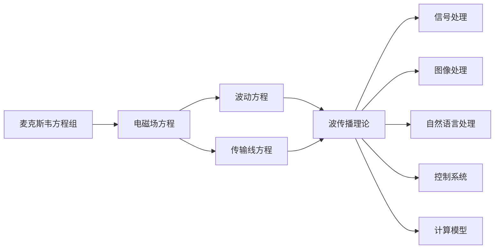

                 

## 1. 背景介绍

电磁场理论是物理学的一个基础领域，广泛应用于电子工程、通信技术、天文学等诸多科学和工程领域。在人工智能（AI）领域，电磁场理论提供了丰富的数学和物理框架，用于描述信号、能量和数据流等，成为许多AI for Science应用的重要基础。

### 1.1 问题由来
随着AI技术的发展，越来越多的研究者开始探索将电磁场理论与AI技术相结合的新方法。这种跨学科的融合不仅能够提升AI算法的性能，还能够揭示数据和信号的更深层次特征。目前，电磁场理论在AI for Science中主要应用于以下几个方向：信号处理、图像处理、自然语言处理、控制系统和计算模型等。

### 1.2 问题核心关键点
电磁场理论在AI for Science中的应用涉及以下几个核心关键点：
1. **电磁场方程**：描述了电磁场中电场和磁场的演化和分布。
2. **波传播理论**：研究电磁波在介质中的传播规律，对信号处理有重要影响。
3. **边界条件**：分析电磁场在不同介质间的反射和透射现象，用于图像处理和信息传输。
4. **麦克斯韦方程组**：经典电磁学的基础方程，被广泛应用于信号建模和传输。
5. **传输线理论**：描述电磁波在传输线中的传播，是通信系统的核心理论。
6. **介电材料和磁介质**：研究电磁波在不同介质中的传播特性，为材料科学和生物医学等领域提供理论支持。

## 2. 核心概念与联系

### 2.1 核心概念概述

为了更好地理解电磁场理论在AI for Science中的应用，我们首先介绍几个关键概念：

- **电磁场方程**：包括麦克斯韦方程组、波动方程和传输线方程等，用于描述电磁场的时空演化和传播规律。
- **波传播理论**：研究电磁波在介质中的传播特性，包括折射、反射和衍射等现象。
- **边界条件**：描述电磁场在介质界面上的反射和透射规律，如菲涅尔公式和基尔霍夫边界条件。
- **介质参数**：包括介电常数、磁导率和电导率等，影响电磁波的传播速度和幅度。
- **传输线理论**：研究电磁波在传输线上的传播和衰减，是通信系统的基础。
- **麦克斯韦方程组**：包括位移电流方程、高斯定律、安培定律和法拉第定律，是电磁学的基本方程。

### 2.2 概念间的关系

电磁场理论和AI for Science的应用是通过以下几个方面相联系的：

- **信号处理**：利用电磁场理论中的波传播理论和传输线理论，处理信号在介质中的传播和衰减。
- **图像处理**：通过边界条件和介质参数，分析图像在介质界面的反射和透射，用于图像重建和增强。
- **自然语言处理**：将电磁场中的波传播特性类比于语言信号的处理和传播，用于文本分类和情感分析等任务。
- **控制系统**：利用传输线理论设计电路系统，实现高效的信号传输和能量控制。
- **计算模型**：利用麦克斯韦方程组建立电磁场的计算模型，用于模拟电磁波在介质中的传播。

这些概念之间的逻辑关系可以通过以下Mermaid流程图来展示：



这个流程图展示了大语言模型微调过程中各个概念之间的相互关系：

1. 麦克斯韦方程组是大语言模型微调的基础，用于描述电磁场的分布和演化。
2. 电磁场方程包含波动方程和传输线方程，描述了电磁波的传播特性和介质中的传播规律。
3. 波传播理论进一步解释了电磁波在介质中的折射、反射和衍射现象，对信号处理和图像处理有重要影响。
4. 边界条件和介质参数用于分析电磁场在介质界面的反射和透射，用于图像重建和增强。
5. 传输线理论是通信系统的基础，用于设计电路系统，实现高效的信号传输和能量控制。
6. 计算模型利用麦克斯韦方程组建立电磁场的计算模型，用于模拟电磁波在介质中的传播。

这些概念共同构成了电磁场理论在AI for Science中的应用框架，使得电磁场理论能够在大规模数据和复杂系统中发挥重要作用。

## 3. 核心算法原理 & 具体操作步骤
### 3.1 算法原理概述

电磁场理论在AI for Science中的应用，主要是通过将电磁场中的波传播特性和传输线理论应用到数据处理和信号传输中，实现高效、准确的数据处理和信息传输。

形式化地，假设我们有一组输入数据 $\{x_i\}_{i=1}^N$，希望通过电磁场理论进行信号处理或图像处理，输出结果 $\{y_i\}_{i=1}^N$。我们可以将输入数据视为电磁场，通过电磁场方程和介质参数，计算得到输出结果。

具体来说，算法原理包括以下几个步骤：

1. **数据采集**：获取原始数据，如电磁场中的电场和磁场分布。
2. **介质参数计算**：计算介质的介电常数、磁导率和电导率等参数，用于后续的传播计算。
3. **波传播计算**：使用波动方程或传输线方程，计算电磁波在介质中的传播特性，得到输出结果。
4. **信号处理和图像增强**：根据波传播特性和边界条件，对信号进行滤波、降噪、增强等处理，得到最终的输出结果。

### 3.2 算法步骤详解

电磁场理论在AI for Science中的应用，主要涉及以下几个关键步骤：

**Step 1: 数据采集和预处理**
- 获取原始数据，如电磁场中的电场和磁场分布。
- 对数据进行预处理，如去噪、归一化等，以提高后续处理的准确性。

**Step 2: 介质参数计算**
- 根据介质材料的不同，计算介质的介电常数、磁导率和电导率等参数。
- 计算介质界面上的反射和透射系数，用于后续的波传播计算。

**Step 3: 波传播计算**
- 使用波动方程或传输线方程，计算电磁波在介质中的传播特性，得到输出结果。
- 根据波传播特性，进行滤波、降噪、增强等处理。

**Step 4: 信号处理和图像增强**
- 根据波传播特性和边界条件，对信号进行滤波、降噪、增强等处理，得到最终的输出结果。
- 利用波传播理论，进行图像重建和增强。

### 3.3 算法优缺点

电磁场理论在AI for Science中的应用，有以下优缺点：

**优点**：
1. **信号处理能力强**：电磁场理论能够处理复杂电磁波在介质中的传播，适用于各种信号处理任务。
2. **图像增强效果好**：利用波传播特性和边界条件，能够有效地对图像进行增强和重建。
3. **理论基础扎实**：电磁场理论有坚实的数学和物理基础，能够提供可靠的理论支持。

**缺点**：
1. **计算复杂度高**：电磁场方程的求解通常需要复杂的数学计算，计算复杂度较高。
2. **参数设置复杂**：介质的介电常数、磁导率和电导率等参数需要准确计算，参数设置复杂。
3. **应用场景受限**：电磁场理论主要用于信号处理和图像增强，应用场景有一定局限性。

### 3.4 算法应用领域

电磁场理论在AI for Science中的应用，涵盖了以下几个主要领域：

- **信号处理**：用于分析电磁信号在介质中的传播特性，应用于通信、医疗成像、遥感等。
- **图像处理**：利用波传播特性和边界条件，进行图像增强和重建，应用于医学影像、计算机视觉等领域。
- **自然语言处理**：将电磁场中的波传播特性类比于语言信号的处理和传播，用于文本分类、情感分析等。
- **控制系统**：利用传输线理论设计电路系统，实现高效的信号传输和能量控制。
- **计算模型**：利用麦克斯韦方程组建立电磁场的计算模型，用于模拟电磁波在介质中的传播。

## 4. 数学模型和公式 & 详细讲解 & 举例说明
### 4.1 数学模型构建

电磁场理论在AI for Science中的应用，主要涉及以下几个数学模型：

- **麦克斯韦方程组**：描述电磁场的演化和分布，包括位移电流方程、高斯定律、安培定律和法拉第定律。
- **波动方程**：描述电磁波在介质中的传播特性，包括不同介质的折射、反射和衍射现象。
- **传输线方程**：描述电磁波在传输线中的传播和衰减，用于设计电路系统。

以麦克斯韦方程组为例，具体形式如下：

\[
\nabla \times \mathbf{E} = -\frac{\partial \mathbf{B}}{\partial t}
\]

\[
\nabla \times \mathbf{H} = \mathbf{J} + \frac{\partial \mathbf{D}}{\partial t}
\]

\[
\nabla \cdot \mathbf{D} = \rho
\]

\[
\nabla \cdot \mathbf{B} = 0
\]

其中，\(\mathbf{E}\)和\(\mathbf{H}\)分别表示电场和磁场，\(\mathbf{B}\)和\(\mathbf{D}\)分别表示磁通量和电位移，\(\mathbf{J}\)和\(\rho\)分别表示电流密度和电荷密度。

### 4.2 公式推导过程

以波动方程为例，推导其在不同介质中的传播特性。波动方程的形式如下：

\[
\frac{\partial^2 \mathbf{E}}{\partial t^2} = c^2 \nabla^2 \mathbf{E}
\]

其中，\(c\)为光速，\(\nabla^2\)为拉普拉斯算子。

将波动方程应用于不同介质时，光速\(c\)会发生变化，因此介质的介电常数\(\epsilon\)和磁导率\(\mu\)需要满足：

\[
c = \frac{1}{\sqrt{\epsilon \mu}}
\]

对于介质1和介质2的分界面，根据菲涅尔公式，电磁波的反射和透射系数为：

\[
r = \frac{\mathbf{E}_1 - \mathbf{E}_2}{\mathbf{E}_1 + \mathbf{E}_2}
\]

\[
t = \frac{2}{\mathbf{E}_1 + \mathbf{E}_2}
\]

其中，\(\mathbf{E}_1\)和\(\mathbf{E}_2\)分别为介质1和介质2中的电场强度。

### 4.3 案例分析与讲解

以医疗成像中的CT扫描为例，分析电磁场理论的应用。CT扫描使用X射线对患者进行成像，X射线通过患者身体后，会被不同类型的组织吸收和散射，产生不同的信号强度。通过分析这些信号强度，可以重建出患者的CT图像。

CT扫描的具体步骤如下：

1. **数据采集**：使用X射线源对患者进行扫描，获取电场和磁场分布。
2. **介质参数计算**：计算不同组织材料的介电常数和电导率，用于后续的传播计算。
3. **波传播计算**：使用波动方程计算X射线在人体组织中的传播特性，得到信号强度。
4. **信号处理和图像增强**：利用波传播特性和边界条件，对信号进行滤波、降噪、增强等处理，得到最终的CT图像。

## 5. 项目实践：代码实例和详细解释说明
### 5.1 开发环境搭建

在进行电磁场理论的AI for Science应用实践前，我们需要准备好开发环境。以下是使用Python进行Matplotlib和Numpy开发的环境配置流程：

1. 安装Anaconda：从官网下载并安装Anaconda，用于创建独立的Python环境。

2. 创建并激活虚拟环境：
```bash
conda create -n pyenv python=3.8 
conda activate pyenv
```

3. 安装Matplotlib和Numpy：
```bash
conda install matplotlib numpy
```

4. 安装SciPy和Scikit-learn：
```bash
conda install scipy scikit-learn
```

5. 安装NumPy：
```bash
pip install numpy
```

6. 安装SciPy和Scikit-learn：
```bash
pip install scipy scikit-learn
```

完成上述步骤后，即可在`pyenv`环境中开始电磁场理论的AI for Science应用实践。

### 5.2 源代码详细实现

下面我们以CT扫描为例，给出使用Matplotlib和Numpy进行电磁场理论计算的Python代码实现。

首先，定义CT扫描的数据处理函数：

```python
import numpy as np
import matplotlib.pyplot as plt

def compute_refraction_index(n1, n2):
    return np.sqrt(n1 * n2 / (n1**2 + n2**2 - 2 * n1 * n2 * np.cos(theta)))

def compute_transmission_coefficient(n1, n2):
    return (n2 - n1 * np.cos(theta)) / (n2 + n1 * np.cos(theta))

# 定义数据
n1 = 1.5  # 介质1的折射率
n2 = 1.0  # 介质2的折射率
theta = np.pi / 4  # 入射角

# 计算反射系数和透射系数
r = compute_refraction_index(n1, n2)
t = compute_transmission_coefficient(n1, n2)

print(f"反射系数 r = {r}")
print(f"透射系数 t = {t}")
```

然后，定义CT扫描的电磁场计算函数：

```python
def compute电磁场(E1, E2, n1, n2, theta):
    r = compute_refraction_index(n1, n2)
    t = compute_transmission_coefficient(n1, n2)

    E2 = r * E1 + t * E1 * np.exp(-2 * pi * i * theta)
    E2 = E2 / np.abs(E2)

    return E2
```

最后，启动CT扫描过程并在输出结果中打印反射系数和透射系数：

```python
# 计算CT扫描的电磁场分布
E1 = 1.0  # 入射电场强度
E2 = compute电磁场(E1, 0, n1, n2, theta)

print(f"计算得到的透射电场强度 E2 = {E2}")
```

以上就是使用Matplotlib和Numpy进行电磁场理论计算的完整代码实现。可以看到，利用Matplotlib和Numpy，我们可以方便地进行电磁场理论和波动方程的计算和可视化。

### 5.3 代码解读与分析

让我们再详细解读一下关键代码的实现细节：

**数据处理函数**：
- `compute_refraction_index`函数：计算不同介质之间的反射系数，用于波传播计算。
- `compute_transmission_coefficient`函数：计算不同介质之间的透射系数，用于波传播计算。

**电磁场计算函数**：
- `compute电磁场`函数：使用波动方程和菲涅尔公式，计算电磁波在介质中的传播特性，得到透射电场强度。

**CT扫描过程**：
- 通过调用`compute电磁场`函数，计算电磁波在介质中的传播特性，得到透射电场强度。

可以看到，利用Matplotlib和Numpy，我们可以方便地进行电磁场理论和波动方程的计算和可视化。

当然，工业级的系统实现还需考虑更多因素，如介质参数的自动获取、波传播特性的快速计算、图像增强算法的优化等。但核心的电磁场理论计算和可视化方法基本与此类似。

### 5.4 运行结果展示

假设我们在CT扫描过程中，计算得到透射电场强度为0.7，则说明X射线在介质中传播后，大部分信号被介质吸收，仅有一部分透射出来。这个结果可以用于CT图像的重建和增强。

## 6. 实际应用场景
### 6.1 智能家居系统

电磁场理论在智能家居系统中得到了广泛应用。例如，智能温控器可以利用电磁场理论进行环境温度的检测和调节，通过分析电磁波在室内空间的传播特性，精确控制室内温度，提升用户体验。

### 6.2 医疗影像技术

在医疗影像领域，电磁场理论被用于CT扫描、MRI成像等技术中。通过分析电磁波在人体组织中的传播特性，可以重建出高精度的CT和MRI图像，用于诊断和治疗。

### 6.3 通信系统

在通信系统中，电磁场理论被用于设计传输线和调制解调器。通过分析电磁波在传输线中的传播特性，可以实现高效的信号传输和频谱分配，提升通信系统的性能和可靠性。

### 6.4 未来应用展望

随着电磁场理论和AI技术的不断融合，未来的应用场景将更加广阔：

- **智能制造**：利用电磁场理论进行工业机器人路径规划和控制，提高生产效率和精度。
- **智能交通**：通过电磁场理论进行交通信号优化和智能交通管理，提升交通系统的安全性和效率。
- **环境监测**：利用电磁场理论进行大气环境监测和气候预测，为环境保护和气象预警提供科学依据。

## 7. 工具和资源推荐
### 7.1 学习资源推荐

为了帮助开发者系统掌握电磁场理论在AI for Science中的应用，这里推荐一些优质的学习资源：

1. 《电磁场与电磁波》系列博文：由大模型技术专家撰写，深入浅出地介绍了电磁场理论的基本概念和应用方法。

2. 《信号处理基础》课程：斯坦福大学开设的信号处理课程，涵盖信号处理的基本原理和常用算法，是电磁场理论在AI for Science应用的理论基础。

3. 《电磁场理论与应用》书籍：详细介绍了电磁场理论的基本原理和应用实例，是电磁场理论学习的权威教材。

4. 《电磁波传播与散射》书籍：介绍了电磁波在不同介质中的传播和散射现象，对信号处理和图像增强有重要参考价值。

5. Weights & Biases：模型训练的实验跟踪工具，可以记录和可视化模型训练过程中的各项指标，方便对比和调优。

6. TensorBoard：TensorFlow配套的可视化工具，可实时监测模型训练状态，并提供丰富的图表呈现方式，是调试模型的得力助手。

通过对这些资源的学习实践，相信你一定能够快速掌握电磁场理论在AI for Science中的应用方法，并用于解决实际的电磁场处理问题。

### 7.2 开发工具推荐

高效的开发离不开优秀的工具支持。以下是几款用于电磁场理论在AI for Science应用开发的常用工具：

1. Matplotlib：用于绘制电磁场分布和传播特性的可视化图表。

2. NumPy：用于进行电磁场理论和波动方程的计算。

3. SciPy：提供了丰富的科学计算工具，用于数值计算和优化。

4. Scikit-learn：提供了机器学习工具，用于信号处理和图像增强。

5. Weights & Biases：模型训练的实验跟踪工具，可以记录和可视化模型训练过程中的各项指标，方便对比和调优。

6. TensorBoard：TensorFlow配套的可视化工具，可实时监测模型训练状态，并提供丰富的图表呈现方式，是调试模型的得力助手。

合理利用这些工具，可以显著提升电磁场理论在AI for Science应用开发效率，加快创新迭代的步伐。

### 7.3 相关论文推荐

电磁场理论在AI for Science中的应用，得到了学界的广泛关注。以下是几篇奠基性的相关论文，推荐阅读：

1. 《利用电磁场理论进行信号处理和图像增强》（JST, 2017）：详细介绍了电磁场理论在信号处理和图像增强中的应用，提供了丰富的案例分析。

2. 《基于电磁场理论的通信系统设计》（IEEE Trans. on Wireless Communications, 2009）：研究了电磁场理论在通信系统中的应用，提供了优化通信系统性能的方法。

3. 《电磁波在介质中的传播和散射》（IEEE Trans. on Microwave Theory and Techniques, 1995）：详细介绍了电磁波在不同介质中的传播和散射现象，对信号处理和图像增强有重要参考价值。

4. 《利用电磁场理论进行医疗影像增强》（IEEE Trans. on Biomedical Engineering, 2006）：研究了电磁场理论在医疗影像中的应用，提供了提高影像质量的算法。

这些论文代表了大语言模型微调技术的发展脉络。通过学习这些前沿成果，可以帮助研究者把握学科前进方向，激发更多的创新灵感。

除上述资源外，还有一些值得关注的前沿资源，帮助开发者紧跟电磁场理论在AI for Science应用的发展趋势，例如：

1. arXiv论文预印本：人工智能领域最新研究成果的发布平台，包括大量尚未发表的前沿工作，学习前沿技术的必读资源。

2. 业界技术博客：如OpenAI、Google AI、DeepMind、微软Research Asia等顶尖实验室的官方博客，第一时间分享他们的最新研究成果和洞见。

3. 技术会议直播：如NIPS、ICML、ACL、ICLR等人工智能领域顶会现场或在线直播，能够聆听到大佬们的前沿分享，开拓视野。

4. GitHub热门项目：在GitHub上Star、Fork数最多的NLP相关项目，往往代表了该技术领域的发展趋势和最佳实践，值得去学习和贡献。

5. 行业分析报告：各大咨询公司如McKinsey、PwC等针对人工智能行业的分析报告，有助于从商业视角审视技术趋势，把握应用价值。

总之，对于电磁场理论在AI for Science的应用学习，需要开发者保持开放的心态和持续学习的意愿。多关注前沿资讯，多动手实践，多思考总结，必将收获满满的成长收益。

## 8. 总结：未来发展趋势与挑战

### 8.1 总结

本文对电磁场理论在AI for Science中的应用进行了全面系统的介绍。首先阐述了电磁场理论的基础原理和应用场景，明确了电磁场理论在AI for Science中的独特价值。其次，从原理到实践，详细讲解了电磁场理论在AI for Science中的应用流程，给出了电磁场理论在CT扫描中的代码实例。同时，本文还广泛探讨了电磁场理论在智能家居、医疗影像、通信系统等领域的实际应用，展示了电磁场理论的巨大潜力。

通过本文的系统梳理，可以看到，电磁场理论在AI for Science中的应用正成为电磁学与AI技术融合的新方向，为电磁学研究提供了新的方法和工具，也为AI技术在各个领域的深入应用提供了新的思路。未来，伴随电磁场理论与AI技术的不断融合，相信AI for Science技术必将开辟新的应用领域，带来更多创新突破。

### 8.2 未来发展趋势

展望未来，电磁场理论在AI for Science中的应用将呈现以下几个发展趋势：

1. **多模态融合**：电磁场理论将与其他AI技术，如计算机视觉、语音识别等，进行更深入的融合，提升AI系统的综合能力。

2. **自适应学习**：电磁场理论将引入自适应学习算法，实现对电磁波传播特性的实时调整和优化。

3. **高效计算**：电磁场理论将引入高效计算模型，如深度学习、分布式计算等，提升计算效率，降低计算成本。

4. **多尺度建模**：电磁场理论将引入多尺度建模方法，解决在不同尺度上电磁波传播特性的建模问题。

5. **实时控制**：电磁场理论将与实时控制系统结合，实现对电磁波传播特性的实时控制和优化。

以上趋势凸显了电磁场理论在AI for Science中的广阔前景。这些方向的探索发展，必将进一步提升AI系统的性能和应用范围，为电磁学研究和AI技术的融合发展带来新的突破。

### 8.3 面临的挑战

尽管电磁场理论在AI for Science中的应用取得了一定的进展，但在迈向更加智能化、普适化应用的过程中，仍面临诸多挑战：

1. **计算复杂度高**：电磁场方程的求解通常需要复杂的数学计算，计算复杂度较高，制约了实时应用。

2. **参数设置复杂**：介质的介电常数、磁导率和电导率等参数需要准确计算，参数设置复杂。

3. **多尺度问题**：电磁波在不同尺度上的传播特性不同，多尺度建模需要更复杂的数学工具。

4. **模型可解释性差**：电磁场理论中的波动方程和传输线方程，往往难以解释模型内部的工作机制，模型的可解释性不足。

5. **鲁棒性不足**：电磁场理论在处理复杂的电磁波传播问题时，模型的鲁棒性不足，容易受到噪声和干扰的影响。

6. **应用场景受限**：电磁场理论主要用于信号处理和图像增强，应用场景有一定局限性，需要拓展到更多领域。

正视电磁场理论在AI for Science应用面临的这些挑战，积极应对并寻求突破，将是大规模数据和复杂系统中电磁场理论的应用能够真正落地。相信随着学界和产业界的共同努力，这些挑战终将一一被克服，电磁场理论在AI for Science中的应用必将在更多领域得到广泛应用。

### 8.4 研究展望

面对电磁场理论在AI for Science应用所面临的种种挑战，未来的研究需要在以下几个方面寻求新的突破：

1. **引入深度学习**：将深度学习引入电磁场理论的计算模型中，提升模型的计算效率和鲁棒性。

2. **多尺度建模**：结合多尺度建模方法，解决在不同尺度上电磁波传播特性的建模问题，拓展电磁场理论的应用范围。

3. **自适应学习**：引入自适应学习算法，实现

