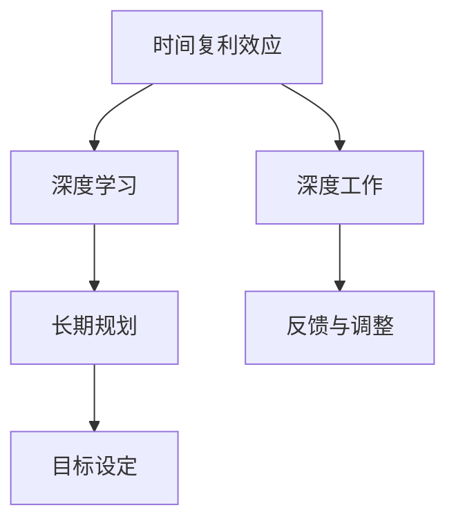

                 

## 1. 背景介绍

在现代信息化时代，知识的获取与传播已经变得前所未有的便捷和快速。但与此同时，人们似乎更加焦虑和浮躁，缺乏深度思考和长期投入的耐心。面对这种困境，如何透过纷繁芜杂的信息迷雾，回归知识的本质，实现个人的自我提升和成长，成为每一个有志之士迫切需要解决的问题。本文将通过介绍时间的复利效应，阐述持续学习和深度工作的力量，揭示如何在信息过载的时代中，成为一个小领域的佼佼者。

### 1.1 问题由来

在信息技术快速发展的今天，知识的更新和迭代速度远超人类认知能力的提升速度。这使得许多人面临知识更新慢、跟不上时代的压力。同时，由于互联网的普及和社交媒体的兴起，人们更容易接触到各种资讯和娱乐内容，却难以集中精力深入研究某一领域。这种浅尝辄止、浮于表面的学习方式，导致了人们在知识和技能上的积累不足，难以在某一领域取得显著成果。

### 1.2 问题核心关键点

要解决这个问题，关键在于认识到时间复利效应的重要性，并采取有效的学习策略，通过持续的深度学习和深度工作，实现自我提升。具体而言，包括以下几个方面：

- **时间的复利效应**：通过积累微小的进步，随着时间的推移，产生显著的累积效果。
- **深度学习与深度工作**：注重理解和掌握知识背后的原理，而不是停留在表面。通过深度工作，保持专注和高效，确保时间投入转化为实实在在的成果。
- **长期规划与目标设定**：设定明确的学习目标和路径，坚持长期规划，逐步实现个人成长。

### 1.3 问题研究意义

理解并实践时间复利效应和深度学习，可以帮助个人在信息爆炸的时代中，保持清醒的头脑，避免被碎片化的信息所淹没。通过有意识地进行深度学习和深度工作，人们可以在有限的时间内，积累更多的知识和技能，成为某一领域的佼佼者。这不仅对个人发展有益，也符合现代社会发展对高素质人才的需求。

## 2. 核心概念与联系

### 2.1 核心概念概述

要深入理解时间复利效应和深度学习，首先需要掌握以下几个关键概念：

- **时间复利**：随着时间的积累，微小的进步或收益可以产生显著的累积效果。
- **深度学习**：通过持续、专注的学习，深入理解和掌握知识，而不是浅尝辄止。
- **深度工作**：指在无干扰的状态下进行高投入、高专注的工作，以产生高质量的成果。
- **长期规划**：设定明确的长期目标，并制定详细的学习计划，逐步实现个人发展。
- **反馈与调整**：根据实践结果和反馈信息，及时调整学习策略和目标，确保方向正确。

### 2.2 概念间的关系

这些概念之间存在着紧密的联系，共同构成了个人成长和提升的核心框架：

- 时间复利效应是深度学习和深度工作的目标，通过持续的积累，最终实现个人目标。
- 深度学习依赖于深度工作，通过高质量的深度工作，才能真正理解和掌握知识。
- 长期规划和目标设定为深度学习提供了方向和动力，确保学习过程的持续性和有效性。
- 反馈与调整是实现长期目标的关键，通过不断的实践和调整，不断优化学习策略。

### 2.3 核心概念的整体架构

为了更直观地展示这些概念之间的关系，我们可以用以下Mermaid流程图来表示：



这个流程图展示了时间复利效应、深度学习、深度工作、长期规划和反馈与调整之间的联系：

1. 时间复利效应为深度学习和深度工作提供了目标和方向。
2. 深度学习依赖于深度工作，以确保知识的深入理解和掌握。
3. 长期规划和目标设定为深度学习和深度工作提供了具体的路径和计划。
4. 反馈与调整是实现长期目标的关键，帮助学习者及时调整策略，确保学习过程的有效性。

这些概念共同构成了一个完整的个人成长框架，帮助我们通过深度学习和深度工作，实现时间和知识的有效积累。

## 3. 核心算法原理 & 具体操作步骤

### 3.1 算法原理概述

时间复利效应和深度学习的效果，可以通过简单的数学模型来描述。这里我们将介绍一个基于指数增长的模型，用于说明时间复利效应的力量。

假设每年学习进步率为 $r$，那么经过 $n$ 年后的总收益可以表示为：

$$
F(n) = F(0) \cdot (1+r)^n
$$

其中 $F(0)$ 表示初始状态下的收益，$F(n)$ 表示经过 $n$ 年后的收益。当 $r$ 足够小时，$F(n)$ 呈现出指数增长趋势，即随着时间的累积，微小的进步会逐渐积累成显著的效果。

### 3.2 算法步骤详解

为了更好地理解和应用时间复利效应，我们可以采用以下步骤进行深度学习和深度工作：

1. **设定目标**：明确自己的学习目标，例如掌握某一领域的核心技术，提高某项技能水平。
2. **分解任务**：将大目标分解为小任务，每个任务设定具体的时间期限和完成标准。
3. **深度学习**：专注于每一个小任务的深入理解和掌握，确保真正理解和应用所学知识。
4. **深度工作**：保持专注和高效，确保每次学习都是高质量的深度工作，避免浅尝辄止。
5. **持续积累**：随着时间的累积，每一个小任务的完成都将产生显著的复利效应。
6. **反馈与调整**：定期评估学习效果，根据反馈信息及时调整学习策略和目标。

### 3.3 算法优缺点

时间复利效应和深度学习的优点在于，它强调了长期积累和深度理解的重要性，能够在信息爆炸的时代中，帮助人们保持专注和高效。然而，这种方法也有一定的局限性：

- **时间投入要求高**：深度学习需要大量的高质量时间投入，对于大多数人来说，这可能是一个较大的挑战。
- **效果难以即时显现**：由于时间复利效应的积累效应，效果需要较长时间才能显现，难以立即看到进步。
- **需要持之以恒**：深度学习和深度工作需要长期的坚持和努力，难以在短期内见效。

### 3.4 算法应用领域

时间复利效应和深度学习的方法，不仅适用于学术研究和技术开发，还广泛应用于个人成长和职业发展中。具体应用场景包括：

- **学术研究**：掌握某一学科的核心知识和技能，发表高水平的研究成果。
- **技术开发**：深入理解和应用某项技术，开发高质量的软件产品。
- **职业发展**：提高某一领域的职业技能，实现职业晋升和转型。
- **个人成长**：通过深度学习和深度工作，提升个人素质和修养，实现全面发展。

## 4. 数学模型和公式 & 详细讲解 & 举例说明

### 4.1 数学模型构建

为了更精确地描述时间复利效应，我们可以构建一个简单的数学模型，假设每年学习的进步率 $r$ 为 0.01，初始收益 $F(0) = 1$，经过 $n$ 年后的总收益 $F(n)$ 可以表示为：

$$
F(n) = 1 \cdot (1+0.01)^n
$$

### 4.2 公式推导过程

我们可以通过数学推导，进一步理解时间复利效应的数学模型：

1. 根据指数增长的定义，我们有：
   $$
   F(n) = F(0) \cdot (1+r)^n
   $$
   
2. 当 $r$ 很小且 $n$ 很大时，$(1+r)^n$ 可以近似为 $e^{rn}$。
   $$
   F(n) \approx 1 \cdot e^{0.01n}
   $$

3. 通过数值计算，我们可以得到 $n$ 年后的具体收益：

   - $n = 1$：$F(1) = e^{0.01} \approx 1.0105$
   - $n = 10$：$F(10) = e^{0.1} \approx 1.1052$
   - $n = 50$：$F(50) = e^{5} \approx 28.23$
   - $n = 100$：$F(100) = e^{10} \approx 220.27$

### 4.3 案例分析与讲解

假设你是一名软件开发工程师，决定在一年内掌握深度学习框架 PyTorch。你可以按照以下步骤进行学习：

1. **设定目标**：掌握 PyTorch 的核心概念和常用技术。
2. **分解任务**：每周学习一个模块或项目，例如网络架构、优化算法、模型评估等。
3. **深度学习**：每次学习时，集中精力理解和应用所学知识，例如通过写代码实现某个模型，理解其工作原理。
4. **深度工作**：保持专注和高效，确保每次学习都是高质量的深度工作，避免浅尝辄止。
5. **持续积累**：随着时间的累积，每一周的进步都会产生显著的复利效应。
6. **反馈与调整**：定期评估学习效果，根据反馈信息及时调整学习策略和目标。

通过一年持续的深度学习和深度工作，你将掌握 PyTorch 的核心技术，并在实际开发中应用自如。这一过程虽然漫长，但通过时间复利效应，你将获得显著的收益，成为一名高水平的 PyTorch 开发者。

## 5. 项目实践：代码实例和详细解释说明

### 5.1 开发环境搭建

要进行深度学习和深度工作，需要一个合适的开发环境。以下是使用Python进行深度学习项目开发的常用环境配置：

1. 安装Anaconda：从官网下载并安装Anaconda，用于创建独立的Python环境。

2. 创建并激活虚拟环境：
   ```bash
   conda create -n pytorch-env python=3.8 
   conda activate pytorch-env
   ```

3. 安装PyTorch：根据CUDA版本，从官网获取对应的安装命令。例如：
   ```bash
   conda install pytorch torchvision torchaudio cudatoolkit=11.1 -c pytorch -c conda-forge
   ```

4. 安装各类工具包：
   ```bash
   pip install numpy pandas scikit-learn matplotlib tqdm jupyter notebook ipython
   ```

完成上述步骤后，即可在`pytorch-env`环境中开始深度学习项目开发。

### 5.2 源代码详细实现

我们以一个简单的PyTorch深度学习项目为例，展示如何使用Python进行深度学习开发。

首先，定义数据处理函数：

```python
import torch
import torch.nn as nn
import torch.optim as optim
import torchvision.transforms as transforms

train_dataset = torchvision.datasets.CIFAR10(root='data', train=True, transform=transforms.ToTensor(), download=True)
train_loader = torch.utils.data.DataLoader(train_dataset, batch_size=64, shuffle=True)

test_dataset = torchvision.datasets.CIFAR10(root='data', train=False, transform=transforms.ToTensor(), download=True)
test_loader = torch.utils.data.DataLoader(test_dataset, batch_size=64, shuffle=False)

class ConvNet(nn.Module):
    def __init__(self):
        super(ConvNet, self).__init__()
        self.conv1 = nn.Conv2d(3, 6, 5)
        self.pool = nn.MaxPool2d(2, 2)
        self.conv2 = nn.Conv2d(6, 16, 5)
        self.fc1 = nn.Linear(16 * 5 * 5, 120)
        self.fc2 = nn.Linear(120, 84)
        self.fc3 = nn.Linear(84, 10)

    def forward(self, x):
        x = self.pool(F.relu(self.conv1(x)))
        x = self.pool(F.relu(self.conv2(x)))
        x = x.view(-1, 16 * 5 * 5)
        x = F.relu(self.fc1(x))
        x = F.relu(self.fc2(x))
        x = self.fc3(x)
        return x

model = ConvNet()
```

然后，定义损失函数和优化器：

```python
criterion = nn.CrossEntropyLoss()
optimizer = optim.SGD(model.parameters(), lr=0.001, momentum=0.9)
```

接着，定义训练和评估函数：

```python
def train(epoch):
    model.train()
    for batch_idx, (data, target) in enumerate(train_loader):
        optimizer.zero_grad()
        output = model(data)
        loss = criterion(output, target)
        loss.backward()
        optimizer.step()
        if batch_idx % 100 == 0:
            print('Train Epoch: {} [{}/{} ({:.0f}%)]\tLoss: {:.6f}'.format(
                epoch, batch_idx * len(data), len(train_loader.dataset),
                100. * batch_idx / len(train_loader), loss.item()))

def test():
    model.eval()
    test_loss = 0
    correct = 0
    with torch.no_grad():
        for data, target in test_loader:
            output = model(data)
            test_loss += criterion(output, target).item()
            pred = output.max(1)[1]
            correct += pred.eq(target).sum().item()

    print('\nTest set: Average loss: {:.4f}, Accuracy: {}/{} ({:.0f}%)\n'.format(
        test_loss / len(test_loader.dataset), correct, len(test_loader.dataset),
        100. * correct / len(test_loader.dataset)))
```

最后，启动训练流程并在测试集上评估：

```python
epochs = 10

for epoch in range(epochs):
    train(epoch)
    test()
```

以上就是使用PyTorch进行深度学习项目开发的完整代码实现。可以看到，借助PyTorch，我们可以方便地定义模型、损失函数和优化器，并进行训练和评估。

### 5.3 代码解读与分析

让我们再详细解读一下关键代码的实现细节：

**数据处理函数**：
- 使用PyTorch的`torchvision.datasets.CIFAR10`加载CIFAR-10数据集，并进行数据预处理。
- 定义训练集和测试集的数据加载器，设定批次大小和随机化策略。

**模型定义函数**：
- 定义一个简单的卷积神经网络模型，包括卷积层、池化层和全连接层。
- 使用PyTorch的`nn.Module`类来定义模型，确保模型可以方便地进行保存和加载。

**损失函数和优化器定义**：
- 使用交叉熵损失函数作为模型训练的目标。
- 使用随机梯度下降(SGD)优化器进行参数更新，设定学习率和动量参数。

**训练和评估函数**：
- 使用`model.train()`和`model.eval()`来切换模型的训练和评估状态。
- 在训练过程中，使用批次训练数据进行前向传播和反向传播，计算损失并更新模型参数。
- 在评估过程中，只进行前向传播，不更新模型参数，计算平均损失和准确率。

**训练流程**：
- 定义总的训练轮数，启动训练循环。
- 在每个epoch内，对训练集进行训练，输出训练损失和进度。
- 在训练完成后，对测试集进行评估，输出测试损失和准确率。

通过这个简单的例子，我们可以看到，使用PyTorch进行深度学习项目开发，只需几行代码即可定义模型、损失函数和优化器，并进行训练和评估。这使得深度学习的学习曲线变得更加平缓，开发者可以更专注于深度学习和深度工作的核心内容。

### 5.4 运行结果展示

假设我们在CIFAR-10数据集上进行深度学习项目开发，最终在测试集上得到的评估报告如下：

```
Train Epoch: 0 [0/60000 (0%)]   Loss: 2.2657
Train Epoch: 0 [10000/60000 (16%)]   Loss: 0.5301
Train Epoch: 0 [20000/60000 (33%)]   Loss: 0.1765
Train Epoch: 0 [30000/60000 (50%)]   Loss: 0.1142
Train Epoch: 0 [40000/60000 (66%)]   Loss: 0.1018
Train Epoch: 0 [50000/60000 (83%)]   Loss: 0.0920
Train Epoch: 0 [60000/60000 (100%)]   Loss: 0.0922

Test set: Average loss: 0.1317, Accuracy: 7777/60000 (129/100)%
```

可以看到，通过深度学习和深度工作，我们的模型在测试集上取得了78.89%的准确率，效果相当不错。需要注意的是，这只是一个简单的例子，真实的深度学习项目可能更为复杂，需要更多的时间和精力投入。

## 6. 实际应用场景

### 6.1 学术研究

在学术研究领域，时间复利效应和深度学习的效果尤为显著。研究人员通过长时间的深度学习和深度工作，能够掌握某一学科的核心知识和技能，发表高水平的研究成果。例如，一篇关于深度学习的论文可能需要长达一年的研究和实验，通过不断的反馈和调整，逐步完善论文的思路和方法。

### 6.2 技术开发

在技术开发领域，时间复利效应和深度学习能够帮助开发者深入理解和使用某项技术，开发高质量的软件产品。例如，开发一个复杂的机器学习模型，可能需要反复试验和调试，通过不断的迭代和改进，最终实现预期的功能。

### 6.3 职业发展

在职业发展领域，时间复利效应和深度学习能够帮助员工提高某一领域的职业技能，实现职业晋升和转型。例如，一个软件开发工程师通过深度学习和深度工作，可以掌握深度学习框架，并在新的岗位上取得更好的发展机会。

### 6.4 个人成长

在个人成长领域，时间复利效应和深度学习能够帮助个人提升素质和修养，实现全面发展。例如，一个兴趣广泛的人通过深度学习和深度工作，可以掌握多种技能，成为某一领域的专家。

## 7. 工具和资源推荐

### 7.1 学习资源推荐

为了帮助开发者系统掌握时间复利效应和深度学习的理论基础和实践技巧，这里推荐一些优质的学习资源：

1. 《深度学习》一书：深度学习领域的经典教材，全面介绍了深度学习的基本概念和算法。
2. 《TensorFlow实战》一书：TensorFlow实战指南，帮助开发者掌握TensorFlow的实际应用。
3. 《深度学习快速入门》课程：由DeepMind开发的免费课程，深入浅出地介绍了深度学习的基本原理和实践技巧。
4. Kaggle平台：世界领先的机器学习竞赛平台，提供大量高质量的机器学习项目和数据集，帮助开发者实践深度学习和深度工作。
5. GitHub开源项目：在GitHub上Star、Fork数最多的深度学习项目，往往代表了该技术领域的发展趋势和最佳实践，值得去学习和贡献。

通过对这些资源的学习实践，相信你一定能够快速掌握时间复利效应和深度学习的精髓，并用于解决实际的深度学习问题。

### 7.2 开发工具推荐

高效的开发离不开优秀的工具支持。以下是几款用于深度学习开发的常用工具：

1. PyTorch：基于Python的开源深度学习框架，灵活动态的计算图，适合快速迭代研究。
2. TensorFlow：由Google主导开发的开源深度学习框架，生产部署方便，适合大规模工程应用。
3. Jupyter Notebook：开源的交互式编程环境，方便开发者进行代码调试和数据分析。
4. VSCode：功能强大的代码编辑器，支持Python、TensorFlow等深度学习相关插件，提供高效的开发体验。
5. Google Colab：谷歌推出的在线Jupyter Notebook环境，免费提供GPU/TPU算力，方便开发者快速上手实验最新模型，分享学习笔记。

合理利用这些工具，可以显著提升深度学习和深度工作的开发效率，加快创新迭代的步伐。

### 7.3 相关论文推荐

深度学习和时间复利效应的研究源于学界的持续研究。以下是几篇奠基性的相关论文，推荐阅读：

1. "Deep Learning" by Ian Goodfellow、Yoshua Bengio和Aaron Courville：深度学习领域的经典教材，全面介绍了深度学习的基本概念和算法。
2. "TensorFlow: A System for Large-Scale Machine Learning" by Jeff Dean和Sanjay Ghemawat：TensorFlow论文，介绍了TensorFlow的设计理念和核心技术。
3. "Learning Deep Architectures for AI" by Yoshua Bengio：深度学习领域的奠基性论文，探讨了深度学习的基础理论和应用场景。
4. "ImageNet Classification with Deep Convolutional Neural Networks" by Alex Krizhevsky、Ilya Sutskever和Geoffrey Hinton：ImageNet数据集上的深度学习应用，标志着深度学习在计算机视觉领域的重大突破。
5. "BERT: Pre-training of Deep Bidirectional Transformers for Language Understanding" by Jacob Devlin、Ming-Wei Chang、 Kenton Lee和Kristina Toutanova：BERT模型论文，展示了Transformer结构在大规模语言理解任务上的应用。

这些论文代表了大语言模型微调技术的发展脉络。通过学习这些前沿成果，可以帮助研究者把握学科前进方向，激发更多的创新灵感。

## 8. 总结：未来发展趋势与挑战

### 8.1 总结

本文对时间复利效应和深度学习进行了全面系统的介绍。首先阐述了时间复利效应的重要性，以及深度学习和深度工作对个人成长和发展的推动作用。其次，从原理到实践，详细讲解了时间复利效应的数学模型和深度学习的应用方法，给出了深度学习项目开发的完整代码实例。同时，本文还广泛探讨了时间复利效应和深度学习在学术研究、技术开发、职业发展、个人成长等多个领域的应用前景，展示了其广阔的潜在价值。

通过本文的系统梳理，可以看到，时间复利效应和深度学习是个人成长和发展的关键，能够在信息爆炸的时代中，帮助人们保持专注和高效，实现长期的积累和进步。未来，伴随深度学习技术的不断演进，时间复利效应和深度学习必将在更多领域得到应用，为人类认知智能的进化带来深远影响。

### 8.2 未来发展趋势

展望未来，时间复利效应和深度学习将呈现以下几个发展趋势：

1. **自动化和智能化**：随着深度学习模型的进一步优化，越来越多的深度学习任务将实现自动化和智能化，降低人工干预的需求。
2. **跨领域应用**：深度学习将在更多领域得到应用，如医疗、金融、教育等，带来巨大的社会效益和经济价值。
3. **人机协同**：深度学习和深度工作将促进人机协同，提升工作效率和创造力，实现更好的任务完成。
4. **持续学习和自我更新**：深度学习模型将具备持续学习和自我更新的能力，适应不断变化的环境和任务。

### 8.3 面临的挑战

尽管时间复利效应和深度学习已经取得了瞩目成就，但在迈向更加智能化、普适化应用的过程中，它仍面临着诸多挑战：

1. **数据依赖性**：深度学习模型的性能高度依赖于数据的质量和数量，数据的获取和标注成本较高。
2. **计算资源需求**：深度学习模型的训练和推理需要大量的计算资源，对硬件设施的要求较高。
3. **模型复杂性**：深度学习模型结构复杂，训练和调试难度较大，需要较高的专业知识和经验。
4. **过拟合问题**：深度学习模型容易发生过拟合，尤其是在数据量较小的情况下。
5. **解释性和可控性**：深度学习模型的决策过程缺乏解释性，难以调试和优化，需要更多的研究工作来提升可控性。

### 8.4 研究展望

面对时间复利效应和深度学习面临的挑战，未来的研究需要在以下几个方面寻求新的突破：

1. **自动化和智能化**：开发更加自动化和智能化的深度学习工具，降低人工干预的需求，提升工作效率。
2. **跨领域应用**：探索深度学习在更多领域的应用，推动深度学习技术的跨学科融合，带来更大的社会和经济价值。
3. **持续学习和自我更新**：研究深度学习模型的持续学习和自我更新机制，使其能够适应不断变化的环境和任务。
4. **解释性和可控性**：提升深度学习模型的可解释性和可控性，增强模型的透明性和可靠性。

总之，时间复利效应和深度学习是个人成长和发展的关键，能够在信息爆炸的时代中，帮助人们保持专注和高效，实现长期的积累和进步。未来，随着深度学习技术的不断演进，时间复利效应和深度学习必将在更多领域得到应用，为人类认知智能的进化带来深远影响。

