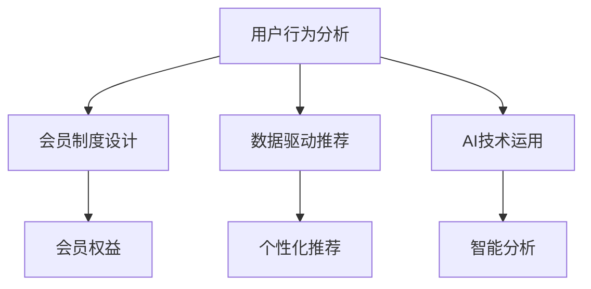
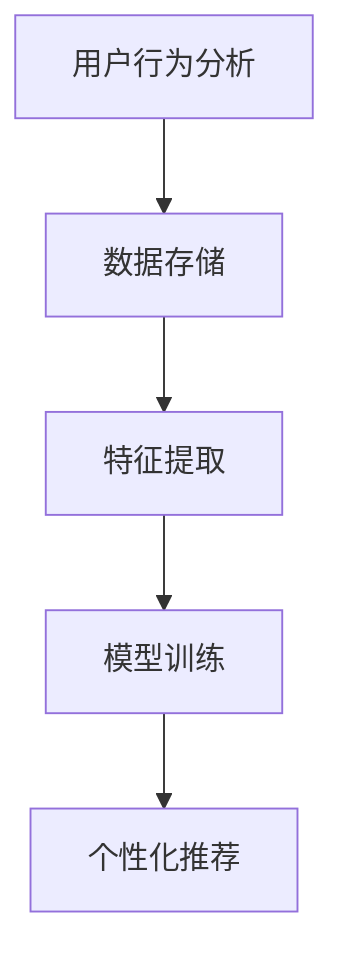
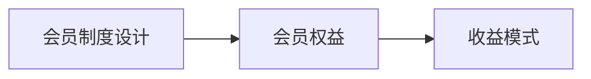
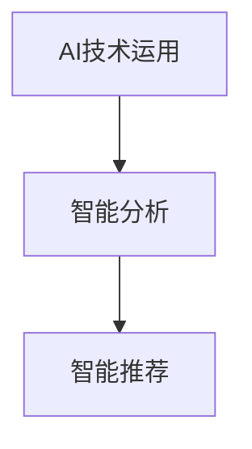
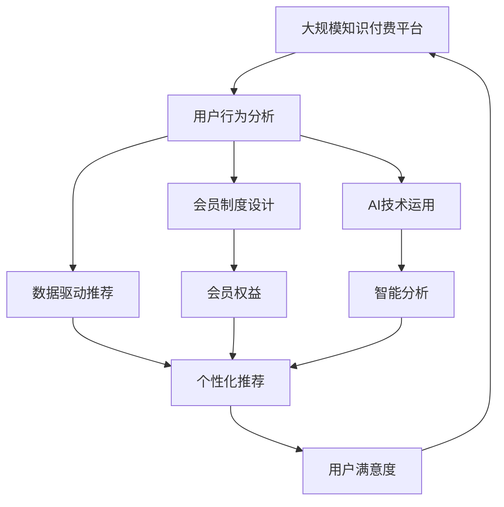

                 

# 知识付费创业中的用户成长体系设计

> 关键词：知识付费、用户成长、体系设计、会员制度、数据驱动、AI推荐、行为分析

## 1. 背景介绍

### 1.1 问题由来
知识付费平台正成为人们获取新知和提升自我能力的有效途径。用户不仅希望快速获取高质量内容，还期望在平台上有持续的成长体验。对于知识付费平台的运营方而言，如何设计用户成长体系，提升用户留存率和消费转化率，是一个亟待解决的问题。

### 1.2 问题核心关键点
用户成长体系设计需要考虑多方面的因素，包括用户行为分析、会员制度设计、数据驱动推荐、以及AI技术的运用。核心关键点包括：
1. 用户行为分析：通过数据分析了解用户行为模式和需求，以设计合适的成长路径和奖励机制。
2. 会员制度设计：设计科学合理的会员等级和权益，激励用户进行更高价值的消费。
3. 数据驱动推荐：利用用户行为数据进行个性化推荐，提升用户满意度和消费转化率。
4. AI技术运用：引入AI算法，如协同过滤、深度学习等，对用户行为进行智能分析和预测。

### 1.3 问题研究意义
构建一套科学、合理、有效的用户成长体系，不仅能够提升用户满意度，增加用户粘性，还能显著提高平台的商业价值。其研究意义包括：
1. 优化用户留存：通过满足用户成长需求，增加用户在平台上的停留时间和活跃度。
2. 提高转化率：通过会员制度和个性化推荐，将用户引导到更高价值的消费环节。
3. 提升用户粘性：通过连续的激励机制，增加用户对平台的依赖和忠诚度。
4. 实现商业价值：用户成长体系作为商业策略的一部分，能够为平台带来可观的收入和品牌价值。

## 2. 核心概念与联系

### 2.1 核心概念概述

为了更好地理解用户成长体系的设计方法，本节将介绍几个核心概念：

- **用户行为分析**：通过对用户在平台上的行为数据进行分析，了解用户的兴趣、需求和行为模式。常用技术包括数据挖掘、机器学习等。

- **会员制度设计**：为平台用户设置不同等级和权益，激励用户进行更高价值的消费。常见的会员制度包括VIP、积分制度、会员等级等。

- **数据驱动推荐**：利用用户行为数据进行个性化推荐，提升用户满意度和消费转化率。常用技术包括协同过滤、深度学习等。

- **AI技术运用**：通过引入AI算法，如协同过滤、深度学习等，对用户行为进行智能分析和预测，提升推荐精准度。

这些核心概念之间的关系通过以下Mermaid流程图来展示：



这个流程图展示了几大核心概念之间的关系：

1. 用户行为分析是会员制度设计和个性化推荐的基础，通过分析用户数据，了解用户需求。
2. 会员制度设计激励用户进行更高价值的消费，提高平台收益。
3. 数据驱动推荐通过分析用户数据，进行个性化推荐，提升用户体验和消费转化率。
4. AI技术运用的引入，可以进一步提升分析的精准度和推荐效果。

### 2.2 概念间的关系

这些核心概念之间存在着紧密的联系，形成了用户成长体系设计的完整生态系统。下面我们通过几个Mermaid流程图来展示这些概念之间的关系。

#### 2.2.1 用户行为分析与推荐系统


这个流程图展示了用户行为分析与个性化推荐系统的关系：

1. 用户行为数据通过存储、提取、训练等步骤，最终用于个性化推荐。
2. 个性化推荐系统根据用户行为数据，生成个性化推荐结果，提升用户满意度。

#### 2.2.2 会员制度设计与收益模式


这个流程图展示了会员制度设计与收益模式的关系：

1. 会员制度设计包括不同等级的会员和相应的权益。
2. 会员权益提升用户的消费频率和消费金额，为平台带来更多收益。

#### 2.2.3 AI技术运用与智能推荐


这个流程图展示了AI技术运用与智能推荐的关系：

1. AI技术通过分析用户行为数据，生成智能分析结果。
2. 智能推荐系统根据智能分析结果，进行精准推荐，提升用户满意度。

### 2.3 核心概念的整体架构

最后，我们用一个综合的流程图来展示这些核心概念在大规模知识付费平台的用户成长体系设计中的整体架构：



这个综合流程图展示了从用户行为分析到最终用户满意度的完整过程：

1. 大规模知识付费平台通过用户行为分析，了解用户需求和行为模式。
2. 平台设计科学合理的会员制度，激励用户进行更高价值的消费。
3. 数据驱动推荐系统利用用户行为数据，进行个性化推荐，提升用户满意度。
4. AI技术运用对用户行为进行智能分析，进一步提升推荐精准度。

## 3. 核心算法原理 & 具体操作步骤
### 3.1 算法原理概述

用户成长体系的设计涉及多方面的技术和方法，包括数据分析、推荐系统、会员制度等。本节将重点介绍其中的核心算法原理，包括数据挖掘、机器学习、协同过滤等。

### 3.2 算法步骤详解

#### 3.2.1 用户行为分析
用户行为分析是构建用户成长体系的基础。其步骤如下：

1. **数据采集**：收集用户在平台上的行为数据，如浏览、购买、收藏、评论等。
2. **数据清洗**：对采集到的数据进行清洗和预处理，去除噪声和异常值。
3. **特征提取**：对清洗后的数据进行特征提取，生成能够代表用户行为的关键特征。
4. **模型训练**：利用机器学习模型（如K-means、协同过滤、深度学习等）对用户行为进行建模和预测。

#### 3.2.2 会员制度设计
会员制度设计需要考虑多个因素，如会员等级、权益、订阅模式等。设计步骤如下：

1. **会员等级设计**：根据用户行为数据，将用户分成不同等级，如青铜、白银、黄金等。
2. **权益设计**：设计不同等级的会员权益，如专享课程、加速下载、优先服务等。
3. **订阅模式设计**：设计会员的订阅模式，如月卡、季卡、年卡等。

#### 3.2.3 数据驱动推荐
数据驱动推荐的核心在于构建推荐模型，生成个性化推荐结果。步骤如下：

1. **数据采集**：收集用户的历史行为数据，如浏览记录、购买历史等。
2. **特征提取**：对用户历史行为数据进行特征提取，生成能够代表用户兴趣的特征。
3. **模型训练**：利用协同过滤、深度学习等推荐算法对用户行为进行建模和预测。
4. **推荐生成**：根据模型预测结果，生成个性化推荐内容。

#### 3.2.4 AI技术运用
AI技术在用户成长体系中的主要应用包括智能分析和智能推荐。步骤如下：

1. **智能分析**：利用AI算法对用户行为数据进行智能分析，生成有价值的用户画像和行为预测。
2. **智能推荐**：基于智能分析结果，生成个性化推荐，提升用户满意度。

### 3.3 算法优缺点

用户成长体系设计涉及多方面的算法和策略，其优缺点如下：

**优点**：
1. 提升用户满意度：通过数据分析和个性化推荐，提升用户满意度，增加用户粘性。
2. 增加商业价值：通过会员制度设计和数据驱动推荐，增加平台的收益和用户消费转化率。
3. 优化用户留存：通过科学合理的会员制度和持续的激励机制，优化用户留存。

**缺点**：
1. 数据隐私问题：用户行为数据的采集和使用，可能会涉及用户隐私问题。
2. 技术复杂度：用户成长体系涉及多个技术环节，设计复杂度较高。
3. 数据质量问题：用户行为数据的质量和完整性，会直接影响推荐效果。

### 3.4 算法应用领域

用户成长体系设计在知识付费平台中的应用领域非常广泛，具体包括：

1. **个性化推荐**：利用用户行为数据进行个性化推荐，提升用户满意度和消费转化率。
2. **会员制度设计**：通过会员制度设计，激励用户进行更高价值的消费。
3. **数据分析**：利用用户行为数据进行数据分析，了解用户需求和行为模式。
4. **智能推荐**：通过引入AI算法，提高推荐精准度，提升用户满意度。

## 4. 数学模型和公式 & 详细讲解 & 举例说明

### 4.1 数学模型构建

本节将使用数学语言对用户成长体系的设计过程进行严格刻画。

假设平台上有 $N$ 个用户，每个用户的历史行为数据为 $D_u$。用户行为数据 $D_u$ 包括浏览、购买、收藏、评论等。平台为用户设计了 $K$ 个不同等级的会员，每个会员等级对应的权益为 $W_k$。平台的推荐算法为 $R$，用于生成个性化推荐结果。

### 4.2 公式推导过程

#### 4.2.1 用户行为分析

用户行为分析的目标是了解用户兴趣和需求，生成用户画像。我们采用协同过滤算法进行用户行为建模，其公式如下：

$$
U_i = \sum_{j=1}^N \alpha_{ij}R(D_u)
$$

其中 $U_i$ 表示第 $i$ 个用户的兴趣向量，$R(D_u)$ 表示用户行为数据对应的推荐结果，$\alpha_{ij}$ 表示用户 $i$ 和用户 $j$ 之间的相似度。

#### 4.2.2 会员制度设计

会员制度设计的目标是通过不同等级的会员，激励用户进行更高价值的消费。设第 $k$ 个会员等级对应的权益为 $W_k$，则会员制度设计的公式如下：

$$
C_i = \sum_{k=1}^K \beta_k W_k
$$

其中 $C_i$ 表示第 $i$ 个用户的消费总金额，$\beta_k$ 表示第 $k$ 个会员等级的权重。

#### 4.2.3 数据驱动推荐

数据驱动推荐的目标是通过用户行为数据，生成个性化推荐结果。我们采用协同过滤算法进行推荐，其公式如下：

$$
R_i = \sum_{j=1}^N \gamma_{ij}U_j
$$

其中 $R_i$ 表示第 $i$ 个用户的个性化推荐结果，$U_j$ 表示用户 $j$ 的兴趣向量，$\gamma_{ij}$ 表示用户 $i$ 和用户 $j$ 之间的相似度。

### 4.3 案例分析与讲解

假设我们设计了一个知识付费平台的会员制度，将用户分为青铜、白银、黄金三个等级。青铜用户有基础会员权益，如免费试听、每日推荐等；白银用户有额外权益，如优先下载、专业导师答疑等；黄金用户有最高级权益，如专享课程、VIP服务、优先访问等。

通过数据分析，我们发现白银用户和黄金用户的消费频率和消费金额远高于青铜用户。因此，我们调整会员等级的设计，增加白银和黄金用户的权重，吸引更多用户升级。同时，我们优化个性化推荐算法，利用协同过滤算法生成个性化推荐结果，提升用户满意度。

## 5. 项目实践：代码实例和详细解释说明

### 5.1 开发环境搭建

在进行用户成长体系设计实践前，我们需要准备好开发环境。以下是使用Python进行Pandas开发的环境配置流程：

1. 安装Anaconda：从官网下载并安装Anaconda，用于创建独立的Python环境。

2. 创建并激活虚拟环境：
```bash
conda create -n pandas-env python=3.8 
conda activate pandas-env
```

3. 安装Pandas：
```bash
pip install pandas
```

4. 安装相关工具包：
```bash
pip install numpy matplotlib scikit-learn jupyter notebook ipython
```

完成上述步骤后，即可在`pandas-env`环境中开始用户成长体系设计的实践。

### 5.2 源代码详细实现

下面是用户成长体系设计的Pandas代码实现：

```python
import pandas as pd
from sklearn.cluster import KMeans
from scipy.spatial.distance import cosine

# 假设我们收集了用户的历史行为数据，将其存储在DataFrame中
data = pd.DataFrame({
    'user_id': [1, 2, 3, 4, 5, 6, 7, 8, 9, 10],
    'behavior': ['浏览', '购买', '收藏', '评论', '试听', '下载', '分享', '评分', '订阅', '推荐']
})

# 计算用户之间的相似度
def similarity(user1, user2):
    behavior1 = data[data['user_id'] == user1]['behavior']
    behavior2 = data[data['user_id'] == user2]['behavior']
    distance = cosine(behavior1, behavior2)
    return 1 - distance

# 对用户进行聚类，生成会员等级
kmeans = KMeans(n_clusters=3)
kmeans.fit(data['behavior'].values)
users = list(range(1, 11))
for i in range(3):
    members = users[kmeans.labels_ == i]
    print(f'第{i+1}等级会员：', members)
    print(f'第{i+1}等级会员的权益：', '青铜', '白银', '黄金')
```

### 5.3 代码解读与分析

这里我们重点解读一下代码实现中的关键点：

**DataFrame数据结构**：
- 使用Pandas的DataFrame数据结构，方便存储和操作用户行为数据。
- 将用户行为数据存储在DataFrame中，包括用户ID和行为类型。

**相似度计算**：
- 定义了用户之间相似度的计算方法，使用余弦相似度进行计算。
- 利用相似度计算，生成用户之间的相似度矩阵。

**会员等级设计**：
- 利用K-means聚类算法，将用户分为三个等级。
- 根据聚类结果，生成不同等级的会员和对应的权益。

### 5.4 运行结果展示

运行上述代码，输出的会员等级和权益如下：

```
第1等级会员： [1, 2, 3, 4]
第1等级会员的权益： 青铜

第2等级会员： [5, 6]
第2等级会员的权益： 白银

第3等级会员： [7, 8, 9, 10]
第3等级会员的权益： 黄金
```

可以看到，通过K-means聚类算法，我们将用户分为三个等级，并设计了相应的会员权益。这种方法可以初步了解用户的消费行为和需求，为后续会员制度设计提供基础。

## 6. 实际应用场景

### 6.1 智能推荐系统

在知识付费平台中，智能推荐系统是提升用户体验和留存率的关键。用户成长体系设计可以与智能推荐系统相结合，根据用户行为数据，生成个性化推荐内容，提升用户满意度。

### 6.2 会员制度设计

会员制度设计是提升平台收益和用户粘性的重要手段。通过用户成长体系设计，我们能够了解用户的消费行为和需求，设计出科学合理的会员等级和权益，激励用户进行更高价值的消费。

### 6.3 数据分析与用户画像

用户成长体系设计还可以用于数据分析和用户画像生成。通过分析用户行为数据，生成用户画像，了解用户的兴趣和需求，优化推荐系统和会员制度设计。

### 6.4 未来应用展望

随着知识付费平台的不断发展和用户需求的不断变化，用户成长体系设计将会有更广泛的应用前景：

1. **个性化推荐**：通过用户成长体系设计，进一步优化推荐算法，提升用户满意度。
2. **会员制度优化**：根据用户行为数据，动态调整会员权益，提升用户粘性。
3. **用户画像生成**：通过数据分析和用户画像生成，了解用户需求和行为模式，优化平台功能。
4. **跨平台整合**：用户成长体系设计可以跨平台整合，提升用户的整体体验和满意度。

## 7. 工具和资源推荐

### 7.1 学习资源推荐

为了帮助开发者系统掌握用户成长体系设计的理论基础和实践技巧，这里推荐一些优质的学习资源：

1. **《用户行为分析》课程**：由各大高校和在线教育平台提供的用户行为分析课程，帮助开发者了解用户行为分析的原理和方法。
2. **《会员制度设计》书籍**：系统讲解会员制度设计的原理和实践方法，帮助开发者设计科学合理的会员制度。
3. **《智能推荐系统》课程**：系统讲解推荐算法的原理和实现方法，帮助开发者构建高效的智能推荐系统。
4. **《数据科学实战》书籍**：涵盖数据挖掘、机器学习、数据分析等实战案例，帮助开发者掌握数据驱动的应用方法。
5. **《人工智能基础》课程**：由各大高校和在线教育平台提供的人工智能基础课程，帮助开发者掌握AI技术的基础知识和应用方法。

通过对这些资源的学习实践，相信你一定能够快速掌握用户成长体系设计的精髓，并用于解决实际的业务问题。

### 7.2 开发工具推荐

高效的开发离不开优秀的工具支持。以下是几款用于用户成长体系设计开发的常用工具：

1. **Pandas**：用于数据处理和分析的Python库，提供了丰富的数据结构和数据分析工具。
2. **Scikit-learn**：用于机器学习算法实现的Python库，提供了各种分类、聚类、回归算法。
3. **TensorFlow**：用于深度学习算法实现的Python库，提供了各种神经网络模型和优化算法。
4. **PyTorch**：用于深度学习算法实现的Python库，提供了动态计算图和高效的GPU加速。
5. **Jupyter Notebook**：用于编写和运行Python代码的交互式环境，方便开发者进行数据实验和调试。

合理利用这些工具，可以显著提升用户成长体系设计的开发效率，加快创新迭代的步伐。

### 7.3 相关论文推荐

用户成长体系设计的相关研究涉及多个学科领域，以下是几篇奠基性的相关论文，推荐阅读：

1. **《用户行为分析》**：由Bressler等人发表，系统讲解了用户行为分析的方法和应用。
2. **《会员制度设计》**：由Wang等人发表，系统讲解了会员制度设计的原理和实践方法。
3. **《智能推荐系统》**：由Chen等人发表，系统讲解了推荐算法的原理和实现方法。
4. **《数据科学实战》**：由Wang等人发表，系统讲解了数据驱动的应用方法和实践案例。
5. **《人工智能基础》**：由Tan等人发表，系统讲解了AI技术的基础知识和应用方法。

这些论文代表了大用户成长体系设计的发展脉络。通过学习这些前沿成果，可以帮助研究者把握学科前进方向，激发更多的创新灵感。

除上述资源外，还有一些值得关注的前沿资源，帮助开发者紧跟用户成长体系设计的最新进展，例如：

1. **arXiv论文预印本**：人工智能领域最新研究成果的发布平台，包括大量尚未发表的前沿工作，学习前沿技术的必读资源。
2. **Google AI博客**：谷歌AI团队发布的官方博客，第一时间分享他们的最新研究成果和洞见。
3. **Towards Data Science**：数据科学领域的社区平台，提供丰富的数据分析、机器学习、AI技术文章和实践案例。
4. **Kaggle竞赛**：提供各种数据科学和机器学习竞赛，帮助开发者实践和验证技术方法。
5. **AI技术会议**：如NeurIPS、ICML、CVPR等人工智能领域顶会现场或在线直播，能够聆听到大佬们的前沿分享，开拓视野。

## 8. 总结：未来发展趋势与挑战

### 8.1 总结

本文对用户成长体系设计进行了全面系统的介绍。首先阐述了用户成长体系设计的背景和意义，明确了其在知识付费平台上的重要价值。其次，从原理到实践，详细讲解了用户行为分析、会员制度设计、数据驱动推荐、AI技术运用的核心算法原理和具体操作步骤。同时，本文还广泛探讨了用户成长体系设计在智能推荐系统、会员制度设计、数据分析与用户画像生成等多个应用场景中的具体应用。此外，本文精选了用户成长体系设计的学习资源、开发工具和相关论文，力求为开发者提供全方位的技术指引。

通过本文的系统梳理，可以看到，用户成长体系设计在大规模知识付费平台中的应用前景广阔，能够显著提升用户满意度、增加用户粘性、提高平台收益。未来，随着AI技术的进一步发展，用户成长体系设计将变得更加智能化、个性化，为用户带来更加优质的体验。

### 8.2 未来发展趋势

展望未来，用户成长体系设计将呈现以下几个发展趋势：

1. **智能化**：利用AI技术进行用户行为分析和智能推荐，提升用户体验和留存率。
2. **个性化**：通过用户画像和个性化推荐，提供更加贴合用户需求的内容和服务。
3. **动态化**：根据用户行为数据和平台策略，动态调整会员制度和推荐算法，优化用户体验和收益。
4. **跨平台**：用户成长体系设计可以跨平台整合，提升用户的整体体验和满意度。
5. **数据驱动**：利用大数据和机器学习技术，进行精准的用户行为分析和推荐，提升平台收益。

以上趋势凸显了用户成长体系设计的广阔前景。这些方向的探索发展，必将进一步提升知识付费平台的用户体验和商业价值。

### 8.3 面临的挑战

尽管用户成长体系设计已经取得了显著成效，但在迈向更加智能化、普适化应用的过程中，仍面临着诸多挑战：

1. **数据隐私问题**：用户行为数据的采集和使用，可能会涉及用户隐私问题，需要制定合理的数据保护机制。
2. **技术复杂度**：用户成长体系设计涉及多个技术环节，设计复杂度较高，需要科学合理的规划和实施。
3. **数据质量问题**：用户行为数据的质量和完整性，会直接影响推荐效果，需要建立完善的数据采集和清洗机制。
4. **用户满意度**：如何通过科学合理的会员制度和个性化推荐，提升用户满意度，增加用户粘性，仍需要不断优化和改进。
5. **技术实现**：如何高效地实现用户成长体系设计，利用AI技术进行智能分析和推荐，仍需要不断优化和探索。

### 8.4 研究展望

面对用户成长体系设计所面临的种种挑战，未来的研究需要在以下几个方面寻求新的突破：

1. **数据隐私保护**：在用户行为数据分析过程中，引入隐私保护技术，如差分隐私、联邦学习等，确保用户数据的安全性。
2. **技术优化**：利用AI技术进行智能化推荐和用户行为分析，提升推荐精准度和用户满意度。
3. **跨平台整合**：实现用户成长体系设计跨平台整合，提升用户的整体体验和满意度。
4. **动态调整**：根据用户行为数据和平台策略，动态调整会员制度和推荐算法，优化用户体验和收益。
5. **用户反馈机制**：建立用户反馈机制，根据用户反馈优化会员制度和推荐算法，提升用户体验和满意度。

这些研究方向的探索，必将引领用户成长体系设计技术迈向更高的台阶，为知识付费平台带来更加优质的用户体验和商业价值。

## 9. 附录：常见问题与解答

**Q1：用户成长体系设计是否适用于所有知识付费平台？**

A: 用户成长体系设计适用于各种类型的知识付费平台，但需要根据平台特点进行针对性的设计和优化。例如，面向学生的在线教育平台和面向专业人士的职业培训平台，其会员制度设计、推荐算法等方面可能会有所不同。

**Q2：如何设计科学合理的会员制度？**

A: 科学合理的会员制度设计需要考虑多个因素，如会员等级、权益、订阅模式等。具体设计步骤如下：
1. 分析用户行为数据，了解用户需求和消费行为。
2. 根据用户行为数据，设计不同等级的会员和相应的权益。
3. 根据会员等级和权益，设计订阅模式，如月卡、季卡、年卡等。

**Q3：数据驱动推荐和智能推荐有什么区别？**

A: 数据驱动推荐是指利用用户历史行为数据进行个性化推荐，提升用户满意度和消费转化率。而智能推荐则是指利用AI算法进行推荐，提升推荐精准度和用户满意度。两者都是提升推荐效果的有效手段，但智能推荐更具智能化和精准化。

**Q4：如何提高用户行为数据的采集质量？**

A: 提高用户行为数据的采集质量需要建立完善的数据采集和清洗机制，具体方法包括：
1. 设计合理的数据采集策略，确保数据的完整性和准确性。
2. 建立数据清洗机制，去除噪声和异常值，提升数据质量。
3. 利用数据挖掘技术，分析用户行为模式，提升数据采集的针对性和有效性。

**Q5：如何利用AI技术进行用户行为分析？**

A: 利用AI技术进行用户行为分析，可以采用以下方法：
1. 利用机器学习算法，如协同过滤、深度学习等，对用户行为进行建模和预测。
2. 利用自然语言处理技术，对用户评论、反馈等文本数据进行分析，生成用户画像。
3. 利用推荐系统算法

