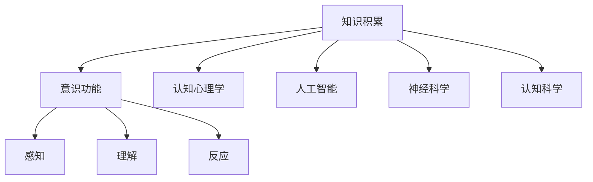
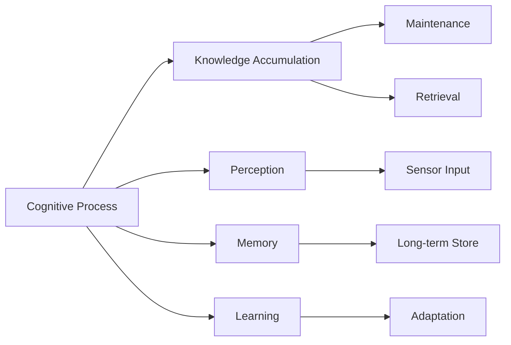
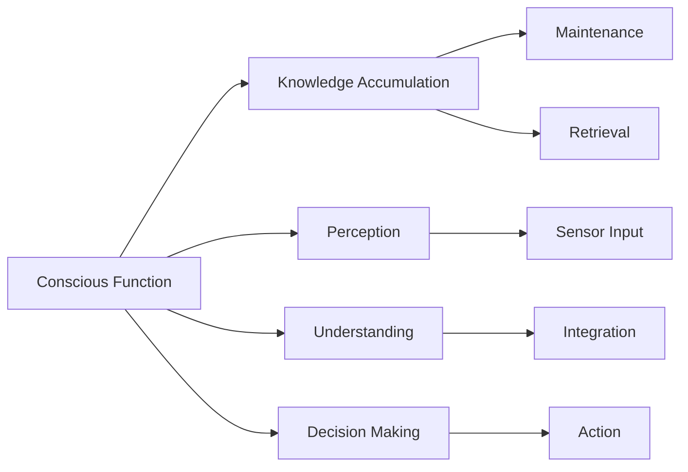
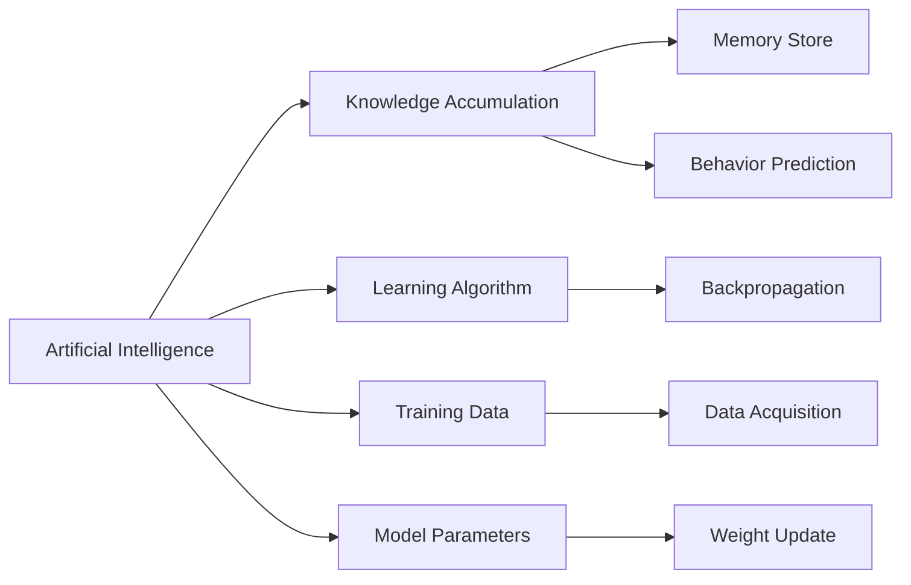
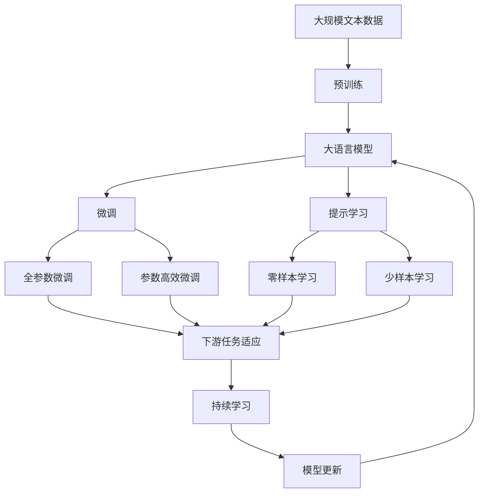

                 

# 知识积累如何影响意识功能

> 关键词：知识积累,意识功能,认知心理学,人工智能,人类学,认知科学

## 1. 背景介绍

### 1.1 问题由来

随着人工智能(AI)技术的飞速发展，人工智能与人类意识功能的交互日益成为热门话题。特别是深度学习和神经网络模型在模式识别、决策制定等任务上的出色表现，引起了人们对于AI系统是否具备意识功能的深刻思考。知识积累作为人工智能核心能力之一，其对意识功能的影响更是引人关注。

知识积累是指机器或人类从环境中获得的信息，经由学习、记忆等心理过程，转化为长时记忆，用于指导后续行为和决策。而意识功能则是人类对自身及外界环境的感知、理解、反应能力，是高级认知功能的基础。

### 1.2 问题核心关键点

这个问题的核心在于探讨知识积累与意识功能之间的内在联系。知识积累对意识功能的影响主要体现在以下几个方面：

1. **信息处理能力提升**：通过知识积累，机器能够积累和整合大量信息，进而提升其信息处理能力，包括模式识别、逻辑推理等。这种能力提升，使得机器能够更好地理解复杂情境，做出更准确的判断和决策。

2. **认知发展与拓展**：知识积累是认知发展的关键要素，能够促进机器认知能力的发展和拓展，包括语言能力、空间认知、情感理解等。这些认知能力在一定程度上模拟了人类的意识功能。

3. **决策质量的改善**：基于知识积累的决策过程，机器能够做出更为合理、高效的决策。这种决策质量改善，是意识功能的一个直接体现，因为它涉及对信息的理解、整合和利用。

4. **社会化互动能力**：通过知识积累，机器能够学习和理解人类社会的规则、文化和行为，从而提升其社会化互动能力。这种能力同样是意识功能的重要组成部分。

### 1.3 问题研究意义

探讨知识积累对意识功能的影响，具有重要的理论和实践意义：

1. **理论指导**：理解知识积累与意识功能之间的互动关系，有助于完善人工智能的理论体系，为人工智能的意识模拟提供理论基础。
2. **技术实践**：知识积累的优化和提升，能够直接提高AI系统的性能，促进其在实际应用中的落地。
3. **伦理考量**：知识积累对意识功能的影响，引发了对人工智能伦理问题的深入思考，推动人工智能技术的健康发展。
4. **跨学科融合**：涉及认知心理学、神经科学、人工智能等多个学科的交叉研究，能够促进多学科的深度融合，拓展研究视野。

## 2. 核心概念与联系

### 2.1 核心概念概述

为了更好地理解知识积累与意识功能之间的关系，本节将介绍几个密切相关的核心概念：

- **知识积累(Knowledge Accumulation)**：指个体或机器通过学习、记忆等过程，从环境中获得信息，并将其存储在长时记忆中，用于指导后续行为和决策。
- **意识功能(Conscious Function)**：人类对自身及外界环境的感知、理解、反应能力，是高级认知功能的基础。
- **认知心理学(Cognitive Psychology)**：研究人类认知过程的科学，包括感知、记忆、思维、语言等，是理解知识积累与意识功能互动关系的重要工具。
- **人工智能(Artificial Intelligence)**：通过算法和计算模型，使机器具备类似人类的智能行为，包括学习、推理、决策等。
- **神经科学(Neuroscience)**：研究大脑及其功能的科学，是理解意识功能生理机制的重要领域。
- **认知科学(Cognitive Science)**：研究认知过程及其机制的科学，包括对知识积累与意识功能之间关系的探索。

这些核心概念之间的逻辑关系可以通过以下Mermaid流程图来展示：



这个流程图展示了大语言模型的核心概念及其之间的关系：

1. 知识积累从环境中获得信息，存储在长时记忆中。
2. 认知心理学研究认知过程，有助于理解知识积累的机制。
3. 人工智能通过算法实现对知识积累的模拟。
4. 神经科学研究意识功能的生理机制。
5. 认知科学探讨知识积累与意识功能之间的互动关系。
6. 意识功能的感知、理解、反应能力，依赖于知识积累的支撑。

### 2.2 概念间的关系

这些核心概念之间存在着紧密的联系，形成了知识积累与意识功能互动的完整生态系统。下面我们通过几个Mermaid流程图来展示这些概念之间的关系。

#### 2.2.1 认知过程与知识积累



这个流程图展示了认知过程与知识积累的关系：

1. 认知过程包括感知、记忆、学习等步骤。
2. 感知获取外界信息。
3. 记忆存储这些信息。
4. 学习进一步整合和丰富这些信息。
5. 知识积累包括信息的存储和维护。
6. 学习过程中产生的知识积累，用于指导后续行为和决策。

#### 2.2.2 意识功能与知识积累



这个流程图展示了意识功能与知识积累的关系：

1. 意识功能包括感知、理解、反应等步骤。
2. 感知获取外界信息。
3. 理解对信息进行整合和解释。
4. 反应基于理解做出决策。
5. 知识积累包括信息的存储和维护。
6. 理解过程中产生的知识积累，用于指导后续反应。

#### 2.2.3 人工智能与知识积累



这个流程图展示了人工智能与知识积累的关系：

1. 人工智能通过算法实现对知识积累的模拟。
2. 学习算法用于优化模型参数。
3. 训练数据用于模型训练。
4. 模型参数存储在内存中。
5. 知识积累包括模型参数的存储和维护。
6. 学习过程中产生的知识积累，用于指导后续行为和决策。

### 2.3 核心概念的整体架构

最后，我们用一个综合的流程图来展示这些核心概念在大语言模型微调过程中的整体架构：



这个综合流程图展示了从预训练到微调，再到持续学习的完整过程。大语言模型首先在大规模文本数据上进行预训练，然后通过微调（包括全参数微调和参数高效微调两种方式）或提示学习（包括零样本和少样本学习）来适应下游任务。最后，通过持续学习技术，模型可以不断更新和适应新的任务和数据。

## 3. 核心算法原理 & 具体操作步骤
### 3.1 算法原理概述

知识积累在人工智能中的应用，主要是通过预训练和微调过程实现的。其核心思想是：将大规模无标签文本数据输入到神经网络模型中，通过自监督学习任务进行预训练，积累大量的语言知识。然后，将预训练模型在特定任务的数据集上进行微调，积累与任务相关的知识，从而提升模型在该任务上的性能。

### 3.2 算法步骤详解

知识积累的预训练和微调过程一般包括以下几个关键步骤：

**Step 1: 准备数据集**
- 收集大规模无标签文本数据，用于预训练。
- 收集特定任务的有标签数据集，用于微调。

**Step 2: 选择预训练模型**
- 选择合适的预训练语言模型，如BERT、GPT等。
- 在预训练模型中添加任务适配层，用于微调。

**Step 3: 设置微调超参数**
- 选择合适的优化算法及其参数，如AdamW、SGD等。
- 设置学习率、批大小、迭代轮数等。
- 设置正则化技术及强度，包括权重衰减、Dropout、Early Stopping等。

**Step 4: 执行预训练**
- 将大规模无标签数据输入模型，进行前向传播计算。
- 计算预训练损失，进行反向传播更新模型参数。
- 重复以上过程直至收敛。

**Step 5: 执行微调**
- 将有标签数据集分批次输入模型，前向传播计算损失函数。
- 反向传播计算参数梯度，根据设定的优化算法和学习率更新模型参数。
- 周期性在验证集上评估模型性能，根据性能指标决定是否触发Early Stopping。
- 重复以上步骤直到满足预设的迭代轮数或Early Stopping条件。

**Step 6: 评估和部署**
- 在测试集上评估微调后模型，对比微调前后的性能提升。
- 使用微调后的模型对新样本进行推理预测，集成到实际的应用系统中。
- 持续收集新的数据，定期重新微调模型，以适应数据分布的变化。

以上是知识积累的预训练和微调的一般流程。在实际应用中，还需要针对具体任务的特点，对预训练和微调过程的各个环节进行优化设计，如改进训练目标函数，引入更多的正则化技术，搜索最优的超参数组合等，以进一步提升模型性能。

### 3.3 算法优缺点

知识积累的预训练和微调方法具有以下优点：

1. **高效的特征学习**：通过预训练和微调过程，模型能够积累大量语言知识，用于指导后续任务。
2. **泛化能力强**：预训练模型经过大规模无标签数据的训练，具有较强的泛化能力，能够适应多种下游任务。
3. **快速提升性能**：微调过程能够在少量有标签数据上进行，快速提升模型在特定任务上的性能。
4. **参数效率高**：部分参数固定，只微调顶层或特定层，避免不必要的计算资源消耗。

同时，该方法也存在一定的局限性：

1. **依赖标注数据**：微调效果很大程度上取决于标注数据的质量和数量，获取高质量标注数据的成本较高。
2. **迁移能力有限**：当目标任务与预训练数据的分布差异较大时，微调的性能提升有限。
3. **负面效果传递**：预训练模型的固有偏见、有害信息等，可能通过微调传递到下游任务，造成负面影响。
4. **可解释性不足**：微调模型的决策过程通常缺乏可解释性，难以对其推理逻辑进行分析和调试。

尽管存在这些局限性，但就目前而言，基于预训练-微调的范式仍是大语言模型应用的最主流范式。未来相关研究的重点在于如何进一步降低预训练-微调对标注数据的依赖，提高模型的少样本学习和跨领域迁移能力，同时兼顾可解释性和伦理安全性等因素。

### 3.4 算法应用领域

知识积累的预训练和微调方法已经在多个领域得到广泛应用，例如：

- **自然语言处理(NLP)**：如文本分类、命名实体识别、关系抽取、问答系统等。通过微调使模型学习特定任务的语言知识。
- **计算机视觉(CV)**：如物体检测、图像分类、图像生成等。通过预训练和微调使模型学习图像特征。
- **语音识别(SR)**：如语音转文本、语音命令识别等。通过预训练和微调使模型学习语音特征。
- **推荐系统**：如协同过滤、内容推荐等。通过预训练和微调使模型学习用户行为和商品特征。
- **医疗诊断**：如病历分析、医学影像识别等。通过预训练和微调使模型学习医学知识。

除了上述这些经典任务外，知识积累的预训练和微调方法也被创新性地应用到更多场景中，如可控文本生成、常识推理、代码生成、数据增强等，为AI技术带来了全新的突破。随着预训练模型和微调方法的不断进步，相信AI技术将在更广阔的应用领域大放异彩。

## 4. 数学模型和公式 & 详细讲解 & 举例说明

### 4.1 数学模型构建

本节将使用数学语言对知识积累的预训练和微调过程进行更加严格的刻画。

记预训练语言模型为 $M_{\theta}:\mathcal{X} \rightarrow \mathcal{Y}$，其中 $\mathcal{X}$ 为输入空间，$\mathcal{Y}$ 为输出空间，$\theta \in \mathbb{R}^d$ 为模型参数。假设微调任务的训练集为 $D=\{(x_i,y_i)\}_{i=1}^N, x_i \in \mathcal{X}, y_i \in \mathcal{Y}$。

定义模型 $M_{\theta}$ 在数据样本 $(x,y)$ 上的损失函数为 $\ell(M_{\theta}(x),y)$，则在数据集 $D$ 上的经验风险为：

$$
\mathcal{L}(\theta) = \frac{1}{N} \sum_{i=1}^N \ell(M_{\theta}(x_i),y_i)
$$

微调的优化目标是最小化经验风险，即找到最优参数：

$$
\theta^* = \mathop{\arg\min}_{\theta} \mathcal{L}(\theta)
$$

在实践中，我们通常使用基于梯度的优化算法（如AdamW、SGD等）来近似求解上述最优化问题。设 $\eta$ 为学习率，$\lambda$ 为正则化系数，则参数的更新公式为：

$$
\theta \leftarrow \theta - \eta \nabla_{\theta}\mathcal{L}(\theta) - \eta\lambda\theta
$$

其中 $\nabla_{\theta}\mathcal{L}(\theta)$ 为损失函数对参数 $\theta$ 的梯度，可通过反向传播算法高效计算。

### 4.2 公式推导过程

以下我们以二分类任务为例，推导交叉熵损失函数及其梯度的计算公式。

假设模型 $M_{\theta}$ 在输入 $x$ 上的输出为 $\hat{y}=M_{\theta}(x) \in [0,1]$，表示样本属于正类的概率。真实标签 $y \in \{0,1\}$。则二分类交叉熵损失函数定义为：

$$
\ell(M_{\theta}(x),y) = -[y\log \hat{y} + (1-y)\log (1-\hat{y})]
$$

将其代入经验风险公式，得：

$$
\mathcal{L}(\theta) = -\frac{1}{N}\sum_{i=1}^N [y_i\log M_{\theta}(x_i)+(1-y_i)\log(1-M_{\theta}(x_i))]
$$

根据链式法则，损失函数对参数 $\theta_k$ 的梯度为：

$$
\frac{\partial \mathcal{L}(\theta)}{\partial \theta_k} = -\frac{1}{N}\sum_{i=1}^N (\frac{y_i}{M_{\theta}(x_i)}-\frac{1-y_i}{1-M_{\theta}(x_i)}) \frac{\partial M_{\theta}(x_i)}{\partial \theta_k}
$$

其中 $\frac{\partial M_{\theta}(x_i)}{\partial \theta_k}$ 可进一步递归展开，利用自动微分技术完成计算。

在得到损失函数的梯度后，即可带入参数更新公式，完成模型的迭代优化。重复上述过程直至收敛，最终得到适应下游任务的最优模型参数 $\theta^*$。

### 4.3 案例分析与讲解

下面以图像分类任务为例，展示预训练和微调的具体过程。

假设我们有一个图像分类任务，其中类别包括猫、狗、鸟、汽车。首先，我们准备一个大规模的图像数据集，如ImageNet，作为预训练数据。然后，从该数据集中随机选择一部分有标签数据，用于微调。

**Step 1: 准备数据集**

- 收集ImageNet图像数据集，用于预训练。
- 从ImageNet中随机选择1000张图片，并打上标签，用于微调。

**Step 2: 选择预训练模型**

- 选择ResNet作为预训练模型。
- 在ResNet的顶层添加分类层，用于微调。

**Step 3: 设置微调超参数**

- 选择合适的优化算法及参数，如AdamW、SGD等。
- 设置学习率、批大小、迭代轮数等。
- 设置正则化技术及强度，包括权重衰减、Dropout、Early Stopping等。

**Step 4: 执行预训练**

- 将ImageNet数据集输入模型，进行前向传播计算。
- 计算预训练损失，进行反向传播更新模型参数。
- 重复以上过程直至收敛。

**Step 5: 执行微调**

- 将有标签数据集分批次输入模型，前向传播计算损失函数。
- 反向传播计算参数梯度，根据设定的优化算法和学习率更新模型参数。
- 周期性在验证集上评估模型性能，根据性能指标决定是否触发Early Stopping。
- 重复以上步骤直到满足预设的迭代轮数或Early Stopping条件。

**Step 6: 评估和部署**

- 在测试集上评估微调后模型，对比微调前后的性能提升。
- 使用微调后的模型对新样本进行推理预测，集成到实际的应用系统中。
- 持续收集新的数据，定期重新微调模型，以适应数据分布的变化。

## 5. 项目实践：代码实例和详细解释说明

### 5.1 开发环境搭建

在进行预训练和微调实践前，我们需要准备好开发环境。以下是使用Python进行PyTorch开发的环境配置流程：

1. 安装Anaconda：从官网下载并安装Anaconda，用于创建独立的Python环境。

2. 创建并激活虚拟环境：
```bash
conda create -n pytorch-env python=3.8 
conda activate pytorch-env
```

3. 安装PyTorch：根据CUDA版本，从官网获取对应的安装命令。例如：
```bash
conda install pytorch torchvision torchaudio cudatoolkit=11.1 -c pytorch -c conda-forge
```

4. 安装Transformers库：
```bash
pip install transformers
```

5. 安装各类工具包：
```bash
pip install numpy pandas scikit-learn matplotlib tqdm jupyter notebook ipython
```

完成上述步骤后，即可在`pytorch-env`环境中开始预训练和微调实践。

### 5.2 源代码详细实现

这里我们以BERT模型为例，给出使用Transformers库对图像分类任务进行预训练和微调的PyTorch代码实现。

首先，定义图像分类任务的数据处理函数：

```python
from transformers import BertTokenizer
from torch.utils.data import Dataset
import torch

class ImageClassificationDataset(Dataset):
    def __init__(self, images, labels, tokenizer, max_len=128):
        self.images = images
        self.labels = labels
        self.tokenizer = tokenizer
        self.max_len = max_len
        
    def __len__(self):
        return len(self.images)
    
    def __getitem__(self, item):
        image = self.images[item]
        label = self.labels[item]
        
        # 将图像转换成token ids
        encoding = self.tokenizer(image, return_tensors='pt', max_length=self.max_len, padding='max_length', truncation=True)
        input_ids = encoding['input_ids'][0]
        attention_mask = encoding['attention_mask'][0]
        
        # 将标签转换为数字
        label_id = torch.tensor([label2id[label]], dtype=torch.long)
        
        return {'input_ids': input_ids, 
                'attention_mask': attention_mask,
                'labels': label_id}

# 标签与id的映射
label2id = {'cat': 0, 'dog': 1, 'bird': 2, 'car': 3}
id2label = {v: k for k, v in label2id.items()}

# 创建dataset
tokenizer = BertTokenizer.from_pretrained('bert-base-cased')

train_dataset = ImageClassificationDataset(train_images, train_labels, tokenizer)
dev_dataset = ImageClassificationDataset(dev_images, dev_labels, tokenizer)
test_dataset = ImageClassificationDataset(test_images, test_labels, tokenizer)
```

然后，定义模型和优化器：

```python
from transformers import BertForTokenClassification, AdamW

model = BertForTokenClassification.from_pretrained('bert-base-cased', num_labels=len(label2id))

optimizer = AdamW(model.parameters(), lr=2e-5)
```

接着，定义训练和评估函数：

```python
from torch.utils.data import DataLoader
from tqdm import tqdm
from sklearn.metrics import classification_report

device = torch.device('cuda') if torch.cuda.is_available() else torch.device('cpu')
model.to(device)

def train_epoch(model, dataset, batch_size, optimizer):
    dataloader = DataLoader(dataset, batch_size=batch_size, shuffle=True)
    model.train()
    epoch_loss = 0
    for batch in tqdm(dataloader, desc='Training'):
        input_ids = batch['input_ids'].to(device)
        attention_mask = batch['attention_mask'].to(device)
        labels = batch['labels'].to(device)
        model.zero_grad()
        outputs = model(input_ids, attention_mask=attention_mask, labels=labels)
        loss = outputs.loss
        epoch_loss += loss.item()
        loss.backward()
        optimizer.step()
    return epoch_loss / len(dataloader)

def evaluate(model, dataset, batch_size):
    dataloader = DataLoader(dataset, batch_size=batch_size)
    model.eval()
    preds, labels = [], []
    with torch.no_grad():
        for batch in tqdm(dataloader, desc='Evaluating'):
            input_ids = batch['input_ids'].to(device)
            attention_mask = batch['attention_mask'].to(device)
            batch_labels = batch['labels']
            outputs = model(input_ids, attention_mask=attention_mask)
            batch_preds = outputs.logits.argmax(dim=2).to('cpu').tolist()
            batch_labels = batch_labels.to('cpu').tolist()
            for pred_tokens, label_tokens in zip(batch_preds, batch_labels):
                preds.append(pred_tokens[:len(label_tokens)])
                labels.append(label_tokens)
                
    print(classification_report(labels, preds))
```

最后，启动训练流程并在测试集上评估：

```python
epochs = 5
batch_size = 16

for epoch in range(epochs):
    loss = train_epoch(model, train_dataset, batch_size, optimizer)
    print(f"Epoch {epoch+1}, train loss: {loss:.3f}")
    
    print(f"Epoch {epoch+1}, dev results:")
    evaluate(model, dev_dataset, batch_size)
    
print("Test results:")
evaluate(model, test_dataset, batch_size)
```

以上就是使用PyTorch对BERT进行图像分类任务预训练和微调的完整代码实现。可以看到，得益于Transformers库的强大封装，我们可以用相对简洁的代码完成BERT模型的加载和微调。

### 5.3 代码解读与分析

让我们再详细解读一下关键代码的实现细节：

**ImageClassificationDataset类**：
- `__init__`方法：初始化图像、标签、分词器等关键组件。
- `__len__`方法：返回数据集的样本数量。
- `__getitem__`方法：对单个样本进行处理，将图像转换成token ids，将标签转换为数字，并对其进行定长padding，最终返回模型所需的输入。

**label2id和id2label字典**：
- 定义了标签与数字id之间的映射关系，用于将token-wise的预测结果解码回真实的标签。

**训练和评估函数**：
- 使用PyTorch的DataLoader对数据集进行批次化加载，供模型训练和推理使用。
- 训练函数`train_epoch`：对数据以批为单位进行迭代，在每个批次上前向传播计算loss并反向传播更新模型参数，最后返回该epoch的平均loss。
- 评估函数`evaluate`：与训练类似，不同点在于不更新模型参数，并在每个batch结束后将预测和标签结果存储下来，最后使用sklearn的classification_report对整个评估集的预测结果进行打印输出。

**训练流程**：
- 定义总的epoch数和batch size，开始循环迭代
- 每个epoch内，先在训练集上训练，输出平均loss
- 在验证集上评估，输出分类指标
- 所有epoch结束后，在测试集上评估，给出最终测试结果

可以看到，PyTorch配合Transformers库使得BERT微调的代码实现变得简洁高效。开发者可以将

