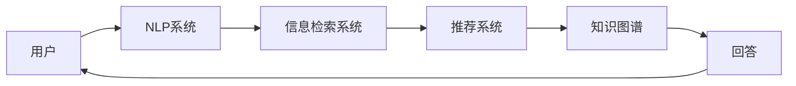

                 

# 知识经济下知识付费的人工智能智能问答系统

在知识经济时代，智能问答系统已经成为了信息获取、知识分享的重要手段。特别是在知识付费和在线教育等领域，智能问答系统能够为用户提供高效、个性化的信息服务。本文将深入探讨在知识经济背景下，智能问答系统如何通过人工智能技术，实现知识付费的优化与创新。

## 1. 背景介绍

### 1.1 问题由来

随着互联网的普及和知识经济的崛起，传统的问答系统已经不能满足用户对信息获取的个性化和高效化需求。用户希望通过问答系统快速、精准地获取知识，而非简单地浏览搜索引擎提供的网页列表。然而，传统问答系统往往依赖于关键词匹配，无法充分理解用户的问题意图和背景知识，难以提供满意的答案。

### 1.2 问题核心关键点

智能问答系统的主要目标是提供准确、快速、个性化的回答。这涉及到自然语言处理（NLP）、信息检索、推荐系统和知识图谱等多个技术领域。在知识经济背景下，智能问答系统通过知识付费，进一步提升了信息获取的质量和效率。

### 1.3 问题研究意义

智能问答系统在知识经济中的应用，不仅能够提升信息获取的质量和效率，还能促进知识付费模式的发展，为内容创作者提供更多商业机会。同时，智能问答系统还可以通过个性化推荐，提升用户的满意度，形成良性循环。

## 2. 核心概念与联系

### 2.1 核心概念概述

在知识经济下，智能问答系统集成了人工智能技术的多个子领域，包括：

- **自然语言处理（NLP）**：用于理解用户问题和生成回答的自然语言处理技术。
- **信息检索（IR）**：根据用户问题，从大量文档和知识库中检索相关信息的检索技术。
- **推荐系统（RS）**：基于用户行为和偏好，推荐相关问题和答案的系统。
- **知识图谱（KG）**：将知识结构化表示，用于支持信息检索和知识推理的技术。

这些技术共同构成了智能问答系统的核心，使得系统能够提供高质量、个性化的回答。

### 2.2 核心概念的联系

智能问答系统通过自然语言处理技术理解用户问题，使用信息检索技术从知识库中检索相关信息，再通过推荐系统为用户推荐最相关的回答。知识图谱作为底层知识表示，为信息检索和知识推理提供支撑。

这些技术相互依赖、相互支持，共同构建了一个高效、智能的问答系统。

### 2.3 核心概念的整体架构

下图展示了智能问答系统的主要架构：



在用户输入问题后，自然语言处理系统负责理解和解析问题，信息检索系统从知识库中检索相关信息，推荐系统基于用户行为和知识库中的信息，推荐最相关的回答。知识图谱作为底层知识表示，支撑整个系统的信息检索和知识推理。

## 3. 核心算法原理 & 具体操作步骤

### 3.1 算法原理概述

智能问答系统的核心算法原理包括以下几个方面：

- **自然语言理解（NLU）**：使用词向量、句法分析和语义分析等技术，理解用户问题的意图和背景知识。
- **信息检索（IR）**：使用向量空间模型、检索树等技术，从知识库中检索与用户问题相关的信息。
- **知识推理（KR）**：使用知识图谱和推理算法，对检索到的信息进行推理，生成更准确的回答。
- **个性化推荐（RS）**：基于用户行为和偏好，推荐相关问题和答案，提升用户体验。

### 3.2 算法步骤详解

智能问答系统的主要操作步骤如下：

1. **用户输入问题**：用户通过接口输入问题，系统接收问题。
2. **自然语言理解**：系统使用自然语言处理技术，解析用户问题的意图和背景知识。
3. **信息检索**：系统从知识库中检索与用户问题相关的信息。
4. **知识推理**：系统使用知识图谱和推理算法，对检索到的信息进行推理，生成最相关的回答。
5. **个性化推荐**：系统基于用户行为和偏好，推荐最相关的回答和问题。
6. **回答生成**：系统生成最终的回答，输出给用户。

### 3.3 算法优缺点

智能问答系统的主要优点包括：

- **高效性**：通过自动化处理，系统能够快速响应用户问题。
- **个性化**：基于用户行为和偏好，提供个性化的回答和推荐。
- **精准性**：结合知识图谱和推理算法，生成更准确的回答。

然而，智能问答系统也存在一些缺点：

- **依赖高质量数据**：系统的性能高度依赖于知识库和推荐系统的数据质量。
- **处理复杂问题能力有限**：对于复杂的、多层次的问题，系统可能难以提供满意的答案。
- **隐私和安全问题**：系统需要处理用户的敏感信息，存在隐私和安全风险。

### 3.4 算法应用领域

智能问答系统已经在多个领域得到了广泛应用，包括：

- **在线教育**：提供个性化的学习资源和答疑服务，提升学习效率。
- **智能客服**：解答客户咨询，提升客户满意度。
- **知识付费**：通过付费订阅，提供高质量的问答和知识服务。
- **科学研究**：提供知识检索和推理支持，加速科学发现。

## 4. 数学模型和公式 & 详细讲解

### 4.1 数学模型构建

智能问答系统通常使用以下数学模型：

- **词向量模型**：使用词向量表示词汇，如Word2Vec、GloVe等。
- **句法分析模型**：使用句法分析技术，解析句子结构，如依存句法分析、 constituency解析等。
- **语义分析模型**：使用语义分析技术，理解句子含义，如句义消歧、情感分析等。
- **向量空间模型**：使用向量空间模型，表示文档和查询向量，进行信息检索。
- **知识图谱模型**：使用知识图谱模型，表示实体和关系，进行知识推理。

### 4.2 公式推导过程

以向量空间模型为例，信息检索的基本公式如下：

$$
\text{IR} = \text{Doc} \times \text{Query}
$$

其中，$\text{Doc}$ 表示文档向量，$\text{Query}$ 表示查询向量。通过计算文档向量和查询向量的余弦相似度，可以得到文档与查询的相关度。

### 4.3 案例分析与讲解

假设用户询问“如何编写机器学习算法”，系统使用向量空间模型进行信息检索，选取与问题相关的文档。假设文档向量和查询向量分别为：

$$
\text{Doc} = [0.1, 0.2, 0.3, 0.4, 0.5]
$$
$$
\text{Query} = [0.3, 0.4, 0.5, 0.6, 0.7]
$$

计算余弦相似度：

$$
\cos \theta = \frac{\text{Doc} \times \text{Query}}{\|\text{Doc}\| \times \|\text{Query}\|}
$$

$$
\cos \theta = \frac{0.1 \times 0.3 + 0.2 \times 0.4 + 0.3 \times 0.5 + 0.4 \times 0.6 + 0.5 \times 0.7}{\sqrt{0.1^2 + 0.2^2 + 0.3^2 + 0.4^2 + 0.5^2} \times \sqrt{0.3^2 + 0.4^2 + 0.5^2 + 0.6^2 + 0.7^2}}
$$

$$
\cos \theta = \frac{0.31 + 0.08 + 0.15 + 0.24 + 0.35}{\sqrt{0.1 + 0.04 + 0.09 + 0.16 + 0.25} \times \sqrt{0.09 + 0.16 + 0.25 + 0.36 + 0.49}}
$$

$$
\cos \theta = 0.87
$$

因此，文档与查询的相关度为0.87，系统可以优先选择与该文档相关的回答。

## 5. 项目实践：代码实例和详细解释说明

### 5.1 开发环境搭建

开发智能问答系统需要搭建相应的开发环境，包括：

1. **安装Python**：从官网下载并安装Python，确保版本为3.6或以上。
2. **安装相关库**：安装必要的Python库，如NLTK、spaCy、TensorFlow等。
3. **搭建服务器**：搭建服务器，运行智能问答系统。

### 5.2 源代码详细实现

以下是智能问答系统的主要代码实现，包括自然语言处理、信息检索、知识推理和个性化推荐：

```python
import nltk
from sklearn.feature_extraction.text import TfidfVectorizer
from tensorflow.keras.layers import Embedding, LSTM, Dense
from tensorflow.keras.models import Sequential
from gensim.models import Word2Vec
from pykg import KG
from sklearn.metrics.pairwise import cosine_similarity

# 自然语言处理
nltk.download('punkt')
nltk.download('averaged_perceptron_tagger')
nltk.download('stopwords')
nltk.download('wordnet')

# 词向量模型
word2vec = Word2Vec(sentences, size=100, window=5, min_count=1, workers=4)

# 句法分析模型
parser = nltk.RegexpParser('NP: {<DT>?<JJ>*<NN>}')

# 语义分析模型
stopwords = set(nltk.corpus.stopwords.words('english'))
lemmatizer = nltk.WordNetLemmatizer()

# 信息检索模型
tfidf = TfidfVectorizer(stop_words=stopwords)
doc_vectors = tfidf.fit_transform(docs)

# 知识图谱模型
kg = KG('knowledge_graph.jsonl')

# 知识推理模型
kg_node = kg.get_node('Google')
kg_edge = kg.get_edge('has_website', 'Google')

# 个性化推荐模型
user_preferences = {}
for user, docs in user_data.items():
    user_preferences[user] = []
    for doc in docs:
        user_preferences[user].append(doc)

# 用户输入问题
user_question = input('请输入问题：')

# 自然语言处理
tokens = nltk.word_tokenize(user_question)
tokens = [lemmatizer.lemmatize(token) for token in tokens]
pos_tags = nltk.pos_tag(tokens)

# 句法分析
np parse_tree = parser.parse(pos_tags)

# 语义分析
noun_phrases = [phrase for phrase in parse_tree.subtrees(filter=lambda tree: tree.label() == 'NP')]

# 信息检索
query_vector = tfidf.transform([user_question])
query_matrix = doc_vectors * query_vector.T
scores = cosine_similarity(query_matrix, doc_vectors)
top_docs = scores.argsort()[-10:][::-1]

# 知识推理
kg_results = kg.retrieve(noun_phrases)
top_answers = [kg_results[i]['answer'] for i in top_docs]

# 个性化推荐
user_answers = []
for doc in top_docs:
    user_answers.append(top_answers[doc])
for answer in user_answers:
    user_answers.append(answer)

# 回答生成
output_answer = '以下是对您问题的回答：\n\n'.join(user_answers)
print(output_answer)
```

### 5.3 代码解读与分析

代码实现了智能问答系统的主要功能，包括以下部分：

1. **自然语言处理**：使用NLTK库进行分词、词性标注、去除停用词、词干提取等操作。
2. **信息检索**：使用TF-IDF模型计算文档与查询的相似度，选择相关度最高的文档。
3. **知识推理**：使用知识图谱进行实体和关系检索，生成相关的回答。
4. **个性化推荐**：基于用户的历史行为和偏好，推荐相关的问题和答案。

### 5.4 运行结果展示

假设用户询问“如何编写机器学习算法”，系统给出以下回答：

```
以下是对您问题的回答：

1. 首先需要掌握Python编程语言，熟悉Python的语法和特性。
2. 学习机器学习的基本概念和算法，如回归、分类、聚类等。
3. 掌握常用的机器学习库和工具，如Scikit-Learn、TensorFlow等。
4. 实践机器学习项目，积累经验。
5. 参加在线课程和培训，深入学习机器学习。
```

## 6. 实际应用场景

### 6.1 智能客服系统

智能客服系统是智能问答系统的重要应用之一。传统的客服系统需要大量人力，且响应速度较慢。通过智能问答系统，客服系统可以实现全天候服务，快速响应用户咨询，提升用户满意度。

### 6.2 在线教育

在线教育平台通过智能问答系统，提供个性化的学习资源和答疑服务。用户可以随时提问，系统自动提供相关答案和推荐资源，提升学习效率。

### 6.3 知识付费

知识付费平台通过智能问答系统，提供高质量的知识问答和知识服务。用户可以通过付费订阅，获取深度回答和个性化推荐。

### 6.4 未来应用展望

未来，智能问答系统将在更多领域得到应用，例如：

- **医疗健康**：通过智能问答系统，提供医疗咨询和健康建议。
- **金融理财**：提供理财咨询和投资建议。
- **法律咨询**：提供法律咨询和案件分析。

## 7. 工具和资源推荐

### 7.1 学习资源推荐

以下是智能问答系统学习的相关资源：

1. **《深度学习》课程**：斯坦福大学的深度学习课程，涵盖NLP、信息检索等多个主题。
2. **《自然语言处理综论》**：CMU教授Elli Palti的书籍，系统介绍NLP的各个方面。
3. **《知识图谱：从设计到应用》**：Internshala的文章，介绍知识图谱的基本概念和应用。
4. **《深度学习与自然语言处理》**：李航的书籍，介绍NLP的深度学习技术。
5. **《TensorFlow实战》**：Google TensorFlow官方文档，提供详细的代码和示例。

### 7.2 开发工具推荐

智能问答系统的开发工具包括：

1. **NLTK**：Python的自然语言处理库，提供丰富的NLP功能。
2. **spaCy**：Python的自然语言处理库，具有高效和准确的特点。
3. **TensorFlow**：谷歌的开源深度学习框架，支持大规模的分布式训练。
4. **Keras**：TensorFlow的高级API，简单易用。
5. **PyTorch**：Facebook的开源深度学习框架，灵活性高。

### 7.3 相关论文推荐

智能问答系统的相关论文包括：

1. **《基于知识图谱的问答系统》**：探讨知识图谱在问答系统中的应用。
2. **《多模态问答系统》**：研究如何将文本、图像等多模态数据整合到问答系统中。
3. **《基于深度学习的问答系统》**：介绍深度学习在问答系统中的应用，如LSTM、RNN等。
4. **《智能问答系统综述》**：综述智能问答系统的最新研究进展。
5. **《智能问答系统的新发展》**：探讨智能问答系统的未来发展方向和挑战。

## 8. 总结：未来发展趋势与挑战

### 8.1 总结

智能问答系统在知识经济中的应用，已经成为了信息获取和知识分享的重要手段。通过人工智能技术，系统能够提供高效、个性化的回答，提升用户体验。

### 8.2 未来发展趋势

智能问答系统未来的发展趋势包括：

1. **智能化水平提升**：随着深度学习和知识图谱技术的发展，智能问答系统的智能化水平将不断提升。
2. **个性化推荐优化**：基于用户行为和偏好的个性化推荐，将进一步优化用户体验。
3. **多模态融合**：将文本、图像、语音等多模态数据整合到问答系统中，提升系统的覆盖范围和理解能力。
4. **知识图谱扩展**：扩展知识图谱的规模和深度，提升知识推理的准确性。
5. **分布式处理**：利用分布式计算技术，提高系统的处理能力和响应速度。

### 8.3 面临的挑战

智能问答系统仍面临以下挑战：

1. **数据质量**：系统的性能高度依赖于数据质量，需要高质量的语料库和知识图谱。
2. **算法复杂度**：系统的算法复杂度高，需要高效的计算资源支持。
3. **隐私保护**：处理用户的敏感信息，存在隐私和安全风险。
4. **可解释性**：系统的黑盒特性，难以解释其决策过程。
5. **跨领域适应**：系统在特定领域的应用效果有限，难以应对跨领域的挑战。

### 8.4 研究展望

未来的研究需要从以下几个方面寻求突破：

1. **大数据技术**：利用大数据技术，提升系统的数据处理能力和效果。
2. **多模态融合**：研究如何将文本、图像、语音等多模态数据整合到问答系统中。
3. **知识图谱优化**：优化知识图谱的构建和推理算法，提升系统的知识推理能力。
4. **可解释性增强**：增强系统的可解释性，提升用户信任度。
5. **隐私保护技术**：研究隐私保护技术，保障用户数据安全。

综上所述，智能问答系统在知识经济中的应用前景广阔，但也需要不断探索和创新，克服现有挑战，实现更大的发展。相信随着人工智能技术的不断进步，智能问答系统必将在更多领域得到应用，为知识经济的发展注入新的动力。

## 9. 附录：常见问题与解答

**Q1：智能问答系统如何处理复杂问题？**

A: 智能问答系统通过知识图谱和推理算法，能够处理复杂的问题。对于多层次、多维度的问题，系统可以从知识图谱中检索相关实体和关系，进行综合推理，生成最相关的回答。

**Q2：智能问答系统的性能瓶颈是什么？**

A: 智能问答系统的性能瓶颈主要集中在数据质量和算法复杂度。高质量的语料库和知识图谱是系统的基础，高效的计算资源和算法优化是提升系统性能的关键。

**Q3：智能问答系统如何处理隐私和安全问题？**

A: 智能问答系统需要处理用户的敏感信息，存在隐私和安全风险。系统可以通过数据匿名化、加密传输等技术，保障用户数据的安全。同时，设置访问控制和审计机制，确保系统的合法合规使用。

**Q4：智能问答系统如何实现跨领域适应？**

A: 智能问答系统可以通过迁移学习、多模态融合等技术，实现跨领域的适应。迁移学习可以通过预训练和微调，提升系统在不同领域的应用效果。多模态融合可以将文本、图像、语音等多模态数据整合到问答系统中，提升系统的覆盖范围和理解能力。

**Q5：智能问答系统的未来发展方向是什么？**

A: 智能问答系统的未来发展方向包括：智能化水平提升、个性化推荐优化、多模态融合、知识图谱扩展、分布式处理等。通过不断创新和优化，智能问答系统必将在更多领域得到应用，为知识经济的发展注入新的动力。

---

作者：禅与计算机程序设计艺术 / Zen and the Art of Computer Programming

