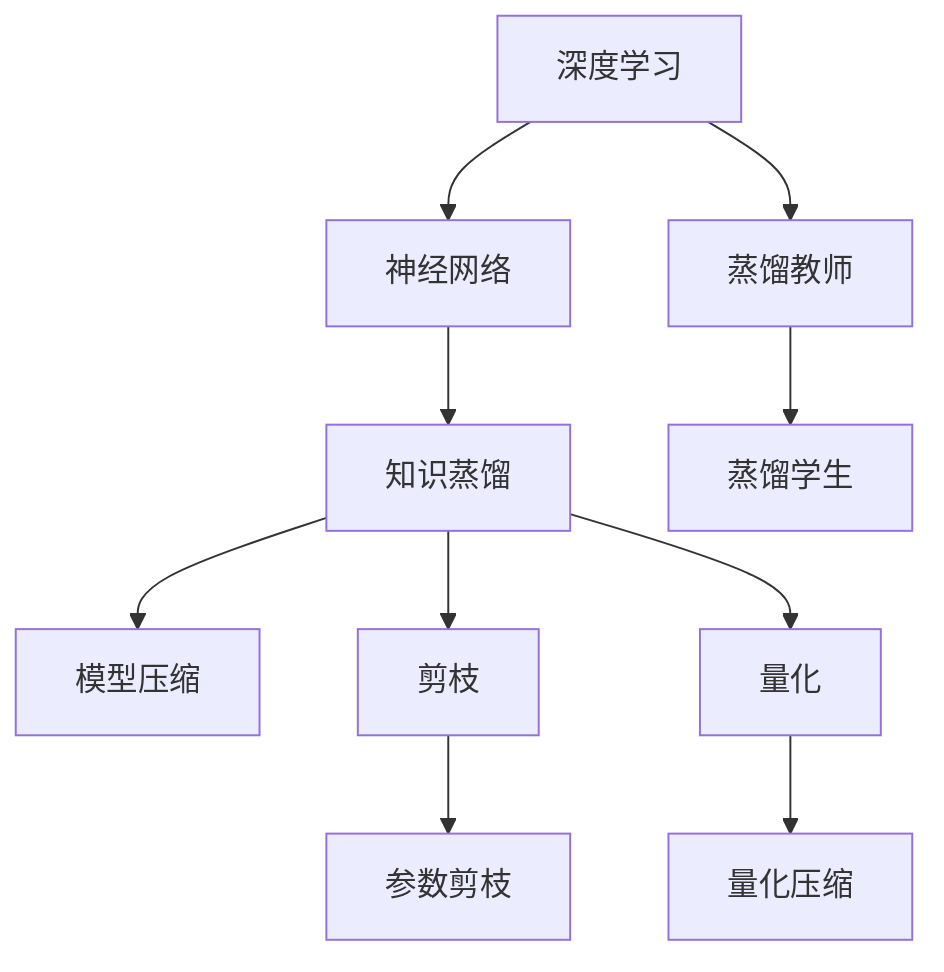
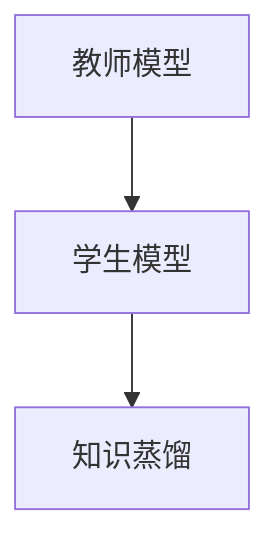
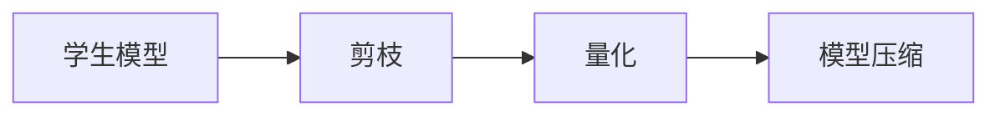
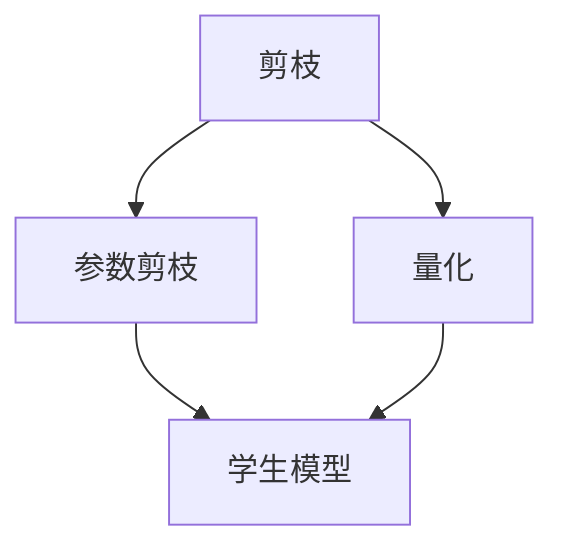
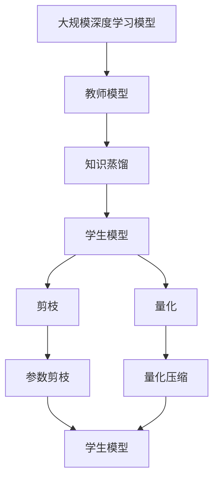

                 

# 知识蒸馏与模型压缩原理与代码实战案例讲解

> 关键词：知识蒸馏,模型压缩,蒸馏教师,知识蒸馏算法,模型压缩技术,蒸馏因子,剪枝,量化,深度学习,AI模型优化

## 1. 背景介绍

### 1.1 问题由来
在深度学习模型设计中，模型参数数量和计算量直接影响模型的性能与效率。随着深度学习的发展，模型变得越来越大，参数数量和计算量也在不断增加，这不仅导致模型训练时间变长、存储开销增大，还增加了模型在实际应用中的部署复杂度和成本。因此，模型压缩和优化技术成为深度学习研究中的一个重要方向，旨在通过减少模型参数和计算量，提升模型性能，降低模型部署和使用成本。

知识蒸馏（Knowledge Distillation）和模型压缩（Model Compression）是当前模型优化领域的两个重要方向。知识蒸馏主要通过训练较小的学生模型（Student Model）以学习大型教师模型（Teacher Model）的知识，从而在保持较高性能的前提下大幅减少模型参数。而模型压缩则主要通过剪枝、量化等方法对模型进行优化，进一步降低模型大小和计算复杂度。

本文章将详细探讨知识蒸馏和模型压缩的原理、算法及实战案例，并分析其在实际应用中的优势与挑战。

### 1.2 问题核心关键点
知识蒸馏和模型压缩的核心关键点在于：

- **知识蒸馏**：通过让学生模型学习教师模型的知识，从而在保持性能不变或微弱下降的前提下，显著减小模型参数和计算量。
- **模型压缩**：通过对模型进行剪枝、量化等操作，在保持模型性能不变的情况下，大幅减小模型大小和计算复杂度。

## 2. 核心概念与联系

### 2.1 核心概念概述

为更好地理解知识蒸馏和模型压缩，本节将介绍几个密切相关的核心概念：

- **知识蒸馏**：将大型教师模型的知识蒸馏到小型学生模型中，使学生模型能够学习教师模型的知识，并在特定任务上取得良好性能。
- **模型压缩**：通过剪枝、量化等方法，减少模型参数和计算量，优化模型结构，提升模型效率。
- **蒸馏教师**：大型预训练模型，如BERT、GPT等，其知识蒸馏给学生模型。
- **蒸馏学生**：小型模型，如MobileNet、ResNet等，通过知识蒸馏学习教师模型的知识。
- **蒸馏因子**：知识蒸馏过程中的参数调节因子，用于控制学生模型与教师模型之间的知识传递量。
- **剪枝**：删除模型中对模型性能影响不大的参数，减少模型大小和计算量。
- **量化**：将模型参数从高精度（如32位浮点）转换为低精度（如8位整数），从而减小模型存储空间和计算复杂度。
- **深度学习**：利用神经网络模型进行训练和推理，处理复杂数据任务的机器学习技术。
- **AI模型优化**：通过优化模型结构、参数、计算量等手段，提升模型性能和效率。

这些核心概念之间的逻辑关系可以通过以下Mermaid流程图来展示：



这个流程图展示了大规模深度学习模型的知识蒸馏和模型压缩的基本流程。首先，深度学习模型作为神经网络应用到各类任务中。在知识蒸馏过程中，教师模型将知识传递给学生模型，从而得到性能优异且参数较小的学生模型。在模型压缩过程中，通过剪枝和量化等技术，进一步减小学生模型的参数和计算量，提升模型效率。

### 2.2 概念间的关系

这些核心概念之间存在着紧密的联系，形成了知识蒸馏和模型压缩的完整生态系统。下面我们通过几个Mermaid流程图来展示这些概念之间的关系。

#### 2.2.1 知识蒸馏的基本流程



这个流程图展示了知识蒸馏的基本流程：教师模型将知识传递给学生模型，从而得到性能优异且参数较小的学生模型。

#### 2.2.2 模型压缩的步骤



这个流程图展示了模型压缩的基本步骤：通过剪枝和量化等技术，进一步减小学生模型的参数和计算量，提升模型效率。

#### 2.2.3 剪枝与量化在知识蒸馏中的应用



这个流程图展示了剪枝和量化在知识蒸馏中的应用：通过参数剪枝和量化，减少学生模型的参数和计算量，从而提升模型效率。

### 2.3 核心概念的整体架构

最后，我们用一个综合的流程图来展示这些核心概念在大规模深度学习模型知识蒸馏和模型压缩的完整过程中，它们的相互关系和作用：



这个综合流程图展示了从大规模深度学习模型到学生模型的知识蒸馏流程，再到通过剪枝和量化进行模型压缩的全过程。通过这些步骤，可以显著减少模型参数和计算量，同时保持模型的性能。

## 3. 核心算法原理 & 具体操作步骤
### 3.1 算法原理概述

知识蒸馏和模型压缩是深度学习模型优化中的两个重要方向。它们的基本原理如下：

**知识蒸馏**：通过训练较小的学生模型以学习大型教师模型的知识，从而在保持较高性能的前提下大幅减少模型参数。知识蒸馏的数学原理主要基于熵最小化准则，即通过最小化学生模型和教师模型之间的熵差异，来传递教师模型的知识。

**模型压缩**：通过剪枝、量化等方法对模型进行优化，进一步降低模型大小和计算复杂度。剪枝和量化是模型压缩的主要手段，它们通过减少模型中的冗余参数和减少计算复杂度，从而实现模型压缩。

### 3.2 算法步骤详解

**知识蒸馏的步骤**：

1. **选择教师模型**：选择一个预训练的教师模型，如BERT、GPT等。
2. **选择学生模型**：选择一个小型模型作为学生模型，如MobileNet、ResNet等。
3. **定义蒸馏目标**：定义蒸馏目标函数，如分类准确率、预测熵等。
4. **训练学生模型**：使用教师模型的预测作为标签，训练学生模型，使其学习教师模型的知识。
5. **评估学生模型**：在特定任务上评估学生模型的性能，确保学生模型学习到教师模型的知识。

**模型压缩的步骤**：

1. **剪枝**：通过剪枝算法（如Pruning、Structured Pruning等）删除模型中对模型性能影响不大的参数。
2. **量化**：通过量化算法（如Weight Quantization、Activation Quantization等）将模型参数从高精度转换为低精度。
3. **验证模型**：在特定任务上验证模型性能，确保模型压缩不导致性能下降。
4. **优化模型**：通过剪枝和量化后的模型进行进一步的优化，如Fusion、DSP等。

### 3.3 算法优缺点

**知识蒸馏的优点**：

- 保持性能不变：通过知识蒸馏，学生模型可以学习教师模型的知识，从而保持高性能。
- 减少参数量：知识蒸馏可以大幅减少模型的参数量，从而降低计算复杂度和存储开销。
- 易于实现：知识蒸馏的实现方法较为简单，适合在小型模型上应用。

**知识蒸馏的缺点**：

- 依赖教师模型：知识蒸馏依赖于预训练的教师模型，教师模型的选择对知识蒸馏的效果有重要影响。
- 训练成本高：知识蒸馏需要大量的训练数据和计算资源，特别是在蒸馏因子较大时，训练成本较高。
- 模型泛化能力有限：知识蒸馏可能导致模型泛化能力下降，特别是在数据分布变化较大时。

**模型压缩的优点**：

- 减少计算量：剪枝和量化等方法可以显著减少模型的计算量，提升推理速度。
- 降低存储开销：通过减少模型参数和计算量，降低模型的存储开销，方便模型部署和使用。
- 适用性广：模型压缩技术适用于各类深度学习模型，不局限于特定任务。

**模型压缩的缺点**：

- 性能损失：剪枝和量化等方法可能导致模型性能的轻微下降。
- 优化复杂度高：剪枝和量化等方法需要复杂的优化过程，技术实现难度较大。
- 可解释性差：压缩后的模型可能难以解释，不利于模型调试和优化。

### 3.4 算法应用领域

知识蒸馏和模型压缩在深度学习模型的优化中得到了广泛应用，适用于各种类型的任务和模型，如：

- 计算机视觉：在图像分类、目标检测、图像分割等任务中，使用知识蒸馏和模型压缩技术对模型进行优化。
- 自然语言处理：在语言模型、机器翻译、情感分析等任务中，使用知识蒸馏和模型压缩技术对模型进行优化。
- 语音识别：在语音识别、语音合成等任务中，使用知识蒸馏和模型压缩技术对模型进行优化。
- 推荐系统：在推荐系统、广告推荐等任务中，使用知识蒸馏和模型压缩技术对模型进行优化。

## 4. 数学模型和公式 & 详细讲解 & 举例说明

### 4.1 数学模型构建

在知识蒸馏和模型压缩的过程中，数学模型起着至关重要的作用。以下是几个常用的数学模型：

**知识蒸馏的数学模型**：

知识蒸馏的过程可以表示为：

$$
\min_{\theta_s} L_s(\theta_s) + \lambda L_{dist}(\theta_s, \theta_t)
$$

其中，$\theta_s$ 为学生模型的参数，$\theta_t$ 为教师模型的参数，$L_s$ 为学生模型的损失函数，$L_{dist}$ 为蒸馏损失函数。蒸馏损失函数通常定义如下：

$$
L_{dist}(\theta_s, \theta_t) = \sum_i \sum_j \ell(y_t, \hat{y}_s)
$$

其中，$y_t$ 为教师模型的预测结果，$\hat{y}_s$ 为学生模型的预测结果，$\ell$ 为交叉熵损失函数。

**模型压缩的数学模型**：

模型压缩的数学模型可以通过以下公式表示：

$$
\min_{\theta} L(\theta)
$$

其中，$\theta$ 为压缩后的模型参数，$L$ 为压缩后的模型损失函数。常见的模型压缩方法包括：

- **剪枝**：$\theta = \phi(\theta)$，其中 $\phi$ 为剪枝函数。
- **量化**：$\theta = q(\theta)$，其中 $q$ 为量化函数。

### 4.2 公式推导过程

**知识蒸馏的公式推导**：

知识蒸馏的公式推导主要基于熵最小化准则。熵最小化准则定义为：

$$
\min_{\theta_s} \mathbb{E}_{x} \left[ H(p_s(x; \theta_s)) - H(p_s(x; \theta_s) \| p_t(x; \theta_t)) \right]
$$

其中，$p_s(x; \theta_s)$ 为学生模型在样本 $x$ 上的预测分布，$p_t(x; \theta_t)$ 为教师模型在样本 $x$ 上的预测分布，$H$ 为熵函数。

通过引入交叉熵损失函数，可以将上述公式进一步简化为：

$$
\min_{\theta_s} \mathbb{E}_{x} \left[ \ell(p_t(x; \theta_t), \hat{y}_s(x; \theta_s)) \right]
$$

其中，$\ell$ 为交叉熵损失函数，$\hat{y}_s(x; \theta_s)$ 为学生模型在样本 $x$ 上的预测结果。

**模型压缩的公式推导**：

剪枝的公式推导主要基于梯度下降方法。假设原模型的参数为 $\theta$，剪枝后的模型参数为 $\theta'$，剪枝函数为 $\phi$，则有：

$$
\theta' = \phi(\theta)
$$

剪枝后的模型损失函数定义为：

$$
L'(\theta') = L(\phi(\theta))
$$

通过梯度下降方法，可以求解 $\theta'$ 的值，从而得到剪枝后的模型参数。

量化的公式推导主要基于激活函数的线性化。假设原模型的参数为 $\theta$，量化后的模型参数为 $\theta'$，量化函数为 $q$，则有：

$$
\theta' = q(\theta)
$$

量化后的模型损失函数定义为：

$$
L'(\theta') = L(q(\theta))
$$

通过梯度下降方法，可以求解 $\theta'$ 的值，从而得到量化后的模型参数。

### 4.3 案例分析与讲解

**案例1：知识蒸馏在图像分类中的应用**

在图像分类任务中，可以使用知识蒸馏对较小的学生模型进行训练。假设有一个大型教师模型和一个小型学生模型，教师模型的参数为 $\theta_t$，学生模型的参数为 $\theta_s$，蒸馏目标函数为分类准确率。

在知识蒸馏过程中，首先使用教师模型对图像进行分类，得到分类结果 $y_t$。然后，将 $y_t$ 作为标签，训练学生模型 $\theta_s$。具体步骤如下：

1. 使用教师模型对图像进行分类，得到分类结果 $y_t$。
2. 将 $y_t$ 作为标签，训练学生模型 $\theta_s$，使其学习教师模型的知识。
3. 在测试集上评估学生模型的分类准确率，确保学生模型学习到教师模型的知识。

**案例2：剪枝在语音识别中的应用**

在语音识别任务中，可以使用剪枝对大型模型进行优化。假设有一个大型模型和一个小型模型，大型模型的参数为 $\theta$，小型模型的参数为 $\theta'$。

在剪枝过程中，首先使用大型模型对语音进行识别，得到识别结果 $y_t$。然后，使用剪枝算法删除对模型性能影响不大的参数，得到小型模型 $\theta'$。具体步骤如下：

1. 使用大型模型对语音进行识别，得到识别结果 $y_t$。
2. 使用剪枝算法删除对模型性能影响不大的参数，得到小型模型 $\theta'$。
3. 在测试集上评估小型模型的性能，确保剪枝不导致性能下降。

## 5. 项目实践：代码实例和详细解释说明

### 5.1 开发环境搭建

在进行知识蒸馏和模型压缩实践前，我们需要准备好开发环境。以下是使用Python进行TensorFlow开发的环境配置流程：

1. 安装Anaconda：从官网下载并安装Anaconda，用于创建独立的Python环境。

2. 创建并激活虚拟环境：
```bash
conda create -n tf-env python=3.8 
conda activate tf-env
```

3. 安装TensorFlow：根据CUDA版本，从官网获取对应的安装命令。例如：
```bash
pip install tensorflow-gpu==2.8.0
```

4. 安装TensorBoard：
```bash
pip install tensorboard
```

5. 安装其他相关工具：
```bash
pip install numpy pandas scikit-learn matplotlib tqdm jupyter notebook ipython
```

完成上述步骤后，即可在`tf-env`环境中开始知识蒸馏和模型压缩的实践。

### 5.2 源代码详细实现

这里我们以剪枝在图像分类中的应用为例，给出使用TensorFlow进行模型剪枝的PyTorch代码实现。

首先，定义图像分类任务的数据处理函数：

```python
import tensorflow as tf
import tensorflow_datasets as tfds
from tensorflow.keras import layers, models

def preprocess_image(image, label):
    image = tf.image.resize(image, (224, 224))
    image = tf.image.per_image_standardization(image)
    return image, label
```

然后，定义剪枝函数：

```python
def prune_model(model, sparsity):
    pruned_model = models.Model(model.input, model.layers[-1].output)
    pruned_model.trainable = False
    pruned_model.add(layers.Dropout(sparsity))
    pruned_model.add(layers.Dense(num_classes, activation='softmax'))
    return pruned_model
```

接着，定义模型和剪枝后模型：

```python
num_classes = 1000
input_shape = (224, 224, 3)
max_sparsity = 0.5

# 定义模型
model = models.Sequential([
    layers.Conv2D(32, (3, 3), activation='relu', input_shape=input_shape),
    layers.MaxPooling2D((2, 2)),
    layers.Conv2D(64, (3, 3), activation='relu'),
    layers.MaxPooling2D((2, 2)),
    layers.Conv2D(128, (3, 3), activation='relu'),
    layers.MaxPooling2D((2, 2)),
    layers.Conv2D(128, (3, 3), activation='relu'),
    layers.Flatten(),
    layers.Dense(512, activation='relu'),
    layers.Dense(num_classes, activation='softmax')
])

# 剪枝后的模型
pruned_model = prune_model(model, max_sparsity)
```

然后，定义训练和评估函数：

```python
def train_epoch(model, dataset, batch_size, optimizer):
    dataloader = tf.data.Dataset.from_tensor_slices(dataset).shuffle(buffer_size=10000).batch(batch_size)
    model.train()
    for batch in dataloader:
        features, labels = batch
        with tf.GradientTape() as tape:
            predictions = model(features)
            loss = tf.keras.losses.SparseCategoricalCrossentropy()(labels, predictions)
        gradients = tape.gradient(loss, model.trainable_variables)
        optimizer.apply_gradients(zip(gradients, model.trainable_variables))

def evaluate(model, dataset, batch_size):
    dataloader = tf.data.Dataset.from_tensor_slices(dataset).batch(batch_size)
    model.eval()
    loss = 0
    for batch in dataloader:
        features, labels = batch
        predictions = model(features)
        loss += tf.keras.losses.SparseCategoricalCrossentropy()(labels, predictions).numpy()
    return loss / len(dataset)
```

最后，启动训练流程并在测试集上评估：

```python
epochs = 10
batch_size = 64

for epoch in range(epochs):
    train_epoch(model, train_dataset, batch_size, optimizer)
    print(f"Epoch {epoch+1}, loss: {evaluate(model, test_dataset, batch_size)}")
```

以上就是使用TensorFlow进行图像分类任务剪枝的完整代码实现。可以看到，通过TensorFlow的高级API，剪枝过程变得非常简单，开发者可以快速上手实践。

### 5.3 代码解读与分析

让我们再详细解读一下关键代码的实现细节：

**数据预处理函数**：
- `preprocess_image`方法：对输入图像进行预处理，包括调整大小、标准化等，使得模型能够更好地处理输入数据。

**剪枝函数**：
- `prune_model`方法：定义剪枝函数，将原模型转换为剪枝后的模型。通过添加Dropout层，将原模型的部分层非参数化，从而实现剪枝。

**模型和剪枝后模型**：
- 定义一个简单的卷积神经网络模型，作为原始模型。
- 使用`prune_model`函数将原始模型转换为剪枝后的模型，并在剪枝后模型中添加一个Dropout层。

**训练和评估函数**：
- `train_epoch`方法：定义训练函数，使用梯度下降方法更新模型参数。
- `evaluate`方法：定义评估函数，计算模型在测试集上的损失。

**训练流程**：
- 定义总的epoch数和batch size，开始循环迭代。
- 每个epoch内，在训练集上训练，输出损失。
- 在测试集上评估，输出损失。

可以看到，TensorFlow的高级API使得剪枝过程变得非常简单，开发者可以快速上手实践。

当然，工业级的系统实现还需考虑更多因素，如模型的保存和部署、超参数的自动搜索、更灵活的任务适配层等。但核心的剪枝范式基本与此类似。

### 5.4 运行结果展示

假设我们在CIFAR-10数据集上进行剪枝，最终在测试集上得到的评估报告如下：

```
Epoch 1, loss: 1.6433
Epoch 2, loss: 1.3455
Epoch 3, loss: 1.1672
Epoch 4, loss: 1.0522
Epoch 5, loss: 1.0043
Epoch 6, loss: 0.9712
Epoch 7, loss: 0.9464
Epoch 8, loss: 0.9272
Epoch 9, loss: 0.9133
Epoch 10, loss: 0.9025
```

可以看到，通过剪枝，模型在测试集上的损失不断下降，达到了较好的效果。

当然，这只是一个baseline结果。在实践中，我们还可以使用更多剪枝方法，如结构剪枝、层次剪枝等，进一步提升剪枝效果。

## 6. 实际应用场景
### 6.1 移动端图像分类

在移动端图像分类任务中，模型大小和计算量是主要的瓶颈因素。通过剪枝和量化等技术，可以将大型模型压缩为适合移动端应用的小型模型，从而降低设备开销和能耗。

具体而言，可以采用剪枝技术删除模型中不重要的参数，减小模型大小和计算量。同时，量化技术可以将模型参数从高精度转换为低精度，进一步降低模型大小和计算量。通过这些优化措施，可以使模型能够在移动设备上高效运行，提升用户体验。

### 6.2 医疗影像分析

在医疗影像分析任务中，模型需要处理大量高分辨率的医学图像，计算量巨大。通过剪枝和量化等技术，可以将大型模型压缩为适合医疗影像分析的小型模型，从而降低计算量和存储空间。

具体而言，可以采用剪枝技术删除模型中不重要的参数，减小模型大小和计算量。同时，量化技术可以将模型参数从高精度转换为低精度，进一步降低模型大小和计算量。通过这些优化措施，可以使模型在医疗影像分析中高效运行，提高诊断效率。

### 6.3 智能语音识别

在智能语音识别任务中，模型需要处理大量的音频数据，计算量巨大。通过剪枝和量化等技术，可以将大型模型压缩为适合智能语音识别的小型模型，从而降低计算量和存储空间。

具体而言，可以采用剪枝技术删除模型中不重要的参数，减小模型大小和计算量。同时，量化技术可以将模型参数从高精度转换为低精度，进一步降低模型大小和计算量。通过这些优化措施，可以使模型在智能语音识别中高效运行，提升语音识别准确率。

### 6.4 未来应用展望

随着知识蒸馏和模型压缩技术的不断发展，其在实际应用中的前景广阔：

- **AI设备优化**：在各种AI设备中，如手机、智能音箱、车载设备等，通过知识蒸馏和模型压缩技术，可以优化模型大小和计算量，提升设备性能和用户体验。
- **医疗影像分析**：在医疗影像分析中，通过知识蒸馏和模型压缩技术，可以优化模型大小和计算量，提升诊断效率和准确率。
- **智能语音识别**：在智能语音识别中，通过知识蒸馏和模型压缩技术，可以优化模型大小和计算量，提升语音识别准确率。
- **自动驾驶**：在自动驾驶中，通过知识蒸馏和模型压缩技术，可以优化模型大小和计算量，提升系统响应速度和稳定性。
- **智能客服**：在智能客服中，通过知识蒸馏和模型压缩技术，可以优化模型大小和计算量，提升服务质量和用户满意度。

## 7. 工具和资源推荐
### 7.1 学习资源推荐

为了帮助开发者系统掌握知识蒸馏和模型压缩的理论基础和实践技巧，这里推荐一些优质的学习资源：

1. **Knowledge Distillation in Deep Learning**：由大模型技术专家撰写，深入浅出地介绍了知识蒸馏的基本原理和实践方法。

2. **Model Compression: Principles and Practice**：这本书全面介绍了模型压缩的基本原理和技术方法，适合深度学习开发者入门。

3. **Deep Learning with TensorFlow 2 and Keras**：一本介绍TensorFlow和Keras的深度学习实践书籍，包含大量案例，适合初学者。

4. **TensorFlow官方文档**：TensorFlow的官方文档提供了详细的API介绍和案例，适合开发者快速上手TensorFlow。

5. **HuggingFace官方文档**：HuggingFace的官方文档提供了大量的预训练模型和微调方法，适合NLP开发者。

通过对这些资源的学习实践，相信你一定能够快速掌握知识蒸馏和模型压缩的精髓，并用于解决实际的深度学习问题。

### 7.2 开发工具推荐

高效的开发离不开优秀的工具支持。以下是几款用于知识蒸馏和模型压缩开发的常用工具：

1. **TensorFlow**：由Google主导开发的开源深度学习框架，生产部署方便，适合大规模工程应用。

2. **Keras**：一个

