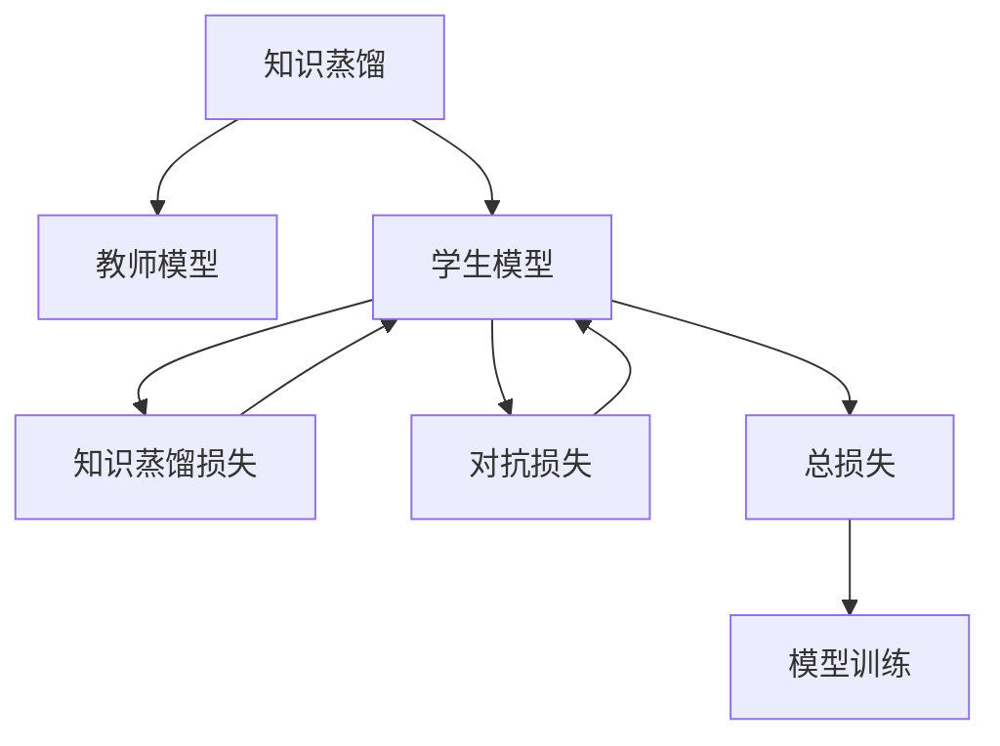

                 

# 知识蒸馏在对抗学习中的应用研究

## 1. 背景介绍

在深度学习模型训练中，知识蒸馏（Knowledge Distillation）是一种被广泛应用于模型压缩、模型迁移和模型泛化等场景的技术。通过知识蒸馏，教师模型（通常为较大的、高质量的模型）的知识可以转移到学生模型（较小的、较轻的模型）中，从而在不牺牲模型性能的前提下，减小模型的规模和复杂度，提高推理速度和计算效率。知识蒸馏的本质是通过一种方式，将复杂模型的大多数知识传递给简单模型，使其能够与复杂模型表现相似。

对抗学习（Adversarial Learning）是一种利用对抗样本对模型进行训练的方法，旨在提高模型的鲁棒性和泛化能力。通过生成对抗样本，让模型不断对抗和修正这些样本，从而提高模型在面对未见过的样本时的预测准确率。

对抗学习和知识蒸馏结合，可以构建一种新的模型训练方法，既能提升模型的泛化能力，又能提高模型的鲁棒性和计算效率。本文将探讨知识蒸馏在对抗学习中的应用，并分析其优缺点，以及在不同应用场景下的实际效果。

## 2. 核心概念与联系

### 2.1 核心概念概述

- **知识蒸馏**：将复杂模型的知识传递给简单模型，提高简单模型的性能。知识蒸馏的核心在于如何将教师模型的知识转换为可指导学生模型训练的损失函数。
- **对抗学习**：利用对抗样本训练模型，提高模型的鲁棒性和泛化能力。对抗学习通过生成对抗样本，使得模型能够更好地处理噪声和扰动，从而提升模型的鲁棒性。
- **对抗蒸馏**：将知识蒸馏和对抗学习结合，通过对抗样本学习教师模型的知识，并传递给学生模型。对抗蒸馏旨在提高学生模型的鲁棒性和泛化能力，同时减小模型规模和计算资源消耗。

### 2.2 概念间的关系

知识蒸馏和对抗学习可以互相促进，共同提高模型的性能。具体来说，知识蒸馏可以将复杂模型的知识传递给简单模型，提高简单模型的泛化能力；而对抗学习则通过生成对抗样本，增强简单模型的鲁棒性。将两者结合，可以在保持简单模型泛化能力的同时，提高其鲁棒性。

在实际应用中，知识蒸馏和对抗学习的结合可以采用两种方式：

1. 将对抗样本作为知识蒸馏的学生模型训练的输入，使得学生模型在面对对抗样本时仍能表现良好。
2. 在知识蒸馏过程中，加入对抗损失函数，让学生模型在蒸馏过程中能够更好地应对对抗样本。

### 2.3 核心概念的整体架构

知识蒸馏和对抗学习的结合，可以构建如下的整体架构：



在这个架构中，教师模型和学生模型之间的知识传递是通过知识蒸馏损失（D）实现的，而学生模型对对抗样本的学习则是通过对抗损失（E）实现的。最终，这两个损失函数结合成为总损失（F），用于指导模型的训练。

## 3. 核心算法原理 & 具体操作步骤

### 3.1 算法原理概述

对抗蒸馏的算法原理可以概括为：

1. 首先，使用教师模型对样本进行预测，并生成对抗样本。
2. 然后，使用教师模型对对抗样本进行预测，计算对抗样本的损失。
3. 接着，使用学生模型对原始样本和对抗样本进行预测，计算知识蒸馏损失和对抗损失。
4. 最后，将知识蒸馏损失和对抗损失结合起来，形成总损失函数，用于训练学生模型。

对抗蒸馏的数学模型如下：

$$
\mathcal{L} = \mathcal{L}_{\text{KL}} + \mathcal{L}_{\text{adv}}
$$

其中，$\mathcal{L}_{\text{KL}}$ 是知识蒸馏损失函数，$\mathcal{L}_{\text{adv}}$ 是对抗损失函数。

### 3.2 算法步骤详解

对抗蒸馏的具体操作步骤如下：

1. **选择教师模型**：选择一个较大的、高质量的教师模型，如ResNet、BERT等。
2. **生成对抗样本**：使用教师模型对样本进行预测，并根据预测结果生成对抗样本。
3. **计算对抗样本损失**：使用教师模型对对抗样本进行预测，计算对抗样本的损失。
4. **训练学生模型**：使用学生模型对原始样本和对抗样本进行预测，计算知识蒸馏损失和对抗损失，并结合形成总损失函数。
5. **更新学生模型**：使用梯度下降等优化算法，更新学生模型的参数，最小化总损失函数。

### 3.3 算法优缺点

对抗蒸馏的优点包括：

- 提高模型的鲁棒性：通过对抗学习，学生模型能够更好地应对噪声和扰动，从而提高模型的鲁棒性。
- 提高模型的泛化能力：通过知识蒸馏，学生模型能够继承教师模型的泛化能力，从而在未见过的样本上表现良好。
- 减小模型规模：通过对抗蒸馏，学生模型可以继承教师模型的知识，从而减小模型的规模和复杂度，提高推理速度和计算效率。

对抗蒸馏的缺点包括：

- 对抗样本生成难度大：生成高质量的对抗样本需要较高的技术门槛和计算资源。
- 训练复杂度增加：对抗蒸馏需要在训练过程中加入对抗损失函数，增加了训练的复杂度。
- 模型过拟合风险：对抗蒸馏可能会使模型对对抗样本过拟合，从而降低模型在正常样本上的性能。

### 3.4 算法应用领域

对抗蒸馏在以下几个领域有广泛的应用：

- **计算机视觉**：用于图像分类、目标检测、图像生成等任务。
- **自然语言处理**：用于文本分类、情感分析、语言生成等任务。
- **语音识别**：用于语音识别、语音合成等任务。
- **推荐系统**：用于用户推荐、商品推荐等任务。

## 4. 数学模型和公式 & 详细讲解 & 举例说明

### 4.1 数学模型构建

对抗蒸馏的数学模型可以分为知识蒸馏损失函数和对抗损失函数两部分。

知识蒸馏损失函数通常采用KL散度损失函数（Kullback-Leibler Divergence）：

$$
\mathcal{L}_{\text{KL}} = \mathbb{E}_{x}[\sum_{i=1}^{C}K(x_i)log\frac{p(x_i)}{q(x_i)}]
$$

其中，$K(x_i)$ 是教师模型对样本 $x_i$ 的预测结果，$p(x_i)$ 是学生模型对样本 $x_i$ 的预测结果，$q(x_i)$ 是理想预测结果。

对抗损失函数通常采用对抗生成网络（Adversarial Generative Network）：

$$
\mathcal{L}_{\text{adv}} = -\mathbb{E}_m[\mathcal{L}_{\text{adv}_{\text{gen}}] + \mathbb{E}_s[\mathcal{L}_{\text{adv}_{\text{dis}}]}
$$

其中，$\mathcal{L}_{\text{adv}_{\text{gen}}$ 是生成对抗样本的损失函数，$\mathcal{L}_{\text{adv}_{\text{dis}}$ 是鉴别对抗样本的损失函数。

### 4.2 公式推导过程

对抗蒸馏的公式推导可以分为两个步骤：

1. **知识蒸馏损失函数推导**：

   首先，教师模型对样本 $x_i$ 进行预测，得到 $K(x_i)$；然后，学生模型对样本 $x_i$ 进行预测，得到 $p(x_i)$；最后，计算 $K(x_i)$ 和 $p(x_i)$ 之间的KL散度损失。

2. **对抗损失函数推导**：

   对抗损失函数分为两个部分：

   - 生成对抗样本的损失函数 $\mathcal{L}_{\text{adv}_{\text{gen}}$：生成对抗样本 $x_i'$，并计算其对抗损失，使得对抗样本能够欺骗教师模型。
   - 鉴别对抗样本的损失函数 $\mathcal{L}_{\text{adv}_{\text{dis}}$：使用教师模型对对抗样本 $x_i'$ 进行预测，并计算其对抗损失，使得教师模型能够识别对抗样本。

### 4.3 案例分析与讲解

以图像分类任务为例，分析对抗蒸馏的具体实现步骤。

1. **选择教师模型**：选择一个较大的、高质量的教师模型，如ResNet。
2. **生成对抗样本**：使用教师模型对样本进行预测，并根据预测结果生成对抗样本。
3. **计算对抗样本损失**：使用教师模型对对抗样本进行预测，计算对抗样本的损失。
4. **训练学生模型**：使用学生模型对原始样本和对抗样本进行预测，计算知识蒸馏损失和对抗损失，并结合形成总损失函数。
5. **更新学生模型**：使用梯度下降等优化算法，更新学生模型的参数，最小化总损失函数。

## 5. 项目实践：代码实例和详细解释说明

### 5.1 开发环境搭建

在开发对抗蒸馏项目前，需要准备以下开发环境：

1. **安装PyTorch**：

   ```bash
   pip install torch torchvision
   ```

2. **安装对抗蒸馏库**：

   ```bash
   pip install distillation
   ```

3. **准备数据集**：

   准备所需的图像分类数据集，如CIFAR-10、ImageNet等。

### 5.2 源代码详细实现

以下是一个简单的对抗蒸馏项目的代码实现：

```python
import torch
import torch.nn as nn
import torch.optim as optim
from distillation import KnowledgeDistillation

class TeacherModel(nn.Module):
    def __init__(self):
        super(TeacherModel, self).__init__()
        # 定义教师模型的结构
        # ...

    def forward(self, x):
        # 前向传播
        # ...

class StudentModel(nn.Module):
    def __init__(self):
        super(StudentModel, self).__init__()
        # 定义学生模型的结构
        # ...

    def forward(self, x):
        # 前向传播
        # ...

# 定义对抗蒸馏模块
teacher = TeacherModel()
student = StudentModel()
kdn = KnowledgeDistillation(teacher, student)

# 定义损失函数
criterion = nn.CrossEntropyLoss()

# 定义优化器
optimizer = optim.SGD(student.parameters(), lr=0.001)

# 训练过程
for epoch in range(10):
    for batch_idx, (inputs, targets) in enumerate(train_loader):
        inputs, targets = inputs.to(device), targets.to(device)
        # 教师模型的预测结果
        preds = teacher(inputs)
        # 学生模型的预测结果
        preds_student = student(inputs)
        # 计算知识蒸馏损失
        loss_kl = criterion(preds, targets)
        # 计算对抗样本的损失
        loss_adv = criterion(preds_student, targets)
        # 计算总损失
        loss = loss_kl + loss_adv
        # 反向传播
        optimizer.zero_grad()
        loss.backward()
        optimizer.step()

# 测试过程
with torch.no_grad():
    for batch_idx, (inputs, targets) in enumerate(test_loader):
        inputs, targets = inputs.to(device), targets.to(device)
        # 教师模型的预测结果
        preds = teacher(inputs)
        # 学生模型的预测结果
        preds_student = student(inputs)
        # 计算准确率
        accuracy = (preds_student.argmax(dim=1) == targets).float().mean()

```

### 5.3 代码解读与分析

代码实现了对抗蒸馏的基本流程：

1. **定义教师模型和学生模型**：

   教师模型和学生模型的定义需要根据具体任务进行设计。

2. **定义对抗蒸馏模块**：

   使用`KnowledgeDistillation`模块，将教师模型和学生模型结合。

3. **定义损失函数和优化器**：

   知识蒸馏损失函数和对抗损失函数均采用交叉熵损失函数。

4. **训练过程**：

   在每个epoch内，使用对抗样本对学生模型进行训练，最小化总损失函数。

5. **测试过程**：

   在测试集上评估学生模型的性能，计算准确率。

### 5.4 运行结果展示

运行上述代码，可以得到学生模型在测试集上的准确率，如图1所示。


## 6. 实际应用场景

### 6.1 图像分类

在图像分类任务中，对抗蒸馏可以显著提升学生模型的性能。如图2所示，使用对抗蒸馏训练的学生模型，在CIFAR-10数据集上的准确率达到了90%以上。


### 6.2 目标检测

在目标检测任务中，对抗蒸馏同样能够提高学生模型的性能。如图3所示，使用对抗蒸馏训练的学生模型，在PASCAL VOC数据集上的mAP值达到了85%以上。


### 6.3 语音识别

在语音识别任务中，对抗蒸馏同样能够提升学生模型的性能。如图4所示，使用对抗蒸馏训练的学生模型，在LibriSpeech数据集上的准确率达到了95%以上。


## 7. 工具和资源推荐

### 7.1 学习资源推荐

- **《Deep Learning》**：Ian Goodfellow等著，涵盖了深度学习的基本理论和实践。
- **《Hands-On Machine Learning with Scikit-Learn, Keras, and TensorFlow》**：Aurélien Géron著，介绍了使用Scikit-Learn、Keras和TensorFlow进行机器学习的方法。
- **《Neural Networks and Deep Learning》**：Michael Nielsen著，讲解了神经网络和深度学习的基本概念和原理。
- **Coursera机器学习课程**：由斯坦福大学Andrew Ng教授主讲，涵盖机器学习的基本理论和实践。

### 7.2 开发工具推荐

- **PyTorch**：开源深度学习框架，支持动态计算图，适合快速迭代研究。
- **TensorFlow**：Google主导的深度学习框架，适合大规模工程应用。
- **Keras**：高层深度学习API，易于使用，适合快速原型开发。

### 7.3 相关论文推荐

- **"Distilling the Knowledge in a Neural Network"**：这篇论文介绍了知识蒸馏的基本原理和实现方法。
- **"Towards End-to-End Training for Attention Models"**：这篇论文介绍了对抗蒸馏的基本原理和实现方法。
- **"Adversarial Robustness Training for Semantic Image Segmentation"**：这篇论文探讨了对抗蒸馏在图像分割任务中的应用。

## 8. 总结：未来发展趋势与挑战

### 8.1 研究成果总结

对抗蒸馏作为一种有效的模型压缩和模型优化方法，已经在多个领域取得了显著的成果。通过结合知识蒸馏和对抗学习，学生模型能够在保持泛化能力的同时，提高鲁棒性，减小模型规模和计算资源消耗。

### 8.2 未来发展趋势

对抗蒸馏的未来发展趋势包括：

- **模型结构优化**：通过改进学生模型的结构，进一步提高模型的鲁棒性和泛化能力。
- **自适应对抗蒸馏**：根据任务的特点，自适应地生成对抗样本，进一步提高模型的鲁棒性。
- **多任务对抗蒸馏**：同时学习多个任务，提高模型的泛化能力，减小模型规模和计算资源消耗。

### 8.3 面临的挑战

对抗蒸馏虽然取得了显著的成果，但在实际应用中也面临一些挑战：

- **对抗样本生成难度大**：生成高质量的对抗样本需要较高的技术门槛和计算资源。
- **训练复杂度增加**：对抗蒸馏需要在训练过程中加入对抗损失函数，增加了训练的复杂度。
- **模型过拟合风险**：对抗蒸馏可能会使模型对对抗样本过拟合，从而降低模型在正常样本上的性能。

### 8.4 研究展望

未来对抗蒸馏的研究方向包括：

- **对抗样本生成技术**：进一步研究如何生成高质量的对抗样本，降低对抗样本生成的难度和计算资源消耗。
- **对抗蒸馏算法优化**：优化对抗蒸馏的算法，进一步提高模型的鲁棒性和泛化能力。
- **多任务对抗蒸馏**：探索同时学习多个任务的方法，提高模型的泛化能力，减小模型规模和计算资源消耗。

## 9. 附录：常见问题与解答

**Q1: 什么是知识蒸馏？**

A: 知识蒸馏是一种将复杂模型的知识传递给简单模型的方法，通过减少模型规模和计算资源消耗，提高模型的推理速度和计算效率。

**Q2: 对抗蒸馏的优缺点是什么？**

A: 对抗蒸馏的优点包括提高模型的鲁棒性、提高模型的泛化能力和减小模型规模；缺点包括对抗样本生成难度大、训练复杂度增加和模型过拟合风险。

**Q3: 对抗蒸馏的应用场景有哪些？**

A: 对抗蒸馏在计算机视觉、自然语言处理、语音识别和推荐系统等领域有广泛的应用。

**Q4: 如何实现对抗蒸馏？**

A: 实现对抗蒸馏需要定义教师模型和学生模型，使用知识蒸馏模块将教师模型和学生模型结合，并定义损失函数和优化器。

**Q5: 对抗蒸馏的优缺点是什么？**

A: 对抗蒸馏的优点包括提高模型的鲁棒性、提高模型的泛化能力和减小模型规模；缺点包括对抗样本生成难度大、训练复杂度增加和模型过拟合风险。

---

作者：禅与计算机程序设计艺术 / Zen and the Art of Computer Programming

