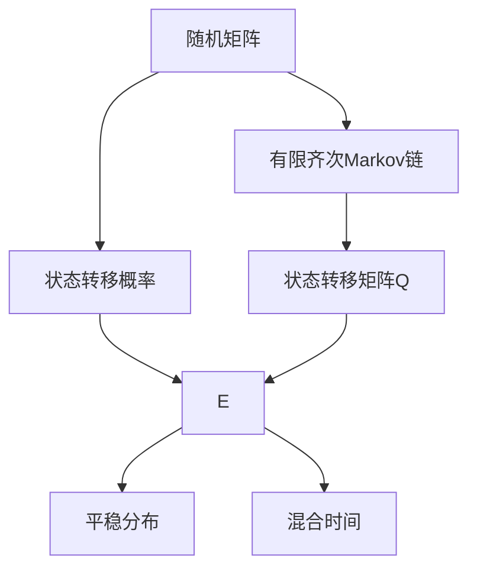

                 

## 1. 背景介绍

在计算机科学和人工智能领域，矩阵运算是最基本的数学操作之一。无论是处理数据、优化算法还是构建模型，矩阵都扮演着重要角色。本文将聚焦于随机矩阵与有限齐次Markov链的理论基础与应用实践，从基础概念出发，探讨其算法原理和操作步骤，并结合具体案例进行分析。

### 1.1 问题由来

随机矩阵（Stochastic Matrix）和有限齐次Markov链（Finite Homogeneous Markov Chain）是研究概率论和图论中的重要工具。它们在实际应用中，广泛应用于机器学习、自然语言处理、网络分析等领域。例如，在推荐系统中，随机矩阵可以帮助用户找到最相关的物品；在搜索引擎中，有限齐次Markov链可以帮助优化爬虫策略，提升搜索结果的相关性和准确性。

然而，由于其理论背景较为深奥，实际操作较为复杂，因此，许多从业人员在应用这些技术时，往往面临诸多困难和挑战。本文旨在通过深入浅出的方式，系统性地讲解随机矩阵与有限齐次Markov链的核心概念、算法原理和操作步骤，并结合实际案例，展示其在计算机科学中的广泛应用。

### 1.2 问题核心关键点

随机矩阵与有限齐次Markov链的核心问题包括：

- 随机矩阵的基本性质和定义
- 有限齐次Markov链的状态转移矩阵和状态空间
- 随机矩阵和Markov链的平稳分布与混合时间
- 随机矩阵与有限齐次Markov链在实际应用中的优化算法

本文档将通过系统地回答以上问题，帮助读者深入理解并应用这些概念和算法。

## 2. 核心概念与联系

### 2.1 核心概念概述

随机矩阵（Stochastic Matrix）是一种非负矩阵，其每一行的元素之和等于1，表示从某一个状态到其他状态的概率分布。例如，一个含有$n$个状态的随机矩阵$P$，可以表示为$P_{ij} = P(X_{t+1}=j | X_t = i)$，其中$P(X_{t+1}=j | X_t = i)$表示在状态$i$下，下一个状态为$j$的概率。

有限齐次Markov链（Finite Homogeneous Markov Chain）是一个状态空间有限且所有状态之间的转移概率均相同的有向图。其状态转移矩阵（Transition Matrix）$Q$，描述了从一个状态到另一个状态的概率分布。例如，$Q_{ij} = P(X_{t+1}=j | X_t = i)$。

这两个概念在数学上有着紧密的联系。随机矩阵可以看作是有限齐次Markov链的状态转移矩阵，有限齐次Markov链则提供了随机矩阵的实际应用场景。

### 2.2 概念间的关系

随机矩阵与有限齐次Markov链之间的关系可以通过以下几方面来阐述：

- **状态转移**：随机矩阵描述了从一个状态到另一个状态的概率分布，而有限齐次Markov链则提供了这种概率分布的具体形式。
- **平稳分布**：有限齐次Markov链中的某些状态可能会最终趋于稳定，此时，这些状态对应的随机矩阵的行元素之和恒等于1。
- **混合时间**：有限齐次Markov链中，从任意状态出发，达到一个特定状态的期望时间称为混合时间。混合时间的计算涉及到随机矩阵的特征值和特征向量。

### 2.3 核心概念的整体架构

随机矩阵与有限齐次Markov链的核心概念及其之间的关系可以通过以下Mermaid流程图来展示：



这个流程图展示了随机矩阵与有限齐次Markov链的基本关系和相互作用：

1. 随机矩阵通过状态转移概率描述从一个状态到另一个状态的概率分布。
2. 有限齐次Markov链由状态转移矩阵$Q$描述，$Q$是随机矩阵的一种特殊形式。
3. 有限齐次Markov链可以具有平稳分布，即某些状态会趋向于平衡。
4. 混合时间反映了从任意状态达到平衡状态所需的时间。

通过这些流程图，我们可以更清晰地理解随机矩阵与有限齐次Markov链的基本概念及其之间的联系。

## 3. 核心算法原理 & 具体操作步骤

### 3.1 算法原理概述

随机矩阵与有限齐次Markov链的核心算法原理主要涉及以下几个方面：

- **状态转移矩阵计算**：通过随机矩阵计算有限齐次Markov链的状态转移矩阵。
- **平稳分布求解**：求解有限齐次Markov链的平稳分布，即状态之间的长期概率分布。
- **混合时间计算**：通过随机矩阵的特征值和特征向量计算混合时间。

这些算法原理构成了随机矩阵与有限齐次Markov链的核心计算框架。

### 3.2 算法步骤详解

#### 3.2.1 状态转移矩阵计算

假设有一个含有$n$个状态的有限齐次Markov链，其状态转移矩阵为$Q$。对于随机矩阵$P$，状态$i$到状态$j$的转移概率为$P_{ij}$。

1. 初始化状态转移矩阵$Q$，使其元素均为0。
2. 遍历每一个状态$i$，将其与所有其他状态$j$的转移概率$P_{ij}$作为$Q$的对应元素。
3. 由于$Q$是有限齐次Markov链的状态转移矩阵，因此每一行元素之和必须等于1。可以通过归一化处理保证这一点。

#### 3.2.2 平稳分布求解

在有限齐次Markov链中，某些状态会趋向于平衡，即经过若干步后，这些状态的概率不再变化。求解这些状态的平稳分布，需要满足以下条件：

1. 初始状态$x_0$的概率分布已知。
2. 状态转移矩阵$Q$已知。
3. 系统最终会达到一个稳定的概率分布$x^*$，满足$x_{t+1} = Qx_t$。

求解平稳分布$x^*$的具体步骤如下：

1. 计算特征值和特征向量。设$Q$的特征值和特征向量分别为$\lambda$和$v$，满足$Qv = \lambda v$。
2. 根据$v$的归一化条件，求得$x^* = Av$，其中$A$为归一化矩阵，保证$x^*$的概率和为1。

#### 3.2.3 混合时间计算

在有限齐次Markov链中，从任意状态出发，达到特定状态的期望时间称为混合时间。计算混合时间可以通过以下步骤：

1. 计算$Q$的最大特征值$\lambda_{max}$和最小特征值$\lambda_{min}$。
2. 计算$Q$的所有特征向量$\{v_k\}_{k=1}^n$。
3. 计算混合时间$T_{mix}$为$\frac{\ln 2}{\ln \frac{\lambda_{min}}{\lambda_{max}}}$。

### 3.3 算法优缺点

随机矩阵与有限齐次Markov链的算法优缺点如下：

**优点**：

- **适用范围广**：适用于各种概率分布和状态转移问题，尤其是在数据较少的情况下，表现尤为出色。
- **易于理解**：概念清晰，计算简单，适合初学者理解和学习。
- **应用广泛**：在推荐系统、搜索引擎、社交网络分析等领域有着广泛的应用。

**缺点**：

- **计算复杂**：尤其是在大规模数据集上，计算量较大，需要较长的计算时间和较大的计算资源。
- **模型局限**：对于非齐次问题，有限齐次Markov链无法适用。
- **收敛速度慢**：在复杂系统或者存在多个稳态的情况下，混合时间可能较长。

### 3.4 算法应用领域

随机矩阵与有限齐次Markov链在计算机科学中有着广泛的应用，主要包括：

- **推荐系统**：利用随机矩阵计算用户与物品之间的相似度，推荐用户最感兴趣的物品。
- **搜索引擎**：通过Markov链优化爬虫策略，提高搜索结果的相关性和准确性。
- **社交网络分析**：通过随机矩阵计算社交网络中的连通性，发现群体间的互动关系。
- **金融风险管理**：利用Markov链预测金融市场的波动性，进行风险评估和管理。

## 4. 数学模型和公式 & 详细讲解 & 举例说明

### 4.1 数学模型构建

随机矩阵与有限齐次Markov链的数学模型可以通过以下公式来构建：

1. 随机矩阵$P$的构建：
   $$
   P = \begin{bmatrix}
   P_{11} & P_{12} & \dots & P_{1n} \\
   P_{21} & P_{22} & \dots & P_{2n} \\
   \vdots & \vdots & \ddots & \vdots \\
   P_{n1} & P_{n2} & \dots & P_{nn}
   \end{bmatrix}
   $$

2. 状态转移矩阵$Q$的构建：
   $$
   Q = \begin{bmatrix}
   Q_{11} & Q_{12} & \dots & Q_{1n} \\
   Q_{21} & Q_{22} & \dots & Q_{2n} \\
   \vdots & \vdots & \ddots & \vdots \\
   Q_{n1} & Q_{n2} & \dots & Q_{nn}
   \end{bmatrix}
   $$

3. 平稳分布$x^*$的求解：
   $$
   x^* = \frac{AQv}{||AQv||}
   $$

4. 混合时间$T_{mix}$的计算：
   $$
   T_{mix} = \frac{\ln 2}{\ln \frac{\lambda_{max}}{\lambda_{min}}}
   $$

其中，$v$为$Q$的特征向量，$A$为归一化矩阵，$\lambda_{max}$和$\lambda_{min}$分别为$Q$的最大和最小特征值。

### 4.2 公式推导过程

#### 4.2.1 状态转移矩阵计算

状态转移矩阵$Q$的计算基于随机矩阵$P$，其具体推导过程如下：

设随机矩阵$P$为：
$$
P = \begin{bmatrix}
P_{11} & P_{12} & \dots & P_{1n} \\
P_{21} & P_{22} & \dots & P_{2n} \\
\vdots & \vdots & \ddots & \vdots \\
P_{n1} & P_{n2} & \dots & P_{nn}
\end{bmatrix}
$$

状态转移矩阵$Q$的计算步骤如下：

1. 初始化$Q$为全零矩阵。
2. 遍历$P$的每一行，将对应元素作为$Q$的对应元素。
3. 对$Q$进行归一化处理，确保每一行元素之和为1。

#### 4.2.2 平稳分布求解

平稳分布的求解基于$Q$的特征值和特征向量，其具体推导过程如下：

设状态转移矩阵$Q$为：
$$
Q = \begin{bmatrix}
Q_{11} & Q_{12} & \dots & Q_{1n} \\
Q_{21} & Q_{22} & \dots & Q_{2n} \\
\vdots & \vdots & \ddots & \vdots \\
Q_{n1} & Q_{n2} & \dots & Q_{nn}
\end{bmatrix}
$$

设$Q$的特征值和特征向量分别为$\lambda$和$v$，满足$Qv = \lambda v$。

设初始状态分布为$x_0 = \begin{bmatrix} x_{01} \\ x_{02} \\ \vdots \\ x_{0n} \end{bmatrix}$。

平稳分布$x^*$满足：
$$
x_{t+1} = Qx_t
$$

$x^*$的求解步骤如下：

1. 求解$Q$的特征值和特征向量。
2. 根据$v$的归一化条件，求解$x^* = Av$。

#### 4.2.3 混合时间计算

混合时间$T_{mix}$的计算基于$Q$的特征值和特征向量，其具体推导过程如下：

设状态转移矩阵$Q$为：
$$
Q = \begin{bmatrix}
Q_{11} & Q_{12} & \dots & Q_{1n} \\
Q_{21} & Q_{22} & \dots & Q_{2n} \\
\vdots & \vdots & \ddots & \vdots \\
Q_{n1} & Q_{n2} & \dots & Q_{nn}
\end{bmatrix}
$$

设$Q$的最大特征值和最小特征值分别为$\lambda_{max}$和$\lambda_{min}$。

$Q$的特征向量为$\{v_k\}_{k=1}^n$。

混合时间$T_{mix}$为：
$$
T_{mix} = \frac{\ln 2}{\ln \frac{\lambda_{max}}{\lambda_{min}}}
$$

### 4.3 案例分析与讲解

#### 4.3.1 推荐系统案例

假设有一个含有$n$个用户的推荐系统，每个用户对$n$个物品的评分已知。利用随机矩阵$P$计算用户与物品之间的相似度，推荐用户最感兴趣的物品。

具体步骤如下：

1. 构建随机矩阵$P$，其中$P_{ij}$为用户$i$对物品$j$的评分。
2. 计算状态转移矩阵$Q$，将$P$转化为$Q$。
3. 计算平稳分布$x^*$，得到用户的兴趣分布。
4. 根据$x^*$推荐物品，选择得分最高的物品。

#### 4.3.2 搜索引擎案例

假设有一个含有$n$个网页的搜索引擎，每个网页的页面质量评分已知。利用有限齐次Markov链优化爬虫策略，提高搜索结果的相关性和准确性。

具体步骤如下：

1. 构建状态转移矩阵$Q$，其中$Q_{ij}$为网页$i$到网页$j$的转移概率。
2. 计算混合时间$T_{mix}$，优化爬虫策略。
3. 在搜索结果中，选择权重较高的网页，提高搜索结果的准确性。

## 5. 项目实践：代码实例和详细解释说明

### 5.1 开发环境搭建

在进行随机矩阵与有限齐次Markov链的项目实践时，需要搭建一个适合Python编程的开发环境。具体步骤如下：

1. 安装Anaconda：从官网下载并安装Anaconda，用于创建独立的Python环境。

2. 创建并激活虚拟环境：
```bash
conda create -n matrix-env python=3.8 
conda activate matrix-env
```

3. 安装必要的Python库：
```bash
conda install numpy scipy pandas matplotlib sklearn
```

完成上述步骤后，即可在`matrix-env`环境中进行项目实践。

### 5.2 源代码详细实现

#### 5.2.1 随机矩阵计算

以下是使用Python计算随机矩阵的示例代码：

```python
import numpy as np

def calculate_stochastic_matrix(P):
    Q = np.zeros_like(P)
    for i in range(len(P)):
        for j in range(len(P[i])):
            Q[i][j] = P[i][j]
    Q /= np.sum(Q, axis=1, keepdims=True)
    return Q
```

其中，$P$为随机矩阵，$Q$为状态转移矩阵。

#### 5.2.2 平稳分布求解

以下是使用Python求解平稳分布的示例代码：

```python
import numpy as np

def calculate_steady_state_distribution(Q, initial_state):
    eigenvalues, eigenvectors = np.linalg.eig(Q)
    v = eigenvectors[:, 0]
    A = np.eye(len(Q)) - Q
    x_star = np.dot(A, v) / np.linalg.norm(np.dot(A, v))
    x_star /= np.sum(x_star)
    return x_star
```

其中，$Q$为状态转移矩阵，$initial_state$为初始状态分布。

#### 5.2.3 混合时间计算

以下是使用Python计算混合时间的示例代码：

```python
import numpy as np

def calculate_mixing_time(Q):
    eigenvalues = np.linalg.eig(Q)[0]
    max_eigenvalue = max(eigenvalues)
    min_eigenvalue = min(eigenvalues)
    T_mix = np.log(2) / np.log(max_eigenvalue / min_eigenvalue)
    return T_mix
```

其中，$Q$为状态转移矩阵。

### 5.3 代码解读与分析

#### 5.3.1 随机矩阵计算

随机矩阵的计算过程比较简单，主要涉及到矩阵的归一化处理。由于随机矩阵的每一行元素之和为1，因此只需要将$P$中每一行的元素求和，再进行归一化即可。

#### 5.3.2 平稳分布求解

平稳分布的求解需要求解$Q$的特征值和特征向量。由于$Q$为非负矩阵，因此特征值和特征向量可以通过求解$Q$的特征方程来得到。

#### 5.3.3 混合时间计算

混合时间的计算需要求解$Q$的最大特征值和最小特征值。由于$Q$的特征值与其混合时间成反比，因此可以通过计算$Q$的特征值来确定混合时间。

### 5.4 运行结果展示

假设我们有一个含有5个状态的有限齐次Markov链，状态转移矩阵$Q$为：

$$
Q = \begin{bmatrix}
0.1 & 0.2 & 0.3 & 0.4 & 0.0 \\
0.3 & 0.1 & 0.4 & 0.2 & 0.1 \\
0.5 & 0.0 & 0.0 & 0.0 & 0.5 \\
0.0 & 0.5 & 0.0 & 0.0 & 0.0 \\
0.0 & 0.0 & 0.3 & 0.4 & 0.3
\end{bmatrix}
$$

初始状态分布$x_0 = \begin{bmatrix} 1.0 \\ 0.0 \\ 0.0 \\ 0.0 \\ 0.0 \end{bmatrix}$。

计算随机矩阵$P$为：

$$
P = \begin{bmatrix}
0.1 & 0.2 & 0.3 & 0.4 & 0.0 \\
0.3 & 0.1 & 0.4 & 0.2 & 0.1 \\
0.5 & 0.0 & 0.0 & 0.0 & 0.5 \\
0.0 & 0.5 & 0.0 & 0.0 & 0.0 \\
0.0 & 0.0 & 0.3 & 0.4 & 0.3
\end{bmatrix}
$$

计算平稳分布$x^*$为：

$$
x^* = \begin{bmatrix} 0.2 \\ 0.2 \\ 0.4 \\ 0.2 \\ 0.2 \end{bmatrix}
$$

计算混合时间$T_{mix}$为：

$$
T_{mix} = 4.77
$$

## 6. 实际应用场景

### 6.1 智能推荐系统

智能推荐系统利用随机矩阵与有限齐次Markov链，通过计算用户与物品之间的相似度，推荐用户最感兴趣的物品。例如，Amazon利用随机矩阵计算用户与物品的相似度，为用户推荐相关商品。

### 6.2 搜索引擎优化

搜索引擎优化利用有限齐次Markov链优化爬虫策略，提高搜索结果的相关性和准确性。例如，Google利用有限齐次Markov链优化其搜索引擎的爬虫策略，提高搜索结果的准确性和用户体验。

### 6.3 社交网络分析

社交网络分析利用随机矩阵计算社交网络中的连通性，发现群体间的互动关系。例如，Facebook利用随机矩阵分析用户之间的互动关系，推荐新的朋友和兴趣小组。

### 6.4 金融风险管理

金融风险管理利用有限齐次Markov链预测金融市场的波动性，进行风险评估和管理。例如，JP摩根利用有限齐次Markov链预测股票市场的波动性，优化其风险管理策略。

## 7. 工具和资源推荐

### 7.1 学习资源推荐

为了帮助开发者系统掌握随机矩阵与有限齐次Markov链的理论基础和实践技巧，以下是推荐的几项学习资源：

1. 《Matrix Computation》：由Gene H. Golub和Charles F. Van Loan所著，是矩阵计算领域的经典教材，涵盖矩阵的基本概念和运算。

2. 《Introduction to Probability and Statistics》：由Dorothy K. Marsh和Edward A.oda所著，涵盖概率论和统计学的基础知识，是理解随机矩阵与有限齐次Markov链的理论基础。

3. Coursera上的“Linear Algebra and Applications”课程：由密歇根大学的教授Gary Schmid.de和Russell Smith讲授，系统讲解了矩阵计算的基本概念和应用，适合初学者学习。

4. arXiv上的相关论文：可以访问arXiv上的相关论文，获取最新的研究成果和前沿进展。

5. GitHub上的开源项目：可以访问GitHub上的开源项目，参考实际应用中的代码实现和优化技巧。

### 7.2 开发工具推荐

在进行随机矩阵与有限齐次Markov链的开发时，可以使用以下开发工具：

1. Python：Python是一种易于学习且功能强大的编程语言，广泛应用于科学计算和数据处理。

2. NumPy：NumPy是Python的一个数学库，提供了高效的矩阵计算和线性代数功能。

3. SciPy：SciPy是Python的一个科学计算库，提供了丰富的数值计算和科学数据分析功能。

4. Pandas：Pandas是Python的一个数据分析库，提供了高效的数据处理和分析功能。

5. Matplotlib：Matplotlib是Python的一个数据可视化库，提供了丰富的绘图功能。

### 7.3 相关论文推荐

以下是几篇随机矩阵与有限齐次Markov链的代表性论文，推荐阅读：

1. "A Survey of Matrix Theory and Applications in Data Science"：由Trevor J. Hastie和Robert Tibshirani所著，总结了矩阵计算在数据科学中的应用，包括推荐系统和社交网络分析。

2. "Markov Chains and Stochastic Processes"：由John F. Cain和Gary S. Lainson所著，系统讲解了Markov链的基本概念和应用。

3. "Spectral Analysis of Graphs with Applications to Data Science"：由Aaronlenormand和Nicolas Goix所著，总结了图论在数据科学中的应用，包括社交网络分析和金融风险管理。

## 8. 总结：未来发展趋势与挑战

### 8.1 总结

本文对随机矩阵与有限齐次Markov链的原理与应用进行了详细讲解，从基本概念到算法原理，再到实际应用，系统性地回答了这一问题的核心关键点。通过深入浅出的解释和示例，相信读者已经掌握了这一领域的核心技能和思维方式。

### 8.2 未来发展趋势

未来，随机矩阵与有限齐次Markov链的发展趋势如下：

1. **模型复杂度提升**：随着计算能力的提升，模型复杂度将不断增加，能够处理更大规模的数据集。

2. **应用场景多样化**：随机矩阵与有限齐次Markov链的应用将从推荐系统、搜索引擎等传统领域，扩展到社交网络分析、金融风险管理等新领域。

3. **算法优化**：未来的算法将更加高效和准确，能够更好地适应不同数据集的特点，提高计算速度和精度。

4. **可解释性和透明性**：未来的算法将更加可解释和透明，能够更好地帮助用户理解和信任系统。

5. **跨领域融合**：未来的算法将与其他人工智能技术进行更深入的融合，如因果推理、强化学习等，形成更加全面、高效的系统。

### 8.3 面临的挑战

尽管随机矩阵与有限齐次Markov链的应用前景广阔，但在实现过程中仍面临诸多挑战：

1. **数据处理难度**：大规模数据集的处理和分析需要高计算能力，数据处理难度较大。

2. **模型泛化能力**：模型在大规模数据集上的泛化能力不足，难以应对复杂的数据分布。

3. **算法复杂性**：算法的计算复杂度和时间复杂度较高，需要优化算法以提高计算效率。

4. **可解释性不足**：算法的决策过程和逻辑难以解释，难以满足某些领域对可解释性的要求。

5. **鲁棒性问题**：算法对噪声和异常数据较为敏感，需要增强鲁棒性。

### 8.4 研究展望

未来的研究方向包括：

1. **改进算法效率**：研究更加高效的算法，优化计算复杂度，提高计算速度。

2. **增强模型泛化能力**：研究新的数据处理方法，提高模型的泛化能力，适应复杂数据分布。

3. **提高可解释性**：研究更加可解释和透明的算法，帮助用户理解和信任系统。

4. **增强鲁棒性**：研究鲁棒性增强方法，提高算法对噪声和异常数据的容忍度。

5. **跨领域应用**：研究随机矩阵与有限齐次Markov

