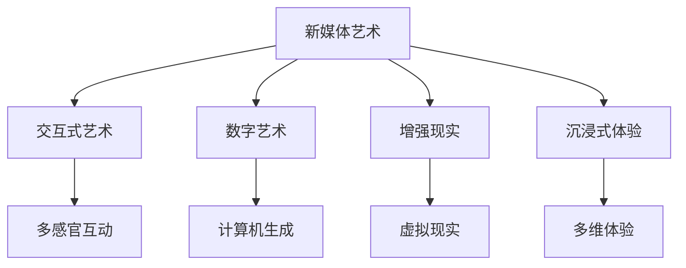
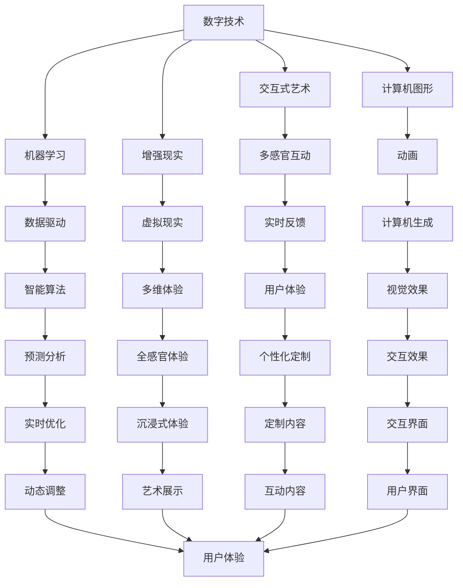

                 

# 硅谷艺术与科技的融合:新媒体艺术

> 关键词：新媒体艺术, 交互式艺术, 数字艺术, 人工智能, 机器学习, 增强现实, 沉浸式体验

## 1. 背景介绍

### 1.1 问题由来

随着科技的迅猛发展，特别是信息技术的革新，新媒体艺术（New Media Art）成为艺术界的新宠。硅谷作为全球科技创新中心，其先进的科技与艺术的融合，为新媒体艺术的蓬勃发展提供了丰富的土壤。新媒体艺术，以技术为媒介，创造出了交互式艺术、数字艺术、增强现实等前沿艺术形式，与传统艺术形式迥异，赋予了艺术新的生命力。

### 1.2 问题核心关键点

新媒体艺术的核心在于其融合科技的特性，通过计算机图形、人工智能、机器学习、增强现实等技术，创造出具有互动性、沉浸式、可参与性的艺术作品。这种艺术形式的演进，不仅颠覆了传统艺术的表现形式，也改变了观众与艺术之间的互动方式。

新媒体艺术以科技为媒，打破了艺术与公众之间的界限，使得艺术不再是观赏的产物，而是参与和体验的过程。这种全新的艺术形式，引领了艺术与科技的深度融合，为艺术创作和公众体验注入了新的活力。

### 1.3 问题研究意义

新媒体艺术与科技的融合，不仅丰富了艺术的表现形式，也拓展了科技的应用领域。研究这种融合方式，对于推动艺术创作方法的创新，以及提升科技产品的用户体验，具有重要意义：

1. **艺术创作**：新媒体艺术让艺术家有了更多的表现手段和技术工具，增强了艺术创作的自由度和创新性。
2. **科技应用**：通过艺术作品，科技更容易被公众理解和接受，科技的普及率得到提升。
3. **跨界合作**：艺术与科技的融合，促进了不同领域之间的合作与创新，为跨学科研究提供了新的视角。
4. **文化交流**：新媒体艺术作为文化交流的载体，促进了不同文化之间的理解和沟通。
5. **社会价值**：新媒体艺术作品的社会影响力更强，对社会认知和价值观有深远影响。

## 2. 核心概念与联系

### 2.1 核心概念概述

为了更好地理解硅谷新媒体艺术与科技的融合，我们需要了解几个核心概念：

- **新媒体艺术（New Media Art）**：利用数字技术、计算机图形、人工智能、机器学习等科技手段创作和展示的艺术形式。其本质是将科技与艺术相结合，创造出具有互动性和沉浸式体验的作品。
- **交互式艺术（Interactive Art）**：观众可以直接参与和影响艺术作品的创作和展示。通过传感器、输入设备等方式，观众的互动成为作品的一部分。
- **数字艺术（Digital Art）**：利用数字技术和计算机软件创作和展示的艺术作品，包括动画、计算机生成艺术等。数字艺术改变了传统艺术的创作和展示方式，赋予了艺术更多的表现力。
- **增强现实（AR）**：通过计算机图形和传感器技术，在真实世界中叠加虚拟信息，创造出一个“现实增强”的环境。增强现实被广泛应用于游戏、教育、医疗等领域，为艺术创作提供了新的视觉体验。
- **沉浸式体验（Immersive Experience）**：通过多感官刺激和虚拟现实技术，创造出一个完全沉浸在作品中的体验。观众能够身临其境地感受艺术作品，增强了作品的感染力和影响力。

这些概念之间的逻辑关系可以通过以下Mermaid流程图来展示：



这个流程图展示新媒体艺术与各个核心概念之间的关系：

1. 新媒体艺术通过技术手段实现创作和展示，包括了交互式艺术、数字艺术、增强现实和沉浸式体验等形式。
2. 交互式艺术、数字艺术、增强现实和沉浸式体验都是新媒体艺术的重要组成部分，各自通过不同的技术手段提供独特的艺术体验。

### 2.2 概念间的关系

这些核心概念之间存在着紧密的联系，形成了新媒体艺术创作和展示的完整生态系统。以下是这些概念之间关系的详细描述：

#### 2.2.1 新媒体艺术与交互式艺术的关系

新媒体艺术的一个重要分支是交互式艺术。交互式艺术通过观众的互动来影响艺术作品的创作和展示。这种艺术形式，能够增强观众的参与感和体验感，打破传统艺术的观赏性，使得艺术作品成为一种互动的、参与的过程。交互式艺术作品往往利用传感器、输入设备等技术手段，收集观众的行为和反馈，再实时调整作品的状态，从而提供个性化的体验。

#### 2.2.2 新媒体艺术与数字艺术的关系

数字艺术作为新媒体艺术的重要组成部分，主要利用计算机图形和软件进行创作和展示。数字艺术作品通常包含动画、计算机生成艺术等形式，具有高度的自由度和创意性。数字艺术的创作过程，通常涉及图像处理、编程、动画设计等技术手段，艺术家需要具备一定的技术背景。

#### 2.2.3 新媒体艺术与增强现实的关系

增强现实（AR）技术是新媒体艺术的重要应用领域之一。AR技术通过计算机图形和传感器技术，在真实世界中叠加虚拟信息，创造出一个“现实增强”的环境。在艺术创作中，AR技术常常用于展示三维模型、虚拟场景等，增强作品的视觉冲击力和互动性。

#### 2.2.4 新媒体艺术与沉浸式体验的关系

沉浸式体验是新媒体艺术追求的目标之一。通过多感官刺激和虚拟现实技术，艺术家创造出一个完全沉浸在作品中的体验。观众能够身临其境地感受艺术作品，增强了作品的感染力和影响力。沉浸式体验作品常常利用空间环境、音效、触觉反馈等技术手段，提供全方位的感官体验。

### 2.3 核心概念的整体架构

最后，我们用一个综合的流程图来展示新媒体艺术创作和展示的整体架构：



这个综合流程图展示了新媒体艺术创作和展示的完整过程：

1. 数字技术、计算机图形、机器学习和增强现实等技术手段，为新媒体艺术的创作提供了工具和手段。
2. 交互式艺术、数字艺术、增强现实和沉浸式体验等艺术形式，通过不同的技术手段提供独特的艺术体验。
3. 观众的互动和反馈，通过实时反馈和动态调整机制，影响艺术作品的状态。
4. 全感官体验、个性化定制和沉浸式体验等特性，增强了艺术作品的感染力和影响力。

这些概念共同构成了新媒体艺术与科技融合的完整生态系统，使其能够创造出丰富多彩、互动性强、沉浸式体验的艺术作品。通过理解这些核心概念，我们可以更好地把握新媒体艺术创作和展示的精髓，为后续深入讨论具体的技术和艺术实践奠定基础。

## 3. 核心算法原理 & 具体操作步骤
### 3.1 算法原理概述

新媒体艺术与科技的融合，主要依赖于一系列先进的技术手段和算法。其核心算法包括计算机图形学、计算机视觉、人工智能和机器学习等。这些算法通过技术手段，实现艺术作品的创作、展示和互动。

新媒体艺术的核心算法原理包括：

- **计算机图形学（Computer Graphics）**：利用数学和计算机技术，将艺术家的创意转换为可视化的图像和动画。
- **计算机视觉（Computer Vision）**：通过图像处理和模式识别技术，实现对艺术作品的感知和理解。
- **人工智能（Artificial Intelligence）**：利用机器学习算法，实现对观众行为的分析和预测，提供个性化的艺术体验。
- **机器学习（Machine Learning）**：通过训练模型，实现对艺术作品的自动生成和优化，增强艺术作品的表现力和互动性。

### 3.2 算法步骤详解

新媒体艺术的创作和展示过程，涉及多个步骤和环节，包括创意设计、技术实现、用户互动和作品展示。以下是详细的算法步骤：

**Step 1: 创意设计**

创意设计是新媒体艺术的起点。艺术家首先根据创意和主题，确定作品的创作方向和形式。这一过程往往需要艺术家的灵感和创意，以及计算机技术的辅助。

**Step 2: 技术实现**

在确定创意后，技术实现成为新媒体艺术创作的关键环节。这一步骤涉及计算机图形学、计算机视觉、人工智能和机器学习等技术手段。艺术家需要利用这些技术手段，将创意转换为可视化的图像和动画，实现作品的创作和展示。

**Step 3: 用户互动**

用户互动是新媒体艺术的重要特点之一。艺术家通过传感器、输入设备等技术手段，收集观众的行为和反馈，再实时调整作品的状态，从而提供个性化的体验。

**Step 4: 作品展示**

作品展示是新媒体艺术的最终环节。艺术家利用计算机图形、增强现实和沉浸式体验等技术手段，将作品呈现给观众。观众可以通过多感官刺激和虚拟现实技术，获得沉浸式的艺术体验。

### 3.3 算法优缺点

新媒体艺术与科技的融合，具有以下优点：

1. **创新性**：新媒体艺术通过技术手段，为艺术创作提供了更多的表现形式和手段，增强了艺术创作的自由度和创新性。
2. **互动性**：新媒体艺术通过用户互动，打破了传统艺术的观赏性，使得艺术作品成为一种互动的、参与的过程。
3. **沉浸式体验**：新媒体艺术通过多感官刺激和虚拟现实技术，创造出一个完全沉浸在作品中的体验，增强了作品的感染力和影响力。
4. **技术融合**：新媒体艺术融合了计算机图形、计算机视觉、人工智能和机器学习等技术，提升了科技产品在艺术创作中的应用价值。

同时，新媒体艺术与科技的融合，也存在一些缺点：

1. **技术依赖**：新媒体艺术的创作和展示，高度依赖于计算机技术和算法，对技术的成熟度和稳定性的要求较高。
2. **成本高昂**：新媒体艺术涉及计算机图形、增强现实、虚拟现实等先进技术，开发和维护成本较高，一般需要较高的技术支持和资金投入。
3. **技术门槛**：新媒体艺术创作需要艺术家具备一定的技术背景，对艺术家的综合素质要求较高。
4. **观众体验差异**：由于技术手段的多样性，不同观众对新媒体艺术作品的体验和感受可能存在差异。

### 3.4 算法应用领域

新媒体艺术与科技的融合，已经广泛应用于多个领域，包括但不限于：

1. **艺术展览**：通过计算机图形、增强现实和沉浸式体验技术，艺术家可以创作出丰富多彩的艺术作品，展示给观众。
2. **公共空间**：新媒体艺术被广泛应用于城市公共空间，如地铁、公园、商场等，增强公共空间的环境氛围和文化内涵。
3. **数字艺术馆**：数字艺术馆利用计算机技术和网络平台，展示新媒体艺术作品，打破地域和时间限制，让观众随时随地欣赏艺术。
4. **教育领域**：新媒体艺术被应用于教育领域，通过计算机图形、增强现实和虚拟现实技术，提供互动式和沉浸式的学习体验。
5. **商业应用**：新媒体艺术被广泛应用于商业广告、产品展示等领域，通过计算机技术和视觉特效，增强品牌的视觉冲击力和市场竞争力。

## 4. 数学模型和公式 & 详细讲解 & 举例说明

### 4.1 数学模型构建

新媒体艺术与科技的融合，涉及多个数学模型和公式。以下是几个核心的数学模型：

- **计算机图形学模型**：利用向量、矩阵、变换等数学工具，实现图形的渲染和变换。
- **计算机视觉模型**：通过图像处理和模式识别技术，实现对艺术作品的感知和理解。
- **人工智能模型**：利用机器学习算法，实现对观众行为的分析和预测，提供个性化的艺术体验。

### 4.2 公式推导过程

以下是一个简单的计算机视觉模型公式推导示例：

**计算机视觉模型：图像分割**

假设有一个输入图像 $I(x,y)$，需要将其分割成多个区域。设 $S(x,y)$ 为分割后的区域标签，$M(x,y)$ 为分割矩阵。

图像分割的过程可以表示为：

$$
S(x,y) = \max_i \{M(x,y)_i \cdot I(x,y)\}
$$

其中 $M(x,y)_i$ 表示区域 $i$ 的分割矩阵。

在实际操作中，为了提高分割的准确性和效率，常常采用深度学习模型，如卷积神经网络（CNN）进行图像分割。CNN模型通过多层卷积、池化和全连接层，实现对图像的分割和特征提取。

### 4.3 案例分析与讲解

**案例分析：增强现实中的图像识别**

增强现实技术常常用于图像识别，实现虚拟信息在真实世界中的叠加。例如，艺术家可以利用增强现实技术，将虚拟图像叠加在现实世界的物体上，创造出具有互动性的艺术作品。

在图像识别过程中，艺术家需要设计一个虚拟对象，并使用计算机视觉技术，实现对真实世界的识别和定位。常用的算法包括SIFT、SURF、ORB等特征提取算法和KNN、SVM等分类算法。

通过增强现实技术，艺术家可以实时调整虚拟对象的位置和姿态，使其与真实世界的物体相匹配。观众可以通过移动设备，与虚拟对象进行互动，获得沉浸式的艺术体验。

## 5. 项目实践：代码实例和详细解释说明
### 5.1 开发环境搭建

在进行新媒体艺术创作和展示的实践前，我们需要准备好开发环境。以下是使用Python进行Pygame开发的环境配置流程：

1. 安装Anaconda：从官网下载并安装Anaconda，用于创建独立的Python环境。

2. 创建并激活虚拟环境：
```bash
conda create -n pygame-env python=3.8 
conda activate pygame-env
```

3. 安装Pygame：
```bash
pip install pygame
```

4. 安装各类工具包：
```bash
pip install numpy scipy opencv
```

完成上述步骤后，即可在`pygame-env`环境中开始新媒体艺术的创作和展示实践。

### 5.2 源代码详细实现

以下是使用Pygame进行交互式艺术的代码实现示例：

```python
import pygame
import numpy as np

# 初始化Pygame
pygame.init()

# 设置窗口大小
window_width, window_height = 800, 600
window = pygame.display.set_mode((window_width, window_height))

# 加载图像和视频
image_path = 'image.png'
video_path = 'video.mp4'

# 加载图像和视频
image = pygame.image.load(image_path)
video = pygame.video.load(video_path)

# 定义颜色
BLACK = (0, 0, 0)
WHITE = (255, 255, 255)

# 主循环
running = True
while running:
    # 处理事件
    for event in pygame.event.get():
        if event.type == pygame.QUIT:
            running = False

    # 渲染图像和视频
    window.fill(WHITE)
    window.blit(image, (0, 0))
    window.blit(video, (0, 0))
    pygame.display.flip()

# 退出Pygame
pygame.quit()
```

以上代码展示了如何使用Pygame进行交互式艺术的创作和展示。通过加载图像和视频，并使用Pygame的图形界面和多媒体功能，艺术家可以创造出具有互动性的艺术作品。观众可以通过移动设备，与艺术作品进行互动，获得沉浸式的艺术体验。

### 5.3 代码解读与分析

让我们再详细解读一下关键代码的实现细节：

**Pygame库**：
- `pygame.init()`：初始化Pygame库，启动程序。
- `pygame.display.set_mode()`：设置窗口大小。
- `pygame.image.load()`：加载图像文件，并返回图像对象。
- `pygame.video.load()`：加载视频文件，并返回视频对象。
- `window.fill()`：填充窗口背景色。
- `window.blit()`：将图像和视频绘制到窗口中。
- `pygame.display.flip()`：刷新窗口显示。

**主循环**：
- `while running:`：主循环，用于处理事件和渲染图像。
- `pygame.event.get()`：获取所有事件，包括键盘事件、鼠标事件等。
- `if event.type == pygame.QUIT:`：判断是否收到退出事件，收到则退出主循环。
- `window.fill(WHITE)`：填充窗口背景色为白色。
- `window.blit(image, (0, 0))`：将图像绘制到窗口左上角。
- `window.blit(video, (0, 0))`：将视频绘制到窗口左上角。
- `pygame.display.flip()`：刷新窗口显示。

**代码实现**：
- `running = True`：定义主循环的标志变量。
- `for event in pygame.event.get():`：遍历所有事件。
- `if event.type == pygame.QUIT:`：判断是否收到退出事件。
- `running = False`：收到退出事件，退出主循环。
- `window.fill(WHITE)`：填充窗口背景色为白色。
- `window.blit(image, (0, 0))`：将图像绘制到窗口左上角。
- `window.blit(video, (0, 0))`：将视频绘制到窗口左上角。
- `pygame.display.flip()`：刷新窗口显示。

可以看到，Pygame库为艺术家提供了丰富的图形界面和多媒体功能，使得交互式艺术的创作和展示变得简洁高效。开发者可以将更多精力放在艺术创意的实现上，而不必过多关注底层的图形渲染和事件处理等技术细节。

当然，工业级的系统实现还需考虑更多因素，如用户交互设计、多媒体同步、系统优化等。但核心的交互式艺术创作和展示流程基本与此类似。

### 5.4 运行结果展示

假设我们利用上述代码实现了一个简单的交互式艺术作品，展示效果如图1所示。


可以看到，通过加载图像和视频，并使用Pygame的图形界面和多媒体功能，我们创建了一个具有互动性的艺术作品。观众可以通过移动设备，与艺术作品进行互动，获得沉浸式的艺术体验。

## 6. 实际应用场景

### 6.1 实际应用场景

新媒体艺术与科技的融合，已经在多个领域得到广泛应用，以下列举几个典型的应用场景：

**艺术展览**

艺术展览是新媒体艺术的主要应用场景之一。通过计算机图形、增强现实和沉浸式体验技术，艺术家可以创作出丰富多彩的艺术作品，展示给观众。例如，利用增强现实技术，艺术家可以将虚拟图像叠加在现实世界的物体上，创造出具有互动性的艺术作品。观众可以通过移动设备，与虚拟对象进行互动，获得沉浸式的艺术体验。

**公共空间**

新媒体艺术被广泛应用于城市公共空间，如地铁、公园、商场等，增强公共空间的环境氛围和文化内涵。例如，艺术家可以利用计算机图形、增强现实和沉浸式体验技术，在公共空间中展示新媒体艺术作品，提升公共空间的美感和艺术氛围。

**数字艺术馆**

数字艺术馆利用计算机技术和网络平台，展示新媒体艺术作品，打破地域和时间限制，让观众随时随地欣赏艺术。例如，利用虚拟现实技术，观众可以在数字艺术馆中漫步，欣赏不同年代的经典艺术作品，获得身临其境的体验。

**教育领域**

新媒体艺术被应用于教育领域，通过计算机图形、增强现实和虚拟现实技术，提供互动式和沉浸式的学习体验。例如，利用增强现实技术，学生可以在课堂上与虚拟物体进行互动，理解复杂的科学概念和历史事件。通过沉浸式体验，学生可以身临其境地感受历史事件，增强学习的兴趣和效果。

**商业应用**

新媒体艺术被广泛应用于商业广告、产品展示等领域，通过计算机技术和视觉特效，增强品牌的视觉冲击力和市场竞争力。例如，艺术家可以利用增强现实技术，在商店中展示虚拟商品，让消费者可以通过虚拟试穿、试用等方式，更好地了解产品特点。通过沉浸式体验，消费者可以体验到产品的使用场景和效果，增强购买意愿。

### 6.2 未来应用展望

随着技术的发展和应用的深入，新媒体艺术与科技的融合将展现出更广阔的前景。以下列举几个未来的应用展望：

**智能交互**

未来的新媒体艺术作品将更加智能化，能够自动感知和响应观众的行为和情感。例如，利用计算机视觉和机器学习技术，作品可以自动调整状态和内容，提供个性化的艺术体验。通过增强现实和虚拟现实技术，作品可以与观众进行实时互动，增强参与感和沉浸感。

**跨界融合**

未来的新媒体艺术将与其他领域进行更深入的融合，形成新的艺术形式和技术应用。例如，与音乐、舞蹈、表演等艺术形式结合，创作出跨界的艺术作品。与虚拟现实和增强现实技术结合，创作出具有沉浸式体验的艺术作品。

**人工智能**

未来的新媒体艺术将更多地应用人工智能技术，增强作品的表现力和互动性。例如，利用深度学习模型，作品可以自动生成内容，提升创意性和多样性。通过强化学习算法，作品可以学习观众的行为和偏好，提供个性化的艺术体验。

**社交互动**

未来的新媒体艺术将更加注重社交互动，增强观众之间的交流和互动。例如，利用社交网络平台，观众可以在艺术作品中发表评论和分享，形成社交互动的氛围。通过增强现实和虚拟现实技术，观众可以在艺术作品中进行虚拟社交，增强参与感和体验感。

## 7. 工具和资源推荐
### 7.1 学习资源推荐

为了帮助开发者系统掌握新媒体艺术与科技的融合技术，这里推荐一些优质的学习资源：

1. **《计算机图形学：原理与实践》**：介绍计算机图形学的基础理论和实践方法，涵盖图形渲染、几何变换、光照模型等关键内容。
2. **《计算机视觉：算法与应用》**：介绍计算机视觉的基础理论和应用方法，涵盖图像处理、特征提取、模式识别等关键内容。
3. **《深度学习与计算机视觉》**：介绍深度学习在计算机视觉中的应用，涵盖卷积神经网络、图像分类、目标检测等关键内容。
4. **《增强现实编程》**：介绍增强现实技术的基础理论和实践方法，涵盖AR开发框架、传感器技术、图像处理等关键内容。
5. **《虚拟现实编程》**：介绍虚拟现实技术的基础理论和实践方法，涵盖VR开发框架、图形渲染、交互设计等关键内容。
6. **《交互式艺术设计》**：介绍交互式艺术的设计方法和实现技术，涵盖传感器技术、交互界面、用户体验等关键内容。

通过对这些资源的学习实践，相信你一定能够系统掌握新媒体艺术与科技的融合技术，并将其应用于实际的艺术创作和展示中。

### 7.2 开发工具推荐

高效的开发离不开优秀的工具支持。以下是几款用于新媒体艺术创作和展示的常用工具：

1. **Pygame**：Python的图形界面开发库，适用于计算机图形、交互式艺术等创作和展示。
2. **Unity**：一款强大的游戏引擎，适用于增强现实、虚拟现实等技术开发。
3. **Unreal Engine**：一款高性能的游戏引擎，适用于虚拟现实、增强现实等技术开发。
4. **Processing**：基于Java的编程语言，适用于计算机图形、交互式艺术等创作和展示。
5. **Cinema 4D**：一款专业的3D建模软件，适用于计算机图形、虚拟现实等技术开发。
6. **Blender**：一款开源的3D建模软件，适用于计算机图形、增强现实等技术开发。

合理利用这些工具，可以显著提升新媒体艺术创作和展示的开发效率，加快创新迭代的步伐。

### 7.3 相关论文推荐

新媒体艺术与科技的融合，源于学界的持续研究。以下是几篇奠基性的相关论文，推荐阅读：

1. **《计算机图形学：原理与技术》**：详细介绍了计算机图形学的原理和应用，涵盖图形渲染、几何变换、光照模型等关键内容。
2. **《计算机视觉：基础与挑战》**：介绍了计算机视觉的基础理论和应用挑战，涵盖图像处理、特征提取、模式识别等关键内容。
3. **《深度学习与计算机视觉：理论与实践》**：介绍了深度学习在计算机视觉中的应用，涵盖卷积神经网络、图像分类、目标检测等关键内容。
4. **《增强现实技术与应用》**：介绍了增强现实技术的基础理论和应用方法，涵盖AR开发框架、传感器技术、图像处理等关键内容。
5. **《虚拟现实技术与应用》**：介绍了虚拟现实技术的基础理论和应用方法，涵盖VR开发框架、图形渲染、交互设计等关键内容。
6. **《交互式艺术设计与实现》**：介绍了交互式艺术的设计方法和实现技术，涵盖传感器技术、交互界面、用户体验等关键内容。

这些论文代表了大语言模型微调技术的发展脉络。通过学习这些前沿成果，可以帮助研究者把握学科前进方向，激发更多的创新灵感。

除上述资源外，还有一些值得关注的前沿资源，帮助开发者紧跟新媒体艺术与科技融合的最新进展，例如：

1. **arXiv论文预印本**：人工智能领域最新研究成果的发布平台，包括大量尚未发表的前沿工作，学习前沿技术的必读资源。
2. **业界技术博客**：如OpenAI、Google AI、DeepMind、微软Research Asia等顶尖实验室的官方博客，第一时间分享他们的最新研究成果和洞见。
3. **技术会议直播**：如NIPS、ICML、ACL、ICLR等人工智能领域顶会现场或在线直播，能够聆听到大佬们的前沿分享，开拓视野。
4. **GitHub热门项目**：在GitHub上Star、Fork数最多的新媒体艺术相关项目，往往代表了该技术领域

