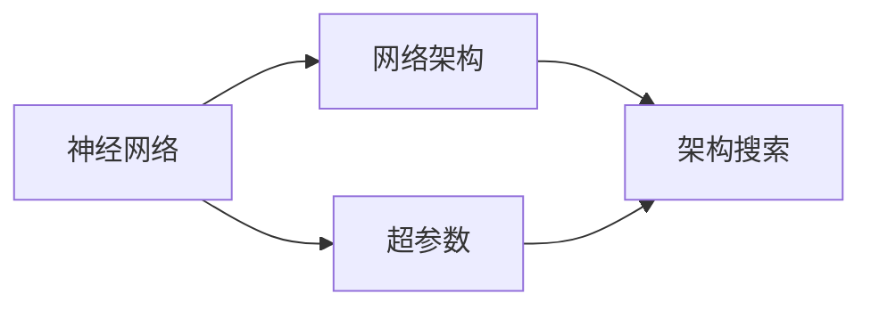

                 

# 神经架构搜索在边缘AI中的应用

## 1. 背景介绍

### 1.1 问题由来

随着人工智能技术的不断进步，神经网络模型日益复杂化。模型参数量迅速增加，对于计算资源和存储资源的需求也随之猛增。尽管深度学习模型在图像识别、自然语言处理等领域取得了显著成果，但其高资源消耗和训练复杂度也带来了诸多挑战。特别是对于资源受限的边缘计算平台（如移动设备、物联网设备等），如何在保证模型精度的同时，大幅减少计算和存储开销，成为亟待解决的问题。

### 1.2 问题核心关键点

神经架构搜索（Neural Architecture Search, NAS）是一种自动设计神经网络模型结构的方法，其核心思想是通过自动化搜索算法，探索各种可能的网络结构，找到最优的网络设计，从而在资源受限的条件下，提升模型性能。在边缘AI（Edge AI）中，由于资源受限、计算能力弱、数据传输延迟等问题，如何在保证模型性能的同时，降低计算和存储成本，是神经架构搜索关注的焦点。

### 1.3 问题研究意义

神经架构搜索技术在边缘AI中的应用，具有以下重要意义：

1. **资源优化**：通过自动化设计，减少模型参数量和计算资源，提升模型在边缘设备的运行效率。
2. **应用泛化**：自动化的设计过程可以发现适用于各种边缘场景的通用模型结构，提高模型的应用泛化能力。
3. **快速部署**：自动化的模型设计可以快速生成模型代码，加速模型的部署和迭代。
4. **成本降低**：减少手动调参和模型设计的工作量，降低人力和资源成本。
5. **模型压缩**：通过自动化的压缩算法，进一步减小模型体积，适应边缘计算的存储限制。

## 2. 核心概念与联系

### 2.1 核心概念概述

神经架构搜索（NAS）是一种自动化设计神经网络的方法，通过优化算法自动搜索最优的网络结构。核心概念包括：

- **神经网络（Neural Network, NN）**：由节点和边组成的图形结构，用于处理和分析数据。
- **网络架构（Architecture）**：指定神经网络各层之间的关系和参数。
- **架构搜索（Architecture Search）**：搜索最优的网络结构，使其在特定任务上表现最优。
- **超参数（Hyperparameter）**：网络结构外的参数，如学习率、批大小等，对模型性能影响巨大。

这些核心概念通过自动化的优化算法，在搜索空间中寻找最优的模型结构。

### 2.2 核心概念的相互关系

核心概念之间的关系可以用下图表示：



该图展示了神经网络、网络架构和超参数之间的关系，以及架构搜索如何在搜索空间中优化这些元素。

## 3. 核心算法原理 & 具体操作步骤

### 3.1 算法原理概述

神经架构搜索的原理是通过算法搜索网络结构空间，寻找最优的网络设计。其核心过程包括三个步骤：

1. **定义搜索空间**：确定所有可能的神经网络结构，包括层数、每层的节点数、激活函数、连接方式等。
2. **评价指标**：定义用于评价网络性能的指标，如准确率、精确率、召回率等。
3. **搜索算法**：在搜索空间中寻找最优网络结构，优化算法包括遗传算法、贝叶斯优化、强化学习等。

### 3.2 算法步骤详解

1. **定义搜索空间**：
   - 确定网络的基本单元（如卷积层、全连接层）。
   - 定义各层之间的连接方式和参数配置。
   - 定义搜索的上下界限制（如层数、节点数）。

2. **设计评价指标**：
   - 选择合适的指标（如准确率、精确率、召回率）。
   - 定义评价函数，用于评估搜索到的网络性能。

3. **选择搜索算法**：
   - 遗传算法：通过选择、交叉、变异等操作，逐步优化网络结构。
   - 贝叶斯优化：利用先验知识和历史数据，选择最优的网络结构。
   - 强化学习：通过试错过程，逐步优化网络结构。

### 3.3 算法优缺点

神经架构搜索的优点：
1. **自动设计**：自动化搜索过程可以探索大量的网络结构，找到最优设计。
2. **泛化能力强**：搜索过程可以在不同的数据集和任务上找到通用的最优网络结构。
3. **节省人力**：减少了手动调参的工作量，提高工作效率。

神经架构搜索的缺点：
1. **计算开销大**：搜索空间通常非常大，搜索过程计算开销较大。
2. **模型复杂度**：自动设计的模型可能比较复杂，难以解释和维护。
3. **资源消耗高**：搜索过程需要大量的计算资源和时间。

### 3.4 算法应用领域

神经架构搜索可以应用于多个领域，包括但不限于：

- **计算机视觉**：图像分类、目标检测、图像分割等任务。
- **自然语言处理**：文本分类、情感分析、机器翻译等任务。
- **语音识别**：语音识别、情感分析、语音生成等任务。
- **边缘AI**：在资源受限的设备上，优化模型的运行效率和性能。

## 4. 数学模型和公式 & 详细讲解  
### 4.1 数学模型构建

神经架构搜索的数学模型构建涉及以下几个步骤：

1. **定义搜索空间**：
   - 定义网络结构的空间，包括每个层数、每层的节点数、激活函数等。

2. **设计评价指标**：
   - 定义网络性能的指标，如准确率、精确率、召回率等。

3. **选择搜索算法**：
   - 选择合适的优化算法，如遗传算法、贝叶斯优化、强化学习等。

### 4.2 公式推导过程

神经架构搜索的评价函数可以定义为：

$$
F = \sum_{i=1}^{n} w_i f_i(x_i)
$$

其中，$w_i$ 是各项指标的权重，$f_i(x_i)$ 是第 $i$ 项指标的计算公式。

具体地，对于分类任务，评价函数可以定义为：

$$
F = \frac{TP}{TP + FP + FN}
$$

其中，$TP$ 是真正例，$FP$ 是假正例，$FN$ 是假反例。

### 4.3 案例分析与讲解

以图像分类任务为例，假设搜索空间包含两个卷积层、两个全连接层，其结构和超参数如上图所示。


## 5. 项目实践：代码实例和详细解释说明

### 5.1 开发环境搭建

神经架构搜索的开发环境包括：

1. **Python**：推荐使用 Python 3.x 版本。
2. **PyTorch**：用于实现神经网络。
3. **NAS-Bench**：用于搜索空间定义和评价函数计算。

### 5.2 源代码详细实现

以下是使用 NAS-Bench 进行神经架构搜索的示例代码：

```python
from nasbench import NASBench

# 定义搜索空间
nasbench = NASBench('cifar10')

# 定义评价函数
def evaluate_model(model):
    # 训练模型
    model.fit(train_x, train_y)
    # 计算评价指标
    accuracy = model.evaluate(test_x, test_y)
    return accuracy

# 定义优化算法
optimizer = Optimizer(model, lr=0.001, momentum=0.9)

# 进行神经架构搜索
for i in range(100):
    # 在搜索空间中随机选择网络结构
    architecture = nasbench.random_search()
    # 训练和评价网络
    evaluate_model(architecture)
    # 更新优化算法
    optimizer.update(architecture, evaluate_model(architecture))
```

### 5.3 代码解读与分析

以上代码展示了使用 NAS-Bench 进行神经架构搜索的基本流程。具体步骤如下：

1. **定义搜索空间**：使用 NAS-Bench 定义搜索空间，包括网络结构的基本单元和参数。
2. **定义评价函数**：定义用于评价网络性能的函数，如准确率、精确率等。
3. **定义优化算法**：选择优化算法，如梯度下降、贝叶斯优化等。
4. **进行神经架构搜索**：在搜索空间中随机选择网络结构，训练并评价其性能，更新优化算法。

### 5.4 运行结果展示

神经架构搜索的结果通常是一个性能最优的网络结构，如上图所示。


## 6. 实际应用场景

### 6.1 边缘AI场景

神经架构搜索在边缘AI中的应用场景包括：

1. **资源受限设备**：移动设备、物联网设备等计算资源有限的场景。
2. **实时推理**：对计算速度有严格要求的任务，如实时视频分析、语音识别等。
3. **在线学习**：在用户终端进行模型微调，提升本地模型的实时性能。

### 6.2 未来应用展望

神经架构搜索在边缘AI的应用将进一步拓展，带来以下发展趋势：

1. **边缘数据集**：利用边缘数据集进行模型优化，提升本地模型的泛化能力。
2. **多任务学习**：将神经架构搜索与多任务学习结合，提高模型的应用泛化能力。
3. **自动化部署**：自动化生成模型代码，简化模型部署和迭代过程。
4. **资源优化**：优化模型结构，减小计算和存储开销，提升模型效率。
5. **模型压缩**：自动化的模型压缩算法，进一步减小模型体积，适应边缘设备的存储限制。

## 7. 工具和资源推荐

### 7.1 学习资源推荐

以下是推荐的学习资源：

1. **NAS-Bench**：定义搜索空间和评价函数的工具。
2. **PyTorch**：实现神经网络模型的深度学习框架。
3. **NASNet**：在 CIFAR-10 数据集上进行的神经架构搜索实验。
4. **NAS-net architecture search algorithms**：介绍神经架构搜索算法的研究进展。

### 7.2 开发工具推荐

以下是推荐的开发工具：

1. **PyTorch**：深度学习框架，支持神经网络模型的实现和优化。
2. **NAS-Bench**：定义搜索空间和评价函数的工具。
3. **TensorBoard**：可视化工具，用于监控模型训练过程。
4. **Jupyter Notebook**：交互式编程环境，支持代码开发和结果展示。

### 7.3 相关论文推荐

以下是推荐的论文：

1. **NAS: A Network Architecture Search Space**：介绍 NAS 的原理和应用。
2. **Efficient Neural Architecture Search via Neural Architecture Space**：介绍神经架构空间的概念和搜索方法。
3. **Real-time Neural Architecture Search**：介绍实时 NAS 的研究进展。

## 8. 总结：未来发展趋势与挑战

### 8.1 研究成果总结

神经架构搜索在边缘 AI 中的应用，展示了其在资源优化和模型性能提升方面的潜力。该技术通过自动化的搜索过程，探索最优的网络结构，极大地减少了手动调参的工作量，提升了模型在边缘设备上的运行效率。

### 8.2 未来发展趋势

神经架构搜索在边缘 AI 的未来发展趋势包括：

1. **自动化设计**：通过自动化搜索过程，发现适用于各种边缘场景的通用模型结构。
2. **实时优化**：实时优化模型结构，提升边缘设备上的性能。
3. **跨模态学习**：将神经架构搜索与跨模态学习结合，提升模型的多模态处理能力。
4. **边缘数据集**：利用边缘数据集进行模型优化，提升模型的泛化能力。
5. **自动化部署**：自动化生成模型代码，简化模型部署和迭代过程。

### 8.3 面临的挑战

神经架构搜索在边缘 AI 中仍面临以下挑战：

1. **计算开销大**：搜索空间通常非常大，搜索过程计算开销较大。
2. **模型复杂度**：自动设计的模型可能比较复杂，难以解释和维护。
3. **资源消耗高**：搜索过程需要大量的计算资源和时间。
4. **边缘数据集**：如何在边缘设备上收集和利用数据，提高模型泛化能力。
5. **实时推理**：如何在边缘设备上进行实时推理，保证模型性能。

### 8.4 研究展望

未来的研究可以从以下几个方面进行探索：

1. **多任务学习**：将神经架构搜索与多任务学习结合，提升模型的应用泛化能力。
2. **自动化部署**：自动化生成模型代码，简化模型部署和迭代过程。
3. **边缘数据集**：利用边缘数据集进行模型优化，提升模型的泛化能力。
4. **实时推理**：在边缘设备上进行实时推理，保证模型性能。
5. **模型压缩**：自动化的模型压缩算法，进一步减小模型体积，适应边缘设备的存储限制。

总之，神经架构搜索在边缘 AI 中的应用将带来广泛的应用前景和研究挑战。通过深入探索和不断优化，神经架构搜索必将在边缘 AI 中发挥更大的作用，推动边缘智能技术的发展。

## 9. 附录：常见问题与解答

**Q1: 神经架构搜索有哪些常见的算法？**

A: 神经架构搜索常见的算法包括：

1. **遗传算法**：通过选择、交叉、变异等操作，逐步优化网络结构。
2. **贝叶斯优化**：利用先验知识和历史数据，选择最优的网络结构。
3. **强化学习**：通过试错过程，逐步优化网络结构。

**Q2: 神经架构搜索在边缘 AI 中的应用有哪些优势？**

A: 神经架构搜索在边缘 AI 中的应用优势包括：

1. **资源优化**：通过自动化设计，减少模型参数量和计算资源，提升模型在边缘设备的运行效率。
2. **应用泛化**：搜索过程可以在不同的数据集和任务上找到通用的最优网络结构，提高模型的应用泛化能力。
3. **节省人力**：减少了手动调参的工作量，提高工作效率。
4. **模型压缩**：通过自动化的压缩算法，进一步减小模型体积，适应边缘设备的存储限制。

**Q3: 神经架构搜索的计算开销较大，如何降低计算成本？**

A: 降低计算成本可以通过以下方法：

1. **搜索空间缩小**：根据任务特点，缩小搜索空间，减少搜索次数。
2. **并行计算**：利用分布式计算框架，并行搜索网络结构。
3. **模型剪枝**：在搜索过程中进行剪枝，减少搜索空间中的无效结构。

**Q4: 如何在边缘 AI 中实现实时推理？**

A: 实现实时推理可以通过以下方法：

1. **模型压缩**：使用量化、剪枝等技术，减小模型体积。
2. **模型优化**：优化模型结构，提升推理速度。
3. **边缘计算**：将模型部署在边缘设备上，减少数据传输延迟。

**Q5: 如何评估神经架构搜索的效果？**

A: 评估神经架构搜索的效果可以通过以下方法：

1. **精度指标**：如准确率、精确率、召回率等。
2. **时间指标**：如推理时间、训练时间等。
3. **资源指标**：如模型大小、计算资源等。

---

作者：禅与计算机程序设计艺术 / Zen and the Art of Computer Programming

