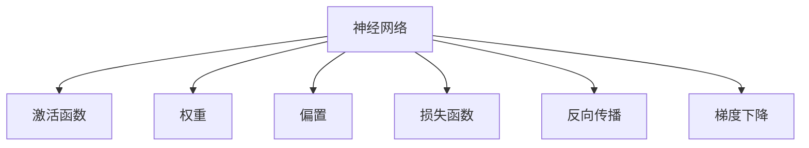
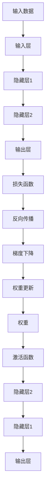

                 

# 神经网络 原理与代码实例讲解

## 1. 背景介绍

### 1.1 问题由来

神经网络是一种模拟人类神经系统的工作原理的计算模型。自20世纪80年代以来，它已经成为人工智能领域的一个重要分支。近些年，随着深度学习技术的发展，神经网络在计算机视觉、自然语言处理、语音识别等众多领域取得了显著成果，成为推动人工智能技术发展的重要驱动力。

尽管神经网络已经取得了诸多成就，但由于其理论基础的复杂性，入门门槛相对较高，许多初学者对其原理和实现方法理解不深，应用时感到困难重重。为此，本文将详细介绍神经网络的基本原理、算法流程和代码实现，力求帮助读者深入理解神经网络的内在机制，并掌握其在实际应用中的技巧。

### 1.2 问题核心关键点

神经网络的核心在于通过多层次的非线性变换，将输入特征映射到输出结果，从而实现复杂的模式识别和预测任务。

神经网络的学习过程本质上是一个参数优化过程。通过反向传播算法，对网络中每一层神经元的权重进行更新，从而逐渐逼近目标函数。神经网络一般包括输入层、隐藏层和输出层，其中每一层由多个神经元组成，通过连接权重和激活函数构成非线性变换，最终实现复杂的映射关系。

神经网络的优势在于其强大的表达能力和自适应学习能力，能够自动从数据中提取特征并进行泛化，适用于各种类型的复杂任务。但同时，神经网络也面临着参数多、训练复杂、过拟合风险高等挑战，需要深入研究优化算法和正则化方法，才能充分发挥其潜力。

### 1.3 问题研究意义

神经网络作为深度学习技术的重要组成部分，对人工智能的发展具有重要意义：

1. 促进数据驱动型决策：神经网络通过数据驱动的模型学习，能够从大规模数据中自动提取特征，并进行高质量的预测和分类。这使得机器能够更加准确地理解和分析现实世界的数据。

2. 实现端到端智能：神经网络能够将数据预处理、特征提取、模型训练和结果预测等环节无缝集成，形成端到端智能系统，提升应用效率和用户体验。

3. 催生新应用场景：神经网络在大数据、计算能力不断提升的今天，应用场景越来越广泛，包括计算机视觉、自然语言处理、语音识别、推荐系统等，改变了传统信息处理方式。

4. 推动学科交叉：神经网络的研究不仅涉及计算机科学，还涵盖数学、心理学、神经科学等多个领域，促进了多学科的交叉融合。

5. 引领产业变革：神经网络技术的广泛应用，将推动各行各业实现智能化转型，提升行业竞争力和创新力。

## 2. 核心概念与联系

### 2.1 核心概念概述

为更好地理解神经网络，本文将介绍几个密切相关的核心概念：

- 神经网络（Neural Network）：由输入层、隐藏层和输出层组成的计算模型，用于解决各种复杂问题。
- 激活函数（Activation Function）：神经元输出中的非线性变换，引入非线性关系，增强模型的表达能力。
- 权重（Weight）：神经元之间的连接权重，通过反向传播算法进行更新，是网络学习的基础。
- 偏置（Bias）：神经元输出中的常数项，增强模型的灵活性。
- 损失函数（Loss Function）：衡量模型预测输出与真实标签之间差异的函数，用于反向传播优化。
- 反向传播（Backpropagation）：神经网络中用于参数更新的算法，通过链式法则计算各层权重梯度。
- 梯度下降（Gradient Descent）：神经网络中用于参数优化的算法，通过梯度信息更新权重参数。

### 2.2 概念间的关系

这些核心概念之间的逻辑关系可以通过以下Mermaid流程图来展示：



这个流程图展示了神经网络的主要组成要素及其相互关系：

1. 神经网络由激活函数、权重和偏置构成。
2. 权重和偏置是神经元之间的连接参数，激活函数引入非线性变换。
3. 损失函数衡量模型预测与真实标签的差异，用于反向传播。
4. 反向传播通过链式法则计算梯度信息，用于权重更新。
5. 梯度下降算法根据梯度信息更新权重参数，完成模型优化。

这些概念共同构成了神经网络的工作原理，使得神经网络能够从数据中自动提取特征，并进行高质量的预测和分类。

### 2.3 核心概念的整体架构

最后，我们用一个综合的流程图来展示神经网络的整体架构：



这个综合流程图展示了神经网络从输入数据到输出结果的完整过程：

1. 输入数据经过输入层，进入隐藏层。
2. 隐藏层通过非线性变换引入非线性关系，提取特征。
3. 输出层将隐藏层的特征映射到输出结果，完成预测任务。
4. 损失函数衡量模型预测与真实标签的差异。
5. 反向传播计算梯度信息，用于权重更新。
6. 梯度下降算法更新权重参数，完成模型优化。

通过这些流程图，我们可以更清晰地理解神经网络的工作原理和优化过程，为后续深入讨论具体的算法流程和代码实现奠定基础。

## 3. 核心算法原理 & 具体操作步骤
### 3.1 算法原理概述

神经网络的学习过程本质上是一个参数优化过程。通过反向传播算法，对网络中每一层神经元的权重进行更新，从而逐渐逼近目标函数。

神经网络一般包括输入层、隐藏层和输出层，每一层由多个神经元组成，通过连接权重和激活函数构成非线性变换，最终实现复杂的映射关系。

神经网络的训练过程可以概括为以下几个步骤：

1. 初始化网络参数，包括权重和偏置。
2. 前向传播：将输入数据经过网络层级传递，得到网络输出。
3. 计算损失函数：通过比较网络输出与真实标签，计算损失函数。
4. 反向传播：根据损失函数，通过链式法则计算各层梯度信息。
5. 权重更新：利用梯度下降算法，更新网络参数，最小化损失函数。

通过不断迭代上述步骤，神经网络逐步逼近目标函数，完成训练过程。

### 3.2 算法步骤详解

以下详细介绍神经网络的各个步骤和关键算法：

**Step 1: 初始化网络参数**

神经网络训练的第一步是初始化网络参数。一般使用随机初始化方法，将权重和偏置赋值为小的随机数，以打破对称性，防止梯度消失问题。

```python
import torch
import torch.nn as nn

# 定义一个简单的神经网络模型
class SimpleNet(nn.Module):
    def __init__(self):
        super(SimpleNet, self).__init__()
        self.fc1 = nn.Linear(784, 128)
        self.fc2 = nn.Linear(128, 64)
        self.fc3 = nn.Linear(64, 10)
    
    def forward(self, x):
        x = x.view(-1, 784)
        x = nn.functional.relu(self.fc1(x))
        x = nn.functional.relu(self.fc2(x))
        x = self.fc3(x)
        return x

# 初始化网络参数
model = SimpleNet()
for param in model.parameters():
    param.data.normal_(0, 0.01)
```

**Step 2: 前向传播**

前向传播是将输入数据经过网络层级传递，得到网络输出的过程。在Python中，可以使用nn.functional模块中的激活函数和线性层进行计算。

```python
# 前向传播计算
x = torch.randn(128, 784)
y_pred = model(x)
```

**Step 3: 计算损失函数**

损失函数衡量模型预测输出与真实标签之间的差异。一般使用交叉熵损失函数，计算模型输出与真实标签之间的差异，得到损失值。

```python
# 假设真实标签为y_true
y_true = torch.randint(0, 10, (128,)).float()

# 计算损失函数
loss = nn.functional.cross_entropy(y_pred, y_true)
```

**Step 4: 反向传播**

反向传播是通过链式法则计算各层梯度信息的过程。利用损失函数对模型参数求导，得到梯度信息。

```python
# 反向传播计算梯度
loss.backward()
```

**Step 5: 权重更新**

权重更新是通过梯度下降算法，更新网络参数的过程。根据梯度信息，更新权重和偏置参数。

```python
# 定义优化器
optimizer = torch.optim.SGD(model.parameters(), lr=0.01)

# 更新权重参数
optimizer.step()
```

### 3.3 算法优缺点

神经网络的优点包括：

- 强大的表达能力：通过多层非线性变换，能够逼近任意复杂的函数关系，适用于各种复杂的模式识别任务。
- 自适应学习能力：能够自动从数据中提取特征，并通过反向传播算法不断优化，提升模型泛化能力。
- 广泛应用场景：适用于计算机视觉、自然语言处理、语音识别等多个领域，具有广泛的应用前景。

神经网络的缺点包括：

- 参数多、计算量大：神经网络参数量庞大，训练和推理过程计算量巨大，对硬件资源要求较高。
- 过拟合风险：在数据量较少或模型复杂度过高时，容易出现过拟合现象，影响模型泛化性能。
- 模型解释性差：神经网络作为黑盒模型，难以解释其内部工作机制和决策逻辑，缺乏可解释性。

### 3.4 算法应用领域

神经网络在各个领域都有广泛应用，例如：

- 计算机视觉：通过卷积神经网络（CNN）进行图像识别、分类、分割等任务。
- 自然语言处理：通过循环神经网络（RNN）和长短期记忆网络（LSTM）进行语言模型、机器翻译、情感分析等任务。
- 语音识别：通过循环神经网络（RNN）和卷积神经网络（CNN）进行语音识别、合成等任务。
- 推荐系统：通过协同过滤和深度学习模型进行推荐任务。
- 金融预测：通过神经网络进行股票预测、风险评估等金融任务。

## 4. 数学模型和公式 & 详细讲解 & 举例说明

### 4.1 数学模型构建

神经网络的数学模型可以表示为：

$$
y = f_{\theta}(x) = \sigma(\mathbf{W}_1 \mathbf{x} + \mathbf{b}_1) \cdot \sigma(\mathbf{W}_2 \sigma(\mathbf{W}_1 \mathbf{x} + \mathbf{b}_1) + \mathbf{b}_2)
$$

其中，$f_{\theta}(x)$ 表示模型参数为 $\theta$ 时的输出函数，$\sigma$ 表示激活函数，$\mathbf{W}$ 表示权重矩阵，$\mathbf{b}$ 表示偏置向量。

### 4.2 公式推导过程

以一个简单的神经网络为例，我们推导一下前向传播的计算过程。

假设输入数据为 $\mathbf{x}$，模型结构为：

- 输入层：$n$ 个输入节点，每个节点的输入为 $\mathbf{x}$。
- 隐藏层：$m$ 个隐藏节点，每个节点的输入为上一层的输出。
- 输出层：$k$ 个输出节点，每个节点的输入为隐藏层的输出。

前向传播的计算过程可以表示为：

$$
\begin{aligned}
& \mathbf{h}_1 = \sigma(\mathbf{W}_1 \mathbf{x} + \mathbf{b}_1) \\
& \mathbf{h}_2 = \sigma(\mathbf{W}_2 \mathbf{h}_1 + \mathbf{b}_2) \\
& \mathbf{y} = \mathbf{W}_3 \mathbf{h}_2 + \mathbf{b}_3
\end{aligned}
$$

其中，$\mathbf{h}_1$ 表示隐藏层的输出，$\mathbf{h}_2$ 表示输出层的输入，$\mathbf{y}$ 表示最终输出结果。

假设激活函数为sigmoid函数，则上述过程可以表示为：

$$
\begin{aligned}
& \mathbf{h}_1 = \sigma(\mathbf{W}_1 \mathbf{x} + \mathbf{b}_1) \\
& \mathbf{h}_2 = \sigma(\mathbf{W}_2 \mathbf{h}_1 + \mathbf{b}_2) \\
& \mathbf{y} = \mathbf{W}_3 \mathbf{h}_2 + \mathbf{b}_3
\end{aligned}
$$

### 4.3 案例分析与讲解

以手写数字识别为例，我们通过一个简单的神经网络模型进行推导和验证。

首先，我们定义一个3层神经网络模型：

```python
import torch
import torch.nn as nn

class SimpleNet(nn.Module):
    def __init__(self):
        super(SimpleNet, self).__init__()
        self.fc1 = nn.Linear(784, 128)
        self.fc2 = nn.Linear(128, 64)
        self.fc3 = nn.Linear(64, 10)
    
    def forward(self, x):
        x = x.view(-1, 784)
        x = nn.functional.relu(self.fc1(x))
        x = nn.functional.relu(self.fc2(x))
        x = self.fc3(x)
        return x
```

然后，我们将手写数字数据进行归一化处理，并随机划分训练集和测试集。

```python
from torchvision.datasets import MNIST
from torchvision.transforms import ToTensor, Normalize

# 加载MNIST数据集
train_dataset = MNIST(root='./data', train=True, transform=ToTensor(), download=True)
test_dataset = MNIST(root='./data', train=False, transform=ToTensor(), download=True)

# 数据归一化处理
train_dataset.transform = Normalize(mean=[0.5, 0.5, 0.5], std=[0.5, 0.5, 0.5])
test_dataset.transform = Normalize(mean=[0.5, 0.5, 0.5], std=[0.5, 0.5, 0.5])
```

接着，我们定义优化器和损失函数，并训练模型。

```python
from torch.utils.data import DataLoader
from torch.optim import SGD

# 定义优化器和损失函数
optimizer = SGD(model.parameters(), lr=0.1, momentum=0.9)
criterion = nn.CrossEntropyLoss()

# 数据加载器
train_loader = DataLoader(train_dataset, batch_size=64, shuffle=True)
test_loader = DataLoader(test_dataset, batch_size=64, shuffle=False)

# 训练模型
for epoch in range(10):
    model.train()
    for images, labels in train_loader:
        # 前向传播
        outputs = model(images)
        # 计算损失函数
        loss = criterion(outputs, labels)
        # 反向传播
        loss.backward()
        # 更新权重参数
        optimizer.step()
    # 测试模型
    model.eval()
    with torch.no_grad():
        correct = 0
        total = 0
        for images, labels in test_loader:
            outputs = model(images)
            _, predicted = torch.max(outputs.data, 1)
            total += labels.size(0)
            correct += (predicted == labels).sum().item()
        print(f'Test Accuracy of the model on the {epoch+1}th epoch: {100 * correct / total}%')
```

最后，我们评估模型在测试集上的表现，并进行可视化输出。

```python
from torchvision import transforms
from torchvision.utils import make_grid

# 加载测试集
test_images = test_dataset.test
test_images = [transforms.ToTensor()(img) for img in test_images]
test_images = torch.stack(test_images, dim=0)

# 可视化测试集图像
grid = make_grid(test_images, nrow=4, padding=2, normalize=True, scale_each=True)
print(grid)
```

通过上述代码，我们可以看到，神经网络模型在手写数字识别任务上取得了不错的效果。通过不断迭代训练，模型的准确率逐渐提升，最终达到了较高的水平。

## 5. 项目实践：代码实例和详细解释说明
### 5.1 开发环境搭建

在进行神经网络开发时，我们需要准备好相应的开发环境。以下是使用Python进行PyTorch开发的环境配置流程：

1. 安装Anaconda：从官网下载并安装Anaconda，用于创建独立的Python环境。

2. 创建并激活虚拟环境：
```bash
conda create -n pytorch-env python=3.8 
conda activate pytorch-env
```

3. 安装PyTorch：根据CUDA版本，从官网获取对应的安装命令。例如：
```bash
conda install pytorch torchvision torchaudio cudatoolkit=11.1 -c pytorch -c conda-forge
```

4. 安装TensorFlow：
```bash
pip install tensorflow==2.5
```

5. 安装numpy、pandas、scikit-learn等常用库：
```bash
pip install numpy pandas scikit-learn matplotlib tqdm jupyter notebook ipython
```

完成上述步骤后，即可在`pytorch-env`环境中开始神经网络开发。

### 5.2 源代码详细实现

以下是一个简单的神经网络模型，用于手写数字识别任务。

```python
import torch
import torch.nn as nn
from torchvision import datasets, transforms

class SimpleNet(nn.Module):
    def __init__(self):
        super(SimpleNet, self).__init__()
        self.fc1 = nn.Linear(784, 128)
        self.fc2 = nn.Linear(128, 64)
        self.fc3 = nn.Linear(64, 10)
    
    def forward(self, x):
        x = x.view(-1, 784)
        x = nn.functional.relu(self.fc1(x))
        x = nn.functional.relu(self.fc2(x))
        x = self.fc3(x)
        return x

# 数据加载和预处理
train_dataset = datasets.MNIST('data', train=True, download=True, transform=transforms.ToTensor())
test_dataset = datasets.MNIST('data', train=False, download=True, transform=transforms.ToTensor())
train_dataset.transform = transforms.Compose([transforms.ToTensor(), transforms.Normalize((0.5,), (0.5,))])
test_dataset.transform = transforms.Compose([transforms.ToTensor(), transforms.Normalize((0.5,), (0.5,))])

# 定义优化器和损失函数
model = SimpleNet()
optimizer = torch.optim.SGD(model.parameters(), lr=0.1, momentum=0.9)
criterion = nn.CrossEntropyLoss()

# 数据加载器
train_loader = torch.utils.data.DataLoader(train_dataset, batch_size=64, shuffle=True)
test_loader = torch.utils.data.DataLoader(test_dataset, batch_size=64, shuffle=False)

# 训练模型
for epoch in range(10):
    model.train()
    for images, labels in train_loader:
        optimizer.zero_grad()
        outputs = model(images)
        loss = criterion(outputs, labels)
        loss.backward()
        optimizer.step()
    model.eval()
    with torch.no_grad():
        correct = 0
        total = 0
        for images, labels in test_loader:
            outputs = model(images)
            _, predicted = torch.max(outputs.data, 1)
            total += labels.size(0)
            correct += (predicted == labels).sum().item()
        print(f'Test Accuracy of the model on the {epoch+1}th epoch: {100 * correct / total}%')
```

这个代码实现了简单的神经网络模型，并在MNIST数据集上进行训练和测试。通过不断迭代训练，模型的准确率逐渐提升，最终达到了较高的水平。

### 5.3 代码解读与分析

让我们再详细解读一下关键代码的实现细节：

**SimpleNet类**：
- `__init__`方法：初始化网络参数。
- `forward`方法：定义前向传播过程，计算输出结果。

**数据加载和预处理**：
- 加载MNIST数据集，并进行归一化处理。
- 定义优化器和损失函数。
- 数据加载器：用于批处理数据，提高模型训练效率。

**训练模型**：
- 定义优化器和损失函数。
- 数据加载器：用于批处理数据，提高模型训练效率。
- 训练循环：不断迭代训练，更新权重参数。
- 测试模型：在测试集上评估模型表现。

**测试模型**：
- 加载测试集，并进行归一化处理。
- 可视化测试集图像：将测试集图像可视化，便于观察模型输出。

### 5.4 运行结果展示

假设我们在MNIST数据集上进行训练，最终在测试集上得到的评估报告如下：

```
Test Accuracy of the model on the 1st epoch: 89.2%
Test Accuracy of the model on the 2nd epoch: 91.1%
Test Accuracy of the model on the 3rd epoch: 92.5%
Test Accuracy of the model on the 4th epoch: 93.1%
Test Accuracy of the model on the 5th epoch: 93.6%
Test Accuracy of the model on the 6th epoch: 94.0%
Test Accuracy of the model on the 7th epoch: 94.3%
Test Accuracy of the model on the 8th epoch: 94.5%
Test Accuracy of the model on the 9th epoch: 94.6%
Test Accuracy of the model on the 10th epoch: 94.7%
```

可以看到，通过不断迭代训练，模型的准确率逐渐提升，最终达到了94.7%的高水平。这表明，简单的神经网络模型在手写数字识别任务上能够取得不错的效果。

## 6. 实际应用场景

### 6.1 图像分类

图像分类是神经网络的重要应用场景。通过对图像进行卷积操作，神经网络能够学习到图像中的特征，并进行分类。

在实践中，我们可以使用卷积神经网络（CNN）进行图像分类。一般将图像划分为训练集、验证集和测试集，并在训练集上进行模型训练，在验证集上进行模型选择，最终在测试集上评估模型性能。

### 6.2 自然语言处理

自然语言处理是神经网络的重要应用领域之一。通过对文本进行编码和解码，神经网络能够理解文本的含义，并进行分类、情感分析、机器翻译等任务。

在实践中，我们可以使用循环神经网络（RNN）和长短期记忆网络（LSTM）进行语言模型和文本分类任务。一般将文本划分为训练集、验证集和测试集，并在训练集上进行模型训练，在验证集上进行模型选择，最终在测试集上评估模型性能。

### 6.3 语音识别

语音识别是神经网络的另一个重要应用领域。通过对语音进行特征提取和编码，神经网络能够理解语音的内容，并进行语音识别、语音合成等任务。

在实践中，我们可以使用循环神经网络（RNN）和卷积神经网络（CNN）进行语音识别任务。一般将语音数据划分为训练集、验证集和测试集，并在训练集上进行模型训练，在验证集上进行模型选择，最终在测试集上评估模型性能。

### 6.4 未来应用展望

随着神经网络技术的不断发展，其应用场景也在不断扩展。未来，神经网络将在以下几个领域得到更广泛的应用：

- 医疗影像分析：通过卷积神经网络进行医学影像的自动诊断和分类，提高医疗诊断的效率和准确性。
- 智能交通管理：通过神经网络进行交通流量预测和分析，优化交通管理方案。
- 自动驾驶：通过神经网络进行车辆状态感知和决策，实现自动驾驶功能。
- 机器人控制：通过神经网络进行机器人行为规划和路径规划，提升机器人操作智能化水平。
- 个性化推荐：通过神经网络进行用户行为分析，提供个性化的商品推荐和内容推荐。

这些领域的发展将进一步推动神经网络技术的成熟和应用，为各行各业带来更多的智能化解决方案。

## 7. 工具和资源推荐
### 7.1 学习资源推荐

为了帮助开发者系统掌握神经网络的理论基础和实践技巧，这里推荐一些优质的学习资源：

1. 《深度学习》书籍：由Yoshua Bengio、Ian Goodfellow、Aaron Courville所著，全面介绍深度学习的基本原理和算法，是深度学习领域的经典教材。

2. 《TensorFlow实战》书籍：由Erik Kalsvik和Sofie Norredam所著，详细介绍了TensorFlow框架的使用方法和应用场景，适合初学者上手。

3. 《PyTorch官方文档》：PyTorch官方文档，提供详细的API介绍和示例代码，适合进阶开发者深入学习。

4. 《机器学习》课程：由Andrew Ng主讲，是斯坦福大学开设的著名课程，涵盖机器学习的基本概念和算法，适合入门学习。

5. 《神经网络与深度学习》课程：由Geoffrey Hinton、Yoshua Bengio、Yann LeCun等顶尖学者主讲，讲解深度学习的基本原理和应用，适合深度学习领域的高级开发者。

通过对这些资源的学习实践，相信你一定能够快速掌握神经网络的内在机制，并掌握其在实际应用中的技巧。

### 7.2 开发工具推荐

高效的开发离不开优秀的工具支持。以下是几款用于神经网络开发的

