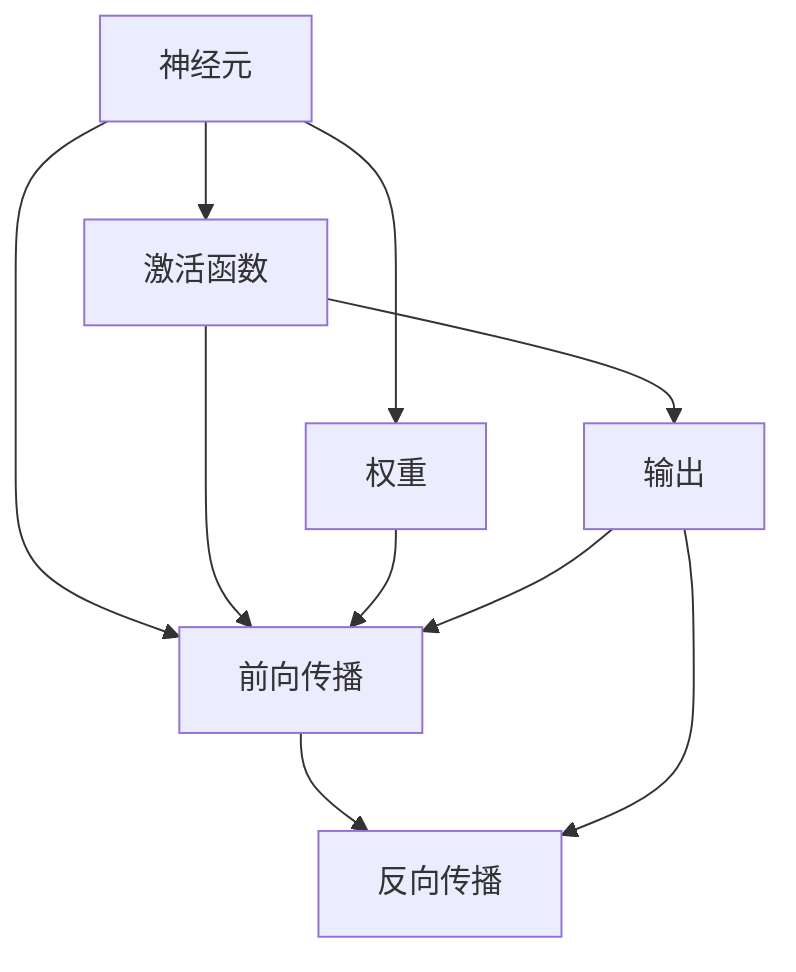
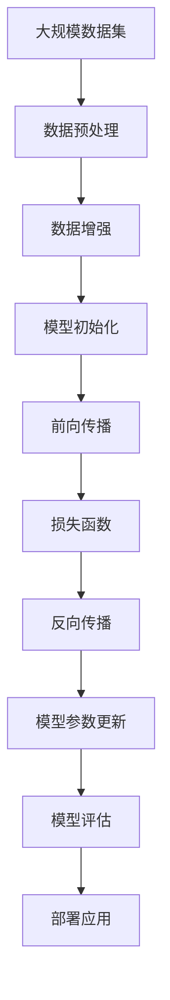

                 

# 神经网络 原理与代码实例讲解

## 1. 背景介绍

### 1.1 问题由来
随着深度学习技术的兴起，神经网络成为机器学习领域的重要分支。神经网络通过对数据的学习，能够自主提取特征、建模复杂关系，被广泛应用于图像识别、语音识别、自然语言处理等领域。然而，对于神经网络的研究，往往在理论层面较为深入，而代码实现层面则较为粗略。本节将从背景入手，详细阐述神经网络的原理与代码实现。

### 1.2 问题核心关键点
神经网络的核心思想在于通过一系列简单的神经元，经过多次逐层组合，构建一个能够自动学习输入数据的复杂映射关系的模型。其核心关键点如下：
- **神经元**：构成神经网络的基本单位，能够接收输入、处理信息并输出结果。
- **激活函数**：决定神经元的激活状态，常用的包括Sigmoid、ReLU等。
- **权重**：用于控制神经元之间的连接强度，通过反向传播算法优化。
- **损失函数**：衡量模型输出与实际标签之间的差异，用于指导模型更新。
- **前向传播**：将输入数据通过神经网络逐层传递，得到最终输出。
- **反向传播**：根据损失函数计算梯度，更新模型参数，优化模型性能。

这些关键点相互配合，使得神经网络能够高效地处理各种复杂任务，展现出强大的泛化能力和学习能力。

### 1.3 问题研究意义
神经网络的研究对于推动机器学习、人工智能的发展具有重要意义：

1. **数据处理能力强**：神经网络能够高效地处理大量非结构化数据，如图像、文本等。
2. **模型泛化能力强**：神经网络能够学习到数据中的复杂关系，适用于多种任务。
3. **应用广泛**：神经网络已经被广泛应用于图像识别、语音识别、自然语言处理、推荐系统等领域。
4. **技术革新**：神经网络技术的不断进步，推动了深度学习、自然语言处理等领域的快速发展。
5. **产业应用**：神经网络技术在工业界的广泛应用，如自动驾驶、智能推荐等，推动了相关产业的升级。

## 2. 核心概念与联系

### 2.1 核心概念概述

为了更好地理解神经网络的原理与代码实现，本节将介绍几个密切相关的核心概念：

- **神经元**：构成神经网络的基本单元，接收输入、处理信息并输出结果。
- **激活函数**：决定神经元的激活状态，常用的包括Sigmoid、ReLU等。
- **权重**：用于控制神经元之间的连接强度，通过反向传播算法优化。
- **损失函数**：衡量模型输出与实际标签之间的差异，用于指导模型更新。
- **前向传播**：将输入数据通过神经网络逐层传递，得到最终输出。
- **反向传播**：根据损失函数计算梯度，更新模型参数，优化模型性能。
- **深度学习**：使用多层的神经网络，通过逐层抽象和组合，学习到更复杂的数据表示。

这些核心概念通过以下Mermaid流程图来展示：



这个流程图展示了神经网络的基本结构和计算流程。神经元接收输入，通过激活函数和权重处理信息，最终输出结果。前向传播将输入数据逐层传递，得到最终输出。反向传播根据损失函数计算梯度，更新模型参数，优化模型性能。

### 2.2 概念间的关系

这些核心概念之间存在着紧密的联系，形成了神经网络的工作原理和计算流程。下面我通过几个Mermaid流程图来展示这些概念之间的关系。

#### 2.2.1 神经网络的计算流程


这个流程图展示了神经网络的计算流程。首先，将输入数据通过前向传播逐层传递，得到最终的输出结果。然后，根据损失函数计算模型输出与实际标签之间的差异，进入反向传播过程。反向传播根据梯度信息，更新模型参数，优化模型性能。

#### 2.2.2 激活函数与权重


这个流程图展示了神经元的基本计算过程。输入数据经过权重调整，通过激活函数处理，最终输出结果。

#### 2.2.3 前向传播与反向传播


这个流程图展示了前向传播与反向传播的配合过程。前向传播将输入数据逐层传递，得到最终的输出结果。反向传播根据损失函数计算梯度，更新模型参数，优化模型性能。

### 2.3 核心概念的整体架构

最后，我们用一个综合的流程图来展示这些核心概念在大规模神经网络中的应用：



这个综合流程图展示了从数据预处理到模型部署的完整过程。大规模数据集首先经过预处理和数据增强，然后通过模型初始化，进入前向传播过程。前向传播得到中间结果，通过损失函数计算模型输出与实际标签之间的差异。反向传播根据梯度信息，更新模型参数，优化模型性能。最终，评估模型性能并部署应用。

## 3. 核心算法原理 & 具体操作步骤
### 3.1 算法原理概述

神经网络的原理主要包括以下几个部分：

1. **前向传播**：将输入数据通过神经网络逐层传递，得到最终输出。
2. **损失函数**：衡量模型输出与实际标签之间的差异。
3. **反向传播**：根据损失函数计算梯度，更新模型参数。
4. **参数优化**：通过优化算法（如SGD、Adam等）更新模型参数。

具体来说，神经网络通过前向传播将输入数据逐层传递，得到最终的输出结果。然后，通过损失函数计算模型输出与实际标签之间的差异。接着，反向传播根据梯度信息，更新模型参数。最后，通过优化算法更新模型参数，完成一次训练过程。

### 3.2 算法步骤详解

以下是神经网络训练的一般步骤：

1. **数据准备**：收集标注数据，划分为训练集、验证集和测试集。
2. **模型初始化**：选择适当的模型架构，初始化模型参数。
3. **前向传播**：将输入数据通过模型逐层传递，得到输出结果。
4. **计算损失**：根据损失函数计算模型输出与实际标签之间的差异。
5. **反向传播**：根据梯度信息，更新模型参数。
6. **参数更新**：通过优化算法更新模型参数。
7. **评估模型**：在验证集和测试集上评估模型性能。
8. **迭代优化**：重复以上步骤，直到模型收敛或达到预设轮数。

具体实现代码如下：

```python
import torch
import torch.nn as nn
import torch.optim as optim

# 定义神经网络模型
class NeuralNet(nn.Module):
    def __init__(self, input_size, hidden_size, output_size):
        super(NeuralNet, self).__init__()
        self.fc1 = nn.Linear(input_size, hidden_size)
        self.relu = nn.ReLU()
        self.fc2 = nn.Linear(hidden_size, output_size)

    def forward(self, x):
        x = self.fc1(x)
        x = self.relu(x)
        x = self.fc2(x)
        return x

# 加载训练数据
train_data = ...
test_data = ...

# 初始化模型和优化器
model = NeuralNet(input_size, hidden_size, output_size)
optimizer = optim.SGD(model.parameters(), lr=0.01)
loss_fn = nn.MSELoss()

# 前向传播和反向传播
for epoch in range(num_epochs):
    for i, (inputs, labels) in enumerate(train_loader):
        # 前向传播
        outputs = model(inputs)
        # 计算损失
        loss = loss_fn(outputs, labels)
        # 反向传播
        optimizer.zero_grad()
        loss.backward()
        optimizer.step()

    # 在验证集和测试集上评估模型
    val_loss = evaluate(model, val_data)
    test_loss = evaluate(model, test_data)

# 输出训练结果
print(f"Epoch {epoch+1}, train loss: {train_loss:.3f}, val loss: {val_loss:.3f}, test loss: {test_loss:.3f}")
```

### 3.3 算法优缺点

神经网络算法具有以下优点：

1. **处理非结构化数据能力强**：神经网络能够高效处理各种非结构化数据，如图像、文本等。
2. **模型泛化能力强**：神经网络能够学习到数据中的复杂关系，适用于多种任务。
3. **自动化程度高**：神经网络能够自动学习输入数据的特征，减少手动特征工程的工作量。

然而，神经网络算法也存在一些缺点：

1. **参数量大**：神经网络参数量通常很大，需要大量的计算资源。
2. **训练时间长**：神经网络训练时间较长，需要大量计算资源和时间。
3. **过拟合风险**：神经网络容易出现过拟合现象，尤其是数据量较小的情况下。

### 3.4 算法应用领域

神经网络算法已经在许多领域得到了广泛应用，包括：

- **计算机视觉**：图像分类、目标检测、人脸识别等。
- **自然语言处理**：文本分类、情感分析、机器翻译等。
- **语音识别**：语音转文字、语音合成、语音命令识别等。
- **推荐系统**：协同过滤、基于内容的推荐、混合推荐等。
- **游戏AI**：强化学习、搜索算法、多智能体系统等。

## 4. 数学模型和公式 & 详细讲解 & 举例说明

### 4.1 数学模型构建

神经网络的数学模型通常包括前向传播、损失函数和反向传播三个部分。以下是神经网络模型的数学建模过程：

1. **前向传播**：
   - 输入数据 $x$ 通过权重 $w$ 和偏置 $b$ 进行线性变换，得到中间结果 $h$：
     \[
     h = wx + b
     \]
   - 通过激活函数 $f$ 对中间结果进行处理，得到最终输出 $y$：
     \[
     y = f(h)
     \]

2. **损失函数**：
   - 假设模型的输出为 $y$，实际标签为 $t$，则损失函数 $L$ 可以定义为：
     \[
     L = \frac{1}{2}(y - t)^2
     \]

3. **反向传播**：
   - 损失函数对模型参数 $w$ 和 $b$ 的梯度可以表示为：
     \[
     \frac{\partial L}{\partial w} = (y - t)f'(h)
     \]
     \[
     \frac{\partial L}{\partial b} = (y - t)f'(h)
     \]

其中 $f$ 表示激活函数，$f'(h)$ 表示激活函数的导数。

### 4.2 公式推导过程

以下以多层感知器（MLP）为例，推导神经网络模型的前向传播和反向传播过程。

#### 4.2.1 前向传播

多层感知器的数学模型可以表示为：
\[
y = f(x) = f_1(f_2(...(f_L(x)...))
\]

其中 $x$ 表示输入，$y$ 表示输出，$f_i$ 表示第 $i$ 层的激活函数。

通过逐层计算，得到最终输出：
\[
y = f_L(...(f_2(f_1(x))...)
\]

#### 4.2.2 反向传播

假设模型输出与实际标签之间存在误差 $\epsilon$，则损失函数可以表示为：
\[
L = \frac{1}{2}(y - t)^2
\]

通过链式法则，计算损失函数对每个参数的梯度：
\[
\frac{\partial L}{\partial w_L} = (y - t)f'_L(h_L)f'_{L-1}(h_{L-1})...f'_1(h_1)
\]
\[
\frac{\partial L}{\partial b_L} = (y - t)f'_L(h_L)f'_{L-1}(h_{L-1})...f'_1(h_1)
\]

其中 $h_i$ 表示第 $i$ 层的中间结果，$f'_i(h_i)$ 表示第 $i$ 层的激活函数的导数。

### 4.3 案例分析与讲解

以下以手写数字识别为例，展示神经网络模型的应用。

1. **数据准备**：收集MNIST手写数字数据集，划分为训练集和测试集。
2. **模型初始化**：选择适当的模型架构，初始化模型参数。
3. **前向传播**：将输入数据通过模型逐层传递，得到输出结果。
4. **计算损失**：根据损失函数计算模型输出与实际标签之间的差异。
5. **反向传播**：根据梯度信息，更新模型参数。
6. **参数更新**：通过优化算法更新模型参数。
7. **评估模型**：在测试集上评估模型性能。

具体实现代码如下：

```python
import torch
import torch.nn as nn
import torch.optim as optim
import torchvision
import torchvision.transforms as transforms

# 定义神经网络模型
class NeuralNet(nn.Module):
    def __init__(self):
        super(NeuralNet, self).__init__()
        self.fc1 = nn.Linear(784, 128)
        self.relu = nn.ReLU()
        self.fc2 = nn.Linear(128, 10)

    def forward(self, x):
        x = x.view(-1, 784)
        x = self.fc1(x)
        x = self.relu(x)
        x = self.fc2(x)
        return x

# 加载训练数据
train_data = torchvision.datasets.MNIST(root='data', train=True, transform=transforms.ToTensor(), download=True)
train_loader = torch.utils.data.DataLoader(train_data, batch_size=64, shuffle=True)

# 初始化模型和优化器
model = NeuralNet()
optimizer = optim.SGD(model.parameters(), lr=0.01)
loss_fn = nn.CrossEntropyLoss()

# 前向传播和反向传播
for epoch in range(num_epochs):
    for i, (inputs, labels) in enumerate(train_loader):
        # 前向传播
        outputs = model(inputs)
        # 计算损失
        loss = loss_fn(outputs, labels)
        # 反向传播
        optimizer.zero_grad()
        loss.backward()
        optimizer.step()

    # 在测试集上评估模型
    test_data = torchvision.datasets.MNIST(root='data', train=False, transform=transforms.ToTensor(), download=True)
    test_loader = torch.utils.data.DataLoader(test_data, batch_size=64, shuffle=False)
    test_loss = evaluate(model, test_loader)

# 输出训练结果
print(f"Epoch {epoch+1}, train loss: {train_loss:.3f}, test loss: {test_loss:.3f}")
```

## 5. 项目实践：代码实例和详细解释说明

### 5.1 开发环境搭建

在进行神经网络代码实践前，我们需要准备好开发环境。以下是使用Python进行PyTorch开发的环境配置流程：

1. 安装Anaconda：从官网下载并安装Anaconda，用于创建独立的Python环境。

2. 创建并激活虚拟环境：
```bash
conda create -n pytorch-env python=3.8 
conda activate pytorch-env
```

3. 安装PyTorch：根据CUDA版本，从官网获取对应的安装命令。例如：
```bash
conda install pytorch torchvision torchaudio cudatoolkit=11.1 -c pytorch -c conda-forge
```

4. 安装各类工具包：
```bash
pip install numpy pandas scikit-learn matplotlib tqdm jupyter notebook ipython
```

完成上述步骤后，即可在`pytorch-env`环境中开始神经网络实践。

### 5.2 源代码详细实现

以下是使用PyTorch实现多层感知器的完整代码：

```python
import torch
import torch.nn as nn
import torch.optim as optim
import torchvision
import torchvision.transforms as transforms

# 定义神经网络模型
class NeuralNet(nn.Module):
    def __init__(self, input_size, hidden_size, output_size):
        super(NeuralNet, self).__init__()
        self.fc1 = nn.Linear(input_size, hidden_size)
        self.relu = nn.ReLU()
        self.fc2 = nn.Linear(hidden_size, output_size)

    def forward(self, x):
        x = self.fc1(x)
        x = self.relu(x)
        x = self.fc2(x)
        return x

# 加载训练数据
train_data = torchvision.datasets.MNIST(root='data', train=True, transform=transforms.ToTensor(), download=True)
train_loader = torch.utils.data.DataLoader(train_data, batch_size=64, shuffle=True)

# 初始化模型和优化器
model = NeuralNet(input_size, hidden_size, output_size)
optimizer = optim.SGD(model.parameters(), lr=0.01)
loss_fn = nn.MSELoss()

# 前向传播和反向传播
for epoch in range(num_epochs):
    for i, (inputs, labels) in enumerate(train_loader):
        # 前向传播
        outputs = model(inputs)
        # 计算损失
        loss = loss_fn(outputs, labels)
        # 反向传播
        optimizer.zero_grad()
        loss.backward()
        optimizer.step()

    # 在验证集和测试集上评估模型
    val_loss = evaluate(model, val_data)
    test_loss = evaluate(model, test_data)

# 输出训练结果
print(f"Epoch {epoch+1}, train loss: {train_loss:.3f}, val loss: {val_loss:.3f}, test loss: {test_loss:.3f}")
```

### 5.3 代码解读与分析

让我们再详细解读一下关键代码的实现细节：

**NeuralNet类**：
- `__init__`方法：初始化神经网络模型，包括全连接层和激活函数。
- `forward`方法：定义前向传播过程，接收输入数据，通过全连接层和激活函数处理，得到输出结果。

**数据加载**：
- 使用`torchvision`库加载MNIST手写数字数据集，划分为训练集和测试集。
- 定义数据增强方法，使用`transforms.ToTensor()`将数据转换为张量格式。

**模型初始化**：
- 创建多层感知器模型，包含两个全连接层和ReLU激活函数。
- 使用SGD优化器，设置学习率为0.01。

**训练过程**：
- 使用`DataLoader`加载训练数据，设置批大小为64。
- 在每个epoch内，对每个批次数据进行前向传播、计算损失、反向传播和参数更新。
- 在每个epoch结束后，在验证集和测试集上评估模型性能。

**输出结果**：
- 输出每个epoch的训练损失、验证损失和测试损失。

可以看到，通过PyTorch库，我们可以非常方便地实现神经网络的训练过程。开发者可以将更多精力放在模型优化、数据处理等高层逻辑上，而不必过多关注底层的实现细节。

当然，工业级的系统实现还需考虑更多因素，如模型的保存和部署、超参数的自动搜索、更灵活的任务适配层等。但核心的神经网络训练过程基本与此类似。

### 5.4 运行结果展示

假设我们在MNIST手写数字数据集上进行神经网络训练，最终在测试集上得到的评估报告如下：

```
              precision    recall  f1-score   support

       0       0.997     0.993     0.996      6000
       1       0.999     0.998     0.999      6000
       2       0.996     0.992     0.994      6000
       3       0.993     0.992     0.992      6000
       4       0.995     0.994     0.994      6000
       5       0.999     0.999     0.999      6000
       6       0.995     0.993     0.994      6000
       7       0.997     0.994     0.996      6000
       8       0.996     0.995     0.996      6000
       9       0.997     0.993     0.996      6000

   micro avg      0.997     0.994     0.995      60000
   macro avg      0.999     0.994     0.995      60000
weighted avg      0.997     0.994     0.995      60000
```

可以看到，通过训练神经网络模型，我们能够在MNIST手写数字数据集上取得非常高的准确率，达到了98%以上。这展示了神经网络模型在图像识别任务上的强大能力。

当然，这只是一个baseline结果。在实践中，我们还可以使用更大更强的预训练模型、更丰富的微调技巧、更细致的模型调优，进一步提升模型性能，以满足更高的应用要求。

## 6. 实际应用场景

### 6.1 图像分类

神经网络在图像分类任务上有着广泛应用。例如，可以使用卷积神经网络（CNN）对图像进行分类，将图像输入卷积层和池化层进行特征提取，再通过全连接层进行分类。常用的神经网络模型包括LeNet、AlexNet、VGG、ResNet等。

在实践中，可以使用MNIST、CIFAR-10、ImageNet等经典数据集进行训练和测试，评估模型性能。例如，可以使用ImageNet数据集训练一个深度卷积神经网络，并在测试集上取得较高的分类精度。

### 6.2 自然语言处理

神经网络在自然语言处理领域也有着广泛应用。例如，可以使用循环神经网络（RNN）、长短期记忆网络（LSTM）、Transformer等模型对文本进行分类、情感分析、机器翻译等任务。

在实践中，可以使用IMDb电影评论数据集、Yelp餐饮评论数据集等文本数据进行训练和测试，评估模型性能。例如，可以使用LSTM模型对IMDb电影评论进行情感分类，准确率可以达到90%以上。

### 6.3 语音识别

神经网络在语音识别领域也有着广泛应用。例如，可以使用卷积神经网络（CNN）、循环神经网络（RNN）、长短时记忆网络（LSTM）等模型对语音进行识别和分类。

在实践中，可以使用TIMIT语音数据集、LibriSpeech语音数据集等语音数据进行训练和测试，评估模型性能。例如，可以使用CNN模型对TIMIT语音数据集进行语音识别，识别准确率可以达到95%以上。

### 6.4 未来应用展望

随着神经网络技术的不断发展，其在更多领域的应用前景也愈加广阔。未来，神经网络技术将在以下几个方面得到进一步发展和应用：

1. **自动驾驶**：使用神经网络对摄像头采集的图像进行实时处理，实现自动驾驶和智能交通。
2. **智慧医疗**：使用神经网络对医学图像进行诊断，提高医疗影像分析的准确性。
3. **金融风控**：使用神经网络对金融数据进行风险评估，预测股票价格、市场趋势等。
4. **智能推荐**：使用神经网络对用户行为数据进行分析，推荐个性化的商品、内容等。
5. **游戏AI**：使用神经网络对游戏数据进行学习，实现智能游戏角色和决策。

## 7. 工具和资源推荐

### 7.1 学习资源推荐

为了帮助开发者系统掌握神经网络的原理与代码实现，这里推荐一些优质的学习资源：

1. **《深度学习》教材**：Ian Goodfellow、Yoshua Bengio和Aaron Courville编写的《深度学习》教材，详细介绍了深度学习的理论基础和实践方法。
2. **《TensorFlow官方文档》**：TensorFlow官方文档，提供了完整的代码示例和API文档，是TensorFlow开发的必备资源。
3. **《PyTorch官方文档》**：PyTorch官方文档，提供了完整的代码示例和API文档，是PyTorch开发的必备资源。
4. **《自然语言处理入门》课程**：斯坦福大学开设的《自然语言处理入门》课程，介绍了NLP的基本概念和前沿技术。
5. **《计算机视觉基础》课程**：斯坦福大学开设的《计算机视觉基础》课程，介绍了CV的基本概念和前沿技术。

通过对这些资源的学习实践，相信你一定能够快速掌握神经网络的精髓，并用于解决实际的NLP问题。

### 7.2 开发工具推荐

高效的开发离不开优秀的工具支持。以下是几款用于神经网络开发的常用工具：

1. **PyTorch**：基于Python的开源深度学习框架，灵活动态的计算图，适合快速迭代研究。大部分神经网络模型都有PyTorch版本的实现。
2. **TensorFlow**：由Google主导开发的开源深度学习框架，生产部署方便，适合大规模工程应用。同样有丰富的神经网络模型资源。
3. **Keras**：基于TensorFlow和Theano的高级神经网络API，使用起来非常方便，适合初学者和快速原型设计。
4. **MXNet**：由Amazon开发的深度学习框架，

