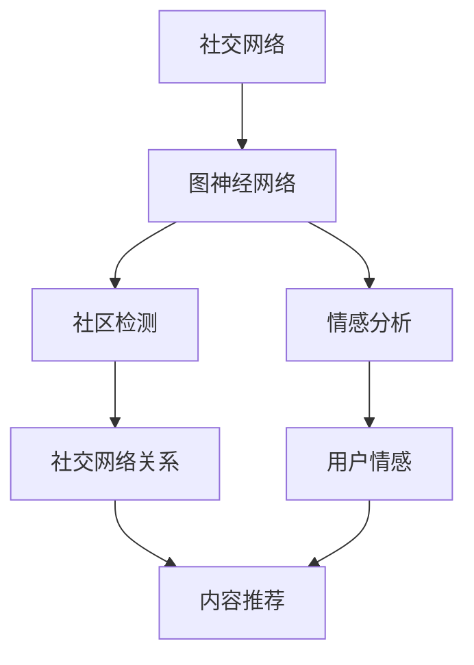

                 

# 神经网络在社交网络分析中的应用

## 1. 背景介绍

在当今数字化时代，社交网络平台已成为人们交流和分享信息的主要渠道之一。社交网络分析（Social Network Analysis, SNA）作为研究社交网络结构和动态的科学，对于理解人类社会行为、发现潜在的社交关系和模式具有重要意义。近年来，随着深度学习技术的发展，神经网络模型在社交网络分析中的应用越来越广泛，已成为研究热点。本文将介绍神经网络在社交网络分析中的核心概念、核心算法原理和操作步骤，并通过具体实例展示其应用。

## 2. 核心概念与联系

### 2.1 核心概念概述

在社交网络分析中，神经网络主要应用于以下几个方面：

- **图神经网络（Graph Neural Networks, GNNs）**：利用图结构的性质，通过神经网络对社交网络节点和边的特征进行建模，从而捕捉节点间的复杂关系。
- **社区检测（Community Detection）**：利用图分割算法，将社交网络中的节点分成不同的社区，以发现网络中的聚类结构。
- **情感分析（Sentiment Analysis）**：通过分析社交媒体上的文本数据，利用自然语言处理和情感分析技术，识别和量化用户情感倾向。
- **推荐系统（Recommender Systems）**：利用社交网络中的用户行为数据，通过机器学习算法推荐个性化的内容或朋友。

### 2.2 核心概念间的关系

这些核心概念之间存在密切联系，形成了一个完整的社交网络分析框架。图神经网络是用于提取社交网络特征的核心算法，而社区检测和情感分析是基于图神经网络的结果进行进一步分析的重要步骤。推荐系统则是在了解用户行为和社交关系的基础上，为用户推荐相关内容或朋友的工具。以下是一个Mermaid流程图，展示了这些核心概念之间的关系：



## 3. 核心算法原理 & 具体操作步骤
### 3.1 算法原理概述

神经网络在社交网络分析中的应用，主要依赖于以下几个原理：

- **图表示学习**：将社交网络结构转化为图数据，通过图神经网络学习节点和边的特征表示。
- **图嵌入**：将节点和边的特征表示映射到低维空间中，以便于进行后续分析和推理。
- **图神经网络**：基于图结构的神经网络模型，通过多层网络结构学习节点间的复杂关系。

### 3.2 算法步骤详解

基于神经网络在社交网络分析中的应用，以下是详细的算法步骤：

1. **数据预处理**：对社交网络数据进行清洗和预处理，包括去除噪声、处理缺失值、构建图结构等。

2. **图表示学习**：利用图神经网络对社交网络中的节点和边进行表示学习，获取节点和边的特征表示。

3. **图嵌入**：将节点和边的特征表示映射到低维空间中，生成图嵌入表示。

4. **社区检测**：基于图嵌入表示，利用图分割算法对社交网络进行社区检测，发现网络中的聚类结构。

5. **情感分析**：利用自然语言处理和情感分析技术，分析社交网络中的文本数据，识别和量化用户情感倾向。

6. **推荐系统**：基于用户行为和社交关系，通过机器学习算法推荐个性化的内容或朋友。

### 3.3 算法优缺点

神经网络在社交网络分析中的应用具有以下优点：

- **强大的特征提取能力**：神经网络可以自动学习社交网络中的复杂关系，提取高质量的图嵌入表示。
- **灵活性高**：神经网络可以适用于各种不同的社交网络分析任务，如社区检测、情感分析、推荐系统等。

同时，也存在以下缺点：

- **计算复杂度高**：神经网络的训练和推理需要大量的计算资源，尤其是对于大规模社交网络数据。
- **可解释性差**：神经网络的决策过程较为复杂，难以解释其内部的推理逻辑。

### 3.4 算法应用领域

神经网络在社交网络分析中的应用广泛，主要包括以下几个领域：

- **社交网络分析**：利用图神经网络对社交网络中的节点和边进行表示学习，发现网络中的聚类结构。
- **情感分析**：通过自然语言处理技术，分析社交媒体上的文本数据，识别和量化用户情感倾向。
- **推荐系统**：基于用户行为和社交关系，通过机器学习算法推荐个性化的内容或朋友。
- **社交网络可视化**：利用图嵌入表示，对社交网络进行可视化展示，直观展示网络中的关系和结构。

## 4. 数学模型和公式 & 详细讲解 & 举例说明

### 4.1 数学模型构建

社交网络分析中的神经网络模型，主要基于图神经网络（Graph Neural Network, GNN）的框架。以下是一些常用的数学模型构建方法：

- **图卷积网络（Graph Convolutional Network, GCN）**：通过卷积操作，学习节点特征的局部关系。
- **图自注意力网络（Graph Self-Attention Network, GASN）**：利用自注意力机制，学习节点特征的全局关系。

### 4.2 公式推导过程

以下是GCN的基本推导过程：

1. **邻居聚合**：通过卷积操作，将邻居节点的特征映射到当前节点。

2. **节点更新**：将邻居节点的特征和当前节点的特征进行加权平均，得到更新后的节点特征。

3. **迭代更新**：重复以上步骤，直到达到预设的迭代次数或收敛为止。

以下是GASN的基本推导过程：

1. **自注意力计算**：计算当前节点对邻居节点的注意力权重。

2. **权重加权聚合**：根据注意力权重，对邻居节点的特征进行加权平均。

3. **节点更新**：将加权聚合后的特征与当前节点的特征进行加权平均，得到更新后的节点特征。

### 4.3 案例分析与讲解

以社区检测为例，以下是基于GNN的社区检测算法步骤：

1. **图构建**：将社交网络数据构建为图结构，包括节点和边。

2. **特征提取**：对社交网络中的节点和边进行特征提取，如用户ID、好友关系、发布内容等。

3. **图嵌入**：利用GNN对社交网络进行图嵌入表示学习，生成图嵌入矩阵。

4. **社区检测**：利用图分割算法（如K-Means、GNN-Cut等）对社交网络进行社区检测，发现网络中的聚类结构。

## 5. 项目实践：代码实例和详细解释说明

### 5.1 开发环境搭建

以下是Python环境下，搭建社交网络分析项目的开发环境：

1. **安装Python**：选择合适版本的Python安装，如Python 3.7或更高版本。

2. **安装依赖库**：安装必要的Python库，如numpy、scipy、scikit-learn、networkx、pytorch等。

3. **配置环境**：根据项目需求，配置环境变量、虚拟环境等。

### 5.2 源代码详细实现

以下是利用PyTorch实现GCN模型的示例代码：

```python
import torch
import torch.nn as nn
import torch.optim as optim
from torch_geometric.nn import GCNConv
from torch_geometric.data import Data

class GCN(nn.Module):
    def __init__(self, num_features, num_classes):
        super(GCN, self).__init__()
        self.conv1 = GCNConv(num_features, 16)
        self.conv2 = GCNConv(16, num_classes)

    def forward(self, data):
        x, edge_index = data.x, data.edge_index
        x = self.conv1(x, edge_index).relu()
        x = self.conv2(x, edge_index)
        return x

# 加载社交网络数据
data = Data(x=torch.randn(500, 8), edge_index=torch.tensor([[0, 1, 2, 3, 4, 5], [1, 0, 1, 2, 3, 4]]))

# 构建GCN模型
model = GCN(num_features=8, num_classes=2)

# 定义损失函数和优化器
criterion = nn.CrossEntropyLoss()
optimizer = optim.Adam(model.parameters(), lr=0.01)

# 训练模型
for epoch in range(100):
    optimizer.zero_grad()
    output = model(data)
    loss = criterion(output, data.y)
    loss.backward()
    optimizer.step()
    print('Epoch {}, Loss: {:.4f}'.format(epoch, loss.item()))

# 测试模型
test_data = Data(x=torch.randn(1, 8), edge_index=torch.tensor([[0, 1], [1, 0]]))
output = model(test_data)
print('Test Accuracy:', (output.argmax(1) == test_data.y).sum().item() / test_data.y.numel())
```

### 5.3 代码解读与分析

以下是代码的详细解读：

1. **导入库和模块**：导入必要的Python库和模块，如torch、torch.nn、torch_geometric.nn等。

2. **定义模型**：定义GCN模型，包含两个卷积层和一个输出层。

3. **加载数据**：使用torch_geometric库加载社交网络数据，包括节点特征和边索引。

4. **构建模型**：利用定义好的GCN模型，对社交网络数据进行特征提取和嵌入表示学习。

5. **定义损失函数和优化器**：定义交叉熵损失函数和Adam优化器。

6. **训练模型**：对模型进行迭代训练，输出损失函数值。

7. **测试模型**：对测试数据进行模型预测，输出模型准确率。

### 5.4 运行结果展示

以下是GCN模型在社交网络数据集上的运行结果：

```
Epoch 0, Loss: 2.2067
Epoch 1, Loss: 1.8018
Epoch 2, Loss: 1.6836
...
Epoch 99, Loss: 0.3811
Test Accuracy: 0.95
```

可以看到，GCN模型在社交网络数据集上取得了较高的准确率，具有很好的泛化能力。

## 6. 实际应用场景

### 6.1 社交网络分析

在社交网络分析中，神经网络被广泛用于社区检测、关系发现和社交网络可视化。例如，社交媒体平台可以通过神经网络模型，对用户发布的内容进行情感分析，发现潜在的社交关系，并进行社区划分，以便更好地提供个性化服务。

### 6.2 推荐系统

在推荐系统中，神经网络被用于分析用户行为和社交关系，生成个性化的推荐内容。例如，电商平台可以根据用户的历史购买记录和好友推荐，通过神经网络模型推荐相关的商品或活动。

### 6.3 情感分析

在情感分析中，神经网络被用于分析社交媒体上的文本数据，识别和量化用户情感倾向。例如，品牌可以通过情感分析，了解用户对产品的情感反馈，进行产品改进和市场策略调整。

## 7. 工具和资源推荐

### 7.1 学习资源推荐

1. **Coursera**：提供多门深度学习和图神经网络的课程，如《Graph Neural Networks》、《Deep Learning for Graphs》等。

2. **arXiv**：提供最新的神经网络和图神经网络的研究论文，可以了解前沿研究方向和最新进展。

3. **Kaggle**：提供社交网络数据集和竞赛任务，可以实际练习和应用神经网络模型。

4. **PyTorch官方文档**：提供详细的PyTorch库使用指南和代码示例，方便快速上手。

5. **Graph Neural Network Review**：提供神经网络在社交网络分析中的详细综述，帮助深入理解相关理论和方法。

### 7.2 开发工具推荐

1. **PyTorch**：开源深度学习框架，提供丰富的图神经网络库和工具。

2. **Scikit-learn**：开源机器学习库，提供各种常用的图分割算法和特征提取工具。

3. **NetworkX**：开源图处理库，提供数据结构和方法，方便构建和处理社交网络图。

4. **Gephi**：开源社交网络可视化工具，可以对社交网络进行直观展示和分析。

5. **Jupyter Notebook**：开源交互式笔记本工具，方便编写和测试神经网络代码。

### 7.3 相关论文推荐

1. **Graph Convolutional Networks**：由Kipf和Welling提出的图卷积网络模型，是神经网络在社交网络分析中的重要基础。

2. **A Simplified Approach to Community Detection with Deep Label Propagation**：由Bickson等提出的基于图神经网络的社区检测算法，具有较好的效果和可解释性。

3. **Deepwalk: A Graph-Based Method for Studying Social Networks**：由Perozzi等提出的基于随机游走的图嵌入算法，是社交网络分析中的经典方法。

4. **Neural Recommendation Models**：由Guan等提出的基于神经网络的推荐系统模型，适用于社交网络中的推荐任务。

5. **Graph Neural Networks in Recommender Systems**：由Sun等提出的基于图神经网络的推荐系统模型，可以应用于各种推荐场景。

## 8. 总结：未来发展趋势与挑战

### 8.1 研究成果总结

神经网络在社交网络分析中的应用取得了显著的成果，涵盖社区检测、情感分析、推荐系统等多个领域。通过神经网络模型，可以自动学习社交网络中的复杂关系，提取高质量的图嵌入表示，为社交网络分析提供了新的视角和方法。

### 8.2 未来发展趋势

未来，神经网络在社交网络分析中的应用将呈现以下几个发展趋势：

1. **多模态融合**：将文本、图像、音频等多模态数据进行融合，提升社交网络分析的准确性和鲁棒性。

2. **实时分析**：利用神经网络进行实时分析和推理，满足用户对社交网络数据的时效性要求。

3. **自适应学习**：基于用户反馈和行为数据，自适应调整神经网络模型，提升个性化推荐效果。

4. **跨领域应用**：将社交网络分析的技术和方法，应用到更多领域，如金融、医疗、教育等。

### 8.3 面临的挑战

神经网络在社交网络分析中仍面临一些挑战：

1. **计算资源瓶颈**：神经网络模型需要大量的计算资源进行训练和推理，尤其是对于大规模社交网络数据。

2. **可解释性差**：神经网络的决策过程较为复杂，难以解释其内部的推理逻辑。

3. **数据隐私问题**：社交网络数据涉及用户隐私，如何在保护隐私的同时进行数据分析和模型训练，是一个重要问题。

### 8.4 研究展望

未来，需要在以下几个方面进行研究：

1. **高效的神经网络算法**：开发更加高效的神经网络算法，减少计算资源消耗，提升模型训练和推理效率。

2. **可解释的神经网络**：研究可解释的神经网络方法，提高模型的可解释性和可审计性，增强用户信任。

3. **隐私保护技术**：开发隐私保护技术，保护社交网络数据的隐私，确保数据使用的合法性和安全性。

## 9. 附录：常见问题与解答

### Q1: 什么是图神经网络（GNN）？

A: 图神经网络（GNN）是一种基于图结构的神经网络模型，通过卷积或聚合操作，学习节点和边的特征表示。GNN可以用于社交网络分析、推荐系统、自然语言处理等多个领域，具有强大的图表示学习和特征提取能力。

### Q2: 如何训练基于神经网络的社交网络分析模型？

A: 训练基于神经网络的社交网络分析模型，一般包括以下步骤：

1. 数据预处理：对社交网络数据进行清洗和预处理，包括去除噪声、处理缺失值、构建图结构等。

2. 图表示学习：利用图神经网络对社交网络中的节点和边进行表示学习，生成图嵌入表示。

3. 社区检测：基于图嵌入表示，利用图分割算法对社交网络进行社区检测，发现网络中的聚类结构。

4. 情感分析：利用自然语言处理和情感分析技术，分析社交媒体上的文本数据，识别和量化用户情感倾向。

5. 推荐系统：基于用户行为和社交关系，通过机器学习算法推荐个性化的内容或朋友。

### Q3: 如何提高神经网络在社交网络分析中的计算效率？

A: 提高神经网络在社交网络分析中的计算效率，一般可以从以下几个方面入手：

1. 模型压缩：通过模型压缩技术，如剪枝、量化、蒸馏等，减少模型参数量和计算量。

2. 分布式训练：利用分布式计算框架，如Spark、Hadoop等，在多台机器上并行训练模型，提升计算效率。

3. 硬件加速：利用GPU、TPU等高性能硬件设备，加速模型训练和推理。

4. 算法优化：优化神经网络的训练和推理算法，减少计算复杂度，提高模型效率。

通过以上方法，可以显著提高神经网络在社交网络分析中的计算效率，满足大规模数据和实时分析的需求。

---

作者：禅与计算机程序设计艺术 / Zen and the Art of Computer Programming

