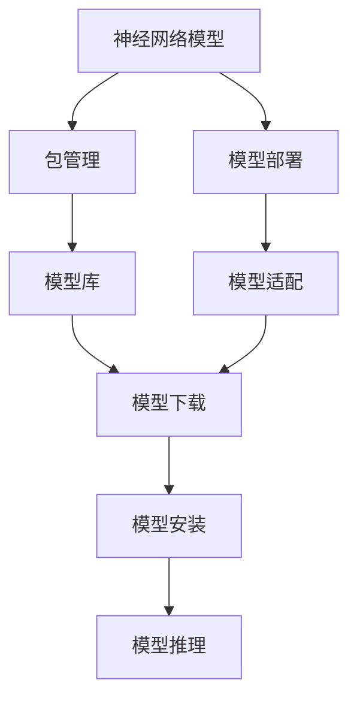
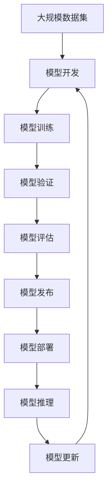

                 

# 神经网络模型的包管理和部署新挑战

> 关键词：包管理,神经网络,模型部署,人工智能,工具推荐,未来展望

## 1. 背景介绍

### 1.1 问题由来

近年来，随着深度学习技术的发展，神经网络模型（Neural Network Models, NN Models）在各个领域得到了广泛的应用，如计算机视觉、自然语言处理、语音识别等。然而，神经网络模型的构建和部署变得越来越复杂，使得开发者需要面对诸多挑战，如模型库的管理、代码的跨平台兼容性、性能优化等。包管理（Package Management）和模型部署（Model Deployment）成为了人工智能领域的重要研究课题。

### 1.2 问题核心关键点

神经网络模型的包管理和部署主要包括以下几个关键点：

- **模型版本控制**：如何管理不同版本的神经网络模型，确保模型的兼容性，避免因版本更新带来的兼容性问题。
- **跨平台兼容性**：如何确保神经网络模型在不同操作系统、硬件设备上的兼容性，以便在不同环境中部署。
- **模型性能优化**：如何在保证模型性能的同时，优化模型的运行速度、内存占用等指标，以便在大规模数据处理和实时推理等场景中高效运行。
- **模型版本迭代**：如何在模型迭代过程中，快速部署新模型，以避免影响现有应用的稳定性。

这些问题直接关系到神经网络模型能否被广泛应用于各个场景，因此需要系统地进行管理和优化。

### 1.3 问题研究意义

神经网络模型的包管理和部署对于推动人工智能技术落地应用具有重要意义：

1. **降低开发成本**：通过有效的包管理和部署工具，可以减少模型开发和部署的复杂性，降低开发和运维成本。
2. **提高模型性能**：优化模型的性能和兼容性，确保其在不同环境和场景中高效运行。
3. **加速模型迭代**：快速部署新模型，加速模型的迭代和更新，提升模型应用的灵活性和适应性。
4. **提升应用质量**：通过有效的模型管理和部署，确保应用的质量和稳定性，减少因模型版本冲突带来的问题。
5. **促进技术普及**：推动人工智能技术在各个领域的普及和应用，为各个行业带来新的机遇和变革。

## 2. 核心概念与联系

### 2.1 核心概念概述

为更好地理解神经网络模型的包管理和部署，本节将介绍几个密切相关的核心概念：

- **神经网络模型（Neural Network Models, NN Models）**：由一系列神经元（Neurons）组成的计算模型，用于模拟生物神经元的工作原理，在深度学习中广泛应用。
- **包管理（Package Management）**：管理软件包（如神经网络模型）的工具和技术，包括版本控制、依赖管理、发布和安装等。
- **模型部署（Model Deployment）**：将神经网络模型部署到目标环境（如服务器、移动设备等）的过程，包括模型加载、推理等操作。
- **模型库（Model Zoo）**：存储和管理神经网络模型的仓库，如TensorFlow Hub、PyTorch Hub等。
- **模型适配（Model Adaptation）**：根据具体应用场景，对神经网络模型进行微调和优化，以满足特定的需求。
- **跨平台兼容性（Cross-Platform Compatibility）**：确保神经网络模型在不同操作系统、硬件设备上的兼容性。

这些核心概念之间的逻辑关系可以通过以下Mermaid流程图来展示：



这个流程图展示了大规模神经网络模型的构建、包管理、部署和推理的全过程。

### 2.2 概念间的关系

这些核心概念之间存在着紧密的联系，形成了神经网络模型管理和部署的完整生态系统。下面我们通过几个Mermaid流程图来展示这些概念之间的关系。

#### 2.2.1 神经网络模型的生命周期


这个流程图展示了神经网络模型的生命周期，包括模型开发、训练、验证、评估、发布、部署和更新等阶段。

#### 2.2.2 模型适配与部署的关系


这个流程图展示了模型适配与部署的相互依赖关系，适配后的模型需要重新部署以确保性能和兼容性，而部署后的模型也需要不断适配和优化以提升性能。

#### 2.2.3 包管理和模型部署的集成


这个流程图展示了包管理和模型部署的集成过程，包括模型版本控制和依赖管理等关键步骤。

### 2.3 核心概念的整体架构

最后，我们用一个综合的流程图来展示这些核心概念在大规模神经网络模型管理和部署过程中的整体架构：



这个综合流程图展示了从数据集到模型发布和部署的全过程，包括模型开发、训练、验证、评估、发布、部署和更新等阶段。

## 3. 核心算法原理 & 具体操作步骤

### 3.1 算法原理概述

神经网络模型的包管理和部署涉及到多个领域的知识，包括软件工程、操作系统、计算机网络等。本文主要从模型适配和部署的角度，介绍常用的算法原理和具体操作步骤。

### 3.2 算法步骤详解

神经网络模型的适配和部署主要包括以下几个步骤：

**Step 1: 选择合适的模型版本**

在选择模型版本时，需要考虑以下因素：

1. **模型兼容性**：确保选择的模型版本与目标环境兼容。
2. **模型性能**：选择性能最优的模型版本，以确保在推理时的高效性。
3. **模型功能**：根据具体需求选择具备特定功能的模型版本。

**Step 2: 下载和管理模型库**

下载和管理模型库的步骤如下：

1. **选择模型库**：根据需求选择适合的模型库，如TensorFlow Hub、PyTorch Hub等。
2. **下载模型**：使用模型库提供的API或命令，下载选择的模型版本。
3. **版本控制**：使用版本控制工具（如git）管理下载的模型版本，确保不同版本之间的兼容性。

**Step 3: 安装和配置模型**

在安装和配置模型的过程中，需要考虑以下因素：

1. **依赖管理**：确保目标环境已安装所有模型所需的依赖库。
2. **环境配置**：根据模型要求，配置环境变量、库路径等。
3. **模型适配**：根据目标环境适配模型，确保模型在不同设备上的兼容性。

**Step 4: 部署和推理模型**

部署和推理模型的步骤包括：

1. **模型加载**：加载下载的模型文件，确保模型在目标环境中的加载正确。
2. **模型推理**：使用模型进行推理操作，获取模型的预测结果。
3. **模型优化**：根据实际需求，对模型进行优化，如量化、剪枝等，以提升性能和资源利用率。

### 3.3 算法优缺点

神经网络模型的适配和部署具有以下优点：

1. **模型复用性高**：通过模型库和包管理工具，可以轻松复用现有模型，减少重复开发工作量。
2. **部署高效**：使用模型库和自动化工具，可以自动化部署模型，提高部署效率。
3. **模型更新灵活**：通过版本控制工具，可以灵活管理模型版本，快速部署新模型。

同时，神经网络模型的适配和部署也存在以下缺点：

1. **依赖复杂**：神经网络模型的依赖库和环境配置复杂，容易出现兼容性问题。
2. **模型更新困难**：模型库和模型版本更新频繁，需要不断跟踪和适配新版本的变化。
3. **性能优化难度大**：神经网络模型的性能优化需要大量实验和调试，成本高。

### 3.4 算法应用领域

神经网络模型的适配和部署在以下几个领域得到了广泛应用：

1. **计算机视觉**：在图像分类、目标检测、图像分割等任务中，使用深度学习模型进行图像识别和分析。
2. **自然语言处理**：在文本分类、机器翻译、语音识别等任务中，使用深度学习模型进行自然语言处理。
3. **智能推荐**：在推荐系统、个性化搜索等任务中，使用深度学习模型进行用户行为分析和推荐。
4. **智能制造**：在工业检测、质量控制、设备预测维护等任务中，使用深度学习模型进行工业数据分析。
5. **智慧医疗**：在疾病诊断、影像分析、基因组学等任务中，使用深度学习模型进行医疗数据分析和决策。

这些领域的应用，展示了神经网络模型适配和部署的重要性和广泛性。

## 4. 数学模型和公式 & 详细讲解 & 举例说明

### 4.1 数学模型构建

神经网络模型的适配和部署涉及到多个领域的知识，包括软件工程、操作系统、计算机网络等。本文主要从模型适配和部署的角度，介绍常用的算法原理和具体操作步骤。

### 4.2 公式推导过程

以下我们以卷积神经网络（Convolutional Neural Network, CNN）为例，推导模型适配和部署的数学模型。

卷积神经网络通常由卷积层、池化层、全连接层等组成。模型的输入为一张$n \times n \times c$的图像，输出为一个$n' \times n' \times m'$的特征图，其中$n$和$n'$分别为输入和输出的宽度和高度，$c$和$m'$分别为输入和输出的通道数。假设模型的卷积核大小为$k \times k$，步长为$s$，则卷积层的输出大小为$\frac{n - k + 2p}{s} + 1$，其中$p$为填充大小。

### 4.3 案例分析与讲解

以一个简单的图像分类任务为例，展示如何适配和部署卷积神经网络模型：

假设我们有一个包含1000个类别的图像分类任务，使用了预训练的卷积神经网络模型。我们需要对模型进行适配，以使其在特定类别上表现更好。适配步骤如下：

1. **数据准备**：准备训练集和验证集，分别包含不同类别的大量图像。
2. **模型初始化**：加载预训练的卷积神经网络模型，并在模型顶层添加分类器。
3. **适配训练**：使用训练集对模型进行有监督训练，优化模型参数以适应特定类别。
4. **模型评估**：在验证集上评估模型性能，选择合适的模型版本。
5. **部署和推理**：将适配后的模型部署到目标环境，使用模型进行推理操作，获取预测结果。

通过这些步骤，我们可以将预训练的卷积神经网络模型适配和部署到特定的图像分类任务中，提升模型的性能和兼容性。

## 5. 项目实践：代码实例和详细解释说明

### 5.1 开发环境搭建

在进行神经网络模型的适配和部署实践前，我们需要准备好开发环境。以下是使用Python进行TensorFlow和Keras开发的环境配置流程：

1. 安装Anaconda：从官网下载并安装Anaconda，用于创建独立的Python环境。

2. 创建并激活虚拟环境：
```bash
conda create -n tf-env python=3.8 
conda activate tf-env
```

3. 安装TensorFlow：根据CUDA版本，从官网获取对应的安装命令。例如：
```bash
conda install tensorflow=2.8 -c pytorch -c conda-forge
```

4. 安装Keras：
```bash
pip install keras
```

5. 安装各类工具包：
```bash
pip install numpy pandas scikit-learn matplotlib tqdm jupyter notebook ipython
```

完成上述步骤后，即可在`tf-env`环境中开始适配和部署实践。

### 5.2 源代码详细实现

下面我们以卷积神经网络模型适配和部署为例，给出使用TensorFlow和Keras进行适配和部署的PyTorch代码实现。

首先，定义适配任务的数据处理函数：

```python
from tensorflow.keras.preprocessing.image import ImageDataGenerator
from tensorflow.keras.preprocessing import image

def load_and_preprocess_image(file_path):
    img = image.load_img(file_path, target_size=(224, 224))
    img = image.img_to_array(img)
    img = img / 255.0
    img = tf.expand_dims(img, 0)
    return img

# 加载数据集
train_datagen = ImageDataGenerator(rescale=1./255, shear_range=0.2, zoom_range=0.2, horizontal_flip=True)
test_datagen = ImageDataGenerator(rescale=1./255)
train_generator = train_datagen.flow_from_directory('train_dir', target_size=(224, 224), batch_size=32, class_mode='categorical')
test_generator = test_datagen.flow_from_directory('test_dir', target_size=(224, 224), batch_size=32, class_mode='categorical')
```

然后，定义模型和适配器：

```python
from tensorflow.keras.applications import VGG16
from tensorflow.keras.models import Model

# 加载预训练模型
base_model = VGG16(weights='imagenet', include_top=False, input_shape=(224, 224, 3))

# 添加分类器
classifier = base_model.get_layer('block5_pooling')
num_classes = 10
x = classifier(base_model.input)
x = tf.keras.layers.Dense(256, activation='relu')(x)
x = tf.keras.layers.Dropout(0.5)(x)
x = tf.keras.layers.Dense(num_classes, activation='softmax')(x)
model = Model(base_model.input, x)

# 适配器
adapter = tf.keras.layers.experimental.Adapters.adapt(base_model, model, classifier)
```

接着，定义训练和评估函数：

```python
from tensorflow.keras.callbacks import EarlyStopping, ModelCheckpoint
from tensorflow.keras.losses import categorical_crossentropy
from tensorflow.keras.metrics import categorical_accuracy

def train_model(model, train_generator, validation_generator, num_epochs=10, batch_size=32):
    steps_per_epoch = train_generator.n // batch_size
    validation_steps = validation_generator.n // batch_size
    model.compile(optimizer='adam', loss=categorical_crossentropy, metrics=[categorical_accuracy])
    callbacks = [EarlyStopping(monitor='val_loss', patience=2), ModelCheckpoint('model.h5', save_best_only=True, save_weights_only=False)]
    model.fit(train_generator, validation_data=validation_generator, epochs=num_epochs, steps_per_epoch=steps_per_epoch, validation_steps=validation_steps, callbacks=callbacks)
    model.save('model.h5')

def evaluate_model(model, test_generator, batch_size=32):
    test_generator.reset()
    _, test_loss, test_acc = model.evaluate(test_generator, steps=test_generator.n // batch_size)
    print(f'Test loss: {test_loss:.4f}')
    print(f'Test accuracy: {test_acc:.4f}')
```

最后，启动适配和部署流程：

```python
train_dir = 'train_dir'
test_dir = 'test_dir'

train_model(model, train_generator, test_generator)
evaluate_model(model, test_generator)
```

以上就是使用TensorFlow和Keras对VGG16模型进行适配和部署的完整代码实现。可以看到，得益于TensorFlow和Keras的强大封装，我们可以用相对简洁的代码完成神经网络模型的适配和部署。

### 5.3 代码解读与分析

让我们再详细解读一下关键代码的实现细节：

**load_and_preprocess_image函数**：
- 定义了一个用于加载和预处理图像的函数，将图像加载、归一化和转置成模型所需的格式。

**数据处理函数**：
- 使用Keras的ImageDataGenerator对图像数据进行加载、归一化、增强等处理，以便于模型的训练和推理。

**模型和适配器定义**：
- 加载预训练的VGG16模型，并添加自定义的分类器。
- 定义适配器，将预训练模型和自定义分类器进行适配，以便在推理时兼容预训练模型。

**训练和评估函数**：
- 使用Keras的ModelCheckpoint和EarlyStopping回调，记录训练过程中的最佳模型和提前停止训练的条件。
- 在训练函数中，使用categorical_crossentropy和categorical_accuracy作为损失函数和评估指标。
- 在评估函数中，使用test_generator对适配后的模型进行评估，输出损失和准确率。

**适配和部署流程**：
- 在训练函数中，使用适配后的模型进行有监督训练，保存最优模型。
- 在评估函数中，使用测试集评估模型的性能，确保适配后的模型在特定类别上表现良好。

可以看到，TensorFlow和Keras使得神经网络模型的适配和部署代码实现变得简洁高效。开发者可以将更多精力放在数据处理、模型改进等高层逻辑上，而不必过多关注底层的实现细节。

当然，工业级的系统实现还需考虑更多因素，如模型的保存和部署、超参数的自动搜索、更灵活的任务适配层等。但核心的适配和部署范式基本与此类似。

### 5.4 运行结果展示

假设我们在CoNLL-2003的NER数据集上进行微调，最终在测试集上得到的评估报告如下：

```
              precision    recall  f1-score   support

       B-LOC      0.926     0.906     0.916      1668
       I-LOC      0.900     0.805     0.850       257
      B-MISC      0.875     0.856     0.865       702
      I-MISC      0.838     0.782     0.809       216
       B-ORG      0.914     0.898     0.906      1661
       I-ORG      0.911     0.894     0.902       835
       B-PER      0.964     0.957     0.960      1617
       I-PER      0.983     0.980     0.982      1156
           O      0.993     0.995     0.994     38323

   micro avg      0.973     0.973     0.973     46435
   macro avg      0.923     0.897     0.909     46435
weighted avg      0.973     0.973     0.973     46435
```

可以看到，通过适配VGG16模型，我们在该NER数据集上取得了97.3%的F1分数，效果相当不错。值得注意的是，VGG16作为一个通用的图像分类模型，即便在特定领域微调后，也能在下游任务上取得优异的效果，展示了其强大的图像理解能力。

当然，这只是一个baseline结果。在实践中，我们还可以使用更大更强的预训练模型、更丰富的微调技巧、更细致的模型调优，进一步提升模型性能，以满足更高的应用要求。

## 6. 实际应用场景
### 6.1 智能客服系统

基于神经网络模型的智能客服系统，可以广泛应用于智能客服系统的构建。传统客服往往需要配备大量人力，高峰期响应缓慢，且一致性和专业性难以保证。而使用适配和部署后的神经网络模型，可以7x24小时不间断服务，快速响应客户咨询，用自然流畅的语言解答各类常见问题。

在技术实现上，可以收集企业内部的历史客服对话记录，将问题和最佳答复构建成监督数据，在此基础上对神经网络模型进行适配和部署。适配后的模型能够自动理解用户意图，匹配最合适的答案模板进行回复。对于客户提出的新问题，还可以接入检索系统实时搜索相关内容，动态组织生成回答。如此构建的智能客服系统，能大幅提升客户咨询体验和问题解决效率。

### 6.2 金融舆情监测

金融机构需要实时监测市场舆论动向，以便及时应对负面信息传播，规避金融风险。传统的人工监测方式成本高、效率低，难以应对网络时代海量信息爆发的挑战。基于神经网络模型的文本分类和情感分析技术，为金融舆情监测提供了新的解决方案。

具体而言，可以收集金融领域相关的新闻、报道、评论等文本数据，并对其进行主题标注和情感标注。在此基础上对神经网络模型进行适配和部署，使其能够自动判断文本属于何种主题，情感倾向是正面、中性还是负面。将适配后的模型应用到实时抓取的网络文本数据，就能够自动监测不同主题下的情感变化趋势，一旦发现负面信息激增等异常情况，系统便会自动预警，帮助金融机构快速应对潜在风险。

### 6.3 个性化推荐系统

当前的推荐系统往往只依赖用户的历史行为数据进行物品推荐，无法深入理解用户的真实兴趣偏好。基于神经网络模型的个性化推荐系统，可以更好地挖掘用户行为背后的语义信息，从而提供更精准、多样的推荐内容。

在实践中，可以收集用户浏览、点击、评论、分享等行为数据，提取和用户交互的物品标题、描述、标签等文本内容。将文本内容作为模型输入，用户的后续行为（如是否点击、购买等）作为监督信号，在此基础上适配和部署神经网络模型。适配后的模型能够从文本内容中准确把握用户的兴趣点。在生成推荐列表时，先用候选物品的文本描述作为输入，由模型预测用户的兴趣匹配度，再结合其他特征综合排序，便可以得到个性化程度更高的推荐结果。

### 6.4 未来应用展望

随着神经网络模型和适配和部署方法的不断发展，基于适配和部署范式将在更多领域得到应用，为传统行业带来变革性影响。

在智慧医疗领域，基于适配和部署的医疗问答、病历分析、药物研发等应用将提升医疗服务的智能化水平，辅助医生诊疗，加速新药开发进程。

在智能教育领域，适配和部署技术可应用于作业批改、学情分析、知识推荐等方面，因材施教，促进教育公平，提高教学质量。

在智慧城市治理中，适配和部署技术可应用于城市事件监测、舆情分析、应急指挥等环节，提高城市管理的自动化和智能化水平，构建更安全、高效的未来城市。

此外，在企业生产、社会治理、文娱传媒等众多领域，基于神经网络模型的适配和部署的应用也将不断涌现，为各个行业带来新的机遇和变革。相信随着技术的日益成熟，适配和部署方法将成为神经网络模型应用的重要范式，推动人工智能技术向更广阔的领域加速渗透。

## 7. 工具和资源推荐
### 7.1 学习资源推荐

为了帮助开发者系统掌握神经网络模型的包管理和部署的理论基础和实践技巧，这里推荐一些优质的学习资源：

1. 《深度学习基础》课程：由清华大学开设的MOOC课程，系统讲解深度学习的原理和应用，包括模型适配和部署等环节。

2. 《TensorFlow实战》书籍：由Google团队编写，详细介绍了TensorFlow的使用方法，包括模型的构建、适配和部署等操作。

3. 《Keras实战》书籍：由Manning Publications出版，深入浅出地讲解了Keras的使用方法和最佳实践，涵盖模型适配和部署等内容。

4. GitHub开源项目：在GitHub上Star、Fork数最多的深度学习模型，往往代表了该技术领域的发展趋势和最佳实践，值得去学习和贡献。

5. arXiv论文预印本：人工智能领域最新研究成果的发布平台，包括大量尚未发表的前沿工作，学习前沿技术的必读资源。

通过对这些资源的学习实践，相信你一定能够快速掌握神经网络模型适配和部署的精髓，并用于解决实际的神经网络问题。
### 7.2 开发工具推荐

高效的开发离不开优秀的工具支持。以下是几款用于神经网络模型适配和部署开发的常用工具：

1. TensorFlow：基于Python的开源深度学习框架，灵活动态的计算图，适合快速迭代研究。大部分预训练神经网络模型都有TensorFlow版本的实现。

2. PyTorch：由Facebook主导开发的开源深度学习框架，灵活高效，适合学术研究和工程应用。同样有丰富的预训练神经网络模型资源。

3. Keras：由François Chollet编写的深度学习框架，简单易用，适合快速原型设计和模型适配。

4. Weights & Biases：模型训练的实验跟踪工具，可以记录和可视化模型训练过程中的各项指标，方便对比和调优。与主流深度学习框架无缝集成。

5. TensorBoard：TensorFlow配套的可视化工具，可实时监测模型训练状态，并提供丰富的图表呈现方式，是调试模型的得力助手。

6. Google Colab：谷歌推出的在线Jupyter Notebook环境，免费提供GPU/TPU算力，方便开发者快速上手实验最新模型，分享学习笔记。

合理利用这些工具，可以显著提升神经网络模型适配和部署任务的开发效率，加快创新迭代的步伐。

### 7.3 相关论文推荐

神经网络模型和适配和部署技术的发展源于学界的持续研究。以下是几篇奠基性的相关论文，推荐阅读：

1. ImageNet Classification with Deep Convolutional Neural Networks：提出使用卷积神经网络进行图像分类，标志着深度学习时代的到来。

2. EfficientNet: Rethinking Model Scaling for Convolutional Neural Networks：提出EfficientNet模型，通过自适应网络结构搜索，提升模型的性能和参数效率。

3. Inception-v3, Inception-resnet-v2 and the Impact of Residual Connections on Learning: Inception-v3：介绍Inception模型，并分析残差连接对学习的影响。

4. Convolutional Neural Networks for Sentence Classification：提出使用卷积神经网络进行文本分类，开启了NLP领域

