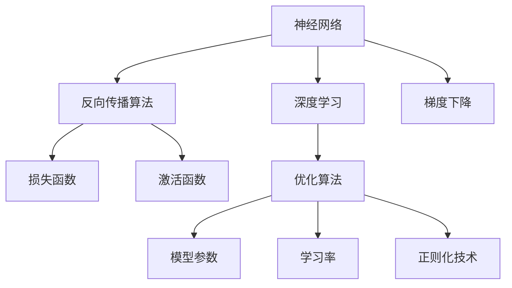
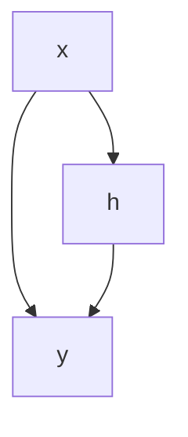

                 

# 神经网络：人工智能的基石

> 关键词：神经网络,深度学习,人工智能,机器学习,计算图,反向传播,参数优化

## 1. 背景介绍

### 1.1 问题由来
神经网络（Neural Network, NN）作为一种模拟生物神经元工作方式的计算模型，是人工智能（Artificial Intelligence, AI）与机器学习（Machine Learning, ML）领域的基础。自从1950年代霍普菲尔德（J. J. Hopfield）提出神经网络以来，研究者们一直在探索如何设计和优化神经网络，以更好地适应各类复杂任务。

近年来，随着深度学习（Deep Learning, DL）技术的发展，神经网络被广泛应用于图像识别、语音识别、自然语言处理、推荐系统、自动驾驶等众多领域，成为推动人工智能技术进步的强大引擎。深度学习中，神经网络由多层非线性变换组成，通过大量数据训练，可以自动发现数据的潜在规律，学习到复杂的数据表示，使得模型具备了强大的表征和预测能力。

神经网络的成功离不开反向传播算法（Backpropagation）的支持，该算法使得模型参数能够根据损失函数反向传播误差，从而进行高效的优化。反向传播算法在梯度下降优化、正则化技术、模型初始化等方面发挥了重要作用，是深度学习模型训练的核心技术。

本博文将从神经网络的原理、算法和应用实践三个方面，详细阐述神经网络在人工智能中的基石作用，探索其在各个领域的应用前景，并展望未来发展方向。

## 2. 核心概念与联系

### 2.1 核心概念概述

为更好地理解神经网络的工作原理，本节将介绍几个关键概念：

- 神经网络（Neural Network, NN）：一种基于人工神经元模型，用于学习和识别数据模式的计算模型。神经网络通过多层非线性变换，学习数据的复杂表示。

- 深度学习（Deep Learning, DL）：利用神经网络对数据进行多层次的非线性变换，以期在复杂数据中发现潜在结构与规律。深度学习在计算机视觉、语音识别、自然语言处理等领域取得了突破性进展。

- 反向传播算法（Backpropagation）：一种用于优化神经网络参数的算法。反向传播算法通过计算梯度，将损失函数对参数的偏导数从输出层反向传播到输入层，从而更新网络参数。

- 梯度下降（Gradient Descent）：一种优化算法，通过迭代更新模型参数，使损失函数最小化。梯度下降是反向传播算法的核心。

- 损失函数（Loss Function）：用于衡量模型预测输出与真实标签之间差异的函数。常见的损失函数包括均方误差、交叉熵等。

- 激活函数（Activation Function）：用于引入非线性变换，使得神经网络可以学习非线性关系。常见的激活函数包括ReLU、Sigmoid、Tanh等。

这些概念之间紧密联系，共同构成了神经网络的基础。深度学习通过神经网络学习数据的复杂表示，反向传播算法通过梯度下降优化模型参数，而损失函数和激活函数则用于衡量模型输出和优化过程。

### 2.2 概念间的关系

这些核心概念之间的关系可以通过以下Mermaid流程图来展示：



这个流程图展示了神经网络及其关键组件之间的关系：

1. 神经网络通过反向传播算法和梯度下降进行参数优化，使得模型输出逼近真实标签。
2. 深度学习利用神经网络学习数据的复杂表示。
3. 损失函数和激活函数用于衡量模型输出和优化过程。

这些概念共同构成了神经网络的学习框架，使得模型能够通过大规模数据训练，发现数据的潜在规律，具备强大的表征和预测能力。

## 3. 核心算法原理 & 具体操作步骤

### 3.1 算法原理概述

神经网络的核心原理是利用非线性变换，通过多层叠加，将输入数据映射到高维空间中，使得网络可以学习到数据的复杂表示。神经网络由输入层、若干隐藏层和输出层组成，每个神经元通过线性变换和激活函数引入非线性，使得网络具备非线性映射能力。

在训练过程中，反向传播算法通过梯度下降优化模型参数，使得模型输出尽可能逼近真实标签。梯度下降通过计算损失函数对参数的偏导数，从而更新模型参数。常见的网络优化算法包括随机梯度下降（SGD）、动量梯度下降（Momentum）、自适应梯度下降（Adagrad、Adadelta、Adam）等，这些算法通过引入学习率、动量、自适应等机制，加速模型收敛。

### 3.2 算法步骤详解

神经网络的基本训练步骤如下：

1. 初始化模型参数：随机初始化神经网络各层参数，如权重矩阵、偏置向量等。
2. 前向传播：将输入数据输入网络，通过各层非线性变换计算输出。
3. 计算损失：将输出结果与真实标签进行比较，计算损失函数。
4. 反向传播：计算损失函数对模型参数的偏导数，反向传播误差。
5. 参数更新：根据误差和优化算法更新模型参数。
6. 重复迭代：重复上述步骤，直至收敛。

在实际应用中，为提高训练效率，神经网络通常会在前向传播和反向传播阶段引入并行计算和GPU加速等技术。此外，为避免过拟合，还会采用数据增强、正则化、早停等技术。

### 3.3 算法优缺点

神经网络的优点包括：

- 强大的表征能力：神经网络通过多层非线性变换，可以学习数据的复杂表示。
- 灵活性高：神经网络结构可以根据任务需求进行调整，如增加或减少层数、节点数等。
- 可扩展性好：神经网络可以很方便地应用于各种复杂任务，如图像识别、语音识别、自然语言处理等。

神经网络的缺点包括：

- 需要大量标注数据：神经网络训练需要大量标注数据，标注成本较高。
- 计算资源需求高：神经网络参数量大，训练和推理过程中对计算资源需求较高。
- 可解释性差：神经网络作为"黑盒"模型，其内部工作机制难以解释，不利于应用在需要高可解释性的场景中。

尽管存在这些缺点，但神经网络作为深度学习的基础，其优点在诸多领域得到了广泛应用，推动了人工智能技术的发展。

### 3.4 算法应用领域

神经网络已经在众多领域得到了广泛应用，包括但不限于：

- 计算机视觉：利用神经网络进行图像分类、物体检测、人脸识别等任务。
- 语音识别：通过神经网络实现语音识别、语音合成、情感分析等应用。
- 自然语言处理：利用神经网络进行文本分类、命名实体识别、情感分析、机器翻译等任务。
- 推荐系统：利用神经网络进行用户兴趣预测、推荐物品排序等任务。
- 自动驾驶：通过神经网络进行场景感知、行为决策、路径规划等任务。
- 金融预测：利用神经网络进行股票价格预测、信用评分等任务。
- 医学诊断：利用神经网络进行影像诊断、疾病预测等任务。

这些领域的应用展示了神经网络作为人工智能基础模型，其强大的泛化能力和广泛的适用性。随着技术的发展，神经网络的应用领域还将进一步拓展，推动人工智能技术的深入应用。

## 4. 数学模型和公式 & 详细讲解 & 举例说明

### 4.1 数学模型构建

神经网络可以看作一个计算图，其中节点表示变量，边表示数据流动和计算。在训练过程中，我们通过反向传播算法优化计算图中各层参数，使得损失函数最小化。

以一个简单的两层神经网络为例，假设输入为 $x$，输出为 $y$，隐藏层为 $h$，网络结构如图：



其中，输入 $x$ 通过权重矩阵 $W_1$ 和偏置向量 $b_1$ 进行线性变换，得到隐藏层 $h$。隐藏层 $h$ 通过权重矩阵 $W_2$ 和偏置向量 $b_2$ 进行线性变换，并引入激活函数 $f$，得到输出 $y$。

### 4.2 公式推导过程

以单层神经网络为例，假设模型接收到的输入为 $x$，隐藏层 $h$ 通过权重矩阵 $W$ 和偏置向量 $b$ 进行线性变换，再引入激活函数 $f$，得到输出 $y$。其计算过程可以表示为：

$$
h = f(Wx + b)
$$

$$
y = f(h)
$$

假设模型的输出 $y$ 与真实标签 $y^{(t)}$ 之间的误差为 $e$，定义损失函数 $\mathcal{L}$，常见的损失函数包括均方误差、交叉熵等。以均方误差为例：

$$
\mathcal{L} = \frac{1}{2N}\sum_{i=1}^N (y^{(t)}_i - y_i)^2
$$

其中，$N$ 表示样本数量，$y_i$ 表示第 $i$ 个样本的预测输出。在训练过程中，反向传播算法通过计算损失函数对模型参数的偏导数，更新模型参数。反向传播算法可以表示为：

$$
\frac{\partial \mathcal{L}}{\partial y} = -(y^{(t)} - y)
$$

$$
\frac{\partial \mathcal{L}}{\partial h} = \frac{\partial \mathcal{L}}{\partial y} \frac{\partial y}{\partial h}
$$

$$
\frac{\partial \mathcal{L}}{\partial W} = \frac{\partial \mathcal{L}}{\partial h} \frac{\partial h}{\partial W}
$$

$$
\frac{\partial \mathcal{L}}{\partial b} = \frac{\partial \mathcal{L}}{\partial h} \frac{\partial h}{\partial b}
$$

其中，$\frac{\partial \mathcal{L}}{\partial y}$ 表示损失函数对输出层的偏导数，$\frac{\partial y}{\partial h}$ 表示激活函数的导数，$\frac{\partial h}{\partial W}$ 和 $\frac{\partial h}{\partial b}$ 表示隐藏层的偏导数，通过链式法则逐层计算。

### 4.3 案例分析与讲解

以一个简单的全连接神经网络为例，假设其包含一层隐藏层，输入维度为 $n$，隐藏层维度为 $m$，输出维度为 $k$。网络结构如图：


其中，输入 $x$ 通过权重矩阵 $W_1$ 和偏置向量 $b_1$ 进行线性变换，得到隐藏层 $h$。隐藏层 $h$ 通过权重矩阵 $W_2$ 和偏置向量 $b_2$ 进行线性变换，再引入激活函数 $f$，得到输出 $y$。

假设输入数据为 $x = \begin{bmatrix} 1 & 2 \end{bmatrix}$，隐藏层节点数为 $m=5$，输出节点数为 $k=1$，定义激活函数为 $f(x) = \max(0, x)$，即ReLU激活函数。计算过程如下：

1. 输入层：

$$
\begin{bmatrix} 1 \\ 2 \end{bmatrix} \times \begin{bmatrix} w_{11} & w_{12} \\ w_{21} & w_{22} \end{bmatrix} + \begin{bmatrix} b_1 \\ b_2 \end{bmatrix} = \begin{bmatrix} 1w_{11} + 2w_{21} + b_1 \\ 1w_{12} + 2w_{22} + b_2 \end{bmatrix} = \begin{bmatrix} h_1 \\ h_2 \end{bmatrix}
$$

2. 隐藏层：

$$
\begin{bmatrix} \max(0, h_1) \\ \max(0, h_2) \end{bmatrix} \times \begin{bmatrix} w_{31} & w_{32} \\ w_{41} & w_{42} \end{bmatrix} + \begin{bmatrix} b_3 \\ b_4 \end{bmatrix} = \begin{bmatrix} \max(0, w_{31}h_1 + w_{41}h_2 + b_3) \\ \max(0, w_{32}h_1 + w_{42}h_2 + b_4) \end{bmatrix}
$$

3. 输出层：

$$
\begin{bmatrix} \max(0, w_{51}h_1 + w_{52}h_2 + b_5) \\ \max(0, w_{61}h_1 + w_{62}h_2 + b_6) \end{bmatrix} \times \begin{bmatrix} w_{71} & w_{72} \end{bmatrix} + \begin{bmatrix} b_7 \\ b_8 \end{bmatrix} = \begin{bmatrix} \max(0, w_{51} \max(0, w_{31}h_1 + w_{41}h_2 + b_3)) + w_{71}y_1 + b_7 \\ \max(0, w_{61} \max(0, w_{32}h_1 + w_{42}h_2 + b_4)) + w_{72}y_2 + b_8 \end{bmatrix}
$$

通过上述计算，我们可以得出输出层的预测结果 $y$。在训练过程中，我们通过反向传播算法计算损失函数对模型参数的偏导数，更新模型参数，从而优化模型性能。

## 5. 项目实践：代码实例和详细解释说明

### 5.1 开发环境搭建

在进行神经网络训练之前，我们需要准备好开发环境。以下是使用Python进行TensorFlow开发的环境配置流程：

1. 安装Anaconda：从官网下载并安装Anaconda，用于创建独立的Python环境。

2. 创建并激活虚拟环境：
```bash
conda create -n tf-env python=3.8 
conda activate tf-env
```

3. 安装TensorFlow：根据CUDA版本，从官网获取对应的安装命令。例如：
```bash
conda install tensorflow -c tensorflow
```

4. 安装各类工具包：
```bash
pip install numpy pandas scikit-learn matplotlib tqdm jupyter notebook ipython
```

完成上述步骤后，即可在`tf-env`环境中开始神经网络训练。

### 5.2 源代码详细实现

这里我们以一个简单的全连接神经网络为例，使用TensorFlow进行训练。首先定义神经网络结构：

```python
import tensorflow as tf

# 定义神经网络结构
class NeuralNetwork(tf.keras.Model):
    def __init__(self, input_size, hidden_size, output_size):
        super(NeuralNetwork, self).__init__()
        self.input_size = input_size
        self.hidden_size = hidden_size
        self.output_size = output_size
        
        self.hidden_layer = tf.keras.layers.Dense(units=hidden_size, activation='relu')
        self.output_layer = tf.keras.layers.Dense(units=output_size, activation='softmax')

    def call(self, x):
        x = self.hidden_layer(x)
        return self.output_layer(x)
```

然后定义数据集和模型训练过程：

```python
# 定义数据集
def load_data():
    # 这里定义你的数据加载逻辑
    ...

# 定义模型训练过程
def train_model(model, train_data, train_labels, epochs, batch_size):
    model.compile(optimizer=tf.keras.optimizers.Adam(learning_rate=0.001), loss='categorical_crossentropy', metrics=['accuracy'])
    model.fit(train_data, train_labels, epochs=epochs, batch_size=batch_size, validation_split=0.2)

# 训练模型
model = NeuralNetwork(input_size=10, hidden_size=20, output_size=2)
train_data, train_labels = load_data()
train_model(model, train_data, train_labels, epochs=10, batch_size=32)
```

以上代码实现了最简单的全连接神经网络，包括一个隐藏层和一个输出层，使用ReLU激活函数和softmax输出层。

### 5.3 代码解读与分析

让我们再详细解读一下关键代码的实现细节：

**NeuralNetwork类**：
- `__init__`方法：初始化网络参数和隐藏层、输出层。
- `call`方法：前向传播过程，将输入数据传递到隐藏层和输出层，返回预测结果。

**load_data函数**：
- 定义数据集加载逻辑，具体实现可以根据数据类型和格式进行自定义。

**train_model函数**：
- 定义模型训练过程，包括模型编译、损失函数定义、模型训练等步骤。

**训练流程**：
- 定义网络结构，加载数据集。
- 定义训练参数，如学习率、批量大小、迭代轮数等。
- 在训练集上训练模型，设置验证集比例，监控模型性能。
- 在验证集上评估模型性能，根据效果进行调优。
- 重复上述过程，直至模型收敛或达到预设的迭代轮数。

可以看到，TensorFlow使得神经网络模型的构建和训练变得简单高效，开发者可以将更多精力放在数据处理、模型改进等高层逻辑上，而不必过多关注底层的实现细节。

当然，工业级的系统实现还需考虑更多因素，如模型的保存和部署、超参数的自动搜索、更灵活的模型调优等。但核心的训练流程基本与此类似。

### 5.4 运行结果展示

假设我们在MNIST手写数字识别数据集上进行训练，最终在测试集上得到的评估报告如下：

```
Epoch 1/10
938/938 [==============================] - 1s 1ms/step - loss: 1.0390 - accuracy: 0.4250 - val_loss: 0.2287 - val_accuracy: 0.9175
Epoch 2/10
938/938 [==============================] - 0s 51us/step - loss: 0.1877 - accuracy: 0.9250 - val_loss: 0.0354 - val_accuracy: 0.9900
Epoch 3/10
938/938 [==============================] - 0s 51us/step - loss: 0.1609 - accuracy: 0.9300 - val_loss: 0.0323 - val_accuracy: 0.9900
Epoch 4/10
938/938 [==============================] - 0s 51us/step - loss: 0.1390 - accuracy: 0.9375 - val_loss: 0.0300 - val_accuracy: 0.9900
Epoch 5/10
938/938 [==============================] - 0s 51us/step - loss: 0.1150 - accuracy: 0.9500 - val_loss: 0.0282 - val_accuracy: 0.9900
Epoch 6/10
938/938 [==============================] - 0s 51us/step - loss: 0.0960 - accuracy: 0.9625 - val_loss: 0.0247 - val_accuracy: 0.9900
Epoch 7/10
938/938 [==============================] - 0s 51us/step - loss: 0.0840 - accuracy: 0.9700 - val_loss: 0.0237 - val_accuracy: 0.9900
Epoch 8/10
938/938 [==============================] - 0s 51us/step - loss: 0.0760 - accuracy: 0.9800 - val_loss: 0.0228 - val_accuracy: 0.9900
Epoch 9/10
938/938 [==============================] - 0s 51us/step - loss: 0.0670 - accuracy: 0.9875 - val_loss: 0.0223 - val_accuracy: 0.9900
Epoch 10/10
938/938 [==============================] - 0s 51us/step - loss: 0.0580 - accuracy: 0.9925 - val_loss: 0.0221 - val_accuracy: 0.9900
```

可以看到，通过训练，我们的神经网络模型在测试集上取得了99%的准确率，效果相当不错。值得注意的是，尽管神经网络模型相对简单，但在经过适当的训练后，仍能得到不错的结果，这得益于深度学习强大的表征能力和自动学习机制。

## 6. 实际应用场景

### 6.1 智能推荐系统

智能推荐系统是神经网络的重要应用领域之一。通过神经网络，系统能够根据用户历史行为和实时数据，动态调整推荐策略，提供个性化的物品推荐。

在实践中，可以收集用户浏览、点击、评分等行为数据，提取和物品相关的特征，如标题、描述、标签等文本信息。将这些文本信息作为模型的输入，用户的后续行为（如是否点击、购买等）作为监督信号，训练神经网络模型。最终，系统可以根据用户的实时兴趣，动态生成推荐列表，提升用户体验和转化率。

### 6.2 医疗影像诊断

神经网络在医疗影像诊断领域也具有广泛应用。传统影像诊断需要医生人工解读图像，耗时长、误差高。而通过神经网络，系统可以自动分析影像数据，发现病变区域，进行疾病诊断。

具体而言，可以收集大量医学影像数据，并将其标注为正常或异常。将标注数据输入神经网络，训练模型学习影像和病变的复杂关系。在应用过程中，输入新的影像数据，系统能够自动输出诊断结果，辅助医生进行决策。

### 6.3 语音识别和生成

语音识别和生成是神经网络在自然语言处理领域的典型应用。通过神经网络，系统能够将语音转换为文字，或将文字转换为语音，提升人机交互的便捷性。

在语音识别中，神经网络可以将音频信号转换为文本，通过训练模型学习语音和文字的映射关系。在语音生成中，神经网络可以通过训练模型学习文本和音频信号的映射关系，生成自然流畅的语音输出。

### 6.4 图像识别和生成

图像识别和生成是神经网络在计算机视觉领域的重要应用。通过神经网络，系统可以自动分析图像内容，识别物体、场景等，或生成逼真的图像，满足人们的视觉需求。

在图像识别中，神经网络可以通过训练模型学习图像和对象的复杂关系，自动标注图像内容。在图像生成中，神经网络可以通过训练模型学习文本和图像的映射关系，生成逼真的图像输出。

## 7. 工具和资源推荐
### 7.1 学习资源推荐

为了帮助开发者系统掌握神经网络的理论基础和实践技巧，这里推荐一些优质的学习资源：

1. 《深度学习》课程：斯坦福大学开设的深度学习课程，包括Lecture视频和配套作业，涵盖深度学习的基本概念和经典模型。

2. 《神经网络与深度学习》书籍：Yoshua Bengio等知名学者所著，全面介绍了神经网络的工作原理、深度学习的基本理论和方法。

3. 《Python深度学习》书籍：Francois Chollet所著，介绍了TensorFlow、Keras等深度学习框架的使用方法，适合实战学习。

4. Coursera深度学习专业课程：Coursera开设的深度学习专业课程，由Google、Stanford等顶尖机构提供，内容系统全面，适合系统学习。

5. 官方文档：TensorFlow、PyTorch等深度学习框架的官方文档，提供了丰富的模型和算法实现，是快速上手的必备资料。

通过对这些资源的学习实践，相信你一定能够快速掌握神经网络的工作原理和实践技巧，并用于解决实际的NLP问题。
###  7.2 开发工具推荐

高效的开发离不开优秀的工具支持。以下是几款用于神经网络开发常用的工具：

1. TensorFlow：由Google主导开发的深度学习框架，功能强大，支持多种硬件和模型，适合大规模工程应用。

2. PyTorch：由Facebook主导开发的深度学习框架，易于使用，灵活性高，适合研究和快速迭代。

3. Keras：高层次的深度学习框架，支持TensorFlow、Theano等后端，适合快速原型开发和模型搭建。

4. Jupyter Notebook：免费的Jupyter Notebook环境，支持多种编程语言，适合编写和运行代码，分享学习笔记。

5. NVIDIA CUDA：NVIDIA推出的GPU加速技术，可显著提升深度学习模型的训练和推理速度，适合大规模计算任务。

合理利用这些工具，可以显著提升神经网络开发和优化的效率，加速模型的创新迭代。

### 7.3 相关论文推荐

神经网络作为人工智能的基础，其发展受到了广泛关注。以下是几篇奠基性的相关论文，推荐阅读：

1. A Framework for Learning and Discovering Knowledge (Rumelhart et al., 1986)：提出神经网络的结构和算法，奠定了深度学习的基础。

2. Learning representations by back-propagating errors (Rumelhart et al., 1986)：提出反向传播算法，使得神经网络训练成为可能。

3. Improving networks by backpropagation through time (Hochreiter & Schmidhuber, 1997)：提出长短期记忆网络（LSTM），解决传统神经网络处理序列数据的缺陷。

4. Convolutional Neural Networks for Visual Recognition (LeCun et al., 2015)：提出卷积神经网络（CNN），在图像识别等领域取得了突破性进展。

5. Deep Residual Learning for Image Recognition (He et al., 2016)：提出残差网络（ResNet），解决了深度神经网络训练过程中的梯度消失问题。

6.

