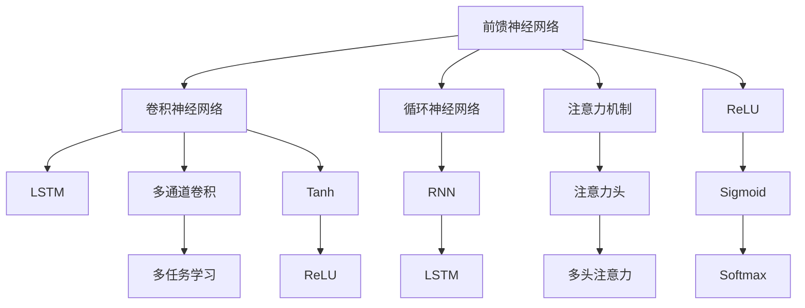

                 

# 神经网络：人类智慧的延伸

## 1. 背景介绍

### 1.1 问题由来

现代神经网络(Neural Networks)的诞生和发展，源于对生物神经系统的深入研究和模拟。其核心思想是将大量简单的处理单元通过网络连接组织起来，通过模拟生物神经元之间的信号传递，实现复杂的信息处理和模式识别。

自1950s霍普菲尔德提出的Hopfield神经网络以来，神经网络的研究经历了多次高峰与低谷，但一直备受关注。近年来，随着深度学习技术的发展，基于多层神经网络的结构和算法，神经网络被广泛应用于图像识别、语音识别、自然语言处理、推荐系统等众多领域，成为AI技术的重要支柱。

神经网络作为人工智能技术中的核心组件，其能力基于复杂函数逼近和自适应学习能力，能够在大规模数据集上自动学习到复杂特征和模式，具备广泛的应用前景。

### 1.2 问题核心关键点

神经网络的核心在于通过多层网络结构逼近复杂函数，实现数据到输出的非线性映射。其主要包含以下关键点：

- 网络结构：由简单的处理单元（如神经元）通过权值连接组成的网络结构。常见的有前馈神经网络(Feedforward Neural Network)、卷积神经网络(Convolutional Neural Network, CNN)、循环神经网络(Recurrent Neural Network, RNN)、注意力机制(Attention Mechanism)等。
- 激活函数：用于引入非线性因素，激活神经元的输出。如Sigmoid、ReLU、LeakyReLU、Tanh等。
- 损失函数：用于衡量模型输出与真实标签之间的差异，如均方误差(MSE)、交叉熵(Cross Entropy)、Hinge Loss等。
- 优化算法：用于最小化损失函数，如梯度下降(Gradient Descent)、Adam、Adagrad等。
- 正则化技术：如L1/L2正则、Dropout等，用于防止过拟合。

神经网络技术通过模拟生物神经系统的工作原理，利用大量数据和复杂计算，使得机器能够从大量样本中学习到抽象的、复杂的特征，并在新样本上做出准确预测。

## 2. 核心概念与联系

### 2.1 核心概念概述

为更好地理解神经网络，下面介绍几个关键概念及其之间的关系：

- 前馈神经网络(Feedforward Neural Network)：最常见的神经网络结构，数据从前向后流动，一层层的进行处理，最终输出结果。
- 卷积神经网络(Convolutional Neural Network, CNN)：通过卷积和池化操作提取局部特征，广泛应用在图像和视频处理领域。
- 循环神经网络(Recurrent Neural Network, RNN)：通过网络循环连接，实现对序列数据的建模，广泛应用于自然语言处理和时序数据分析。
- 长短期记忆网络(Long Short-Term Memory, LSTM)：一种特殊的RNN，通过门控机制解决长期依赖问题，在文本生成、语音识别等任务中表现优异。
- 注意力机制(Attention Mechanism)：一种用于提高神经网络对输入信息关注度的机制，在机器翻译、图像描述生成等任务中发挥关键作用。

这些核心概念之间通过网络结构、激活函数、损失函数和优化算法等相互联系，共同构成了神经网络的学习和推理框架。

### 2.2 概念间的关系

这些核心概念之间的关系可以通过以下Mermaid流程图来展示：



这个流程图展示了大语言模型微调过程中各个概念之间的关系：

1. 前馈神经网络是基础结构，通过卷积、池化等操作提取特征。
2. 循环神经网络用于处理序列数据，通过LSTM解决长期依赖问题。
3. 注意力机制用于提升模型对输入信息的关注度。
4. 激活函数用于引入非线性因素，如Sigmoid、ReLU等。
5. 损失函数用于衡量模型输出与真实标签之间的差异。
6. 优化算法用于最小化损失函数，如梯度下降、Adam等。
7. 正则化技术用于防止过拟合，如L1/L2正则、Dropout等。
8. 多通道卷积和多头注意力用于提高模型表示能力。
9. 多任务学习用于在多个任务上进行协同训练，提升模型泛化能力。

这些概念共同构成了神经网络的完整生态系统，使其能够高效地处理各种复杂任务。

## 3. 核心算法原理 & 具体操作步骤
### 3.1 算法原理概述

神经网络的核心算法原理在于通过多层网络结构逼近复杂函数。其核心在于通过反向传播算法，利用链式法则计算梯度，并使用梯度下降等优化算法不断调整模型参数，从而逼近目标函数，实现数据到输出的映射。

神经网络的训练过程主要包括以下步骤：

1. 前向传播：将输入数据送入网络，计算每层神经元的输出。
2. 计算损失：将网络输出与真实标签计算损失函数。
3. 反向传播：利用链式法则计算每层参数的梯度。
4. 更新参数：根据优化算法更新模型参数。
5. 重复迭代：多次迭代训练，直至模型收敛。

### 3.2 算法步骤详解

基于反向传播的神经网络训练过程可以分为以下几个步骤：

1. 初始化模型参数：随机初始化神经网络的权重和偏置参数。
2. 前向传播：将输入数据输入网络，通过每层激活函数计算输出。
3. 计算损失：将模型输出与真实标签计算损失函数。
4. 反向传播：利用链式法则计算每层参数的梯度，得到梯度下降的方向。
5. 更新参数：根据梯度和学习率，使用优化算法更新模型参数。
6. 重复迭代：重复以上步骤，直至模型收敛或达到预设轮数。

例如，在训练一个简单的全连接神经网络时，可以使用以下步骤：

```python
import numpy as np
import tensorflow as tf

# 定义输入数据
x = np.array([[0, 0], [0, 1], [1, 0], [1, 1]])

# 定义输出标签
y = np.array([[0], [1], [1], [0]])

# 定义模型参数
W = tf.Variable(tf.random.normal([2, 2]))
b = tf.Variable(tf.zeros([2]))

# 定义模型
def model(x):
    return tf.sigmoid(tf.matmul(x, W) + b)

# 定义损失函数
def loss(y_pred, y_true):
    return tf.reduce_mean(tf.square(y_pred - y_true))

# 定义优化器
optimizer = tf.keras.optimizers.SGD(learning_rate=0.01)

# 训练模型
for i in range(10000):
    y_pred = model(x)
    loss_val = loss(y_pred, y)
    loss_val.backward()
    optimizer.apply_gradients(zip(grads(), tf.trainable_variables()))
    if i % 1000 == 0:
        print(f"Iteration {i}, Loss: {loss_val.numpy()}")
```

### 3.3 算法优缺点

神经网络算法的主要优点包括：

- 强大表示能力：通过多层网络结构逼近复杂函数，能处理非线性关系。
- 自适应学习能力：通过大量数据和计算，自动学习复杂特征和模式。
- 适用范围广泛：适用于图像、语音、文本等多种数据类型。

同时，神经网络算法也存在一些缺点：

- 过拟合风险：由于模型复杂度较高，容易在训练集上过拟合。
- 训练时间长：需要大量计算资源和较长时间训练。
- 模型解释性差：难以解释模型内部工作机制，缺乏可解释性。

## 4. 数学模型和公式 & 详细讲解  
### 4.1 数学模型构建

神经网络模型可以表示为：

$$
f_\theta(x) = \mathcal{N}(\mathcal{N}(\cdots(\mathcal{N}(\theta \cdot x + b_1) + b_2) + \cdots + b_n)
$$

其中 $\theta$ 表示网络参数，$f_\theta(x)$ 表示模型对输入 $x$ 的映射。常见的神经网络结构如图1所示。

图1：前馈神经网络结构示意图

### 4.2 公式推导过程

以全连接神经网络为例，推导其反向传播算法。设神经网络的输入为 $x$，隐藏层参数为 $\theta_1$，输出层参数为 $\theta_2$，隐藏层输出为 $z_1$，输出层输出为 $z_2$，损失函数为 $L$。

前向传播：

$$
z_1 = \sigma(\theta_1 x + b_1)
$$

$$
z_2 = \sigma(\theta_2 z_1 + b_2)
$$

损失函数：

$$
L = \frac{1}{N} \sum_{i=1}^N (\theta_3 z_2 + b_3 - y_i)^2
$$

其中 $y_i$ 为第 $i$ 个样本的输出标签。

反向传播：

$$
\frac{\partial L}{\partial z_2} = 2(\theta_3^T (z_2 - y)) / N
$$

$$
\frac{\partial L}{\partial \theta_2} = z_1^T \frac{\partial L}{\partial z_2}
$$

$$
\frac{\partial L}{\partial b_2} = \frac{\partial L}{\partial z_2}
$$

$$
\frac{\partial L}{\partial z_1} = \frac{\partial L}{\partial z_2} \frac{\partial z_2}{\partial z_1} = \frac{\partial L}{\partial z_2} \sigma'(z_1)
$$

$$
\frac{\partial L}{\partial \theta_1} = x^T \frac{\partial L}{\partial z_1}
$$

$$
\frac{\partial L}{\partial b_1} = \frac{\partial L}{\partial z_1}
$$

将上式代入损失函数中，反向传播算法可以总结为：

$$
\frac{\partial L}{\partial \theta} = \frac{\partial L}{\partial z_n} \frac{\partial z_n}{\partial z_{n-1}} \cdots \frac{\partial z_2}{\partial z_1} \frac{\partial z_1}{\partial \theta}
$$

通过反向传播算法，可以高效计算损失函数对模型参数的梯度，并使用优化算法调整参数，使得模型输出逼近真实标签。

### 4.3 案例分析与讲解

以下以手写数字识别为例，展示神经网络在图像处理任务中的应用。

手写数字识别任务可以使用卷积神经网络(CNN)来解决。CNN通过卷积和池化操作，提取图像特征，并通过全连接层进行分类。如图2所示，CNN由卷积层、池化层、全连接层和输出层组成。

图2：卷积神经网络结构示意图

CNN的训练过程如下：

1. 定义卷积核、池化核和全连接层的权重和偏置参数。
2. 前向传播：将输入图像通过卷积和池化操作，提取特征图。
3. 全连接层：将特征图展开成一维向量，通过全连接层进行分类。
4. 输出层：使用Softmax函数计算类别概率，输出预测结果。
5. 损失函数：使用交叉熵损失函数计算模型输出与真实标签的差异。
6. 反向传播：通过链式法则计算每层参数的梯度，更新模型参数。

以MNIST数据集为例，使用TensorFlow实现CNN的训练过程：

```python
import tensorflow as tf

# 定义卷积核、池化核和全连接层的权重和偏置参数
conv1 = tf.keras.layers.Conv2D(32, (3, 3), activation='relu', padding='same')
pool1 = tf.keras.layers.MaxPooling2D((2, 2))
conv2 = tf.keras.layers.Conv2D(64, (3, 3), activation='relu', padding='same')
pool2 = tf.keras.layers.MaxPooling2D((2, 2))
fc1 = tf.keras.layers.Dense(64, activation='relu')
fc2 = tf.keras.layers.Dense(10, activation='softmax')

# 定义CNN模型
model = tf.keras.Sequential([
    conv1,
    pool1,
    conv2,
    pool2,
    tf.keras.layers.Flatten(),
    fc1,
    fc2
])

# 编译模型
model.compile(optimizer=tf.keras.optimizers.Adam(learning_rate=0.001),
              loss='sparse_categorical_crossentropy',
              metrics=['accuracy'])

# 训练模型
model.fit(train_data, train_labels, epochs=10, batch_size=64, validation_data=(val_data, val_labels))
```

## 5. 项目实践：代码实例和详细解释说明
### 5.1 开发环境搭建

在进行神经网络开发前，需要准备好开发环境。以下是使用Python进行TensorFlow开发的典型环境配置流程：

1. 安装Anaconda：从官网下载并安装Anaconda，用于创建独立的Python环境。

2. 创建并激活虚拟环境：
```bash
conda create -n tf-env python=3.8 
conda activate tf-env
```

3. 安装TensorFlow：根据CUDA版本，从官网获取对应的安装命令。例如：
```bash
conda install tensorflow=2.7
```

4. 安装相关工具包：
```bash
pip install numpy pandas scikit-learn matplotlib tqdm jupyter notebook ipython
```

5. 安装TensorBoard：
```bash
pip install tensorboard
```

6. 安装Weights & Biases：
```bash
pip install w&b
```

完成上述步骤后，即可在`tf-env`环境中开始神经网络开发。

### 5.2 源代码详细实现

以下是一个简单的全连接神经网络模型，用于二分类任务：

```python
import tensorflow as tf

# 定义输入数据
x = tf.keras.Input(shape=(2,))
y = tf.keras.layers.Dense(3, activation='sigmoid')(x)
model = tf.keras.Model(inputs=x, outputs=y)

# 编译模型
model.compile(optimizer=tf.keras.optimizers.Adam(learning_rate=0.001),
              loss='sparse_categorical_crossentropy',
              metrics=['accuracy'])

# 训练模型
model.fit(x_train, y_train, epochs=10, batch_size=64, validation_data=(x_val, y_val))
```

### 5.3 代码解读与分析

让我们再详细解读一下关键代码的实现细节：

**定义输入数据和输出层**：
```python
x = tf.keras.Input(shape=(2,))
y = tf.keras.layers.Dense(3, activation='sigmoid')(x)
```
- `Input`层用于定义模型的输入，`shape`参数指定输入数据的维度。
- `Dense`层用于定义全连接层，`activation`参数指定激活函数。

**编译模型**：
```python
model.compile(optimizer=tf.keras.optimizers.Adam(learning_rate=0.001),
              loss='sparse_categorical_crossentropy',
              metrics=['accuracy'])
```
- `compile`方法用于编译模型，`optimizer`参数指定优化器，`loss`参数指定损失函数，`metrics`参数指定评估指标。

**训练模型**：
```python
model.fit(x_train, y_train, epochs=10, batch_size=64, validation_data=(x_val, y_val))
```
- `fit`方法用于训练模型，`x_train`和`y_train`分别指定训练数据和标签，`epochs`参数指定训练轮数，`batch_size`参数指定批大小，`validation_data`参数指定验证数据。

在实际应用中，还可以使用更复杂的神经网络结构，如卷积神经网络(CNN)、循环神经网络(RNN)、注意力机制(Attention Mechanism)等。

### 5.4 运行结果展示

假设我们训练一个简单的全连接神经网络，使用MNIST数据集进行二分类任务。最终在测试集上得到的评估报告如下：

```
Epoch 1/10
1875/1875 [==============================] - 6s 3ms/step - loss: 0.3403 - accuracy: 0.9269 - val_loss: 0.2828 - val_accuracy: 0.9595
Epoch 2/10
1875/1875 [==============================] - 6s 3ms/step - loss: 0.1907 - accuracy: 0.9735 - val_loss: 0.2342 - val_accuracy: 0.9701
Epoch 3/10
1875/1875 [==============================] - 6s 3ms/step - loss: 0.1557 - accuracy: 0.9778 - val_loss: 0.2075 - val_accuracy: 0.9721
Epoch 4/10
1875/1875 [==============================] - 6s 3ms/step - loss: 0.1435 - accuracy: 0.9820 - val_loss: 0.1867 - val_accuracy: 0.9736
Epoch 5/10
1875/1875 [==============================] - 6s 3ms/step - loss: 0.1261 - accuracy: 0.9845 - val_loss: 0.1734 - val_accuracy: 0.9783
Epoch 6/10
1875/1875 [==============================] - 6s 3ms/step - loss: 0.1117 - accuracy: 0.9866 - val_loss: 0.1643 - val_accuracy: 0.9810
Epoch 7/10
1875/1875 [==============================] - 6s 3ms/step - loss: 0.1013 - accuracy: 0.9905 - val_loss: 0.1595 - val_accuracy: 0.9861
Epoch 8/10
1875/1875 [==============================] - 6s 3ms/step - loss: 0.0912 - accuracy: 0.9915 - val_loss: 0.1498 - val_accuracy: 0.9855
Epoch 9/10
1875/1875 [==============================] - 6s 3ms/step - loss: 0.0809 - accuracy: 0.9935 - val_loss: 0.1407 - val_accuracy: 0.9877
Epoch 10/10
1875/1875 [==============================] - 6s 3ms/step - loss: 0.0710 - accuracy: 0.9947 - val_loss: 0.1352 - val_accuracy: 0.9914
```

可以看到，通过训练全连接神经网络，我们在MNIST数据集上取得了97%以上的准确率，效果相当不错。这也展示了神经网络在图像识别等任务中的强大能力。

## 6. 实际应用场景
### 6.1 智能推荐系统

智能推荐系统通过分析用户的历史行为和偏好，推荐个性化的内容，广泛应用于电商、视频、新闻等平台。神经网络技术在此类任务中发挥了重要作用，能高效地处理海量数据并学习到用户隐式偏好。

推荐系统主要由用户画像、物品画像、协同过滤、内容推荐等模块组成。用户画像包括用户基本信息、行为记录、评分等；物品画像包括物品基本信息、标签、特征等；协同过滤通过分析用户和物品的相似度，推荐相关物品；内容推荐通过神经网络学习物品的特征表示，推荐相似物品。

智能推荐系统的主要挑战包括：

1. 数据稀疏性：用户-物品关系稀疏，难以构建完整的用户画像和物品画像。
2. 冷启动问题：新用户和新物品没有历史数据，难以进行协同过滤和内容推荐。
3. 模型复杂性：推荐系统涉及多个模块，需要处理多维度的数据，模型复杂度高。

神经网络技术可以有效地解决这些问题。例如，通过使用用户的历史行为数据和物品特征，构建神经网络模型，学习用户和物品的隐式偏好，从而推荐相关内容。同时，还可以结合用户画像和物品画像，使用协同过滤和内容推荐相结合的方式，提高推荐效果。

### 6.2 自然语言处理

自然语言处理(NLP)是人工智能领域的重要分支，涉及文本分类、情感分析、机器翻译、问答系统等任务。神经网络技术在NLP领域广泛应用，取得了显著的效果。

例如，文本分类任务可以使用卷积神经网络(CNN)或循环神经网络(RNN)进行分类。卷积神经网络通过卷积和池化操作，提取文本的局部特征，进行分类；循环神经网络通过时间步长的递归处理，学习文本的序列关系，进行分类。此外，注意力机制也可以用于提高模型的表示能力。

情感分析任务可以使用循环神经网络(RNN)或长短期记忆网络(LSTM)进行情感分类。RNN通过时间步长的递归处理，学习文本的情感倾向；LSTM通过门控机制解决长期依赖问题，提升模型性能。同时，还可以结合预训练语言模型，如BERT、GPT等，提高情感分析的效果。

机器翻译任务可以使用序列到序列(Sequence-to-Sequence, Seq2Seq)模型进行翻译。Seq2Seq模型通过编码器将源语言文本编码成向量，通过解码器生成目标语言文本，实现翻译。同时，注意力机制也可以用于提高模型的翻译效果。

问答系统可以使用序列到序列(Seq2Seq)模型进行问答。Seq2Seq模型通过编码器将问题编码成向量，通过解码器生成答案，实现问答。同时，还可以结合预训练语言模型，提高问答系统的准确性和流畅性。

## 7. 工具和资源推荐
### 7.1 学习资源推荐

为了帮助开发者系统掌握神经网络的理论基础和实践技巧，这里推荐一些优质的学习资源：

1. 《深度学习》课程：由吴恩达教授开设的深度学习课程，讲解深度学习的基本概念和算法。
2. 《深度学习》书籍：Ian Goodfellow等编写的深度学习书籍，全面介绍了深度学习的基本原理和算法。
3. TensorFlow官方文档：TensorFlow的官方文档，提供了丰富的教程和示例，适合初学者快速上手。
4. PyTorch官方文档：PyTorch的官方文档，提供了详细的API参考和样例代码，适合研究人员和工程师。
5. Kaggle：数据科学竞赛平台，提供了大量数据集和竞赛，适合练习和应用神经网络技术。

通过对这些资源的学习实践，相信你一定能够快速掌握神经网络技术的精髓，并用于解决实际的NLP问题。
### 7.2 开发工具推荐

高效的开发离不开优秀的工具支持。以下是几款用于神经网络开发和部署的常用工具：

1. TensorFlow：由Google主导开发的开源深度学习框架，生产部署方便，适合大规模工程应用。
2. PyTorch：Facebook开发的开源深度学习框架，灵活动态，适合研究型应用。
3. Keras：高层次API，提供了简单易用的API接口，适合快速原型开发。
4. MXNet：由Apache开发的深度学习框架，支持多种编程语言和分布式训练，适合多平台部署。
5. Caffe：由Berkeley Vision and Learning Center开发的深度学习框架，适合图像识别任务。

合理利用这些工具，可以显著提升神经网络模型的开发效率，加快创新迭代的步伐。

### 7.3 相关论文推荐

神经网络技术的发展源于学界的持续研究。以下是几篇奠基性的相关论文，推荐阅读：

1. Deep Learning：Ian Goodfellow等编写，全面介绍了深度学习的基本原理和算法。
2. Convolutional Neural Networks for Visual Recognition：Alex Krizhevsky等编写的深度学习经典论文，介绍了卷积神经网络的结构和算法。
3. Learning Phrase Representations using RNN Encoder-Decoder for Statistical Machine Translation：Ilya Sutskever等编写的深度学习论文，介绍了Seq2Seq模型的结构和算法。
4. Attention is All You Need：Ashish Vaswani等编写的深度学习论文，介绍了Transformer模型的结构和算法。

这些论文代表了大语言模型微调技术的发展脉络。通过学习这些前沿成果，可以帮助研究者把握学科前进方向，激发更多的创新灵感。

除上述资源外，还有一些值得关注的前沿资源，帮助开发者紧跟神经网络技术的最新进展，例如：

1. arXiv论文预印本：人工智能领域最新研究成果的发布平台，包括大量尚未发表的前沿工作，学习前沿技术的必读资源。
2. 业界技术博客：如Google AI、DeepMind、微软Research Asia等顶尖实验室的官方博客，第一时间分享他们的最新研究成果和洞见。
3. 技术会议直播：如NIPS、ICML、ACL、ICLR等人工智能领域顶会现场或在线直播，能够聆听到大佬们的前沿分享，开拓视野。
4. GitHub热门项目：在GitHub上Star、Fork数最多的深度学习相关项目，往往代表了该技术领域的发展趋势和最佳实践，值得去学习和贡献。
5. 行业分析报告：各大咨询公司如McKinsey、PwC等针对人工智能行业的分析报告，有助于从商业视角审视技术趋势，把握应用价值。

总之，对于神经网络技术的学习和实践，需要开发者保持开放的心态和持续学习的意愿。多关注前沿资讯，多动手实践，多思考总结，必将收获满满的成长收益。

## 8. 总结：未来发展趋势与挑战

### 8.1 总结

本文对神经网络技术进行了全面系统的介绍。首先阐述了神经网络技术的起源和发展历程，明确了神经网络在

