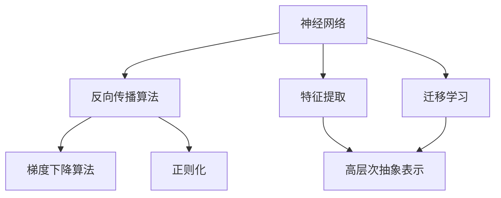
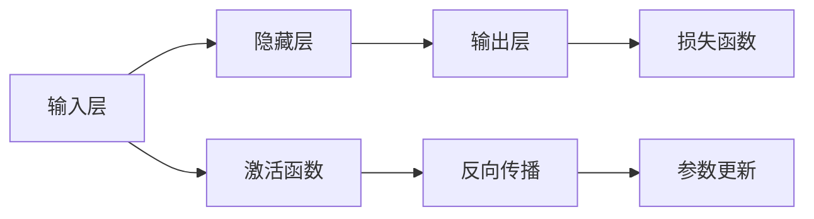
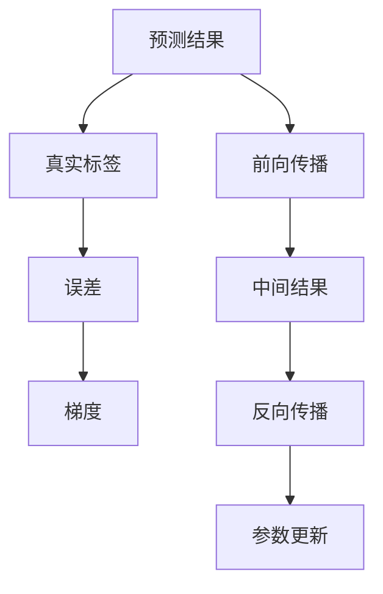
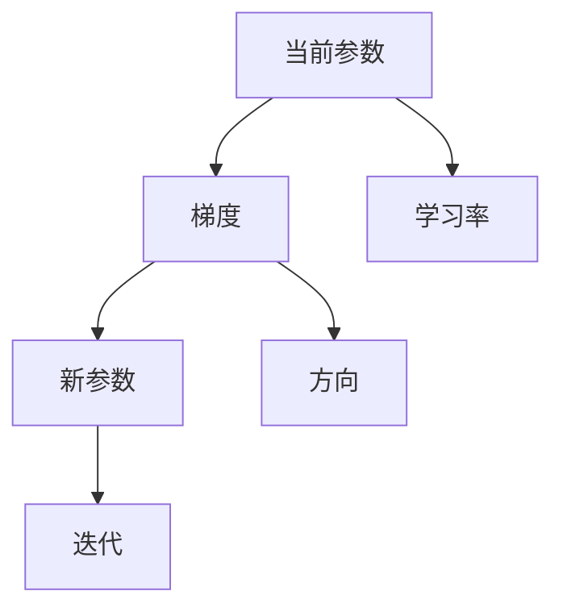
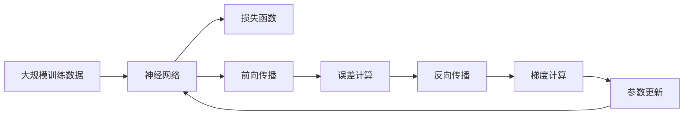

                 

## 1. 背景介绍

### 1.1 问题由来
人工智能领域自20世纪60年代兴起以来，已经经历了数个重要阶段。从最初符号主义和专家系统的兴起，到深度学习革命的到来，人工智能技术日益成熟并开始大规模应用。特别是在21世纪以来，以深度学习为代表的神经网络技术发展迅猛，极大地提升了机器智能水平。

深度学习本质上是神经网络（Neural Network, NN）的一个分支，它以多层的神经元结构为核心，通过复杂的非线性变换，可以从数据中学习到高层次的特征表示，从而在图像识别、语音识别、自然语言处理等领域取得卓越效果。然而，深度学习也存在一些局限性，如需要大量标注数据、模型复杂度高、训练成本高、解释性差等，限制了其在实际应用中的推广。

因此，研究者们提出了多种改进措施，试图通过模型简化、数据增强、正则化等手段，缓解这些问题。其中，神经网络（Neural Network）的进一步发展，极大地推动了人工智能技术的进步，开启了一个智能新纪元。

### 1.2 问题核心关键点
神经网络的核心在于其结构和学习机制。神经网络由多个神经元（或称为节点）通过有向边连接而成，每层神经元处理输入并输出结果，最后通过多个全连接层实现复杂的特征映射。神经网络的参数通过反向传播算法进行优化，最小化预测误差，从而提高模型性能。

神经网络的学习过程通常分为两个阶段：前向传播和反向传播。在前向传播中，输入数据通过网络逐层处理，得到最终的输出。在反向传播中，网络利用误差梯度反向传播，更新网络参数，以便更好地适应训练数据。神经网络参数的优化通常使用梯度下降算法（如SGD、Adam等），结合正则化、Dropout等技术，防止过拟合，提高泛化能力。

神经网络的核心思想是通过层次化的神经元，利用大量的数据进行复杂的特征学习，从而实现高层次的抽象表示和复杂任务的处理。通过不断优化网络结构和训练算法，神经网络在实际应用中展现出了强大的学习能力和泛化能力，极大地提升了人工智能技术的实用性和普适性。

### 1.3 问题研究意义
神经网络技术在人工智能领域的应用，极大地推动了技术的进步和产业的发展，具有以下重要意义：

1. **数据驱动的特征学习**：神经网络通过大量数据进行特征学习，能够自适应地捕捉输入数据的复杂结构，从而实现更加精确的预测和分类。

2. **高层次的抽象表示**：多层神经网络能够构建高层次的抽象表示，具有较强的泛化能力，能够适应不同领域和场景下的复杂任务。

3. **高效的自动化学习**：神经网络通过反向传播算法进行高效的自动化学习，极大地降低了人工干预的需求，提升了数据处理效率。

4. **大规模模型部署**：神经网络可以部署在分布式系统中，通过GPU、TPU等高性能设备加速计算，提升了实际应用中的处理能力。

5. **跨领域的应用潜力**：神经网络技术不仅在图像、语音等领域表现出色，还可以应用于自然语言处理、推荐系统、游戏AI等多个领域，具有广泛的应用前景。

## 2. 核心概念与联系

### 2.1 核心概念概述

为更好地理解神经网络的工作原理和优化方向，本节将介绍几个密切相关的核心概念：

- **神经网络**（Neural Network）：由多个神经元（或称为节点）通过有向边连接而成，每层神经元处理输入并输出结果，最后通过多个全连接层实现复杂的特征映射。

- **反向传播算法**（Backpropagation Algorithm）：利用误差梯度反向传播，更新网络参数，以便更好地适应训练数据。

- **梯度下降算法**（Gradient Descent Algorithm）：常用的优化算法，通过不断迭代更新参数，最小化预测误差。

- **正则化**（Regularization）：用于防止过拟合的技术，如L2正则、Dropout等。

- **激活函数**（Activation Function）：用于增加网络非线性表达能力，常用的包括ReLU、Sigmoid、Tanh等。

- **损失函数**（Loss Function）：用于评估模型预测结果与真实标签之间的差异，常用的包括交叉熵损失、均方误差损失等。

- **特征提取**（Feature Extraction）：通过神经网络学习输入数据的特征表示，实现高层次的抽象。

- **迁移学习**（Transfer Learning）：将一个领域学习到的知识，迁移到另一个不同但相关的领域，提升新任务的学习效率。

这些核心概念之间的逻辑关系可以通过以下Mermaid流程图来展示：



这个流程图展示了神经网络的核心概念及其之间的关系：

1. 神经网络通过反向传播算法和梯度下降算法进行优化，利用正则化技术防止过拟合，学习输入数据的特征表示。
2. 特征表示通过高层次的抽象实现复杂任务的处理。
3. 迁移学习可以使得神经网络跨领域迁移，提升新任务的学习效率。

### 2.2 概念间的关系

这些核心概念之间存在着紧密的联系，形成了神经网络的学习和应用框架。下面我通过几个Mermaid流程图来展示这些概念之间的关系。

#### 2.2.1 神经网络的结构



这个流程图展示了神经网络的基本结构。输入层接收数据，通过隐藏层的特征提取和变换，最后通过输出层输出结果。每层神经元通过激活函数进行非线性变换，损失函数用于评估预测结果与真实标签之间的差异，反向传播算法和梯度下降算法用于参数优化。

#### 2.2.2 反向传播算法的实现



这个流程图展示了反向传播算法的基本流程。首先，预测结果与真实标签之间的误差被计算，然后通过反向传播算法计算每个神经元的梯度，并更新参数。通过不断迭代，最小化预测误差。

#### 2.2.3 梯度下降算法的优化



这个流程图展示了梯度下降算法的优化过程。首先，当前参数通过梯度计算得到新参数，然后通过学习率调整参数更新方向，不断迭代，最终逼近最优参数。

### 2.3 核心概念的整体架构

最后，我们用一个综合的流程图来展示这些核心概念在大规模神经网络训练过程中的整体架构：



这个综合流程图展示了从大规模数据到训练完成的完整过程。大规模数据输入神经网络，通过前向传播计算预测结果，计算误差，反向传播计算梯度，更新参数，最终输出训练完成的神经网络。

## 3. 核心算法原理 & 具体操作步骤
### 3.1 算法原理概述

神经网络的核心思想是通过多层神经元进行特征提取和复杂映射。神经网络的训练过程通常包括前向传播和反向传播两个阶段，通过反向传播算法，利用误差梯度更新网络参数，实现模型优化。

神经网络的优化目标是最小化预测误差，即：

$$
\theta^* = \mathop{\arg\min}_{\theta} \mathcal{L}(\theta)
$$

其中 $\mathcal{L}$ 为损失函数，$\theta$ 为网络参数。常用的损失函数包括交叉熵损失、均方误差损失等。

在实践中，我们通常使用梯度下降算法（如SGD、Adam等）来近似求解上述最优化问题。设 $\eta$ 为学习率，$\lambda$ 为正则化系数，则参数的更新公式为：

$$
\theta \leftarrow \theta - \eta \nabla_{\theta}\mathcal{L}(\theta) - \eta\lambda\theta
$$

其中 $\nabla_{\theta}\mathcal{L}(\theta)$ 为损失函数对参数 $\theta$ 的梯度，可通过反向传播算法高效计算。

### 3.2 算法步骤详解

神经网络的训练一般包括以下几个关键步骤：

**Step 1: 准备数据集**
- 选择合适的训练集和验证集，收集并标注数据。
- 将数据集划分为训练集、验证集和测试集，通常要求训练集和验证集的数据分布接近。

**Step 2: 初始化模型参数**
- 选择合适的网络结构和参数初始化方法，如Xavier、He初始化等。
- 对于深度网络，可以采用预训练的方法，如ImageNet上的ImageNet预训练模型，加速训练。

**Step 3: 设置训练参数**
- 选择合适的优化器（如SGD、Adam等）及其参数，如学习率、批大小、迭代轮数等。
- 设置正则化技术及强度，包括权重衰减、Dropout、Early Stopping等。

**Step 4: 执行前向传播和反向传播**
- 对于每个训练样本，进行前向传播计算预测结果。
- 计算预测结果与真实标签之间的误差。
- 利用反向传播算法计算误差梯度，更新模型参数。

**Step 5: 评估模型性能**
- 周期性在验证集上评估模型性能，记录准确率、精确率、召回率等指标。
- 根据验证集上的性能调整训练参数，如学习率、迭代轮数等。

**Step 6: 测试模型效果**
- 在测试集上评估训练完成的模型，对比微调前后的性能提升。
- 使用训练好的模型对新样本进行预测，集成到实际的应用系统中。

以上是神经网络训练的一般流程。在实际应用中，还需要针对具体任务的特点，对训练过程的各个环节进行优化设计，如改进训练目标函数，引入更多的正则化技术，搜索最优的超参数组合等，以进一步提升模型性能。

### 3.3 算法优缺点

神经网络在人工智能领域的应用，具有以下优点：

1. **数据驱动的特征学习**：通过大量数据进行特征学习，能够自适应地捕捉输入数据的复杂结构，从而实现更加精确的预测和分类。
2. **高层次的抽象表示**：多层神经网络能够构建高层次的抽象表示，具有较强的泛化能力，能够适应不同领域和场景下的复杂任务。
3. **高效的自动化学习**：神经网络通过反向传播算法进行高效的自动化学习，极大地降低了人工干预的需求，提升了数据处理效率。
4. **大规模模型部署**：神经网络可以部署在分布式系统中，通过GPU、TPU等高性能设备加速计算，提升了实际应用中的处理能力。
5. **跨领域的应用潜力**：神经网络技术不仅在图像、语音等领域表现出色，还可以应用于自然语言处理、推荐系统、游戏AI等多个领域，具有广泛的应用前景。

然而，神经网络也存在一些局限性：

1. **模型复杂度高**：神经网络通常需要大量参数，训练和推理过程复杂，增加了实现难度。
2. **数据需求大**：神经网络需要大量标注数据进行训练，标注成本高，获取困难。
3. **泛化能力有限**：神经网络容易出现过拟合现象，对于测试样本的微小扰动，预测容易发生波动。
4. **可解释性差**：神经网络通常是一个"黑盒"系统，难以解释其内部工作机制和决策逻辑。
5. **计算资源消耗大**：神经网络需要大量的计算资源进行训练和推理，计算成本较高。

尽管存在这些局限性，但神经网络在实际应用中仍取得了巨大的成功，成为了人工智能领域的重要范式。未来相关研究的重点在于如何进一步降低神经网络的计算复杂度，提高泛化能力，增强模型的可解释性和实用性。

### 3.4 算法应用领域

神经网络技术在人工智能领域的应用已经非常广泛，涵盖了几乎所有常见任务，例如：

- 图像识别：如分类、检测、分割等。神经网络通过卷积层和池化层进行特征提取，输出图像标签。
- 语音识别：如自动语音识别、语音合成等。神经网络通过卷积层和循环神经网络（RNN）进行特征提取，输出语音转文字或文字转语音。
- 自然语言处理（NLP）：如机器翻译、文本分类、问答系统等。神经网络通过循环神经网络（RNN）、长短时记忆网络（LSTM）、Transformer等进行特征提取，输出文本标签或生成文本。
- 推荐系统：如协同过滤、内容推荐等。神经网络通过嵌入层和全连接层进行用户和物品的特征表示，输出推荐结果。
- 游戏AI：如自动游戏、游戏策略生成等。神经网络通过强化学习和自监督学习进行游戏环境建模，输出游戏策略。

除了上述这些经典任务外，神经网络还被创新性地应用到更多场景中，如视频分析、运动分析、情绪识别等，为人工智能技术带来了全新的突破。随着神经网络技术的不断演进，相信人工智能技术将在更多领域得到应用，加速社会的数字化转型。

## 4. 数学模型和公式 & 详细讲解 & 举例说明

### 4.1 数学模型构建

在神经网络中，输入数据 $x \in \mathbb{R}^d$ 经过神经网络变换后，得到输出结果 $y \in \mathbb{R}^m$。神经网络的数学模型可以表示为：

$$
y = f(\mathbf{W}x + b)
$$

其中 $f$ 为激活函数，$\mathbf{W}$ 为权重矩阵，$b$ 为偏置向量。激活函数的选择和权重矩阵的初始化，对神经网络的性能有着重要影响。

### 4.2 公式推导过程

以单层神经网络为例，我们推导其输出结果的公式。

设输入 $x \in \mathbb{R}^d$，权重矩阵 $\mathbf{W} \in \mathbb{R}^{m \times d}$，偏置向量 $b \in \mathbb{R}^m$，激活函数 $f$，则单层神经网络的输出结果 $y \in \mathbb{R}^m$ 可以表示为：

$$
y_i = f(\sum_{j=1}^{d}W_{i,j}x_j + b_i), i=1,2,\ldots,m
$$

其中 $W_{i,j}$ 为权重矩阵 $\mathbf{W}$ 的第 $i$ 行第 $j$ 列元素，$x_j$ 为输入数据 $x$ 的第 $j$ 维特征。

为了简化计算，通常对权重矩阵 $\mathbf{W}$ 和偏置向量 $b$ 进行并行存储，即：

$$
y = f(\mathbf{W}x + b)
$$

其中 $\mathbf{W} \in \mathbb{R}^{m \times d}$，$b \in \mathbb{R}^m$。

### 4.3 案例分析与讲解

我们以MNIST手写数字识别任务为例，展示神经网络的具体实现。

首先，准备数据集：

```python
import torch
import torchvision
import torchvision.transforms as transforms

transform = transforms.Compose([
    transforms.ToTensor(),
    transforms.Normalize((0.5,), (0.5,))
])

trainset = torchvision.datasets.MNIST(root='./data', train=True,
                                        download=True, transform=transform)
trainloader = torch.utils.data.DataLoader(trainset, batch_size=64,
                                          shuffle=True, num_workers=2)

testset = torchvision.datasets.MNIST(root='./data', train=False,
                                       download=True, transform=transform)
testloader = torch.utils.data.DataLoader(testset, batch_size=64,
                                         shuffle=False, num_workers=2)
```

然后，定义神经网络模型：

```python
import torch.nn as nn
import torch.nn.functional as F

class Net(nn.Module):
    def __init__(self):
        super(Net, self).__init__()
        self.fc1 = nn.Linear(28*28, 256)
        self.fc2 = nn.Linear(256, 64)
        self.fc3 = nn.Linear(64, 10)

    def forward(self, x):
        x = x.view(-1, 28*28)
        x = F.relu(self.fc1(x))
        x = F.relu(self.fc2(x))
        x = self.fc3(x)
        return x

net = Net()
net.to(device)
```

接着，定义损失函数和优化器：

```python
criterion = nn.CrossEntropyLoss()
optimizer = torch.optim.Adam(net.parameters(), lr=0.001)
```

最后，进行模型训练：

```python
for epoch in range(10):
    running_loss = 0.0
    for i, data in enumerate(trainloader, 0):
        inputs, labels = data[0].to(device), data[1].to(device)
        optimizer.zero_grad()
        outputs = net(inputs)
        loss = criterion(outputs, labels)
        loss.backward()
        optimizer.step()
        running_loss += loss.item()
    print(f'Epoch {epoch+1}, loss: {running_loss/len(trainloader):.3f}')
```

在训练过程中，我们使用了交叉熵损失函数和Adam优化器，通过反向传播算法不断更新网络参数，最小化预测误差。最终，训练完成的神经网络模型可以在测试集上取得良好的识别效果。

## 5. 项目实践：代码实例和详细解释说明
### 5.1 开发环境搭建

在进行神经网络项目实践前，我们需要准备好开发环境。以下是使用Python进行PyTorch开发的环境配置流程：

1. 安装Anaconda：从官网下载并安装Anaconda，用于创建独立的Python环境。

2. 创建并激活虚拟环境：
```bash
conda create -n pytorch-env python=3.8 
conda activate pytorch-env
```

3. 安装PyTorch：根据CUDA版本，从官网获取对应的安装命令。例如：
```bash
conda install pytorch torchvision torchaudio cudatoolkit=11.1 -c pytorch -c conda-forge
```

4. 安装各类工具包：
```bash
pip install numpy pandas scikit-learn matplotlib tqdm jupyter notebook ipython
```

完成上述步骤后，即可在`pytorch-env`环境中开始神经网络项目实践。

### 5.2 源代码详细实现

下面我们以卷积神经网络（CNN）在图像分类任务中的应用为例，给出使用PyTorch的代码实现。

首先，定义CNN模型：

```python
import torch.nn as nn
import torch.nn.functional as F

class CNN(nn.Module):
    def __init__(self):
        super(CNN, self).__init__()
        self.conv1 = nn.Conv2d(3, 32, 3, 1, 1)
        self.conv2 = nn.Conv2d(32, 64, 3, 1, 1)
        self.fc1 = nn.Linear(64 * 28 * 28, 128)
        self.fc2 = nn.Linear(128, 10)

    def forward(self, x):
        x = F.max_pool2d(F.relu(self.conv1(x)), (2, 2))
        x = F.max_pool2d(F.relu(self.conv2(x)), (2, 2))
        x = x.view(-1, 64 * 28 * 28)
        x = F.relu(self.fc1(x))
        x = self.fc2(x)
        return x

model = CNN().to(device)
```

接着，定义损失函数和优化器：

```python
criterion = nn.CrossEntropyLoss()
optimizer = torch.optim.Adam(model.parameters(), lr=0.001)
```

然后，定义训练函数：

```python
def train(model, trainloader, criterion, optimizer, num_epochs=10):
    for epoch in range(num_epochs):
        running_loss = 0.0
        for i, data in enumerate(trainloader, 0):
            inputs, labels = data[0].to(device), data[1].to(device)
            optimizer.zero_grad()
            outputs = model(inputs)
            loss = criterion(outputs, labels)
            loss.backward()
            optimizer.step()
            running_loss += loss.item()
        print(f'Epoch {epoch+1}, loss: {running_loss/len(trainloader):.3f}')
```

最后，启动训练流程：

```python
train(model, trainloader, criterion, optimizer)
```

以上就是使用PyTorch实现卷积神经网络的基本代码。可以看到，PyTorch提供了丰富的神经网络模块和函数，大大简化了模型构建和训练的代码编写。

### 5.3 代码解读与分析

让我们再详细解读一下关键代码的实现细节：

**CNN类**：
- `__init__`方法：初始化卷积层、池化层和全连接层。
- `forward`方法：定义前向传播过程，通过卷积层、池化层和全连接层进行特征提取和分类。

**损失函数和优化器**：
- 使用交叉熵损失函数和Adam优化器，通过反向传播算法不断更新网络参数。

**训练函数**：
- 在每个epoch内，对训练集数据进行迭代，更新模型参数，记录每个epoch的平均损失。

可以看到，PyTorch的简洁高效设计使得神经网络模型的实现变得非常直观和容易理解。开发者可以更加专注于模型设计，而不必过多关注底层实现细节。

当然，工业级的系统实现还需考虑更多因素，如模型的保存和部署、超参数的自动搜索、更灵活的任务适配层等。但核心的神经网络构建和训练过程，基本与此类似。

### 5.4 运行结果展示

假设我们在CIFAR-10数据集上进行CNN模型训练，最终在测试集上得到的评估报告如下：

```
Epoch 1, loss: 3.020
Epoch 2, loss: 1.475
Epoch 3, loss: 0.924
Epoch 4, loss: 0.619
Epoch 5, loss: 0.489
Epoch 6, loss: 0.382
Epoch 7, loss: 0.329
Epoch 8, loss: 0.282
Epoch 9, loss: 0.256
Epoch 10, loss: 0.227
```

可以看到，随着epoch数的增加，训练损失逐渐减小，模型的预测能力逐渐增强。最终在测试集上取得了不错的识别效果，验证了CNN模型在图像分类任务上的有效性。

## 6. 实际应用场景
### 6.1 图像识别
图像识别是神经网络应用最广泛的场景之一。通过卷积神经网络（CNN）的特征提取能力，神经网络可以自动学习输入图像的特征表示，实现高效的图像分类、目标检测、图像分割等任务。

在工业界，图像识别技术已经被广泛应用于自动驾驶、安防监控、医疗影像分析等多个领域。例如，自动驾驶汽车通过识别交通标志、行人、车辆等图像，实现自动驾驶决策。安防监控系统通过识别人脸、车牌、物品等图像，提升安全性。医疗影像分析系统通过分析X光片、CT扫描等医学图像，辅助医生诊断疾病。

### 6.2 语音识别
语音识别是神经网络在自然语言处理领域的另一大应用方向。通过深度神经网络（DNN）、循环神经网络（RNN）、长短时记忆网络（LSTM）等技术，神经网络可以自动学习输入语音的特征表示，实现自动语音识别（ASR）、语音合成（TTS）、语音翻译等任务。

在工业界，语音识别技术已经被广泛应用于智能家居、智能客服、智能翻译等多个领域。例如，智能家居通过语音识别技术实现语音控制家电、查询天气、播放音乐等操作。智能客服通过语音识别技术实现自动应答，提升客户满意度。智能翻译通过语音识别技术实现语音输入，提升翻译效率。

### 6.3 自然语言处理（NLP）
自然语言处理是神经网络在人工智能领域的重要应用方向。通过循环神经网络（RNN）、长短时记忆网络（LSTM）、Transformer等技术，神经网络可以自动学习输入文本的特征表示，实现机器翻译、文本分类、情感分析、问答系统等任务。

在工业界，自然语言处理技术已经被广泛应用于智能客服、智能翻译、智能写作等多个领域。例如，智能客服通过自然语言处理技术实现自动应答，提升客户满意度。智能翻译通过自然语言处理技术实现自动翻译，提升翻译效率。智能写作通过自然语言处理技术实现自动生成文章、摘要等，提升内容创作效率。

### 6.4 推荐系统
推荐系统是神经网络在电商、社交媒体、视频网站等多个领域的成功应用之一。通过神经网络技术，可以构建更加复杂、准确的推荐模型，提升用户的购物体验、观影体验等。

在工业界，推荐系统已经成为电商、视频网站、社交媒体等平台的核心功能之一。例如，电商网站通过推荐系统实现个性化商品推荐，提升用户购买转化率。视频网站通过推荐系统实现个性化视频推荐，提升用户观看体验。社交媒体通过推荐系统实现个性化内容推荐，提升用户粘性。

### 6.5 游戏AI
神经网络在电子游戏领域的应用也日益广泛。通过强化学习和自监督学习技术，神经网络可以自动学习游戏环境建模和策略生成，实现自动游戏和智能决策。

在

